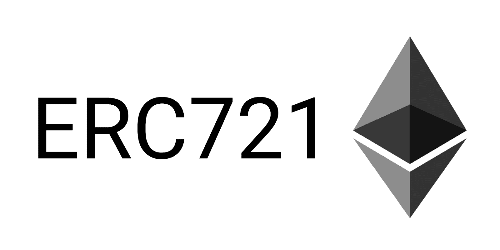

# ERC-721 令牌标准–如何转移 ERC721 令牌

> 原文：<https://moralis.io/erc-721-token-standard-how-to-transfer-erc721-tokens/>

代币是区块链和加密货币行业的核心。不过，还有代币，然后还有 ***代币*** **。令牌的两个主要类别是“可替换”和“不可替换”令牌(后者通常被称为** [**NFTs**](https://moralis.io/non-fungible-tokens-explained-what-are-nfts/) **)。此外，可替换令牌和 NFT 遵循不同的令牌标准。根据一般经验，以太坊网络上的可替换令牌使用** [**ERC-20 令牌**](https://moralis.io/how-to-send-erc-20-tokens/) **标准。同时，以太坊 NFT 通常遵循两个主要令牌标准之一。其中最常见的可能是 ERC721 令牌标准。此外，我们还将进一步了解创建 ERC721 令牌的过程，以及如何使用**[](https://moralis.io/)****传输 ERC721 令牌。****

**如果你想创建[dapp](https://moralis.io/decentralized-applications-explained-what-are-dapps/)(分散式应用)或任何类型的令牌，利用工具来加速开发过程是有益的。最突出的平台之一是 Moralis，它是区块链开发的主要 [Web3](https://moralis.io/the-ultimate-guide-to-web3-what-is-web3/) 操作系统。**

**传统上，后端开发是 Web3 和区块链开发的主要障碍。此外，这也是与 Web2 开发显著不同的部分。然而，这正是 Moralis 的切入点，它为用户提供已经开发好的后端基础设施。因此，该平台负责繁重的工作，让您专注于前端开发。**

**所以，如果你想开发 dApps 和代币，那么正确方向的第一步是[与 Moralis](https://admin.moralis.io/register) 签约。您不仅可以访问该平台的后端基础设施，还可以访问其他有用的工具，如 Moralis 的[终极 NFT API](https://moralis.io/ultimate-nft-api-exploring-moralis-nft-api/) ，Moralis 的[价格 API](https://moralis.io/introducing-the-moralis-price-api/) ，对 [IPFS](https://moralis.io/what-is-ipfs-interplanetary-file-system/) 的本地支持，等等！现在，让我们更深入地探讨一下 ERC721 令牌的主题，了解一下 ERC721 令牌到底是什么！**

## **什么是 ERC-721 代币？**

**ERC-721，或简称为 ERC721，指的是以太坊上的令牌标准。该名称代表“[以太坊征求意见稿 721](https://ethereum.org/en/developers/docs/standards/tokens/erc-721/) ”。描述这些资产的一个常见术语是“不可替代的令牌”，或 NFT。简而言之，“不可替代”意味着它们是独一无二的。随着人们开始猜测这些代币的价值，对 NFT 的兴趣在 2020 年呈指数增长。因此，这导致 ERC721 令牌比以往任何时候都更受欢迎。然而，ERC-721 令牌标准到底是什么，它意味着什么？**

**

ERC-721 标准允许应用程序在智能合约中利用标准[以太坊 API](https://moralis.io/ethereum-api-develop-ethereum-dapps-with-moralis/) 进行非功能性交易。例如，这些标准确保 NFTs 可以被传输和跟踪，从而确保正确记录谁拥有令牌。

ERC-721 令牌和 NFT 通常代表从物理和数字资产的几乎任何东西的所有权，使它们具有动态性和多样性。例如，它们可以代表虚拟收藏品，如 CryptoKitties，物理财产，如房屋，以及负价值资产，如债务。

然而，关于 NFTs 有一个重要的事实值得考虑，那就是契约本身不包含任何数据，比如图像。这方面的一个例子可能是数字艺术，如图像。图像或艺术品不存在于区块链上，但是令牌具有引用该图像的 ID。

这进一步意味着令牌有一个 ID 和某些元数据，并且该数据包含一个到其他地方托管的图像的链接。因此，NFT 令牌指向区块链以外的资源，并跟踪谁拥有链上的资产。然而，这并不是什么新东西，它的工作方式类似于房契；这份契约不包括这所房子；它只声明某人拥有财产。

## 如何制作一个 ERC721 令牌？

现在，我们对 ERC-721 令牌标准有了更好的了解，我们可以更仔细地看看如何创建一个 ERC721 NFT 的过程。创建一个 NFT 并不一定那么困难，对于这个任务，我们将会看到创建一个 dApp 的过程，这个 dApp 可以用来持续地创建 NFT。然而，由于本文的目的是简单地解释什么是 ERC721 令牌以及如何转移它们，所以我们不会过多地讨论这个过程。

由于我们将使用 Moralis 制作一个 ERC-721 令牌，该过程包括五个步骤:

1.  初始化 Moralis 并找到一个聪明的契约。
2.  建立一个 HTML 索引文件。
3.  创建登录功能。
4.  增加上传功能。
5.  构建一个 mint 函数。

实施这些步骤将导致 dApp 可以铸造不止一个 ERC-721 令牌。此外，因为我们在整个过程中与 Moralis 一起工作，所以几乎不需要预先开发技能。然而，最好有一些关于 JavaScript 的知识，因为这将有助于开发过程。

尽管如此，这些步骤非常简单，如果你想仔细看看，可以看看关于如何创建自己的 NFT 的文章。此外，你也可以从[Moralis 的 YouTube 频道](https://www.youtube.com/channel/UCgWS9Q3P5AxCWyQLT2kQhBw)中查看以下片段。这是完整过程的清晰而出色的视频指南:

https://www.youtube.com/watch?v=WdQHnb_5m5Q

## 如何转让 ERC721 代币？

有了 Moralis，用一行代码就可以传输几种不同类型的令牌。这很容易实现，因为该平台提供了预先开发的功能，在[开发 dapp](https://moralis.io/how-to-build-decentralized-apps-dapps-quickly-and-easily/)或转移令牌时可以派上用场。然而，在本例中，我们只是要进一步了解如何传输 ERC721 令牌。

我们可以在 [Moralis 的文档](https://docs.moralis.io/moralis-server/sending-assets)中找到转移任何类型代币的所有必要信息。在这里，我们可以从可替换、不可替换和半可替换令牌中进行选择，但是由于我们正在传输 ERC-721 令牌，所以这是我们想要选择的选项。因此，文档中的代码如下所示:

### 用于转移 ERC721 令牌的代码:

```js
// sending a token with token id = 1
const options = {type: "erc721",  
                 receiver: "0x..",
                 contractAddress: "0x..",
                 tokenId: 1}
let result = await Moralis.transfer(options)
```

如您所见，实际上有几行代码包含了传输 NFT 所需的特定信息。所以，让我们看看每一行代码都做了什么。首先，我们创建一个新的对象，在其中指定令牌的类型，在本例中是“ERC721”。接下来，我们还将指定接收方地址，这是您要传输 ERC721 令牌的位置。接下来，我们还指定了契约地址和令牌 ID。这些信息可通过 NFT 的元数据获得。

最后，当我们调用“Moralis.transfer()”函数时，我们接受对象并将其作为参数传递。就是这样；这就是我们在使用 Moralis 时转移 ERC-721 令牌所需要做的全部工作。

然而，在上面的例子中，我们需要手动输入关于令牌的信息。幸运的是，可以创建一个 dApp 来为您和您的用户解决这个问题。因此，如果你有兴趣了解更多这方面的知识，那么看看下面的视频:

https://www.youtube.com/watch?v=lhcy-pX0gEo&t=184s

## ERC 队以 721 比 1155 胜 ERC 队

ERC-721 标准的引入使以太网更加动态，并允许新的创新解决方案。例如，开发者可以利用该标准提高房地产市场的效率，或者将债券加入加密市场。然而，即使 ERC-721 标准使网络更加动态，它仍然有可能使以太坊的发展更加灵活。


ERC-721 令牌合同仅设计用于创建一种特定类型的 NFT，这在某些情况下限制了令牌的潜力。音乐会门票就是一个例子，因为 ERC-721 标准的局限性可能会成为问题。为此创建 NFT 意味着契约将包含映射到座位购买者的座位 id。到目前为止，一切顺利；然而，当我们有不止一场音乐会时，问题就出现了。如果我们有多个节目，那么这将意味着我们需要为每个新事件部署一个新的 ERC-721 令牌合同。

然而，出现了另一个令牌标准来解决这个问题。具体来说，这个标准被称为“ERC-1155”，甚至更具动态性。使用 ERC-1155 令牌标准，可以在一个智能合约中拥有多个不同的 NFT。此外，随着您的发展，还可以添加更多的 NFT。这意味着，在部署合同时，您不需要精确地决定您想要包括什么 NFT。因此，ERC-1155 令牌比 ERC-721 标准更加动态，可以处理更多的功能。

然而，这种动态性的缺点是 ERC-1155 令牌要复杂得多。因此，我们建议新开发人员开始开发 ERC721 令牌，因为它们更容易处理。

### 什么是 Moralis？

Moralis 是在钱包之间创建和发送 ERC721 代币的首要平台，还有许多其他功能。具体来说，Moralis 让您有可能节省时间和金钱，不仅是在 [NFT 令牌开发](https://moralis.io/nft-token-development-the-ultimate-guide/)中，而且在创建 dApps 时也是如此。


Moralis 平台的众多好处之一是用户可以访问已经开发的后端基础设施。这为你未来的区块链项目提供了一个更快的开发过程。此外，它也是基础设施以及 [Moralis 的 SDK](https://moralis.io/exploring-moralis-sdk-the-ultimate-web3-sdk/) ，使您只需一行代码就能传输令牌。

此外，该平台还提供了大量优秀的开发工具，使各种令牌和 dApps 的开发过程变得轻而易举。例如，你可以用[Moralis 快速节点](https://moralis.io/speedy-nodes/)轻松[构建 ETH dApps](https://moralis.io/how-to-build-eth-dapps-quickly/) 。然而，Moralis 的快速节点服务只是该平台的众多功能之一。

如果你想成为一名区块链开发者，我们强烈推荐你去看看 Moralis 博客。新鲜的、高质量的内容频繁发布，有助于你成为更好的开发者。例如，您可以查看解释用于区块链开发的[最佳语言](https://moralis.io/best-languages-for-blockchain-development-full-tutorial/)、[RPC 节点的限制](https://moralis.io/exploring-the-limitations-of-rpc-nodes-and-the-solution-to-them/)、[如何创建索引](https://moralis.io/how-to-create-a-dex-in-5-steps/)或[如何创建智能合同的文章。](https://moralis.io/how-to-create-smart-contracts/)

所以，如果你想开始 dApp 开发，第一步是注册 Moralis。加入该平台是免费的，只需几秒钟就可以设置您的帐户！

## ERC-721 令牌标准-摘要

令牌是区块链开发的基本特征，如果使用得当，它会非常强大。既然它们是如此突出的工具，就必须以某种方式对它们进行监管，这主要是通过某种标准来完成的。一个标准还确保了区块链网络的互操作性，例如，确保所有的令牌可以从一个钱包转移到另一个钱包。


以太坊的网络有几种不同的标准，最流行的是 ERC-20、ERC721 和 ERC-1155。ERC-20 令牌标准管理可替换令牌，ERC721 是 NFTs 的标准，ERC-1155 是半可替换令牌的标准。

ERC721 令牌标准为具有[智能合约](https://moralis.io/smart-contracts-explained-what-are-smart-contracts/)的令牌实现了一个 API。这确保了遵循该标准的所有代币都具有一些默认功能，允许用户和开发者[获得代币余额](https://moralis.io/how-to-get-nft-and-erc-20-token-balances-in-3-steps/)，转移代币等。此外，ERC721 令牌可以表示几乎任何东西，这使得它们非常动态。

此外，当使用 Moralis 的平台作为基础时，转移和创建 ERC721 令牌非常简单。例如，作为 Moralis 用户，只需一行代码就可以传输 ERC721、ERC-20 和 ERC-1155 令牌。

然而，这远远不是 Moralis 平台的极限，它允许你创建各种 dApps 和令人兴奋的区块链项目。此外，在众多优秀特性中，还有对[元掩码](https://moralis.io/metamask-explained-what-is-metamask/)的原生支持、 [React dApp 模板](https://moralis.io/react-dapp-template-how-to-build-a-react-dapp/)或[以太坊认证](https://moralis.io/ethereum-authentication-full-tutorial-to-ethereum-login-programming/)指南。这是一个广泛使用的加密钱包，作为以太坊 dapp 生态系统的网关，当你[创建以太坊 dapp](https://moralis.io/how-to-create-ethereum-dapps/)等时，它会派上用场。

因此，你绝对应该[马上和 Moralis](https://admin.moralis.io/register) 签约，就像 35，000 多个区块链项目一样。加入 Moralis 将提供对后端基础设施以及平台的广泛工具集的直接访问。**