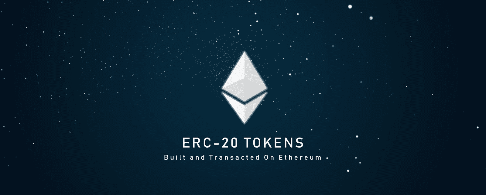
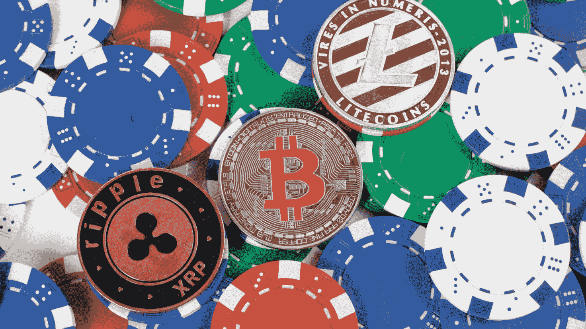
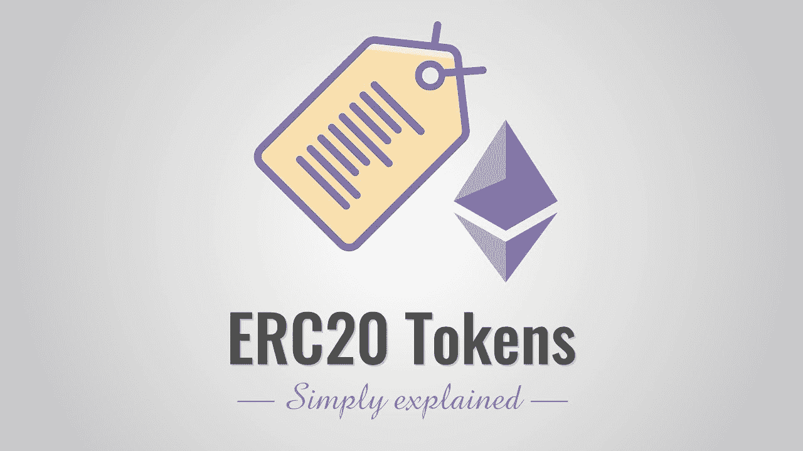
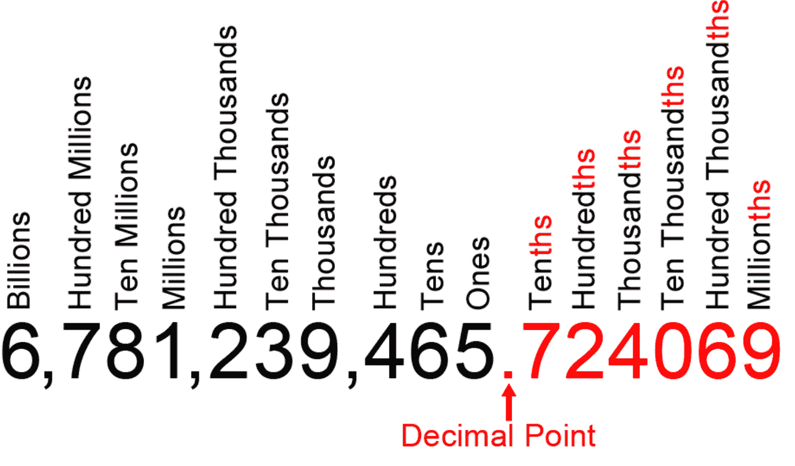
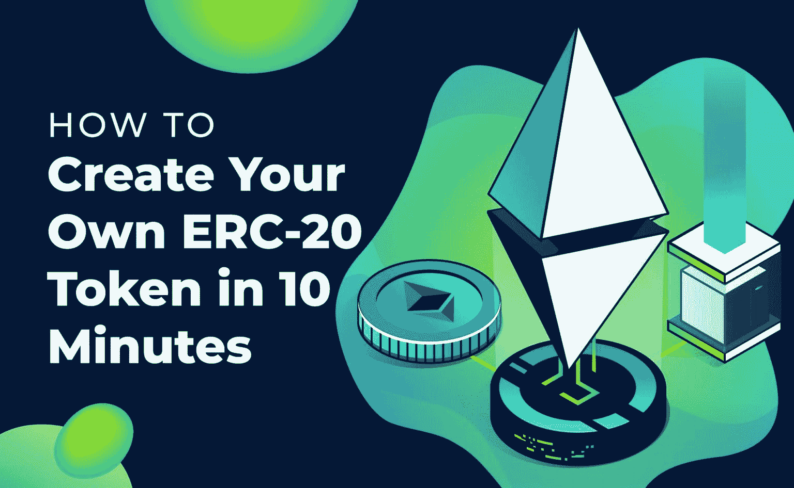

# ERC 20–探索 ERC-20 令牌标准

> 原文：<https://moralis.io/erc20-exploring-the-erc-20-token-standard/>

**由于** [**以太坊**](https://moralis.io/full-guide-what-is-ethereum/) **链的流行和可编程性，我们已经看到无数基于 ERC-20 令牌标准的令牌涌现出来。根据 Etherscan 的数据，目前有超过 450，000 份 ERC20 令牌合同。我们必须承认，这个数字是完全疯狂的；但是，您也应该记住，新的令牌仍然每天都在创建。ERC20 令牌的增加并不令人惊讶，因为许多程序员正在转向** [**以太坊开发**](https://moralis.io/ethereum-development-for-beginners/) **。因此，对于那些刚刚开始区块链之旅并希望进一步探索 ERC-20 令牌标准的人来说，这篇文章将被证明是有益的，因为它将扩展您的 ERC20 知识。**

如果你一直想知道 ERC20 到底是什么意思，那你来对地方了。在这里，我们将深入探讨 ERC-20 令牌标准。因此，我们会回答，“什么是 ERC20？”，“ERC20 代表什么？”甚至“如何[创建一个 ERC20 令牌](https://moralis.io/how-to-create-your-own-erc-20-token-in-10-minutes/)？”。对于后者，最快也是最简单的方法就是[创建你的免费 Moralis 账户](https://admin.moralis.io/register)。由于 [Moralis](https://moralis.io/) 是最终的 Web3 开发平台，创建 ERC20 令牌仅仅是个开始。

例如，有了 [Moralis Speedy Nodes](https://moralis.io/speedy-nodes/) 、 [Moralis 的 SDK](https://moralis.io/exploring-moralis-sdk-the-ultimate-web3-sdk/) 及其终极[以太坊 API](https://moralis.io/ethereum-api-develop-ethereum-dapps-with-moralis/) ，部署令牌的过程，包括[NFT](https://moralis.io/non-fungible-tokens-explained-what-are-nfts/)([ERC 721](https://moralis.io/erc-721-token-standard-how-to-transfer-erc721-tokens/)和 [ERC1155](https://moralis.io/erc1155-exploring-the-erc-1155-token-standard/) )，以及开发各种跨链可操作的[dapp](https://moralis.io/decentralized-applications-explained-what-are-dapps/)变得简单明了。此外，Moralis 的平台本质上是 crypto 的 Firebase，这意味着它提供了创建非凡的 dApps(分散应用程序)所需的所有必要工具。此外，你也可以使用最好的[以太坊 dApp 样板](https://moralis.io/ethereum-dapp-boilerplate-full-ethereum-react-boilerplate-tutorial/)，在创纪录的时间内准备好你的下一个 dApp。

## 探索 ERC-20 令牌标准-先决条件

在讨论 ERC-20 令牌标准之前，我们需要了解一些基础知识。因此，让我们来回答“什么是加密令牌？”首先。首先，现在我们有可替代和不可替代的代币。正如这两个经济术语所描述的那样，可互换代币是那些可以互换的代币。因此，同一种类的一个令牌本质上与另一个令牌相同。另一方面，不可替换令牌(NFT)包含唯一性，这意味着没有两个或更多的令牌是相同的。

此外，加密令牌可以表示来自数字和物理世界的各种事物，并且可以被分配不同种类的功能。本质上，它们是数字资产，也称为加密货币。此外，我们必须指出，虽然大多数人将所有加密货币称为令牌，但这在技术上是不正确的。例如，诸如 ETH、BTC、AVAX、SOL 等加密货币是其各自区块链的本地货币，被称为硬币或本地代币。

然而，在这些区块链(没有自己的区块链的项目)之上创建的加密货币被称为令牌。可以想象，在现有的区块链上创建代币要比创建本地加密硬币容易得多。后者显然需要您开发自己的区块链，或者至少派生一个现有的，这需要更高级的区块链开发技能。

## 什么是 ERC20？

ERC20 是最流行的令牌标准。它是可替换令牌的标准，确保所有令牌具有完全相同的质量。本质上，所有 ERC20 令牌都遵循以太坊链上 ETH 的本地令牌(或硬币)规范。此外，由于它们的可替换性，一个特定的 ERC20 令牌将始终具有与所有其他同类 ERC20 令牌相同的标准(使用相同的合同地址)。

ERC20 标准也被称为“ERC20 合同”。那是因为这个技术标准是由[智能合约](https://moralis.io/smart-contracts-explained-what-are-smart-contracts/)实现的。因此，ERC20 智能合约标准用于以太坊链上的所有智能合约，以实现可替换令牌。此外，由于智能合约本质上是预定的条件或规则，必须遵守这些条件或规则才能发生某个动作，所以 ERC20 合约标准确保在创建 ERC20 令牌时实施适当的规则。此外，只要智能合同实现了 ERC20 标准所要求的规则或方法，它本质上就是 ERC20 合同。

使用 ERC20 合同，开发人员可以准确预测他们的新 ERC20 令牌将如何在以太坊的生态系统中发挥作用。这对开发人员来说非常简单，因为他们知道只要遵循那些预定义的规则，他们部署的所有令牌都将按计划运行。此外，由于智能合同的性质，这些规则将自动实施。本质上，ERC20 契约实现了以太坊链上可替换令牌的 API。

有许多著名的加密货币使用 ERC20 合约标准。这些包括“创客”(MKR)、“基本注意力令牌”(BAT)、“奥格”(REP)、以及“OMG 网络”(OMG)，仅举几例。

### ERC20 代表什么？

如果您已经了解了上一节的细节，现在您应该能够回答“什么是 ERC20？”。然而，我们仍然没有告诉你 ERC20 代表什么。ERC20 代表“以太坊征求意见稿 20”。后者是由 Fabian Vogelsteller 在 2015 年 11 月提出的。如您所见，使用“ERC20”的缩写比使用完整且相当长的定义更实际。

## ERC20 标准规则

每个 ERC20 合约都由合约的地址和该地址可用的令牌总量来定义。但是，它也有一些可选组件。因此，为了向用户提供更多细节，也倾向于提供后者。ERC20 合约的可选组件包括代币的名称、符号和小数位数。让我们总结一下 ERC20 的细节:

*   合同地址(必需)。
*   代币的总供应量(基本)。
*   令牌名称(可选)。
*   令牌符号(ticker[可选])。
*   令牌的小数位数(可选)。

重要的是要记住，令牌契约没有“中央注册中心”，这意味着不能保证特定令牌名称或符号的唯一性。此外，我们拥有的一些最好的注册中心是受欢迎的网站，如 CoinMarketCap、Etherscan 和 MyEtherWallet。因此，用户应该在创建后请求将他们的令牌合同添加到这些站点中。

除了涵盖必需和可选的细节，ERC20 合同还确保了一组特定的功能。以下是 ERC20 令牌合约提供的最常见功能:

*   在不同账户之间转移代币。
*   获取特定帐户的当前令牌余额。
*   获取网络上可用令牌的总供应量。
*   批准第三方账户是否可以从特定账户消费若干代币。

## ERC20 合同项目

我们已经在上面列出了必需的和可选的细节。现在，让我们更仔细地看看每个可选项目。就名称和符号而言，事情很简单；然而，对小数的正确理解是非常重要的。正确理解这些组件非常重要，因为一旦部署了令牌契约，就无法更改这些细节。

### ERC20 合同–名称

令牌协定的名称相当简单，它是令牌协定的长名称。例如，假设我们的示例 ERC20 契约的名称是“我们的示例令牌”。至于名字的长度，没有限制。然而，开发人员应该记住，许多钱包应用程序会缩短长名称。因此，最好用一个更简洁的名字。

### ERC20 合同-符号

例如，代币合约的符号是指代币的报价机，类似于纳斯达克股票的报价机。这是大多数人会识别的令牌。按照我们的示例名称(“我们的示例令牌”)，最有意义的符号应该是“OET”。就像名字一样，符号也没有大小的限制；然而，大多数令牌有三个或四个字符。尽管许多项目基于它们的令牌名称的首字母来选择符号，但是并没有关于这个问题的规则。因此，名称和符号可以是不相关的。

### ERC20 合同–小数

当提到 ERC20 合同中的小数部分时，往往会有很多混淆。然而，没有必要这样做，因为它的要点很容易理解。总之，小数决定了一个令牌的可分性。该分量可以设置为零(不能被整除)或十八(可以被整除)。此外，如果需要，小数位数甚至可以高于 18；然而，情况很少如此。因此，开发人员必须事先决定他们希望他们的 ERC20 令牌有多少小数。当考虑到后者时，考虑令牌的用例是很重要的。

例如，让我们说一个令牌将作为一个特定软件的软件许可证分配。在这种情况下，拥有一小部分令牌就意味着拥有一小部分许可证，这毫无意义。因此，使用零小数将是这种性质的表征的方式。

另一方面，让我们考虑一个代表实物黄金所有权的令牌。此外，让我们假设代币创建者决定他们希望代币的单位代表一公斤黄金。此外，让我们假设他们希望他们的代币持有者持有和交易不少于一克当量的黄金。如果是这样的话，它们会有三位小数(1 克= 0.001 千克)。

考虑到这两个例子，您可以看到，在考虑代币价值的单位时，选择小数位数是很容易确定的。如果单位的分数有意义，最好以此为指导:单位的值越高，小数位数越大。

## 如何创建 ERC20 令牌？

此时，您知道要创建自己的 ERC20 令牌，需要使用智能合约。当然，您总是可以创建自己的符合 ERC20 标准的通用指南的 ERC20 合同；然而，有一个更快更简单的方法。如今，许多开源平台为您提供了各种代码模板，包括智能合约。例如，您可以访问 OpenZeppelin 来获取与 ERC20 相关的合同模板。您可以通过使用强大的工具来部署令牌，如 [Remix](https://moralis.io/remix-explained-what-is-remix/) 来进一步简化事情。

您还需要一个代码编辑器(比如 Visual Studio 代码)、一个[节点](https://moralis.io/node-js-explained-what-is-node-js/)，以及一种认证链上交易的方法([以太坊认证](https://moralis.io/ethereum-authentication-full-tutorial-to-ethereum-login-programming/))。幸运的是，您可以用 Moralis 快速节点来满足您的节点需求。此外，认证很简单，因为 Moralis 默认集成了[元掩码](https://moralis.io/metamask-explained-what-is-metamask/)。

有了这些工具，您可以在几分钟内[创建自己的 ERC-20 令牌](https://moralis.io/how-to-create-your-own-erc-20-token-in-10-minutes/)，这个过程从完成以下四个步骤开始:

1.  建立一个 Moralis 快速节点。
2.  导入一个 OpenZeppelin 包/添加一个 pragma 行。
3.  创建一个象征性契约。
4.  测试合同是否正常工作。

如果您想观看展示如何详细完成这些步骤的深入视频，请务必观看以下视频:

https://youtu.be/KNBneUpFaGo

## ERC 20–探索 ERC-20 令牌标准–摘要

知识就是力量，你现在知道的足够正确使用 ERC20 代币了。在本文中，您已经学习了加密令牌的基础知识、令牌和硬币之间的区别，以及关于 ERC20 合约的一些细节。例如，在部署 ERC20 合同时，您知道哪些细节是重要的，哪些不是。此外，您知道 ERC20 令牌的名称和符号并不重要，但强烈建议使用。此外，根据您项目的具体情况，您已经了解了小数以及如何正确设置它们。此外，您还将在几分钟内了解创建自己的 ERC20 令牌所需的步骤和工具。有了这些，你就可以开始自己的以太坊开发项目了。

除了在包括以太坊、 [BSC](https://moralis.io/bsc-programming-guide-intro-to-binance-smart-chain-development-in-10-minutes/) 、[、雪崩](https://moralis.io/how-to-build-avalanche-dapps-in-minutes/)和[多边形](https://moralis.io/how-to-create-a-polygon-token/)在内的几个领先链上创建可替换代币之外，你还可以使用 Moralis 来应对各种区块链开发挑战。由于 NFT 现在非常流行，你可能想要[开发你自己的 NFT 市场](https://moralis.io/develop-your-own-nft-marketplace-step-by-step-guide/)或者简单地创建一个 [OpenSea 克隆](https://moralis.io/opensea-clone-create-an-nft-marketplace-like-opensea/)，或者学习[生成和铸造 NFT](https://moralis.io/nft-generate-and-mint-how-to-generate-non-fungible-tokens/)。此外，构建您的第一个 dApp 的时机从未如此之好，有了 Moralis 的支持，您可以通过五个简单的步骤创建一个 DeFi 仪表板。此外，通过在 Moralis 的帮助下进行开发，您将不会局限于单个链，因为它的基础中已经建立了跨链的互操作性。这样，您可以先创建以太坊 dApps，然后通过简单的点击将它们部署到其他链中。

如果你想成为一名区块链开发者，我们建议你去看看 T2 的 Moralis YouTube 频道和 T4 的 Moralis 博客，在那里你会找到大量免费的有价值的内容。此外，你可以考虑报名参加[Moralis 学院](https://academy.moralis.io/)。

