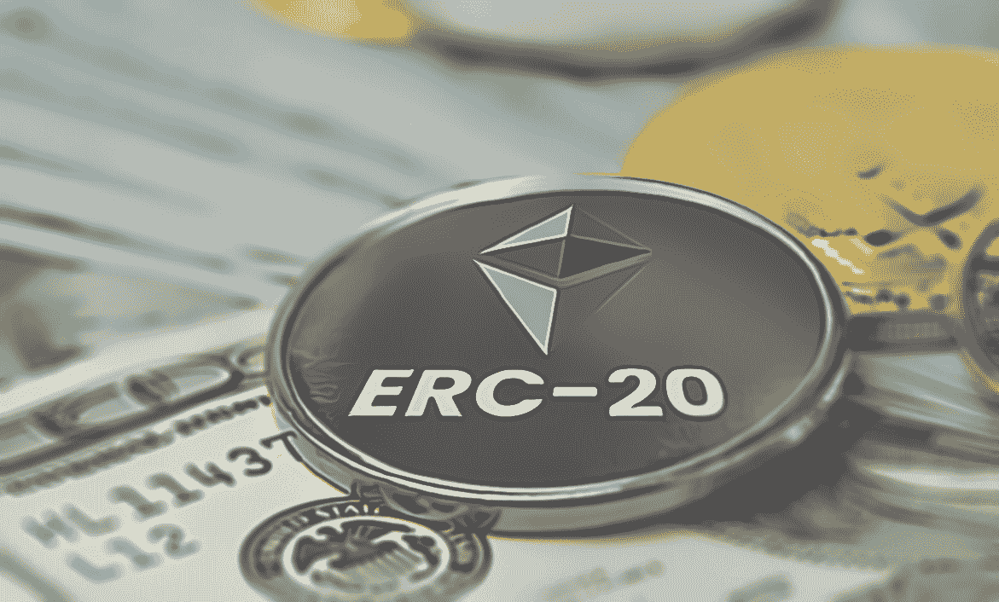
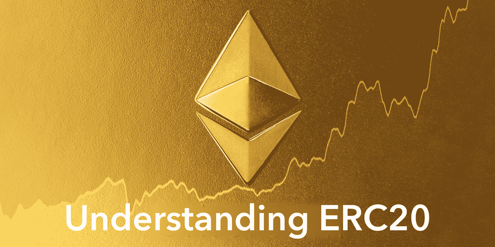
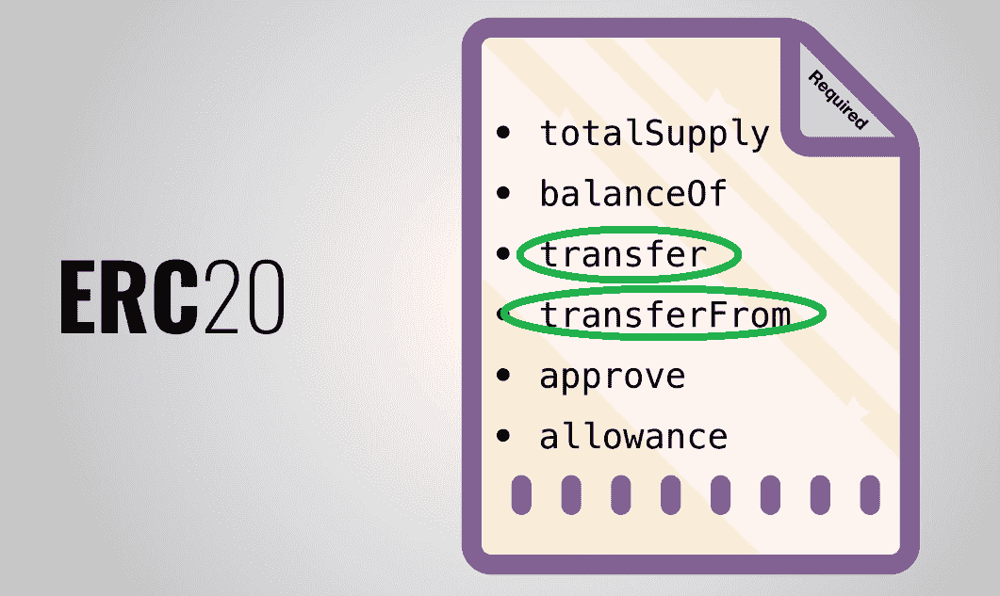
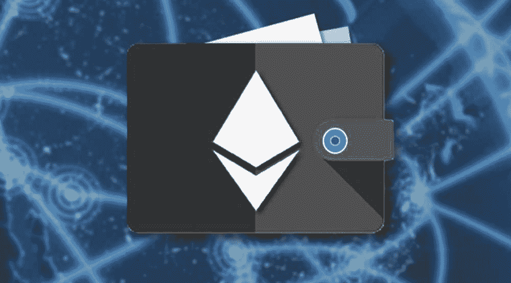
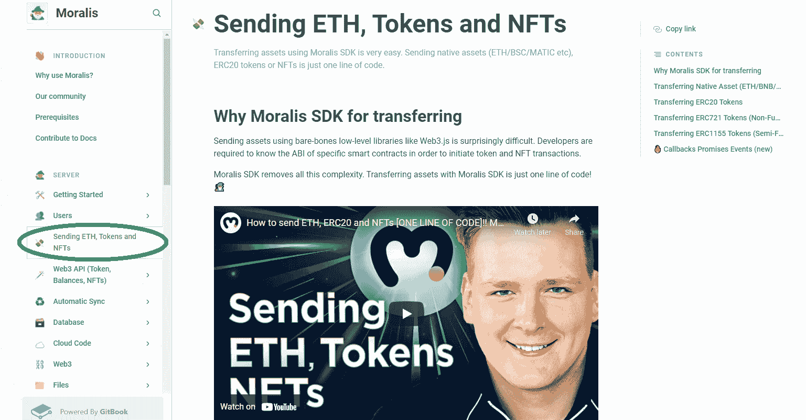
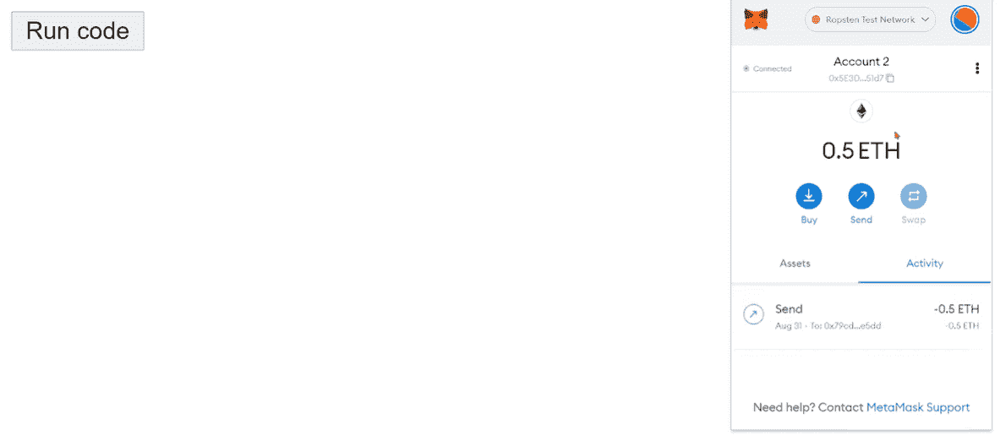
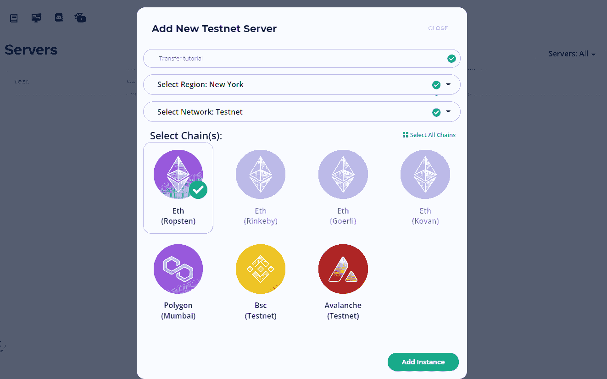

# ERC20 转让–如何转让 ERC20 代币

> 原文：<https://moralis.io/erc20-transfer-how-to-transfer-erc20-tokens/>

即使你刚刚涉足加密海洋，你也会听说过 [**ERC20**](https://moralis.io/erc20-exploring-the-erc-20-token-standard/) **代币。由于** [**以太坊**](https://moralis.io/full-guide-what-is-ethereum/) **是第一个可编程的加密货币链，无数项目将自己的代币建立在这个区块链之上。因此，我们现在有很多其他著名的 ERC20 令牌，它们背后都有有趣的概念甚至实际的用例。记住这一点，了解 ERC20 转移的来龙去脉非常重要。这不仅会改善您自己的用户体验，而且还会使您提高您的区块链开发水平。幸运的是，我们为您提供了一个非常棒的工具，让开发人员只需几行代码就可以实现 ERC20 传输。那么，你准备好学习如何转移 ERC20 代币了吗？**

接下来，我们将首先回答“什么是 ERC20？”，然后介绍 ERC20 传输的详细信息。此外，你将学习如何使用 [Moralis](https://moralis.io/) (又名 [Firebase for crypto](https://moralis.io/firebase-for-crypto-the-best-blockchain-firebase-alternative/) )毫不费力地转移 ERC20 令牌。这个终极的 Web3 开发平台带有一个完整的 [Web3 SDK](https://moralis.io/exploring-moralis-sdk-the-ultimate-web3-sdk/) ，包括 [Web3 API](https://docs.moralis.io/moralis-server/web3-sdk/intro) 。后者使您能够在几分钟内构建出令人惊叹的 dApps(分散式应用),并轻松整合各种功能，包括 ERC20 传输功能。此外，您可以使用 Moralis 进行 [NFT 令牌开发](https://moralis.io/nft-token-development-the-ultimate-guide/)，用于 [ERC721](https://moralis.io/erc-721-token-standard-how-to-transfer-erc721-tokens/) 和 [ERC1155](https://moralis.io/erc1155-exploring-the-erc-1155-token-standard/) 标准。

此外，Moralis 还具有跨链互操作性，因此它使您能够超越以太坊链。已经为各大知名连锁([币安智能连锁](https://moralis.io/bsc-programming-guide-intro-to-binance-smart-chain-development-in-10-minutes/)、[多边形](https://moralis.io/how-to-build-polygon-dapps-easily/)、[雪崩](https://moralis.io/how-to-build-avalanche-dapps-in-minutes/)等)提供全面支持。)并定期添加新的。因此，您可以跨多个链部署 dApps，而无需花费额外的时间或资源。此外，这种跨链的互操作性也使您的工作经得起未来的考验。因此，请务必今天就[创建您的免费 Moralis 账户](https://admin.moralis.io/register)！



## 什么是 ERC20？

如果您想正确理解和使用 ERC20 传输功能，您需要知道 ERC20 是什么。首先，ERC20 是最著名、传播最广的可替换令牌标准。其目的是确保以太坊链上的所有可替换代币具有完全相同的质量，遵循 ETH 的本地代币(或硬币)规范。因此，根据其可替换性，任何特定的 ERC20 令牌将始终具有与所有其他同类 ERC20 令牌相同的标准(使用相同的合同地址)。例如，这里的一个链接令牌将始终与那里的一个链接相同。除了代表加密货币，ERC20 代币还可以是公司股票、忠诚度积分、黄金证书等等。

此外，为了避免任何不必要的混淆，请记住，我们也将 ERC20 标准称为“ERC20 合同”。这样命名的原因在于，[智能合约](https://moralis.io/smart-contracts-explained-what-are-smart-contracts/)使用了这一技术标准。因此，ERC20 智能合约标准是以太坊链上所有其他智能合约实现可替换令牌的机制。

智能合约本质上是发生某个动作时要遵循的条件或规则。因此，ERC20 合同标准确保在创建 ERC20 令牌时应用正确的规则。也就是说，实现了 ERC20 标准所要求的规则或方法的智能合约本质上是 ERC20 合约，这也是合乎逻辑的。如果您想了解更多关于 ERC20 标准的细节，请使用本文第一句中的链接。



# ERC20 转移说明

当谈到 ERC20 转让讨论时，我们必须告诉您有两种类型的转让，都包含在 ERC20 智能合同中。对于从总供应(它用来铸造令牌的地址)到用户的令牌，我们有“transfer ”,以及“transferFrom ”,我们用来在任意两个用户之间转移令牌。作为可能创建新的 ERC20 令牌的开发人员，您需要熟悉这两种传输；然而，对于大多数 dApps 来说，您将关注“转移自”功能。事实上，稍后，我们还将在其中一个[以太坊测试网](https://moralis.io/ethereum-testnet-guide-connect-to-ethereum-testnets/)上构建一个非常简单的示例 dApp，它将向您展示使用 Moralis 来传输 ETH 是多么简单。此外，完全相同的原则可用于将 ERC20 传输纳入您的 dApp。



## ERC20 传输

如果没有 Moralis 的 SDK，你需要使用 Web3.js 等基本的低级库以分散的方式发送资产。后者使编程这个看似简单的功能变得非常具有挑战性。在其他细节中，开发人员应该知道特定智能合约的 ABI，以启动 ERC20 转移。NFT 交易也是如此。然而，有了 Moralis 的支持，您可以通过几行代码跳过所有的复杂性。Hack，在 ETH 传输的情况下，你只需要一行代码。为了能够自己使用这个令人敬畏的工具，请确保在继续之前创建您的免费 Moralis 账户。

### 我能从哪里转移 ERC20 代币？

现在您已经清楚地了解了什么是 ERC20 转账，我们可以回答“我可以从哪里转账 ERC20 代币？”。唯一合乎逻辑的是，你不能把东西从它不在的地方送出去。然而，一个地址可以接收 ERC20 令牌，即使它还没有 ERC20 令牌，假设它是 ERC20 兼容的。注意，所有以太坊钱包地址都是 ERC20 兼容的。此外，这意味着每次 ERC20 传输都可以在两个以太坊钱包地址或 ERC20 兼容地址之间进行。这通常包括所有 EVM 兼容的区块链。



当涉及到 ERC20 令牌转移的以太坊钱包地址时，您也可以使用集中交易所(cex)并通过您的帐户访问它们的钱包地址。然而，对于区块链开发人员来说，使用 CEXs 通常不是一个选项。

幸运的是，有几个热门钱包提供了很好的用户体验。说到 ERC20 标准， [MetaMask](https://moralis.io/metamask-explained-what-is-metamask/) 拥有最好的跟踪记录，并支持最广泛的令牌。幸运的是，它完全集成了 Moralis。因此，人们可以用它来进行[以太坊认证](https://moralis.io/ethereum-authentication-full-tutorial-to-ethereum-login-programming/)并确认每一次 ERC20 传输。此外，元掩码是如此重要的工具，以至于它是用 Moralis 开发的两个先决条件之一。*另一个是*[*JavaScript*](https://moralis.io/javascript-explained-what-is-javascript/)*熟练度。*解释完之后，让我们看看如何转移 ERC20 令牌的细节。

## 如何转移 ERC20 代币

使用元掩码发送 ERC20 令牌非常容易。你只需要粘贴 ERC20 地址，确保你有足够的 ETH 覆盖交易费用，点击“发送”按钮。但是如何在您的 dApp 内转移 ERC20 令牌呢？为了向您展示 Moralis 如何轻松地进行传输集成，我们将查看一个示例项目，其中我们使用 Moralis SDK 为 ETH 传输创建了一个非常简单的 dApp。



如前所述，Moralis 提供了业内最整洁的文档之一。它为您提供了详细的解释、示例和您可能需要的所有代码片段。出于集成 ERC20 传输的目的，您需要使用 [Moralis 文档](https://docs.moralis.io/)的“[发送 ETH、令牌和 NFTs](https://docs.moralis.io/moralis-server/sending-assets) 部分。在那里，您将找到传输本机资产、ERC20 令牌和 NFT 所需的代码行(如下所示)。

*   **原生资产(如:ETH)转让:**

```js
// sending 0.5 ETH
const options = {type: "native", amount: Moralis.Units.ETH("0.5"), receiver: "0x.."}
let result = await Moralis.transfer(options)
```

*   **ERC20 传送**:

```js
// sending 0.5 tokens with 18 decimals
const options = {type: "erc20", 
                 amount: Moralis.Units.Token("0.5", "18"), 
                 receiver: "0x..",
                 contractAddress: "0x.."}
let result = await Moralis.transfer(options)
```

*   **ERC721 转账:**

```js
// sending a token with token id = 1
const options = {type: "erc721",  
                 receiver: "0x..",
                 contractAddress: "0x..",
                 tokenId: 1}
let result = await Moralis.transfer(options)
```

*   **ERC1155 转账:**

```js
// sending 15 tokens with token id = 1
const options = {type: "erc1155",  
                 receiver: "0x..",
                 contractAddress: "0x..",
                 tokenId: 1,
                 amount: 15}
let result = await Moralis.transfer(options)
```

查看上面的代码行，您会发现在大多数情况下，您只需要指定一两个参数。然而，当涉及到 ERC20 传输时，您还需要添加接收者的地址和令牌的地址。

### ERC20 转移–一个示例项目

为了使用 Moralis 创建 dApp，您需要完成初始设置，包括创建您的 Moralis 服务器。但在您继续之前，让我们来看一个简单 dApp 的屏幕截图，您可以与我们一起创建它来练习使用 Moralis SDK for ETH 和 ERC20 传输选项:



#### 初始设置–创建 Moralis 服务器

在进行下面视频中的示例项目之前，请遵循以下 Moralis 设置步骤:

1.  创建你的免费 Moralis 账户-如果你还没有创建你的免费 Moralis 账户，现在就创建吧。按照简介末尾的链接，输入您的电子邮件地址，创建您的密码，然后单击将发送到您的电子邮件的确认链接。另一方面，如果你已经有一个 Moralis 账户，只需[登录](https://admin.moralis.io/login)到你的管理区。

2.  [**创建 Moralis 服务器**](https://docs.moralis.io/moralis-server/getting-started/create-a-moralis-server)–在您的 Moralis 管理区域内，导航至“服务器”选项卡，然后单击右上角的“+创建新服务器”按钮(见下图)。接下来，从下拉菜单中选择最适合您需求的网络类型。*为了我们的示例项目，我们将使用 Ropsten，因此选择“Testnet 服务器”选项。然而，当您准备好部署功能性 dApps 时，您需要选择“Mainnet 服务器”。*


接下来，输入服务器名称(这可以是您想要的任何名称)，选择您所在的地区，选择网络类型、链，然后通过单击“添加实例”启动您的服务器:



3.  **访问服务器详细信息**–您需要您的服务器的详细信息(服务器 URL 和应用程序 ID)来访问 Moralis 的后端功能。一旦您的服务器处于活动状态，您就可以通过单击“查看详细信息”按钮来访问它:


您将在新窗口中看到所有的详细信息。在那里，您可以通过单击复制图标来简单地复制它们(一个接一个):


4.  **初始化 Moralis 规范**–使用上一步中复制的细节来填充您的编码文件(".html“，“. js”，”。jsx”，或者”。env "如果使用终极[以太坊 dApp 样板](https://moralis.io/ethereum-dapp-boilerplate-full-ethereum-react-boilerplate-tutorial/)):


#### 从 ETH 到 ERC20 传输

您的服务器已经启动并运行，其详细信息由您处理，您已经准备好按照 Moralis 专家的指导来使用 Moralis。从 1:25 开始使用下面的视频:

https://www.youtube.com/watch?v=suZYvqrc_Hg

上面的视频将指导您完成实施 ETH 传输功能所需的步骤。然而，我们鼓励你更进一步。具体来说，使用“ERC20 传输”代码片段来创建 ERC20 传输 dApp。如果你想让事情更上一层楼，可以尝试一下[跟踪 ERC20 事件](https://docs.moralis.io/guides/deploy-and-track-erc20-events)的功能。

## ERC20 转移–如何转移 ERC20 令牌–摘要

你现在知道什么是 ERC20，以及 ERC20 转让的所有细节。此外，您还知道如何使用不同的公开可用工具转移 ERC20 令牌。元掩码对于区块链开发人员来说是一个方便的选择。此外，您已经看到了使用 Moralis 服务器向您的 dApp 添加 ERC20 传输功能是多么简单。

如果你想进一步提高你的加密编程，请访问[Moralis 利斯的 YouTube 频道](https://www.youtube.com/c/MoralisWeb3)和[Moralis 利斯的博客](https://moralis.io/blog/)。这两个渠道都为你提供了大量的免费内容。这有助于解释不同的区块链开发概念，并指导您完成各种示例项目。一些最新的文章向您展示了如何[连接到 Arbitrum 节点](https://moralis.io/full-guide-how-to-connect-to-arbitrum-nodes/)，如何[连接到雪崩节点](https://moralis.io/how-to-connect-to-avalanche-nodes/)，如何[构建 NFT 交易界面](https://moralis.io/build-an-nft-trading-interface-full-guide/)，如何[构建以太坊 dApps in Angular](https://moralis.io/how-to-build-ethereum-dapps-in-angular/) ，如何[构建跨链桥](https://moralis.io/how-to-build-a-cross-chain-bridge/)，h [如何进行闪贷](https://moralis.io/how-do-flash-loans-work-full-walkthrough/)，如何在以太坊上进行[无气交易](https://moralis.io/how-to-do-gasless-transactions-on-ethereum/)， 如何使用一个 [OpenSea API 替代品](https://moralis.io/opensea-api-alternative-list-nfts-with-this-opensea-plugin/)，如何[在几分钟内创建一个 DAO](https://moralis.io/how-to-create-a-dao-in-10-minutes/) ，如何[构建一个预测市场 dApp](https://moralis.io/how-to-build-a-prediction-market-dapp/) ，等等。

然而，如果你刚刚开始，我们建议探索为初学者开发的[以太坊](https://moralis.io/ethereum-development-for-beginners/)，或者为初学者开发的 [NFT 编程](https://moralis.io/nft-programming-for-beginners/)，以防你对不可替代的代币更感兴趣。尽管如此，如果你渴望[尽早成为一名区块链开发者](https://moralis.io/how-to-become-a-blockchain-developer/)，一定要报名参加[Moralis 学院](https://academy.moralis.io/)。对于那些还不精通 JavaScript 的人来说，“ [2021 区块链开发者 JavaScript 编程](https://academy.moralis.io/courses/javascript-programming-for-blockchain-developers)”课程应该是一个很好的选择。

