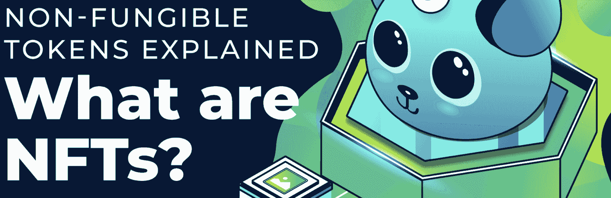
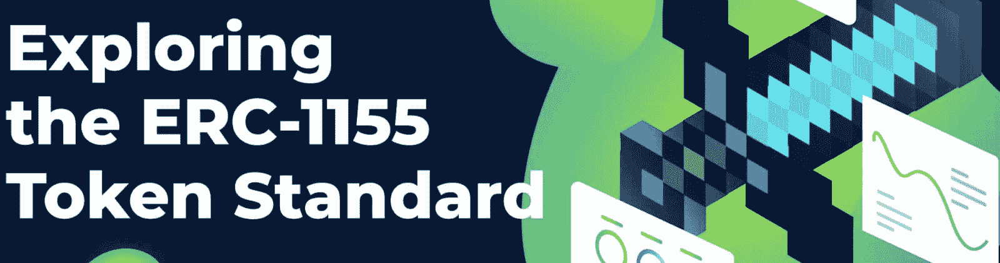

# ERC721 合同–探索 ERC721 智能合同

> 原文：<https://moralis.io/erc721-contract-exploring-erc721-smart-contracts/>

谈论 crypto 和 Web3 而不谈论令牌几乎是不可能的。此外，令牌通常分为两个独立的类别:可替换令牌和不可替换令牌(NFT)。可替换令牌和非功能性令牌都具有巨大的潜力，是当前 [**Web3**](https://moralis.io/the-ultimate-guide-to-web3-what-is-web3/) **生态系统的基本要素。因此，作为强大的功能，有一个规范的标准使这些令牌普遍兼容是有益的。可替换令牌最流行的监管标准是以太坊的** [**ERC20**](https://moralis.io/erc20-exploring-the-erc-20-token-standard/) **标准，对于 NFTs，则是 ERC721。在本文中，我们将关注 NFTs，这意味着我们将更仔细地了解 ERC721 合同标准。此外，在探索 ERC721 智能合约的同时，我们将简要介绍 NFT 以及使用** [**Moralis 规范**](https://moralis.io/) **创建 ERC721 令牌的必要步骤。**

Moralis 是 Web3 开发的最佳操作系统，作为用户，你将能够轻松地创建 NFT 和可替换令牌。事实上，有了 Moralis，我们所有未来区块链项目的平均开发时间有可能减少大约 87%！

节省如此大量时间的可能性部分源于 Moralis 为所有用户提供的已经开发的后端基础设施。这与诸如 [Moralis Speedy Nodes](https://moralis.io/speedy-nodes/?utm_source=blog&utm_medium=post&utm_campaign=How%2520to%2520Build%2520Decentralized%2520Apps%2520%28dApps%29%2520Quickly%2520and%2520Easily) 、 [NFT API](https://moralis.io/ultimate-nft-api-exploring-moralis-nft-api/) 、 [Price API](https://moralis.io/introducing-the-moralis-price-api/) 、Web3UI kit 等开发工具一起，使得 Web3 开发变得更加容易。

所以，如果你想成为一名更好的区块链开发者，你旅程的下一步就是加入 Moralis。创建一个帐户是完全免费的，它将提供对该平台所有工具的即时访问。

## 什么是 ERC721 合同？

ERC721 协定本质上是一个实现 ERC721 标准的智能协定。因此，我们需要回答的理解 ERC721 合同的真正问题是“什么是 ERC721 标准？”。


ERC721 代表“以太坊征求意见稿 721”，它为以太坊生态系统引入了一个 NFTs 标准。该标准确保源自 ERC721 协定的令牌实现最小接口。因此，它确保所有的代币都可以在帐户之间转移，可以获取代币余额，检查代币的总供应量，等等。此外，要被称为 ERC721 协定，它必须实现以下事件和方法:

**事件**:

```js
    event Transfer(address indexed _from, address indexed _to, uint256 indexed _tokenId);
    event Approval(address indexed _owner, address indexed _approved, uint256 indexed _tokenId);
    event ApprovalForAll(address indexed _owner, address indexed _operator, bool _approved);
```

**方法**:

```js
    function balanceOf(address _owner) external view returns (uint256);
    function ownerOf(uint256 _tokenId) external view returns (address);
    function safeTransferFrom(address _from, address _to, uint256 _tokenId, bytes data) external payable;
    function safeTransferFrom(address _from, address _to, uint256 _tokenId) external payable;
    function transferFrom(address _from, address _to, uint256 _tokenId) external payable;
    function approve(address _approved, uint256 _tokenId) external payable;
    function setApprovalForAll(address _operator, bool _approved) external;
    function getApproved(uint256 _tokenId) external view returns (address);
    function isApprovedForAll(address _owner, address _operator) external view returns (bool);
```

ERC721 和其他类似标准的主要目的是通过提供这个最低标准接口为令牌创建一个基础。然而，该标准并不限制在原始界面上添加额外的功能层。因此，这个监管的 ERC721 合同标准为 NFTs 带来了一些稳定性和统一性。

尽管这个标准起源于以太坊，但它并不普遍局限于这个区块链。事实上，利用 [EVM](https://moralis.io/evm-explained-what-is-ethereum-virtual-machine/) (以太坊虚拟机)的链一般也兼容 ERC721 契约。所以，如果你的目标是学习更多关于 ERC721 标准的知识，你不会把自己局限在[以太坊](https://moralis.io/full-guide-what-is-ethereum/)网络。

然而，为了进一步理解 ERC721 合同标准，我们将在下一节中解释什么是 NFT，以及为什么它们在过去几年中如此受欢迎。

### 什么是 NFT？

在今天这个时代，你可能听说过 NFTs。然而，如果你仍然一无所知，不要担心；我们抓住你了。因此，在本节中，我们将解释什么是 NFT，并提供一些见解，为什么这些令牌已成为密码行业内最热门的趋势之一。



“可替代”一词源于传统经济学，描述的是不唯一的资产。因此，这表明可替代资产具有相同的价值和属性。这里的一个例子是货币；一美元与另一美元价值相同，并具有相同的特征。

另一方面，我们发现“不可替代”的资产具有独特的特征。传统经济学的一个例子是房地产。几乎所有的房子都是独一无二的，不可能没有补偿地以一换一。因此，这表明 NFT 是完全唯一的令牌。由于它们的独特性，NFT 是表示不可替代资产的理想选择。

然而，从中得出的一个重要结论是，NFT 仅代表资产的所有权。为了说明这一点，我们可以用数字艺术作为例子。NFT 一般不包含特定的艺术作品；然而，它确实指向特定的东西，比如图像。这堪比房契。契约本身并不包含财产，但提到了一个特定的房子和它的主人。

尽管如此，如果您想了解更多关于 NFT 的知识，请阅读下面的文章，这篇文章更详细地解释了这些令牌:“[什么是 NFT？](https://moralis.io/non-fungible-tokens-explained-what-are-nfts/)”。此外，如果你对 NFTs 有进一步的兴趣，我们也建议查看关于[如何懒惰制造 NFTs](https://moralis.io/how-to-lazy-mint-nfts/) 的教程。

### 什么是智能合约？

本质上，[智能合同](https://moralis.io/smart-contracts-explained-what-are-smart-contracts/)是双方之间的成文协议。因此，智能合同与传统合同没有太大区别；然而，关键的区别在于，区块链上的代码管理条款和条件，而不是第三方参与者。而且 dApp 开发最流行的链是以太坊。因此，我们将使用以太坊合同作为一个例子，使这种解释更容易理解。


以太坊契约由两部分组成:数据和代码。该数据被认为是契约的状态；同时，代码是函数的集合。所有这些合同都存在于特定地址的链上。与此同时，他们也是一种类型的帐户。由于它们是账户，每个合同都有可能进行交易和持有资金。然而，智能合约是由代码管理的，而不是由用户管理的。

智能合约一般是用 Solidity 的编程语言编写的。所以，如果你想进入区块链开发，掌握这种语言是有益的。此外，如果你感兴趣，你可以在 Moralis 阅读更多关于区块链发展的最佳语言。

此外，如果你想要一个关于创建智能合同的全面指南，请随意仔细阅读关于如何创建智能合同的教程。

## 探索 ERC721 合同

本节将详细介绍 ERC721 合同及其构造方式。此外，ERC721 合同标准可能相当复杂，至少与 ERC20 相比是如此。这种复杂性源于这样一个事实，即该标准有多个可选的扩展，并且被划分到多个契约中。此外，关于如何将这些结合起来，也有很大程度的灵活性。

我们现在将仔细研究一个简单的 ERC721 令牌契约，我们可以用它来跟踪游戏物品。事不宜迟，ERC721 合同可能是这样的:

```js
// contracts/GameItem.sol
// SPDX-License-Identifier: MIT
pragma solidity ^0.6.0;

import "@openzeppelin/contracts/token/ERC721/ERC721.sol";
import "@openzeppelin/contracts/utils/Counters.sol";

contract GameItem is ERC721 {
    using Counters for Counters.Counter;
    Counters.Counter private _tokenIds;

    constructor() public ERC721("GameItem", "ITM") {}

    function awardItem(address player, string memory tokenURI)
        public
        returns (uint256)
    {
        _tokenIds.increment();

        uint256 newItemId = _tokenIds.current();
        _mint(player, newItemId);
        _setTokenURI(newItemId, tokenURI);

        return newItemId;
    }
}
```

首先，ERC721 契约指定了应该使用哪个版本的 [Solidity](https://moralis.io/solidity-explained-what-is-solidity/) 来编译契约。这是在上面代码的第一行完成的，它当前指定所有比“0.6.0”新的版本都是兼容的。代码继续进行一些导入。最重要的是“ERC721”，它包括所有标准扩展。

在这之后，我们有了契约本身，在上面的例子中，它被称为“GameItem”。接下来是一个简单的构造函数和一个给玩家奖励物品的函数。每当调用该函数时，它都会为该项目铸造一个令牌，并将其发送给播放器。然而，这只是对 ERC721 合同可能的简要概述。你自己还有很多需要发现的，你可以修改合同来满足你的需要。

### 如何创建 ERC721 令牌

既然您现在对什么是 ERC721 合同以及该标准需要什么有了更好的理解，我们将向您简要概述创建 ERC721 令牌或 NFT 的重要步骤。这将概述创建 NFT 铸币 dApp 的过程，该 dApp 可用于连续铸造代币。因此，这些是必要的步骤:

1.  初始化 Moralis 并获取 ERC721 智能合约。
2.  用 HTML 构建 dApps 的内容。
3.  添加登录功能。
4.  创建上传功能。
5.  创造一个新的功能。

如果您还没有，第一步是创建一个 Moralis 帐户，因为这对于应用程序的运行至关重要。在此之后，我们必须获得一个适合我们需求的智能合同。根据您的偏好，可能已经有可供您使用的合同，这表明您不需要从头开始创建合同。

接下来，我们还需要使用 HTML 代码来构建 dApp 的内容。然而，作为一名开发人员，如何组织内容取决于您，因为您决定如何设计 dApp 的前端。

最后三个步骤围绕着三个基本功能的实现。然而，由于这不是一个关于创建 ERC721 令牌的教程，我们将不再深入探讨。但是，如果你对更广泛的指南感兴趣，请随意查看关于如何创建自己的 NFT 的文章。

如果你喜欢视频指南，请收听 YouTube 频道，仔细看看下面的视频。这更详细地解释了整个过程:

https://www.youtube.com/watch?v=WdQHnb_5m5Q

## ERC721 与 ERC1155 合同

ERC721 标准是第一个广泛应用于 NFTs 的标准，也是最受认可的标准。该标准从技术上定义了智能合约需要实现的最小接口。这允许根据合同创建的令牌被拥有、交易和管理。这只是最低要求，并不限制添加额外的功能来补充需求。然而，即使 ERC721 合同标准为以太坊的发展增加了一些灵活性，它仍然有可能在相同的方向上取得进一步的进展。



ERC721 代币合约仅设计用于铸造一种特定类型的 NFT。在某些情况下，这可能会限制其潜力。这里一个突出局限性的很好的类比是音乐会门票。完全有可能利用 ERC721 合同来创建充当音乐会门票的 NFT。在这种情况下，代币的元数据将包含映射到门票/代币的购买者的座位 ID。这很好；然而，当有多场音乐会时，问题就出现了。在这些情况下，必须为每场演出部署新的合同，这可能是不必要的。

为了解决这个问题，另一种令牌标准以 [ERC1155](https://moralis.io/erc1155-exploring-the-erc-1155-token-standard/) 的形式出现，利用这种标准的令牌也被称为半可替换令牌。ERC1155 契约标准甚至更具动态性，它使得在同一契约中有多种不同类型的非功能性交易成为可能。ERC1155 合约的另一个优秀特性是，随着开发的进行，可以添加更多的 NFT。

所以，ERC1155 标准使得令牌开发更加灵活；然而，随着这些合同变得更加复杂，它也带来了缺点。因此，我们建议您从 ERC721 或 ERC20 合同开始学习令牌开发的基础知识。

## ERC721 合同-摘要

一些最突出的 Web3 特性是令牌，当涉及到 dApp 开发时，它们具有巨大的潜力。有两种主要类型的令牌:可替换的和不可替换的，也称为 NFT。作为强大的功能，有必要建立一个标准，使所有令牌都具有基本功能。为了规范可替换令牌，以太坊提出了 ERC-20 标准，对于非功能性令牌，它是 ERC-721 令牌标准。

我们通过这篇文章更深入地研究了 ERC721 合同，该合同管理 NFT，这些 NFT 是具有独特属性的令牌，其价值可能不同。这使得 ERC721 代币更灵活，更适合代表房屋、艺术品、财产等个人资产。

实现 ERC721 标准可以确保一个契约有一些基本的方法和事件。这也确保了所有使用该标准的令牌都可以被拥有、交易和完全管理。该标准实现了一种普遍的做法，确保人们知道对代币的期望，并使它们在整个市场上兼容。

如果您想学习如何创建 ERC721、ERC20 或 ERC1155 合约和令牌，Moralis 是您的理想平台。您不仅可以轻松地为以太坊创建 NFT 和可替换的代币，还可以创建其他 EVM 兼容的区块链。如果你有兴趣，可以看看关于如何创建 BSC 令牌的文章或者 T2 如何创建多边形令牌的文章。

然而，这远远不是 Moralis 操作系统的极限。如果你想了解更多，请查看 [Moralis 博客](https://moralis.io/blog/)获取更多指南，回答诸如“【Web3 如何工作？“，”[什么是 Web3 钱包？](https://moralis.io/what-is-a-web3-wallet-web3-wallets-explained/)、[什么是 OpenZeppelin？](https://moralis.io/what-is-openzeppelin-the-ultimate-guide/)”。

所以，如果你想了解更多关于 Web3 的知识，并且想成为区块链开发者，那么[现在就和 Moralis](https://admin.moralis.io/register) 签约，开始你的开发之旅！