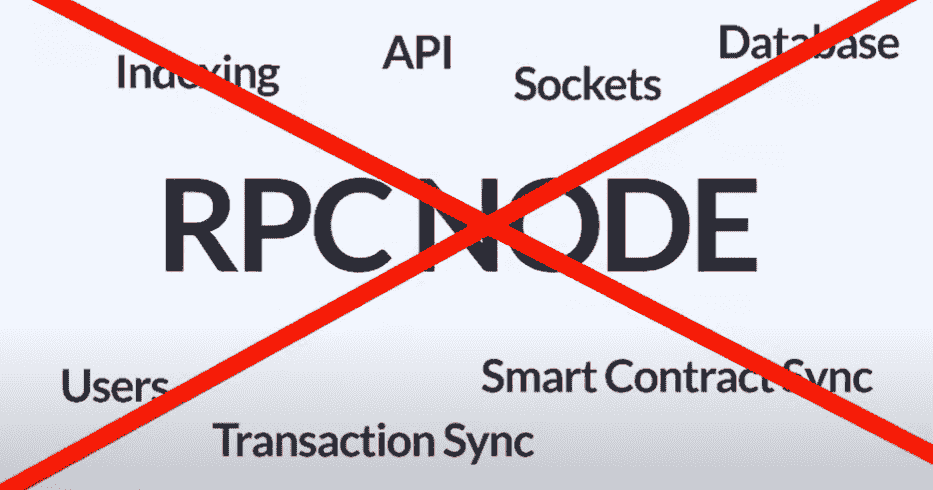
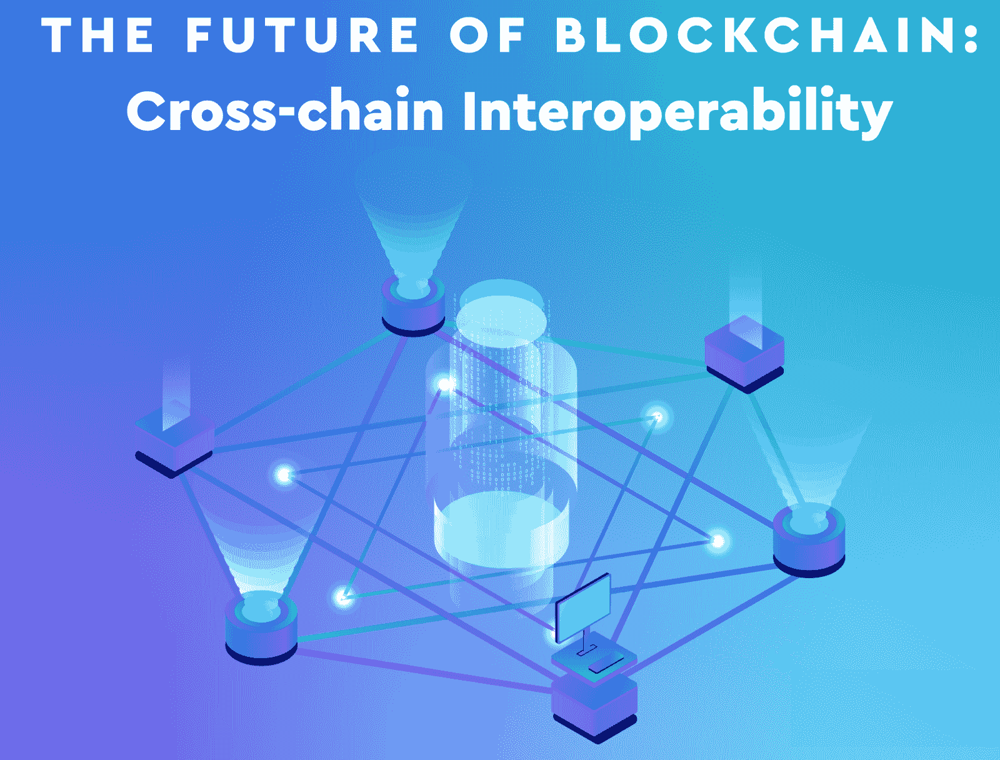
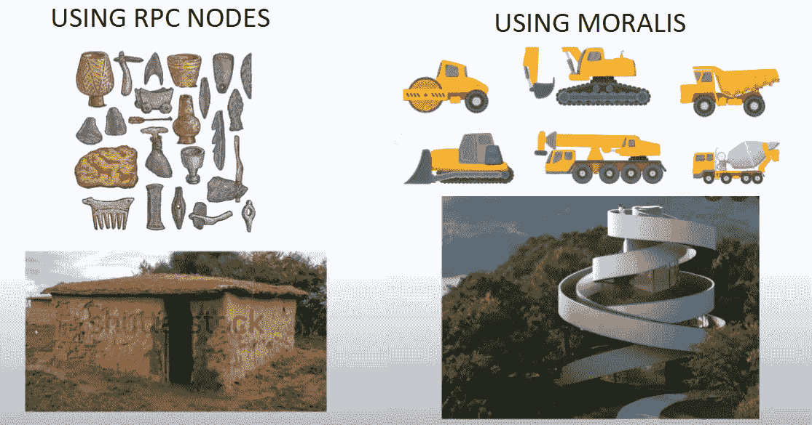
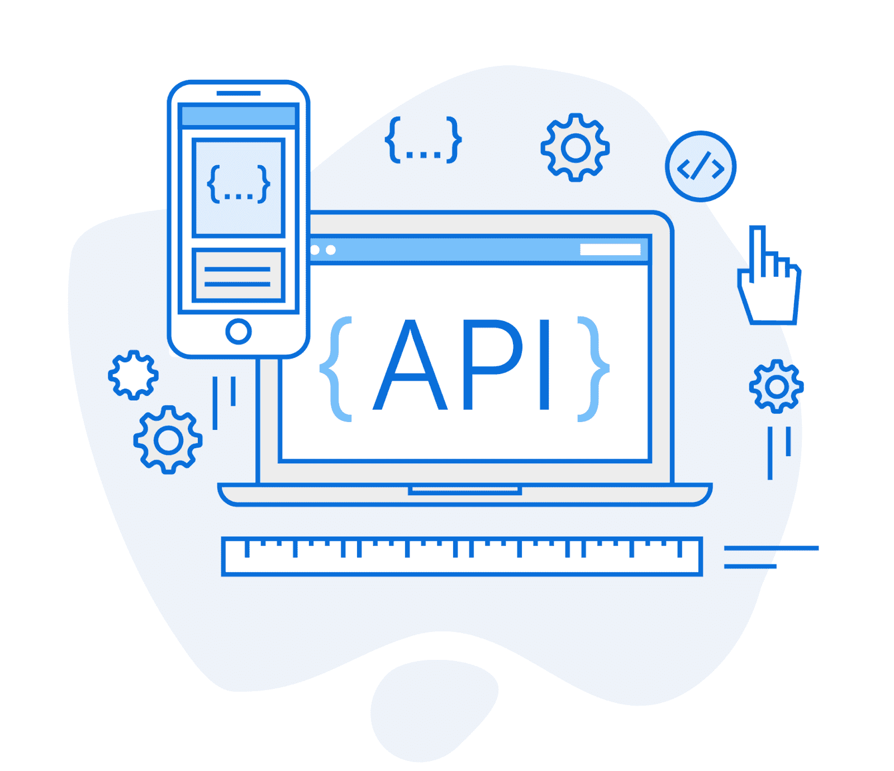

# 以太坊 API——用 Moralis 开发以太坊 dApps

> 原文：<https://moralis.io/ethereum-api-develop-ethereum-dapps-with-moralis/>

**随着区块链技术还处于起步阶段，只有时间会告诉我们** [**dApps**](https://moralis.io/decentralized-applications-explained-what-are-dapps/) **(去中心化应用)的未来在区块链会是什么样子，比如** [**以太坊**](https://moralis.io/full-guide-what-is-ethereum/) **。此外，还不清楚哪个区块链将主宰**[**web 3**](https://moralis.io/the-ultimate-guide-to-web3-what-is-web3/)**领域；然而，以太坊仍然是当前可编程区块链的领跑者。因此，** [**在以太坊上构建 dApps**](https://moralis.io/how-to-build-dapps-on-ethereum/)**对于区块链开发者来说很有意义。然而，虽然一些程序员在开发过程中经历了围绕 RPC 节点构建的挑战和耗时的过程，但是当利用强大的以太坊 API 时，创建 dApps 可以很容易地完成，并且用了创纪录的时间。因此，我们将展示如何开发以太坊 dApps 并使用带有 Moralis 的以太坊 API，这将使开发人员能够在以太坊上轻松、快速地编写应用程序。**

因此，Moralis 的平台使您能够避免重新发明轮子，专注于 dApps 的独特功能。此外，除了为开发人员提供以太坊 API，Moralis 还提供了一个 [ultimate Web3 SDK](https://moralis.io/exploring-moralis-sdk-the-ultimate-web3-sdk/) ，它为程序员提供了节点、整个数据库等等。最重要的是，它给你一个机会加入一个支持区块链开发者的社区，从而[成为一个更好的区块链开发者](https://moralis.io/how-to-become-a-blockchain-developer/)。Moralis 的 Web3 开发平台是加密开发者应得的终极捷径。通过打破直接围绕[以太坊 RPC 节点](https://moralis.io/ethereum-rpc-nodes-what-they-are-and-why-you-shouldnt-use-them/)构建的过时范式，Moralis 实现了 dApps 的快速部署，同时节省了资源。因此，请务必今天就注册您的免费帐户，并立即开始部署杀手级应用程序！


## 为什么要用 Moralis 来开发以太坊 dApps

以太坊是第一个可编程的区块链，也是将[智能合约](https://moralis.io/smart-contracts-explained-what-are-smart-contracts/)引入世界的那个。因此，它有一个良好的开端。因此，它能够在全球范围内建立一个广泛而忠诚的社区。此外，只要有强大的社区，我们通常就会看到巨大的成果，以太坊的成功证实了这一点。

当然，这个信誉良好的连锁店有其局限性和问题(像其他区块链可用)，主要是网络的高气费。然而，后者也是一个很好的迹象，表明有大量的交易发生在链上，这增加了链的声誉。幸运的是，在你的 dApp 为 mainnet 部署做好准备之前，通过关注以太坊的一个测试网，你可以部分地避免支付上面提到的那些费用。

那么，为什么要在以太坊上开发呢？好吧，强大的声誉、广泛的社区和致力于改善这个分散网络的大量开发人员都是有力的论据。然而，当在桌面上添加以太坊 API 和 Moralis 的跨链互操作性时，创建以太坊 dApps 就变得显而易见了。

如果你想用最普通的方式创建以太坊 dApps，你会立即暴露在 RPC 节点的[限制下。除了浪费时间和其他资源之外，你也不能足够快地发布你的 Web3 应用。然而，当你使用 Moralis 及其所有工具时，你很容易克服所有这些障碍。在下一节中，您将看到以太坊 API 是如何简化事情的。但是在我们深入研究以太坊 API 之前，让我们先了解一下 Web3 开发的另一个关键方面。](https://moralis.io/exploring-the-limitations-of-rpc-nodes-and-the-solution-to-them/)



### 开发面向未来的以太坊 dApps

作为一名开发人员，尤其是在像 crypto 这样的新领域，您希望创建长期相关的 dApps。然而，由于我们不知道在未来几年哪个链将占主导地位并提供最好的解决方案，因此相应地创建 Web3 应用程序是很重要的。这意味着你希望能够毫不费力地将你的 dApps 从一条链转移到另一条链。不幸的是，这是直接在 RPC 节点上构建的另一个主要缺点。

另一方面，通过使用 Moralis 来创建你的 dApp，你以最好的方式覆盖了这个方面。Moralis 的跨链互操作性使您所有的 Web3 应用程序都可以轻松地移植到另一个链上，只需点击几下鼠标。此外，Moralis 还不断增加对新的知名连锁店的全面支持。它目前支持[币安智能链](https://moralis.io/bsc-programming-guide-intro-to-binance-smart-chain-development-in-10-minutes/)(BSC)[多边形](https://moralis.io/how-to-build-polygon-dapps-easily/)、[雪崩](https://moralis.io/how-to-build-avalanche-dapps-in-minutes/)和[仲裁](https://moralis.io/how-to-create-an-arbitrum-token-in-6-steps/)，对索拉纳和埃尔隆德的支持已经在筹备中。记住这一点，请放心，你所有的 dApps 不会卡在一个特定的链上，也不会从零开始过渡到另一个链。



### 以太坊 API——超越提供服务的节点

如果你想克服运行自己的节点的困难，你很可能听说过[区块链节点提供商](https://moralis.io/infura-alternatives-and-blockchain-node-providers/)。虽然市场上有许多著名的选择，但 Infura 仍然迎合大多数以太坊 dApps。然而，Infura 把你限制在以太坊的区块链。另一方面，Moralis 给你的不仅仅是点头——让你真正开发完整的以太坊 dApps。

当探索其他链时，您可能已经在为 BSC 搜索 [Infura 或为雪崩](https://moralis.io/infura-bsc-alternatives-the-best-alternative-to-infura-for-bsc/)搜索 [Infura。如果是这样，Moralis 就是你的答案——因为它对这两个链都提供了完全的支持。此外，Moralis 为开发者提供了所有支持链的](https://moralis.io/infura-for-avalanche-exploring-infura-avalanche-alternatives/)[Moralis Speedy Nodes](https://moralis.io/speedy-nodes/)；然而，这只是 Moralis 全部范围的一小部分。当您拥有 Moralis 的 Web3 SDK 和 Moralis 的 Web3 API 时，您可以满足所有的区块链开发需求。

Moralis 对以太坊的支持会加速你所有的以太坊开发。无论你建立一个 NFT 市场，加密钱包，DeFi 仪表板，跨链桥，NFT 游戏，或以太坊指数，都是如此。所有这些类型的分散式应用程序都有很多共同点。它们中的每一个都需要登录用户、获取余额(可替换令牌和[NFT](https://moralis.io/non-fungible-tokens-explained-what-are-nfts/))、交易、智能合约事件、提供实时警报、发送交易，并且它们需要数据库。因此，避免为每个 dApp 从头构建所有这些重复的功能是有意义的。因此，Moralis 的以太坊 API 功能通过复制和粘贴简短的代码片段为您提供了强大的区块链特性。



## **探索以太坊 API——快速部署 dApps 的关键**

如前所述，我们将进一步了解 Moralis 提供的以太坊 API。充分利用这一功能将使您未来的 Web3 开发工作尽可能地快速和简单。

此外，当我们谈论以太坊 API 时，请注意，由于 Moralis 内置的跨链互操作性，您可以将相同的 API 应用于其他受支持的链。唯一不同的是以太坊链是原生选项。因此，当使用其他链时，您需要指定感兴趣的链。

## 最强大的以太坊 API

如前所述，大多数 dApps 需要整合许多功能。为用户提供登录或验证自己的选项就是这样的功能之一。当直接在 RPC 节点上构建时，创建这些基本特性需要花费很多精力，而使用 Moralis 通过两个简短的代码片段就可以做到这一点:

```js
Moralis.Web3.authenticate().then(function (user) {
    console.log(user.get('ethAddress'))
})
```

通过使用上面的代码，每个用户都可以很容易地使用 MetaMask 进行认证。此外，尽管 [MetaMask](https://moralis.io/metamask-explained-what-is-metamask/) 仍然是最受欢迎的[以太坊认证](https://moralis.io/ethereum-authentication-full-tutorial-to-ethereum-login-programming/)解决方案，Moralis 也提供 [WalletConnect](https://moralis.io/how-to-connect-users-with-walletconnect/) 集成。后者是认证移动用户的最佳选择。

用户通过身份验证后，他们会自动添加到您的 Moralis 仪表板中。此外，它们会实时自动更新，持续为您提供最新的链上状态。正如你从下面的图片中所看到的，它为你提供了大量有价值的关于每个登录地址的链上数据。


### 用于读取数据库的以太坊 API

一旦我们认证了用户，重要的链上数据就在我们的掌握之中。此外，你可以依靠 Moralis 为你提供简短的单行代码来访问各种各样的链上信息，而无需担心。例如，让我们仔细看看关于交易的代码片段以及如何[获得代币余额](https://moralis.io/how-to-get-nft-and-erc-20-token-balances-in-3-steps/):

*   获取当前用户的 mainnet 事务:

***const transaction = await Moralis。web 3 API . account . get transaction()；*T3】**

*   获取当前用户的 ETH 余额:

***const balance = await Moralis。web 3 API . account . getnative balance()；*T3】**

*   获取 mainnet 上当前用户的 ERC-20 令牌余额:

***常数余额=等待 Moralis。web 3 API . account . gettokenbalances()；*T3】**

*   获取 mainnet 上当前用户的 NFT 余额:

***const balance = await Moralis。web 3 API . account . get nfts()；*T3】**

以上四行代码为您提供了创建一个加密钱包的所有基本片段(就后端而言)。当然，还有更多的选择。例如，对于 NFTs，您可以很容易地获得 NFTs 元数据，包括令牌的 URI。下面是代码的样子:

***const 元数据= await Moralis。Web3API.token.getNFTMetadata(选项)；*T3】**

而且，你还可以得到 NFT 的所有者:

***const nftOwners = await Moralis。Web3API.token.getNFTOwners(选项)；*T3】**

此外，您可以基于元数据搜索 NFT，等等。现在您可以看到 Moralis 的 [ultimate NFT API](https://moralis.io/ultimate-nft-api-exploring-moralis-nft-api/) 如何让在您的 dApps 中实现 NFTs 变得非常简单。

此外，您可以在 Moralis 数据库上运行任何“MongoDB”查询，这为您提供了大量选项。此外，您还可以很容易地通过套接字获得实时警报。



### 用于发送资产的以太坊 API

在构建任何 Web3 应用程序时，让用户能够发送他们的资产也很重要。当然，您可以再次依赖以太坊 API 为您提供简单的解决方案:

*   发送以太网:

```js
// sending 0.5 ETH
const options = {type: "native", amount: Moralis.Units.ETH("0.5"), receiver: "0x.."}
let result = await Moralis.transfer(options)
```

*   转移 ERC-20:

```js
// sending 0.5 tokens with 18 decimals
const options = {type: "erc20", 
                 amount: Moralis.Units.Token("0.5", "18"), 
                 receiver: "0x..",
                 contractAddress: "0x.."}
let result = await Moralis.transfer(options)
```

*   发送 NFT:

```js
// sending a token with token id = 1
const options = {type: "erc721",  
                 receiver: "0x..",
                 contractAddress: "0x..",
                 tokenId: 1}
let result = await Moralis.transfer(options)

// sending 15 tokens with token id = 1
const options = {type: "erc1155",  
                 receiver: "0x..",
                 contractAddress: "0x..",
                 tokenId: 1,
                 amount: 15}
let result = await Moralis.transfer(options)
```

如果你想进一步探索以太坊 API，我们建议查看 [Moralis 的文档](https://docs.moralis.io/moralis-server/web3-sdk)。此外，我们鼓励你承担我们的一些示例项目(学习[用四个步骤](https://moralis.io/how-to-create-ethereum-tokens-in-4-steps/)创建以太坊令牌，[构建 NFT 游戏](https://moralis.io/nft-game-development-how-to-build-an-nft-game-app-in-minutes/)应用，[创建 NFT](https://moralis.io/how-to-create-nfts-and-upload-to-opensea/)等)。).这样，您就可以实际使用 Ethereum API，从而直接体验它的全部功能，这是学习正确使用这个优秀工具的最佳方式。


## 以太坊应用编程接口——使用 Moralis 标准开发以太坊应用编程接口——摘要

在 2021 年创建 dApps 时，运行自己的 RPC 节点并围绕它构建基础设施并不是最佳选择。这种过时的 Web3 编程方式有很大的局限性，会消耗大量的时间和其他资源。此外，让你的 dApp 保持最新也极具挑战性。然而，我们已经向您展示了当使用高质量的以太坊 API 时，dApp 开发是多么简单。它减轻了您的负担，因为它通过允许您复制和粘贴单行代码，覆盖了大部分后端编码。这样，您可以将您的注意力和资源投入到在前端创建最佳用户体验上。

至此，您应该对 Moralis 的以太坊 API 如何使您的 dApp 开发变得更加简单和快速有了一个相当清晰的理解。这个用于构建跨链兼容 dApps 的终极 Web3 操作系统为以太坊和其他领先的可编程区块链提供了全面支持。因此，它为您提供了一个面向未来的保证，因为您可以简单地在不同的链之间转移您的 dApps。总而言之，Moralis 的 SDK 和其他 Moralis 功能提供了终极以太坊 API 和一个优秀的平台，可以快速轻松地开发以太坊 dApps。

如果您发现此处的信息很有用，并且希望提升您的开发技能，请务必报名参加伊凡科技学院的"[以太坊 101](https://academy.ivanontech.com/courses/ethereum-101) "课程。在该课程中，您将深入以太坊的世界，并对以太坊和智能合约的工作原理有更多的了解。此外，它将推进和未来证明你的区块链职业生涯。

此外，请访问 [Moralis 的博客](https://moralis.io/blog/)和 [Moralis 的 YouTube 频道](https://www.youtube.com/channel/UCgWS9Q3P5AxCWyQLT2kQhBw)以获得关于各种区块链话题的更深入的解释。即使你想在以太坊之外建立分支，也许是进入 [BSC 编程](https://moralis.io/bsc-programming-guide-intro-to-binance-smart-chain-development-in-10-minutes/)和 [BEP20](https://moralis.io/what-is-bep20-full-binance-smart-chain-token-guide/) 令牌，我们也有合适的工具！

