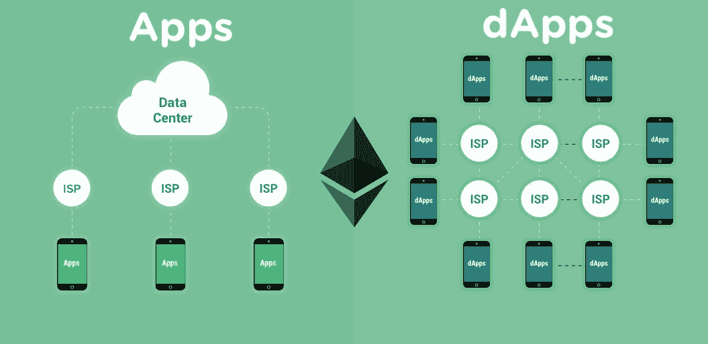
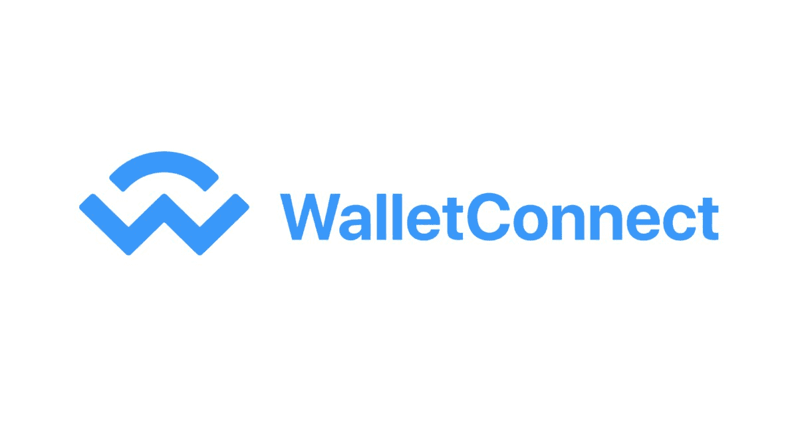
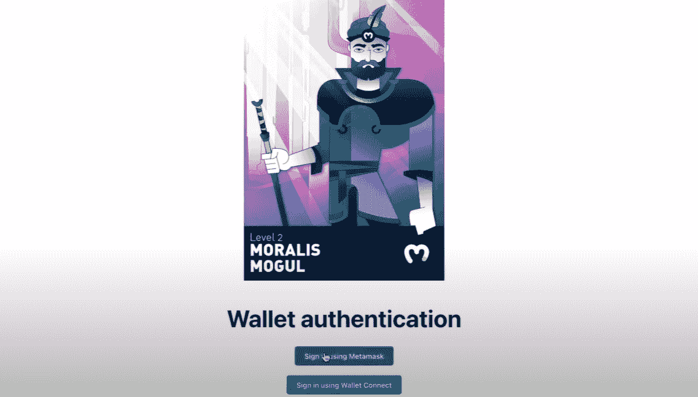
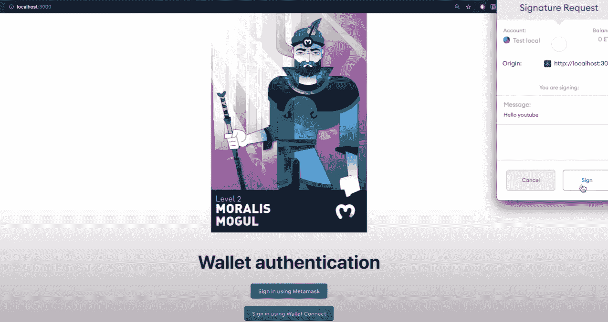
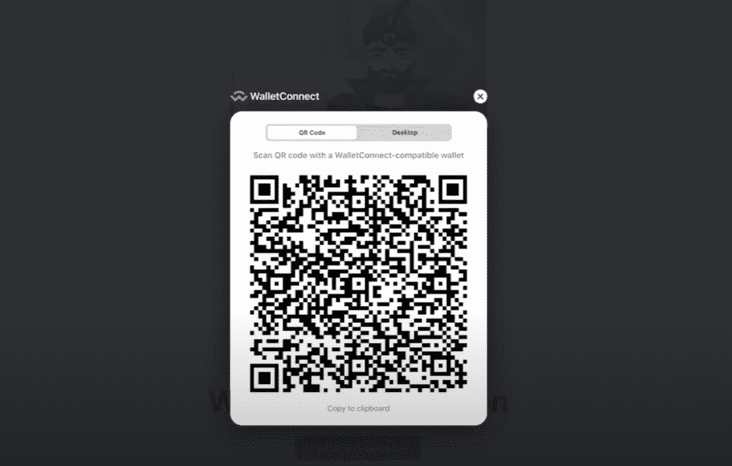
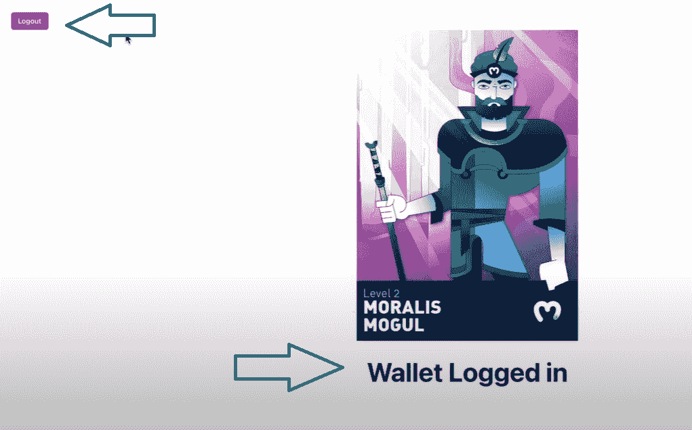
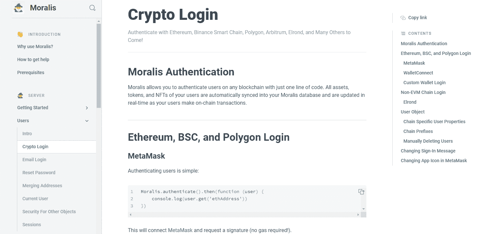
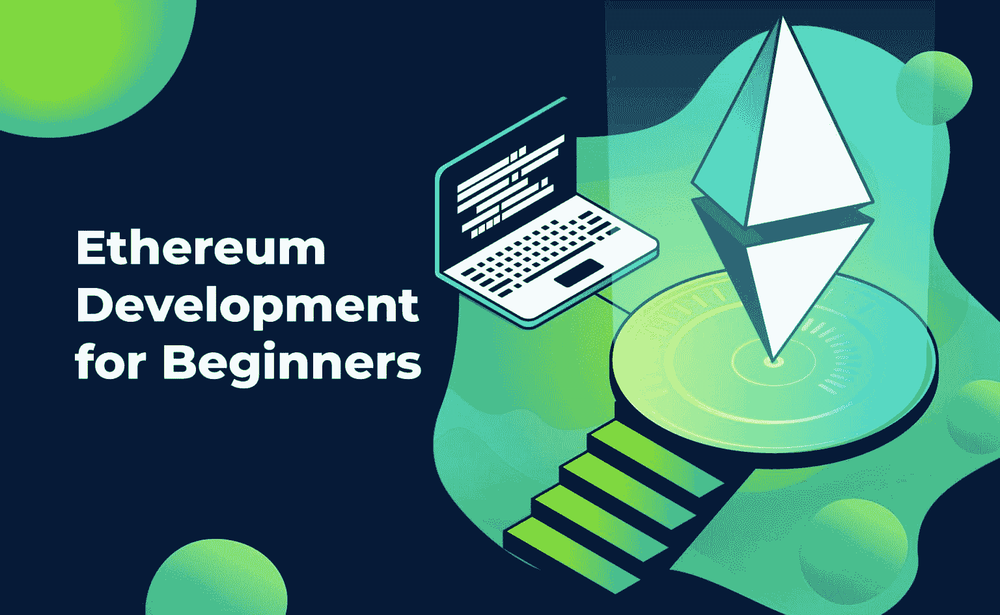

# 以太坊认证——以太坊登录编程完整教程

> 原文：<https://moralis.io/ethereum-authentication-full-tutorial-to-ethereum-login-programming/>

**在构建** [**Web3**](https://moralis.io/the-ultimate-guide-to-web3-what-is-web3/) **应用时，在以太坊上对用户进行验证是一个基本特性。因此，为 dApps 编写以太坊认证的功能应该是区块链开发人员优先考虑的事情。此外，授权用户登录并验证自己，使用户能够检查有关其余额和交易的区块链数据是否准确同步。然而，以太坊认证和登录编程可能是一项相当具有挑战性和令人畏惧的任务。因此，在这篇以太坊登录编程的完整教程中，我们将探索以太坊认证的终极解决方案，让开发过程变得轻而易举。**

幸运的是，有一个简单的以太坊登录编程解决方案——Moralis。要获得该解决方案的全部权限，您只需[立即创建您的免费 Moralis 账户](https://admin.moralis.io/register)。通过使用 [Moralis 的 SDK](https://moralis.io/exploring-moralis-sdk-the-ultimate-web3-sdk/) ，您可以获得简单的以太坊认证解决方案，您可以在几秒钟内实现。此外，目前有许多可编程区块链可用，Moralis 的核心内置了跨链互操作性。这意味着您将能够在所有领先的链上使用其广泛的认证解决方案，包括[币安智能链](https://moralis.io/bsc-programming-guide-intro-to-binance-smart-chain-development-in-10-minutes/) (BSC)、 [Polygon](https://moralis.io/how-to-build-polygon-dapps-easily/) 、Avalanche 等。然而，由于[以太坊](https://moralis.io/full-guide-what-is-ethereum/)仍然是部署[分散式应用](https://moralis.io/decentralized-applications-explained-what-are-dapps/) (dApps)的领先网络，我们在这里将重点讨论以太坊认证。我们将首先介绍基础知识，然后进行一个示例项目，向您展示 [Moralis](https://moralis.io/) 如何消除与以太坊登录编程相关的所有开销。


## **为什么需要以太坊认证？**

如今，每个互联网用户在很多网站上都依赖电子邮件和密码认证。通过这种方式，用户可以访问特定的内容，并可以设置他们的个人偏好，这些偏好将作为用户帐户的一部分存储起来。相同类型的认证可用于 Web3 应用程序；然而，这并没有带来 dApps 的实际优势。为了确保链上数据访问，用户需要提供他们的区块链地址。然而，手动这样做对用户来说一点也不友好。

因此，半自动的 Web3 用户认证最容易使用区块链钱包来完成。一旦用户批准 dApps 访问他们的公共地址，他们就可以完全使用 Web3 应用程序。这意味着他们可以显示他们的可替换代币余额，显示他们的[NFT](https://moralis.io/non-fungible-tokens-explained-what-are-nfts/)，交易他们的资产，将它们投入使用(在 [NFT 奥运会](https://moralis.io/what-are-nft-games-and-how-to-make-nft-games/)中)等等。也就是说，当我们关注以太坊的链条时，以太坊认证对于用户体验 Web3 的实际优势是必不可少的。



## **Moralis 以太坊认证解决方案**

由于 2021 年有许多钱包解决方案可用，Moralis 决定只集成最可靠的选项。最流行、最可靠、最领先的钱包是 MetaMask，它被用作 Moralis 的默认以太坊认证解决方案。然而，为了给开发者和用户提供更多的选择，Moralis 还提供了一个额外的解决方案——wallet connect。除了 Moralis 对 MetaMask 和 WalletConnect 的 Ethereum 认证的本地支持之外，还可以使用任何 Web3 提供商。当然，这需要额外的代码行；然而，它仍然很容易实现。

### **什么是元掩码？**

如上所述，MetaMask 是市场上最受欢迎和信任的加密货币钱包之一，它自 2016 年以来一直存在。此外，它最初被设计为支持以太坊的区块链。然而，随着新的链开始出现，元蒙版开发者为用户提供了添加其他链的选项。但是，默认情况下，以太坊的 mainnet 和 testnets 是设置好的。


除了作为一个钱包，MetaMask 还是通往 Web3 世界的门户。这正是 Moralis 用来提供开发者友好和用户友好的以太坊认证解决方案的特性。随意深入探讨“[什么是 MetaMask”这个话题。](https://moralis.io/metamask-explained-what-is-metamask/)“查看我们过去的一篇关于这个话题的文章。此外，如果您还没有完全理解 MetaMask 的用例，请随意仔细查看 [MetaMask 认证](https://moralis.io/how-to-authenticate-with-metamask/)。

### **什么是 WalletConnect？**

遵循 WalletConnect 的官方定义，WalletConnect 是一个连接 dApps 和移动钱包的开源协议。它支持多种移动钱包，并支持通过二维码扫描建立连接。与桌面或浏览器扩展钱包相比，这是一个有信誉的、在某些方面更安全的选择。当用户扫描二维码(通常用于桌面)或点击应用程序的深度链接(通常用于移动设备)时，WalletConnect 会话就会启动。如果这是你第一次听说 WalletConnect，我们建议你查看位于[walletconnect.org](https://walletconnect.org/)的常见问题部分。此外，我们建议仔细阅读我们解释[如何使用 WalletConnect](https://moralis.io/how-to-connect-users-with-walletconnect/) 认证用户的文章。



### **什么是 Moralis？**

除非你是区块链开发的新手，否则你很可能听说过 Moralis。这个终极的 Web3 开发平台在创建 Web3 应用程序时提供了一个完整的范式转变。它使每个人都能熟练掌握 JavaScript，并能够使用元掩码快速、轻松地创建分散式应用程序。它通过关注 dApp 开发的整个区块链相关的后端方面而使之成为可能。从本质上讲，开发人员可以复制并粘贴业内最优秀的文档之一提供的代码片段。


当您使用 Moralis 构建 dApps 时，您可以轻松克服 RPC 节点的所有[限制。您可以更快地交付功能正常的 Web3 应用程序，并且有多余的资源。此外，由于 Moralis 的跨链互操作性，您可以确保您的 dApps 面向未来。因此，以太坊认证解决方案只是这个 Web3 开发平台提供的众多强大工具之一。](https://moralis.io/exploring-the-limitations-of-rpc-nodes-and-the-solution-to-them/)

此外，Moralis 提供了广泛的视频(在 [Moralis 的 YouTube 频道](https://www.youtube.com/c/MoralisWeb3)上)和博客帖子(在 [Moralis 的博客](https://moralis.io/blog/)上)，涵盖了加密概念和示例项目，以帮助您扩展您的知识和技能。因此，对于初学者和有经验的开发者来说，Moralis 都是一个很好的地方。无论你是想知道[如何成为一名区块链开发者](https://moralis.io/how-to-become-a-blockchain-developer/)还是你心中有具体的编程任务(关于 [NFT 令牌开发](https://moralis.io/nft-token-development-the-ultimate-guide/)、 [BEP20 令牌开发](https://moralis.io/bep20-token-development-full-guide/)、[上传 NFTs 到 OpenSea](https://moralis.io/how-to-create-nfts-and-upload-to-opensea/) 等。)，Moralis 支持你。

现在，让我们通过一个示例项目向您展示以太坊登录编程有多简单。

## **使用以太坊认证–以太坊登录编程示例**

现在，您已经了解了基础知识，我们准备进一步了解如何轻松地为不同的 dApps 添加认证功能。此外，作为一名开发人员，你要确保你能同时满足桌面和移动设备上的用户，这是许多 dApps 做不到的。因此，我们将使用一个 Web3 应用程序演示来展示在 Moralis 的帮助下在桌面和移动设备上编程的以太坊认证。

### **使用以太坊认证–完成演示 dApp**

让我们快速浏览一下我们将要创建的内容，以及它将如何在桌面和移动设备上运行。我们将从前者开始。

#### **桌面完成以太坊认证演示 dApp**

如下图所示，你可以看到我们的演示程序有两个按钮。这样，我们将为用户提供选择使用 MetaMask 或 WalletConnect 登录的选项。



安装了 MetaMask 的浏览器扩展或应用程序的用户将单击“使用 MetaMask 登录”按钮。这将自动调用元掩码，用户需要单击“签名”按钮来确认身份验证:



另一方面，喜欢使用其他以太坊认证选项的用户将点击“使用 WalletConnect 登录”按钮。这将返回一个带有 QR 码的弹出窗口/模式:



当用户使用这两种方法中的任何一种登录时，左上角的“注销”按钮和右下角的“Wallet 登录”消息将会出现:



#### **在手机上完成以太坊认证演示 dApp**

在移动设备上，我们希望专注于使用 WalletConnect 登录，因为该选项支持广泛的移动钱包应用程序。以下是用户需要在智能手机上执行的步骤的图片:


正如你所看到的(在上图的第二步中)，有很多支持 WalletConnect 的移动钱包应用可供选择。在这个例子中，我们使用了[信任钱包](https://trustwallet.com/)。下面是两个确认步骤，在最后一个图像中，您可以看到我们已经登录。

## **以太坊登录编程为我们演示 dApp**

我们不想用这里的全部代码来淹没你；因此，我们将只仔细看看具体的代码片段。然而，我们建议仔细看看完整的代码，我们在 [GitHub](https://github.com/abdulmalik97/moralis-react-authentication) 上提供了这些代码。

为了创建我们的演示代码，我们将使用一个简单的 [React](https://moralis.io/react-explained-what-is-react/) 模板，它包括多个 JavaScript (JS)文件。“App.js”和“index.js”将是我们的主要兴趣所在。在“index.js”文件中，我们需要输入我们的 Moralis 应用程序 ID 和服务器 URL(详情请见 [Moralis 的快速入门](https://docs.moralis.io/moralis-server/getting-started/create-a-moralis-server))。这将为我们提供对 Moralis 工具的访问，包括其强大的 [Web3 API](https://moralis.io/introducing-the-moralis-web3-api-v2/) 。

*注意:不要使用下面代码中的应用程序 ID 和服务器 URL，而是使用您自己的 Moralis 服务器中的详细信息。*

```js
const moralisAppId = "77IfzDQc5dLFD3YbNKeuNrxHGe2c5OWGoMxgfLTU";
const moralisServerURL = "https://ioc7ccqovdu5.grandmoralis.com:2053/server";

ReactDOM.render(
  <React.StrictMode>
    <MoralisProvider appId={moralisAppId} serverUrl={moralisServerURL}>
      <ChakraProvider theme={theme}>
        <App />
      </ChakraProvider>
    </MoralisProvider>
  </React.StrictMode>,
  document.getElementById("root")
);
```

此外，在“App.js”文件中，我们导入了 Moralis React 包和“useMoralis()”钩子:

```js
import logo from "./MageLogo.jpg";
import React, { useEffect } from "react";
import "./App.css";
import { useMoralis } from "react-moralis";
import { Button, Box, Heading } from "@chakra-ui/react";
import { Container, Center } from "@chakra-ui/react";

const LogoutButton = () => {
  const { logout, isAuthenticating } = useMoralis();
```

事实上，大部分功能都来自这个钩子；因此，它在“App.js”代码中被多次使用。

现在让我们特别关注“authenticate()”函数。



## **以太坊登录编程–认证功能**

“authenticate()”函数使我们能够以最小的努力完成大部分繁重的工作。此外，由于元掩码身份验证是该函数的默认选项，因此在进行这种身份验证时不需要任何额外的参数。但是，如果我们想使用其他以太坊认证解决方案，则需要额外的参数:

```js
  async function authWalletConnect() {
    const user = authenticate({
      provider: "walletconnect",
      chainId: 56,
      // mobileLinks: [
      //   "metamask",
      //   "trust",
      //   "rainbow",
      //   "argent",
      //   "imtoken",
      //   "pillar",
      // ],
      signingMessage: "Welcome!",
    });
    console.log(user);
  }
```

查看上面的代码，请记住“chainId”可以用于任何其他的 [EVM](https://moralis.io/evm-explained-what-is-ethereum-virtual-machine/) 兼容链(在我们的例子中，56 用于币安智能链)。

*注意:您也可以使用与 EVM 不兼容的链条(如埃尔隆德)；然而，在这种情况下，您需要利用 [Moralis 文档](https://docs.moralis.io/)中的“非 EVM 连锁登录”部分。如果你想了解这方面的内容，请务必观看我们关于[埃尔隆德登录编程](https://youtu.be/0dLNIbx4GbY)的视频。*

此外，以“//”开头的代码行目前被转换为注释(通过删除“//”来激活)。如果激活，这些代码行使我们能够只关注 WalletConnect 支持的特定移动钱包应用程序提供商。如果我们有一组我们信任的特定移动钱包应用程序提供商，后者会很有用。此外，它也有助于避免过多的选项让用户不知所措。

如果您更喜欢观看视频，请随时观看 Moralis 的专家更详细地讲述与我们的演示 dApp 相关的代码:

https://www.youtube.com/watch?v=UP6MfkU3Bkg

*此外，请注意，在 Moralis 的文档中有对“authenticate()”函数和其他* [*加密登录*](https://docs.moralis.io/moralis-server/users/crypto-login) *方面的极其详细的解释。解释包括代码示例和涵盖一些简单用例的视频。*

## **以太坊认证–以太坊登录编程完整教程–总结**

假设您已经涵盖了以上所有部分，那么您终于可以创建自己的 dApp 了。有了 Moralis，它应该不会花你太多时间，因为你将在以太坊登录编程和其他后端方面花费最少的精力和时间。此外，Moralis 将使您能够用简短的代码片段来处理以太坊认证。事实上，您将使用“authenticate()”函数来实现这一目的。此外，在使用元掩码认证的情况下，您不需要添加任何参数，因为这是该函数的默认选项。但是，当使用 WalletConnect(这是对移动用户进行身份验证的一个有利选项)时，一些附加参数是必需的。

除了这里获得的信息，如果你渴望成为一名区块链开发者，特别是以太坊开发者，一定要看看我们的[以太坊初学者开发指南](https://moralis.io/ethereum-development-for-beginners/)。在该指南中，您将发现在以太坊上开发成功所必需的工具。此外，一旦你完成了那个指南，确保通过学习[如何建造以太坊 dApps](https://moralis.io/ultimate-guide-how-to-build-ethereum-dapps/) 来进一步提升你的区块链知识。此外，NFT 开发从来没有比与 Moralis 的最终 [NFT API](https://moralis.io/ultimate-nft-api-exploring-moralis-nft-api/) 更容易。

借助 Moralis 的工具和专业知识，您拥有构建下一代应用所需的所有知识。为你的 dApp 实现以太坊认证只是一个开始。所以，[今天就报名](https://admin.moralis.io/register)，让 Moralis 从头到尾指导你的发展之旅！

