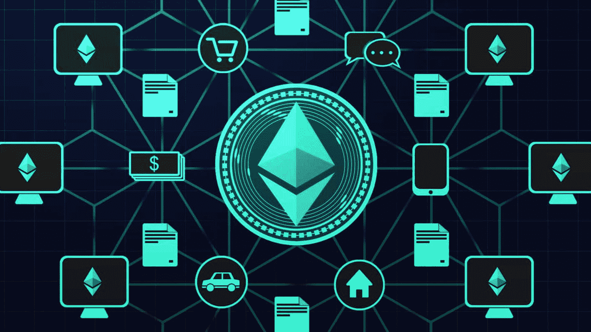
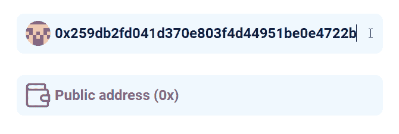
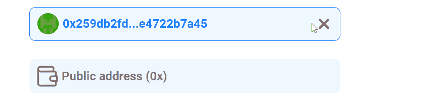
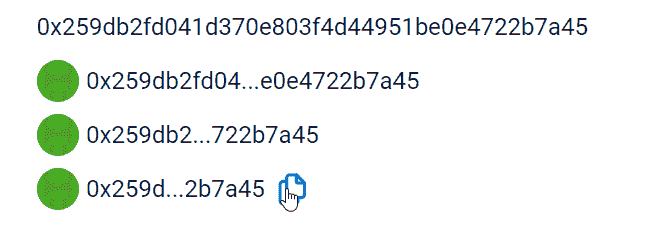

# 以太坊 dApp 样板–完整以太坊 React 样板教程

> 原文：<https://moralis.io/ethereum-dapp-boilerplate-full-ethereum-react-boilerplate-tutorial/>

* * *

*以太坊样板 GitHub w/完整代码和信息—[https://GitHub . com/以太坊样板/以太坊样板](https://github.com/ethereum-boilerplate/ethereum-boilerplate)*

*以太坊样板，带快速入门指南——[https://ethereumboilerplate.com/](https://ethereumboilerplate.com/)T3】*

* * *

**随着基于以太坊的**[**【dApps】**](https://moralis.io/decentralized-applications-explained-what-are-dapps/)**(去中心化应用)的激增，很多程序员现在都意识到了成为** [**区块链开发者**](https://moralis.io/how-to-become-a-blockchain-developer/) **的好处。具体来说，学习** [**以太坊开发**](https://moralis.io/ethereum-development-for-beginners/) **构建以太坊 dApp 正在迅速成为程序员中的顶尖技能。然而，如果没有合适的工具，在以太坊上创建**[**web 3**](https://moralis.io/the-ultimate-guide-to-web3-what-is-web3/)**应用程序是一个耗时且耗费资源的过程。这也是为什么程序员在构建** [**以太坊 dApps**](https://moralis.io/how-to-create-ethereum-dapps/) **时，都趋之若鹜的原因。因此，Moralis 提供了一个以太坊 dApp 样板，使开发过程比以往任何时候都更容易。因此，在这个完整的以太坊 React 样板教程中，我们将访问**[**React**](https://moralis.io/react-explained-what-is-react/)**组件，并利用以太坊 dApp 样板与 Moralis 相结合，这样您就可以在以太坊上更快地开发 Web3 应用程序！**

我们在 Moralis 花了相当多的时间寻找一个固体以太坊 dApp 样板，只是发现没有。因此，我们决定卷起袖子，创建最伟大和最全面的以太坊 dApp 样板。当然，我们决定让 GitHub 的每个人都可以免费使用它。此外，我们将在这里讨论这个轻量级模块以太坊 dApp 样板的所有细节。然而，如果你渴望开始使用这个终极的捷径，开始只需要四个简单的步骤。尽管如此，让我们也指出，这个终极以太坊 dApp 样板可以与任何 [EVM](https://moralis.io/evm-explained-what-is-ethereum-virtual-machine/) 系统一起工作。

此外，为了帮助尽可能多的区块链开发者，我们鼓励你[分享你的评论](https://forum.moralis.io/t/ethereum-boilerplate-questions/3951)和任何改进的想法。此外，如果您感谢我们的贡献，请不要忘记在我们的 GitHub 上留下一颗星。



## **终极以太坊 dApp 样板**

你对终极以太坊 dApp 样板文件有什么期待？你希望它完全覆盖你所有的后端开发需求吗？你猜对了！你想让它为你的 dApp 提供一个加密钱包来启用[以太坊认证](https://moralis.io/ethereum-authentication-full-tutorial-to-ethereum-login-programming/)吗？你猜对了！你有兴趣为你的 dApp 用户提供一个 [DEX](https://moralis.io/how-to-create-a-dex-in-5-steps/) (分散交换)吗？那也是盖的！当然，代币余额、NFT 余额和交易历史也在那里。你也可以很容易地[生成 NFT](https://moralis.io/how-to-generate-nfts-full-guide/)等等！此外，它为用户提供了最简单的方式来选择以太坊，雪崩，币安智能链和多边形(其他链将被添加)。

即使许多其他 dApps 和项目经常提供这些功能，他们也需要几周甚至几个月的时间来完成和实现上面提到的功能。此外，项目很快意识到 RPC 节点的[限制，因为他们倾向于采用过时的方法，直接在](https://moralis.io/exploring-the-limitations-of-rpc-nodes-and-the-solution-to-them/) [RPC 节点](https://moralis.io/ethereum-rpc-nodes-what-they-are-and-why-you-shouldnt-use-them/)之上构建。当构建基础设施以涵盖上述基本功能时，这导致了一个漫长的过程，使得 [Web3](https://moralis.io/the-ultimate-guide-to-web3-what-is-web3/) 应用的用户因为功能不能及时可用而离开 dApp 参与竞争。然而，使用 Moralis 的以太坊 dApp 样板快捷方式可以让您以创纪录的速度部署 dApp。因此，您可以向用户展示您的功能并获得即时反馈。


## **以太坊 dApp 样板–组件**

我们包含了尽可能多的组件，并将继续添加新的组件。事实上，这仅仅是个开始。然而，已经包括了十多个组件。这些组件如下:

*   ***地址输入:<>***
*   ***地址:<地址/>*T3】**
*   ***锁链:<锁链/ >***
*   ***硬币价格:<>***
*   ***ERC-20 天平:<ERC 20 天平/ >***
*   ***【ERC-20】转会:<erc20 转会/ >***
*   ***DEX:<DEX/>*T3】**
*   ***钱包:<钱包/>*T3】**
*   ***<>***
*   ***原生平衡:<>***
*   ***合同:<合同/>*T3】**

此外，最易于使用的以太坊 dApp 样板的所有组件都包括完整的 UI(用户界面)元素。您可以在“ [src/components](https://github.com/ethereum-boilerplate/ethereum-boilerplate/tree/main/src/components) ”文件夹中轻松访问这些 React 组件。您可以在 dApp 的任何地方使用它们。当然，许多组件包括不同的参数，如“链”、“地址”、“大小”等。在接下来的小节中，我们将更详细地介绍最常用的组件。

### **以太坊 dApp 样板组件–地址输入**

这个特殊的组件是有益的，因为它使您能够在 dApp 中的任何地方捕获用户的地址。“ **< AddressInput / >** ”组件还使您能够显示输入地址的块状头像。



此外，在输入特定钱包地址的所有 42 个字符后，它会自动冻结输入字段并设置输入的地址:



如果用户想要编辑地址，他们可以点击红十字，然后他们将有机会编辑地址:


此外，“ **< AddressInput / >** ”组件带有几个选项，包括自动对焦和占位符。以下是示例代码:

```js
const [address, setAddress] = useState();

<AddressInput autoFocus placeholder="Input your Address" onChange={setReceiver} />
```



除了“输入地址”之外，这个高级以太坊 dApp 样板文件还包括“ **<地址/ >** ”组件，它使您能够用块状头像显示以太坊地址。此外，它还包括一个可选的“可复制”图标显示、块状头像显示和文本大小(显示多少字符)调整。下面是一些“ **<地址/ >** 代码的例子:

```js
<Address />
<Address avatar />
<Address avatar copyable />
<Address avatar copyable size="4"  />
```

### **以太坊 dApp 样板组件–区块链**

支持多个链是非常重要的，提供一种用户友好的方式在支持的链之间切换更是如此。这就是“**</>**”组件发挥作用的地方。


看上面的图片，你可以看到这个选项简单明了。它基本上是一个主动网络交换机。默认情况下，它支持以太坊，雪崩，多边形和 BSC。此外，它还可以与之前添加到注入钱包中的网络配合使用。然而，以编程方式添加新网络也很简单(更多信息请参见 Moralis 文档中的" [Web3 Provider](https://docs.moralis.io/moralis-server/web3/web3#addnetwork) "一节)。下面是一个“**</>**链条”代码的例子:

*<锁链多边形 eth bsc 雪崩/ >*

### **以太坊 dApp 样板组件–硬币价格**

“ **< CoinPrice / >** ”组件用于通过使用 [Moralis 的 Web3 API](https://docs.moralis.io/moralis-server/web3-sdk/intro) 来显示指定令牌的价格(以美元和本地令牌表示[点击切换])，这意味着它不需要活动的 Web3 提供者。


此外，“**<【coin price/>**”包括几个选项(有些是必选的，有些是可选的):

*   *地址*(必填)–必须输入代币合同地址，才能显示代币价格。
*   *链*(可选)–如果令牌部署在以太坊以外的链上，我们必须进入该链，因为默认选项是 ETH。
*   *图像*(可选)–如果我们想要显示令牌的徽标，必须提供图像的本地路径或令牌徽标的链接。
*   *尺寸*(可选)–我们可以设置标志的尺寸。

下面是一个"**<【coin price/>**代码的例子:

*<coin price address = " 0x 1…3 " chain = " eth " image = " https://img . png " size = " 40px "/>*

### **以太坊 dApp 样板组件-ERC-20 余额和转账**

目前可用的大多数代币是 ERC-20 代币。因此，向用户显示所有 ERC-20 余额的简单选项非常有用。这就是“**<”ERC 20 balance/>**”组件发挥作用的地方。为了获得最佳用户体验，该显示选项也进行了分页，并以简洁的方式显示代币余额。


此外，与“**<【coin price/>**”一样，“ **< ERC20Balance / >** ”组件使用 Moralis 的 Web3 API，这意味着它不需要活动的 Web3 提供者。此外，该组件允许您定义要在哪个链上显示的 ERC-20 令牌的余额。如果未定义，它将显示用户的钱包所连接的网络上的令牌。下面是“ **< ERC20Balance / >** 的示例代码:

```js
*<erc20 balance chain = " polygon "/>*

```
此外，以太坊 dApp 样板还允许您显示 ERC-20 令牌交易。为此，它使用了“**</ERC 20 transfers/>**”组件。同样，显示也是分页的。此外，正如使用“**<”ERC 20 balance/>**”一样，您也可以选择定义特定的链。如果未定义，则考虑连接的钱包网络。下面是示例代码:

```js
*<erc20 transfers chain = " polygon "/>*

```
**以太坊 dApp 样板组件–钱包**想象一下，如果您可以用一个术语将钱包添加到您的 dApp 中。好吧，这个“ **<”钱包/ >** ”组件正是这么做的。这确实向您展示了最好的以太坊 dApp 样板的强大功能，以及当您决定使用它时可以获得的简单性。钱包包括输入用户要发送资产的地址的字段、输入金额的字段和执行交易的“转移”按钮。当然，在用户从钱包中选择特定资产后，所有这些选项都可用。**以太坊 dApp 样板组件–DEX**上面介绍的所有组件都是自动完全起作用的(在 GitHub 上完成“快速启动”步骤之后)。但是，为了让“ **< DEX / >** 组件工作，需要安装从 [Moralis 的插件](https://moralis.io/plugins/)到[程序令牌交换](https://moralis.io/how-to-program-token-swaps-with-1inch-plugin/)的 [1inch 插件](https://moralis.io/plugins/1inch/)。幸运的是，这可以通过在你的 Moralis 管理区点击几下来完成。首先，您需要创建一个服务器(下面提供了详细的说明)。然后，单击 Moralis 服务器上的“插件”选项。下一步，点击“转到插件商店！”按钮。然后你需要安装 1inch 插件。首先，点击 Moralis 1 inch 插件上的“阅读更多”按钮，选择该插件:在下一步中，您可以选择安装插件:一旦你完成了安装(当你点击你的服务器的“插件”按钮时，你应该能够看到列出的 1 英寸插件，如下所示)，你将能够使用“ **< DEX / >** ”组件。**以太坊 dApp 样板–挂钩**钩子是终极以太坊 dApp 样板的另一个重要方面。与包含 UI 元素的组件不同，挂钩为您提供了一些代码片段，让您可以访问链上数据。这意味着您可以在您的 [JavaScript](https://moralis.io/javascript-explained-what-is-javascript/) 代码中使用一个钩子来获取数据，并添加前端代码以使钩子传递您想要的任何东西。本质上，您使用一个特定的钩子来围绕它构建您自己的组件。以下是 Moralis 的以太坊 dApp 样板文件包含的挂钩:  **   ***use web 3 contract()*** *   ***useerc 20 balance()*** *   ***useerc 20 transfers()*** *   ***useNativeBalance()*** *   ***useNativeTransactions()***  **   ***【使用传送()***  *   ***【使用传送()***  *   ***useipfs()*T3**  **   ***【use tokens ice()*** *   ***【usincdex()********与组件相比，钩子需要更多的编码；然而，它们给了你更多的灵活性来创建你想要的 UI。就功能而言，使用钩子可以获得与使用组件相同的结果。****为了更好地理解钩子以及如何使用它们，我们推荐查看 [Moralis 的文档](https://docs.moralis.io/)。由于我们花费了大量资源来确保我们为开发人员提供业内最好、最整洁的文档之一，所以您可以通过仔细查看获得很多价值。******如何安装以太坊 dApp 样板******如果你想使用最好的以太坊 dApp 样板文件，你需要遵循这些简单的步骤:** ***   使用“***git clone https://github . com/ether eum-boilerplate/ether eum-boilerplate . git***”克隆或派生“以太坊-样板”存放库。** ***   安装所有依赖项:**

```js
**cd ethereum-boilerplate
yarn install**
```

 ***   在“src/index.js”文件中，将您的“appId”和“serverUrl”从您的 Moralis 服务器(详情见下一节)提供给“ **< MoralisProvider >** ”:**

```js
**<MoralisProvider appId={APP_ID} serverUrl={SERVER_URL}>
  <App />
</MoralisProvider>**
```

 ***   使用 ***纱线开始*** 运行您的应用程序。*****注* *:你也可以不使用“yarn”而使用“npm 包管理器”。*** ****Moralis 设置–充分利用以太坊 dApp 样板******要获得 Moralis 服务器的 URL 和应用程序 ID，您需要完成以下步骤:** ***   [**创建您的 Moralis 家账户**](https://admin.moralis.io/register)——如果您还没有 Moralis 家账户，请确保现在就创建一个。按照上面的链接，输入您的电子邮件地址，并创建您的密码。要完成此过程，请确认您的电子邮件地址(您将收到一封带有确认链接的电子邮件)。如果您已经有了一个有效的 Moralis 帐户，只需[登录](https://admin.moralis.io/login)。 *   **创建新服务器**–在您的 Moralis 管理区内，创建一个新服务器。单击右上角的“+创建新服务器”按钮。从出现的下拉菜单中，选择最适合您需求的网络类型(见下图)。我们建议从“Testnet 服务器”选项开始。****

接下来，您需要输入所需的服务器详细信息，包括服务器名称(可以是您想要的任何名称)，选择区域、网络、链(您可以选择一个或多个选项)，然后单击“添加实例”。


3.  **访问服务器详情**–创建服务器后，您可以最终获得服务器详情。只需点击您的服务器名称旁边的“查看详细信息”按钮。将出现一个包含所有信息的弹出窗口(见下图)。*如果你以前用过 Moralis，你可以使用你现有的服务器。*


4.  **初始化 Moralis 规范**–现在填充您的”。js”文件，其中包含 Moralis 服务器的详细信息(应用程序 ID 和服务器 URL)。这样，您就获得了所需的后端功能:


*注意* *:不要使用上图中的服务器细节。相反，请确保使用您的特定服务器的详细信息。*

*如果你喜欢看视频，请随意观看以下视频，由 Moralis 家的一位专家解释以太坊 dApp 样板的细节:* 

https://www.youtube.com/watch?v=svE0v0argZg

## **以太坊 dApp 样板–完整以太坊 React 样板教程–摘要**

通过使用上面介绍的终极以太坊 dApp 样板，您可以轻松地为 Web3 应用程序实现最常见的 dApp 功能。React 样板组件为您提供了最快的解决方案，因为它们已经带有优秀的 UI 元素。另一方面，当您编写负责 UI 的代码时，您可以使用 Ethereum dApp 样板挂钩来使用覆盖后端的简短代码片段。此外，你可以通过四个简单的步骤开始；总而言之，成功设置的关键是获得您的 Moralis 服务器 URL 和应用程序 ID。后者为您提供了以太坊 dApp 样板和整个 Moralis SDK 的全部功能。此外，我们很高兴地宣布，我们已经在努力准备一个[以太坊本地 React](https://moralis.io/create-mobile-ethereum-dapp-with-react-native-template/) 样板，它将使您能够以同样的轻松和速度创建移动 dApps。

如果你想学习如何最好地利用 Moralis 的强大工具，我们强烈建议你进行几个示例项目，我们在 [Moralis 的博客](https://moralis.io/blog/)和 [Moralis 的 YouTube 频道](https://www.youtube.com/c/MoralisWeb3)的各种文章中都有涉及。例如，你可以[创建一个 NFT 市场](https://moralis.io/how-to-create-an-nft-marketplace/)、[散装薄荷 NFTs](https://moralis.io/how-to-bulk-mint-nfts-batch-minting-guide/) ，探索 [ERC721](https://moralis.io/erc-721-token-standard-how-to-transfer-erc721-tokens/) 和 [ERC1155](https://moralis.io/erc1155-exploring-the-erc-1155-token-standard/) ，学习[上传文件夹到 IPFS](https://moralis.io/how-to-upload-folders-to-ipfs/) ，或者接受其他令人兴奋的任务来掌握[以太坊 API](https://moralis.io/ethereum-api-develop-ethereum-dapps-with-moralis/) 。

** 
```js

```

```js

```