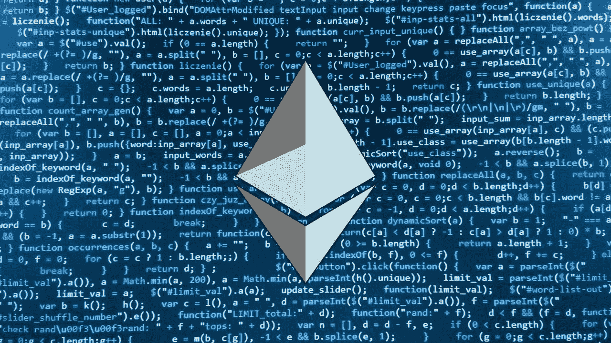
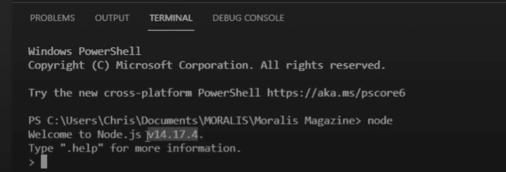
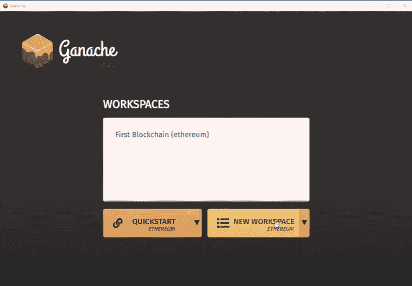
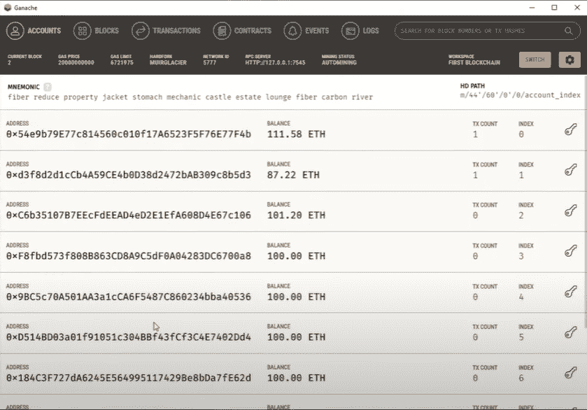

# 初学者以太坊开发

> 原文：<https://moralis.io/ethereum-development-for-beginners/>

随着越来越多的公司开始采用区块链技术，对以太坊开发的兴趣正在高涨。以太坊开发者需求量大已经不是什么秘密了，供应根本跟不上需求。其中一个原因可能是程序员可能认为以太坊的开发太具挑战性了。然而，以太坊的开发并不像看起来那么困难，尤其是当你利用 Moralis 的时候。在这篇“初学者以太坊开发”文章中，我们将回顾开始以太坊开发之旅需要知道的一切。

在下面的章节中，我们将涵盖所有你需要知道的，使你能够用 Moralis 设置以太坊开发的基本工具。这将有助于你马上开始进行简单的基于以太坊的项目。此外，虽然可能有很多著名的区块链可用，以太坊仍然是 dApp 开发的主导。因此，学习以太坊编程是必由之路。

我们将介绍四种简单易用的主要工具，它们将对您的开发过程有所帮助。然而，能显著加速你的 [Web3](https://moralis.io/the-ultimate-guide-to-web3-what-is-web3/) 开发的最重要的工具当然是[Moralis 规范](https://moralis.io/)。Moralis 是市场上领先的 Web3 开发平台。因此，它使开发人员能够专注于应用程序的前端，而 Moralis 负责后端。因此，Moralis 让初学者的以太坊开发成为一个不复杂且简单的过程。如果您已经掌握了不错的 JavaScript 技能，本文将为您提供额外的知识来推进您的以太坊开发过程。Moralis 最大的好处是它是免费的。所以，请务必今天就在[与 Moralis 家](https://admin.moralis.io/register)签约！

# 以太坊开发的基本工具

如上所述，我们将帮助您熟悉四种基本工具，当将这些工具与 Moralis 结合使用时，它们将使初学者和有经验的程序员尽可能简单地开发以太坊。但是，你可以把这篇文章当作以太坊开发的入门指南。它涵盖了四个工具，可以帮助你建立 Moralis。其中包括 [MetaMask](https://moralis.io/metamask-explained-what-is-metamask/) ，Visual Studio 代码， [Node.js](https://moralis.io/node-js-explained-what-is-node-js/) ，以及 [Ganache](https://moralis.io/ganache-explained-what-is-ganache-blockchain/) 。但是，如果您不熟悉这些工具，也不用担心。在整篇文章中，我们将简要介绍和解释它们，并说明从哪里获得它们。

与其深究以太坊开发的理论，不如从行动开始学习以太坊编程。因此，这里介绍的所有工具将使您能够立即开始处理简单的项目，并逐渐掌握初学者的以太坊开发。然后，你可以进入更高级的项目和任务，提升你的技能。获得一些想法和后续练习教程的好地方是 [Moralis 的 YouTube 频道](https://www.youtube.com/channel/UCgWS9Q3P5AxCWyQLT2kQhBw)。事不宜迟，让我们看看第一个工具。

## 1\. MetaMask

如果你有从 Uniswap 或任何其他分散交易所(DEX)购买加密货币的经验，你很可能已经知道 MetaMask。然而，为了确保我们都在同一页上，让我们从基础开始。MetaMask 是最受欢迎的加密货币钱包之一。它支持多种硬币和代币，您可以在钱包界面内发送、接收甚至交换。此外，MetaMask 还可以用作 Web3 应用的[认证工具](https://moralis.io/how-to-authenticate-with-metamask/)。作为一个以太坊开发者，你应该知道如何为你的 dApp 实现 MetaMask。这样，用户可以登录、签署交易等。使用 Moralis，您只需一行代码就可以实现元掩码并验证用户。

要获得元掩码，你有两个选择:下载他们的移动应用程序，或安装浏览器扩展。然而，在本文中，我们将使用 MetaMask 的浏览器扩展。因此，我们强烈建议您也使用它。

要开始使用 MetaMask，请在 URL 栏中输入他们的 URL 地址(https://metamask.io)。这样，你将被引导到他们的官方网站，并保持安全，而不是使用搜索引擎，可以提供不可信的结果。

在 MetaMask 官方网站上，点击右上角的“下载”选项。然后，在 Chrome、iOS 和 Android 之间进行选择，最后，单击“为 Chrome 安装 MetaMask”按钮。

要更深入地了解什么是元掩码以及如何使用它，我们建议阅读 Moralis 的以下文章:“[元掩码解释-什么是元掩码](https://moralis.io/metamask-explained-what-is-metamask/)”。

现在，让我们继续我们的“初学者以太坊开发”旅程中需要的第二个工具。

## 2.Visual Studio 代码

要学习以太坊开发，您需要获得和练习的下一个工具是代码编辑器。正如你可能想象的那样，网上有许多著名的免费代码编辑器。但是，我们将重点关注 Visual Studio 代码。最简单和最安全的方法是直接在地址栏中输入或复制粘贴他们的官方网址(https://code.visualstudio.com)。

一旦你登陆他们的官方网站，点击“下载”按钮(确保选择你的操作系统)。然后在你的电脑上安装应用程序，并立即启动它。现在，我们需要帮助您设置一些基础。

为了确保正确地学习以太坊编程，您需要在 Visual Studio 代码中安装几个扩展。您可能不会马上需要这些扩展；然而，它们对于你将来的以太坊编程是必不可少的。我们将要讨论的扩展将极大地帮助您进行编码和调试。

要在 Visual Studio 代码中添加扩展，请使用顶部导航栏，单击“查看”,然后在下拉菜单中单击“扩展”。您也可以使用侧边栏中的底部图标(如下图所示)来添加扩展。

我们建议安装的三个扩展(使用搜索栏找到它们)是:

*   ES7 React/Redux/graph QL/React-原生代码片段。
*   直播服务器。
*   [坚实度](https://moralis.io/solidity-explained-what-is-solidity/)。

我们还建议您转到“查看>终端”(您可以在上图下拉菜单底部看到该选项)，这将使您能够直接从命令行与您的应用程序进行交互。

## 3.节点. js

您需要安装的第三个工具是 Node.js。现在，您已经知道该步骤了——在地址栏中键入该工具的官方网站 URL 地址(https://nodejs.org)。在这一点上，我们还想告诉你，通过使用 Moralis，你将不再经常需要 Node.js。但是，有些情况下可能需要在浏览器之外执行任务。此外，在需要安装额外的 js 包(比如 NPM 包)的情况下，Node.js 也将发挥重要作用。

如果您可能认为已经安装了 Node.js，但又不确定，可以通过键入“Node”在 Visual Studio 代码中使用终端。结果会告诉你是否安装了它。如果你真的已经有了，终端会告诉你你有哪个版本(见下图)。

如果您还没有安装 Node.js，上述步骤将返回某种错误。如果是这样，你要访问 Node.js 官方网站(如上所述)，点击顶部菜单栏的“下载”选项，然后下载与你的操作系统匹配的版本。下载完成后，将 Node.js 安装到您的计算机上。然后，您将能够通过 Visual Studio 代码中的终端命令行与 Node.js 进行交互。

我们现在准备进入这篇“初学者以太坊开发”文章的第四个也是最后一个工具。记住，这篇文章的主要目的是确保你用推荐的工具来装备自己，从而正确地学习以太坊编程。

## 4.加纳切

下载和安装 Ganache 的过程遵循与前三个工具相同的步骤。只需使用该工具的官方网站网址(https://www.trufflesuite.com/ganache ),并输入到地址栏。在那里，下载并安装在你的电脑上。

Ganache 对于在您的计算机上创建本地区块链环境非常有用。这非常实用，因为它可以帮助你创建一个“沙盒”环境，在这里你可以免费练习和测试你的 dApps(不用支付交易费用)。如果你对以太坊略知一二，那么你会意识到与区块链相关的高额燃气费。因此，在开发 dApps 时避免花费大量的 ETH 是有意义的，尤其是当您刚刚开始以太坊编程时。

一旦你安装并运行了 Ganache，它会给你两个主要选项:“快速启动”和“新工作区”，如下图所示。选择最适合您需求的一款。

当你在你的 Ganache 工作空间内时，它将为你提供多个 ETH 地址，其中包括你可以用来测试的资金(见下图)。

对于初学者来说，这就是我们标记为以太坊开发必备的四个工具。您也可以观看下面的视频，帮助您完成上述步骤。

https://www.youtube.com/watch?v=pnPgoP5AXJs

此外，如前所述，Moralis 是您不可或缺的首要工具，因为它将使您能够以令人印象深刻的速度和轻松程度交付最终结果。此外，我们强烈建议查看 Moralis 文档，其中有一节展示了如何使用 Moralis 的力量在 3 分钟内构建一个简单的 dApp。

## 学习以太坊编程——终极捷径

我们强烈推荐以上四个工具给每个想学习以太坊编程的人。此外，随着你以太坊开发技能的提高，你肯定会使用所有这些技能，并且还会向你的武器库中添加许多其他工具。然而，由于我们坚信有效性和效率，我们希望为您尽可能简化事情。因此，初学者的以太坊开发可以通过利用 Moralis 进一步简化。通过将 Moralis 与 MetaMask 和许多其他工具结合使用，您可以快速轻松地创建非凡的 dApps。

Moralis 使您能够使用您的 JavaScript 技能，并将您的最大注意力投入到前端开发中。这样，你将确保一个壮观的用户体验，这是大多数项目的主要目的。如果你有很棒的用户体验，人们会用你的 dApps 这是毫无疑问的。此外，您可以节省大量时间，否则这些时间会浪费在处理相当复杂的后端区块链相关的编程上。

此外，我们知道你们中的一些人可能还不知道 JavaScript。如果是这样的话，我们也有一个解决方案给你。在 Ivan on Tech Academy，有一门很棒的课程叫做“[区块链开发者 JavaScript 编程](https://academy.ivanontech.com/courses/javascript-programming-for-blockchain-developers)”，教你 JavaScript，让你做好在区块链开发中使用它的准备。只需点击上面的链接，报名参加这个课程，这将推进你的职业生涯，并帮助你马上成为全职加密！

## 初学者以太坊开发——总结

在这篇文章中，我们已经讨论了很多内容。在这个阶段，你知道在学习以太坊编程时，迟早会用到四个基本工具。这四个工具分别是 MetaMask、Visual Studio Code、Node.js 和 Ganache。此外，在整篇文章中，我们为您提供了如何获得这些工具并设置基础的指导。

此外，还向您介绍了最终的 Web3 开发平台 Moralis。你现在知道了 Moralis 是免费的和强大的，这使得 Moralis 成为市场上领先的平台。它也很容易使用，这在很大程度上归功于其整洁的[文档](https://docs.moralis.io/)。该文档旨在帮助您加快学习曲线和交付 dApps 的实际过程。此外，要开始使用 Moralis 并构建 dApps，您只需要这里介绍的四个工具之一——meta mask。但是，您确实需要了解 JavaScript。

幸运的是，MetaMask 基本上是使用起来最简单的工具之一，JavaScript 是一种容易掌握的编程语言。然而，即使你对后者一无所知，在[学院](https://academy.ivanontech.com/)有一门很好的课程，可以带你从“初学者以太坊开发”阶段立即进入专业水平。

现在，您已经掌握了学习以太坊编程所需的所有信息。因此，一定要采取行动——开始着手一些示例项目，了解更多关于 Moralis 的细节，拓展你的 JavaScript 技能，等等。今天就去做全职加密！