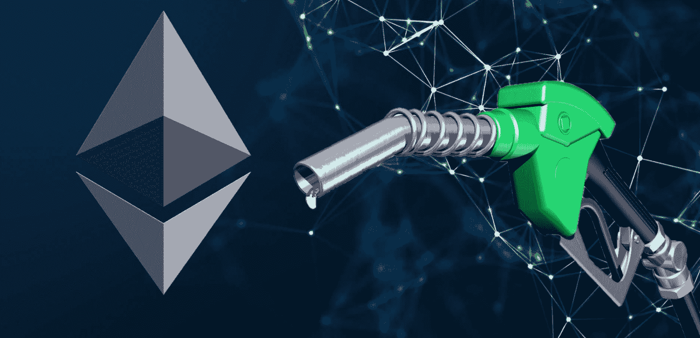
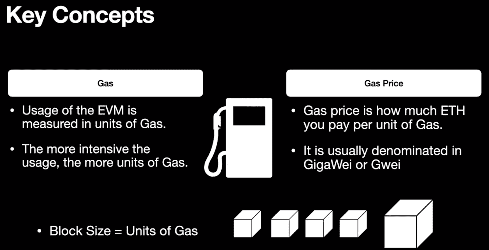
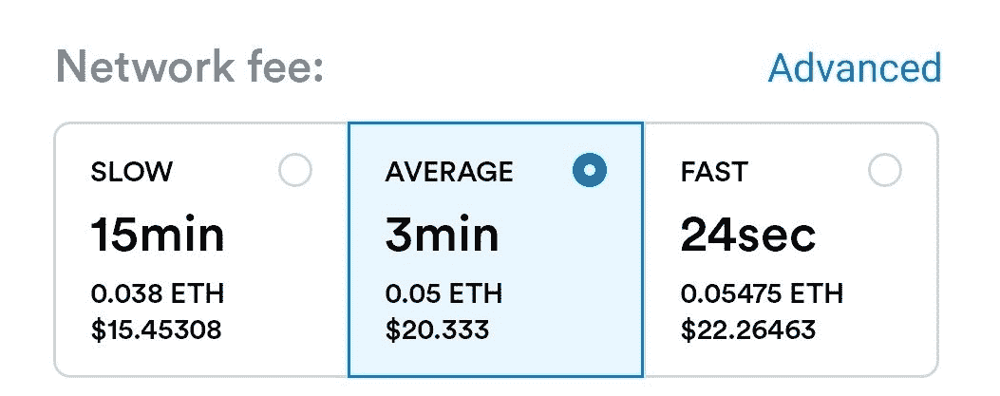
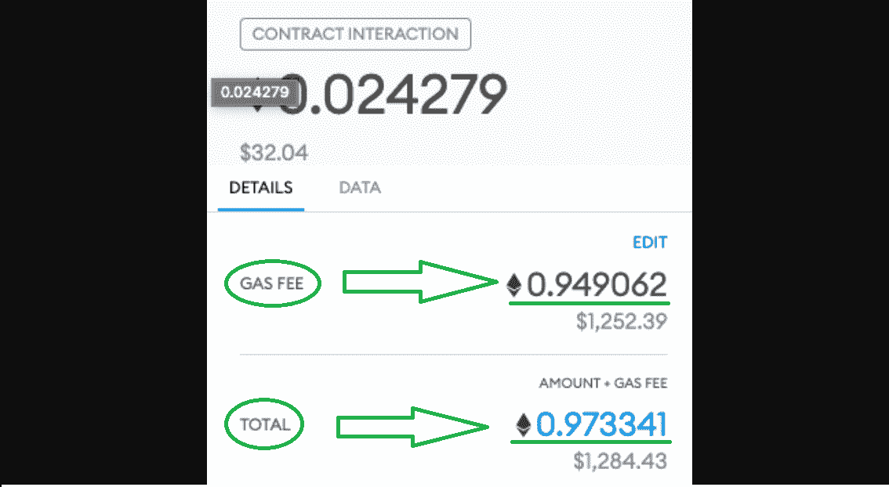
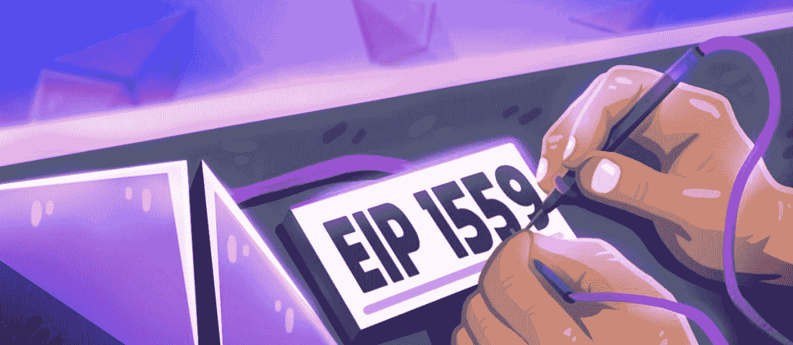
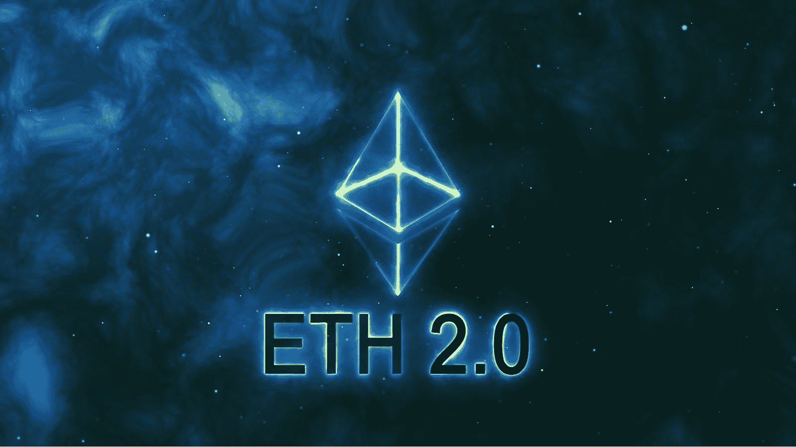
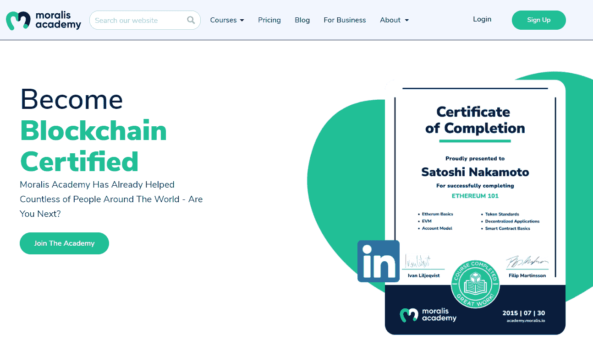

# 以太坊燃气费-2022 年终极指南

> 原文：<https://moralis.io/ethereum-gas-fees-the-ultimate-2022-guide/>

虽然比特币可能在很大程度上仍然是加密的同义词，但 Web3 采用的许多真正进展来自以太坊等可编程区块链。以太坊也一直引领着其他智能合约网络，这些网络正获得越来越多的认可。因此，我们都认识到，在过去的几年里，加密领域已经取得了长足的进步。然而，以太坊还有一个问题没有解决。也就是说，这与汽油费有关。即使以太坊的汽油费很高，大多数区块链开发者仍然使用它的网络、令牌标准等。然而，一些程序员甚至没有想到以太坊燃气费会如何影响他们的区块链项目，无论是积极的还是消极的。因此，我们创建了 2022 年以太坊燃气费终极指南，以便您在执行交易时能够充分了解如何与以太坊互动。

记住这一点，对以太坊燃气费有一个正确的理解是很重要的。它们是与以太坊网络互动的重要部分。无论是买卖、送代币、ETH，还是完成其他交易，都要了解网络费用。另外，如果你真的想成为一名区块链开发者，那就更是如此了。因此，在本文中，我们将解决最近收到的与以太坊燃气费相关的所有主要问题。因此，你将有机会了解以太币气体费是如何工作的，如何计算和估计它们。还有，你会知道以太坊煤气费为什么这么高。尽管如此，我们也将解释 EIP-1559 如何影响以太坊燃气费，以及以太坊 2.0 会带来什么。然而，我们将从解释什么是以太坊燃气费开始，以确保我们都跟上。

## 以太坊燃气费解释

如前所述，我们将涵盖与以太坊燃气费相关的所有方面。当然，我们可以关注许多细节；然而，我们主要想为您提供一个体面的概述。在继续前进之前，我们还必须注意到所有其他 [EVM](https://moralis.io/evm-explained-what-is-ethereum-virtual-machine/) 兼容链(如[多边形](https://moralis.io/how-to-build-polygon-dapps-easily/)，币安智能链 [BSC](https://moralis.io/bsc-programming-guide-intro-to-binance-smart-chain-development-in-10-minutes/) ，[雪崩](https://moralis.io/how-to-build-avalanche-dapps-in-minutes/)等。)也有网络交易费。因此，当你在这些网络中工作时，适当地考虑以太坊煤气费用会使你受益。这也适用于使用[Moralis](https://moralis.io/)’[Web 3.0](https://moralis.io/the-ultimate-guide-to-web3-what-is-web3/)开发平台时。由于这个" [Firebase for crypto](https://moralis.io/firebase-for-crypto-the-best-blockchain-firebase-alternative/) "平台支持大多数主要的 EVM 兼容链，了解网络费用将对你有用。此外，网络费用也适用于所有[以太坊测试网](https://moralis.io/ethereum-testnet-guide-connect-to-ethereum-testnets/)和其他网络的测试网。因此，请确保适当关注以下部分。

然而，如果你已经对以太坊燃气费有了一个坚实的了解，并渴望开始建设，请确保查看我们的一些示例项目指南。我们的一些最新文章向您展示了 [*如何通过网站*](https://moralis.io/how-to-interact-with-smart-contracts-through-your-website/)*[*如何认证 Android 应用*](https://moralis.io/walletconnect-android-sdk-alternative-authenticate-android-apps-withmoralis/)*[*如何索引区块链*](https://moralis.io/how-to-index-the-blockchain-the-ultimate-guide/) *等等。接下来，* [*创建你的免费 Moralis 账户*](https://admin.moralis.io/register) *并建立一些现象级的*[*dApps*](https://moralis.io/decentralized-applications-explained-what-are-dapps/)*！***

## **以太坊气费是什么？**

**如果你想理解并能够回答“以太币气费是什么？”自信地说，你需要理解几个关键概念。首先，你需要知道什么是天然气，为什么它如此重要。如果你了解以太坊网络的基础知识，你就会知道以太坊虚拟机(EVM)充当全局处理器，它由矿工提供动力。他们执行 EVM [智能合约](https://moralis.io/smart-contracts-explained-what-are-smart-contracts/)并通过向区块链添加新区块来应用其效果。此外，EVM 的使用是以气体为单位来测量的。因此，使用越密集，消耗的气体单位就越多。本质上，天然气是驱动 EVM 的燃料；但是，它也是该燃料的计量单位。而且以 gwei(千兆位)计价，等于 10-9ETH(0.000000001 ETH = 1 gwei)。**

**许多人没有意识到的是，每个具体的操作都有一个固定的天然气价格，这在以太坊的黄皮书中有明确的规定。然而，天然气的价格根据供求因素而变化。因此，一种气体在 gwei 中没有固定值。此外，该块的大小是该块中包括的一组事务所使用的气体总量的函数。这意味着块包含的数据量不是由数据的度量给出的，而是作为所涉及的事务的计算的度量。本质上，以太坊气费是对用户征收的费用，以补偿相关过程所需的计算能量。这也是“气限”发挥作用的地方。它是用户在一次交易中准备花费的最大汽油量。**

**

## 以太坊燃气费是怎么运作的？

现在你知道以太坊气费是什么了，我们来看看它们是怎么运作的。由于以太坊仍在使用工作证明(PoW)概念，矿工扮演着至关重要的角色。它们提供验证和处理交易所需的计算能力。因此，每笔交易背后都有一个矿工。此外，由于指望矿工无偿工作是荒谬的，他们必须得到补偿。后者是用以太币气费完成的。因此，你也可以将网络天然气费视为对矿工的奖励。gwei 的确切天然气价格主要取决于网络堵塞情况。然而，天然气的数量取决于你要执行多大的合同，以及你希望合同执行的速度。

为了更好地理解以太坊煤气费的工作原理，让我们看一个例子。假设约翰想给玛丽寄一封信。为此，他需要 1 ETH +一笔必要的以太币汽油费。假设约翰有足够的资金，玛丽将得到 1 ETH，而矿工将得到一部分天然气费。

### 以太气怎么算

截至 2021 年 8 月，确切的天然气费用是使用一级价格拍卖模型(传统天然气定价模型)计算的。一些 EVM 兼容的区块链(如 BSC)仍然使用这种方法。然而，使用传统定价模型进行的天然气费用预测并不十分准确。因此，在提交交易请求和实际交易之间，gas 可能已经改变。这往往导致用户白白支付燃气费。此外，交易可能经常长时间停滞不前。此外，虽然传统的天然气定价计算相当简单，但新的(EIP-1559)稍微复杂一些。那么，我们来仔细看看以太气是怎么计算的。

有了新模型后，计算总交易费的方法如下:

***总交易费=用气单位(限额)*(基础费+小费)***

在上式中，以太坊黄皮书(附录“G”)中定义了气体单位或气体限值。基本费用是在伦敦网络升级时引入的，每个街区都有。这是区块内每单位天然气的最低价格。基本费用由网络根据当前对块空间的需求来计算。此外，基础原料被烧掉(销毁或停止流通)。而且优先费(小费)是用来奖励矿工的。另外，请注意，小费通常是由大多数钱包自动设定的。

#### 以太坊燃气费计算示例

如果我们现在使用上一节中的示例事务，我们可以计算汽油费。当然，我们需要知道油费上限、基本费用和小费的准确值。我们假设现在的基础费是 100 gwei。而且，假设约翰加了 10 gwei 的小费。使用以太坊黄皮书，我们还知道交易的气体限制是 21000。综上所述，我们得到:

***21000 *(100+10)gwei = 2310000 gwei = 0.00231 ETH***

对于这个例子，John 需要 1.00231 ETH 来发送 1 ETH 给 Mary。进一步说，在 0.00231 ETH(总交易费)中，0.0021 ETH 是基础费，是烧掉的。(*这就是为什么以太坊现在可以在大量交易执行的时候出现通缩。)*而且，0.00021 ETH 的小费是矿工领取的。

## 估算以太坊天然气价格

如上所述，在伦敦 hardfork 之后，天然气费用预测更加准确。这是因为它使用前一个区块的详细信息来计算基本费用，而不是当前区块的。而且利用上面的等式结合以太坊黄皮书和以太坊扫描上的[以太坊燃气追踪器](https://etherscan.io/gastracker)，就可以计算出以太坊燃气费。正如你现在看到的，关键是正确估计当前以太坊气价。因此，你也可以使用一些基本的[坚实度](https://moralis.io/solidity-explained-what-is-solidity/)技能结合特定的智能合同来估算以太坊天然气价格。然后，您可以在其他合同和 dApps 中将其用作工具。此外，通过利用 [Remix](https://moralis.io/remix-explained-what-is-remix/) ，你可以很容易地测试你的智能合同。

如果你有兴趣了解更多，请务必观看下面的视频，从 14:08 开始。在那里，你将能够看到一个 Moralis 专家承担一个示例项目。他会先告诉你关于代码文件的细节(可在 [GitHub](https://github.com/DanielMoralisSamples/29_Gas_Full_Course) 获得)。然后，他将指导您了解“Store_secret.sol”智能合同的详细信息。在这里，您将能够看到“gasleft()”工具的威力。接下来，他将通过在 Remix 中运行向您展示合同是如何工作的。尽管如此，您还可以构建一个简单的用户界面。

https://www.youtube.com/watch?v=t9Gii8JWEvY

## 以太坊燃气费为什么这么高？

这可能会让你感到震惊，但高昂的以太坊燃气费实际上是一个好兆头，至少在某种程度上是这样。它们表明网络上有很多感兴趣的活跃用户。你看，每一次计算、存储或操作数据，以及令牌的转移都要消耗一定量的“气体”单位。此外，以太坊上的 dApps 越复杂，它们占用的有限块空间就越大。

当然，高昂的燃气费是一个现实问题，尤其是对于普通用户来说，他们无法承担数百或数千美元的费用。因此，以太坊网络目前面临着一个悖论。一方面，以太坊支持者希望以太坊不断获得人气。另一方面，他们也希望汽油费保持合理的低水平。目前，这两个方面并没有“携手并进”。然而，以太坊 2.0 将会解决这个问题(稍后会详细介绍)。

### EIP-1559 气体进料效应

上面，我们已经谈了很多以太坊燃气费现在是如何计算的细节。因此，你已经知道了很多关于 EIP-1559(伦敦升级版或 hardfork)。但是，为了确保每个人都了解对传统天然气定价模式所做的主要更改，让我们做一个快速概述:

*   EIP 法案-1559 使得交易费用更加可预测(更好的交易费用估算)。
*   **它使得交易包容性普遍更快。**
*   **EIP-1559 还引入了通过消耗一定比例的交易费用来抵消联邦政府债券发行的做法。**
*   现在，每个区块都有一个基本费用，由网络根据对区块空间的需求来计算。
*   **基费烧了。**
*   除了基本费用，还有小费或优先费用。后者作为对矿工的奖励。
*   它还引入了“maxFeePerGas ”,用户可以设置他们愿意为将要执行的交易支付多少钱。这使得他们支付的汽油价格不会高于市场价格(“baseFeePerGas”)，并在扣除小费后获得额外退款。

### 以太坊 2.0 后的燃气费

以太坊 2.0，Eth2，或 Serenity 指的是一组互联升级，使以太坊网络更加安全和可持续。关键的变化是从工作证明(PoW)转向利益证明(PoS)。此外，Eth2 有三个阶段，第一阶段(信标链)已经成功实现。剩下的两个阶段(“合并”和“碎片链”)将在 2022 年和 2023 年实施。由于这一系列升级将使该平台能够每秒处理数千笔交易，并在全球范围内扩展，预计还将大幅降低天然气费用。新的利益验证模型应能降低高功耗，从而降低费用。

## 以太坊天然气费用–2022 年终极指南–摘要

如果你已经完成了上面的章节，你现在已经是以太坊燃气费的半个专家了。因此，你现在应该清楚地了解以太坊燃气费是什么，它们是如何工作的，为什么它们很高，以及未来通过 Eth2 会发生什么。你还了解到 EIP-1559 法案对如何计算汽油费有很大的影响。另外，通过观看 Moralis 的一位专家，您将看到一个展示如何使用智能合同来估算以太坊天然气价格的示例项目。

如果你喜欢这篇文章，并想进一步拓宽你在区块链的视野，我们建议你访问[Moralis 的 YouTube 频道](https://www.youtube.com/c/MoralisWeb3)和[Moralis 的博客](https://moralis.io/blog/)。这两个出口都为您提供了一个伟大的地方，继续您的免费加密教育使用我们的专业解释和详细的指南。例如，我们的一些最新主题解释了[什么是 Web3 钱包](https://moralis.io/what-is-a-web3-wallet-web3-wallets-explained/)，什么是 [ERC20 契约](https://moralis.io/what-are-erc20-contracts-full-erc20-contract-guide/)，并向您展示了一个 [DAO 智能契约示例](https://moralis.io/dao-smart-contract-example-dao-guide/)，如何[将 mint 功能集成到 JS 接口](https://moralis.io/integrate-mint-function-to-js-interface-nft-development/)，如何[转移 ERC20 令牌](https://moralis.io/erc20-transfer-how-to-transfer-erc20-tokens/)，如何开发一个 [NFT 稀有度](https://moralis.io/how-to-develop-an-nft-rarity-ranking-dapp/)排名 dApp，等等。然而，如果你准备采取更专业的方法，一定要报名参加[Moralis 学院](https://academy.moralis.io/)。

**