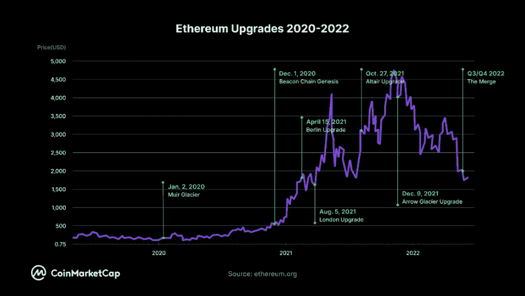
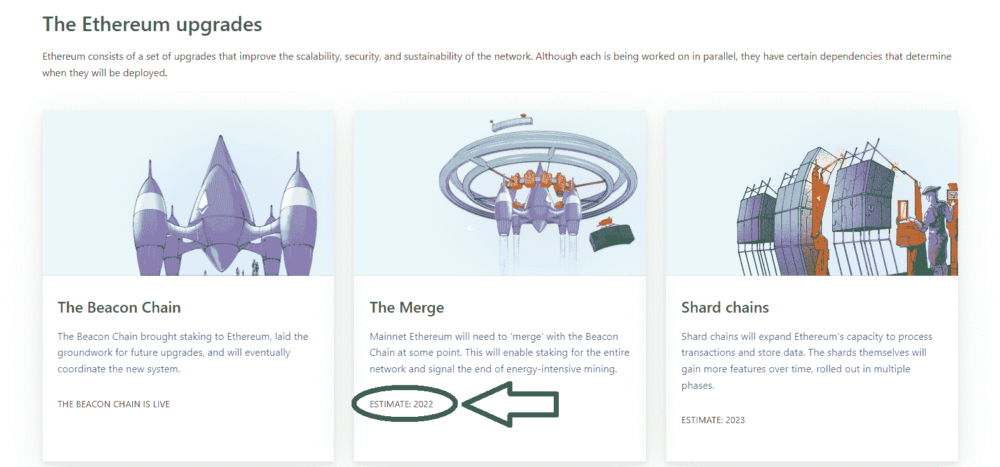
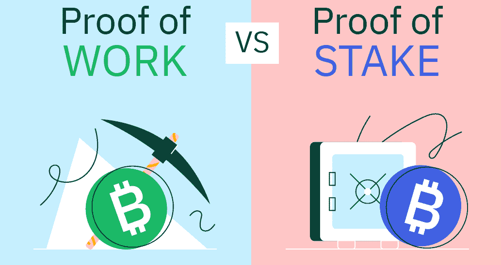
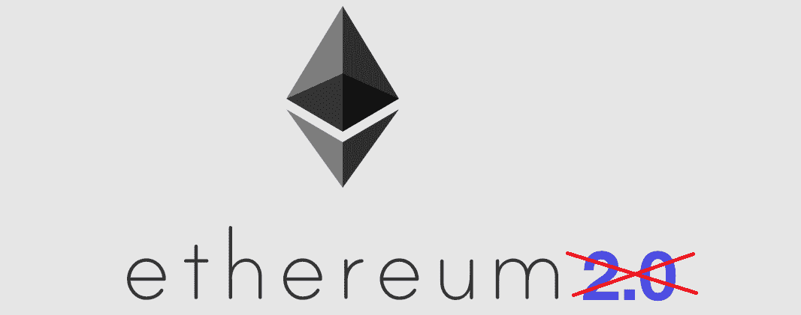
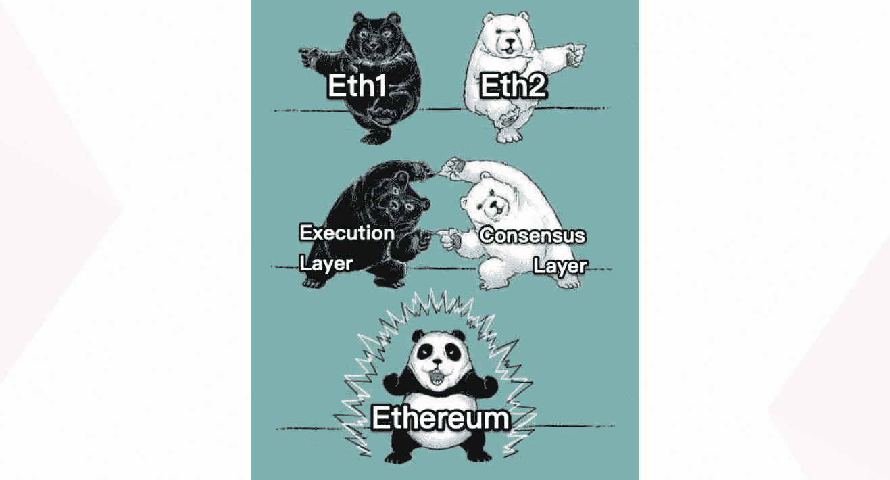
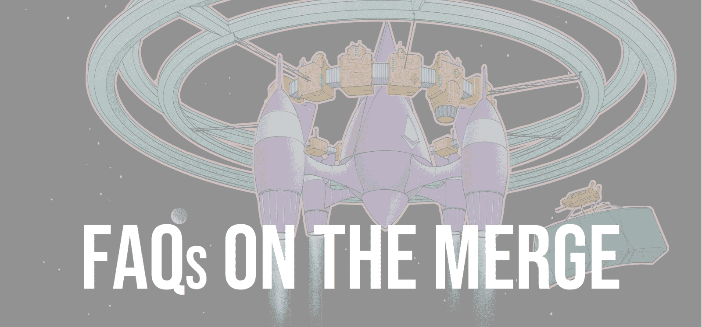
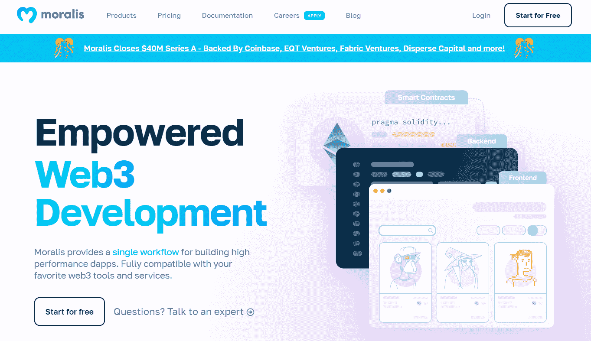
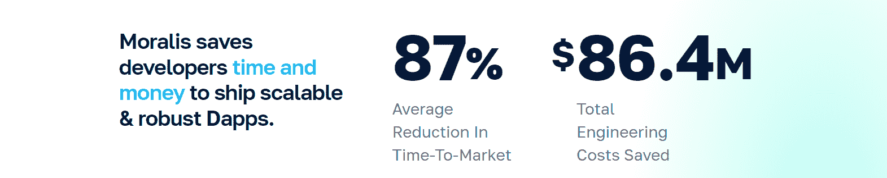
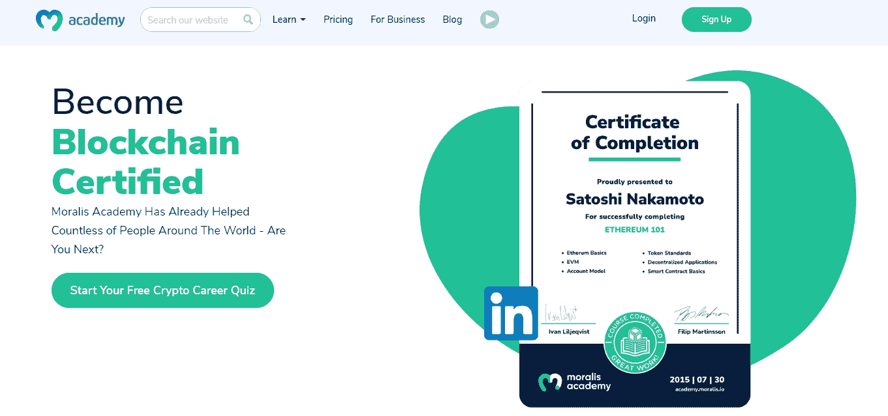

# 以太坊合并——什么是以太坊 2.0 和合并？

> 原文：<https://moralis.io/ethereum-merge-what-is-ethereum-2-0-and-the-merge/>

以太坊合并是这家领先连锁店期待已久的升级之一，预计将于今年晚些时候推出。虽然合并听起来可能不熟悉，但您可能听说过以太坊 2.0 或 Eth2。毕竟，自 2020 年 12 月以太坊的信标链推出以来，这些一直是最常用的术语，在这条链上下注成为可能。然而，不管你叫它什么，像“以太坊合并是什么？”以及“何时合并？”留下来。如果你有这些和类似的问题，那么这篇文章正是你所需要的！

下一步，我们会通知你关于合并的所有必要的事情。同时，我们还将解释以太坊利益证明和工作共识证明机制之间的区别。在讨论以太坊合并时，理解这些机制是至关重要的。此外，你还将了解到为什么“以太坊 2.0”永远不会出现。此外，当谈到这个期待已久的以太坊升级时，我们将回答一些最常见的问题。此外，作为网络用户或开发人员，您将了解到是否有任何需要注意的地方。尽管如此，您还将学习如何以面向未来的方式创建[分散式应用](https://moralis.io/decentralized-applications-explained-what-are-dapps/) (dapps)。有了 [Moralis](https://moralis.io/) ，你可以使用相同的代码部署在以太坊、非 EVM 或者 [EVM](https://moralis.io/evm-explained-what-is-ethereum-virtual-machine/) 兼容的链上。更有甚者，可以免费获得[开始使用 Moralis】！](https://admin.moralis.io/register)

## 以太坊合并是什么？

“合并”这个词本身就告诉你，合并与将某物连接在一起有关。你还在简介中了解到以太坊合并指的是领先的可编程链上即将到来的重要更新。此外，你可能还知道，除了以太坊主网和几个[以太坊测试网](https://moralis.io/ethereum-testnet-guide-connect-to-ethereum-testnets/)，还有以太坊的信标链。后者于 2020 年 12 月部署，但从一开始就处于“闲置”模式。目前，该链条仅用于固定 ETH。

然而，合并将把以太坊的 mainnet 和 Beacon 链合在一起。此外，这一更新非常重要，因为它将标志着能源密集型采矿的结束。后者被称为工作共识机制的证明，以太坊链目前使用它来确认交易。由于这种从一种共识机制到另一种共识机制的转变，你必须在某种程度上理解这两种机制。然而，在我们深入探讨 PoS vs PoW 之争之前，让我们也来看看合并将在何时发生。

## 以太坊什么时候合并？

看上面的截图，你可以看到以太坊合并的预计时间是 2022 年。因此，以太坊基金会还没有公布确切的日期。以下是以太坊基金会提供的最“具体”的日期:“2022 年 6 月后的几个月”。因此，2022 年第三季度或第四季度是我们可以期待合并铺开的时候。然而，正如你可能知道的，以前的以太坊更新通常会被推迟几次。因此，我们可以预期以太坊的合并也会推迟。也就是说，目前“预定”的 2022 年可能很容易变成 2023 年。

## 合并——从 PoW 到 PoS

有一些混合共识机制活跃在某些区块链。然而，股权证明(PoS)和工作证明(PoW)是验证区块链交易的两种主要方式。如上所述，以太坊目前使用的是 PoW，即网络贡献者利用强大计算机的计算能力来确认交易。再者，这也是比特币使用的共识机制，也就是你所知道的挖矿。因此，在一个由[以太坊节点](https://moralis.io/how-to-connect-to-ethereum-nodes/)组成的分散网络中，计算机通过解决数学难题来“挖掘”交易。计算机本质上竞争首先解决难题并且收集采矿奖赏。在以太坊上，矿工们赚取 ETH(比特币的 BTC)。有了所有这些强大的计算机参与，很容易理解 PoW 是相当耗能的。此外，考虑到持续的环境问题(全球变暖加剧)，我们必须随时随地优先考虑能源效率。

另一方面，在 PoS 共识中，验证者以“利益相关者”的形式出现。这些加密地址已经锁定了大量的本地加密货币。在以太坊的信标链上，验证者必须使用以太(ETH)。赌注越大，赌注奖励越高。因此，这种形式的交易确认比 power 更节能。你可能同意，如果有一个不损害安全性的更环保的解决方案，开发人员应该优先考虑它。这正是以太坊社区采取的立场。因此，七年多来，他们一直致力于向 PoS 过渡。此外，以太坊的合并是深思熟虑的长期规划的结果。

## 以太坊合并解释

此次合并是旨在使以太坊更具可扩展性、安全性和可持续性的三大升级之一。也许你知道这一组更新是以太坊 2.0。这是以太坊的三大升级:

*   信标链(2020 年部署)
*   合并(计划于 2022 年进行)
*   碎片链(计划于 2023 年推出)

以太坊在一直相对平稳运行的同时，也消耗了大量的能量。因此，使网络更加环保是走向主流应用的重要一步。此外，如果你以前使用过以太坊，你一定注意到了网络过高的交易费用。此外，[以太币气费](https://moralis.io/ethereum-gas-fees-the-ultimate-2022-guide/)一直是用户和开发者的主要痛点。

因此，只有财力雄厚的用户和开发者才能利用这个链条。即使你财力雄厚，你也很可能同意，在 Uniswap 上为一个仅值几美元的东西支付超过 50 美元的交易费是荒谬的。因此，以太坊的合并将使以太坊更加节能，并提高连锁店的速度和价格。然而，你不应该期望以太坊的煤气费在合并后会更低。后者只会为未来的升级创造条件，从而降低燃气费成本。

## 信标链和 Mainnet 合并

此外，你还应该注意到，以太坊的信标链从 2020 年就开始成功运行了。这就是使用 PoS 的以太坊连锁。然而，这种链条除了用于固定之外，没有其他用途。所有 ETH 交易、智能合约和 dapps 都活跃在以太坊主网上。这将持续到合并。然后，这两者(mainnet 和信标链)将结合在一起，形成一个利用 PoS 概念的升级以太坊。这一升级的主要直接好处是预期能效提高 99%。

## 合并 vs 以太坊 2.0

上面列出的以太坊升级集以前被称为以太坊 2.0。然而，2022 年 1 月，以太坊基金会决定废弃这个术语。因此，“以太坊 2.0”和“Eth2”不再有效。然而，由于许多人已经熟悉了这个术语，所以要逐步淘汰它还需要一些时间。此外，以太坊基金会决定摆脱“以太坊 2.0”的主要原因是为了避免混乱。由于合并将合并两个现有的网络，使用该术语没有意义。毕竟，这意味着有两条不同的链。事实上，在合并之后，mainnet(“et h1”)和 Beacon Chain(“eth 2”)将合二为一。

为了进一步澄清更新后的命名，请参考下图，该图将在以太坊合并后出现:

下面是对上述图形表示的解释:

*   Eth1 成为“**执行层**，处理事务和执行。
*   Eth2 成为“**共识层**”，处理以太坊的利益共识证明。
*   Eth1 + Eth2 成为(**执行层+共识层**)更新后的**以太坊**。

## 合并–常见问题

自从他们宣布以后，已经有很多关于以太坊升级的问题了。此外，名称的改变(去掉“以太坊 2.0”)虽然从长远来看很有意义，但也带来了额外的混乱。因此，我们想通过回答一些最常见的关于升级和以太坊合并的问题来澄清一些事情。

### 以太坊不是 2020 年就转 PoS 了吗？

当以太坊的信标链在 2020 年推出时，我们都有机会在这条链上下注。如上所述，在合并之前，打桩是该链的唯一功能。因此，许多人认为这意味着以太坊连锁店已经从 PoW 转向 PoS。让我们再次指出这是不正确的。在合并之前，以太坊主网是运营链。因此，战俘共识仍在发挥作用。

### 合并前后我需要做什么吗？

到目前为止，所有的公告都声明用户在合并前后不需要做任何事情。由于升级后的以太坊将包含以太坊(“Eth1”)的全部历史，所以过渡应该是平稳的。然而，一些不必要的复杂情况可能会改变这一点。因此，随着合并的临近，我们鼓励你关注以太坊基金会的新闻和公告。

### 如何入股 ETH？

自从 Beacon Chain 上线，你就有机会赌一把了。你可以通过锁定发射台或锁定泳池来做到这一点。但是，请记住，为了成为网络上的完全验证者，您需要至少 32 ETH。这是相当大的一笔开销，超出了我们大多数人的承受能力。幸运的是，赌注池是一个更容易获得的赌注选择。后者能让你减少赌注，赚取总回报的一小部分。

### 我什么时候可以认领？

如果你在信标链上押了 ETH，你将不能在合并后立即开始撤回它。相反，你还需要等待以太坊设备完成合并后的“清理”升级。

### 以太坊合并会影响 ETH 的分配吗？

正如你所知，合并将消除 ETH 采矿(没有更多的战俘)。这将减少大约 90%的 ETH 分配。由于 [EIP-1559](https://moralis.io/eip-1559-example-what-is-eip-1559/) ，如果以太坊网络上有大量的用户和交易，以太网甚至会变得通货紧缩。

### 合并将如何影响我的 Dapps？

根据提供的信息，你在以太坊区块链的 dapps 不会受到合并的影响。至少不是直接的。然而，以太坊基金会警告说，合并后的升级可能需要你做一些调整。

## 用 Moralis 让您的 Web3 开发面向未来

在开发 dapps 时，有一种方法可以避免将自己局限于某个特定的链。如果你想让你的 [dapp 开发](https://moralis.io/dapp-development-tutorial-full-guide-to-building-a-dapp/)经得起未来考验，这是非常重要的。使用正确的 [Web3 技术栈](https://moralis.io/exploring-the-web3-tech-stack-full-guide/)，你可以避免 RPC 节点的[限制。此外，你可以](https://moralis.io/exploring-the-limitations-of-rpc-nodes-and-the-solution-to-them/)[以 87%的速度创建以太坊 dapp](https://moralis.io/how-to-create-ethereum-dapps/)或其他链上的 dapp。这要归功于 Moralis 的力量。此外，你可以使用你的前端技能，如 [JavaScript](https://moralis.io/javascript-explained-what-is-javascript/) 或 Unity，结合终极 [Web3 后端平台](https://moralis.io/exploring-the-best-web3-backend-platform/)快速到达终点。事实上，您可以在几小时或几天内准备好您的最小可行产品(MVP ),而不是几周或几个月。如果您忘记了，让我们提醒您，Moralis，也就是加密的[Firebase](https://moralis.io/firebase-for-crypto-the-best-blockchain-firebase-alternative/)，是免费的。

此外，我们最新的话题可能是你最好的起点。比如你可以学习一个[以太坊 NFT API](https://moralis.io/what-is-an-ethereum-nft-api-ethereum-nft-apis-explained/) 、[多边形 NFT API](https://moralis.io/what-is-a-polygon-nft-api-polygon-nft-apis-explained/) 、[币安 NFT API](https://moralis.io/binance-nft-api-what-is-it-and-how-does-it-work/) 、[索拉纳 NFT API](https://moralis.io/solana-nft-api-exploring-the-ultimate-nft-api-for-solana/) 的来龙去脉。你还可以学习如何[获得索拉纳 NFT 元数据](https://moralis.io/how-to-get-solana-nft-metadata/)，[铸造数千个 NFT 游戏资产](https://moralis.io/how-to-mint-thousands-of-nft-game-assets/)，[将 Unity 资产上传到 IPFS](https://moralis.io/how-to-upload-unity-assets-to-ipfs/) ，或者创建一个 [crypto 情操 dapp](https://moralis.io/how-to-create-a-crypto-sentiment-dapp/) 。

## 以太坊合并——什么是以太坊 2.0 和合并？–总结

加密领域正在快速发展，这要求连锁店实施升级以进行必要的转变。这正是合并所反映的。通过联合以太坊现有的 mainnet 和 Beacon 链，升级后的以太坊将从 PoW 过渡到 PoS。因此，以太坊将变得更加节能。以太坊基金会还没有宣布以太坊合并的确切日期。然而，到目前为止，升级应该在 2022 年第三季度或第四季度推出。幸运的是，在合并之前或之后，您都不需要做任何事情。在以上章节中，您已经了解了所有这些内容以及更多内容。

您还了解了 Moralis 以及它如何彻底改变您的 Web3 开发游戏。我们鼓励您参与我们的一些示例项目，并对这个最终的 Web3 开发平台进行测试。你可以在 Moralis 的 YouTube 频道和 T2 的 Moralis 博客上找到无数的教程。此外，如果你想专注于 [Web3 游戏设计](https://moralis.io/web3-game-design-explaining-the-web3-game-design-process/)，那么 [Unity Weeb3 编程](https://moralis.io/unity-web3-beginners-guide-to-unity-web3-programming/)教程是你的起点。由于[不可替代令牌](https://moralis.io/non-fungible-tokens-explained-what-are-nfts/) (NFTs)继续风靡一时， [NFT 效用](https://moralis.io/nft-utility-exploring-nft-use-cases-in-2022/)也是一个重要的话题。或者，你已经准备好接受一些更高级的挑战。这些包括构建一个 [Uniswap DEX 克隆](https://moralis.io/build-a-uniswap-dex-clone-with-html-css-javascript-moralis-on-the-ethereum-network/)、一个 [Web3 Twitter 克隆](https://moralis.io/how-to-build-a-web3-twitter-clone/)、一个 [Web3 网飞克隆](https://moralis.io/how-to-develop-a-web3-netflix-clone/)、一个 [Web3 Spotify 克隆](https://moralis.io/how-to-build-a-web3-spotify-clone/)、一个[比特币基地克隆](https://moralis.io/cloning-coinbase-wallet-how-to-create-a-coinbase-clone/)、一个 [OpenSea 克隆](https://moralis.io/create-an-opensea-clone-build-an-nft-marketplace-like-opensea/)或一个用于 Web3 的 [Reddit 克隆。然而，如果你想满怀信心地成为一名 Web3 开发者，你可能需要报名参加 Moralis 学院！](https://moralis.io/create-a-reddit-clone-for-web3-step-by-step-guide/)

