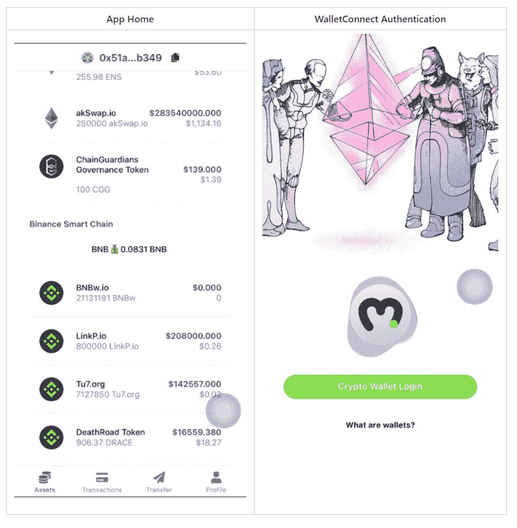
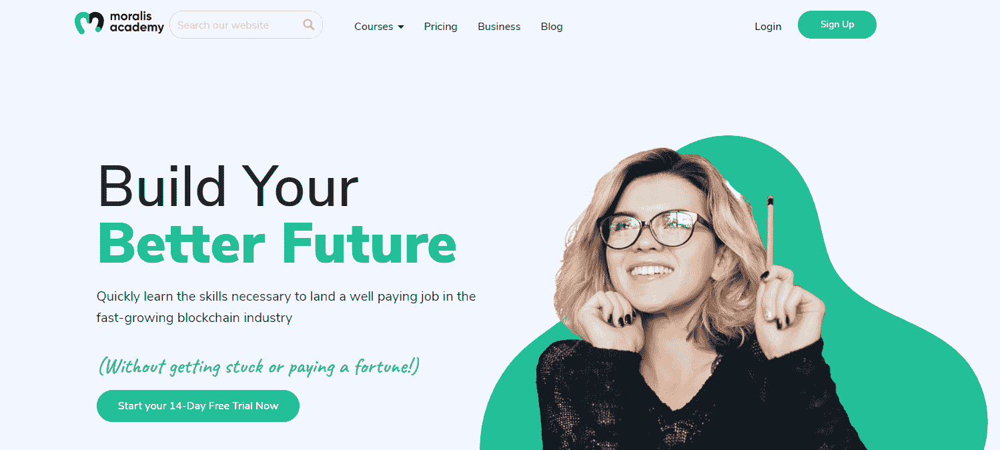
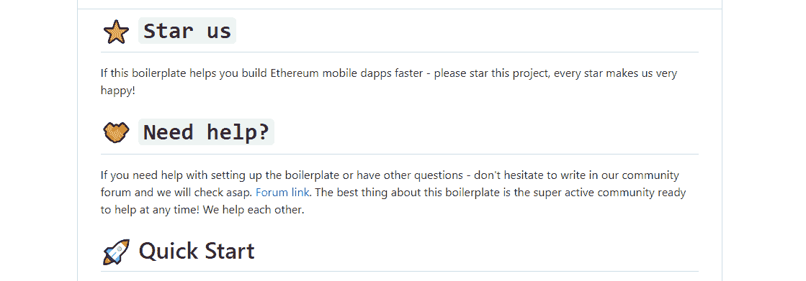
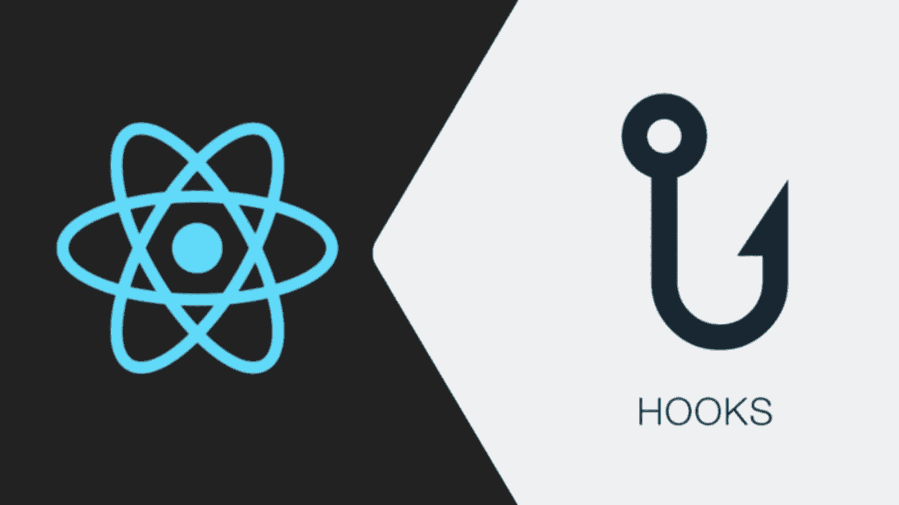
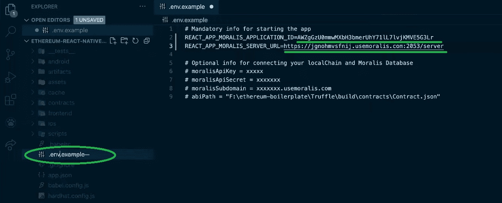
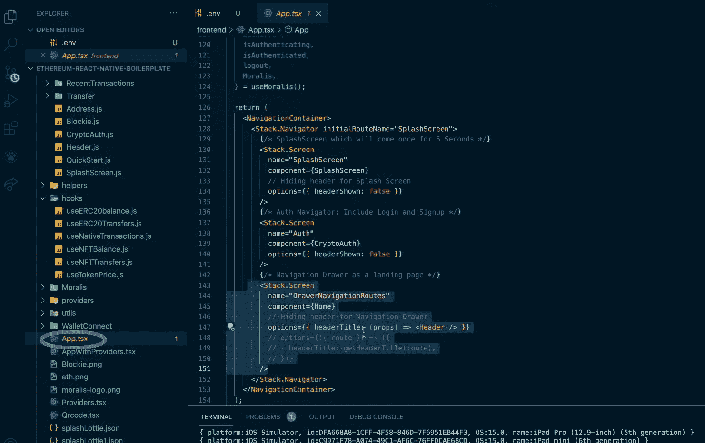

# 以太坊移动样板–移动以太坊完整指南

> 原文：<https://moralis.io/ethereum-mobile-boilerplate-full-guide-to-ethereum-for-mobile/>

多亏了以太坊，第一个可编程的区块链仍然保持领先地位，我们看到每天都有大量的[**【web 3】**](https://moralis.io/the-ultimate-guide-to-web3-what-is-web3/)**应用程序在以太坊的区块链上启动。然而，移动优先的方法在 dApp(分散应用)开发者中并不常见。这是不幸的，因为现在大多数用户倾向于使用他们的移动设备而不是他们的电脑。因此，** [**区块链开发者**](https://moralis.io/how-to-become-a-blockchain-developer/) **应该抓住机会，以移动优先的意图，专注于构建用户友好的**[**dApps**](https://moralis.io/decentralized-applications-explained-what-are-dapps/)**。因此，为了简化和缩短为智能手机创建以太坊 dApps 的开发过程，Moralis 创建了终极以太坊移动样板。这份完整的以太坊手机指南将探索这一非凡的样板文件及其组件，看看它是如何工作的，这样你就可以在创纪录的时间内创建和启动你的以太坊手机 dApp。**

*以太坊移动样板 GitHub w/完整代码和信息—*[*https://GitHub . com/以太坊-样板/以太坊-react-native-样板*](https://github.com/ethereum-boilerplate/ethereum-react-native-boilerplate)

Moralis 的终极 Web3 开发平台为前端开发人员配备了全栈 [Web3 SDK](https://moralis.io/exploring-moralis-sdk-the-ultimate-web3-sdk/) 来满足他们所有与区块链相关的后端需求。此外，整个平台的开发考虑到了跨链的互操作性。这样，你可以[首先创建以太坊 dapp](https://moralis.io/how-to-create-ethereum-dapps/)，然后轻松地将它们部署到其他知名连锁店。然而，为了进一步简化创建 Web3 应用程序的开发过程，我们最近创建了一个简单的[以太坊 dApp 样板](https://moralis.io/ethereum-dapp-boilerplate-full-ethereum-react-boilerplate-tutorial/)。此外，我们还在开发以太坊移动样板，以帮助开发者最大限度地方便移动用户进入加密领域。我们很兴奋地宣布后者已经准备好了。因此，我们想邀请您深入了解以太坊移动样板，向您展示它的主要特性、功能以及如何开始使用。此外，请确保[创建您的免费 Moralis 帐户](https://admin.moralis.io/register),这样您就能够跟随我们创建一个示例移动 dApp。

## 先决条件

我们创建了这个以太坊移动样板，即使是完全的初学者也可以在几分钟内建立并运行一个工作的移动 dApp。然而，为了充分利用 it 和 Moralis，建议您精通 JavaScript。此外，能够回答“[什么是 WalletConnect](https://moralis.io/what-is-walletconnect-the-ultimate-walletconnect-guide/) ”并知道如何使用它也是一个加分项。此外，习惯使用代码编辑器也会使事情变得简单。我们使用 Visual Studio 代码(VSC)；但是，请随意使用您选择的代码编辑器。

这个以太坊移动样板基于 [React 本地模板](https://moralis.io/create-mobile-ethereum-dapp-with-react-native-template/)。因此，熟悉 React Native 可能会帮助您更有信心地开始。然而，即使您以前只使用过 React，您也应该很容易上手。除了 Moralis、WalletConnect、 [MetaMask](https://moralis.io/metamask-explained-what-is-metamask/) 和代码编辑器，还有其他有用的开源网站，当你决定超越以太坊移动样板功能时，你可以在那里获得免费的代码模板来进一步加快过程。其中一个网站是[的 OpenZeppelin](https://moralis.io/what-is-openzeppelin-the-ultimate-guide/) 。此外，如果您对创建 web 应用程序感兴趣，我们可以引导您使用 MetaMask 构建 dApps。

尽管如此，如果你还不知道 JavaScript，我们建议你参加 Moralis 学院的 [2021 区块链开发者 JavaScript 编程](https://academy.moralis.io/courses/javascript-programming-for-blockchain-developers)课程。此外，一定要探索由[Moralis 学院](https://academy.moralis.io/)提供的其他优质课程。此外，如果你想在注册课程之前迈出一小步，我们鼓励你看看我们的文章，它告诉你如何在[成为一名区块链开发者](https://moralis.io/how-to-become-a-blockchain-developer/)的最佳途径。

## 以太坊移动样板演练

一旦您在 GitHub 页面上找到了最佳以太坊移动样板(在文章的顶部提供)，您将获得一些关于样板的有用信息。邀请您开始项目并加入社区后，您将看到快速启动部分。我们将在本文的后面详细介绍这一部分，因为我们将创建一个示例移动 dApp。所以，现在，让我们把重点放在以太坊组件和终极以太坊移动样板为您提供的挂钩上。

## 以太坊移动样板的组件

我们在这个样板文件中提供的以太坊组件包括许多功能和一个用户界面(UI)。因此，如果您希望在几分钟内准备好一个全功能的移动 dApp，那么它们是您的不二之选。而且，由于这个以太坊移动样板是一个活项目，会不断添加新的组件；但是，目前您可以访问以下内容:

*   **<【CryptoAuth/>**–该组件通过 WalletConnect 为 Web3 认证或[以太坊认证](https://moralis.io/ethereum-authentication-full-tutorial-to-ethereum-login-programming/)提供了一种简单易行的方式。
*   **<【native balance/>**–该组件使显示本地余额变得尽可能简单。而且，它附带了一个定义链的选项(默认链是以太坊)。
*   **<ERC 20 balance/>**-这个组件包括显示所有 ERC-20 代币的余额。就像“< NativeBalance / >”一样，它也附带了“链”选项来确定特定的链。
*   **<【资产/>**–该组件为您的移动 dApp 提供一个屏幕，显示该连锁店的所有 ERC-20 和本地资产及其价格。
*   **<recent transactions/>**–该组件为您的移动 dApp 提供所有 ERC-20 连锁交易。
*   **<【transaction details/>**–通过使用该组件，您可以访问一个显示所有 ERC 20 交易相关详细信息的模型。
*   **<地址/>**–该组件以可复制的方式显示用户的地址。

上述组件的另一个优点是，它们可以在移动 dApp 的任何地方使用。您所需要做的就是使用上面列出的命令之一。此外，如您所见，一些组件附带了额外的选项。此外，通过下面的示例项目，您将看到使用以太坊移动样板组件是多么容易。

## 如何使用挂钩

与组件不同，挂钩不包含 UI。然而，它们使你能够使用 [Moralis 的 Web3 API](https://docs.moralis.io/moralis-server/web3-sdk/intro) ，它将通过简单而简短的代码片段覆盖与区块链相关的后端功能。因此，当涉及到功能时，您会有额外的选择。此外，您可以根据用户的需求和愿望，使用您的前端技能并创建尽可能好的 UI。

此外，就像组件一样，我们计划随着时间的推移添加更多的挂钩，为您提供更多的选项。然而，这些是目前最实用的以太坊移动样板文件中可用的挂钩:

*   **useERC20balance()**
*   **useERC20Transfers()**
*   **useNativeTransactions()**
*   **use toke prentice()**
*   **使用 NFT 转移()**
*   **useNFTBalance()**

了解以上钩子的所有细节的最好方法是查看 [Moralis 的文档](https://docs.moralis.io/)。它是业界最好的文档之一，包括示例项目、视频解释等等。

## 以太坊移动样板应用–示例项目

如前所述，我们将进行一个示例项目，在该项目中，我们将使用以太坊移动样板在几分钟内创建一个全功能的移动 dApp。我们邀请您遵循每一个步骤，以充分利用这一部分。这样，你将学会如何为你未来的 dApp 努力做好准备。

### 移动 dApp 演示

在我们继续前进之前，我们希望你对我们将要创造的东西有一个坚实的概念。因此，让我们来看看我们完成的移动 dApp。这是登录页面的样子:

如上图所示，我们通过 WalletConnect 为用户提供了一个登录选项。只要用户点击“加密钱包登录”按钮，WalletConnect 就会让他们选择想要用来登录的钱包。在这次演示中，我们选择了 Trust Wallet。

一旦您验证了用户，用户就可以登录并访问 dApp 的功能。其中包括查看多个链上的资产和余额(目前支持的链有:以太坊、币安智能链、雪崩和多边形)。

第二个选项卡显示交易。用户只需点击一下，就可以轻松获取任何交易的详细信息。这将弹出一个窗口，显示详细信息和到事务浏览器的链接。接下来，我们有“Transfer”选项卡，您的用户可以在其中发送资产。他们只需输入接收人的地址，选择要发送的资产，输入金额，然后点击“转账”按钮(在输入所有之前的详细信息后，该按钮将变为活动状态):

最后，我们有“个人资料”选项卡，用户可以在这里注销。这样，dApp 再次显示初始登录屏幕。

如果你对 Web3 应用程序略知一二，你会发现上面的移动 dApp 包含了所有的基本功能。看起来也很整洁干净。此外，最棒的是，您可以使用终极以太坊移动样板在几分钟内创建它。

### 入门指南

开始使用以太坊移动样板非常简单。实际上，您需要完成以下五个步骤，如下图所示:

然而，上面的一些步骤需要一些额外的子步骤来做好准备。因此，让我们一起来完成每一步。

首先，我们需要克隆或派生以太坊移动样板。您可以点击 GitHub URL 旁边的复制图标:

然后进入代码编辑器(在我们的例子中是 VSC ),将复制的 URL 粘贴到 VSC 的终端中:

展望未来，我们需要在全球范围内安装“世博 CLI”。我们将代码从以太坊移动样板的 GitHub 页面复制到代码编辑器的终端:

接下来，我们需要将“. env.example”文件重命名为”。env "并插入您的 Moralis 服务器 URL 和应用程序 ID(按照下面小节中的说明设置您的服务器并获取其详细信息):

然后我们需要安装所有的依赖项。但是，由于我们已经在文件夹中，我们可以跳过"*CD ether eum-react-native-boilerplate*"命令，继续执行下一个命令。所以，键入或粘贴"*纱安装"*在终端:

现在剩下要做的就是运行你的 dApp。为此您需要使用的命令取决于您正在使用的操作系统:

*   **网**:纱网
*   **iOS** :纱线 iOS
*   **安卓**:纱安卓

因为我们使用的是 iOS，所以我们使用" *yarn ios"* 命令，这也将自动启动移动应用模拟器:

#### Moralis 服务器设置

为了使用以太坊移动样板，请完成以下步骤:

1.  **登录你的 Moralis 利斯账户**–*此时，你可能已经准备好了你的 Moralis 利斯账户。所以，只要[登录](https://admin.moralis.io/login)进入你的管理区。然而，如果你还没有创建你的免费 Moralis 账户，请确保现在通过注册免费的[来创建。](https://admin.moralis.io/register)*

***创建一个新服务器**–一旦你进入你的 Moralis 管理区(如下图所示)，点击右上角的“+创建一个新服务器”按钮。这将导致一个下拉菜单出现。然后选择最适合您需求的网络类型。例如项目，你可以选择“Testnet 服务器”(查看我们的[以太坊 testnet](https://moralis.io/ethereum-testnet-guide-connect-to-ethereum-testnets/) 指南)；然而，一旦你想要得到你的 dApps 生活，你会想要选择“Mainnet 服务器”选项。*

**

*接下来，您将看到一个弹出窗口，要求输入服务器名称(可以是您想要的任何名称)、地区、网络和链。输入此信息，然后单击“添加实例”。服务器启动可能需要一些时间，请耐心等待。*

*

3.  **访问服务器详细信息**–一旦您的服务器准备就绪，您就可以通过单击服务器名称旁边的“查看详细信息”按钮来访问其详细信息。

点击“查看详情”按钮后，将显示另一个弹出窗口。在那里您可以找到您的服务器 URL 和应用程序 ID:

4.  **初始化 Moralis 规范**–现在，您需要填充您的”。env”文件和 Moralis 服务器详细信息(应用程序 ID 和服务器 URL ),以获得 Moralis 涵盖的所需后端功能。只需复制并粘贴以上两个详细信息:

*注意**:Do****NOT****使用上图的细节。相反，您需要确保使用特定服务器的详细信息。*

### 进行您独特的调整

通过完成上一节中的步骤，您已经拥有了一个功能齐全的 dApp(如上面的“以太坊移动样板应用–移动 dApp 演示”一节中所述)。现在由你来做必要的调整，使你的手机 dApp 独一无二。记住，除了使用组件之外，您还可以使用以太坊移动样板的钩子来升级。

分散式应用程序的代码在“App.jsx”文件中。看上面的图像，你可以看到代码确保我们有正确的导航和所有的图像，正如“以太坊移动样板在行动-移动 dApp 演示”部分所示。另外，记得使用 Moralis 提供的额外选项。后者包括智能契约事件、地址大小写、创建实时查询、各种触发器等等。

此外，如果您更喜欢视频，并且更喜欢通过观看 Moralis 专家讲述细节来了解以太坊移动样板，请务必观看此视频:

https://www.youtube.com/watch?v=jGUY5Hq8tFo

## 以太坊移动样板–移动以太坊完整指南–摘要

如果你对区块链开发很认真，那么你将利用这里获得的知识，创造一些非凡的移动 dApps。尤其是当你知道大多数人花在手机上的时间比花在电脑上的时间要多。因此，创建高质量的移动 Web3 应用程序无疑是实现主流采用这一颠覆性技术的必由之路。

通过这篇文章，您已经了解了终极以太坊移动样板文件为您提供的组件和挂钩。此外，我们还向您展示了如何以简单的方式设置和开始移动 dApp 开发。此外，如果您遵循了我们的步骤，您已经创建了自己的移动 dApp，其中包含所有基本和必要的功能。

我们希望这个示例项目已经激发了你的灵感，并且你已经有了一些关于创建什么的好想法。因此，您将立即使用这个以太坊移动样板并交付独特的移动 dApps。如果你需要额外的灵感或指导，一定要访问[Moralis 的 YouTube 频道](https://www.youtube.com/c/MoralisWeb3)和[Moralis 的博客](https://moralis.io/blog/)。

*