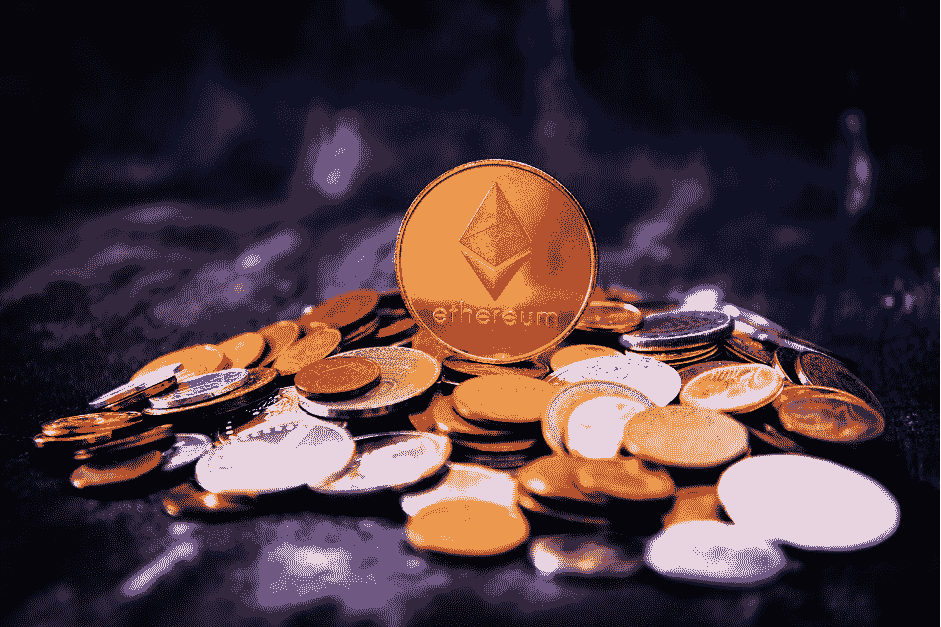
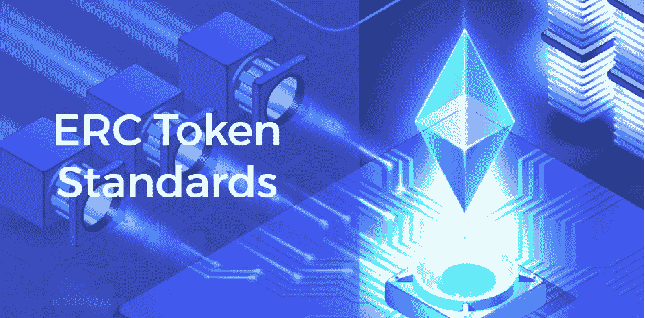
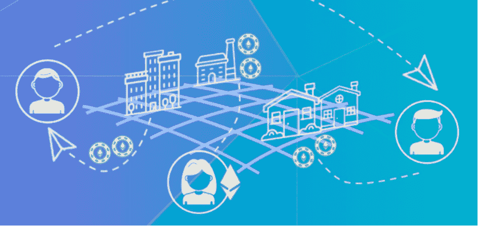
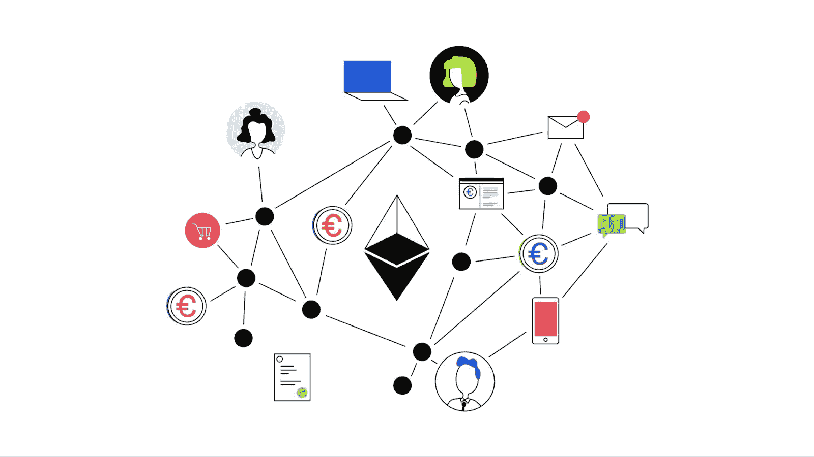

# 以太坊发送交易基础–用一行代码发送以太坊

> 原文：<https://moralis.io/ethereum-send-transaction-basics-send-ethereum-with-one-line-of-code/>

**去中心化的网络如** [**以太坊**](https://moralis.io/full-guide-what-is-ethereum/) **为开发者开辟了大量的新机会。由于这些网络，程序员可以构建新的** [**Web3**](https://moralis.io/the-ultimate-guide-to-web3-what-is-web3/) **应用程序，而无需依赖任何外部货币实体。这使得创作者可以用数字代币代替现金，在没有中介的情况下进行任何交易。然而，他们对以太坊交易的依赖意味着他们需要特殊的服务来可靠地运作。为此，以太坊基金会开发了“Web3.js”，它提供了必要的基础设施，是区块链开发者的首选库。此外，您可以通过 Moralis 的 Web3 平台快速方便地使用这个库，使传输、发送和接收 ETH 的过程变得简单明了。因此，跟着我们教你关于以太坊发送交易的基础知识，以及如何用一行代码发送以太坊。**

Moralis 为您提供后端开发基础设施，以便在以太坊等流行的区块链上部署您的 dApps(分散式应用程序)。Moralis 的 SDK 及其可靠的节点是构建您的区块链项目的良好组合。您可以实现 Moralis 的 SDK，通过加密钱包或普通方法为您的 dApp 用户执行[以太坊认证](https://moralis.io/ethereum-authentication-full-tutorial-to-ethereum-login-programming/)。此外，SDK 允许您获取用户数据，包括余额、NFT、事件或交易。在告诉你简单的以太坊使用 Moralis 发送交易指令之前，我们将深入了解以太坊交易的类别。在下一阶段，我们将详细介绍如何将以太坊交易集成到 dApps 中。最后，我们将谈谈汽油费，并告诉你如何计算交易费。

## **以太坊发送交易——为什么是 Moralis？**

开发 dApps，尽管最近很流行，但也有其自身的复杂性。创作者应该克服现有基础设施的限制，使用以太坊基金会提供的原始工具。此外，使用 Web3.js 这样的准系统框架需要全面了解 API、ABI 和数据结构。然而，Moralis SDK 消除了 dApps 的复杂性，为您提供了优秀的基础设施和工具。由于它的 NFT API、价格 API 和 Moralis Speedy Nodes，开发 Web3 应用程序不再是火箭科学。

Moralis 的可行解决方案帮助您绕过 RPC 节点的限制。该平台还为您的区块链项目提供跨链的互操作性。换句话说，它不会把你限制在一个区块链。只需点击几下，你就可以让你的 dApps 与流行的连锁店兼容。目前，它支持币安智能链(BSC)，雪崩，Arbitrum，多边形，以及索拉纳和埃尔隆德在管道中。

### **以太坊发送交易基础–交易类型**

以太坊是一个分散的计算机网络，也称为节点，具有超越转移价值的能力。作为地球上第二大区块链，以太坊拥有运行应用程序所需的基础设施。换句话说，尽管有比特币，但只有货币用途，开发者可以使用以太坊在其上运行 dApps。比特币和以太坊虽然建立在相同的基础上，但本质上是不同的。前者利用区块链技术转移价值，后者则更进一步，让用户构建 dApps。

以太坊交易的确认在几秒钟内完成，尽管比特币需要几分钟。在调查了前两个区块链之间的差异之后，是时候深入研究以太坊交易的概念了。



通常，每个以太坊交易都属于三个组之一，如下所示:

*   **正常交易—**每当一个 EOA(外部拥有的账户)向另一个 EOA 发送 ETH，我们称之为“正常交易”。eoa 是人类持有的账户，而不是合同，通常被称为钱包。要检查您的区块链交易并分析您的项目，您需要在 block explorer 中拥有一个帐户。来自以太坊的[以太扫描](https://etherscan.io/)、[以太链](https://etherchain.org/)和“[区块链](https://www.blockchain.com/explorer?view=eth)”探索者是一些知名的区块探索者。如果您使用的是 Etherscan，您可以查看“交易”选项卡下的“正常交易”部分。
*   **内部交易—**在这些类型的交易中，智能合约扮演着中介的角色，在账户之间转移 ETH。在 Etherscan 中，您可以在“内部事务”选项卡下看到内部事务。
*   **令牌转移—**此类别属于兼容 ERC-20 和 ERC-721 协议的令牌交易。您可以在以太网扫描的“ [ERC20](https://moralis.io/erc20-exploring-the-erc-20-token-standard/) 令牌交易”或“ [ERC721](https://moralis.io/erc-721-token-standard-how-to-transfer-erc721-tokens/) 令牌交易”选项卡下查看这些交易。

### **以太坊发送交易基础知识-令牌标准讲解**

如前所述，以太坊是一个基于令牌的分散式节点网络。在以太坊上，你可以买卖和交易代币，代币本质上是智能合约。它们既可以代表数字资产，比如你的歌曲版权，也可以代表现实世界中的有形物体，比如你的画。此外，ERC-20、ERC-721 和 ERC-1155 是以太坊上一些流行的令牌标准，我们将在本节中详细介绍。

我们用于可替换令牌的 ERC-20 包含了在以太坊上创建智能合约的标准。该协议定义了令牌的传输方法、交易批准的先决条件、令牌的总存储库及其访问方法。代币标准很流行，超过 100 种数字货币使用与 ERC-20 标准兼容的代币。

**T2】**

ERC-721 是一套定义非功能性测试并使其独一无二的标准。ERC-721 兼容令牌本质上是不可替换的。换句话说，它们是不可互换的，并且表示没有对应项的项目(数字的或物理的)。想象一下代表文森特·梵高两件作品的两件代币。不可能互相改变它们。此外，不可替换令牌与可替换令牌(那些与 ERC-20 标准兼容的令牌)相反。一个很好的例子是两张一美元的钞票。它们的值是一样的，你可以为对方改变它们。

ERC-1155 是一个两全其美的协议，因为 [ERC1155](https://moralis.io/erc1155-exploring-the-erc-1155-token-standard/) 可以代表可替换和不可替换的令牌。视频游戏就是这种令牌标准的一个很好的例子。在这些游戏中，你可以获得点数，购买新物品(刀、步枪或手榴弹)或互相交换。在这种情况下，ERC-721 将是代表可替换和不可替换令牌的最佳选择。

## **以太坊发送交易功能是如何工作的？**

以太坊交易发生在一个叫做“mainnet”的特殊区块链网络上。运行在以太坊上的去中心化应用不断地发送和接收事务。要在 mainnet 上发送这些交易，你必须花真金白银，这就是开发人员使用测试网络(又名“testnet”)的原因。这些网络允许他们使用以太坊，而不必花费真金白银。此外，Rinkeby、Ropsten 和 Kovan 是以太坊上常见的测试网。他们在 dApp 的开发生命周期中扮演着重要的角色。要使用测试网，你需要一个有地址的加密钱包。我们建议下载 [MetaMask](https://metamask.io/) ，这是一个有用且受欢迎的钱包，可以作为浏览器的扩展。要了解更多关于[元掩码](https://moralis.io/metamask-explained-what-is-metamask/)及其功能的信息，请阅读我们之前在[Moralis 的博客](https://moralis.io/blog/):[元掩码解释——什么是元掩码？](https://moralis.io/metamask-explained-what-is-metamask/)”。

**T2】**

如前所述，以太坊通过智能合约发送交易。这些是包含双方协议的代码。要编写契约，您需要从头开始构建项目的数据结构。如果它是一个众包 dApp 或加密钱包，你必须为它定义各种功能。那么您的项目需要一个可靠的以太坊 API。这些 API 与区块链节点交互，用于发送和接收事务以及验证用户。在您解决了令人头痛的编码问题之后，您需要找到可靠的 RPC 提供者。然而，有了 Moralis，你就不需要担心这些了。Moralis 家会为你做所有的事情。

## **以太坊发送交易——如何用 Moralis 转移代币？**

也许你正在开发一个跟踪应用来监控你的交易。或者一个“加密小猫”应用程序，允许你的用户买卖虚拟宠物。不管是什么情况，你的 dApps 需要与以太坊互动。如果你在 node.js 项目中使用过 Web3.js 库，你会承认它很麻烦。要使用 Web3.js 传输令牌和发送 NFT 交易，您需要构建整个数据结构。另外，你必须对 ABIs 有扎实的了解。提醒一下，ABI(应用程序二进制接口)是一个方便程序间通信的接口。但是如果你对如何使用 ABI 没有 100%的把握，不要惊慌；Moralis 的 Web3 平台让你轻松搞定。得益于它的后端开发基础设施，您只需一行代码就可以启动以太坊发送交易功能。

**T2】**

要使用 Moralis 移动给定区块链上的本机资产，首先需要创建一个“option”对象。将它的“type”值设置为“native ”,以便 Moralis 理解您想要转移本机资产。原因是，对于跨链资产的转移，您需要实现其他程序。在下一阶段，您必须指定转移的金额。不管你用的是哪种区块链(以太坊，多边形，币安智能链等等。)，使用“Moralis.units.ETH”命令。由于每个事务都有发送方和接收方，现在是时候指定“接收方”了。在下面输入你想要的钱包地址，就可以了。

```js
 // sending 0.5 ETH
 const options = {type: "native", amount: Moralis.Units.ETH("0.5"), receiver: "0x.."}
 let result = await Moralis.transfer(options)
```

### **转移 ERC-20 代币**

要使用 Moralis 平台发送 ERC-20 代币，您需要代币的合同地址和小数位数。检查您在 Etherscan 或您的项目使用的任何其他 block explorer 上的帐户，以找到这些数据。要启动 Moralis 事务，您必须使用 helper 函数:“Moralis。单位.令牌”。它可以让你把数值乘以小数位数。不参考块浏览器也可以获得令牌的元数据。Moralis 的 SDK 为此提供了一个解决方案。只需查看我们关于[获取令牌元数据](https://docs.moralis.io/moralis-server/web3-sdk/token#gettokenmetadatabysymbol)的文档。

```js
 // sending 0.5 tokens with 18 decimals
 const options ={type: "erc20",
             	amount: Moralis.units.Token("0.5", "18"),
             	Receiver: "0x..",
             	contractAddress: "0x.."}
 let result = await Moralis.transfer(options)
```

### **转移 ERC-721 代币**

为了传输这些类型的令牌，您将需要 NFT 的“contractAddress”以及“tokenID”。这里您不需要指定“金额”,因为您一次只能转移一个令牌。

```js
 // sending a token with token id = 1
 const options = {type: "erc721",
              	receiver: "0x..",
              	contractAddress: "0x..",
              	tokenId: 1}
 let result = await Moralis.transfer(options)
```

### **转移 ERC-1155 代币**

要传输这些令牌，也称为半可替换令牌，您必须指定 NFT 的“contactAddress”和“tokenID”。您还应该确定要转移的令牌的“数量”。

```js
 // sending 15 tokens with token id = 1
 const options = {type: "erc1155",
             	   receiver: "0x..",
            	   contractAddress: "0x..",
              	   tokenId: 1,
                  amount:15}
 let result= await Moralis. transfer(options)
```

### **回调承诺事件**

每个以太坊交易都经过多个阶段。每当每一步完成，区块链返回一个“承诺”，然后将开始下一个阶段。区块链中的隐式功能被称为“异步”功能。Moralis 的基础设施为开发者提供了获取交易各阶段信息的机会。为此，您只需要使用“Moralis.transfer()”函数，它支持“promise 事件”。

由于这个功能，您现在可以在完成流程之前获得“transactionHash ”,它本质上是一个事务 ID。使用“收据”命令，您可以在完成交易处理后获得交易收据。通过在事务选项部分将“awaitReceipt”更改为“false ”,您将接收所有作为事件回调的数据。

```js
 const txOptions = {
  type: "erc20",
  amount: Moralis.Units.Token("10","18"),
  receiver:   "0xB5…ee035",
  contractAddress: ("0x7b…605e",
  awaitReceipt: false // should be switched to false
  }

 const tx = await Moralis.transfer (txOptions);

 tx.on("transactionHash", (hash) => {…})
   .on ("receipt", (receipt) => {…})
   .on ("confirmation", (confirnationNumber, receipt) => { ... })
   .on ("error", (error) => {…})
```

### **以太坊燃气费**

以太坊不是一个完全免费的网络，你应该为发送交易和执行智能合约付费。你可能听说过密码界的“汽油费”，但从未读过。在区块链世界，“气费”是指在区块链处理交易的费用。无论您是购买代币还是发送交易，您都必须以 ETH 支付其费用。燃气费有一个通用的计算规则；你在以太坊上的交易越复杂，你的油费就越高。

**T2】**

然后就是“气限”，也就是你每笔交易可以支付的最大气费金额。要计算燃气费，你应该用燃气价格乘以燃气限额。气价是基于你想要的计算速度(气限 x 气价=气费)。天然气费也以“Gwei”支付，相当于 1^ -8 ETH(或. 000000001 eth)。如果你想在不付汽油费的情况下制造垃圾食品，所谓的 Moralis 博客上有一篇关于如何偷懒制造垃圾食品的文章。

## **以太坊 API 与 Moralis 混合**

每个分散的应用程序都应该有一些主要的功能，包括但不限于用户认证、读取数据库和发送资产。无论是建立 NFT 市场还是 DeFi 仪表板，您都需要将这些功能整合到您的 dApps 中。以太坊 API 和 Moralis 的基础设施允许你用简短的代码片段将上述所有功能添加到你的 dApps 中。该 API 与 MetaMask 认证解决方案和 [WalletConnect](https://moralis.io/how-to-connect-users-with-walletconnect/?utm_source=blog&utm_medium=post&utm_campaign=Ethereum%2520API%2520%25E2%2580%2593%2520Develop%2520Ethereum%2520dApps%2520with%2520Moralis) (针对移动用户)完全集成。它还消除了你对[区块链 RPC 节点提供商](https://moralis.io/infura-alternatives-and-blockchain-node-providers/?utm_source=blog&utm_medium=post&utm_campaign=Ethereum%2520API%2520%25E2%2580%2593%2520Develop%2520Ethereum%2520dApps%2520with%2520Moralis)的需求，因为你所有的 dApps 都将在 [Moralis Speedy 节点](https://moralis.io/speedy-nodes/?utm_source=blog&utm_medium=post&utm_campaign=Ethereum%2520API%2520%25E2%2580%2593%2520Develop%2520Ethereum%2520dApps%2520with%2520Moralis)上运行。Moralis Speedy Nodes 集成了 Moralis 的所有服务，速度极快，易于扩展。

## **汇总–以太坊发送交易基础–发送以太坊一行代码**

开发者几乎不敢做区块链应用。问题是你需要对 API、ABI、数据结构、RPC 节点等有广泛的了解。此外，你必须具备扎实的编码技能。然而，由于 Moralis 的后端开发基础设施，区块链开发感觉像是轻而易举，不再是火箭科学。使用它的工具，您只需一行代码就可以启动以太坊发送交易功能。Moralis 还允许您集成以太坊 API 功能，包括用户认证和将 NFT 发送到 dApps 中。此外，您还了解了不同的令牌标准，以及发送 Ehtereum 事务的功能是如何工作的。我们还查看了各种代码示例，它们将在整个开发过程中为您提供帮助。

如果你渴望成为一名区块链的开发者，今天一定要去看看 T2 的 Moralis 学院！在 Moralis 学院，我们教你从区块链基础到高级以太坊智能合约编程的一切。因此，你可以让 Moralis 从头到尾指导你，反过来，你的区块链职业生涯也不会过时！