# 以太坊社交网络——如何构建以太坊社交媒体平台

> 原文：<https://moralis.io/ethereum-social-network-how-to-build-an-ethereum-social-media-platform/>

[**不可替代代币**](https://moralis.io/non-fungible-tokens-explained-what-are-nfts/) **【元宇宙】，** [**即玩即赚游戏**](https://moralis.io/what-are-nft-games-and-how-to-make-nft-games/) **，这三个区块链技术在以太坊等网络上的具体用例，最有潜力将大众搭载到**[**web 3**](https://moralis.io/the-ultimate-guide-to-web3-what-is-web3/)**。此外，还有一个领域潜力巨大——去中心化社交媒体。2021 年，我们都知道社交媒体有什么力量和人气；然而，我们也意识到中央集权的巨头们滥用了他们的权力。因此，我们都应该致力于确保社交媒体的未来是分散的。因此，学习如何创建一个** [**以太坊**](https://moralis.io/full-guide-what-is-ethereum/) **社交网络应该在你的雷达上。虽然为以太坊构建这样一个先进的社交网络看起来很麻烦，但是有强大的工具可以简化这个过程。因此，有了 Moralis，你可以在创纪录的时间内创建一个抗审查的以太坊社交媒体平台。**

在本文中，我们将向您展示如何将 Moralis 的 ultimate Web3 开发平台与最好的[以太坊 dApp 样板](https://moralis.io/ethereum-dapp-boilerplate-full-ethereum-react-boilerplate-tutorial/)结合使用，以便您可以轻松创建以太坊社交网络。此外，虽然以太坊的可编程区块链仍然是最受欢迎的，但其他知名连锁店也越来越受欢迎。此外，由于 Moralis 的跨链互操作性，您可以构建一个以太坊社交媒体平台，然后轻松地将其部署在其他受支持的链上。后者包括 Polygon、币安智能链(BSC)和 Avalanche，其他几个链已经在管道中。记住这一点，请放心，您的项目将是经得起未来考验的。随着本文的深入，我们将讨论一个示例项目，其中我们将使用上述工具创建一个以太坊社交网络。

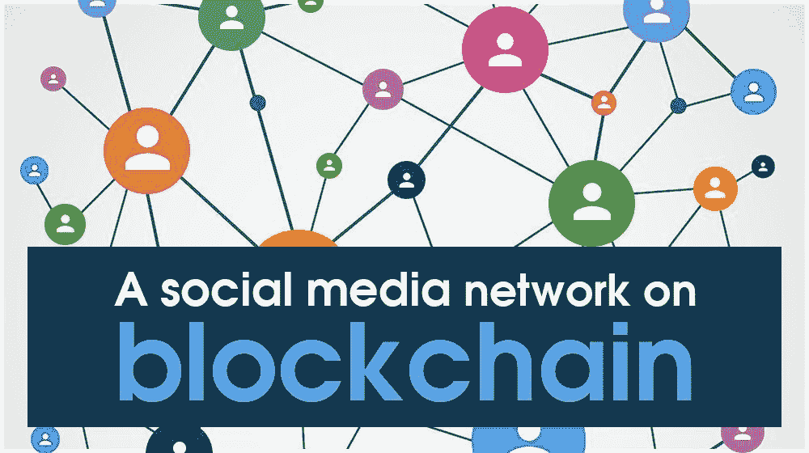

## 以太坊社交网络–示例项目

有许多社交媒体平台，但不幸的是，其中许多都控制在主要对利润感兴趣的大公司手中。然而，有一个平台成功地将用户的最大利益放在首位——Reddit。因此，我们决定接手一个项目，创建这个流行平台的某种去中心化克隆，并将其命名为“去中心化”。

我们邀请你跟随我们的领导，亲自承担这个范例项目。与我们的大多数其他项目不同，例如“[立即创建一个以太坊 dApp](https://moralis.io/how-to-create-an-ethereum-dapp-instantly/)或“[用 MetaMask](https://moralis.io/building-dapps-with-metamask/) 构建 dApp”，我们通常可以在几分钟内完成，但完成这个挑战将花费我们稍长的时间。然而，我们认为在几个小时内建立一个完整的以太坊社交媒体平台仍然令人印象深刻。

如果我们打算通过直接在一个 RPC 节点上构建来创建一个以太坊社交网络，这将花费我们数周甚至数月的时间。然而，通过使用 Moralis 及其 [ultimate Web3 SDK](https://moralis.io/exploring-moralis-sdk-the-ultimate-web3-sdk/) 和[以太坊 API](https://moralis.io/ethereum-api-develop-ethereum-dapps-with-moralis/) ，我们将成倍地加快我们的进度，并克服 RPC 节点的所有[限制。这是可能的，因为 Moralis 完全负责与区块链相关的后端，这意味着我们可以完全专注于前端。此外，这也使得没有区块链知识的精通 JavaScript 的开发人员能够开发最先进的 dApps(去中心化的应用程序)，比如以太坊社交网络。](https://moralis.io/exploring-the-limitations-of-rpc-nodes-and-the-solution-to-them/)

此外，我们将通过使用终极以太坊 dApp 样板文件来加速以太坊社交媒体平台的开发，我们在 GitHub 上公开了该样板文件。除了各种有用的挂钩之外，样板文件还包括几个组件，这些组件集成了一个奇妙的 UI，为我们节省了大量时间。

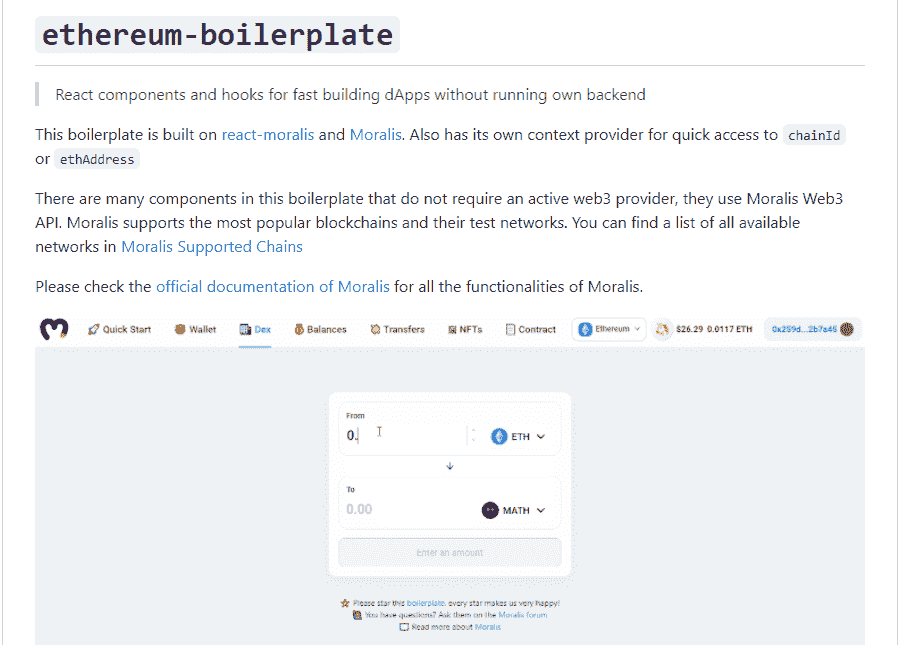

### 以太坊社交媒体平台–预览

在我们开始设置所有工具，然后实际进行编码过程之前，我们想向您展示我们将创建什么样的以太坊社交网络。熟悉 Reddit 的人很可能马上就能发现相似之处。这是我们以太坊社交媒体平台的图片:

看上面的图片，你可以在左上角看到我们以太坊社交网络的名字(分散的)。在另一侧(右上角)，您可以看到一个登录用户的地址。另一方面，如果用户没有登录，将显示“验证”按钮。那个按钮利用[元掩码](https://moralis.io/metamask-explained-what-is-metamask/)作为最流行的[以太坊认证](https://moralis.io/ethereum-authentication-full-tutorial-to-ethereum-login-programming/)工具之一。

此外，查看我们的以太坊社交媒体平台的核心，您可以看到它包含了用户的声誉和不同类别的帖子。一旦进入某个类别，用户可以通过点击“发布”按钮来发布。此外，每个帖子的顶部都有创建者的地址，后面是标题，然后是内容。此外，每个帖子都可以被投票赞成或投票反对，正是基于这些投票赞成和投票反对，用户才能建立自己的声誉。在这方面，您可以创建特定的规则来确保更高的可信度。例如，您可以添加一个规则，将用户的投票与更大数量的投票相乘。

#### 以太坊社交媒体平台–预览–创建新帖子

下面是我们在“Web3”类别中创建新帖子的例子:

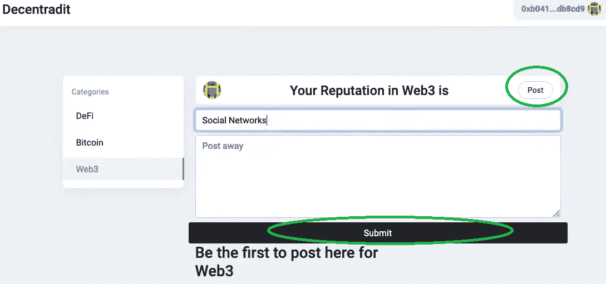

我们首先选择“Web3”类别，然后单击“Post”按钮。接下来，我们添加标题和内容。我们通过点击“提交”按钮来完成这个过程，这将触发我们的元掩码。既然我们已经创建了以太坊社交网络，这意味着它需要与区块链互动。因此，我们的“提交”操作需要被视为链上事务，我们在元掩码的帮助下对此进行验证:

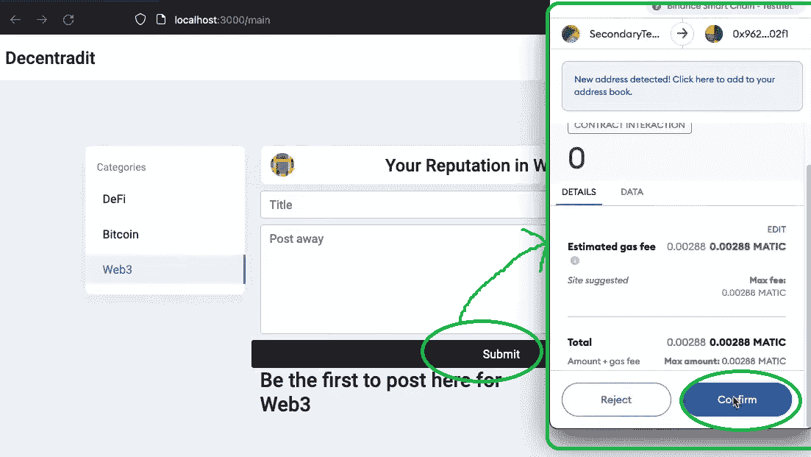

如果一个交易通过，在我们的例子中就是这样，新的帖子就会生效:

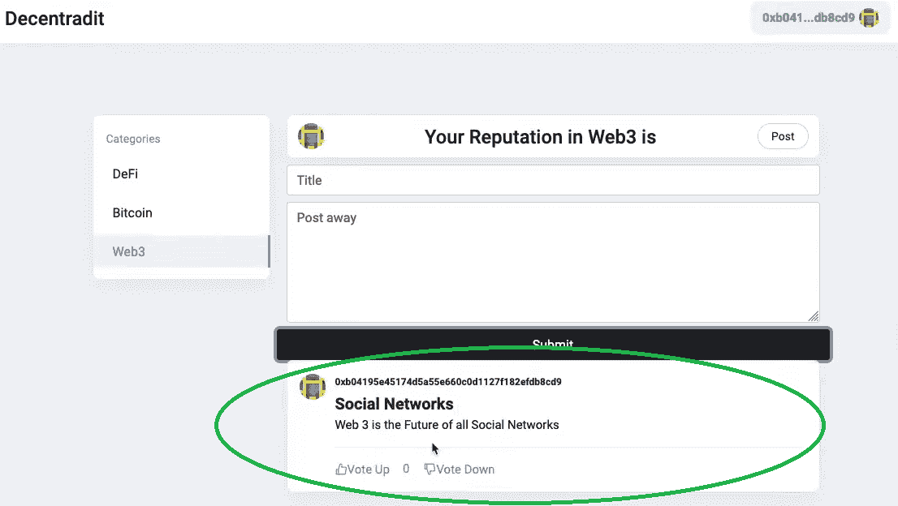

一旦帖子上线，其他用户就可以投票支持或否决它。让我们看看如何使用另一个地址登录。

#### 以太坊社交媒体平台–预览–投票

一旦我们使用另一个地址(代表另一个用户)登录，我们就可以通过点击“投票”按钮为我们在上面创建的帖子投票:

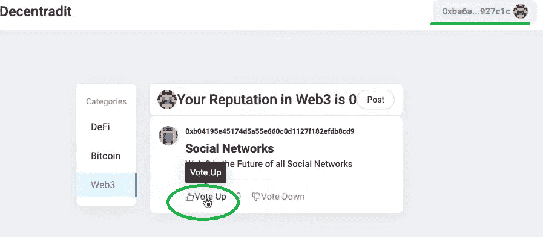

与上一节中的“提交”按钮一样，我们需要用 MetaMask 来确认我们的操作，这是自动提示的:

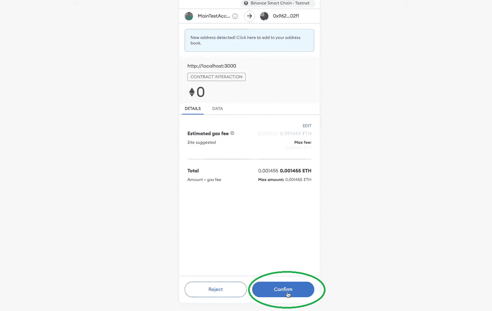

确认后，我们可以看到交易已经完成，因为“向上投票”按钮现在是“灰色的”，这意味着我们已经投票:

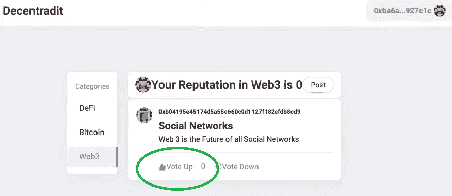

此外，如果我们使用创建帖子的帐户再次登录，我们可以看到该用户在“Web3”类别中的声誉现在是“1”:

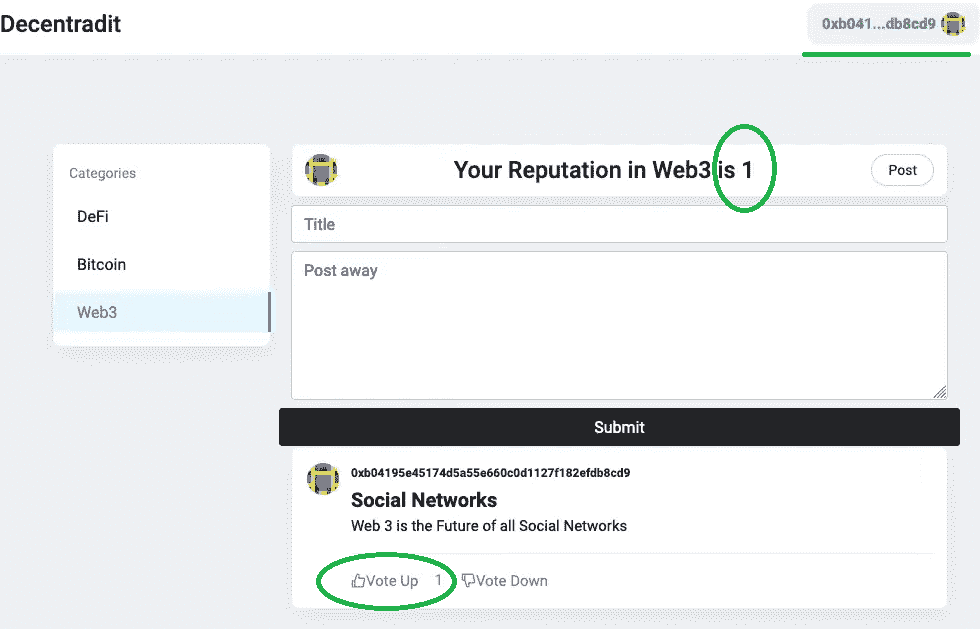

上面的图片和解释涵盖了我们以太坊社交网络的主旨。如果你喜欢这个社交媒体平台，并想学习如何建立自己的以太坊社交网络，那么继续下一部分。在这里，我们将首先帮助您设置工具。然后，我们将让 Moralis 的一位专家接手，通过视频教程指导您了解细节。此外，由于我们现在将开始使用最终的 Web3 开发平台(又名 [Firebase for crypto](https://moralis.io/firebase-for-crypto-the-best-blockchain-firebase-alternative/) )，请确保在继续之前[创建您的免费 Moralis 账户](https://admin.moralis.io/register)。

## 用 Moralis 创造以太坊社交网络

创建任何类型的 Web3 应用程序的最快方法基本上是使用最好的以太坊 dApp 样板，它非常易于使用，结合了 Moralis 的强大功能。此外，我们将使用这个强大的二人组来创建我们的以太坊社交网络。然而，在我们将您交给 Moralis 专家之前，他将向您展示如何进行必要的调整来创建一个以太坊社交媒体平台，如前几节所述，让我们来帮助您进行设置。

### 用 Moralis 标准创建以太坊社交网络——样板设置

为了使用最好的以太坊 dApp 样板文件，您需要按照以下步骤正确设置它:

1.  从访问 GitHub 上的终极以太坊 dApp 样板网页开始:[https://GitHub . com/以太坊-样板/以太坊-样板](https://github.com/ethereum-boilerplate/ethereum-boilerplate)。

2.  接下来，使用“***git clone https://github . com/ether eum-boilerplate/ether eum-boilerplate . git***”来分叉或克隆“以太坊-boilerplate”存放库。*在上面链接的页面上随意使用复制按钮:*

复制好地址后，移至您的代码编辑器(我们通常使用 Visual Studio 代码[VSC])，并将其粘贴到 VSC 的终端:

3.  然后，是时候使用代码编辑器的终端安装所有依赖项了:
    1.  ***cd 以太坊-样板***
    2.  ***纱装***

4.  接下来，将“以太坊-样板”文件夹添加到代码编辑器中:

5.  现在，将“. env.example”文件重命名为”。env”:

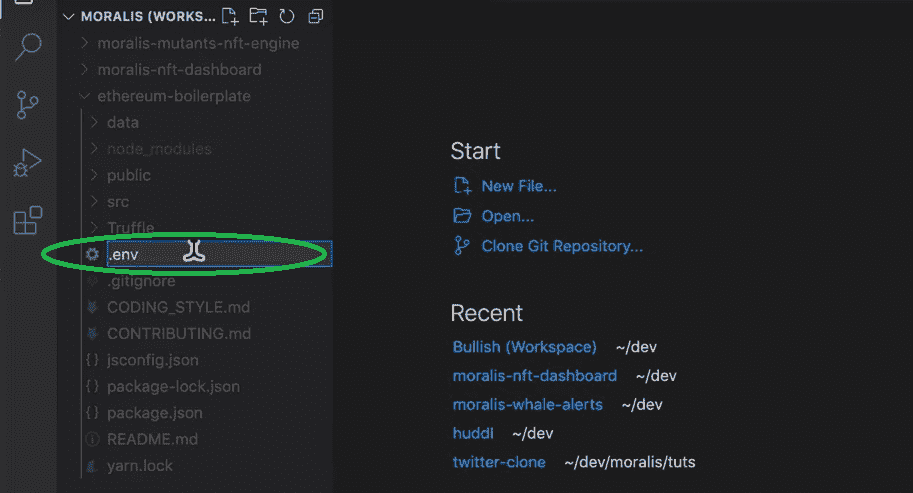

6.  为了访问 Moralis 的后端功能，您需要在刚刚重命名的文件中提供您的 Moralis 服务器的“appId”和“serverUrl”。env "):

为了获得您的服务器详细信息，请遵循下面“设置您的 Moralis 服务器”小节中的一组单独的说明。将 Moralis 服务器的详细信息复制并粘贴到”。env "文件:

7.  最后，通过在代码编辑器的终端中键入或粘贴“ ***yarn start*** ”来运行您的应用程序:

*注* *:我们用了“yarn”，你也可以用“npm 包管理器”。*

完成以上所有七个步骤后，您应该有一个正常工作的 dApp。然而，我们离创建以太坊社交网络还有很长很长的路要走。幸运的是，使用样板文件节省了我们很多时间，因为我们可以通过应用相当简单的调整来使用许多组件。

#### 设置您的 Moralis 服务器

使用 Moralis 开发时，创建自己的 Moralis 服务器是必不可少的。通过创建 Moralis 服务器并获取其详细信息，您可以用简单的代码片段为 dApps 配备后端功能。以下是完成 Moralis 服务器设置所需的步骤:

1.  **登录您的 Moralis 账户**–现在，您应该已经创建了您的 Moralis 账户。因此，只需[登录](https://admin.moralis.io/login)进入你的管理区。
2.  **创建新服务器**–在 Moralis 管理区域的“服务器”选项卡中，单击“+创建新服务器”按钮。这将提示一个下拉菜单，您应该在其中选择符合您需求的网络(见下图)。*在对示例项目进行编程时，选择“Testnet Server”选项往往是最好的方式(* [*连接到以太网测试网*](https://moralis.io/ethereum-testnet-guide-connect-to-ethereum-testnets/) *)。* 

接下来，输入服务器名称(可以是您想要的任何名称)。接下来，您可以在出现的弹出窗口中选择区域、网络和链:

通过单击“添加实例”完成服务器创建过程。*请注意，服务器启动需要一些时间，请耐心等待。*

3.  **访问服务器详细信息**–一旦您的服务器准备就绪，您就可以通过单击服务器名称旁边的“查看详细信息”按钮来访问其详细信息:

详细信息将显示在弹出窗口中:

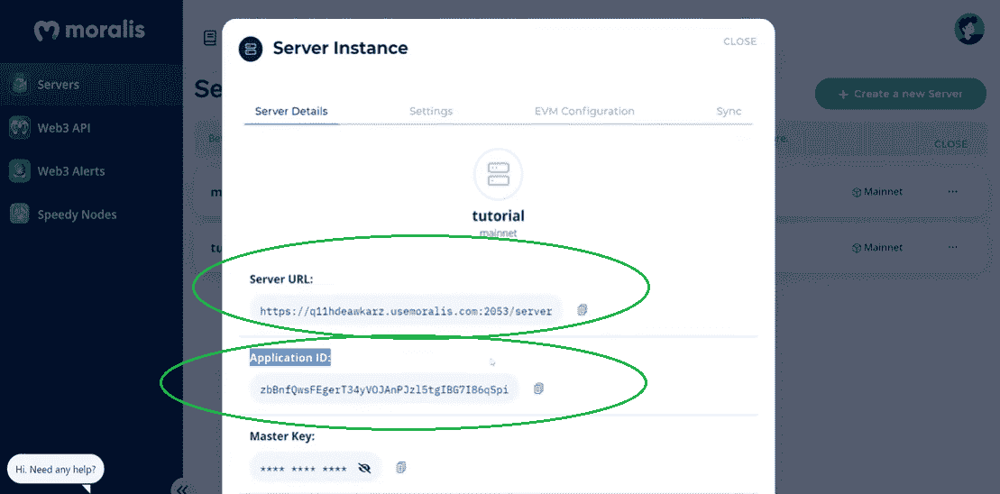

要复制服务器的详细信息，只需单击服务器 URL 和应用程序 ID 旁边的复制图标。

4.  **初始化 Moralis 规范**–最后，填充您的”。env "文件和 Moralis 服务器的详细信息。您可以从上面获得这些，以获得 Moralis 涵盖的所需后端功能:

*注意* *:确保使用您特定服务器的详细信息，并使用* ***而不是*** *上图中的详细信息。*

### 用 Moralis 创建以太坊社交网络——编程

如果你已经正确地完成了设置，你就可以应用你的调整来创建一个真正的以太坊社交网络了。如上所述，一位经验丰富的 Moralis 开发人员将在下面的视频中指导您完成这一过程。

为了进一步简化，我们在 [GitHub](https://github.com/ethereum-boilerplate/web3-social-network-boilerplate) 上提供了这个特定项目的所有文件(包含完整的代码)。你的以太坊社交媒体平台最重要的部分之一是一个智能合约([dec undit . sol](https://github.com/ethereum-boilerplate/web3-social-network-boilerplate/blob/main/smart%20contracts/contracts/decentradit.sol))。后者确保所有交易都与正确的发布和投票相关(正如你在“以太坊社交媒体平台-预览”部分看到的)。此外，如果您想要一个智能合同演练，请跳到下面视频中的 3:13。

在视频的 14:08，您将学习如何为 Moralis 服务器设置事件监听器。设置事件监听器后，Moralis 专家将完成以太坊 dApp 样板设置(21:58–24:50)。这是我们前面已经讨论过的内容。从 24:50 开始，您将看到要应用哪些调整以及要添加哪些文件。这样做之后，你将得到一个以太坊社交网络，它的外观和功能都和之前一样。就功能而言，将应用程序与“分散的. sol”智能合同连接至关重要(1:04:25)。为了获得最高水平的分权，你还将学习如何利用 Moralis 的 [IPFS](https://moralis.io/what-is-ipfs-interplanetary-file-system/) 整合。后者将使您能够以分散的方式将以太坊社交网络的帖子存储为内容。

https://www.youtube.com/watch?v=52BvLrj-KrE

## 以太坊社交网络——如何构建以太坊社交媒体平台——总结

任何一个 JavaScript 开发者都可以通过使用上面的指令在不到两个小时的时间内创建一个以太坊社交网络。当然，使用终极以太坊 dApp 样板会给你一个明显的开端。此外，通过添加 Moralis 规范，您可以用单个代码片段涵盖所有后端方面。当然，这需要相对高级的 JavaScript 编程来完成一个令人印象深刻的以太坊社交媒体平台。然而，从 Moralis 家专家的角度来看，后者应该不是问题。

如果你觉得这个项目太先进了，我们鼓励你考虑参加其他一些(初学者友好的)项目，这些项目可以在 [Moralis 的 YouTube 频道](https://www.youtube.com/c/MoralisWeb3)和 [Moralis 的博客](https://moralis.io/blog/)上找到。例如，你可以学习如何[推出一个 NFT 市场](https://moralis.io/how-to-launch-an-nft-marketplace/)或[产生数千个 NFT](https://moralis.io/how-to-generate-thousands-of-nfts/)。您还可以学习如何使用[以太坊移动样板](https://moralis.io/ethereum-mobile-boilerplate-full-guide-to-ethereum-for-mobile/)快速轻松地创建移动 dApps。此外，这两个出口都涵盖了其他强大的工具，如 [WalletConnect](https://moralis.io/what-is-walletconnect-the-ultimate-walletconnect-guide/) 和 [OpenZeppelin](https://moralis.io/what-is-openzeppelin-the-ultimate-guide/) 。

如果你还不知道 JavaScript 或 [Solidity](https://moralis.io/solidity-explained-what-is-solidity/) ，但对[成为区块链开发者](https://moralis.io/how-to-become-a-blockchain-developer/)感兴趣，我们推荐你参加 Moralis 学院 [2021 区块链开发者 JavaScript 编程](https://academy.moralis.io/courses/javascript-programming-for-blockchain-developers)课程。此外，在[Moralis 学院](https://academy.moralis.io/)还有许多其他高质量的课程可以帮助你快速成为全职加密师。

