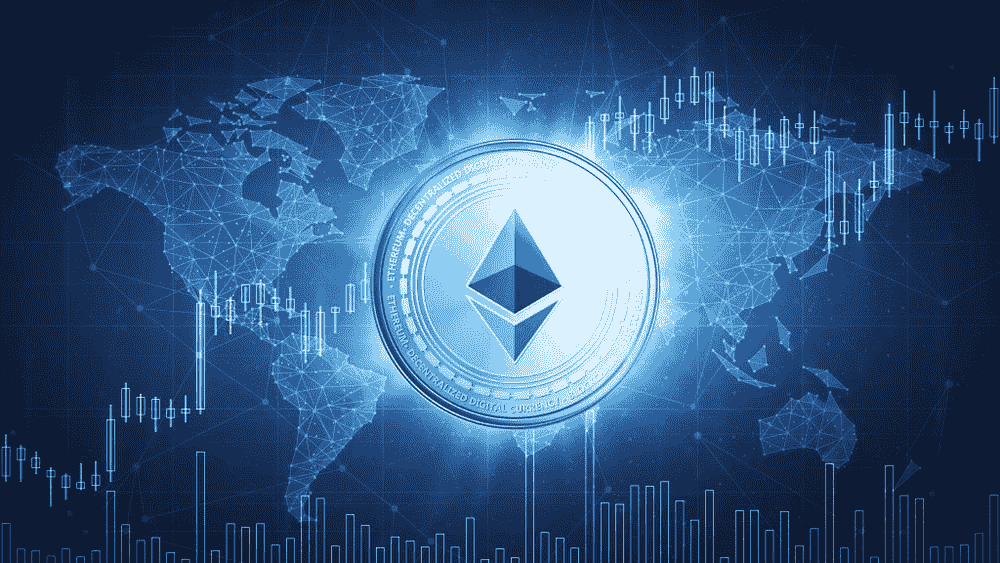
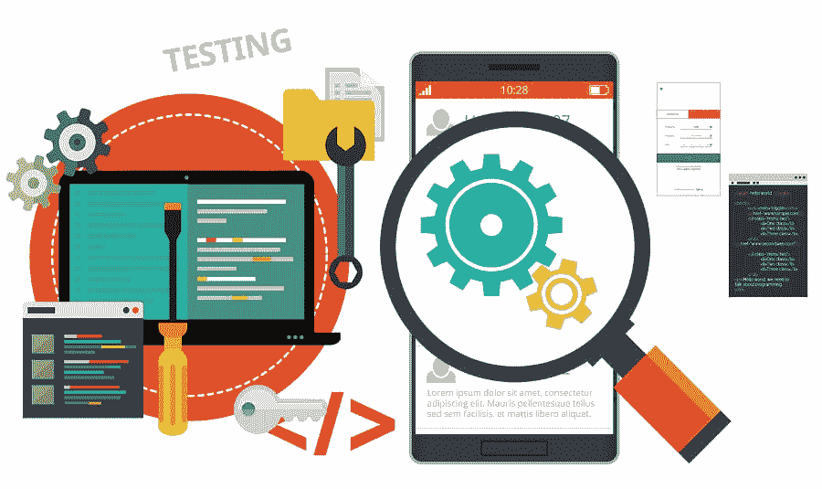
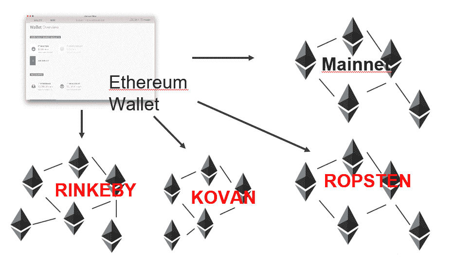
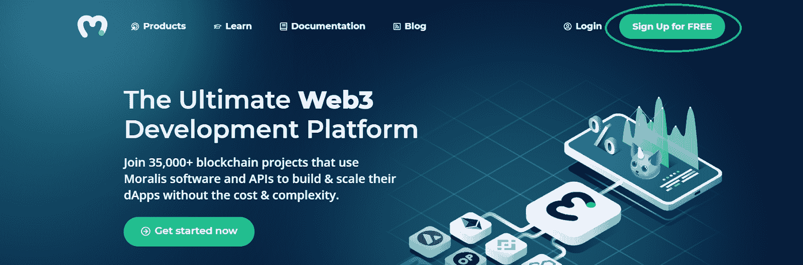
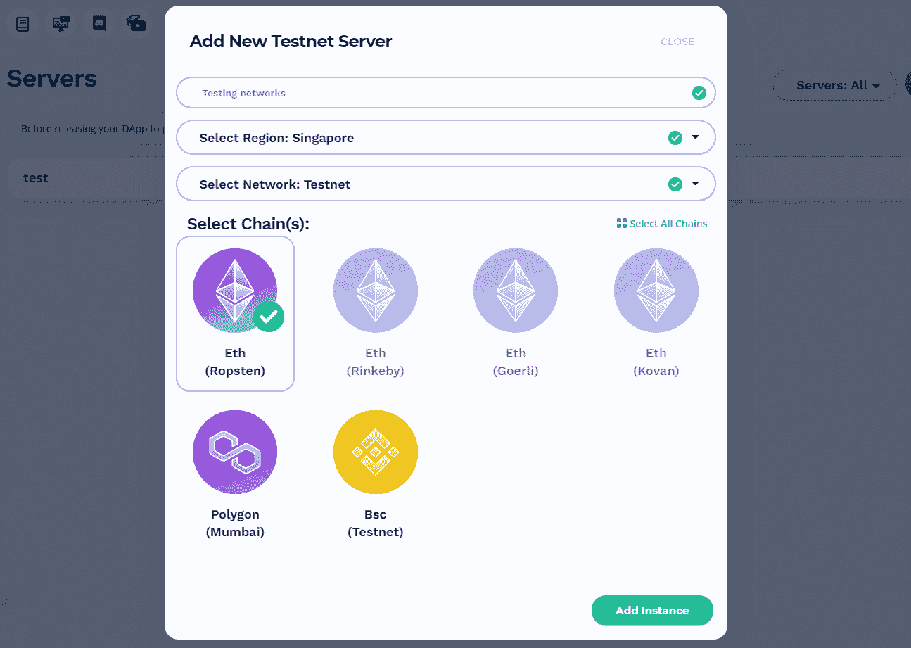
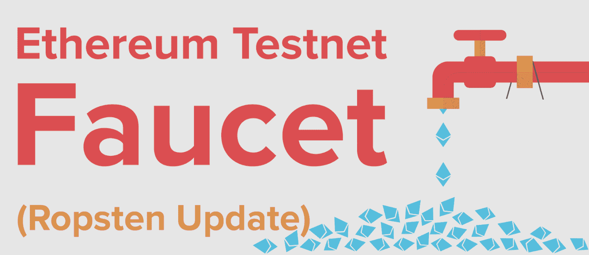
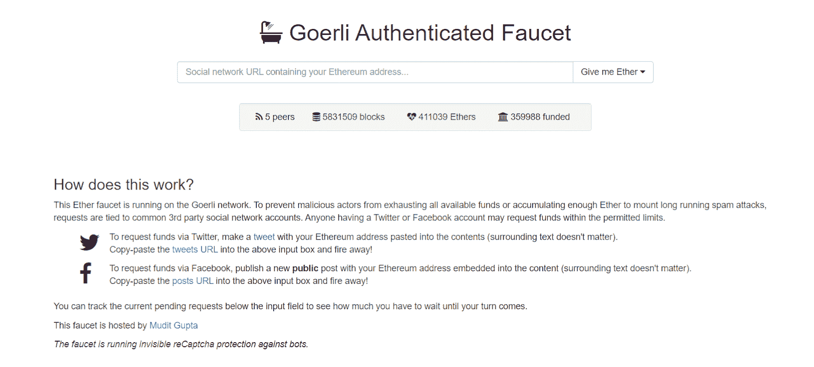

# 以太坊测试网指南——连接以太坊测试网

> 原文：<https://moralis.io/ethereum-testnet-guide-connect-to-ethereum-testnets/>

最近，我们看到了许多著名的可编程区块链的出现；然而，****仍然是大多数区块链开发者的首选。此外，虽然以太坊的 mainnet 是在您测试并准备好部署您的** [**dApps**](https://moralis.io/decentralized-applications-explained-what-are-dapps/) **后使用的网络，但是您应该在开发**[**web 3**](https://moralis.io/the-ultimate-guide-to-web3-what-is-web3/)**应用程序时关注以太坊 testnet 选项。通过使用测试网络，您可以避免在开发过程中支付高额的交易费用，还可以确保所有组件在您的构建投入使用之前都能顺利运行。然而，为了充分利用以太坊测试网网络，您至少需要了解每个以太坊测试网的基础知识。因此，请遵循本指南，获得以太坊测试网的坚实基础。因此，** **你会发现什么是测试网，你应该使用哪个以太坊测试网，以及如何连接以太坊测试网。****

**除了涵盖一些关于以太坊测试网络的有用细节，即 Kovan、Ropsten、Rinkeby 和 gorli(goer Li)，您还将有机会熟悉[Moralis](https://moralis.io/)web 3 开发平台。后者提供了一种直接连接以太坊上所有测试网的方法。此外，由于跨链互操作性植根于 Moralis 的核心，开发人员也可以连接到其他知名链的测试网。例如，如果你对在币安智能链(BSC)上开发感兴趣，你可以利用 [BEP20 testnet](https://moralis.io/bep20-testnet-create-a-bep20-token-in-15-mins/) ，或者利用孟买 testnet 在 Polygon 上开发。**

**除了轻松访问测试网络之外，Moralis 还提供了完整的 Web3 开发工具，包括终极的 [Web3 SDK](https://moralis.io/exploring-moralis-sdk-the-ultimate-web3-sdk/) ，最棒的[以太坊 API](https://moralis.io/ethereum-api-develop-ethereum-dapps-with-moralis/) ，包括广泛且易于使用的 [NFT API](https://moralis.io/ultimate-nft-api-exploring-moralis-nft-api/) ， [Moralis Speedy Nodes](https://moralis.io/speedy-nodes/) ，通过 [IPFS](https://moralis.io/what-is-ipfs-interplanetary-file-system/) 集成的存储解决方案，以太坊认证集成，以及业界最好的文档之一。最重要的是，你可以加入最足智多谋和支持区块链发展社区！**

**

# 什么是以太坊试验网网络？

“testnet”这个词是不言自明的——它指的是一个用于测试的网络。因此，以太坊测试网是为支持以太坊开发者而设置的网络。此外，前面提到的四个以太坊测试网都是公共的。此外，在将更新和智能合约部署到以太坊的 mainnet 之前，智能合约开发人员或协议开发人员使用它们在类似生产的环境中测试潜在的[智能合约](https://moralis.io/smart-contracts-explained-what-are-smart-contracts/)和协议升级。请记住，如果您正在构建一个 Web3 应用程序，该应用程序集成了现有的智能合约，其中大多数都已经有了部署到以太坊 testnet 网络的副本。因此，您可以在测试环境中轻松地与它们进行交互。

由于在将合同代码部署到以太坊的 mainnet 之前必须对其进行测试，所以您希望能够尽可能方便地访问以太坊的测试网络。为什么？每个测试网都有自己的特点和优缺点。因此，一个测试网可能比另一个更适合特定的项目或任务。幸运的是，Moralis 为您提供了一种连接以太坊任何测试网络的简单方法。在我们向您展示如何使用以太坊测试网网络之前，让我们仔细看看每一个著名的测试网。

## 以太坊测试网:科万

与以太坊的 mainnet 不同，它目前使用工作证明(PoW)一致机制，以太坊的 testnet 名为 Kovan，使用授权证明(PoA)。这个以太坊测试网最初是由“奇偶校验”团队在 2017 年 3 月发起的，它以新加坡的一个地铁站命名。此外，那些运行“开放以太坊”客户端的用户也可以使用 Kovan。

科万的利与弊:

*   不受垃圾邮件攻击，因为乙醚供应由可信方控制。

*   它在“Geth”中不受支持(仅限于某些客户端)。
*   由于 PoA 的使用，它不能完全再现当前的生产环境。
*   这个测试网上的以太不能被开采，但是必须从水龙头请求。

科万的详细信息:

*   **网络 ID** : 42
*   **阻塞时间** : 4 秒
*   **命令** : *开以太坊–连锁科万*
*   **探索者** : kovan.etherscan.io

## 以太坊测试网:Ropsten

与以太坊上的 Kovan testnet 不同，Ropsten 使用 PoW 共识机制。这意味着它甚至在那方面模仿以太坊主网网络。此外，这种类型的共识也使开发商能够通过采矿获得 Ropsten 上的 ETH。此外，Ropsten 网络是在 Kovan 之前几个月(2016 年 11 月)启动的。此外，Ropsten 的名字来源于瑞典斯德哥尔摩的一个地铁站。

罗普斯滕的利与弊:

*   由于它的 PoW 性质，它最好地再现了以太坊上 live mainnet 的当前生产环境。
*   它可以用于所有客户端。
*   开发者可以在这个测试网上挖掘 ETH。
*   它不能免受垃圾邮件的攻击，这也使得它不太稳定。

详细信息:

*   **网络 ID** : 3
*   **封锁时间**:30 秒以下
*   **命令**:
    *   *geth–rops ten*
    *   *Besu–网络 ropsten*
*   **资源管理器** : ropsten.etherscan.io

## 以太坊测试网:Rinkeby

就像科万一样，林克比也使用 PoA 共识协议；不过林克比用的是一种 PoA，叫“团 PoA”。而且网络是以太坊团队在 2017 年 4 月份开始的。在 Kovan 和 Rinkeby 测试网络的带领下，它也以一个地铁站命名。Rinkeby 是为那些运行 Geth 客户机的人设计的。

林克比的利与弊:

*   不受垃圾邮件攻击，因为乙醚供应由可信方控制。

*   仅受 Geth 支持。
*   由于 PoA 的使用，它不能完全再现当前的生产环境。
*   这个测试网上的以太不能被开采，但是必须从水龙头请求。

林克比的详细资料:

*   **网络 ID** : 4
*   **阻塞时间** : 15 秒
*   **命令**:*geth–rinke by*
*   **探索者** : rinkeby.etherscan.io

## 以太坊测试网:格利

就像科万和林克比一样，高尔里也是一个以太坊试验网，用的是 PoA。此外，它于 2018 年 11 月与格利倡议一起上线，这使它成为最年轻的测试网。此外，它的名字也来自一个地铁站，这次是德国柏林的一个地铁站。格力的目标是为所有支持 Clique PoA 引擎(EIP-225)的客户提供服务，确保可用性和可靠性的一致性。

格利的利与弊:

*   由多个客户端(Geth、Besu、Patheon、Nethermind 和 OpenEthereum)支持。
*   对垃圾邮件攻击相对免疫，因为乙醚供应由可信方控制。

*   由于 PoA 的使用，它不能完全再现当前的生产环境。
*   这个测试网上的以太不能被开采，但是必须从水龙头请求。

详细信息:

*   **网络 ID** : 5
*   **阻塞时间**:大约 15 秒
*   **探索者** : goerli.etherscan.io

## 使用哪个以太坊测试网？

有四个信誉良好的以太坊测试网络可供选择，那么你应该选择哪一个呢？正如你所料，不幸的是，这里没有简单的答案。这完全取决于你从事的项目类型和你的偏好。然而，我们建议在多个以太网测试网络上测试您的项目。这样，您可以确保在部署到以太坊的 mainnet 之前覆盖所有角度。

此外，在选择最适合您需求的 testnet 时，您必须考虑属性，包括前面提到的每个以太坊 testnet 的优缺点。例如，如果您想最好地测试以太坊的 live mainnet 的当前生产环境，Ropsten 将是您的最佳选择。然而，就块创建的一致性和及时性而言，Rinkeby 或 Kovan 通常被认为是最佳选择。幸运的是，在使用 Moralis 时，您只需点击几下鼠标就可以访问测试网络。为了了解如何将以太坊的测试网络与 Moralis 结合使用的细节，请仔细阅读下一节的内容。

## 如何使用以太坊的测试网络与 Moralis？

当您使用 Moralis 时，您还可以轻松访问所有上述以太坊测试网络。下面，我们将介绍如何进行设置，使您能够连接到以太坊的测试网络。完成初始设置后，您就可以开始处理各种项目了。通过使用 [Moralis 文档](https://docs.moralis.io/introduction/readme)中可用的简短代码片段，你将能够毫不费力地处理与区块链相关的后端。您必须额外注意的唯一事情是在特定于链的函数中定义您选择的 testnet(默认选项是以太坊的 mainnet)。此外，您需要为您的特定 testnet 项目获得一些 ETH 来支付事务费用，并能够执行测试事务。

此外，使用 [MetaMask](https://moralis.io/metamask-explained-what-is-metamask/) 作为[以太坊认证](https://moralis.io/ethereum-authentication-full-tutorial-to-ethereum-login-programming/)工具是最简单的解决方案。此外，Moralis 完全支持这种流行的钱包及其所有功能。由于 MetaMask 已经支持本文涵盖的所有四个以太坊测试网络，您只需下载 MetaMask 浏览器扩展并创建您的钱包或使用您当前的地址登录。

### 设置以太坊测试网连接

为了使用 Moralis 的 SDK 并轻松访问以太坊的测试网络，您需要设置您的 Moralis 服务器。为此，请完成以下步骤:

1.  [**创建您的 Moralis 帐户**](https://admin.moralis.io/register)–要创建您的免费 Moralis 帐户，请点击链接，输入您的电子邮件地址，并创建您的密码。您将通过确认您的电子邮件地址来完成该过程(您将收到一封带有确认链接的电子邮件)。*如果您已经有一个有效的 Moralis 家账户，只需* [*登录*](https://admin.moralis.io/login) *并访问您的管理区。*

2.  **创建新的服务器**–登录后，点击 Moralis 管理区内的“服务器”选项卡。接下来，使用右上角的“+创建新服务器”选项。从下拉菜单中，选择“testnet 服务器”选项，以确保轻松访问所有以太坊 Testnet 网络。

接下来会出现一个询问服务器信息的弹出窗口。输入所需的服务器详细信息，包括服务器名称(可以是您想要的任何名称)，选择区域、网络、链(您可以同时选择多个链)，然后单击“添加实例”。服务器启动可能需要一些时间，请耐心等待。

*注* *:您一次只能选择一个以太坊测试网。为了覆盖不同的以太坊测试网络，您需要创建多个服务器。*

3.  **访问服务器详细信息**–一旦您的服务器准备就绪，您就可以访问其详细信息。您可以通过单击服务器名称旁边的“查看详细信息”按钮来完成此操作。

点击按钮后，将出现一个包含所有必需信息的弹出窗口:

4.  **初始化 Moralis**–为了最终获得所需的后端功能并利用您对以太坊测试网络的访问，请填充您的”。js“或者”。包含 Moralis 服务器详细信息(应用程序 ID 和服务器 URL)的“html”文件:

*注意* *:使用你服务器的详细信息和* ***而不是*** *上图中的那些。*

### 获取以太坊测试网的 ETH

如上所述，您需要为您的测试交易获取一些特定以太坊测试网的 ETH，并支付交易费用。与以太坊主网上的 ETH 不同，这是一笔非常有价值的资产，testnets 上的 ETH 不需要你付出任何代价。通过使用公共水龙头，你可以获得足够的 ETH 来覆盖你所有的测试。下面，你可以找到每个以太坊测试网的水龙头的链接(由[以太坊官网](https://ethereum.org/en/)提供):

*   **格利水龙头**:【https://faucet.goerli.mudit.blog/ T2】
*   **科万水龙头**:[https://水龙头.科万.网络/](https://faucet.kovan.network/)
*   **Rinkeby Faucet** : [https://faucet.rinkeby.io/](https://faucet.rinkeby.io/)
*   **水龙头**:【https://faucet.ropsten.be/ T2】

每个水龙头都有详细的现场说明，尽可能让事情变得简单。在某些情况下，你会比其他人获得更多的 ETH。因此，一定要提前考虑你需要的量。当然，你可以随时回来进行更多的测试(尽管可能会有一些限制)。

## 以太坊测试网指南——连接以太坊测试网——总结

作为一名[区块链开发者](https://moralis.io/how-to-become-a-blockchain-developer/)，你需要适应测试。此外，确保一切顺利运行是任何应用程序的重要组成部分，dApps 也不例外。因此，有多个以太坊测试网络就不足为奇了。在这里，你已经了解了格里尔、科万、林克比和罗普斯滕。此外，我们还展示了如何在 Moralis 中轻松地进行设置，以便在四个测试网络中的任何一个上测试您的 Web3 应用程序。此外，您还知道 MetaMask 是一个强大的工具，您可以将它用作通往以太坊测试网的网关。最后，我们还为您提供了每个以太坊测试网的不同 ETH 水龙头的链接。

有了这些知识和强大的工具，如 Moralis(又名 crypto 的 Firebase)和 MetaMask，您就可以开始一些示例项目了。如果你需要一些灵感和指导，一定要看看[Moralis 利斯的 YouTube 频道](https://www.youtube.com/c/MoralisWeb3)和[Moralis 利斯的博客](https://moralis.io/blog/)。在我们最近的一些任务中，我们展示了[如何启动 NFT 市场](https://moralis.io/how-to-launch-an-nft-marketplace/)，构建 [OpenSea 克隆](https://moralis.io/opensea-clone-create-an-nft-marketplace-like-opensea/)，[如何创建 DeFi 仪表板](https://moralis.io/how-to-create-a-defi-dashboard-in-5-steps/)，以及[如何构建你的第一个 dApp](https://moralis.io/build-your-first-dapp-ethereum-tutorial/) 。使用终极[以太坊 dApp 样板](https://moralis.io/ethereum-dapp-boilerplate-full-ethereum-react-boilerplate-tutorial/)，许多任务可以在几分钟内完成。此外，如果你对创建自己的令牌感兴趣，请确保更仔细地查看一下 [ERC-20 令牌标准](https://moralis.io/erc20-exploring-the-erc-20-token-standard/)。另一方面，如果你是一个完全的初学者，我们强烈建议你报名参加 Moralis 学院的一些高质量[课程。](https://academy.moralis.io/all-courses)

**