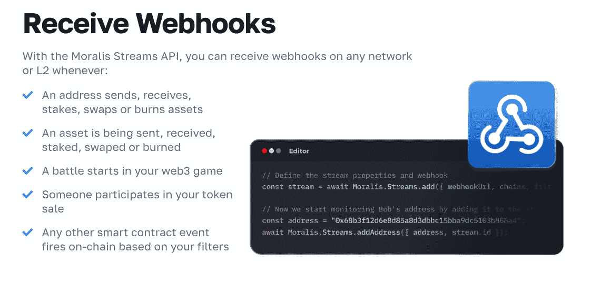
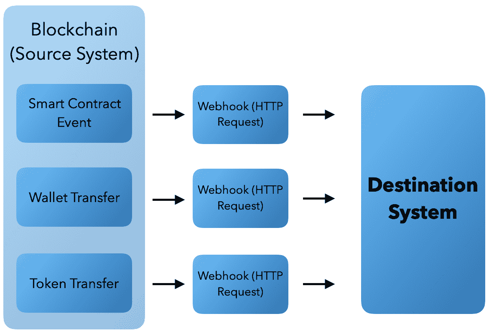
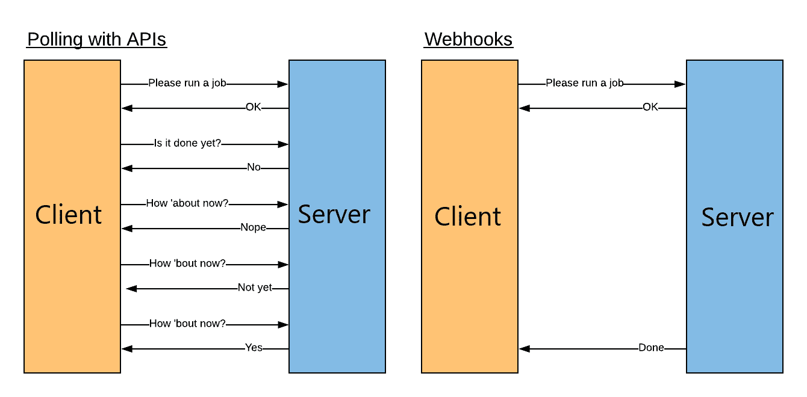
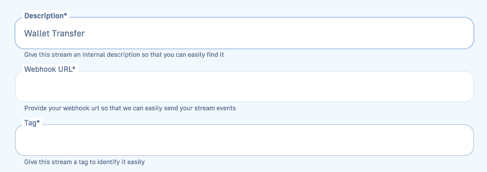
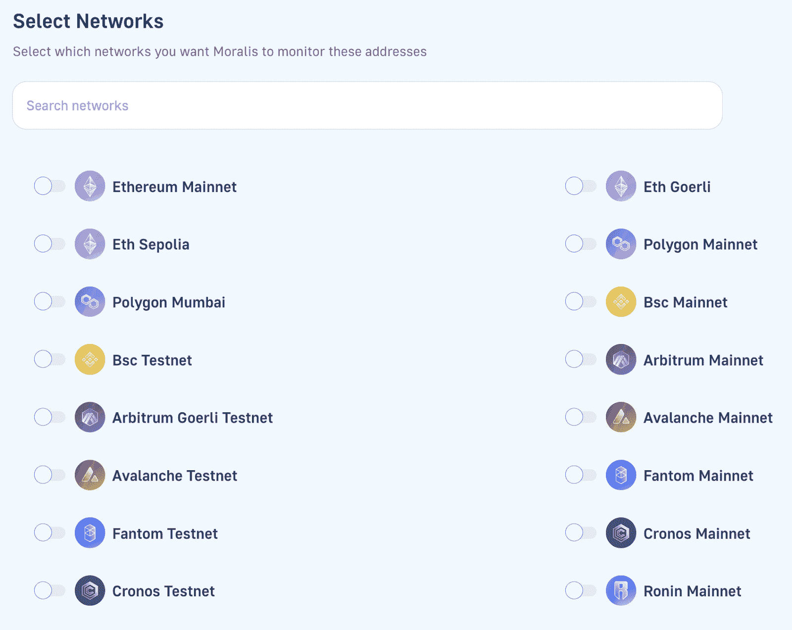

# 以太坊 Webhooks——什么是以太坊 Webhooks 以及如何使用以太坊 web hooks

> 原文：<https://moralis.io/ethereum-webhooks-what-they-are-and-how-to-use-webhooks-for-ethereum/>

你是否正在寻找一个以太坊网络钩子？如果是这样，利用最好的 Web3 开发工具是非常有益的。[**Moralis**](https://moralis.io)**‘企业级 Web3 Streams API 提供了创建以太坊 webhooks 的最快、最方便的方法，可将链上数据直接传输到所有项目的后端！**



通过跟随本教程并完成必要的先决条件，您将学会以两种方式创建以太坊 webhooks:通过 Moralis 的 web UI(用户界面)或用 Moralis JS SDK 编程。如果你想直接进入教程，请进入“*以太坊 web hooks——如何为以太坊设置 web hook*”部分！您还可以在下面找到一个以编程方式设置以太坊 webhook 的代码示例:

```js
import Moralis from 'moralis';
import { EvmChain } from "@moralisweb3/evm-utils";

Moralis.start({
  apiKey: 'YOUR_API_KEY',
});

const stream = {
  chains: [EvmChain.ETHEREUM, EvmChain.POLYGON], // List of blockchains to monitor
  description: "monitor Bobs wallet", // Your description
  tag: "bob", // Give it a tag
  webhookUrl: "https://YOUR_WEBHOOK_URL", // Webhook URL to receive events
}

const newStream = await Moralis.Streams.add(stream);
const { id } = newStream.toJSON(); // { id: 'YOUR_STREAM_ID', ...newStream }

// Now we attach Bobs address to the stream
const address = "0x68b3f12d6e8d85a8d3dbbc15bba9dc5103b888a4";

await Moralis.Streams.addAddress({ address, id });
```

[**Sign Up and Start Using Ethereum Webhooks**](https://admin.moralis.io/register)

### 概观

应用程序和其他平台可以通过多种不同的方式进行通信。然而，最有效和高效的方式是通过 webhooks，这对于今天 Web2 中的数字交流是必不可少的。此外，webhooks 在 Web3 开发领域扮演着同样重要的角色。因此，开发人员迫切需要工具来有效地设置 webhooks，将区块链数据实时传输到他们的应用程序后端！因此，如果您想了解更多，请继续阅读，探索设置 webhooks 的最便捷方式，以便将[链上数据](https://moralis.io/on-chain-data-the-ultimate-guide-to-understanding-and-accessing-on-chain-data/)流式传输到您的项目中！

由于以太坊是最重要的 Web3 开发平台，本指南主要关注面向以太坊的 webhooks。因此，如果你一直坚持到最后，这篇文章将教你如何使用 Moralis 的 Web3 Streams API 创建你自己的以太坊 webhooks。


此外，Streams API 只是 Moralis 的[web 3 API](https://moralis.io/web3-apis-exploring-the-top-5-blockchain-apis/)让区块链开发变得更加容易的一个例子。要了解更多关于 Moralis 的功能，我们建议查看一下[认证 API](https://moralis.io/authentication/) ，这是一个让 Web3 认证变得非常简单的工具。例如，查看我们的指南，了解如何使用 RainbowKit 在[添加签到！](https://moralis.io/how-to-add-a-sign-in-with-rainbowkit-to-your-project-in-5-steps/)

尽管如此，如果你想添加各种认证方法或设置以太坊 webhooks，这并不重要；如果您想获得更加无缝的 Web3 开发体验，[现在就注册 Moralis](https://admin.moralis.io/register) ！

## 什么是 Webhooks，它们是用来做什么的？

在当今高度互联的在线空间中，系统需要高效的通信方式，因为它们无法孤立地以最佳方式运行。这就是 webhooks 的舞台。Webhooks 实现了两个系统之间高效和有效的通信，允许它们彼此“对话”。简而言之，webhooks 是基于特定事件在源系统(发送者)中触发的 HTTP 请求，这些请求被发送到目标系统(接收者)。

源系统可以通过这些发送到特定 webhook URL 的 HTTP 请求与目标系统通信。更重要的是，伴随着某个事件已经发生的通知，源系统通常以“请求有效载荷”的形式包括附加信息。


可以想象，在 Web2 和 Web3 开发实践中，根据给定的条件监控源系统是至关重要的。鉴于这是一项如此重要的任务，本指南将教你如何通过为以太坊设置 webhooks 来监控和收听实时区块链事件！

然而，在这样做之前，我们将探索更多关于以太坊环境中 webhooks 的内容！

## 什么是以太坊网钩？

随着对传统 webhooks 更深刻的理解，本节将深入探讨它们在以太坊环境中的含义。因此，如果你想了解更多关于以太坊网页挂钩的信息，请继续阅读我们的问题，“*什么是以太坊网页挂钩？*”。



就像传统的 webhooks 一样，以太坊 webhooks 有着相同的目的:支持跨系统通信。然而，事情略有不同，因为 Web3 通过智能合约运行在基于区块链的基础设施上。因此，Web3 开发人员使用以太坊 webhooks 来实时监听区块链事件和接收请求负载。这包括从简单的交易到发出事件的更复杂的智能合约。

此外，与传统的 webhooks 非常相似，您可以利用 Ethereum webhooks 来避免不断轮询数据库和检查区块链的状态是否已经更新的冗余任务。因此，可以设置一个以太坊 webhook 来自动接收与您感兴趣的事件相关的请求负载。



因此，如果您设置了以太坊 webhooks，以太坊区块链(源系统)会根据您指定的智能合约事件将数据推送到您的 webhook URL。此外，目标系统还可以发送包含 HTTP 状态代码的回调消息。这通知源系统请求的数据已成功交付。

### 以太坊 Webhook 示例

现在，为了使上面的解释更加直观，本节将简要概述一个以太坊 webhook 示例。让我们说，你正在使用一个密码交易所交易链上的资产。交易时，你接收和发送资产。但是，要将资产存入您的加密钱包，您不必总是积极交易。


在这种情况下，交易所能够发送关于你的新资产的通知是有益的。此外，为了使这一过程自动化，交易所可以监控你的 Web3 钱包，以便在交易发生时接收 webhooks。在这种情况下，区块链是源系统，您使用的 exchange 是目标系统。

尽管如此，由于以太坊 webhooks 提供了实时监控链上事件的最有效和高效的方式，很明显知道如何使用 webhooks 是非常有益的。因此，如果您想学习如何为以太坊设置一个 webhook，请跟随下一节。通过这样做，您将看到如何创建与上面的例子功能相似的 webhooks！

## 以太坊 Webhooks–如何为以太坊设置 web hook

既然您对以太坊 webhooks 有了更深入的了解，那么是时候直接进入文章的中心部分，向您展示如何使用 Moralis 的 [Streams API](https://moralis.io/streams/) 来构建它们了！


使用 Moralis，您可以通过以下两种方式之一设置您的第一个流，以便在所有网络和第 2 层解决方案上接收以太坊 webhooks:

*   **使用 Moralis 的管理面板**–您的第一个选择是使用 Moralis 的 web UI(用户界面)构建流。
*   **程序化**–另一种方法是使用 Moralis 的 API 或 SDK 程序化地创建流。

以上两个选项都非常适合设置流来接收以太坊 webhooks。此外，使用这两种方法都相对容易。然而，为了使本指南尽可能简单明了，本文为这两者提供了一个全面的演练！此外，为了说明 Moralis 的 Streams API 的可访问性，您将学习设置一个 Ethereum webhook 来传输关于 [Web3 wallet](https://moralis.io/what-is-a-web3-wallet-web3-wallets-explained/) 的链上数据。具体来说，您将学习使用 Ethereum webhooks 来监控基于指定钱包地址的传入和传出交易。

不过，让我们先来仔细看看如何通过 Moralis 的 UI 来设置以太坊的 webhook！

### 通过 Moralis 的管理面板

本节将向您展示如何使用 Moralis 的 web UI 构建一个流，通过以太坊 webhooks 接收链上数据。要跟进，你需要一个 Moralis 账户。因此，如果您还没有这样做，请立即[向 Moralis 家](https://admin.moralis.io/register)注册！

一旦你有了自己的账户，你就可以通过访问下面的页面来设置一个以太坊网络挂钩:“[*【https://admin.moralis.io/streams】*](https://admin.moralis.io/streams)”。要开始，请点击 Moralis 界面右侧的“+ New Stream ”:


从那里，您有两个选择:从头创建一个新的流或者使用已经开发的模板。在本教程中，由于您希望监控钱包的收入和支出交易，因此可以选择“钱包转账”模板:


当您点击“钱包转账”选项时，您需要提供您要监控的钱包的地址:


输入地址并按下“下一步”按钮后，您需要添加描述、webhook URL 和标签:



接下来，由于您希望通过以太坊 webhooks 传输数据，请选择以太坊网络:



以太坊网络选定后，就该选择地址活动了。在这样做的过程中，您可以选择 Moralis 自动为您解析的活动:


最后，向下滚动并点击“创建流”按钮。就是这样；这涵盖了创建一个流来通过 Moralis 的 web UI 接收以太坊 webhooks 的过程！

### 程序化

本节将教你如何使用 Moralis 的 JS SDK 以编程方式设置以太坊 webhooks。首先，打开您首选的 IDE(集成开发环境)并创建一个包含 JavaScript 文件的新项目文件夹。接下来，确保安装了所有的 Moralis 依赖项。例如，如果您正在使用 NodeJS，您可以通过打开一个新的终端并运行“ *npm install moralis* ”来实现。

一旦完成了 JS 项目的设置，就可以通过初始化 Moralis 的 SDK 继续。为此，请在 JS 文件的顶部添加以下代码片段:

```js
import Moralis from 'moralis';
import { EvmChain } from "@moralisweb3/evm-utils";
Moralis.start({
  apiKey: 'YOUR_API_KEY',
});
```

如果您检查上面的代码，您会很快注意到您需要添加您的 Moralis API 密钥。为此，你需要一个 Moralis 账户。所以，如果你还没有，免费创建你的 Moralis 帐户！

有了帐户，您可以通过登录并导航到“Web3 APIs”选项卡来找到密钥。从那里，复制 Web3 API 密钥并替换代码中的" *YOUR_API_KEY* "以完成 Moralis 的初始化:


接下来，您必须创建一个新的" *stream* "对象，并指定一些属性。这包括链，描述，标签和你的网页挂钩网址。您将在下面找到一个示例:

```js
const stream = {
  chains: [EvmChain.ETHEREUM, EvmChain.POLYGON], // List of blockchains to monitor
  description: "monitor Bobs wallet", // Your description
  tag: "bob", // Give it a tag
  webhookUrl: "https://YOUR_WEBHOOK_URL", // Webhook URL to receive events,
}
```

最后，通过调用“ *Moralis”创建一个新的流。Streams.add(stream)* 函数以“ *stream* ”对象为参数，添加一个“ *{ id }* ”对象，以及您要监视的钱包地址:

```js
const newStream = await Moralis.Streams.add(stream);
const { id } = newStream.toJSON(); // { id: 'YOUR_STREAM_ID', ...newStream }
// Now we attach Bobs address to the stream
const address = "0x68b3f12d6e8d85a8d3dbbc15bba9dc5103b888a4";
await Moralis.Streams.addAddress({ address, id });
```

因此，您现在应该有一个如下所示的 JS 文件:

```js
import Moralis from 'moralis';
import { EvmChain } from "@moralisweb3/evm-utils";

Moralis.start({
  apiKey: 'YOUR_API_KEY',
});

const stream = {
  chains: [EvmChain.ETHEREUM, EvmChain.POLYGON], // List of blockchains to monitor
  description: "monitor Bobs wallet", // Your description
  tag: "bob", // give it a tag
  webhookUrl: "https://YOUR_WEBHOOK_URL", // Webhook URL to receive events,
}

const newStream = await Moralis.Streams.add(stream);
const { id } = newStream.toJSON(); // { id: 'YOUR_STREAM_ID', ...newStream }

// Now we attach bobs address to the stream
const address = "0x68b3f12d6e8d85a8d3dbbc15bba9dc5103b888a4";

await Moralis.Streams.addAddress({ address, id });
```

那就涵盖了代码！剩下的工作就是通过在终端中输入以下内容并按回车键来运行程序:

```js
node “FILE_NAME”
```

### 强制以太坊测试 Webhook

如果您已经学习了这么多，现在您可以用两种不同的方式创建流来接收以太坊 webhooks。然而，无论您是通过 Moralis web UI 还是以编程方式设置以太坊 webhooks，都没有关系；当启动一个新的流时，你总是会收到一个测试 webhook。

此外，要使流可操作，您必须返回状态代码 200，您将在下面找到测试主体:

```js
{
  "abi": {},
  "block": {
    "hash": "",
    "number": "",
    "timestamp": ""
  },
  "txs": [],
  "txsInternal": [],
  "logs": [],
  "chainId": "",
  "tag": "",
  "streamId": : "",
  "confirmed": true,
  "retries": 0,
  "erc20Approvals": [],
  "erc20Transfers": [],
  "nftApprovals": [],
  "nftTransfers": []
}
```

一旦您返回状态代码，您就可以开始工作了，并且已经成功地建立了一个接收以太坊 webhooks 的流。因此，当您监控的地址实际参与了传出/传入交易时，您将收到一个包含交易详细信息的以太坊 webhook！

如果您在本教程中遇到任何问题，请务必查看 Moralis Web3 Streams API 的官方文档。此外，您可以加入 Moralis 不和谐频道，随时从我们的社区工程师那里获得出色的帮助！

[**Join Moralis’ Discord Channel and Moralis Magazine**](https://moralis.io/joindiscord/)

## 以太坊 web hooks——Moralis 的 Firebase 集成

如果您已经了解了这么多，那么您应该知道以太坊 webhooks 对于 Web3 开发是必不可少的，因为它们使您能够实时监听任何链上事件！此外，您还知道如何通过以太坊 webhooks 传输区块链数据。然而，即使您现在已经熟悉了流，您仍然需要一种将数据集成到后端的方法。这就是 Moralis 的 Firebase Streams API 集成发挥作用的地方！

通过 Moralis 的 Firebase 集成，您可以开始使用以太坊 webhooks，而无需建立自己的后端基础设施。相反，你可以使用 Firebase，一个通过为你提供完整的托管解决方案来处理大部分繁重工作的平台。因此，有了 Firebase 集成，通过 Ethereum webhooks 将链上数据直接流式传输到您的后端成为可能！

有关 Moralis 的 Firebase Streams API 集成的更多信息，我们建议观看下面来自 [Moralis YouTube](https://www.youtube.com/c/MoralisWeb3) 频道的剪辑。在本视频中，您将简要了解 Moralis 的 Streams API，并可以跟随我们的开发人员带您了解收听区块链活动的过程:

[https://www.youtube.com/embed/EieJVLhpvsI?feature=oembed](https://www.youtube.com/embed/EieJVLhpvsI?feature=oembed)

## 以太坊 web hooks–摘要

本文从探索 webhooks 的复杂性开始。因此，您了解到它们是由源系统中发生的事件触发的 HTTP 请求，然后被发送到目标系统。此外，结合对 webhooks 的深入研究，您了解了它们在以太坊网络的上下文中意味着什么。像传统的 webhook 一样，以太坊 web hook 负责在 Web3 空间内实现跨系统通信。因此，您可以使用以太坊 webhooks 将链上数据传输到所有区块链项目的后端。

此外，本文还向您展示了如何使用 Moralis 创建以太坊 webhooks。因此，如果您已经学习了这么多，您现在应该知道如何以两种方式设置以太坊 webhooks:

*   **通过 Moralis 的网络用户界面**
*   **程序化地**

如果你觉得这篇文章有帮助，请考虑在 Moralis 的 [Web3 博客](https://moralis.io/blog/)查看更多内容。这个博客为新的和更有经验的开发者提供了新的和相关的 Web3 开发内容。例如，仔细阅读[索拉纳智能合同示例](https://moralis.io/solana-smart-contract-examples-for-developers/)或者如何构建[区块链不和谐机器人](https://moralis.io/blockchain-discord-bot-build-a-discord-bot-for-on-chain-events/)！

此外，如果你想成为一名更熟练的区块链开发者，可以考虑加入 Moralis 学院。学院提供很棒的开发课程，如果你是 Web3 新手，可以看看下面的课程:“[以太坊 101](https://academy.moralis.io/courses/ethereum-101) ”。


然而，如果你对 Web3 开发感兴趣，请立即与 Moralis 签约。通过创建帐户，您可以在所有未来的开发工作中充分利用区块链技术的潜力！