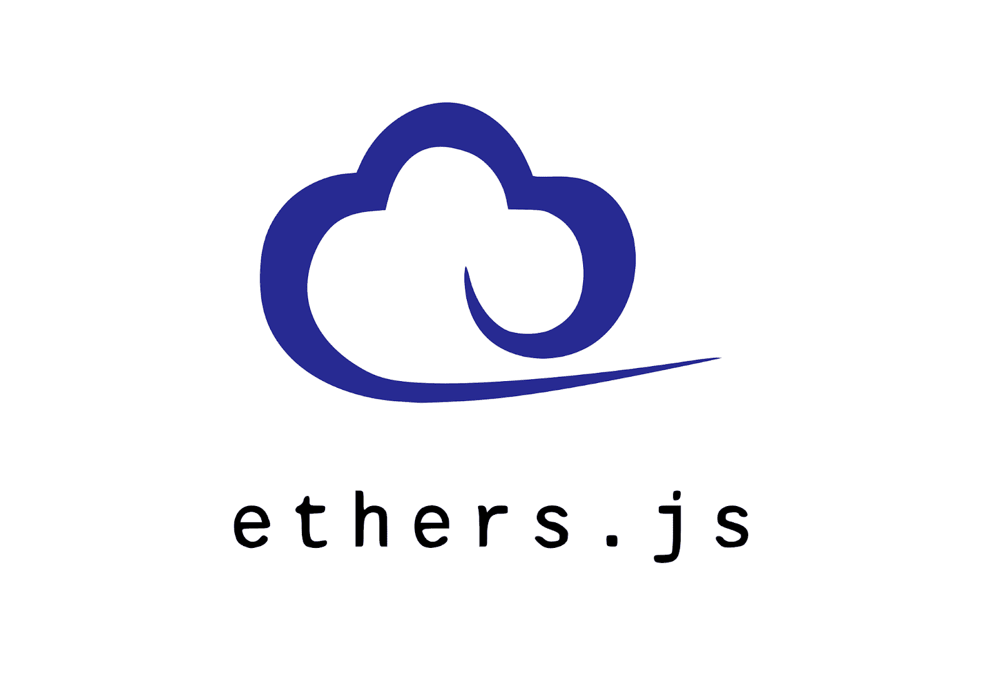
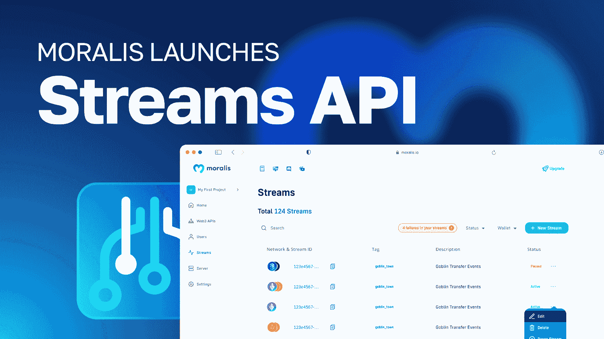
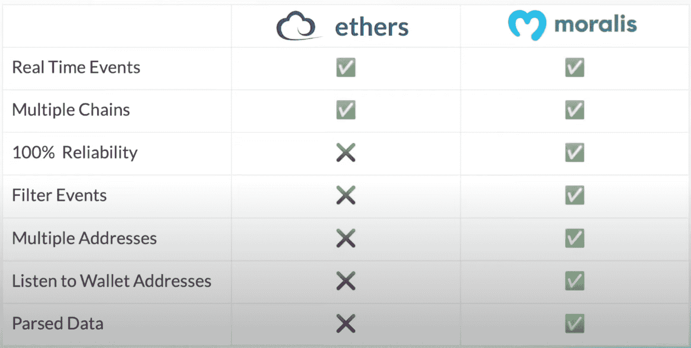
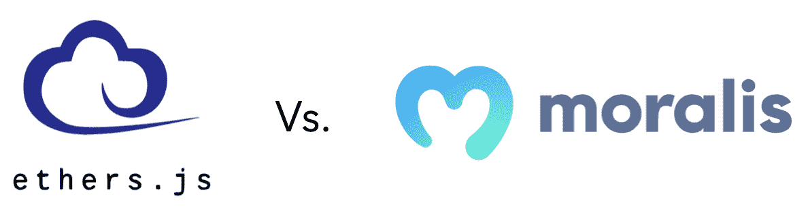
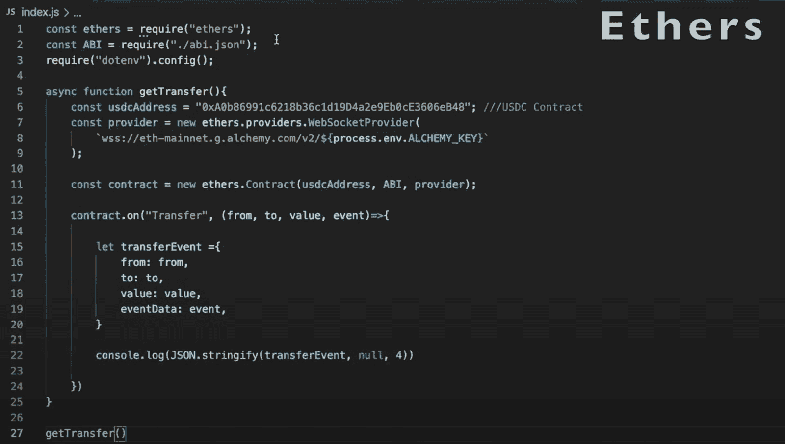
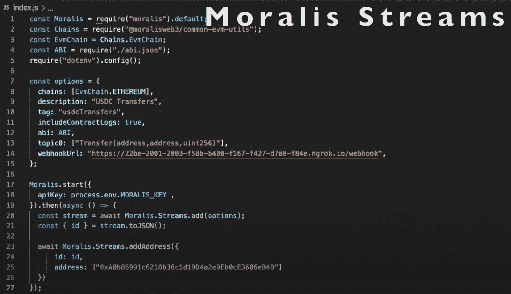
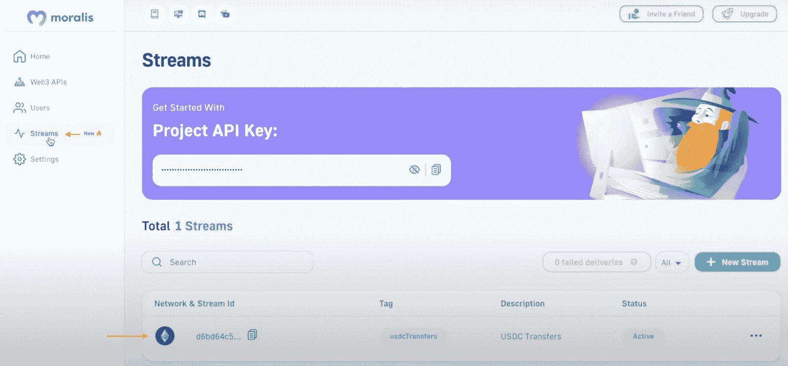
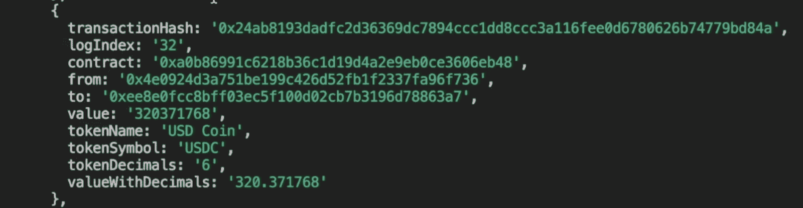

# ethers . js vs Web3 Streams——区块链开发者的最佳选择

> 原文：<https://moralis.io/ethers-js-vs-web3-streams-the-best-option-for-blockchain-developers/>

Web3 开发的一个核心部分是围绕着倾听和与分散的网络互动。一种方法是通过区块链监听器，它接收关于重要连锁事件的实时数据。然而，直到最近，这种设置一直相对繁琐。现在，由于 ethers.js 或 Moralis 的 Web3 Streams API，您可以轻松地设置区块链监听器。但是，在这两个选项中，哪一个是区块链开发商的最佳选择呢？如果你想了解更多这方面的内容，请加入我们的指南，比较 ethers.js 和 Web3 流！

本文将首先简要介绍 ethers.js 和 Web3 流的复杂性。从那里，文章比较了两者，突出了它们的相同点和不同点。最后，最重要的是，我们深入到用 ethers.js 和 Web3 流设置区块链监听器的实际例子中。在这样做的过程中，我们进一步探索它们之间的区别，以及是什么让 Moralis 成为首选！

在整篇文章中，您将熟悉 Moralis 的 Streams API。然而，这只是由[Moralis 公司](https://moralis.io)提供的众多[web 3 API](https://moralis.io/web3-apis-exploring-the-top-5-blockchain-apis/)中的一个。其他突出的工具包括 [Auth API、](https://moralis.io/authentication/) [NFT API](https://moralis.io/nft-api/) 、 [EVM API](https://moralis.io/evm-api/) 等。这些工具有助于更无缝的开发者体验，并解释了为什么 Moralis 是构建 Web3 应用程序的最快方式！因此，如果你想从事 Web3 开发，[和 Moralis](https://admin.moralis.io/register) 签约。您可以免费创建您的帐户，并立即访问各种 Web3 开发工具！

## ethers . js–这是什么？

Ethers.js 于 2016 年发布，是最著名的 Web3 JavaScript (JS)库之一。ethers.js 的目标是成为一个完整而紧凑的库，使开发者能够与以太坊网络进行交互。它最初的目的是与" *ethers.io* "一起使用，但后来已经发展成为一个更通用的库。

ethers.js 的一些核心特性是该库丰富的文档、用户友好的 API 结构、较小的包大小，以及它是用 TypeScript 编写的。更重要的是，它是一个使用起来相对直观和简单的库。反过来，这也是 Web3 开发者的首选之一，例如，设置区块链监听器。

Ethers.js 由四个核心模块组成:“ *ethers.contract* ”、“ *ethers.utils* ”、“*ethers . wallet*”和“ *ethers.provider* ”。每个模块服务于不同的功能，并且对于库的应用编程接口(API)是必不可少的。尽管如此，如果您想了解更多关于这些模块和库的知识，请查看我们的另一篇文章，回答问题“[什么是 Ethers.js？](https://moralis.io/full-guide-what-is-ethers-js/)”。

## 什么是 Web3 流？

Web3 流本质上是一个高级的区块链监听器，允许您监控区块链钱包或智能合约事件，您可以使用 Moralis 的 [Web3 流 API](https://moralis.io/streams/) 轻松设置一个！此外，通过这个 API，你可以通过 [Moralis webhooks](https://moralis.io/moralis-webhooks-an-introduction-to-web3-webhooks/) 将区块链数据无缝地传输到你的应用程序或 Web3 项目的后端。

此外，借助 Moralis 的跨链功能，您可以为多个链设置 Web3 流。这包括多边形、雪崩、BNB 链、以太坊、[其他](https://docs.moralis.io/reference/supported-chains)。更重要的是，Streams API 由我们在 Moralis 的团队积极维护，他们一直在努力增加更多的网络！

您可以使用 API 设置 Web3 流，以便在某个地址发送、接收、交换或标记资产时接收 webhooks。此外，在 Web3 游戏中，每当战斗开始时，您都可以获得 webhooks 有人参与代币销售，或者任何其他智能合约事件根据您的过滤器触发。

现在，随着对 ethers.js 和 Web3 流有了更好的理解，我们将在下一节中比较这两者，以突出它们在监视链上事件时的相似之处和不同之处！

## Ethers.js 与 Web3 流的比较

对于设置区块链监听器来实时接收关于链上事件的信息，Ethers.js 是一个很好的选择。不幸的是，如果您开始使用 ethers.js，您会很快注意到该库有局限性。因此，您应该考虑将 Moralis 的 Web3 Streams API 作为一个选项。然而，你不必相信我们的话。在下一节中，我们将比较 ethers.js 和 Web3 流，以突出它们的区别以及为什么 Moralis 是首选！

上图总结了 ethers.js 和 Web3 流之间的主要区别。乍看之下，您会立即注意到 Moralis 提供了 ethers.js 所提供的一切，甚至更多。但是，让我们更详细地讨论每一点，以便对 ethers.js 和 Web3 流进行深入分析！

### 为什么选择 Moralis？–ethers . js 与 Web3 流

正如上一节图片中的表格所示，您可以使用 ethers.js 和 Moralis 的 Web3 流来实时监听区块链事件。这两种方案都有多个链，这意味着您可以监控各种网络的事件。然而，这仅仅涵盖了 ethers.js 和 Moralis 的 Web3 流之间的相似之处；现在，让我们跳到不同之处。

首先，使用 Moralis，您可以获得 100%的可靠性，而 ethers.js 并不总是如此。当您使用 ethers.js 设置区块链侦听器时，您必须添加单独的节点提供者，这在某些情况下可能会有问题。例如，提供商可能不支持您想要的链，并且 100%确定节点保持运行是一个挑战。相反，有了 Moralis，你就有了一个简单明了的技术堆栈，并且总是可以通过 [Web3 webhooks](https://moralis.io/web3-webhooks-the-ultimate-guide-to-blockchain-webhooks/) 获得实时警报。

此外，在设置 Web3 流时，您可以使用 Moralis 添加过滤器。因此，您可以针对特定的事件，只接收您感兴趣的数据的 webhooks。例如，您可以设置流来单独接收超过特定传输金额的交易数据。

此外，使用 Moralis，您可以将几个契约地址汇集到一个流中，webhooks 会通知您事件是从哪里发出的。ethers.js 则不是这种情况，您必须为所有想要监控的契约创建单独的侦听器。

最后，您还可以使用 Moralis 来监听钱包地址。因此，当钱包执行特定操作时，您可以接收 webhooks。此外，从 Web3 流接收的数据会被解析，这意味着您不必担心额外的处理。因此，您可以收到开箱即用的所有数据！

## Ethers.js 与 Web3 Streams——哪个是开发人员的最佳选择？

通过对 ethers.js 和 Web3 流的比较，您现在已经熟悉了这两个选项之间的差异。然而，为了使区别更加直观，并强调与 ethers.js 相比，使用 Moralis 的好处，下面几节将探讨基于这两种选择的实际例子。因此，让我们先来仔细看看如何用 ethers.js 设置一个区块链监听器！

### Ethers.js 实例

在下面的 ethers.js 示例中，我们将简要介绍设置区块链监听器以监控 USD coin 智能合约的代码。具体来说，我们将监控合同的转移事件。然而，您可以在下图中找到完整的代码:

主要部分是“ *getTransfer()* ”函数，我们最初在这里添加合同地址。从那里，我们使用 ethers.js 库的一个模块指定“*提供者*”。因为我们需要在使用 ethers.js 时添加节点提供者，所以我们失去了一些可靠性，因为我们不能 100%确定他们可以在任何时候保持其节点完全可操作。我们还需要确保供应商支持我们感兴趣的链。

从那里，我们创建一个新的“*合同*对象，以“*美国地址*和“*供应商*作为参数。接下来，我们设置监听器来监控契约的" *Transfer* "事件。最后，我们最终控制台记录结果。

现在，一旦您运行上面截图中的代码，它将返回有关 USDC 转会的信息，看起来可能是这样的:

ethers.js 区块链监听器返回各种信息，如“*到*”和“ *from* 的地址和事件数据，如“ *blockNumber* ”、“ *blockHash* ”、“ *transactionHash* ”等。然而，这并不包含解析的数据，例如，我们不能直接确定数据来自哪个契约。

这是一个伟大的开始，但你会得到更多的 Moralis！因此，让我们深入到 Moralis Web3 Streams API 示例中，探索是什么使它成为一个更好的替代方案！

### Moralis 的 Web3 流实例

对于这个例子，我们有同一个区块链听众；但是，这一次，它是使用 Moralis 的 Web3 Streams API 设置的:

首先，如上面的截图所示，我们首先创建一个带有几个参数的“ *options* 对象。这些包括链，描述，标签，网页挂钩网址等。在那里，我们另外添加了一个 Moralis API 键，并通过调用“ *Moralis”创建了一个新的“*流*对象。Streams.add()* 函数带有“*选项*的一个参数。

最后，用 *Moralis。streams . addaddaddress()"*函数，我们可以添加所有我们想要监控的地址。注意，多亏了 Moralis，您可以通过将多个智能契约地址添加到“*地址*数组中来包含它们。

通过运行上面的代码，它自动创建一个新的 Web3 流，并将其添加到 Moralis 管理面板。因此，通过登录 Moralis 并点击“Streams”选项卡，我们现在应该可以找到一个新的流:

从那里，可以通过 Moralis UI 直接管理流。例如，只需点击几个按钮，我们就可以添加额外的合同、选择更多的链以及应用过滤器！

#### Web3 流响应

现在，在简要概述了如何构建流之后，让我们更仔细地看看结果和我们收到的数据。因此，我们可以打开接收 webhooks 的服务器的控制台，看看响应是什么样子的:

上面，您可以看到一个发送到我们的 webhooks 服务器的响应，其中包含解析的数据。这种反应是具有类似结构的更广泛的一系列其他交易的一部分。然而，数据包括事务散列、日志索引、合同地址等。更重要的是，由于数据已经被格式化，所以可以在 dapps 和其他 Web3 项目中直接使用它！

正如 ether.js 与 Web3 流的比较所展示的，您可以获得 ethers.js 与 Moralis 的 Web3 流提供的一切，甚至更多！因此，在设置区块链监听器时，使用 Moralis 应该是显而易见的！

然而，在我们的例子中，我们没有介绍如何添加过滤器。如果你想了解更多，请查看官方的 [Web3 Streams API 文档页面](https://docs.moralis.io/docs/streams-api)。你也可以从[Moralis YouTube](https://www.youtube.com/@MoralisWeb3) 频道观看下面的视频。此片段比较了 ethers.js 和 Web3 流，并提供了添加过滤器的教程:

[https://www.youtube.com/embed/e3k8MaJG1OA?feature=oembed](https://www.youtube.com/embed/e3k8MaJG1OA?feature=oembed)

## Ethers.js 与 Web3 流–摘要

在本文中，您了解了 Web3 开发的一个重要部分围绕着与区块链网络的交互和监听。因此，对于开发人员来说，能够轻松地设置区块链监听器来监控链上事件是很重要的。此外，您还发现了这样做的两个主要方法是 ethers.js 和 Moralis 的 Streams API。然而，你应该选择哪一个呢？

为了阐明这两种选择之间的区别，本文比较了 ethers.js 和 Web3 流。在这样做的过程中，您会发现 Web3 流提供了 ethers.js 所提供的一切，甚至更多。因此，如果你想设置区块链监听器，那么最好的选择是 Moralis 的 Web3 Streams API！

如果你觉得这篇文章有帮助，可以考虑在 [Web3 博客](https://moralis.io/blog/)上查看更多的 Moralis 内容。例如，通过查看我们关于[以太坊 webhooks](https://moralis.io/ethereum-webhooks-what-they-are-and-how-to-use-webhooks-for-ethereum/) 和[多边形 webhooks](https://moralis.io/polygon-webhooks-how-to-use-webhooks-on-polygon/) 的文章，了解更多关于 Streams API 的信息！更重要的是，如果你想成为一名更有技能的 Web3 开发者，考虑报名参加[Moralis 学院](https://academy.moralis.io)。Moralis 学院为初学者和更有经验的开发人员提供了很好的区块链开发课程。例如，看看下面的课程，它涵盖了以太坊开发的基础知识:“[以太坊 101](https://academy.moralis.io/courses/ethereum-101) ”。

尽管如此，如果你想在未来创建自己的 Web3 流，现在就注册 Moralis ！创建一个帐户是免费的，你可以立即获得各种各样的 Moralis 工具。因此，您可以充分利用区块链技术，构建更复杂的 Web3 项目！