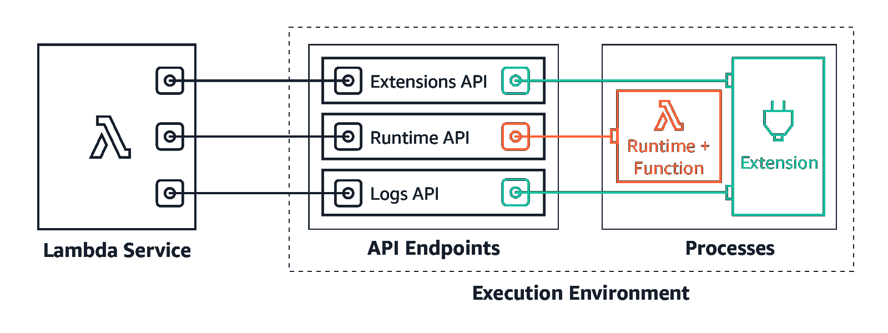

# 探索 AWS Lambda 及其用途

> 原文：<https://moralis.io/exploring-aws-lambda-and-what-it-is-used-for/>

云计算的引入凸显了计算机技术中最重要的范式之一，AWS(亚马逊网络服务)是世界上最广泛采用和最全面的云计算平台之一。AWS 由 IaaS、PaaS 和 SaaS 产品组合而成，包含数百种专为优化组织的云体验而定制的服务。数百万客户，包括大型企业、快速发展的初创公司和政府机构，使用 AWS 来降低成本、变得更加敏捷、更快地创新等。此外，AWS 平台最重要的服务之一是 Lambda，这是我们在本文中将关注的地方。因此，如果你想了解这项服务的更多信息，请继续阅读我们对 AWS Lambda 的详细介绍！

本文解释了 Lambda，这是一种事件驱动的无服务器计算服务，允许开发人员在不提供和管理服务器的情况下运行代码。此外，为了充分理解这项服务的复杂性，本文还深入探讨了 AWS Lambda 用例、服务的好处以及 Lambda 与 [Moralis](https://moralis.io) 的集成！

如果你已经熟悉 Lambda，可以考虑在 Moralis [Web3 博客](https://moralis.io/blog/)上阅读更多内容。该博客以新鲜和令人兴奋的 Web3 开发内容为特色。例如，查看我们在 [Web3 上为企业](https://moralis.io/web3-for-enterprise-business-applications-in-web3/)写的文章，或者了解你需要的关于[跨链桥接](https://moralis.io/cross-chain-bridging-deep-dive/)的所有信息！此外，如果你对区块链的发展感兴趣，请立即与 Moralis 签约。借助 Moralis 的[Web3 API](https://moralis.io/web3-apis-exploring-the-top-5-blockchain-apis/)和[可扩展 web 3 基础设施](https://moralis.io/scale/)，您可以加入 MetaMask、Polygon 等行业领导者的行列，充分利用区块链技术的力量！

## 什么是 AWS Lambda？

AWS (Amazon Web Services)是一个由数百种 Web 服务和工具组成的卓越生态系统。其中，你会发现 Lambda——最常用的 AWS 服务之一。此外，本节通过回答问题“什么是 AWS Lambda？”来探究这个组件的复杂性。

简而言之，Lambda 是一种无服务器、事件驱动的计算服务，允许您在不管理或供应服务器的情况下运行代码。此外，Lambda 具有高可用性计算基础架构，可处理与您的计算资源相关的所有管理任务，包括操作系统和服务器维护、自动扩展、容量供应、日志记录等。此外，使用 Lambda，您可以为任何后端服务或应用程序运行代码。你所需要做的就是用 Lambda 支持的语言之一提供代码！

当利用 Lambda 时，您将代码组织到函数中，服务仅在请求时运行它们，提供了自动的可伸缩性。因此，AWS Lambda 有潜力运行从每天几个请求到每秒几千个请求的任何事情。此外，AWS Lambda 使用“现收现付”的支付结构。因此，你只需为你的应用消耗的计算时间付费。这进一步意味着代码不运行时没有成本。

Lambda 函数可以执行任何计算任务，包括处理数据流、调用 API(应用程序编程接口)、服务网页等。由于 AWS Lambda 是一个广泛生态系统的一部分，因此很容易将 Lambda 功能与其他 AWS 服务集成在一起。

总的来说，由于这个 AWS 服务的无服务器特性，为您提供了一个完全由 Lambda 管理的完整计算解决方案。因此，您不必关注底层基础设施，可以将更多时间用于编写应用程序代码，从而创造更高的客户价值！

### 服务功能

现在，对服务有了更深刻的理解，并回答了“什么是 AWS Lambda？”问题，本节将探讨它的一些主要特性。在这样做的过程中，您会发现以下五个关键特性有助于您创建安全、可伸缩和可扩展的应用程序:

*   **扩展控制和并发性**–Lambda 提供扩展控制和并发性，对您的生产应用的响应和扩展提供完全控制。

*   **代码签名**–代码签名增加了完整性和信任控制，使您能够验证只有您认可的未更改代码才会部署到您的功能中。

*   有了 Lambda 扩展，你可以补充你所有的功能。举例来说，这确实允许您将 AWS Lambda 与其他安全、治理、监控等工具集成在一起。

*   **数据库访问**–数据库池由一个数据库代理管理，该代理转发来自函数的查询。因此，Lambda 函数可以达到高并发级别，而不会过度消耗数据库连接。

*   **定义为容器映像的函数**–AWS Lambda 允许您在构建、测试和部署函数时使用自己喜欢的容器映像工作流、工具和依赖项。

这涵盖了 Lambda 的一些关键特性，使您能够轻松创建可伸缩的应用程序。所以，现在你更熟悉什么是 AWS Lambda 了，让我们仔细看看一些最重要的 AWS Lambda 用例！

## AWS Lambda 使用案例

回答“什么是 AWS Lambda？”问题，这一节将仔细研究一些最突出的 AWS Lambda 用例。然而，在多个场景中使用 Lambda 是可能的，我们只有时间讨论其中的一些。因此，本节的范围将用例缩小到五个示例:

1.  **事件驱动应用**–第一个 AWS Lambda 用例是事件驱动应用。使用 Lambda，您可以创建事件驱动的函数，从而在解耦的服务之间实现可访问的通信。此外，借助这一功能，您可以在需求高峰期运行应用程序，而不必担心崩溃，从而节省不必要的成本。

2.  **大规模数据处理**–Lambda 是在您需要时以您要求的容量执行代码的理想选择。因此，您的应用程序可以自动扩展以匹配数据量。

3.  **创建交互式 Web 和移动后端**–另一个突出的 AWS Lambda 用例是将该服务与其他 AWS 工具结合使用，以构建稳定、安全和可扩展的在线用户体验。

4.  **可扩展的 API**–您可以使用 AWS Lambda 来构建可扩展的 API。Lambda 函数能够服务于单个 HTTP 请求，API 的各个部分可以通过 Amazon API Gateway 路由到不同的函数。此外，由于 AWS Lambda 具有大规模数据处理的特性，单个功能可以单独增长。因此，API 的各个部分可以根据当前的使用水平进行扩展，从而提供灵活且经济高效的 API 设置。

5.  **任务自动化**–AWS Lambda 的事件驱动模型使该服务非常适合自动化不需要整个服务器的业务任务。例如，这在处理从网站上提交的表单中获取的数据时非常有用。

尽管如此，这涵盖了 AWS Lambda 用例的五个示例，但是您自己还可以发现更多！

[**Join Moralis’ Discord Channel and Moralis Magazine**](https://moralis.io/joindiscord/)

## 为什么要用 AWS Lambda？

如果您已经了解了这么多，那么您现在应该知道 AWS Lambda 是什么，以及该服务的一些潜在用例是什么。然而，您可能仍然想知道为什么首先应该使用 AWS Lambda。因此，本节涵盖了该服务的主要优势，回答了“为什么使用 AWS Lambda？”问题。

为了充分回答上面的问题，本节涵盖了使用 AWS Lambda 的四个优点:

*   **现收现付**–Lambda 采用“现收现付”的计费计划，这意味着您只需为您使用的计算时间付费。因此，如果您的应用程序因一天中的不同时间而有显著的工作负载波动，这种计费结构通常会变得更具成本效益。

*   **完全托管的基础设施**–如果您构建 Lambda 函数，它们将在 AWS 基础设施上运行。因此，您无需担心底层服务器的维护，并且可以避免多余的运营任务，从而更加专注于为用户提供价值。

*   **AWS 集成**–由于 Lambda 是一个更大的生态系统的一部分，因此很容易将该服务与其他基于 AWS 的工具集成，如 DynamoDB、API Gateway、S3 等。

*   **自动扩展**–Lambda 提供了高度的灵活性和自动扩展能力，这意味着该服务可以帮助您应对应用活动的高峰。这是可能的，因为 Lambda 只在被请求时为你的函数创建实例。这与“现收现付”的计费结构密切相关，这意味着自动扩展允许您削减成本。

这涵盖了该服务的一些主要优势，并有望回答“为什么使用 AWS Lambda？”问题。接下来，我们将仔细观察一些使用 AWS Lambda 的组织！

### 谁在用 AWS Lambda？

本节提供了三个组织使用 AWS Lambda 实现业务现代化的示例，第一个是 Nielsen！

**尼尔森**–尼尔森是受众测量、分析和数据领域的全球组织和领导者。该公司通过几个渠道和平台来衡量行为，以确定受众想要什么。此外，尼尔森每天使用 AWS Lambda 处理大量数据！

Stedi–第二个使用 AWS Lambda 的组织是 Stedi。Stedi 为构建 edi 集成提供 API。更重要的是，Stedi 正在使用 AWS Lambda 来简化 B2B(企业对企业)交易流程。

可口可乐公司——第三个也是最后一个例子是可口可乐公司，无需介绍。然而，该组织使用 AWS Lambda 仅用了 100 天就推出了无接触喷泉体验！

这涵盖了三个使用 AWS Lambda 的企业的突出例子。其中包括这个星球上最知名的品牌之一:可口可乐。然而，这只是三个例子。许多其他组织都在使用 AWS Lambda，您可以自己去发现！

尽管如此，本文现在已经涵盖了 Lambda 的大部分复杂性。剩下的唯一问题是如何使用这项服务。因此，下一节将简要概述在 Web3 上下文中使用 Lambda 的最简单方法！

## AWS Lambda 与 Moralis 的集成

在 Web3 上下文中使用 Lambda 最简单的方法是通过 Moralis 的 Lambda 支持，这允许您轻松地将 Moralis NodeJS SDK 与服务集成。更重要的是，你可以用几种不同的方法做到这一点，下面，你会发现两个突出的例子:

*   **创建和部署具有多种功能的 Lambda 应用**——在 Moralis 的文档中，您可以找到如何创建和部署具有多种功能的 [Lambda 应用的指南。此外，本指南向您展示了如何在 Lambda 上部署 NodeJS 函数。为了使这个过程更容易，本指南使用了传统的无服务器框架。此外，这个应用程序包含两个函数，一个用于获取本机余额，另一个用于获取 NFT(不可替换的令牌)。](https://docs.moralis.io/docs/using-aws-lambda#lambda-app-with-multiple-functions)

*   **创建和部署 Lambda NodeJS Express API**——在同一个文档页面上，如前所述，您可以向下滚动，找到关于创建和部署 [Lambda NodeJS Express API](https://docs.moralis.io/docs/using-aws-lambda#lambda-nodejs-express-api) 的指南。此外，就像上面的例子一样，本指南还使用了传统的无服务器框架来简化这个过程。

我们不会深入研究这两个例子，因为这超出了本文的范围。然而，如果你对 Lambda 与 Moralis 的集成感兴趣，你可以在这里找到官方文档！

## 总结——探索 Lambda 及其用途

AWS 是市场上最重要的云计算平台之一。该平台是一个包含数百种服务的云产品集合，其中之一就是 Lambda！

Lambda 是一种无服务器、事件驱动的云计算服务，允许开发人员运行代码，而无需管理底层后端基础设施。此外，Lambda 还有几个优秀的特性，比如代码签名、Lambda 扩展、数据库访问等。有许多 AWS Lambda 用例，一些突出的例子是事件驱动的应用程序、大规模数据处理、可伸缩的 API、任务自动化等。此外，开发人员应该使用 AWS Lambda 有几个原因，包括“按需付费”的计费结构、自动扩展解决方案、完全托管的基础设施等等！

如果你觉得这篇文章有帮助，可以在 Moralis 博客上查看更多内容。例如，学习[创建一个《我的世界》Web3 游戏](https://moralis.io/creating-a-minecraft-web3-game-take-ideas-into-production/)的复杂性，或者[如何为链上事件](https://moralis.io/blockchain-discord-bot-build-a-discord-bot-for-on-chain-events/)创建一个不和谐机器人！你也可以仔细看看 Moralis 的企业级 Web3 APIs，它促进了可伸缩的 [Web3 基础设施](https://moralis.io/web3-infrastructure-exploring-the-best-solution-for-web3-development/)。其中，你会发现像 [EVM API](https://moralis.io/evm-api/) 这样神奇的工具，让你可以立刻构建 dapps。如果这听起来令人兴奋，你可能会对我们的教程感兴趣，关于如何最快地[构建一个 Web3 应用](https://moralis.io/fastest-way-to-build-a-web3-app/)！同样，使用 Moralis，你可以通过 webhooks 合并 [Web3 流](https://web3streams.com/)。听起来很有趣？如果是这样，看看我们的文章解释[以太坊网钩](https://moralis.io/ethereum-webhooks-what-they-are-and-how-to-use-webhooks-for-ethereum/)！

此外，如果你想成为区块链认证的开发者，我们强烈建议你去看看 Moralis 学院。通过注册，您可以获得一些业内最著名的区块链课程。如果你是 Web3 开发的新手，可以看看下面的课程:“[以太坊 101](https://academy.moralis.io/courses/ethereum-101) ”。

尽管如此，请立即与 Moralis 家签约！通过这样做，您可以使用最先进的开发工具构建更智能的应用程序，弥补 Web2 和 Web3 之间的开发差距！