# 探索 BSC scan–完整指南

> 原文：<https://moralis.io/exploring-bscscan-full-guide/>

**说到区块链发展，******以太坊依然是 dApp 发展的主要网络。然而，以太坊高昂的燃气费让开发商和用户在别处寻找更好的替代方案。这为其他连锁店将自己定位为有吸引力的替代者提供了机会。币安智能连锁公司(BSC)就是这样做的一家区块链公司，它标榜低费用和相对快速的交易时间。而且，BscScan 是 BSC 开发的常用工具。****

**BSC 提供了高水平的安全性、可伸缩性，当然还有低交易费用。无论您是希望在币安智能链上构建 [Web3](https://moralis.io/the-ultimate-guide-to-web3-what-is-web3/) 应用程序的开发人员，还是普通的 BSC 用户，您都应该了解 BscScan。这个区块链探索者提供了大量关于地址、[、智能合同](https://moralis.io/smart-contracts-explained-what-are-smart-contracts/)、交易等等的有用信息。在本指南中，我们将介绍什么是 BSC can，如何使用它来查找有关 [NFTs](https://moralis.io/non-fungible-tokens-explained-what-are-nfts/) 的 BSC 信息，以及开发人员如何探索 BSC can 并利用其提供的文档。因此，在我们继续探索 BscScan 的过程中，请跟随我们深入阅读这份完整的指南。最重要的是，使用 BscScan 是对使用区块链首屈一指的中间件 Moralis 开发 dApps 的极好补充！**

**就像[在以太坊](https://moralis.io/ultimate-guide-how-to-build-ethereum-dapps/)上构建一样，在 BSC 上构建可能是一项耗时的任务。例如，构建后端基础设施特别耗费资源。原型化、开发和部署 BSC dApps 的最快方式是通过 [Moralis](https://moralis.io/) 。这个 Web3 开发平台帮助您快速轻松地交付 [dApps](https://moralis.io/decentralized-applications-explained-what-are-dapps/) ，因为您可以将最大的注意力放在前端编程上。此外，了解 BscScan 可以帮助您获取与币安智能链相关的特定信息，以便在开发和测试期间使用。因此，使用这里提供的关于 BscScan 的信息，并将其与 Moralis 的力量相结合，将使您的 BSC 编程知识更上一层楼。**

**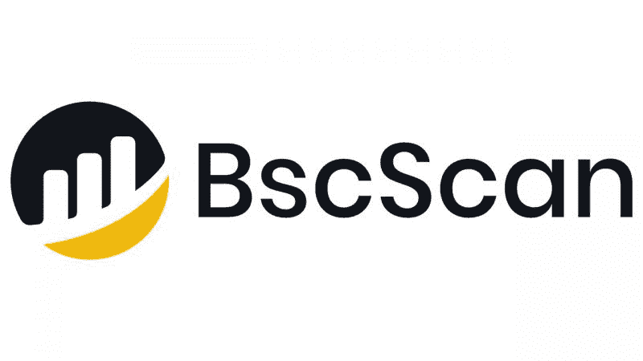

## **什么是 BscScan？**

那么，BscScan 是什么？如果你熟悉一个叫做“以太扫描”的工具，这很容易解释。基本上，以太扫描为以太坊工作，BscScan 为币安智能链工作。此外，BscScan 是一个块浏览器和分析平台，任何人都可以免费访问互联网。它使用户能够轻松查找币安智能链上发生的所有交易。然而，您可以找到比 BscScan 更多的交易。它的导航菜单以及 BscScan 提供的选项列表非常广泛。

此外，BscScan 是由与 Etherscan 相同的团队创建的，因此两个平台具有相似的接口也就不足为奇了。UI 是干净和基本的(没有不必要的“花里胡哨”)，以确保每个人都可以访问它们。此外，BscScan 努力提供越来越多的功能。例如，它最近增加了一个“yield farm”功能，通知用户最近在币安智能链上推出的 Yield Farm 平台。这和它的“DEX Tracker”只是最近添加到 BscScan 中的许多新功能之一。

虽然在 BscScan 上创建帐户并不是获得访问权限的必要条件，但这样做是有益的，尤其是对开发人员而言。这样，您可以设置自己的偏好，并保存它们以备将来使用。此外，BscScan 确实允许用户连接支持的钱包([元掩码](https://moralis.io/metamask-explained-what-is-metamask/)、[信任钱包](https://forum.moralis.io/t/trust-wallet-integration/1382)等)。).但是，请注意，BscScan 不是“钱包服务”。

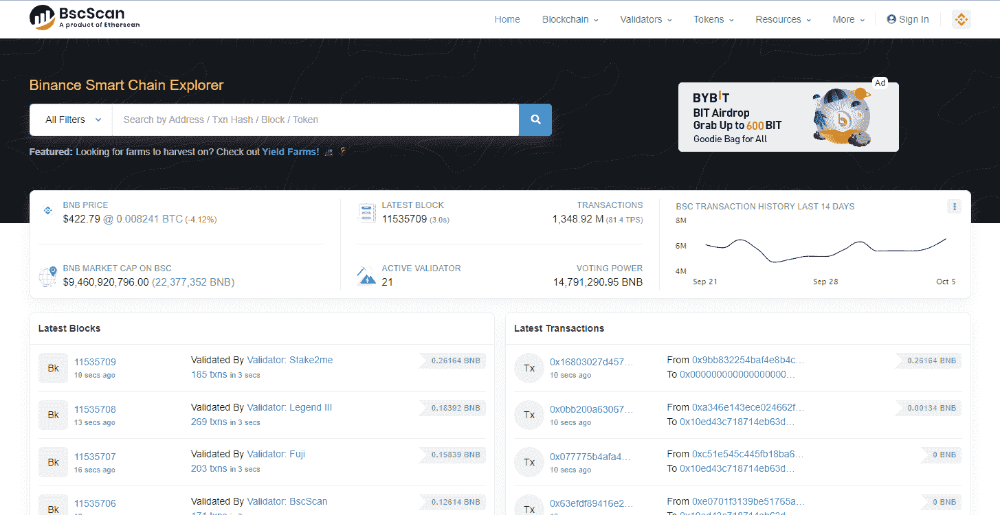

## **探索 BscScan**

您将了解如何充分利用 BscScan 平台。我们将向您展示如何查找交易、令牌地址、验证器排行榜、如何按交易 ID 搜索等等。

我们应该首先提到 BscScan 为 BSC 的 mainnet 和 [testnet](https://moralis.io/bep20-testnet-create-a-bep20-token-in-15-mins/) 提供信息。此外，两个网络之间的切换非常简单。当访问官方 [BscScan 网站](https://bscscan.com/)时，你将登陆 mainnet explorer。如果您想探索 testnet，单击菜单栏右侧顶部的币安图标。然后从下拉菜单中选择“BSC Testnet”选项，如下图所示:

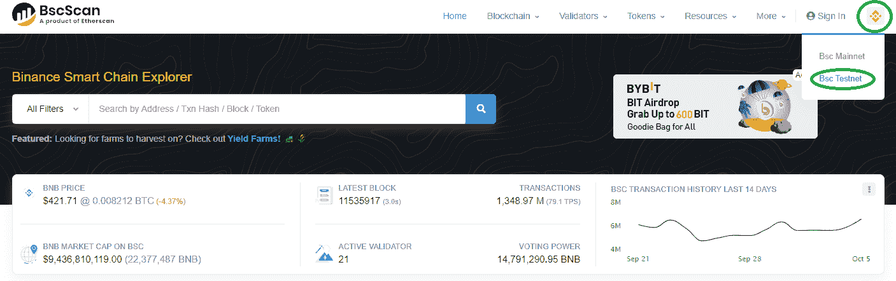

此外，要从测试网切换回主网，导航到与之前币安图标所在的相同空间；然而，在这种情况下，将出现一个 testnet 按钮，而不是币安图标。

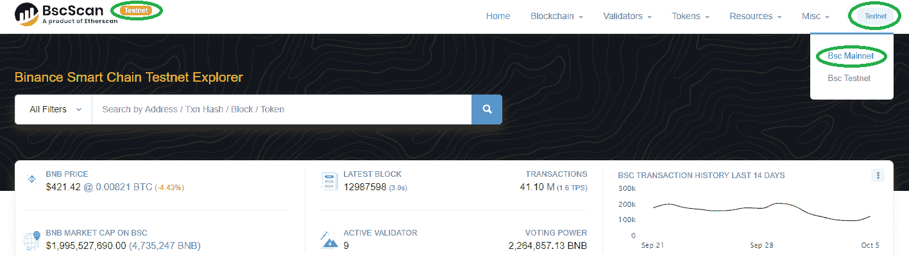

### **BscScan 菜单**

在深入了解更多细节之前，让我们快速浏览一下 BscScan 菜单。它包含以下项目:

*   **主页**–带您进入 BscScan 的主页。

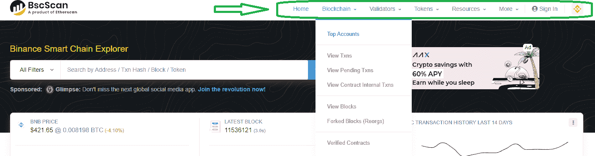

*   **区块链**–在这里您可以找到 BSC 的所有链上数据。它包括多个选项:
    *   ***顶级账户***–让您深入了解哪些账户持有最多 BNB，以及它们包含的 BNB 数量。
    *   ***查看交易****–这是您在 BSC 上查看交易(也称为“交易”)的地方。*
    *   ***查看待处理交易****–此处仅显示待处理交易。如果您正在查找尚未验证的交易，请使用此选项。*
    *   ***查看合同内部交易****——在这里您可以看到* [*智能合同*](https://moralis.io/smart-contracts-explained-what-are-smart-contracts/) *之间的交易。*
    *   ***块****–这是您查看已验证块的地方。*
    *   ***分叉块****–这是您可以看到由于“链重组”而被排除的块。*
    *   ***验证过的合同****——在这里，您可以查看 BSC 上的智能合同，并附有验证过的源代码。*
*   **验证器**–验证器在 BSC 上启用交易。这些用户/计算机运行节点并持有大量 BNB 令牌(存在其他验证标准)。使用此选项，您可以看到:
    *   ***验证者排行榜。*T3】**
    *   ***查看验证器设置信息。*T3】**
*   **令牌**–在这里，您可以访问与 BSC 兼容的令牌的详细信息。BscScan 为您提供了几个选项:
    *   ***BEP-20 市值令牌****–BEP-20 是在 BSC 上创建的令牌的标准(以 ERC-20 为例)。*
    *   ***BEP-20 代币按体积。*T3】**
    *   ***查看 BEP-20 转账。*T3】**
    *   ***ERC-721 顶级代币****–ERC-721 是* [*NFTs*](https://moralis.io/non-fungible-tokens-explained-what-are-nfts/) *(不可替代代币)的标配，可以在这里查看 NFTs。*
    *   ***查看 ERC-721 的调动情况。*T3】**
*   **资源。**
    *   ***图表&统计数据。*T3】**
    *   ***顶级统计。*T3】**
    *   ***开发者 API。*T3】**
    *   ***产量养殖场列表。*T3】**
*   **More**–在这里可以找到更高级的选项，包括 API 文档。

### **BSC 扫描搜索栏**

通过上述菜单选项访问 BscScan 平台的特定部分非常有用；然而，真正的力量在于 BscScan 的搜索栏。每当您有地址、交易散列、块号或令牌(名称或股票代码)时，您可以在搜索栏中输入并按 enter 键。

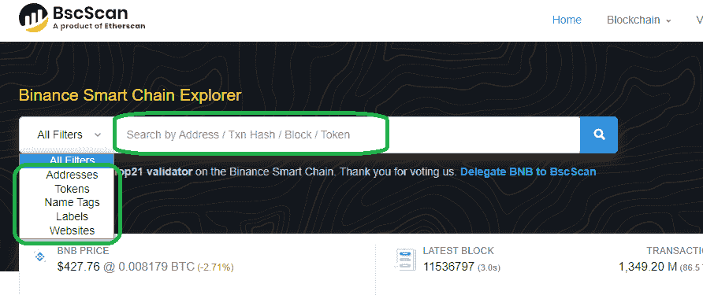

此外，搜索栏提供了几个过滤器(如上图所示)。这样，您可以将搜索限制在感兴趣的特定领域。总而言之，当你在寻找某样特别的东西时，搜索栏是最好的选择。

了解 BscScan 菜单，并能够相应地使用其搜索栏，基本上是访问币安智能链数据所需的全部内容。因此，使用到目前为止获得的信息，您还不如开始您的开发之旅并[创建 BSC dapp](https://moralis.io/how-to-create-bsc-dapps-quickly/)。为了帮助你开始，我们建议查看我们的 [BSC 编程](https://moralis.io/bsc-programming-guide-intro-to-binance-smart-chain-development-in-10-minutes/)指南。但是，如果您有兴趣了解有关 BscScan 特定功能的更多详细信息，请继续阅读以下部分。

### **如何在 BscScan 上查找交易**

使用 BscScan 来查找特定的事务是它的主要用例之一，其完成方式与大多数其他块浏览器相同。此外，根据您可以获得的信息，有几种方法可以找到交易。您可以使用特定交易的 ID(交易散列)或该交易中涉及的任何钱包地址来查找该交易。通过在搜索栏中输入任何这些详细信息(如前一节所述)，BscScan 将返回有关该交易的所有详细信息。因此，您将能够看到交易金额、块号、日期、交易费用、状态和交易中涉及的地址。以下是“交易详情”页面的外观:

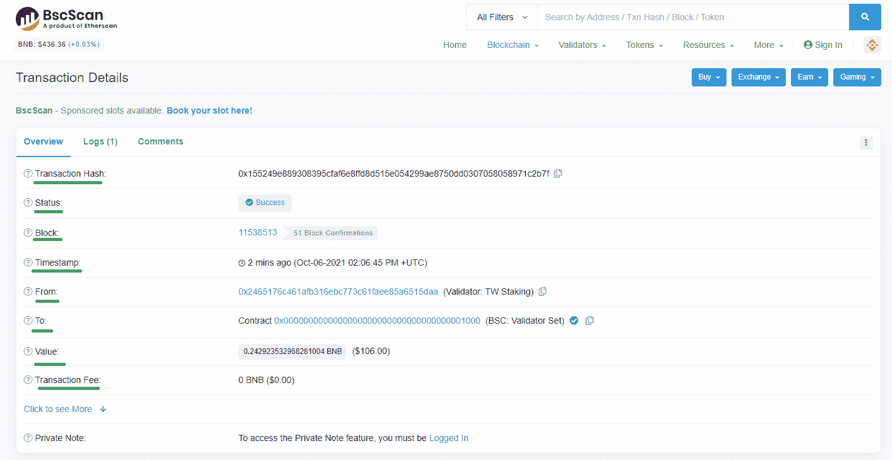

此外，搜索事务的最常见方式是使用事务哈希。除了使用首页的搜索框，还可以通过点击“*区块链”，然后“查看 Tnxs”来查找交易。*如果您想查看待处理交易，请点击“*区块链”，然后点击“查看待处理交易”*。在这些特定的页面中，你还可以在顶部找到搜索栏。

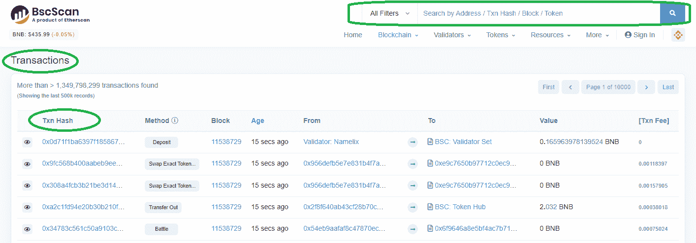

如果您没有交易散列，您可以使用两个相关地址中的任何一个。此外，您还可以使用块号；然而，用户很少使用这些信息。

一旦您能够使用 BscScan 来查找事务，您应该可以轻松地搜索其他详细信息。原理是一样的——使用主页上的搜索栏或使用顶部菜单导航到相关页面。

## **BSC can 和开发者**

如前所述，BscScan 有一组专门面向开发人员的页面。这些可以通过主菜单访问，你可以在点击“更多”后的“开发者”部分找到。这些页面包含以下选项:

*   **API 文档**–这是为了让开发人员能够通过 GET/POST 请求直接访问 BscScan 的 block explorer 数据和服务。
*   **验证合同**–该选项为与智能合同交互的用户提供了透明度。通过上传源代码，BscScan 可以将编译后的代码与区块链上的代码进行匹配。要完成验证过程，您需要输入智能合约的地址，并选择编译器和开源许可证类型。

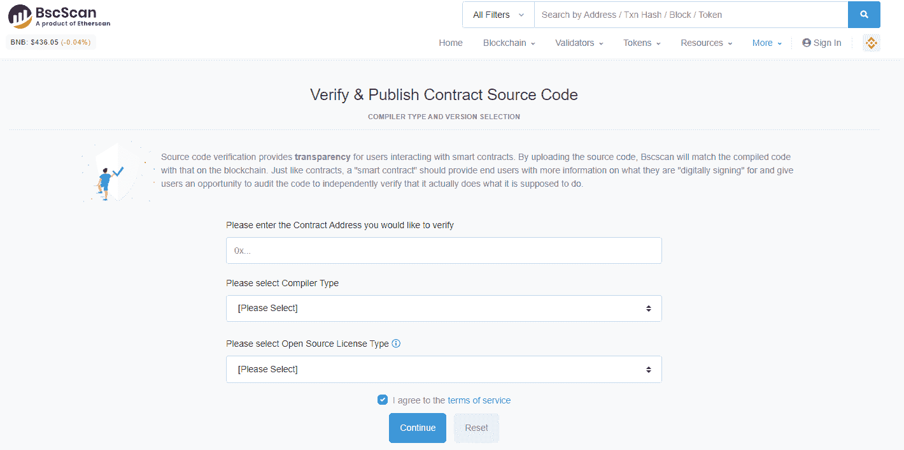

*   **字节到操作码**–这个选项为您提供了一个在线解码工具，试图将低级契约字节码解码为操作码。
*   **广播 TXN**–通过粘贴十六进制格式(字符 0-9，a-f)的签名原始交易，此页面使您能够通过币安的网络广播它。
*   **Vyper 在线编译器**–这个页面编译 Vyper 源代码并输出 ABI、字节码和运行时字节码。
*   **合同差异检查器**–该页面允许您通过输入地址来比较两个合同。

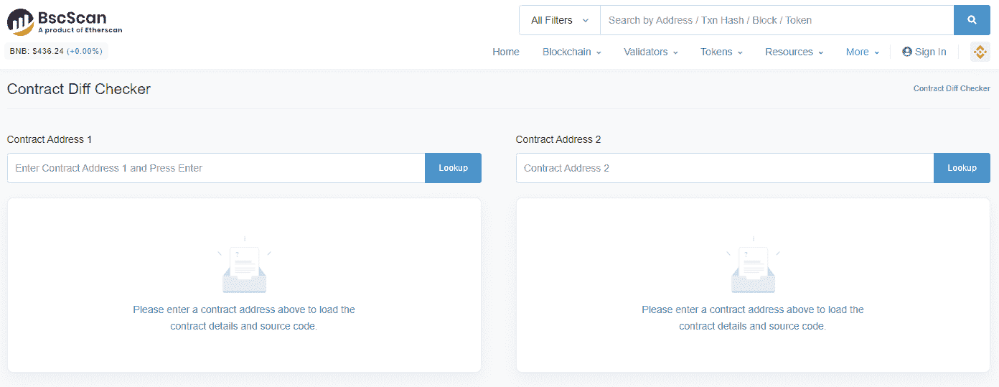

## **BscScan 和 NFTs**

如果您之前阅读了“BscScan 菜单”一节，您会知道 BscScan 还使您能够找到关于可替换和不可替换令牌的详细信息(如 ERC-721)。就可替换令牌而言，您可以获得基本上所有的相关数据。然而，由于 NFT 带有一个特定的文件，通常是 JPG 格式，BscScan 不能描述这些文件。虽然您可能无法使用 BscScan 查看 NFT 文件，但它确实为您提供了其他 NFT 详细信息，包括其 ID、NFT 项目、token 的交易历史及其与智能合约的交互。这里有一个 NFT 的例子，由 BscScan 展示:

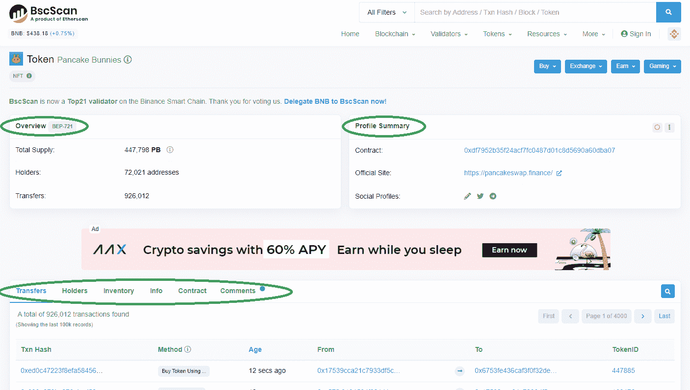

注:BscScan 将 NFTs 称为 ERC-721，这是以太坊上的 NFT 标准。然而，币安智能链上的 NFT 实际上遵循 BEP-721 标准。您将会在“概述”表旁边看到这一指示(见上图)。

## **Moralis 与理学学士编程**

如果你真的想在币安智能链上发展，了解 BscScan 对你的帮助会让你受益匪浅。然而，了解这一点对于成为一名 BSC 开发人员来说并不重要。如果您使用 Moralis，您可以在不熟悉 BscScan 的情况下开始在 BSC 上创建分散式应用程序。多亏了 [Moralis 的 SDK](https://moralis.io/exploring-moralis-sdk-the-ultimate-web3-sdk/) ，你只需使用 [Moralis 文档](https://docs.moralis.io/)中提供的简短代码片段，就可以访问所有重要的链上数据。你基本上只需要知道 JavaScript 和如何使用元掩码。一旦你完成了初始设置(注册/登录你的 Moralis 账户，创建你的服务器，启动 Moralis 的 SDK)，你就可以很容易地[构建 BSC dApps](https://moralis.io/how-to-build-bsc-dapps-easily/) 。最棒的是，Moralis 的 [NFT API](https://moralis.io/ultimate-nft-api-exploring-moralis-nft-api/) 让 [NFT 开发](https://moralis.io/how-to-create-your-own-nft-in-5-steps/)比以往任何时候都更容易！

此外，我们强烈建议您从一些有趣而简单的示例项目开始您的 Moralis 和 BSC 编程之旅。你可以在 [Moralis 的博客](https://moralis.io/blog/)或者 [Moralis 的 YouTube 频道](https://www.youtube.com/c/MoralisWeb3)上找到这些指南。

以下是我们最受欢迎的两个 BSC 编程示例项目:

*   "[如何在不到 20 分钟的时间内创建一个 BSC NFT](https://moralis.io/how-to-create-a-bsc-nft-in-less-than-20-minutes/)"。
*   [如何通过 5 个步骤](https://moralis.io/how-to-create-a-bsc-token-in-5-steps/)创建 BSC 令牌。

## **探索 BSC scan–完整指南:摘要**

除了以太坊，币安智能链是部署分散应用的“亚军”。此外，它还托管大量 BEP-20 令牌和 BEP-721 NFT。考虑到这一点，许多交易发生在这个以太坊分叉链的顶端就不足为奇了。因此，对可靠的 BSC 块浏览器有很高的需求，这就是 BscScan 的用武之地。

除了提供有关 BSC 交易、令牌和钱包的详细信息之外，它还为开发人员提供了一些有用的资源。因此，每个 BSC 用户，尤其是开发人员，可能都有兴趣了解他们对 BscScan 的理解。此外，使用本文中的信息，您应该能够满足获取 BSC 交易、令牌和钱包详细信息的所有基本需求。Moralis 允许您毫不费力地访问 [BEP20 测试网](https://moralis.io/bep20-testnet-create-a-bep20-token-in-15-mins/)。此外，Moralis 还为 BSC 提供了一个“ [Infura”选项，以及更多其他选项！](https://moralis.io/infura-bsc-alternatives-the-best-alternative-to-infura-for-bsc/)

通过[创建你的免费 Moralis 账户](https://admin.moralis.io/register)，你可以显著加快你的 Web3 开发进程。使用 Moralis，您可以通过复制和粘贴单行代码来多次覆盖所有后端编码。因此，原本耗时且繁琐的开发过程变得简单了，使您能够在创纪录的时间内创建和启动 dApps。因此，[与 Moralis](https://admin.moralis.io/register) 签约，今天就承担其中一个推荐的范例项目，看看 Moralis 如何让区块链的发展变得轻而易举！如果你喜欢这个指南，一定要去看看 Moralis 的博客，寻找更多高价值的内容，这样你就可以进一步拓展你的区块链知识。

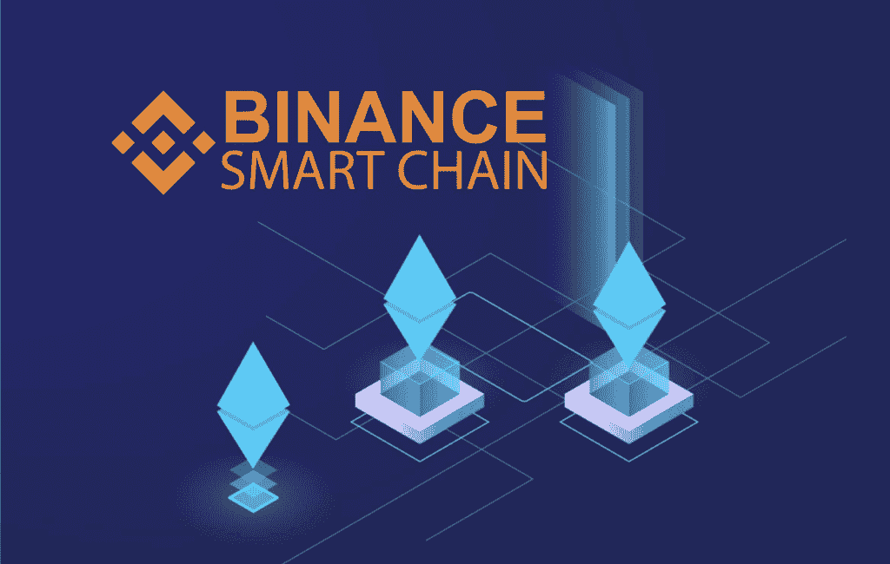**