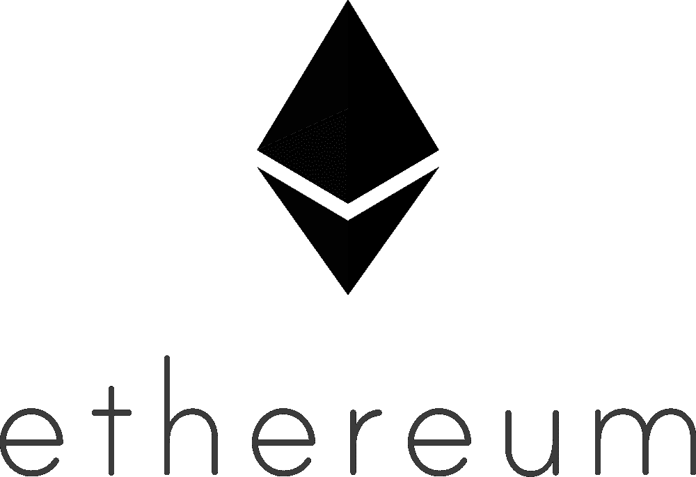
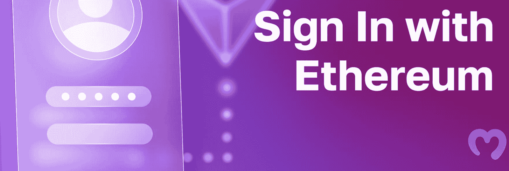
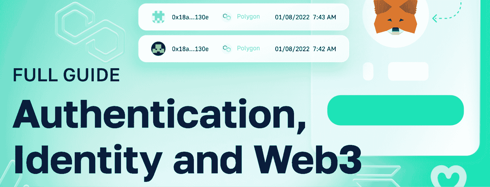
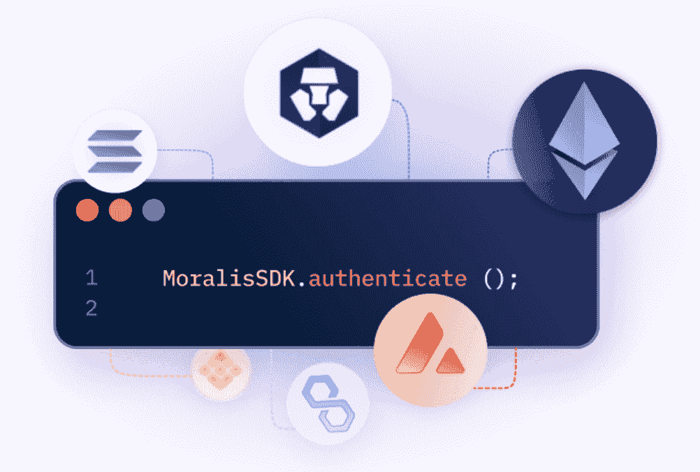

# 探索 EIP-4361-“以太坊签到”

> 原文：<https://moralis.io/exploring-eip-4361-sign-in-with-ethereum/>

**web 3 的一个关键特性是其基于区块链的身份层，让用户完全控制他们的** [**Web3 身份**](https://moralis.io/web3-identity-the-full-guide-to-authentication-identity-and-web3/) **，并允许他们使用** [**Web3 钱包**](https://moralis.io/what-is-a-web3-wallet-web3-wallets-explained/) **来验证自己。然而，在更传统的 Web2 生态系统中，用户不得不依赖集中式身份提供者。如果发生数据泄露，该系统会出现危及个人数据的单点故障问题。此外，它提供了更差的用户体验，因为个人需要跟踪不同网站和应用程序的多个登录凭证。这就是为什么引入了 EIP-4361 标准，允许用户在更传统的 Web2 平台上使用以太坊登录。作为一个跨越 Web2 和 Web3 之间鸿沟的激动人心的概念，这篇文章将更深入地探讨 EIP-4361，并解释该标准需要什么！**

除了解释 EIP-4361 的复杂性之外，我们还将仔细看看如何使用 [Moralis](https://moralis.io/) 来实现这个标准。Moralis 的认证解决方案实现了 EIP-4361。此外，API 允许您用几种方法来验证用户。因此，如果您想了解关于 EIP-4361 和 Web3 身份验证的更多信息，请跟随我们在本文中进一步探索这些概念。

此外，Web3 身份验证只是 Moralis 派上用场的一个例子。在使用该平台时，您还可以快速轻松地实现 [Web3 同步](https://moralis.io/syncs/)和 [Web3 webhooks](https://moralis.io/web3-webhooks-the-ultimate-guide-to-blockchain-webhooks/) 。因此，Moralis 允许您轻松创建复杂的 Web3 项目。更重要的是，Moralis 是可集成的任何后端！

所以，如果你想创建 dapps(分散式应用程序)并且[成为区块链开发者](https://moralis.io/how-to-become-a-blockchain-developer/)，现在就注册 Moralis 吧。您只需点击几下鼠标就可以设置您的帐户，而且完全免费！

### 什么是 EIP(以太坊改进提案)？

在探究 EIP-4361 的错综复杂之前，深入探究“生态位”的概念可能是有益的。因此，为了理解它们是什么，我们将从回答“什么是 EIP”这个问题开始这篇文章。

EIPs 是“以太坊改进提案”的缩写，顾名思义，是以太坊网络的改进提案。此外，EIP 本质上是以太坊社区成员提出的文档。这些文档包含网络和智能合同改进的建议。一旦社区成员提交提案，一个编辑团队就会修改提案并决定是否更新协议。

EIP 通常遵循与研究论文相似的结构。因此，他们对提议的变更和技术规范有抽象的动机或潜在的原因。此外，除了这些元素之外，EIP 应该包括关于向后兼容性、测试用例、安全考虑和基本原理的信息。

以太坊社区的所有成员都可以向 GitHub 编写、提议和提交 EIP。社区成员和以太坊爱好者随后讨论这些建议，并向作者提供建设性的反馈。一个编辑团队随后会修改这些 EIP，并最终决定网络是否应该采用这些更改。建议的一个例子可以是实施 ERC-20 令牌标准。然而，EIP 不仅仅局限于令牌标准，还可以涉及以太坊区块链的其他元素。

现在，随着对 EIP 及其形成有了更深刻的理解，我们将探讨一个特殊的提议，即 EIP-4361，也称为“以太坊签到”！

## 什么是 EIP-4361？

EIP-4361 规定了以太坊账户如何向离线服务认证。通过对用会话细节、安全机制和范围参数化的标准消息格式进行签名，进行身份验证。此外，EIP-4361 的目标是为集中式身份提供者提供自我保管的选择。这可以提高基于以太坊的认证机制在链外服务上的互操作性。此外，它将为 Web3 钱包供应商提供可预测和一致的消息格式，改善内容管理和用户体验。

简而言之，EIP-4361 是一种认证标准，使用户能够使用他们的以太坊帐户访问互联网上的各种资源和网站。因此，他们将不再需要依赖更传统的身份认证提供商，如脸书(现为 Meta)、谷歌等。

因此，它是基于以太坊的帐户创建会话的离线身份验证的标准。这为更统一的 Web2 标识层提供了机会，它可以通过创建更无缝的用户体验来使客户和企业受益。

如果你想了解更多细节和技术规格，我们建议你仔细看看[官方文档](https://eips.ethereum.org/EIPS/eip-4361)中的 EIP-4361 提案。这将带您更深入地了解以太坊登录是如何工作的，并通过一些例子来说明这个标准的作用。

尽管如此，在我们深入了解为什么 EIP-4361 是必不可少的之前，我们将简要介绍一下“SIWE”，因为您可能在探索以太坊登录时偶然发现了这个术语。

### 什么是 SIWE？

如果你一直在搜索 EIP-4361，你可能会遇到“SIWE”这个词。那么，SIWE 是什么？简而言之，SIWE 是“以太坊登录”的缩写，是一个开发者术语，指的是 EIP-4361。因此，如果你看到任何关于 SIWE 的参考，你可以简单地把它看作是 EIP-4361 以太坊功能登录的同义词。

现在我们知道了 EIP-4361 需要什么，它允许用户在基于 Web2 的项目上使用以太坊登录，我们可以仔细研究为什么这个标准是必要的！

## 为什么 EIP-4361 很重要？

从历史的角度来看，网络应用、网站和移动应用——不是建立在分散的区块链上——依赖于对用户数据进行集中控制的身份提供商。这里的一个例子是脸书(现在元)。脸书提供了一个登录到用户配置文件和访问他们的服务。作为回报，你同意提供他们可以用来跟踪你的数据，为你提供广告，从而影响你的消费决定。因此，这就是为什么像脸书和谷歌这样的企业可以“免费”提供服务。

然而，这种基于用户名和密码的集中式身份系统在某些情况下存在问题。集中化固有的单点故障等问题可能会成为问题。这使得组织和用户数据容易遭受数据泄露。此外，由于大多数组织都是独立的实体，因此没有统一的身份层，用户需要跟踪多个不同的登录，这对用户体验产生了负面影响。

然而，这是 EIP-4361 进入画面的地方，它允许你在以太坊登录离线构建的项目。因此，该标准消除了数据泄露、数字足迹等方面的不确定性。此外，EIP-4361 由区块链技术驱动，其核心设计是去中心化。因此，EIP-4361 为 Web2 和 Web3 提供了统一的识别系统，弥补了空间之间的差距。

由于 EIP-4361 允许用户使用以太坊登录传统的 Web2 应用程序，这有助于统一的身份识别系统，它可以积极地影响企业模型。它将消除不必要的入职摩擦，允许用户轻松访问企业服务。此外，由于它为 Web2 和 Web3 提供了更无缝的用户体验，因此它也为整个生态系统带来了更具吸引力的用户体验。这有助于提高客户满意度，并极大地帮助品牌成长！

## 通过 Moralis 认证 API 登录以太坊

Moralis 是在您的项目中实现 [Web3 身份验证](https://moralis.io/authentication/)功能的最简单、最容易的方法。此外，Moralis 的认证解决方案是 EIP-4361 或 SIWE 的实现。此外，如果您正在创建一个新的 Web3 应用程序，想要使用 Web3 auth 连接一个现有的 Web3 数据库，或者希望为您的企业的 auth 流利用身份验证聚合器，这些都没有关系；Moralis 可以在所有这些情况下提供帮助。

从传统的角度来看，您必须将用户重定向到第三方认证接口，发现钱包如何在各种链上工作，承担与认证解决方案相关的安全责任，等等。使用 Moralis 的 Auth API，您可以避免所有这些繁琐的任务，并更无缝地实现身份验证机制。

Moralis 提供了全面的 SDK，与 Auth0 等聚合器兼容，并为所有 Web3 auth 方法提供了统一的 API。此外，只要新的钱包、链和认证方法出现，Moralis 就会在持续的基础上实现对它们的支持。因此，Moralis 提供了面向未来的认证流程，从而使您的应用长期适用。

此外，Moralis 通过结合 Web2 开发的可访问性和 Web3 技术的力量，弥合了 Web2 和 Web3 之间的差距。因此，您可以为您的用户提供最快、最直接的注册以太坊的方式。此外，您可以只用一个代码片段来实现 Web3 身份验证。这使您可以减少复杂集成的时间，专注于创造更具吸引力的客户体验。因此，如果您决定使用 Moralis 的认证 API，您可以消除不必要的入门摩擦，并为现有的 Web2 应用程序或新的区块链项目提供面向未来的认证流程！

既然我们已经探讨了 Moralis 的认证 API，我们可以仔细看看 Moralis 的一些 EIP-4361 认证替代方案！

## Moralis 的 EIP-4361 认证替代方案

Moralis 的 Auth API 支持几个链，并提供了许多选项供 Web3 身份验证选择。然而，在探索不同的替代方案之前，我们将简要介绍使用 Moralis 的 Auth API 时的身份验证过程:

1.  您的客户请求进行登录质询。
2.  然后，您的服务器向 Moralis 的 Auth API 请求一个挑战，服务器将这个挑战传递给客户端。
3.  客户端对消息进行签名，然后将消息交给服务器进行验证。
4.  您的服务器利用 Moralis 来验证挑战。

此外，重要的是要知道，在 Web3 钱包认证之后，next-auth 库负责在用户的浏览器中创建会话 cookie。此会话包含一个加密的 JWT，其中包含地址、消息和过期时间。因此，一个关键的要点是 Moralis 的认证功能创建了一个实际的 JWT 会话。

此外，身份验证流程为您提供了对一切的完全控制。数据被直接发送到您的后端，允许您独立存储它。因此，所有的配置文件和身份都将返回给您，您将不必依赖第三方提供商提供任何有关 Web3 身份验证的信息。如果你想了解更多关于 API 的信息，请查看完整的 Moralis [Auth API](https://docs.moralis.io/reference/auth-api-overview) 参考。

尽管如此，这里还是列出了一些不同的身份验证备选方案:

*   MetaMask
*   WalletConnect
*   比特币基地钱包
*   RainbowKit
*   魔法认证

如果你想了解更多关于 Moralis 的 Web3 认证是如何工作的，我们推荐你阅读下面的文章。第一个示例说明了如何[添加比特币基地钱包登录功能](https://moralis.io/how-to-add-coinbase-wallet-login-functionality/)。此外，第二个演示了如何通过五个步骤将使用 RainbowKit 登录的[添加到您的项目中！](https://moralis.io/how-to-add-a-sign-in-with-rainbowkit-to-your-project-in-5-steps/)

https://www.youtube.com/watch?v=hhkWQPorBKQ&t=8s

## 探索 EIP-4361–总结

本文探讨了 EIP-4361 的复杂性以及该标准所包含的内容。EIP-4361 是以太坊的改进提案，它为离线服务的 Web3 认证设置了标准。这为开发人员提供了一个为 Web2 和 Web3 网站和应用程序创建统一身份层的机会。因此，它有可能消除入职摩擦，并提供更具吸引力的用户体验。这是对用户和企业都有利的两个因素。

此外，除了探索 EIP-4361，我们还仔细研究了 Moralis 的 Auth API。当与 Moralis 一起工作时，Web3 身份验证变得更容易访问，因为该平台允许您仅使用单个代码片段为所有未来项目实施经得起未来考验的身份验证流程。此外，Moralis 的认证替代方案是 EIP-4361 标准的实现！

如果你对 [Web3 开发](https://moralis.io/how-to-build-decentralized-apps-dapps-quickly-and-easily/)空间有进一步的兴趣，我们强烈推荐在 Moralis 的 [Web3 博客](https://moralis.io/blog/)查看其他内容。例如，你可以阅读终极 [NodeJS EVM API](https://moralis.io/exploring-the-ultimate-nodejs-evm-api/) 、Moralis[NodeJS SKD for web 3](https://moralis.io/nodejs-sdk-for-web3-exploring-moralis-nodejs-sdk/)或[区块链 syncs](https://moralis.io/blockchain-syncs-exploring-on-chain-syncing/) ！

此外，如果你想更精通区块链的发展，可以考虑去看看 Moralis 学院。该学院为初学者和更有经验的开发人员提供了一系列令人惊叹的[区块链课程](https://academy.moralis.io/all-courses)。例如，如果你是这个领域的新手，请确保通过“[区块链&比特币 101](https://academy.moralis.io/courses/blockchain-bitcoin-101) ”课程学习基础知识。因此，你离获得区块链 Moralis 学院认证只有一步之遥了！

尽管如此，如果你是一个 Web3 开发者，[在 Moralis](https://admin.moralis.io/register) 注册，让你的开发过程更容易理解。创建一个帐户是免费的，只需要几秒钟！