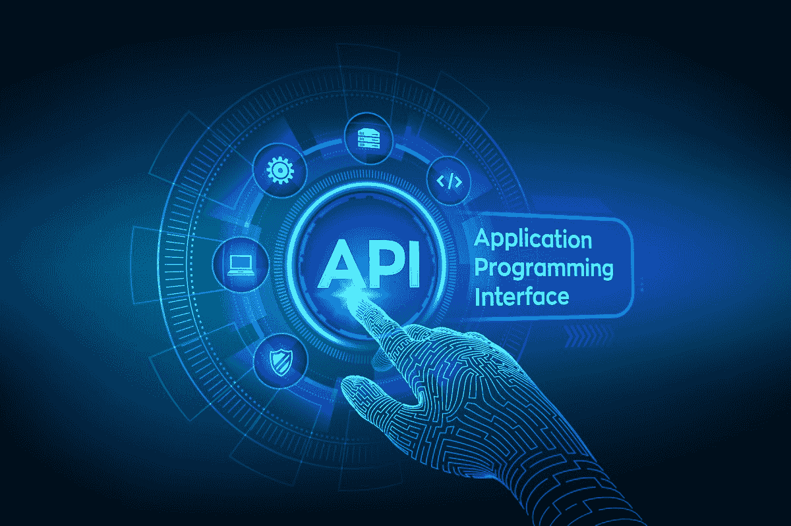
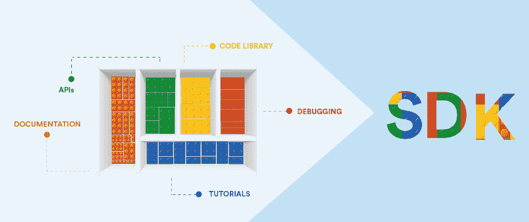
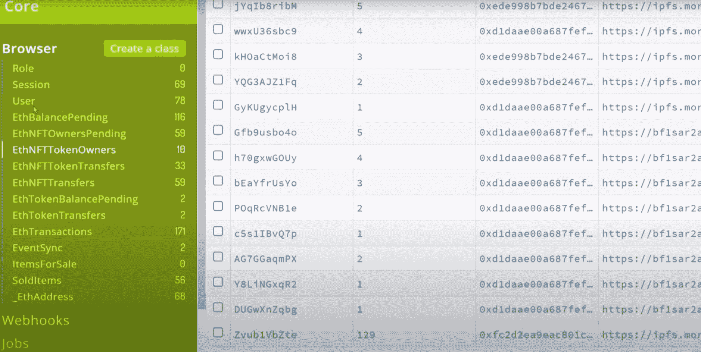
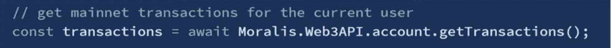
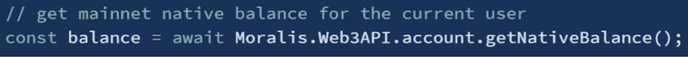
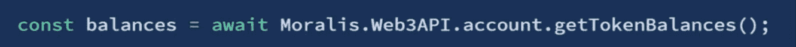
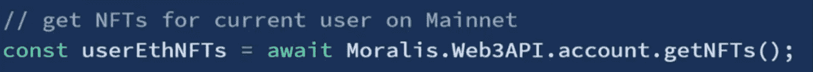
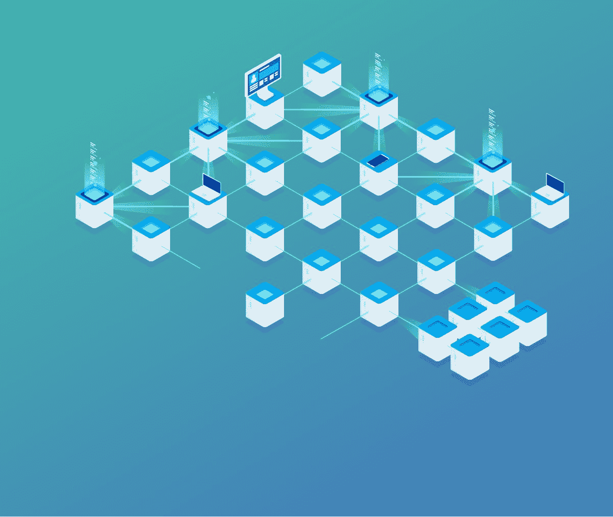

# 探索 Moralis 的 SDK——终极 Web3 SDK

> 原文：<https://moralis.io/exploring-moralis-sdk-the-ultimate-web3-sdk/>

**无论你是一个有经验的程序员还是刚刚入门，你都可能知道最热门的趋势之一是** [**Web3**](https://moralis.io/the-ultimate-guide-to-web3-what-is-web3/) **开发。因此，涉足 Web3 开发并成为一名区块链开发者无疑是一条正确的道路。此外，尽管区块链技术已经颠覆了许多行业，但它才刚刚起步。从金融、供应链、游戏、数字所有权等等，这项技术正在将分散化带给用户，消除了这个过程中的中间人。因此，开发人员越来越希望参与下一次范式转变。给自己配备合适的工具既可以加快你的学习曲线，也可以加快你构建 dApps 的速度。请继续阅读，了解关于**[**Moralis**](https://moralis.io/)**SDK 的所有信息，以及为什么它是 Web3 开发中最好的工具！**

只需几行代码，您就可以利用 Moralis SDK，并利用其预先构建的后端基础设施和无数的功能。Moralis 使得繁琐耗时的 Web3 后端开发变得简单明了。此外，它让事情变得如此简单，以至于你只需要用你的 [JavaScript](https://moralis.io/javascript-explained-what-is-javascript/) 技能就可以开始创建优秀的 [dApps](https://moralis.io/decentralized-applications-explained-what-are-dapps/) 。此外，这与知道如何使用 [MetaMask](https://moralis.io/metamask-explained-what-is-metamask/) 相结合，可以让您快速部署令人印象深刻的项目。此外，你可能知道对 Web3 开发者的需求是如何超过供给的。有了 Moralis SDK，你可以立刻成为一名 Web3 开发者。除了高质量的最终产品和快速的可送达性，还有一点使 Moralis 的 SDK 成为首选——它是免费使用的。因此，[今天就创建您的帐户](https://admin.moralis.io/register)，开始您的区块链发展！

## 什么是 SDK？

在探索 Moralis SDK 以及为什么与其他 Web3 SDKs 相比它是最理想的选择之前，我们需要了解一些基础知识。让我们从回答这个问题开始，“什么是 SDK？”。如果你还不知道，SDK 代表“软件开发工具包”。你也会经常听到“devkit”这个词，意思是一样的。SDK 是指特定软件开发所需的一组工具或项目(套件)。这包括套件、组装说明、组装工具等。

从本质上讲，一个合适的 SDK 为开发人员提供了一套工具、库、代码示例、流程、相关文档和特定指南。所有这些都使开发人员能够在特定的平台上创建软件应用程序(在我们的例子中是 dApps)。

此外，SDK 基本上是用户与之交互的每个程序的原始来源。这包括网络浏览器到视频游戏，以及或多或少介于两者之间的一切。

### 什么是 API？

我们知道你渴望了解更多关于 Moralis SDK 的细节；然而，根据我们的经验，当涉及到 API 和 SDK 时，初学者会有很多困惑。许多人倾向于混淆这两个概念。因此，让我们确保我们都知道 API 和 SDK 之间的区别。既然我们已经介绍了什么是 SDK，那么是时候关注什么是 API 了。

API 代表“应用程序编程接口”。API 是一个接口，它使软件能够与其他软件进行交互。它使不同的指令集能够被翻译或转换，以便相互理解。此外，API 允许在稳定的环境中保持一致性(或一致的编码)。这样，所有可复制的功能都可以一致地交付，并且对每个请求都有可预测性。

例如，一个简单的软件，如浏览器，使用各种 API 集。这样，它将用户的命令转换成函数，从服务器请求数据，将数据转换成适合用户的格式，验证用户请求的性能，等等。Web APIs 有一个稍微不同的功能——它们允许不同系统之间的交互，通常用于特定的用例。web API 本质上是一组指令(就像 PC API 一样)；然而，它是基于 web 领域的。例如，你可能熟悉 Moralis [NFT API](https://moralis.io/announcing-the-moralis-nft-api/) ，它允许你[在几分钟内创建一个 NFT 游戏](https://moralis.io/nft-game-development-how-to-build-an-nft-game-app-in-minutes/)。

### API 与 SDK

简单来说，SDK 优于 API。有趣的是，SDK 通常包含 API。一个很好的类比是看正方形和长方形。你肯定知道“长方形”的概念可以包括长方形和正方形，而“正方形”只包括正方形。在这种情况下，SDK 是矩形，API 是正方形。因此，每次使用 SDK 来创建一个必须与其他应用程序通信的应用程序时，它肯定会包含一个用于该目的的 API。如果您不是几何迷，您可以将 SDK 视为房子及其所有内容，而 API 则是允许进出房子的电话线。

# Moralis 的 SDK–最终的 Web3 SDK

基于区块链的技术很可能代表下一次数字范式转变，并正在进入越来越多的公司。事实上，这种颠覆性的改变世界的技术正以令人难以置信的速度接管世界。因此，每个 Web3 开发者都非常抢手。

不幸的是，大多数 dApp 开发者试图重新发明轮子，走了一条复杂而艰难的道路。他们通常错误地从连接到 RPC 节点开始。可悲的是，他们不知道 RPC 节点是原始的、低级的技术，有着可怕的数据库，既不能过滤也不能聚合。此外，围绕 RPC 节点构建基础设施需要大量的代码。这使得事情变得非常复杂并且非常耗时。更不用说结果(或最终产品)通常也不是很好。

幸好你来对了地方。通过了解 Moralis 的 SDK，领先的 Web3 SDK，您将能够“展翅飞翔”,这是由 Moralis 背后的开发人员提供的。此外，Moralis SDK 通过其即插即用功能解决了繁琐的后端编码。Moralis 的目标是使 Web3 开发尽可能简单，比如用一行代码提供功能。构建伟大的 dApps 的技术已经在这里了——缺少的是能够利用这种技术的工具。这就是 Moralis 的用武之地。

## Moralis SDK–每个 dApp 都需要的

在开发 dapp 时，大多数 dapp 都需要某些功能。其中包括以下内容:

*   登录用户。
*   获取余额(硬币，[NFT](https://moralis.io/non-fungible-tokens-explained-what-are-nfts/)，代币)。
*   提取交易记录。
*   获取智能合同事件。
*   发送实时警报。
*   建立某种索引来改变和建立关于链上事件的数据库。
*   发送交易。
*   与智能合约交互。

当然，还有许多其他可用的功能。然而，列出的那些恰当地总结了在 dApps 中使用的大约 90%或更多。为什么 90%？大多数走重新发明轮子传统道路的 dApp 开发人员(如前所述)花费超过 90%的时间来实现上述功能。

那么，你想如何削减绝大部分开发时间呢？嗯，通过使用正确的工具，你可以。因此，你可以更快地完成你的 Web3 应用程序，并且提供更好的用户体验，因为你可以将你所有的注意力和资源集中在创建一个令人惊叹的前端上。这种节省资源的方面正是 Moralis 的 SDK 的真正威力所在。因此，你明白为什么它是 Web3 SDKs 中的佼佼者了。如果您需要更多关于 Moralis SDK 的信息，以及为什么它是最好的 Web3 SDK，请务必观看以下视频:

https://www.youtube.com/embed/txHnWDRB728

## 开始使用 Moralis Web3 SDK

如果你熟悉 [Firebase](https://firebase.google.com/) ，你可以认为 Moralis 的 SDK 是“加密的 Firebase”。开始使用这个优秀的 Web3 SDK 非常简单。当然，你必须首先在 [moralis.io](http://moralis.io/) 创建你的免费账户，才能使用它的全部功能。然后你只需要启动一个 Moralis 服务器，并在你的应用中初始化 Moralis SDK。这样，您就已经内置了上一节中提到的所有特性。

例如，要登录用户，您需要这一行代码:

除了这种简单性，您还可以访问 Moralis 的服务器数据库，这使您可以访问关于您的应用程序用户的有用信息。这包括他们的代币余额、交易、NFT 余额等等。因此，使用一行代码就能让你深入了解关于用户的所有信息。为了更好地理解这一点，请查看下面的 Moralis 仪表盘截图。另一个值得注意的功能是 Moralis 服务器数据库实时自动更新。这意味着用户对其余额所做的任何更改都会立即反映出来。这是不是很神奇？

### Moralis SDK 代码示例

下面是一些常见的 Moralis SDK 代码的附加示例，这些代码使您能够从数据库中读取有关用户的信息:

*   **获取交易**:

*   **获得自动/BNB 平衡**:

*   **查看 ERC-20 余额:**

*   **查找 NFT 余额:**

这些只是一些常见的例子。实际上，你可以做任何你想做的查询(比如过滤、排序等等)。).到目前为止，我们只展示了五行代码。组合这些代码行基本上就是创建一个钱包所需的全部内容。否则需要一个月的编码时间，我们只用了五行代码就在几分钟内完成了。这就是终极 Web3 SDK 的力量，你可以免费使用的力量。

要查看 Moralis 的优势及其“一行代码”便利性的更多示例，请务必观看上面的视频。在该视频中，您将了解有关索引智能合约事件和发送资产的更多信息。此外，如果你准备好开始建设，需要额外的指导或灵感，跳到 [Moralis 的 YouTube 频道](https://www.youtube.com/channel/UCgWS9Q3P5AxCWyQLT2kQhBw)。在那里你可以找到大量有价值的内容，我们会定期添加新的视频。

## 带有精彩文档的 Web3 SDK

如果你有任何编程经验，你肯定处理过某种文档文件。此外，您会知道文档文件很容易淹没大多数。嗯， [Moralis](https://docs.moralis.io/) 拥有你所见过的最整洁、最干净、组织良好的文档之一。这样，使用 Moralis SDK 就更容易了。

通过使用 [Moralis 文档](https://docs.moralis.io/)，您将能够学习如何快速使用这个强大的 Web3 SDK 来发挥其最大潜力，并轻松访问所有代码行，以便在您的项目中使用这些代码。

如果您仍然不确定 Moralis 是否是您不能错过的工具，请务必查看本指南，了解如何使用 Moralis SDK 的强大功能在三分钟内构建一个简单的 dApp。

## 不断更新的 Web3 SDK

虽然您将能够使用 Moralis 的 Web3 SDK 的力量，并完全专注于创建一个令人印象深刻的前端，但将有一个不断增长的专家团队来确保后端方面完美地工作。这包括定期更新，旨在提供最新的解决方案、新的链集成、进一步简化的使用等等。请务必在此查看最新 [big Moralis SDK 更新的详细信息](https://www.youtube.com/watch?v=lX9A6yQXZ_8)。它展示了 Moralis 的 Web3 SDK 提供的强大功能的几个很好的例子。

## 具有跨链可操作性的 Web3 SDK

Moralis SDK 的另一个惊人特性是它的跨链可操作性。这意味着 Moralis 默认同步所有链。例如，如果你用“老式”的方式开发 dApp，你基本上需要从头开始，以防将来你想换成另一个区块链。然而，当使用 Moralis 的壮观的 Web3 SDK 时，所有添加的链都包括在内。这样，从一个链到另一个链的过渡是无缝的，这也确保了您的 dApps 是经得起未来考验的，无需您进行任何更改。

Moralis 已经与以下网络合作:ETH、BSC、Polygon、Arbitrum 和 Avalanche。然而，其他网络也即将推出。这表明 Moralis 真正是在考虑原生跨链兼容性的情况下构建的，这就是为什么 Moralis 上的[以太坊开发](https://moralis.io/ethereum-development-for-beginners/)和 [BSC 开发](https://moralis.io/bsc-programming-guide-intro-to-binance-smart-chain-development-in-10-minutes/https://moralis.io/bsc-programming-guide-intro-to-binance-smart-chain-development-in-10-minutes/)如此无缝。

## 
终极 web 3 SDK–摘要

如果这是您第一次了解 Moralis 及其强大的 SDK，您一定会非常兴奋并渴望开始使用它。您现在知道，通过使用 Moralis SDK，您可以减少大约 90%的后端工作。因此，您可以通过简单地复制和粘贴单行代码来涵盖大多数 dApps 需要的所有方面。此外，您还知道 Moralis 提供了优秀的文档、定期更新、插件和跨链可操作性。好像这还不够令人印象深刻，你还知道你可以免费创建你的 Moralis 账户。

我们真的为你和你即将取得的成功感到高兴。不管是偶然还是由于你的研究技能，你看到这篇文章都是有原因的——推进你的 Web3 开发。通过以上各节，您已经获得了访问一个强大平台所需的一切，该平台为您提供了一个 Web3 SDK，可帮助您快速加入区块链行业。此外，请务必通过加入 Moralis 的 Discord 频道，利用我们社区的力量和难以置信的支持。我们期待看到您即将推出的 Web3 应用程序！

