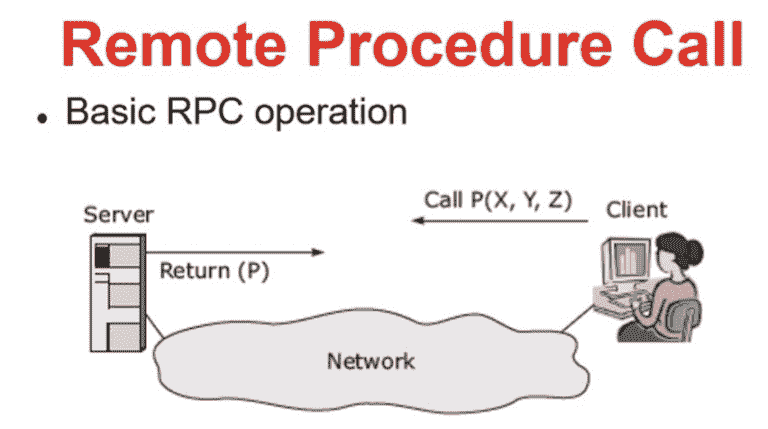
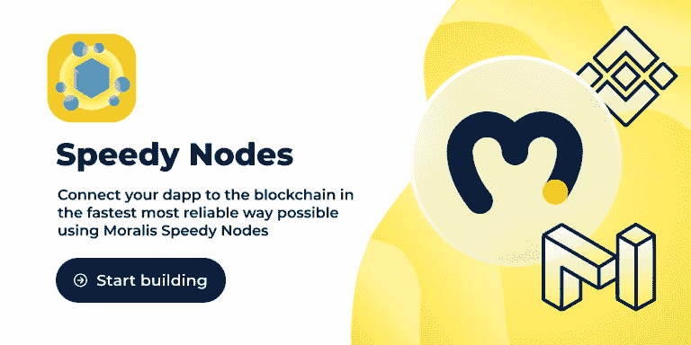
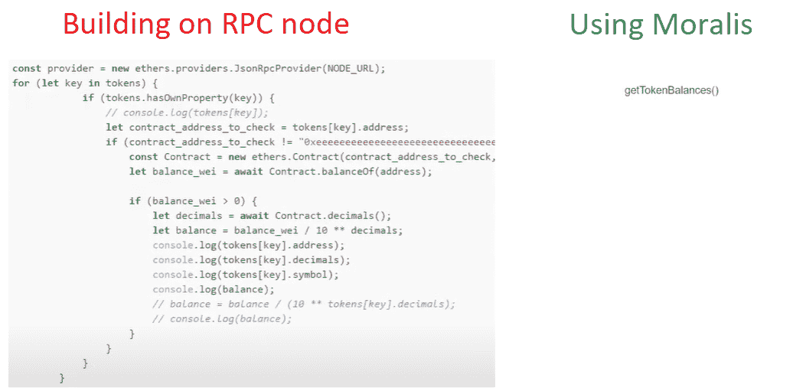
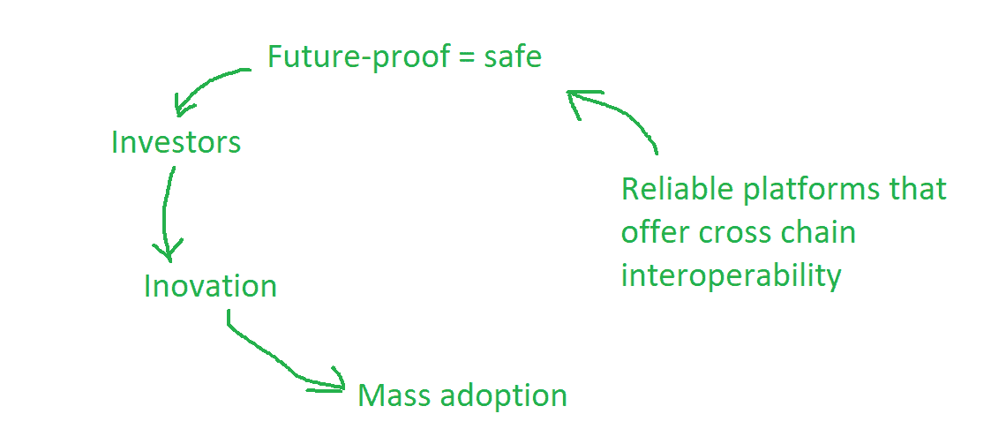
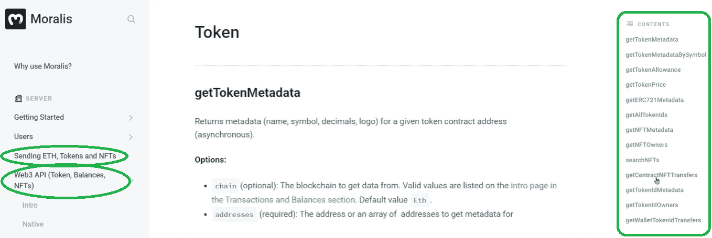

# 探索 RPC 节点的局限性及其解决方案

> 原文：<https://moralis.io/exploring-the-limitations-of-rpc-nodes-and-the-solution-to-them/>

无论您是经验丰富的开发人员还是新的区块链开发人员，您都很可能听说过 RPC 节点。再者，那些直接在 RPC 节点之上开发 [**dApps**](https://moralis.io/decentralized-applications-explained-what-are-dapps/) **(去中心化应用)的人会知道 RPC 节点的诸多局限性。然而，RPC 节点仍然在 Web3 开发人员中广泛使用，尽管由于其固有的限制，它们越来越不受欢迎。因此，程序员需要比 RPC 节点更快、更有效、更易于管理的替代品。在本文中，我们将探索 RPC 节点的局限性，以及如何解决这些问题——即，通过使用** [**Moralis 规范**](https://moralis.io/) **。因此，让我们熟悉一下这个解决方案，看看它能给程序员带来什么好处。然而，在我们这样做之前，让我们先来探讨一下 RPC 节点的概念，以及为什么**[**web 3**](https://moralis.io/the-ultimate-guide-to-web3-what-is-web3/)**开发人员不应该使用它们。**

通过这篇文章，您将了解到 Moralis——最终的 Web3 操作系统和开发平台。具体来说，Moralis 将帮助您克服 RPC 节点的所有限制，让您在 dApp 开发中获得优势。如果你渴望开始建设，并且已经满足了所有的先决条件，那么[现在就可以免费注册你的 Moralis 账户。但是，我们强烈建议阅读以下部分，以便更深入地了解 RPC 节点的局限性。此外，通过研究这些限制，您还会意识到为什么开发人员需要的不仅仅是 RPC 节点。Moralis 通过其广泛的工具包提供了这一解决方案，包括 Moralis](https://admin.moralis.io/register) [NFT API](https://moralis.io/ultimate-nft-api-exploring-moralis-nft-api/) 和全面的 [Moralis SDK](https://moralis.io/exploring-moralis-sdk-the-ultimate-web3-sdk/) 。

## **什么是 RPC 节点？**

为了向您提供什么是 RPC 节点的最佳解释，我们需要仔细研究术语“RPC 节点”的两个部分。从 RPC 开始，你可能已经知道它代表“远程过程调用”。此外，RPC 是进程间通信(IPC)的一种形式。此外，在分布式计算中，“RPC”是指一个软件在不同位置执行子例程的过程，该位置通常也称为“地址空间”。因为一个地址调用过程，而另一个地址响应，所以这些地址使用“客户机”和“服务器”术语。

让我们转到术语“RPC 节点”的第二部分。那么，什么是节点呢？节点本质上可以是任何设备，如计算机、笔记本电脑或服务器。它们是端点或网关，为用户和应用程序提供与网络交互的方式。此外，不同类型的节点(完整节点、[完整归档节点](https://moralis.io/what-are-full-archive-nodes/)等)。)可以实现不同的功能，这两个主要功能提供对网络的访问和保持网络安全。

综上所述，我们可以看到 RPC 节点是任何区块链基础设施的重要组件，因为它们存储了特定区块链所拥有的信息。此外，所有节点相互连接，并不断共享数据，以便链中的所有节点保持最新。这样，网络的完整性得到了保证。说到区块链的世界，我们需要一个节点来使用 RPC。它们允许我们发送交易和读取区块链数据。因此，开发人员需要运行他们自己的节点或者使用可靠的 RPC [节点提供者](https://moralis.io/infura-alternatives-and-blockchain-node-providers/)。例如， [Moralis Speedy Nodes](https://moralis.io/speedy-nodes/) 提供支持区块链少校的最快节点。

## **RPC 节点的各种限制**

许多开发人员在从事加密项目时最常犯的错误是，他们专注于围绕 RPC 节点进行构建。这导致了大量开销，从设置和运行 RPC 节点到花费大量时间围绕它开发和构建基础设施。

虽然 RPC 节点仍然是以太坊、币安、多边形和其他区块链的核心部分，但 RPC 节点也是低级科技(接近基础级)。它们几乎处于硬件的水平，这意味着它们只提供基本的选项。因此，您可以将 RPC 节点视为加密的 CPUs 它们是区块链技术最简单的构建模块。

此外，就像第一台计算机一样，当每个人都直接在 CPU 上编程时，许多开发人员现在陷入了试图直接与 RPC 节点通信的陷阱。于是，基本上直接说到硬件层面。当区块链第一次出现时，这是唯一可行的方法，但现在情况不同了。与一些最先进的 Web3 开发工具相比，直接使用 RPC 节点就像用凿子在石头上写字，而不是在电脑上打字。

### **RPC 节点效率低下且耗时**

知道直接在 RPC 节点上编程并不是最佳方式，让我们来看看 RPC 节点的一些主要限制。使用这种过时的方法会使您的代码效率极低。首先，RPC 节点需要大量的请求(它们是请求密集型的)，这需要大量的工作和来回的通信。此外，对所有这些进行编程也会消耗大量时间，而这是开发人员拥有的最有价值的资产。

想象一下，你想要建立一个网站，并且必须与 CPU 直接通信。你可能同意这将是非常令人沮丧的。然而，当谈到加密时，无数开发人员仍然走那条过时的路线。这就是为什么他们花了这么长时间来提供 dApps。

### **示例–RPC 节点的限制**

让我们看一个将 RPC 节点与 Moralis 进行比较的例子，以获得用户关于其余额的信息。让我们从使用 RPC 节点开始。如果用户有 100 个令牌，我们需要发送 100 个请求来获得每个令牌的余额。然而，当我们使用来自 Moralis 的适当的 Web3 SDK 时，我们通过一个请求来解决这个问题——我们只需要请求用户的余额，它就会自动覆盖所有类型的代币和硬币。

这是一个很好的例子，展示了与使用 Moralis 相比，使用 RPC 节点的一个局限性。一方面，这减少了编码时间。此外，它还大大缩短了加载时间，从几秒钟到大约一百毫秒。此外，您必须记住，检查天平是一项基本任务。想象一下当您试图使用 RPC 节点来完成更高级和复杂的任务时，请求的数量。此外，构建自己的索引意味着你将花费数周，甚至数月来开发 dApp 的后端部分。另一方面，您可以使用 Moralis 的 SDK，通过一个请求轻松快速地完成每项任务。

与围绕 RPC 节点构建相比，Moralis 引入了下一个范例。因此，它使得 dApps 的创建过程快速，并且主要是在前端。想象一下，如果作为一名建筑师设计一栋漂亮的房子，还得担心如何生产建筑材料。那不行。建筑师知道材料和工具是用来支持他们的想法的。类似地，Moralis 为您提供所有的材料和工具，直到后端部分。

### **围绕 RPC 节点构建不是面向未来的**

你可能想知道 Moralis 是如何让这样一个巨大的飞跃成为可能的。嗯，你必须考虑这样一个事实，所有的 Web3 应用程序都需要覆盖加密后端的很大一部分。因此，我们可以使用模板化的单行代码来覆盖重复编码。这些代码片段可以在 [Moralis 的文档](https://docs.moralis.io/)中找到。从本质上讲，Moralis 使您能够避免为每个 dApp 重新发明轮子。此外，同样的原则适用于所有区块链人。

因此，通过使用完全包含跨链互操作性的工具，您可以轻松地创建跨链 dApp。更好的是，Moralis 将跨链互操作性放在了首要位置。此外，Moralis 的开发团队一直在寻找新的知名连锁店。例如，[对 Avalanche](https://moralis.io/moralis-announces-full-support-for-avalanche/) 的全面支持是 Moralis 最新增加的支持网络之一。考虑到这一点，你可以通过 Moralis 让你的 dApps 适应未来。

用 Moralis 构建 dApps 意味着构建项目更容易，也意味着你能够更快地进入市场。

### **RPC 节点周围的建筑消耗资源**

除了围绕 RPC 节点构建的资源之外，以这种方式构建的 dApps 也很难维护。因此，它会耗尽您的资源来维护和更新它们。为什么不让你的开发团队的事情变得更简单，更专注于交付更好的用户体验呢？

综上所述，作为一名[区块链开发者](https://moralis.io/how-to-become-a-blockchain-developer/)，除非万不得已，否则不应该直接与 RPC 节点对话。例如，当您需要上传智能合同时，您必须直接与 RPC 节点通信。然而，对于大多数 Web3 开发过程(尤其是从区块链获取数据)，当您使用 Moralis 时，这是不必要的。它基本上负责整个区块链相关的后端开发。因此，任何精通 [JavaScript](https://moralis.io/javascript-explained-what-is-javascript/) 并能够使用[元掩码](https://moralis.io/metamask-explained-what-is-metamask/)的人都可以在短时间内创建优秀的 dApps。所以，现在你知道[为什么你不应该使用 RPC 节点](https://moralis.io/ethereum-rpc-nodes-what-they-are-and-why-you-shouldnt-use-them/)。

## **Moralis——克服节点限制的终极解决方案**

权威的 Web3 操作系统 Moralis 来自开发者，也为开发者服务。它可以免费使用，是快速、轻松地交付面向未来的分散式应用程序的最佳方式。如果你想使用 Moralis 的平台，[通过](https://docs.moralis.io/moralis-server/getting-started)[创建账户](https://admin.moralis.io/register)开始，让 Moralis 从头到尾指导你的 dApp 开发。

### **Moralis NFT API vs RPC 节点**

由于 NFT 现在非常流行，能够交付高质量的 NFT 应用程序确实是一项有用的技能。然而，通过连接到一个 RPC 节点并从头开始构建整个基础设施来实现这一点，您需要花费数月时间。另一方面，使用 Moralis 的 NFT API，您可以在几分钟内构建围绕 NFT 的简单 dApps。此外，看看我们的一些指南和文章，我们已经教我们的观众如何在几分钟内[构建一个 NFT 游戏](https://moralis.io/nft-game-development-how-to-build-an-nft-game-app-in-minutes/)，如何在五个步骤中[创建自己的 NFT](https://moralis.io/how-to-create-your-own-nft-in-5-steps/) ，如何创建一个 [NFT 铸造](https://moralis.io/best-api-to-mint-nfts-full-guide/)平台，以及更多关于不同区块链的内容。如果您坚持使用节点，请记住 Moralis 是 BSC 的首选"[in fura](https://moralis.io/infura-bsc-alternatives-the-best-alternative-to-infura-for-bsc/)"和 Avalanche 的首选"[in fura](https://moralis.io/infura-for-avalanche-exploring-infura-avalanche-alternatives/)"。

使用 Moralis 的 NFT API，您可以使用一行代码[获得所有用户的 NFT](https://moralis.io/how-to-get-nft-and-erc-20-token-balances-in-3-steps/)，包括元数据。您不必担心用户拥有哪个 NFT，因为整个交易历史检查都在后端完成。如果您直接与 RPC 节点对话来完成同样的事情，您将不得不发出大量的请求，如果不是数百个的话。

## **RPC 节点正在死亡**

根据有经验的开发人员的说法，RPC 节点迟早会“死亡”。为什么？嗯，由于这里介绍的 RPC 节点的所有限制，没有人会使用它们。

例如，让我们看看微软视窗系统。开发人员不在计算机硬件之上构建；相反，他们专注于在 Windows 之上构建，并让后者负责与硬件的通信。这样，这是一个双赢的关系。Windows 专注于他们的部分，而各个软件公司有更多的时间和资源专注于用户体验。此外，随着新硬件的出现，软件开发人员不必担心所有这些。只要新硬件与 Windows 兼容，他们知道用户将能够使用他们的产品。

此外，这一切都归结于资源。通过投入他们的时间和金钱来实现软件与硬件通信的最简单和最流畅的方式，他们可以节省大量资源。此外，最终用户也可以通过获得更实惠的软件和更好的用户体验而受益，因为这是开发者关注的焦点。

同样的逻辑也适用于区块链。随着它的发展，没有人会围绕 RPC 节点进行构建。这没有任何意义。此外，由于 Moralis，围绕 RPC 节点构建已经没有意义了。

## **探索 RPC 节点的局限性和首要解决方案——摘要**

虽然大多数开发人员仍然专注于直接在节点上构建的过时方法，但有更快的途径可用。轻松克服 RPC 节点局限性的最好方法之一是使用最终的 Web3 开发平台——Moralis。它的 SDK 和 Web3 APIs 提供单行代码来覆盖所有与区块链相关的后端编码。

通过上面的章节，您已经了解了 RPC 节点的主要限制，包括:

*   RPC 节点是低级技术。
*   直接在 RPC 节点上编程是低效的。
*   RPC 节点编程需要大量请求。
*   直接在 RPC 节点上编程非常耗时。
*   直接在 RPC 节点上运行的 Web3 应用程序很慢。

如果你已经知道 JavaScript 和如何使用 MetaMask，你已经准备好了，现在就可以在 Moralis 的帮助下开始开发非凡的 dApps。此外，如果你需要一些额外的灵感或各种加密术语和概念的解释，请确保查看 [Moralis 的 YouTube 频道](https://www.youtube.com/c/MoralisWeb3)和 [Moralis 的博客](https://moralis.io/blog/)。我们每天都在生产有价值的内容。