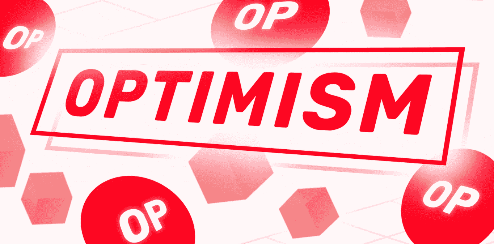
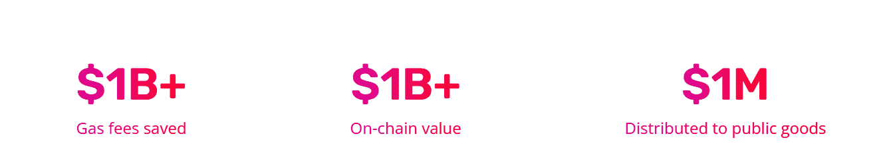
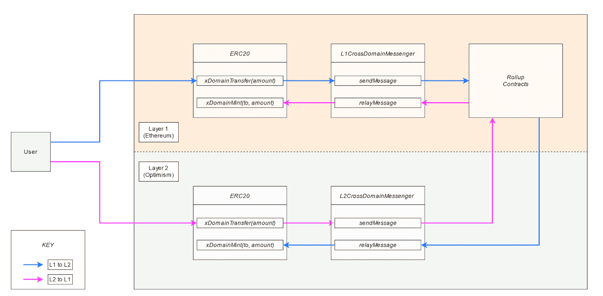
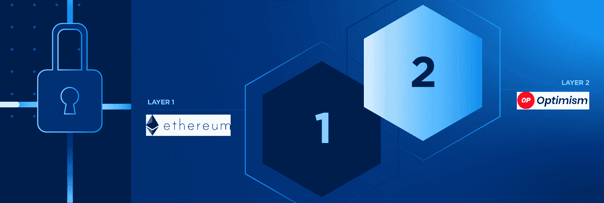
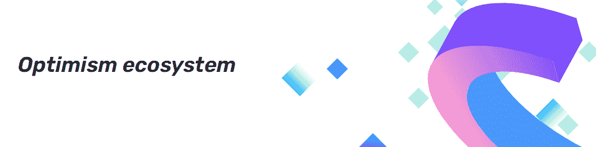
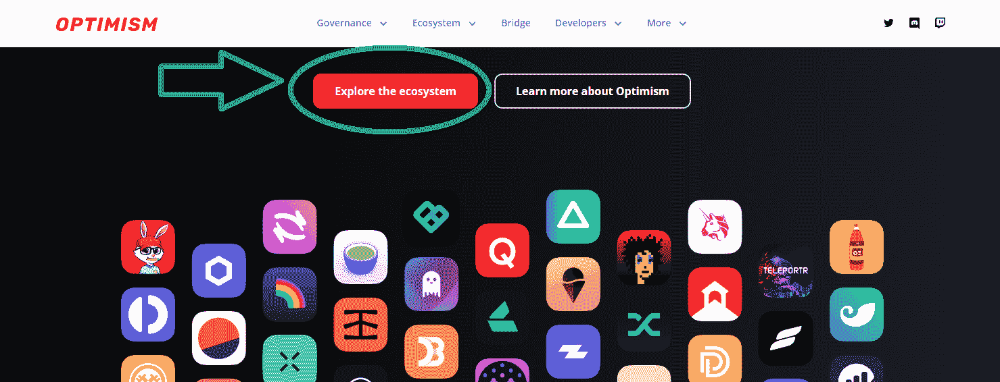
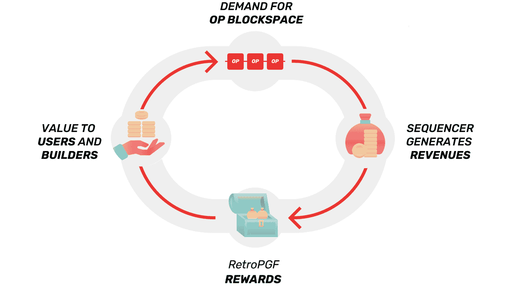
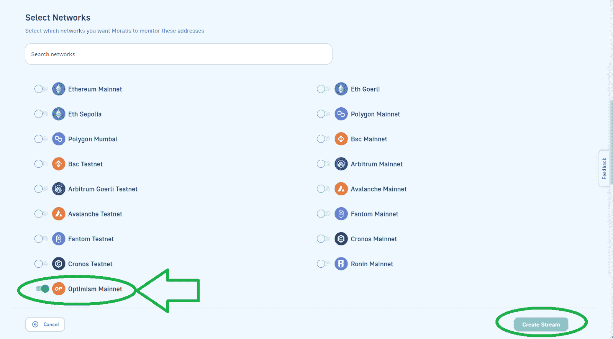
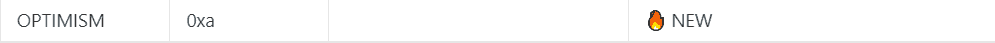
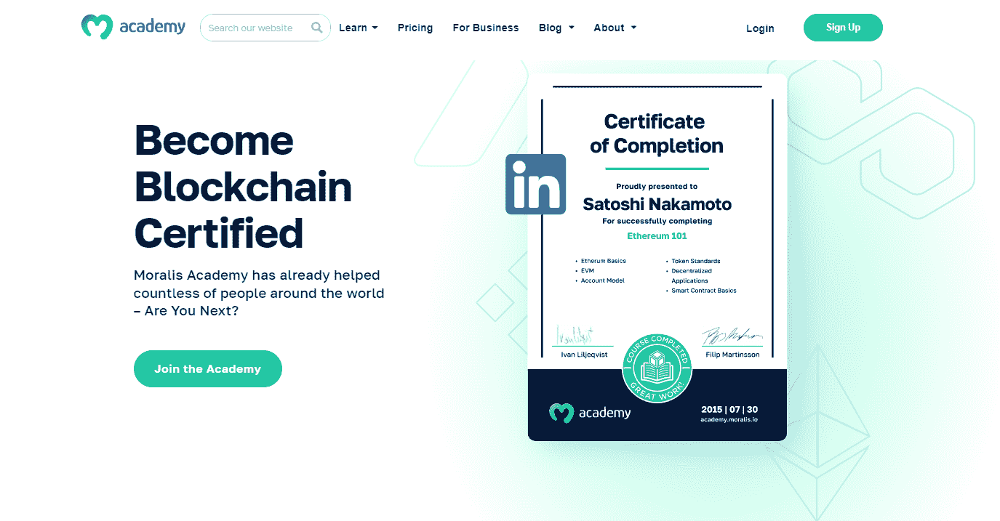

# 探索乐观网络——以太坊的下一代 L2 区块链

> 原文：<https://moralis.io/exploring-the-optimism-network-a-next-gen-l2-blockchain-for-ethereum/>

你是否曾想在以太坊上开发，但却因为网络过高的费用而止步不前？如果是这样，你应该多了解一下乐观的区块链。以太坊的下一代 L2(第 2 层)解决方案提供了绝佳的机会，使开发者能够以更快、更经济的方式访问以太坊。

也就是说，无论你关注什么链，如果你想快速简单地构建 dapps，利用市场领先的工具是最重要的。你最不希望的就是浪费你宝贵的时间和资源去从头开始构建后端基础设施。幸运的是，通过使用最终的 Web3 API 提供者 [Moralis](http://moralis.io) ，您可以节省 80%以上的开发时间。更重要的是，Moralis 现在在其他领先的 L1 和 L2 中支持乐观 L2 网络。

由于 Moralis 的跨链互操作性，您永远不会被任何特定的链所束缚，这使您的工作经得起未来的考验。事实上，您可以从一开始就构建多链 dapps。此外，您可以随时更改一行代码并将 dapps 部署到其他链。此外，Moralis 还具有跨平台互操作性。相应地，你可以使用你精通并喜欢的遗留编程语言和框架来加入 Web3 革命。因此，你可以通过创建你的[免费 Moralis 账户](https://admin.moralis.io/register)来开始构建乐观加密应用。然而，如果你想了解更多关于这篇文章的主题，请继续阅读并探索 L2 乐观网络。

[**Sign Up and Unlock the Power of Blockchain**](https://admin.moralis.io/register)

## 什么是 L2 乐观区块链网络？

由于我们只有这么多的时间，这篇文章涵盖了 L2 乐观区块链的基本方面。简而言之，网络是一个成本更低、速度更快的以太坊第二层区块链。根据“*乐观. io* ”，我们可以把这个 L2 链想象成一个快速、稳定、可扩展的以太坊。此外，是以太坊的开发者构建了这个扩展解决方案，作为对现有以太坊软件的最小扩展。通过提供可扩展以太坊 dapp 的乐观 EVM 等效架构，他们的主要目标是增强以太坊 dapp 开发者的能力。



毕竟，该网络的乐观主义基金会承诺通过建设促进公共产品增长和可持续性的基础设施来维护以太坊的价值。正如*乐观。io* 页面所说:“*如果它在以太坊上有效，它对乐观的作用只是成本*的一小部分”。此外，该基金会——一个非营利组织——还表示，在该项目完全分散之前，他们打算将运营集中式测序仪的所有利润捐赠给扩展和维持公共产品。到目前为止，他们已经分发了超过一百万美元给公益事业。你可以在官方网站的“*关于*”页面找到他们捐款的细节。



乐观区块链官方网站上的另一条标语写道:“*以太坊体验 10 倍速度*”。后者得到了乐观主义 L2 网络的承诺支持，因为它吸收了开发者对以太坊的所有热爱，并对其进行了加速。毕竟，尽可能少的代码行将 L2 乐观主义链与以太坊成熟的基础设施分开。这使得乐观主义网络不仅与 EVM 兼容，而且等同于他。因此，所有以太坊工具简单地工作在网络栈的每一层。此外，交易很便宜，而且几乎是即时的。


### 区块链背后的设计哲学

为了理解乐观 L2 链是如何工作的，你应该记住它是根据专注于以下四个支柱的设计理念建造的:

*   **简单性**–根据区块链的文件，这种 L2 解决方案应该由安全、可扩展和灵活的 L2 系统所需的最少数量的移动部件组成。通过关注简单性，L2 乐观主义网络倾向于在可能的情况下使用现有的经过战斗考验的以太坊代码和基础设施。例如，网络使用 Geth 作为其客户端软件。此外，简单的协议意味着需要编写的代码更少，这意味着潜在错误更少。

*   **实用主义**–这种设计理念优先考虑用户和开发者的现实需求，而不是理论上的完美。因此，这个 L2 解决方案是迭代开发的，并且依赖于用户的反馈。

*   **可持续性**–乐观的团队意识到，dapp 开发者需要确保他们构建的平台能够长期保持竞争力。因此，区块链的设计注重长期可持续性，不走可扩展性的捷径。这就是一个简单的代码库有助于建立一个更大的贡献者社区的地方，这些贡献者可以帮助长期维护协议。

*   **乐观主义**——顾名思义，这个支柱关注的是对以太坊未来的实际乐观。在未来，Web3 使我们能够重新设计我们与协调我们生活的机构之间的关系。根据基金会的信念，以太坊是未来的核心网络。毕竟，乐观区块链是以太坊的延伸。



### 乐观的 L2 区块链是如何工作的？

让 L2 链成为可能的伟大想法是乐观的累积。最终，乐观 L2 链是一个“乐观的累积”。这意味着它依赖于另一个(“父”)区块链的安全机制。由于以太坊是乐观主义的母链，这个 L2 解决方案利用了以太坊的利益证明(PoS)共识机制。毕竟，你可能还记得以太坊在 2022 年 9 月从其最初的工作证明(PoW)协议过渡到 PoS([合并](https://moralis.io/ethereum-merge-what-is-ethereum-2-0-and-the-merge/))。

此外，乐观区块链的所有区块都存储在以太坊的一个特殊智能合约中。后者使用“*canonical transaction chain*”(CTC)。此外，所有块都保存在 CTC 合同内的仅附加列表中。本质上，这个仅追加列表构成了区块链。此外，CTC 包括代码，确保没有人可以修改现有的块列表-假设不超过最后 50 个以太坊块被重组。因此，只要以太坊是安全的，乐观主义也是安全的。



此外，值得指出的是，乐观主义的“定序器”主要管理块的生产。该单一方提供即时事务确认和状态更新，构造和执行 L2 块，并将用户事务提交给 L1。此外，目前，乐观基金会经营着唯一的砌块生产商。尽管如此，他们计划随着时间的推移分散定序器。

另外，请注意，与以太坊节点从以太坊 P2P 网络下载块不同，乐观节点直接从 CTC 的仅附加块列表中下载块。此外，该链的设计使用户能够在两个网络之间转移资产，包括 ERC-20 令牌。也就是说，确切的机制取决于转移的方向。要阅读更多关于网络如何工作和该协议规格的细节，请访问乐观主义文档。



### 应用和集成概述

如果没有对乐观生态系统中的应用和集成的概述，今天的文章将是不完整的。目前，生态系统中有超过 200 个应用和集成，来自各种加密领域，包括 DeFi 项目、NFT 项目、桥梁、入口匝道、钱包、工具和 DAOs。如果您想了解有关这些 dapps 和集成的更多信息，请访问该网络的官方网站，向下滚动并点击“探索生态系统”按钮:



### 乐观的秘密——是什么？

密码这个术语被广泛用于各种与区块链相关的事物。然而，它经常被用作“区块链”或“加密货币”的同义词。因此，“乐观加密”要么指乐观网络本身，要么指“OP”加密货币，这是乐观的治理令牌。


与 L1s 的本地硬币/令牌不同，乐观加密(OP)不用于为网络供电。乐观主义——作为一种乐观主义的汇总——不在 OP 中支付网络气费，而是使用 ETH(以太坊的原生币)支付交易费。毕竟是以太坊网络完成了验证。因此，OP 仅仅被用作网络乐观主义集体的治理硬币。后者是一群公民、社区和公司，他们共同努力回报公共产品，帮助以太坊建设一个可持续的未来。一个互利的契约将集体结合在一起——“影响=利润”——目标是部署一种新模式来奖励那些创造或维持公共产品的人。最终，OP token 的推出标志着乐观集体开始治理。


#### 最初的治理模式

网络乐观主义集体的数字民主治理的初始模型由两个机构组成:

*   **代币之家**–作为“代币之家”成员，OP 持有者负责提交、审议和投票表决各种类型的治理提案。这些包括治理基金拨款、协议升级、通货膨胀调整、董事免职、财政部拨款和权利保护。

*   **公民之家**——根据“*社区.乐观. io* ”的规定，“公民身份”将由“灵魂绑定”的不可转让非关税壁垒授予。此外，公民群体将随着时间的推移而增长。分配公民权的确切机制将由基金会根据代币之家的意见决定。从本质上来说，公民之家是一个大规模的非财阀治理和公共产品追溯融资的实验。



尽管如此，乐观主义集体强调，它需要一种实验性的和敏捷的治理方法，这将无情地迭代到一个经得起时间考验的系统。因此，最初的模型可能演变成完全不同的东西。如果你想了解更多关于乐观主义经济学和分配的知识，请访问“*community . optimission . io*”。


## 来自 Moralis 网的最新乐观网络支持

2022 年 11 月 15 日，Moralis 增加了对乐观主义 L2 网络的支持。这意味着你现在可以构建各种 dapps，并在这款快捷实惠的区块链上整合 [Web3 流](https://web3streams.com/)。此外，如果您决定在这个网络之上构建，您可以使用 Moralis [Streams API](https://moralis.io/streams/) 。后者使您能够将任何链上事件直接传输到项目的后端。

因此，如果您要将 Streams API 用于关注乐观主义的 dapp，您有两个选择。你可以使用 Moralis 的 JS SDK 或者 T2 的网络用户界面来着手这件事。对于前者，你必须把乐观主义链包括在区块链的列表中:

```js
 chains: [EvmChain.ETHEREUM, EvmChain.OPTIMISM], // List of blockchains to monitor
```

另一方面，如果你使用 Moralis 的网络用户界面，你会进入“选择网络”步骤，你需要切换“乐观主网”旁边的开关:



无论你选择哪种方式，你必须首先创建你的免费 Moralis 账户。当然，你也可以使用其他流行的 Moralis Web3 APIs，比如 Auth API、 [Token API](https://moralis.io/token-api/) 和 [NFT API](https://moralis.io/nft-api/) ，从乐观网络查询链上数据。此外，根据您决定使用的编程语言或框架，您只需要使用“ *EvmChain 来定义这个链。乐观主义*或 *0xa* ，这是乐观主义的链 ID(十六进制)。



## 探索乐观网络——以太坊的下一代 L2 区块链——摘要

我们在今天的文章中涉及了相当多的内容。我们从基础开始讨论，你已经了解了 L2 乐观主义区块链网络需要什么。接下来，我们快速概述了以太坊第 2 层解决方案背后的设计理念。在那里，你了解了区块链的四大支柱(简单、实用、可持续和乐观)。继续，你也发现了乐观 L2 链是如何运作的。然后，我们看了看乐观主义生态系统。尽管如此，我们也解释了什么是“乐观密码”。相应地，您还了解了 OP token 和初始乐观主义集体的两院(token house 和公民院)治理模式。最后但同样重要的是，我们简要说明了如何使用 Moralis 来开始建立一个乐观主义的 dapp。

接下来，我们建议您完成我们在 [Moralis 文档](https://docs.moralis.io/docs)中等待您的一些教程。一定要练习切换到支持链，包括乐观。另一方面，您可能有兴趣了解更多有关区块链发展的方方面面。在这种情况下，你应该探索一下[Moralis YouTube 频道](https://www.youtube.com/c/MoralisWeb3)和我们的[开发者加密博客](https://moralis.io/blog/)。这两个出口处理无数的话题。例如，一些最新文章关注如何[从集合中获取所有 NFT](https://moralis.io/how-to-get-all-nfts-from-a-collection-in-3-steps/)，[集成 WalletConnect 模态和 QR 码](https://moralis.io/how-to-integrate-the-walletconnect-modal-and-qr-code/)，[获取某个地址拥有的所有 NFT](https://moralis.io/how-to-get-all-nfts-owned-by-an-address-3-step-process/)，[以太坊 webhooks](https://moralis.io/ethereum-webhooks-what-they-are-and-how-to-use-webhooks-for-ethereum/) ， [Web3 基础设施](https://moralis.io/web3-infrastructure-exploring-the-best-solution-for-web3-development/)，等等。

此外，你可能渴望成为全职加密员。如果是这样，你应该成为区块链认证。最好的方法是报名参加 Moralis 学院。在学院，你可以从基础开始，或者参加高级课程，如[区块链商业大师班](https://academy.moralis.io/courses/blockchain-business-masterclass)课程。

