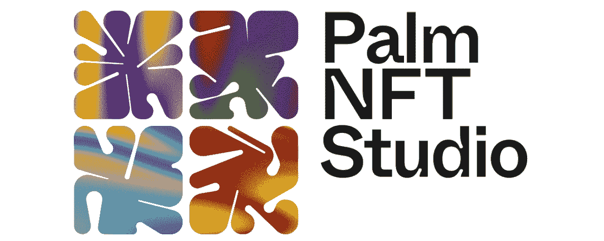
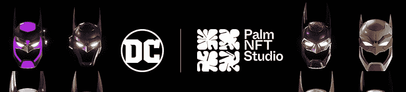
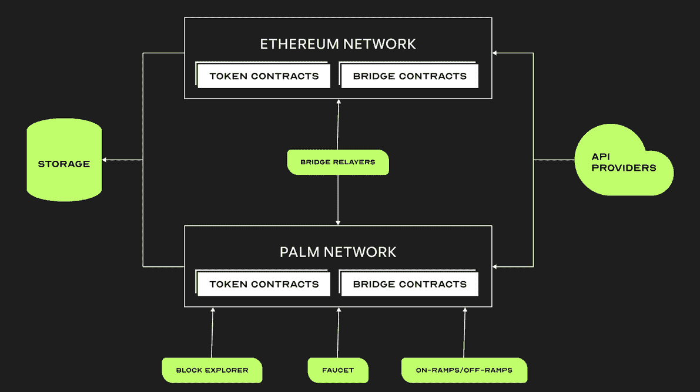
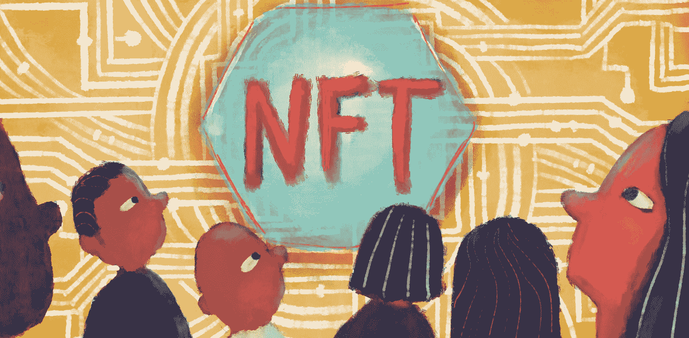
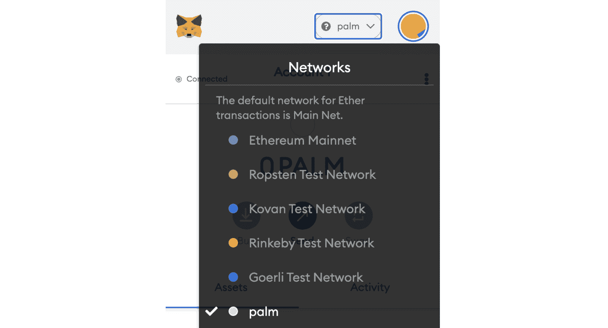
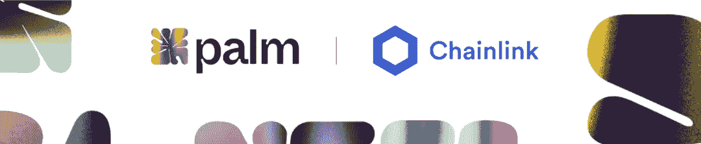
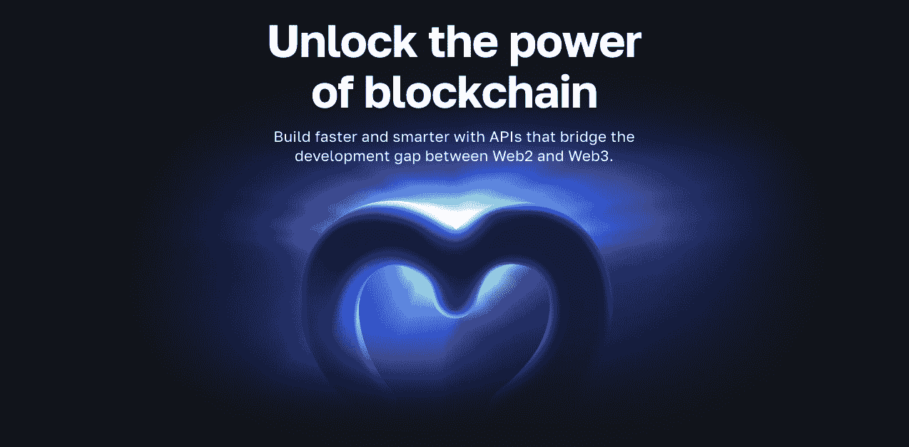
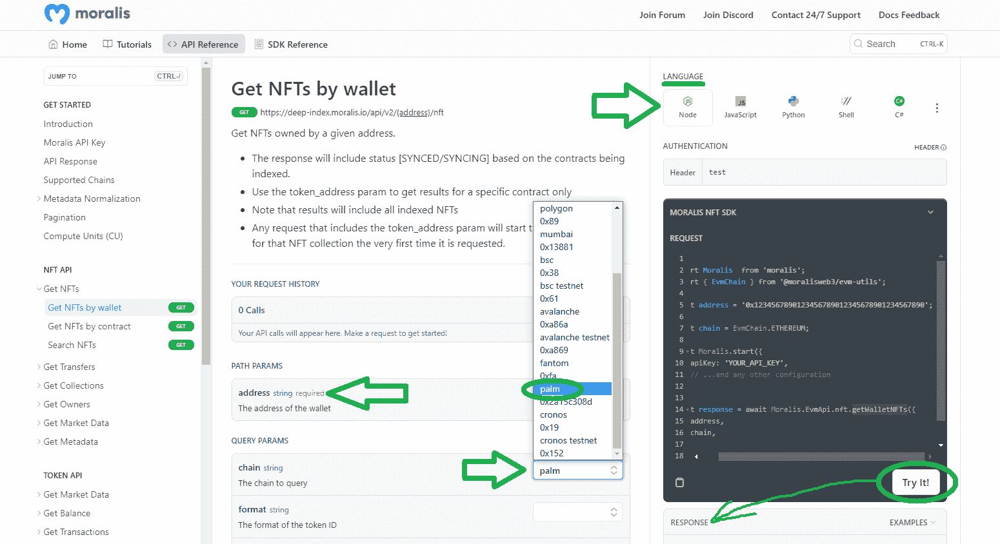

# 探索 Palm 网络——什么是 Palm NFT 工作室？

> 原文：<https://moralis.io/exploring-the-palm-network-what-is-palm-nft-studio/>

Palm NFT 工作室致力于更有效地创建、交易和管理非金融交易。此外，Palm Studio 有一些来自艺术和娱乐行业的大玩家支持他们的努力，他们正在与区块链行业的一些领先的名字和公司合作。也就是说，可以肯定地说，Palm NFT 工作室将为非功能性桌面系统的主流采用做出重大贡献。

在今天的文章中，我们解释什么是棕榈 NFT 工作室和它做什么。一路上，我们很快了解了什么是棕榈区块链。此外，你还会发现你是否可以得到一个棕榈工作室 NFT，我们将仔细看看棕榈 NFT 工作室的合作和伙伴。最后但并非最不重要的是，你将学习如何使用 Palm Studio 的区块链与 Moralis，并创建各种 NFT dapp 的简单方法。毕竟，在其他优秀的快捷方式中， [Moralis](https://moralis.io/) 提供了终极 [NFT API](https://moralis.io/nft-api/) 。有了这个 API，开发人员可以快速创建与 NFT 相关的项目，像开发人员是否必须[让所有 NFT 所有的](https://moralis.io/how-to-get-all-nfts-owned-by-an-address-3-step-process/)通过区块链网络这样的任务变得轻而易举。也就是说，如果你喜欢边做边学，创建你的[免费 Moralis 账户](https://admin.moralis.io/register)并开始“构建”。

## 什么是棕榈 NFT 工作室？

从本质上来说，Palm NFT 工作室是一家旨在通过 NFTs 重新定义粉丝参与度的技术公司。为了实现这一宏伟目标，该公司与领先的艺术家、创意人员、知识产权所有者和娱乐公司合作(下文将详细介绍 Palm Studio NFT 合作伙伴)。棕榈 NFT 工作室的首席执行官是丹海曼，前康赛斯公司的协议总经理。此外，Palm 的创始团队包括几位知名人士:

*   Joseph Lubin——ConsenSys 创始人和以太坊联合创始人
*   大卫·海曼——电影制片人和鼎盛电影公司的所有者
*   Joe Hage——世界级艺术工作室 HENI 集团的创始人

你很可能听说过 NFT 收藏“货币”*。这个系列是由棕榈 NFT 工作室与达明安·赫斯特和海尼合作建造的。此外，这家专注于 NFT 的公司还推出了 Pace Gallery 的元宇宙平台 Pace Verso。Palm 还为环球音乐集团、华纳兄弟和 DC 提供了创新的 NFT 体验。*

*

### Palm 工作室是做什么的？

在上一节中，您了解到 Palm NFT 工作室是一家专注于 NFT 的公司。你发现他们已经和一些大品牌合作了。因此，当谈到他们与这些品牌的合作时，Palm Studio 涵盖了帮助这些品牌以某种方式整合 NFT 的技术组件。例如，对于 DC，Palm 建立了该品牌的一级和二级市场。

然而，除了与特定企业合作，棕榈 NFT 工作室致力于建立一个公共 NFT 基础设施的资源。这就是棕榈区块链出现的地方。后者是一个以太坊侧链。这个侧链的主要目的是作为 NFTs 的可扩展和可持续生态系统的基础。当第二层(L2)区块链继承主区块链的安全性时，副链依赖于它们自己的安全性。因此，Palm 有其特殊的共识方法。后者被称为 IBFT-2 共识机制，这是一种轮流授权证明(PoA)方法。同样值得注意的是，关键利益相关者也像利益相关证明(PoS)共识机制一样运行 Palm 网络验证程序。

还有，记住以太坊和 Palm 是通过一个便于代币移动的桥连接起来的。除了这个令牌桥，Palm chain 完全兼容 EVM。这意味着它支持与领先的可编程区块链相同的开发工具。相应地，开发者也可以在 Palm 上部署 Solidity 智能合约。

也就是说，很明显，Palm NFT 工作室的核心焦点之一是确保 Palm 网络的平稳运行和发展。毕竟，Palm 的路线图包括向以太坊 L2 连锁店的过渡。然而，Palm NFT 工作室的长期愿景是让 Palm 成为领先的跨链 NFT 生态系统。

### 你能得到一个棕榈工作室 NFT 吗？

您必须区分 NFT 开发平台/项目和 NFT 系列。尽管 Palm NFT 工作室非常独特，但鉴于它也专注于开发区块链，它肯定更像是一个 NFT 开发平台。因此，它帮助其他企业开发 NFT 项目和平台，但它没有自己的官方 NFTs。然而，许多人把在区块链棕榈上铸造的 NFT 称为 NFT 棕榈工作室。但是请记住，除了 Palm NFT 工作室参与支持 Palm 链之外，该公司通常与 Palm 区块链上的 NFTs 没有任何关系。毕竟，这些 NFT 的所有者是用来铸造它们的智能合约的所有者，或者是通过链上交易获得所有权的钱包的所有者。

所以，你能得到一个棕榈工作室 NFT 吗？技术上正确的答案应该是“不”。但是，如果您希望在 Palm chain 上“激活”NFTs，您可以这样做。考虑到开发者已经在网络上创造了超过三百万的 NFT，你有很多选择。当然，您需要首先创建您的 Palm wallet 地址。然后，您将能够接收/购买基于 Palm 的 NFTs。

另一方面，你也可以在 Palm 上创建自己的 NFT。毕竟，你可以使用和铸造以太坊一样的工具。在这种情况下，您还需要将 Palm 添加到 MetaMask 钱包中。为了帮助您做到这一点，请遵循 Palm 文档中的详细说明。本质上，你只需要点击“添加网络”按钮，然后选择“掌上电脑”。

#### 该应用程序-配置钱包，购买代币，并使用桥梁

如果您想与 Palm 网络交互，您可以使用 Palm 应用程序，它也可以帮助您将此网络添加到元掩码中:

此外，Palm 应用程序允许您使用信用卡/借记卡购买 DAI (stablecoins)。此外，它是访问 PALM 桥的地方，用于两种可替换的令牌，例如 Palm、DAI 以及 ETH 和 NFTs:

*注意:如果您有兴趣了解更多关于 Palm token 的信息并将 DAI 从以太坊转移到 Palm，请务必访问 PALM 的 docs 和 PALM 的官方网站。在后者上，您可以找到一个整洁的“FAQ”页面，回答所有最常见的问题。*

## 协作和合作伙伴

至此，您已经知道 Palm NFT 工作室是由 crypto 领域的一位知名人士领导的。现在，在我们看这家专注于 NFT 的公司的主要合作伙伴之前，也值得注意的是，它有一些令人印象深刻的投资者。其中包括微软的风险基金 M12、华纳兄弟、SK Inc .、Griffin Gaming Partners、Third Kind Venture Capital、the LAO、RRE 和 Sfermion。

至于 2022 年 11 月的棕榈 NFT 工作室合作伙伴名单，你可以看到他们概述如下:

*   共识；一致
*   HENI
*   全盛时期的电影
*   MetaMask
*   尤勒贝茨
*   协议实验室
*   Nifty 的
*   特雷姆
*   chiansafe
*   Wyre
*   netpro
*   街区侦察员
*   修补
*   表情包
*   共价的
*   ioBuilders
*   解密工作室
*   流行

虽然 Palm NFT 工作室与环球音乐集团、华纳兄弟、DC 和其他大型品牌有一些令人印象深刻的合作，但从技术角度来看，它与 Chainlink 的合作值得一些额外的关注。

毕竟，从 Palm 博客上的信息来看，这种合作可能会使 Palm 成为领先的跨链 NFT 生态系统。通过与 Chainlink Labs 的积极合作，Palm NFT 工作室旨在改善和简化企业在区块链发行 NFT 的方式。因此，Chainlink 实验室将支持 Palm 网络的进一步发展和增长。因此，这种协作似乎是建立一个高效的多链 NFT 抽象层的关键，企业将使用这个抽象层来监视、跟踪和管理 NFT。

如果你不知道，Chainlink 实验室是参与建设 Chainlink 的开发团队。后者是最广泛采用的开源和分散式 oracle 网络。此外，Palm network 正在集成几个 Chainlink oracle 服务。这些服务包括针对汇率的 Chainlink 价格馈送、针对可验证随机数生成器的 Chain link VRF(RNG)以及针对跨链功能的 Chanlink 跨链互操作性协议(CCIP)。

## 如何使用 Palm NFT 工作室与 Moralis

除非你一直生活在岩石下，否则你知道 Moralis 是领先的企业级 Web3 API 提供商。这意味着开发人员可以构建分散的应用程序，而无需重新发明轮子。毕竟，在许多情况下，大多数 Web3 功能可以通过简单地从 Moralis 文档中复制粘贴代码片段来添加。

Moralis 也是关于跨链互操作性的。因此，它支持所有领先的 EVM 兼容区块链，包括 Palm 网络。这意味着您可以使用 Moralis 的 API 来创建专注于 Palm 和任何受支持链的 dapps(分散式应用程序),如下图所示:

这个领先的 Web3 API 提供者也是完全跨平台互操作的。因此，您可以使用遗留开发工具在 Palm 和其他受支持的链上构建 dapps。这使得 Moralis 以弥合 Web2 和 Web3 之间的发展差距而闻名。此外，Moralis 的一大优势是其清晰的交互式文档。后者包括教程，使完整的 Web3 初学者能够创建 dapps。此外，Moralis 文档也是学习如何正确使用 Moralis 的 Web3 APIs 的最佳地方。因此，如果您有兴趣通过构建 NFT dapps 来运用您的 Palm 网络知识，那么这是一个值得一游的地方。因此，请确保创建您的免费 Moralis 帐户，并开始建设。

[**Sign Up with Moralis**](https://admin.moralis.io/register)

#### 在 Palm 网络上构建 NFT dapp 的文档和其他快捷方式

通过使用 API 参考文档页面，您可以将 Moralis 的所有 API 端点用于一个 spin。例如，您可以访问[通过钱包获取 NFTs 文档页面](https://docs.moralis.io/reference/getwalletnfts):

看上面的截图，你可以看到这些互动页面的主旨。本质上，你只需要粘贴所需的参数。但是，您也可以使用可选参数。这是你选择手掌链的地方。通过这样做，你可以质疑这个以 NFT 为中心的区块链。此外，每个 API 参考页面都允许您在右上角选择您喜欢使用的编程语言。

使用 Moralis 的 Web3 APIs，您可以像许多其他项目一样，将项目的上市时间平均缩短 87%。除了减少时间，这些工具还为你节省了大量的工程成本。此外，Moralis 的大部分快捷方式来自于在 GitHub 等待你的各种 Web3 样板文件。一个很好的例子是我们的模板，让你[毫不费力地建立一个 NFT 门控 dapp](https://github.com/MoralisWeb3/youtube-tutorials/tree/main/nft-gating) 。当然，在处理这类项目时，理解如何[让一个地址拥有所有的 NFTs】是最重要的。](https://moralis.io/how-to-get-all-nfts-owned-by-an-address-3-step-process/)

然而，GitHub 上的一个通用样板是我们的[以太坊样板](https://github.com/ethereum-boilerplate/ethereum-boilerplate)。在这里，确保不要让“以太坊”欺骗你——这个样板文件支持所有 EMV 兼容链，包括 Palm。默认情况下，它还支持 NFTs:

如果你想要更多关于如何使用这个通用 Web3 样板的指导，我们的文章探索如何[在以太坊](https://moralis.io/how-to-create-a-decentralized-website-on-ethereum/)上创建一个去中心化的网站正是你所需要的。

## 探索 Palm 网络——什么是 Palm NFT 工作室？–总结

在今天的文章中，您了解到 Palm NFT 工作室是一家支持一些最大的 NFT 项目的技术公司，也是 Palm 区块链背后专注于支持 NFTs 的公司。在此过程中，您还了解了这家专注于 NFT 发展的公司的业务。此外，你现在知道，棕榈 NFT 工作室不认可任何官方的不可替代令牌(NFT)。然而，Palm 网络上已经有几百万个 NFT 了。我们还告诉您如何将此网络添加到 MetaMask，以及在哪里访问 Palm-Ethereum 桥。有了这些工具，您可以使用 Palm Studio。最后但并非最不重要的是，你还了解到，Moralis 可以帮助你创造 NFT dapps 对棕榈或任何其他领先的区块链不费吹灰之力。我们甚至解释了如何开始，以及哪些额外的快捷方式可以为您节省大量时间。

因此，如果你有兴趣以简单的方式构建跨链 dapps，创建你的 Moralis 帐户并开始学习我们的教程。此外，您可能希望探索其他区块链发展主题。在这种情况下， [Moralis 的 YouTube 频道](https://www.youtube.com/c/MoralisWeb3)和 [Moralis 的博客](https://moralis.io/blog/)就是你的出口。例如，一些最新的主题解释了如何用 Python 建立自动化的 [Web3 通知电子邮件](https://moralis.io/how-to-set-up-automated-web3-notification-emails-with-python/)，[用于 dapp 开发的最佳 ERC20 令牌平衡 API](https://moralis.io/the-best-erc20-token-balance-api-for-dapp-development/) ，什么是 [Goerli testnet](https://moralis.io/goerli-eth-what-is-the-goerli-testnet/) ，什么是[区块链基础设施公司](https://moralis.io/blockchain-infrastructure-companies-how-to-choose-the-right-provider/)等等。尽管如此，你可以通过注册[Moralis 学院](https://academy.moralis.io/)成为区块链认证，在那里你可以完成各种高质量的课程。我们建议从[区块链和](https://academy.moralis.io/courses/blockchain-bitcoin-101)比特币基本面入手。*