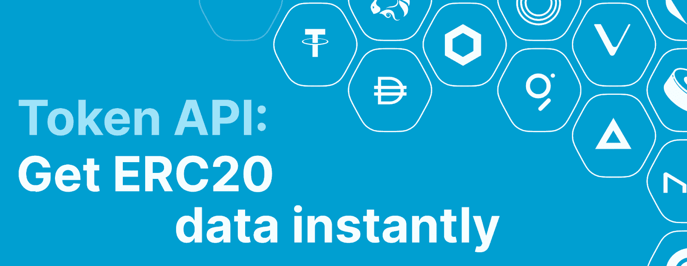
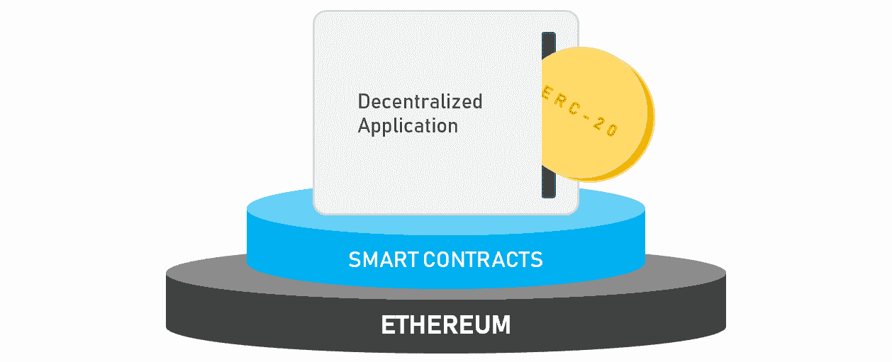
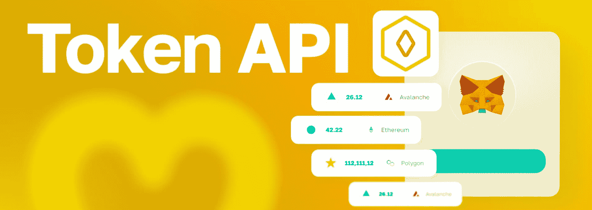
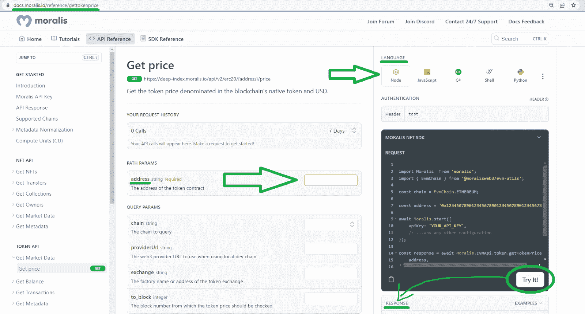

# 探索终极 ERC20 令牌 API

> 原文：<https://moralis.io/exploring-the-ultimate-erc20-token-api/>

构建 dapps 时，高质量的 ERC20 令牌 API 至关重要。通过使用以下代码行，您可以使用 Moralis 的企业级 ERC20 令牌 API 来获取任何 EVM 兼容链上的任何 ERC20 令牌的价格:

```js
const response = await Moralis.EvmApi.token.getTokenPrice(options);
```

如果您以前使用过 Moralis，并且精通 JavaScript，您可能知道如何处理上面的代码片段。但是，如果您需要关于合并终极 ERC20 令牌 API 的指导，请继续阅读！毕竟，下面有一个利用上述“ *getTokenPrice* ”端点的教程在等着你。因此，如果你渴望亲自动手，创建你的[免费 Moralis 账户](https://admin.moralis.io/register)并跳转到“*如何使用 Moralis 的 ERC20 令牌 API* 的示例”部分。如果您不熟悉 [Moralis](https://moralis.io/) ，我们建议您阅读整篇文章，因为它将帮助您正确掌握使用 [best token API](https://moralis.io/token-api/) 背后的基础知识。

[**Sign Up with Moralis**](https://admin.moralis.io/login)

### 概观

以太坊是第一个可编程的区块链，这使得这个网络具有先发优势。这个新的公共区块链吸引了许多去中心化网络的信徒，以太坊社区迅速流行起来。尽管在过去的几年里诞生了许多所谓的“以太坊杀手”，以太坊仍在继续表演。毕竟，它是无数 dapps 和加密令牌的家园。因此，了解并在您的开发工具套件中放置最强大的 ERC20 令牌 API 是显而易见的。幸运的是，这正是今天的文章旨在帮助你的。



接下来，您将首先学习什么是 ERC20 令牌 API，以及它如何有用。有了这些基础知识，我们将进一步了解 Moralis 企业级令牌 API。基本上，我们将对这个简洁的解决方案做一个概述。这也是我们将查看当前包含的 ERC20 令牌 API 端点的地方。此外，您将学习如何轻松地测试它们，并获得适用于任何编程语言的正确代码行。

最后但同样重要的是，我们将重点向您展示如何利用“ *getTokenPrice* ”端点。毕竟，在许多类型的 dapps 中，获取 ERC20 令牌价格可能具有很大的价值。通过完成本教程，你也将学会如何开始与 Moralis。然后，您将能够使用任何其他 ERC20 令牌 API 端点和整套 Moralis 的 web 3 API—[Auth API](https://moralis.io/authentication/)、 [NFT API](https://moralis.io/nft-api/) 和 [Streams API](http://v) 。


## ERC20 令牌 API–它是什么？

ERC20 令牌 API 是一种特定类型的 Web3 API 工具。顾名思义，它专注于有关 ERC20 令牌的数据。也就是说，您需要理解什么是 Web3 API，什么是 ERC20 令牌，才能完全理解 ERC20 令牌 API 需要什么。所以，事不宜迟，让我们先来看看什么是 Web3 API。

### 了解 Web3 APIs

您可能知道，API 代表“应用程序编程接口”，它已经成为遗留开发空间的重要组成部分。毕竟，各种 API 负责促进软件之间的通信。他们通过翻译说明来实现相关的理解。此外，这些工具支持在安全和受控的开发环境中进行可靠的编程。API 通过可靠和一致地根据请求提供函数来实现后者。Web3 APIs 与传统 API 做同样的事情；然而，他们一方面关注与区块链节点的通信，另一方面关注 dapps 的后端。

如果您对 API 不熟悉，并且想要对它们有一个坚实的理解，使用下面的餐馆类比会有所帮助。把厨房想象成处理顾客订单的“系统”或“软件”。然而，餐厅的顾客通常不会直接与厨房沟通。取而代之的是，他们的订单通常由女服务员或侍者来接收，他们充当中间人。女招待/服务员传递顾客的订单(请求),并以食物的形式向顾客提供来自厨房(系统)的响应。在这个类比中，API 是服务员。然而，它们不是促进顾客和厨房之间的交流，而是在不同的软件之间进行。


此外，每当我们浏览互联网时，我们都会使用 API。当我们的设备连接到网络并将信息发送到接收端时，接收端分析数据，执行所需的操作，并发回响应。然后，我们的设备解释信息，并以可读的方式呈现出来。当然，当关注 Web3 APIs 时，这种交流发生在区块链领域。最终，Web3 APIs 为全世界的开发者打开了 Web3 开发的大门！

### 了解 ERC20 令牌

既然你知道什么是 Web3 API，我们还需要确保你理解 ERC20 的含义。只有这样，你才能回答“什么是 ERC20 令牌 API？”自信地提问。

你不必是一个密码专家，也知道许多加密令牌或加密货币是可用的。这些代币的大部分存在于以太网上。因此，当关注可替换的令牌时，大多数令牌都遵循 ERC20 标准；因此，我们称它们为 ERC20 令牌。再者，ERC20 是“以太坊征求意见稿 20”的简称，2015 年底提出并被接受。自从以太坊的开发者们把它安装到位后，所有在以太坊上铸造的可替换代币都具有完全相同的基本品质。后者遵循以太坊的本地硬币(ETH)规范。


另外，请注意，Web3 devs 将 ERC20 标准称为“ERC20 契约”。毕竟，智能契约(软件的链上部分)是用来实现这个标准的。因此，每当开发人员决定创建 ERC20 令牌时，他们都需要部署一个包含 ERC20 标准指南的智能契约。您应该记住，用于铸造令牌的智能合约还负责确保所有令牌传输都遵循预定义的规则。基本上，ERC20 契约标准为创建和处理 ERC20 令牌强加了适当的规则。

## 用于 ERC20 令牌的 API 是如何有用的

ERC20 令牌可以用于许多不同的目的。例如，它们可以用作实用令牌、治理令牌等。因此，当您创建一个包含您的或其他现有 ERC20 令牌的 dapp 时，一个合适的令牌 API 会带来很大的不同。它使您能够获取关于可替换令牌的链上细节，并使用这些数据来触发特定的 dapp 功能。当然，这也让您能够以一种用户友好的方式向 dapp 用户呈现这个令牌数据。



此外，您还可以使用 ERC20 令牌 API 来构建 DeFi 平台。或者，您甚至可以利用这个优秀的工具在 Web3 游戏中加入 ERC20 令牌。最终，如果您计划构建一个需要处理 ERC20 令牌的 dapp，一个合适的令牌 API 可以节省您大量的时间和资源。如果没有这个工具，您需要构建自己的后端基础设施来建立所需的通信。

## 企业级 ERC20 令牌 API 简介

我们已经提到，最终的 ERC20 令牌 API 是由 Moralis 的令牌 API 提供的。除非你一直生活在岩石下，否则你很可能知道 Moralis 是一家企业级 Web3 API 提供商。由于其跨平台的互操作性，Moralis 弥合了 Web2 和 Web3 之间的开发差距。因此，你可以使用你喜欢的传统开发平台和编程语言来加入 Web3 革命。此外，Moralis 也是关于跨链互操作性的。因此，它支持所有领先的可编程区块链，使您的工作经得起未来考验，因为您永远不会被任何特定的链所束缚。


Moralis 的 ERC20 令牌 API 允许您将实时令牌数据集成到应用程序中。在其他功能中，这个强大的工具使您能够完全访问所有主要区块链的代币价格、所有权、余额和转账数据。事实上，这里列出了 Moralis 的 Token API 提供的最突出的开箱即用功能:

*   获取 ERC20 价格(本币和美元)
*   获取给定钱包拥有的 ERC20 令牌
*   获取给定钱包的 ERC20 余额
*   获取给定钱包的 ERC20 转账
*   支持所有 ERC20 令牌
*   实时 ERC20 令牌价格发现和元数据



### 令牌 API 端点

得益于以下令牌 API 端点，上述所有功能都是可能的:

*   "***getTokenPrice***"-获取以区块链本币和美元计价的代币价格。
*   "***getWalletTokenBalances***"-获取特定钱包地址的 ERC20 代币的[余额。](https://moralis.io/balance-of-erc20-how-to-get-balance-of-an-erc20-token-from-address/)
*   "***getTokenAllowance***"-获取允许消费方代表业主提取的金额。
*   "***getWalletTokenTransfers***"-获取特定钱包按块号降序排列的 ERC20 令牌交易。
*   "***getTokenTransfers***"-从按块号降序排序的合约中获取 ERC20 令牌交易。
*   "***getTokenMetadata***"–获取给定令牌合同地址的元数据(名称、符号、小数和徽标)。
*   "***getTokenMetadataBySymbol***"-获取令牌符号列表的元数据(名称、符号、小数和徽标)。

借助这些终端，您可以轻松支持实时价格源、投资组合应用、交易监控、所有权验证等。

接下来，我们将进一步了解" *getTokenPrice* "端点，我们将在接下来的教程中使用它。然而，我们鼓励您使用[令牌 API 文档](https://docs.moralis.io/docs/token-api)来检查您可以与*Moralis 一起使用的其他端点的细节。EvmApi.token* "方法。

#### “getTokenPrice”端点

我们至少提到过几次“ *getTokenPrice* ”端点是获得 ERC20 令牌价格的关键。因为我们将在下一节中使用这个端点，所以让我们看看它的文档页面:



上面的截图显示了“ ***地址*** ”参数是唯一必需的参数。毕竟，端点需要知道关注哪个智能契约。此外，这个有用的 ERC20 令牌 API 端点还支持以下可选参数:

*   *"-连锁查询*
*   *" ***提供者 Url***"–使用本地开发链时要使用的 Web3 提供者 URL*
*   *“ ***交易所***”——代币交易所的厂名或地址*
*   *"***To _ block***"-取历史令牌价格(任意特定块)*

*尽管如此，在上图中，您还可以看到 Moralis 文档页面使您能够测试运行所有端点。此外，您可以在右上角选择想要使用的编程语言。然后，您可以简单地从“请求”部分复制代码片段。*

*

## 如何使用 Moralis 的 ERC20 令牌 API 的示例

最后，我们将专注于完成今天的教程，在这里您将使用上面介绍的" *getTokenPrice* " ERC20 令牌 API 端点。但是，在处理下面概述的三步过程之前，请确保您已经完成了以下先决条件:

*   安装 Node v.14 或更高版本。
*   准备好自己喜欢的代码编辑器或者 IDE。我们倾向于使用 Visual Studio 代码(VSC)。
*   安装您喜欢的软件包管理器(NPM，纱，或 PNPM)。


### 步骤 1:获取您的 ERC20 令牌 API 密钥并安装 Moralis SDK

如果你还没有创建你的免费 Moralis 账户，现在就创建吧。你可以使用文章顶部的链接或 Moralis 主页上的“免费开始”按钮。您的帐户启动并运行后，您将可以访问您的管理区域，在这里您需要复制您的 ERC20 令牌 API 密钥，也称为 Web3 API 密钥:


我们将很快向您展示粘贴 API 密钥的位置。但是现在，坚持下去，集中精力安装 Moralis SDK。您可以通过运行以下命令之一来实现这一点(取决于您使用的软件包管理器):

```js
npm install moralis
```

```js
yarn add moralis
```

```js
pnpm add moralis
```

### 步骤 2:使用获取 ERC20 令牌价格的示例脚本

下面几行代码代表我们的示例“index.js”脚本，它正确地合并了“ *getTokenPrice* ”端点:

```js
const Moralis = require("moralis").default;
const { EvmChain } = require("@moralisweb3/evm-utils");

const runApp = async () => {
  await Moralis.start({
    apiKey: "YOUR_API_KEY",
    // ...and any other configuration
  });

  const address = "0xC02aaA39b223FE8D0A0e5C4F27eAD9083C756Cc2";

    const chain = EvmChain.ETHEREUM;

  const response = await Moralis.EvmApi.token.getTokenPrice({
        address,
        chain,
    });

  console.log(response);
}

runApp();
```

*注意:如果您喜欢使用 TypeScript 而不是 JavaScript，请访问关于如何获得 ERC20 令牌价格* *的* [*文档页面。在那里，您可以复制我们的示例“index.ts”脚本。*](https://docs.moralis.io/docs/how-to-get-the-price-of-an-erc20-token)

从上面可以看到，通过使用“ *EvmChain。以太坊*”，我们重点关注以太坊。然而，你可以通过替换“以太坊”在其他支持的区块链上获得 ERC20 代币价格。此外，“ *YOUR_API_KEY* ”指示您用上面获得的 Moralis Web3 API 密钥替换该占位符:


### 第三步:执行程序并探索结果

有了上面的脚本和正确插入的 Web3 API 密钥，就可以执行程序了。通过这样做，您可以在终端上看到结果。

确保使用正确的命令:

**对于 JavaScript:**

```js
node index.js
```

**对于打字稿:**

```js
npx ts-node index.ts
```

尽管如此，如果您没有更改上面的示例地址("*0x c 02 AAA 39 b 223 Fe 8d 0 a 0 e 5 C4 f 27 EAD 9083 c 756 cc 2*")，您应该会看到以下响应:

```js
{
  "nativePrice": {
    "value": "1000000000000000000",
    "decimals": 18,
    "name": "Ether",
    "symbol": "ETH"
  },
  "usdPrice": 1202.4880237457774,
  "exchangeAddress": "0x1f98431c8ad98523631ae4a59f267346ea31f984",
  "exchangeName": "Uniswap v3"
}
```

*注:由于以上价格是 live，你大概会得到一个不一样的值。*

我们强烈建议您为其他合同地址和其他 EVM 兼容链测试上述脚本！

## 探索终极 ERC20 令牌 API 总结

在今天的文章中，您有机会了解了 Web3 APIs 和 ERC20 令牌。当试图理解什么是 ERC20 令牌 API 时，这些知识就派上了用场。我们还告诉了您针对 ERC20 令牌的 API 是如何有用的。当我们向您介绍 Moralis 的令牌 API(也称为终极 ERC20 令牌 API)时，后者已经得到了澄清。在这里，您可以了解这个特定的 Web3 API 集中的所有当前端点以及它们能做什么。最后但同样重要的是，您有机会跟随我们的教程，并看到其中一个端点——“*getTokenPrice*”在运行。

如果您真的想将 ERC20 令牌集成到 dapps 中，请确保使用其他令牌 API 端点进行测试。此外，您可能想对不可替换令牌(NFT)做同样的事情，这仍然是最流行的区块链用例之一。尽管如此，如果你在构建你的第一个 dapp 时需要一些帮助，一定要使用 Moralis 文档。另一方面，您可能有兴趣探索其他区块链发展主题。如果是这样的话，[Moralis YouTube 频道](https://www.youtube.com/c/MoralisWeb3)和我们的[加密博客](https://moralis.io/blog/)是很好的渠道。一些最新的文章关注于 [AWS Lambda NodeJS](https://moralis.io/aws-lambda-nodejs-tutorial-how-to-integrate-a-nodejs-sdk-example/) 、[乐观主义](https://moralis.io/exploring-the-optimism-network-a-next-gen-l2-blockchain-for-ethereum/)网络、 [Polygon webhooks](https://moralis.io/polygon-webhooks-how-to-use-webhooks-on-polygon/) 等等。

最后但同样重要的是，区块链行业有无数的工作机会，你可以通过获得区块链认证来增加获得梦想中的加密工作的机会。因此，一定要考虑报名参加 Moralis 学院。一旦进去，你就可以选择许多不同的课程。然而，考虑到集中式密码交易所最近的低迷，这可能是[掌握 DeFi](https://academy.moralis.io/courses/master-defi) 的正确时机。

*