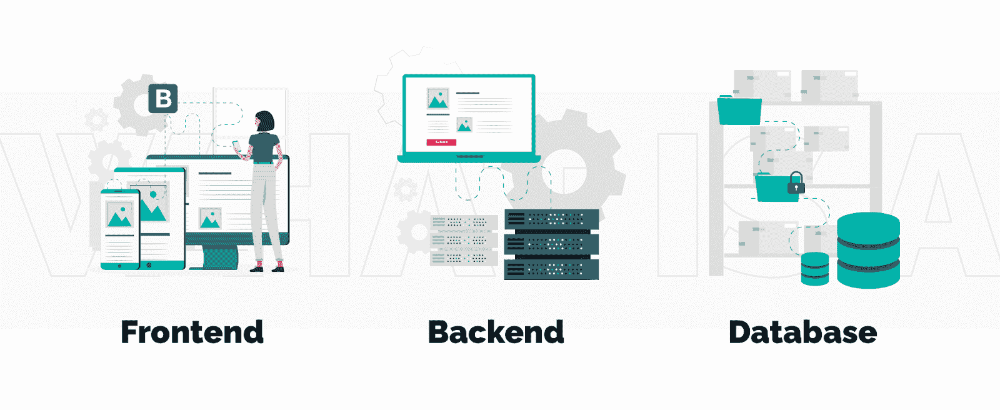
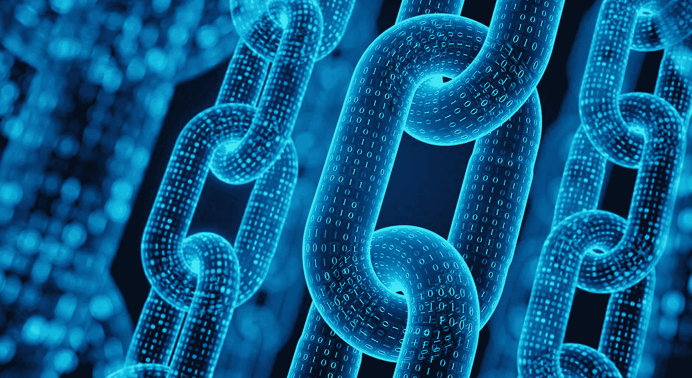
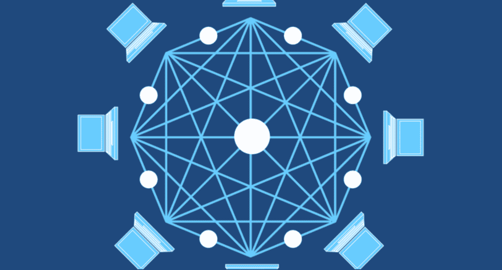
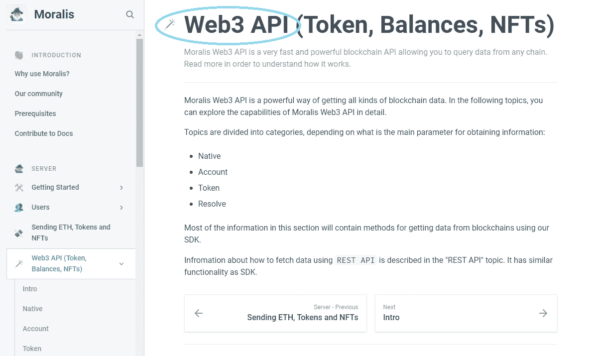
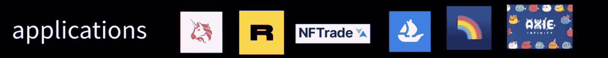
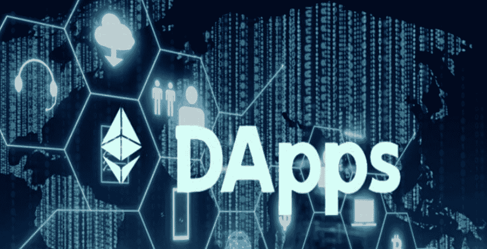
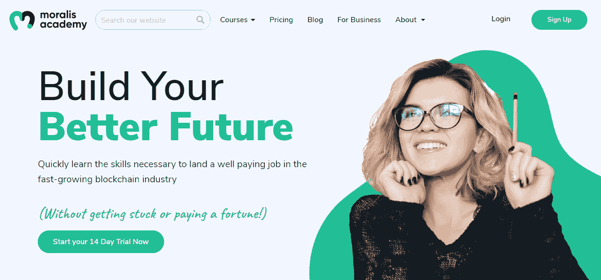

# 探索 Web3 技术堆栈–完整指南

> 原文：<https://moralis.io/exploring-the-web3-tech-stack-full-guide/>

在本文中，我们将看看 Web3 技术栈，并探索它的不同层。但是，如果您更想获得 Web3 技术堆栈的不同元素和重要性的视频分解，请直接观看以下视频:

https://www.youtube.com/watch?v=1i5wOpAg-lc

* * *

即使第一个可编程区块链( [**【以太坊】**](https://moralis.io/full-guide-what-is-ethereum/) **)在六年前诞生，我们仍然处于 Web3 游戏的早期。这在很大程度上与开发人员一直缺乏 Web3 工具有关。因此，区块链的发展长期以来过于复杂。例如，创建******【dApps】的主要方式是直接在** [**节点**](https://moralis.io/what-are-full-archive-nodes/) **之上构建龙。由于构建在例如** [**以太坊节点**](https://moralis.io/ethereum-rpc-nodes-what-they-are-and-why-you-shouldnt-use-them/) **上相当原始，许多 dev 都受到了 RPC 节点** **的** [**的限制。然而现在，Web3 开发变得比以往任何时候都容易。随着明确的 Web3 技术栈 Moralis 的引入，Web3 开发现在变得更加容易了。**](https://moralis.io/exploring-the-limitations-of-rpc-nodes-and-the-solution-to-them/)**

**我们将在这篇文章中详细介绍当前的 Web3 技术。在接下来的几节中，您将对区块链开发中涉及的所有层有一个很好的概述。此外，您将了解到许多等待您使用的不可思议的工具。尽管如此，你还是会被介绍给 Moralis，它是首要的 [Web3](https://moralis.io/the-ultimate-guide-to-web3-what-is-web3/) 开发平台，有时被称为“加密的[燃料库”。当使用 Moralis，你将节省时间和资源，给你一个机会来完善你的 dApp 的前端。此外，Moralis 具有内置的跨链互操作性，这将使您的项目经得起未来的考验。因此，请确保](https://moralis.io/firebase-for-crypto-the-best-blockchain-firebase-alternative/)[今天](https://admin.moralis.io/register)就创建您的账户。关于 Moralis，现在说得够多了；让我们更关注 Web3 技术栈的更广阔的视角。**

**

## Web3 技术堆栈–概述

在我们仔细研究 Web3 技术栈的每一层之前，重要的是要有一个清晰的概念。因为一张图片可以胜过千言万语，所以一定要好好看看这张图片:

在上图中，你可以看到可编程链位于 Web3 技术栈的最底层，而 Web3 应用程序(dApps)位于顶层。在两者之间，我们有(从下到上)节点、API 和平台。如前所述，我们将仔细研究 Web3 堆栈的每一层。然而，如果有一样东西我们想让你从这篇文章中吸取，那就是上面的图片(它的意思)。

现在，让我们在继续之前问你一个小问题。以上哪几个层次是大部分用户关心的？是的，它是最上面的一个。这是一个重要的事实，作为一个 dApp 开发者，你需要时刻牢记在心。这将使您能够选择特定的 Web3 技术组合，从而将您的资源集中在“应用”级别。因此，您将避免在创建自己的后端上浪费太多宝贵的时间。相反，使用正确的工具，在几分钟内完成这一部分。借助合适的工具，您可以更快地联系到您的用户，并为他们提供更好的体验。因此，请确保明智地选择您的 Web3 开发工具。

### 第一个 Web3 技术堆栈层–链

区块链，或者确切地说，可编程区块链，是第一个 Web3 技术堆栈层。如果你去掉这一层，就没有 Web3 开发，没有 dApps。因此，这是核心。幸运的是，有许多著名的公共选择供您选择。当然，以太坊依然是领头羊。尽管如此，高昂的以太币燃气费正在为所谓的“以太杀手”让路。然而，以太坊实在是太大了，有太强大的社区，很快就会被掩盖。尽管如此，未来最有可能是跨链互操作性，由多个质量链承担负载。值得一提的可编程区块链包括(但不限于)[币安智能链](https://moralis.io/bsc-programming-guide-intro-to-binance-smart-chain-development-in-10-minutes/)(BSC)[雪崩](https://moralis.io/how-to-create-an-avalanche-dapp-in-4-steps/)、[多边形](https://moralis.io/how-to-build-polygon-dapps-easily/)、[索拉纳](https://moralis.io/moralis-releases-solana-api/)和 Fantom。

您可以将区块链(协议)视为 CPU。在你所有的开发生涯中，你多久与一个 CPU 直接交互一次？很可能永远不会，对吗？因此，你也不能指望与区块链直接互动。此外，要与区块链通信，您需要运行一个节点。本质上，节点是与同一链上的其他节点相连接的软件。因此，节点使您能够与链(区块链网络)对话并访问其数据。问题是运行一个节点是一项全职工作。在大多数情况下，它需要一个团队来进行维护、适当的备份等等。因此，对于开发人员来说，这不是一个合适的解决方案。这就是为什么有几个专门的[区块链节点提供商](https://moralis.io/infura-alternatives-and-blockchain-node-providers/)把他们所有的时间都投入到运行节点上。

### 第二个 Web3 技术堆栈层–节点

上面，您已经了解到您需要节点来与区块链通信。此外，您现在知道作为开发人员运行自己的节点是不可取的。幸运的是，你有相当多的服务为你提供节点。诸如 Infura、Alchemy、Chainstack、Getblock、Pocket Network(分散式)、Quicknode 和 RunNode 等公司使您能够使用它们的节点。因此，您不必担心运行和维护自己的节点。这听起来是一个很好的解决方案，对吗？嗯，节点仍然是有限的，你实际上无法从中获得大量数据。

例如，您会认为节点应该能够告诉您不同用户的余额，对吗？嗯，不能。它只能关注特定的链，无法涵盖加密令牌背后的多个智能合约。因此，节点可以为您提供来自区块链的原始数据。然而，不幸的是，原始数据是相当无用的。当然，您可以创建自己的基础设施来使其有用，但这对大多数开发人员来说没有任何意义。记住，创造非凡的用户友好的 dApps 是我们的目标！因此，直接与节点对话(在大多数情况下)并不可取。这样做仍然会像建立一个网站时直接与 CPU 对话一样。因此，一定有更好的方法。幸运的是，这就是 API 发挥作用的地方。

## 第三个 Web3 技术堆栈层–API

应用程序编程接口(API)是一组用于构建和集成应用程序的定义和协议。或者，在区块链的情况下，dApps。它为一个软件与其他软件的交互提供了一种简洁的方式。此外，一组适当的 API 有助于在稳定的环境中进行一致的编码。幸运的是，在 2022 年，有几个著名的 Web3 API 提供商，如 Moralis、共价、图形、Quicknode、Alchemy、Bitquery 和 Biconomy，仅举几例。API 提供者有不同的 API 连接到幕后的节点。因此，你自己不必担心这个问题。

API 是 Web3 技术堆栈层，作为开发人员，您应该与之进行交互。这样，您可以获得各种有用的预编译和预先计算的链上数据。所有的 API 提供者都提供文档来解释他们 API 的细节。例如， [Moralis documentation](https://docs.moralis.io/) 甚至为您提供了大量有用端点的实际例子。反过来，您可以用简短的代码片段覆盖许多查询。

### Moralis 的 SDK

下面是一些 Moralis 家端点的例子: *getBlock* ， *getDateToBlock* ， *getLogsByAddress* ， *getNFTTransfersByBlock* ， *getTransaction* ， *getTokenPrice* 等。如你所见，Moralis 提供了广泛的 API，包括[终极 NFT API](https://moralis.io/ultimate-nft-api-exploring-moralis-nft-api/) ，这使得 [NFT 开发](https://moralis.io/integrate-mint-function-to-js-interface-nft-development/)变得简单明了。然而，也有其他可靠的 [NFT API 替代品](https://moralis.io/nft-api-alternatives-comparing-alchemys-nft-api-with-moralis-nft-api/)。

如果您现在再次查看“Web3 技术堆栈-概述”一节中的图片，您会知道 API 和上面的层应该是令人感兴趣的。此外，虽然 API 在许多情况下是与链通信的好方法，但是还有更好的方法。

## 第四个 Web3 技术堆栈层—平台

看看遗留系统，你有几个开发平台。例如，有像 Firebase、Azure 和 Amazon Web Service (AWS)这样的平台。但说到 Web3，Moralis 是首要平台。如果没有平台，您需要运行自己的后端来使用 API。这是您构建数据库、登录特性等的地方，这可能需要几周甚至几个月的时间。但是有了一个平台，比如 Moralis，你可以完全专注于前端。

### Moralis 的主要特征

例如，以下是 Moralis 为您提供的一些强大工具:

*   完全集成的 [Web3 认证](https://moralis.io/web3-authentication-the-full-guide/)功能。
*   [同步和索引智能合约事件](https://moralis.io/sync-and-index-smart-contract-events-full-guide/)的“同步”功能。
*   用于保存链上事件和数据的完整数据库。
*   一种通过短信和电子邮件推送通知来提醒用户的方式[获取 Web3 事件。](https://moralis.io/get-web3-events-with-sms-messages/)
*   到您前端的套接字连接。
*   使用其他 API 的插件(例如 [OpenSea 插件](https://moralis.io/plugins/opensea/)，允许您绕过获取 OpenSea API 密钥)。

如您所见，平台本质上是一种端到端的体验。一个合适的 Web3 平台为你提供了从一个想法到一个可行的 dApp 的所有必要工具。你已经有主意了吗？使用 Moralis 使它变得生动！你所需要做的就是创建你的免费 Moralis 账户。准备好您的帐户后，您将能够[登录您的管理区](https://admin.moralis.io/login)。从那里，你可以[创建一个 Moralis 服务器](https://docs.moralis.io/moralis-server/getting-started/create-a-moralis-server)，[索引区块链](https://moralis.io/how-to-index-the-blockchain-the-ultimate-guide/)，等等。如果你将简单的 Moralis 与终极的以太坊 dApp 样板结合起来，你可以在几分钟内准备好你的 dApp。

### 第五个 Web3 技术堆栈层

最后，我们到达了 Web3 技术栈的顶层——web 3 应用程序。它们是所有用户都感兴趣的。此外，这是你可以发挥创造力的地方，因此，交付一个壮观的用户界面，并提供最好的 UX。此外，通过优秀的 dApps，您还可以为区块链技术的主流采用做出贡献。再者，使用合适的开发平台，会覆盖大部分后端。在某些情况下，您仍然可以直接与 API 进行通信，但是一般来说，平台会处理好这一点。考虑到这一点，你可以使用 Moralis 来[创建一个 DeFi 仪表盘](https://moralis.io/how-to-create-a-defi-dashboard-in-5-steps/)、 [NFT 市场](https://moralis.io/develop-your-own-nft-marketplace-step-by-step-guide/)、[创建一个 NFT 游戏应用](https://moralis.io/nft-game-development-how-to-build-an-nft-game-app-in-minutes/)以及其他类型的 dapp。

## 用于区块链开发的 Web3 技术堆栈——摘要

至此，大家都已经了解了 Web3 技术堆栈由五层组成:

*   可编程区块链
*   节点和节点提供者
*   API 和 API 提供者
*   开发平台
*   分散应用

在这里，您还学习了每一层的基础知识。因此，您现在知道作为一名区块链开发人员，您将关注 API 和平台来满足您的所有需求。此外，到现在为止，你可能已经创建了你的免费 Moralis 账户。因此，您可以完全访问最终的 Web3 开发平台。

有了 Moralis 在你身边，它整洁的文档， [Moralis YouTube 频道](https://www.youtube.com/c/MoralisWeb3)，和 [Moralis 博客](https://moralis.io/blog/)，你就拥有了将你的区块链游戏带到下一个层次的所有工具。展望未来，我们建议您接手我们的一些示例项目。最新的包括探索以太坊上的[无气交易](https://moralis.io/gasless-transactions-exploring-gasless-transactions-on-ethereum/)，分五步构建 [Web3 登录](https://moralis.io/how-to-build-a-web3-login-in-5-steps/)，以及如何[通过网站](https://moralis.io/how-to-interact-with-smart-contracts-through-your-website/)与智能合约互动。通过完成示例项目，您还将学习如何完成初始 Moralis 设置。此外，在某些情况下，您还会发现如何使用最实用的 [Web3 样板文件](https://moralis.io/web3-boilerplate-beginners-guide-to-web3/)。另外，别忘了了解一下 [JavaScript](https://moralis.io/javascript-explained-what-is-javascript/) ETH 库( [Web3.js vs Ethers.js](https://moralis.io/web3-js-vs-ethers-js-guide-to-eth-javascript-libraries/) )、 [GameFi 和 play-to-earn (P2E)](https://moralis.io/what-is-gamefi-and-play-to-earn-p2e/) 、 [Web3 钱包](https://moralis.io/what-is-a-web3-wallet-web3-wallets-explained/)和[wallet connect Android SDK](https://moralis.io/walletconnect-android-sdk-alternative-authenticate-android-apps-withmoralis/)。

但是，如果您还不精通 JavaScript，请确保注册“[使用 JavaScript](https://academy.moralis.io/courses/javascript-programming-for-blockchain-developers) 构建索引”课程。这将让您有机会通过构建真实世界的项目从头开始学习 JavaScript。通过报名参加[Moralis 学院](https://academy.moralis.io/)，你还可以进入一些业内最好的社区。此外，作为学院成员，您将有机会获得密码专家的专业指导。因此，你很快就能成为全职的加密员。

**