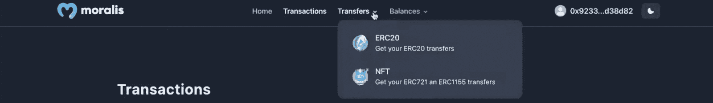
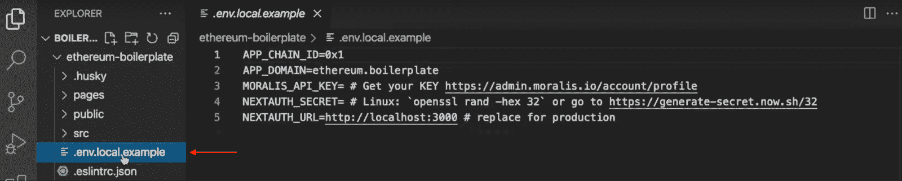
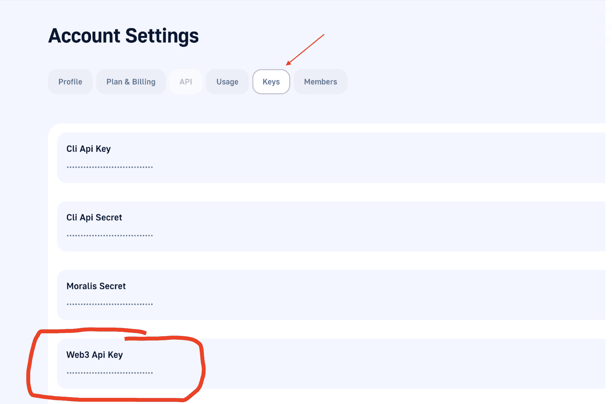
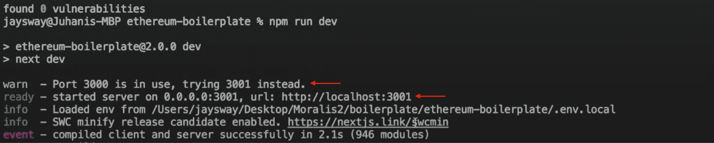

# 构建 Web3 应用的最快方法

> 原文：<https://moralis.io/fastest-way-to-build-a-web3-app/>

你知道构建 Web3 应用程序最快的方法是使用 Moralis 吗？如果你想了解更多，请跟随我们解释使用 Moralis 的以太坊样板构建 Web3 应用的最快和最简单的方法。如果你想跳过教程直接进入代码，你可以在下面的 GitHub 库找到全部内容:

**完整的以太坊样板文档—**[**https://github . com/以太坊-样板/以太坊-样板**](https://github.com/ethereum-boilerplate/ethereum-boilerplate)

本文展示了构建 Web3 应用程序的最简单方法。为了使开发过程尽可能无缝和可访问，我们将利用来自 Moralis 的以太坊样板。反过来，它将允许您在几分钟内构建具有几个优秀特性的复杂的 NextJS Web3 应用程序。此外，尽管该库被称为“以太坊样板”，但由于 Moralis SDK，代码可以进一步兼容任何 [EVM](https://moralis.io/evm-explained-what-is-ethereum-virtual-machine/) 系统，甚至 Solana！

样板文件的可访问性和力量来源于 Moralis 的各种工具。例如，Moralis 的[认证 API](https://docs.moralis.io/reference/auth-api-overview) 允许你通过单一代码片段轻松实现 [EIP-4361](https://moralis.io/exploring-eip-4361-sign-in-with-ethereum/) 兼容的认证机制。然而，这只是一个例子，如果您想进一步探索 [Moralis](https://moralis.io/) 平台，请查看它的附加 API。例如，我们强烈推荐 Moralis 的 [NFT API](https://moralis.io/nft-api/) 和 [Solana API](https://docs.moralis.io/reference/solana-api) ！

因此，如果你想增强你的 Web3 开发能力，一定要注册 Moralis，因为这是构建 Web3 应用的最佳方式。而且，创建一个账号只需要几秒钟，就可以免费上手！

## 什么是 Web3 应用程序？

Web3 应用程序通常被称为 dapps(去中心化应用程序)或区块链应用程序，本质上是配备了区块链和 Web3(去中心化)功能的常规应用程序。此外，程序员和开发人员通过使用智能合约在 P2P(点对点)区块链网络上构建 Web3 应用程序。因此，与传统的应用程序相比，它是独一无二的。

dapps 中的关键词是“去中心化”，这提供了几个优点。由于分散化是这些应用程序的普遍特征，它们通常不在单一主导机构的范围和控制之内。去中心化方面提供了几个好处，Web3 应用通常支持以下特性:

*   **开源**–dapp 开源并不罕见。因此，它们可以独立运作，没有一个中央权力机构发号施令。
*   **开放性**–web 3 应用的记录和数据可以完全公开。
*   **令牌**–web 3 应用可以使用加密令牌来保护网络安全。

然而，一个重要的关键点是，并非所有的 dapps 或 Web3 应用程序都具有这些功能，尽管社区中的许多人认为它们应该具有这些功能。尽管如此，Web3 应用程序有几个令人兴奋的方面，并提供许多好处。这里有几个例子:

*   **基于区块链的**–由于 Web3 应用基于区块链技术和智能合约，因此很容易将加密货币集成到应用的功能中。
*   **开源**——由于许多 Web3 应用程序都是开源的，这鼓励了整个生态系统的发展，从而推动创新向前发展。
*   **抗审查**–由于 Web3 应用是分散的，并且基于区块链网络，它消除了传统应用的单点故障。这意味着个人或政府很难控制和审查一个网络。

随着对 Web3 应用程序及其所包含的内容有了更好的理解，我们可以继续并演示构建 Web3 应用程序的最快方法！

## Moralis 以太坊样板——构建 Web3 应用的最快方法

文章的这一部分将向您展示构建 Web3 应用程序的最快方法。然而，在我们深入这个过程之前，我们首先要向您展示您将要创建的应用程序的功能。因此，这将是登录页面:


正如您在页面顶部看到的，您有一个带有几个选项的导航栏。如果用户最初点击这些，他们不会有太多的运气，因为他们需要在与页面交互之前验证他们的 Web3 钱包。此外，要验证他们的 [Web3 身份](https://moralis.io/web3-identity-the-full-guide-to-authentication-identity-and-web3/)，他们需要点击右上角的按钮:


点击此按钮将提示他们的元掩码钱包，并允许他们签署消息。此外，元掩码认证只是 Moralis 支持的方法之一。因此，如果你想添加其他的 [Web3 认证](https://moralis.io/authentication/)机制，你可以，例如，查看我们关于如何[用魔法添加登录的指南。链接](https://moralis.io/add-sign-in-with-magic-link-to-your-nextjs-project-in-5-steps/)或[添加比特币基地钱包登录功能](https://moralis.io/how-to-add-coinbase-wallet-login-functionality/)。

然而，一旦用户通过身份验证，他们就可以随心所欲地浏览页面。正如导航栏所示，用户将有许多选项。例如，他们可以查看自己的交易、转账和代币余额，如下所示:


“转移”选项卡有一个下拉菜单，允许用户在 NFT 和 ERC 之间切换-20 令牌转移:



“余额”选项卡也执行此操作，并依次提供相同的功能:


因此，用户可以点击“天平”菜单的“NFT”选项，查看整洁显示的非功能性测试:


更重要的是，这些只是样板文件的初始特征。Moralis 的开发团队不断地为这个模板久而久之实现更多的功能。尽管如此，让我们继续深入了解构建 Web3 应用程序的最快方法！

## 构建 Web3 应用程序–克隆项目

因为构建 Web3 应用程序的最快方法是通过以太坊样板，所以您必须做的第一件事就是导入这个模板。因此，要启动这个过程，您需要访问我们在文章中最初链接的 GitHub 存储库。在那里，您可以单击绿色的“Code”按钮并复制 URL，您可以使用它来克隆整个项目:


有了这个 URL，您就可以导航到您最喜欢的 IDE(集成开发环境)了。对于本教程，我们使用 VSC (Visual Studio 代码)；然而，你可以自由地使用任何你觉得更舒服的环境。请注意，如果您不使用 VSC，这个过程可能会有所不同。

在 IDE 打开的情况下，您需要创建一个新文件夹，在我们的例子中，我们称之为“*样板文件*”。接下来，您必须打开一个新的终端来运行一些命令。如果您使用的是 VSC，您应该能够通过点击屏幕顶部的“终端”，然后点击“新终端”来启动终端:


从那里，您将能够通过终端运行以下命令将项目克隆到您的本地存储库(确保您在正确的位置将项目克隆到您之前创建的正确文件夹):

```js
git clone “BOILERPLATE_URL”
```

复制好样板文件后，您可以使用以下命令跳转到正确的文件夹:

```js
cd ethereum-boilerplate
```

如果您运行所有正确的命令，您的本地存储库应该看起来像这样:


此外，为了使应用程序按预期工作，我们将在下一节中探索一个重要步骤。所以，事不宜迟，让我们更深入地研究" . env.local.example "文件，并配置一些重要的环境变量！

### 配置环境变量

如果还没有，可以导航到存储库中的“. env.local.example”本地文件，继续操作:



让我们逐一查看这些变量，从“*APP _ CHAIN _ ID”*开始。该变量自动设置为“ *0x1* ”，以太坊网络的 ID。然而，由于 Moralis 支持跨链兼容性，您可以选择任何 EVM 兼容链。我们将选择孟买试验网。如果您也想这样做，请将“ *APP_CHAIN_ID* ”更改为“ *0x13881* ”。

接下来，你有了" *APP_DOMAIN* "变量。这个你可以保持原样。接下来，您需要获取 API 密钥。您可以通过注册该平台来获得 Moralis API 密钥。因此，如果你还没有，马上创建你的 Moralis 账户。它是免费的，只需要片刻就可以开始使用。

手头有了账号，可以访问以下页面:[https://admin.moralis.io/account/profile](https://admin.moralis.io/account/profile)。

从那里，单击“Keys”选项卡并复制您的 Web3 API 密钥:



然后，您可以将" *MORALIS_API_KEY* "变量设置为该值。

对于变量" *NEXTAUTH_SECRET* "您将需要另一个密钥。如果您需要生成值的帮助，请点击以下链接:【https://generate-secret.now.sh/32[。此外，手头有一个值，设置“ *NEXTAUTH_SECRET* ”等于这个生成的密钥。](https://generate-secret.now.sh/32)

然后，您需要指定“ *NEXTAUTH_URL* ”，如果您要投入生产，它应该等于您的应用程序的 URL。然而，由于这是一个教程，我们需要确保一切正常，我们使用本地主机 3000，允许我们在发布前测试应用程序。

最后，您还需要将该文件重命名为" . env.local "，删除"。例”放在最后。

### 最终" *.env.local* "代码

因此，该文件的最终代码应该如下所示:

```js
APP_CHAIN_ID=0x13881
APP_DOMAIN=ethereum.boilerplate 
MORALIS_API_KEY= "YOUR_API_KEY"
NEXTAUTH_SECRET= b8e786967d7bcbc0f920d35bcc3f891c
NEXTAUTH_URL=http://localhost:3000
```

## 启动应用程序——构建 Web3 应用程序的最简单方法

一旦完成了环境变量的配置，就差不多可以启动 Web3 应用程序了。但是，在这样做之前，您必须安装必要的依赖项。根据您使用的是 npm 还是 yarn，您可以使用以下命令之一:

```js
npm i
yarn
```

安装完所有的依赖项后，接下来您需要做的就是运行一个本地开发服务器。您可以通过以下两种方式之一来实现:

```js
npm run dev
run yarn dev
```

这将使一个应用程序在本地主机 3000 上运行。但是，有时，如果您有另一个项目已经在本地主机 3000 上运行，您可能需要更改" *NEXTAUTH_URL* "环境变量，并确保它是正确的变量。举例来说，它可能看起来像这样:



要解决这个问题，只需更改 URL 变量。

关于构建 Web3 应用程序的最快方法的简短教程到此结束！从这里开始，现在由您来进一步定制应用程序，以满足目标用户群的需求。因此，您可以选择删除或实现最终产品功能所必需的新功能！

如果你的下一个项目需要灵感，看看 Moralis 的 [Web3 博客](https://moralis.io/blog/)。这个博客提供了令人兴奋的新鲜内容，激励你成为更杰出的 Web3 开发者。例如，学习[建立一个自托管解析服务器](https://moralis.io/how-to-set-up-a-self-hosted-parse-server/)或者你需要知道的关于[区块链同步](https://moralis.io/blockchain-syncs-exploring-on-chain-syncing/)的一切。

尽管如此，如果你在本教程中遇到了麻烦，下面这个来自 [Moralis 的 YouTube 频道](https://www.youtube.com/c/MoralisWeb3)的剪辑进一步详细解释了构建 Web3 应用程序的最简单方法。因此，它有望回答您的所有问题:

https://www.youtube.com/watch?v=Bb5Pc–kyAY

## 构建 Web3 应用的最快方法——总结

本文展示了使用 Moralis 的 Ethereum 样板文件构建 Web3 应用程序的最快方法。多亏了这个模板和平台的工具，你可以在几分钟内创建一个 Web3 应用程序。所有需要做的就是将项目克隆到您的本地 repo，更改一些环境变量，并安装一些依赖项。因此，如果你遵循了这个过程，你现在知道了构建 Web3 应用的最快方法。

如果你觉得这个教程很有帮助，你应该更进一步地探索 Moralis。在本教程中，我们简要介绍了 Web3 认证，这是 Moralis 大放异彩的领域之一；然而，这个平台有更多的功能。例如，你还可以在 Moralis 的帮助下轻松创建 [Web3 webhooks](https://moralis.io/web3-webhooks-the-ultimate-guide-to-blockchain-webhooks/) 并实现 [Web3 syncs](https://moralis.io/syncs/) 。


此外，你还可以在博客上找到其他有趣的指南。一个很好的例子是一篇关于 Moralis 的 NodeJS SDK for Web3 的文章。该套件包括几个基本功能，允许您轻松获取[链上数据](https://moralis.io/on-chain-data-the-ultimate-guide-to-understanding-and-accessing-on-chain-data/)，并为您未来的 dapps 实现强大的 Web3 功能。

此外，如果你想成为一名更熟练的区块链开发者，一定要去看看[Moralis 学院](https://academy.moralis.io/)。学院提供最高标准的[区块链课程](https://academy.moralis.io/all-courses)，让你在创纪录的时间内获得区块链认证。例如，查看[以太坊基础](https://academy.moralis.io/courses/ethereum-101)课程，开始你的 Web3 之旅！

尽管如此，你想要创建什么类型的 Web3 项目或 dapp 并不重要；Moralis 将有助于你所有的发展努力。因此，你应该马上花时间[与 Moralis](https://admin.moralis.io/register) 签约，成为这个社区的一员！