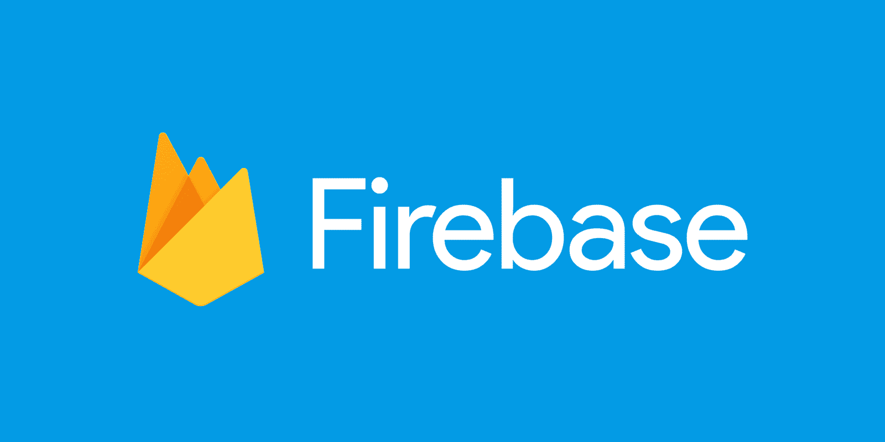
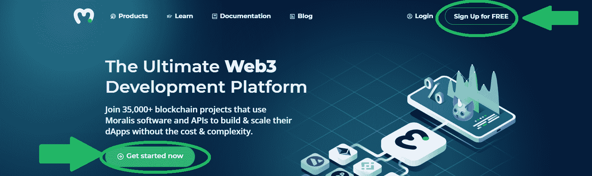
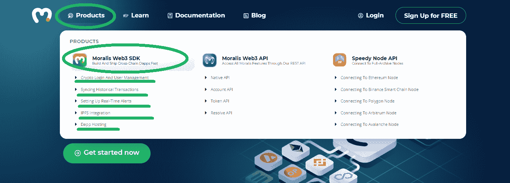
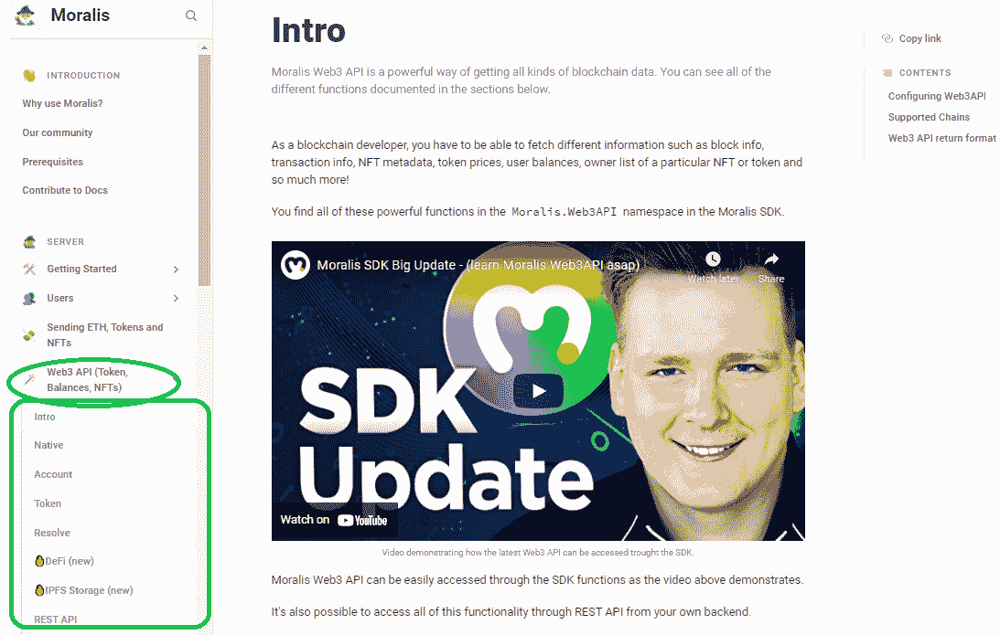
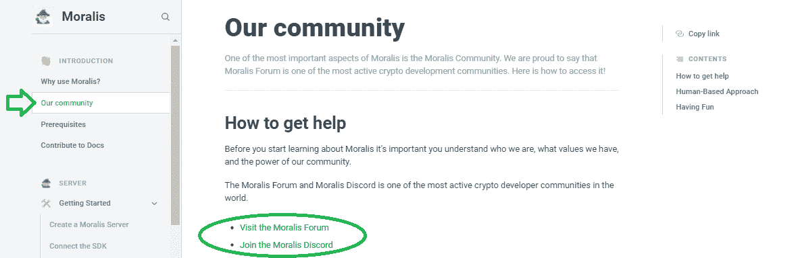
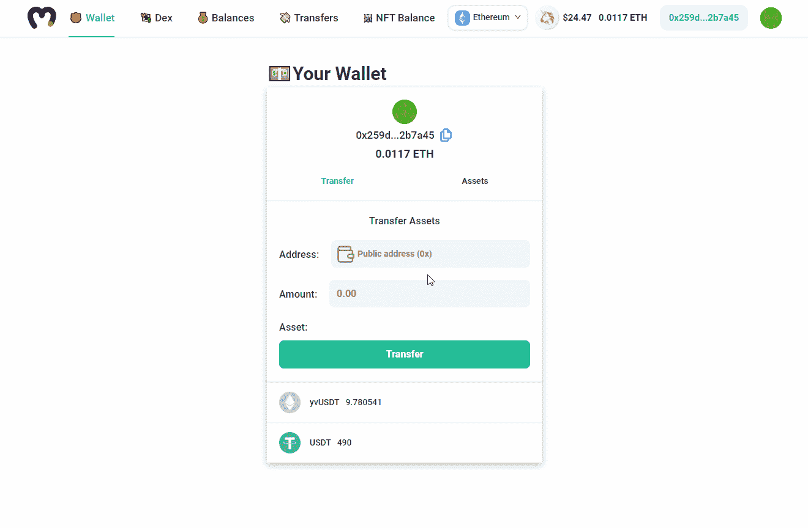
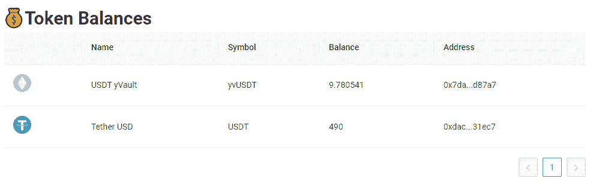
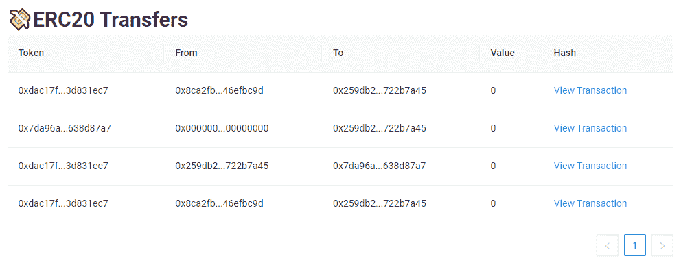
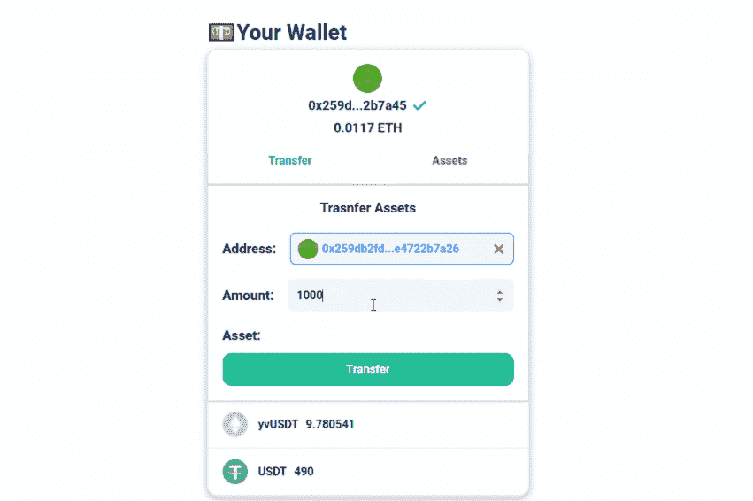
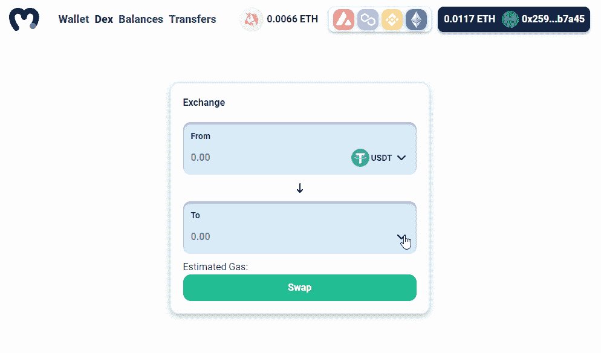

# Firebase for Crypto——最好的区块链 Firebase 替代方案

> 原文：<https://moralis.io/firebase-for-crypto-the-best-blockchain-firebase-alternative/>

**区块链技术将像 20 多年前的互联网一样撼动众多行业。因此，成为一名区块链开发者**[](https://moralis.io/how-to-become-a-blockchain-developer/)****，学习区块链的颠覆性技术，更深入地钻研加密领域，肯定会让你的职业生涯经得起未来考验。由于 Firebase 是创建 Web2 移动和 Web 应用程序的领先者，Moralis 已被证明是 Web3 开发的最佳区块链 Firebase 替代方案。因此，如果您需要一个 Firebase 作为加密选项来** [**构建您的第一个 dApp**](https://moralis.io/build-your-first-dapp-ethereum-tutorial/) **，例如一个** [**移动以太坊 dApp**](https://moralis.io/create-mobile-ethereum-dapp-with-react-native-template/) **，请跟随我们探索 Moralis 的 Web3 平台，并发现为什么它是最佳的区块链 Firebase 替代方案。****

**如果你有开发移动和网络应用的经验，你可能听说过 Firebase。谷歌的这个平台是为了让开发者尽可能简单而创建的。Firebase 为常规的 Web2 应用所做的，Moralis 为分散的应用所做的。“终极 Web3 开发平台”本质上是加密的基础。它提供了您快速部署跨链互操作 dApps 所需的所有工具，无需任何繁重的工作。在区块链 Firebase 的帮助下，你可以使用你的前端技能为区块链技术的采用做出贡献，而不需要学习任何与区块链相关的后端编程部分。**

**

## 加密的火焰——遇见 Moralis

因此，如果你想快速构建优秀的 [Web3](https://moralis.io/the-ultimate-guide-to-web3-what-is-web3/) 应用程序，你来对地方了。使用这种区块链 Firebase 的替代品使区块链开发感觉像一件轻而易举的事。围绕 RPC 节点创建 dApps 的开发人员知道，创建一个工作产品需要几周甚至几个月的时间。

然而，当使用 Moralis 及其 [ultimate Web3 SDK](https://moralis.io/exploring-moralis-sdk-the-ultimate-web3-sdk/) 时，你可以将那些月或周变成几天甚至几小时。这怎么可能？首先，您可以避免 RPC 节点的所有[限制。本质上，你可以利用 Moralis 的后端基础设施来构建你独特的用户界面。此外，你可以通过使用 Moralis 的](https://moralis.io/exploring-the-limitations-of-rpc-nodes-and-the-solution-to-them/)[以太坊 dApp 样板](https://moralis.io/ethereum-dapp-boilerplate-full-ethereum-react-boilerplate-tutorial/)来进一步加快这个过程。后者意味着只需复制和粘贴简短的代码片段，您就可以在几分钟内将广泛的功能包含在 dApp 中。

在本文中，我们将向您展示如何使用 Moralis，以及如何充分利用这个用于加密平台的 Firebase。您将了解这个区块链 Firebase 替代方案为您提供的工具、SDK、API 和完整的样板项目。因此，无论你是想[开发你自己的 NFT 市场](https://moralis.io/develop-your-own-nft-marketplace-step-by-step-guide/)，创建一个 [OpenSea 克隆](https://moralis.io/opensea-clone-create-an-nft-marketplace-like-opensea/)，[生成并铸造不可替代的代币](https://moralis.io/nft-generate-and-mint-how-to-generate-non-fungible-tokens/)，[创建一个 DeFi 仪表板](https://moralis.io/how-to-create-a-defi-dashboard-in-5-steps/)，还是[创建你的第一个 dApp](https://moralis.io/build-your-first-dapp-ethereum-tutorial/) ，Moralis 都能满足你！


## 最佳区块链 Firebase 替代方案

让我们仔细看看最好的 Firebase 替代方案能提供什么。Moralis 为您提供在创纪录的时间内部署跨链 dApps 所需的一切。这使您能够轻松地按照您的时间表交付，并尽快获得用户的反馈，而不是浪费几个月的开发时间来看您的潜在用户如何逃到另一个 dApp。

使 Moralis 成为区块链最佳替代燃料的特性:

*   **免费入门**–*Moralis 是开发者创造的——面向开发者；尽最大努力加快区块链技术的应用。因此，我们的目标是让 Moralis“尽可能免费”。目前，通过利用免费层，每个人都可以免费开始并获得所有功能的完全访问权限。*



*   [**Moralis 快速节点**](https://moralis.io/speedy-nodes/)–来自 Moralis 的节点是可用的最佳 [Infura 备选方案](https://moralis.io/infura-alternatives-and-blockchain-node-providers/)。由于 RPC 节点的限制，直接在 RPC 节点上构建是一种旧的创建 dApps 的方式。但是，您仍然需要访问一个节点来与各种区块链进行交互。幸运的是，您不需要运行自己的节点，也不需要处理设置自己的节点的所有复杂问题。


*   **访问终极 web 3 SDK***–Moralis 提供您快速轻松创建 dApp 所需的一切* y. *这包括加密登录和用户管理、同步历史交易、设置实时警报、分散存储(IPFS 集成)和 dApp 托管。*



*   **终极 web 3 API**–*Moralis 的 SDK 中很大一部分是其* [*终极 Web3 API*](https://docs.moralis.io/moralis-server/web3-sdk/intro) *。后者包括 native API、account API、token API、* [*终极 NFT API、*](https://moralis.io/ultimate-nft-api-exploring-moralis-nft-api/) *和 resolve API。所有这些共同组成了最好的* [*以太坊 API*](https://moralis.io/ethereum-api-develop-ethereum-dapps-with-moralis/) *。*



### Firebase for Crypto 拥有最好的文档

为了帮助开发人员充分利用这些特性，我们准备了一流的文档。我们花费了大量的资源来确保我们为 Moralis 用户提供业内最好的文档。因此， [Moralis 的文档](https://docs.moralis.io/)包括详细的说明、例子，甚至视频解释。此外，它还具有整洁干净的外观。此外，它易于导航，并使 dApp 的开发变得简单明了。“[入门](https://docs.moralis.io/moralis-server/getting-started)”部分将指导您完成所有必要的步骤，确保您可以立即专注于开发您的第一个 dApp。

### 具有强大社区的区块链 Firebase 替代方案

当你加入 Moralis，你也可以进入一个不可思议的社区。在 Moralis 论坛和 Moralis 的 Discord 频道，你可以向有经验的 Web3 开发者提问和学习。这样，你永远不会孤单。我们相信一个强大的社区，因此您不仅可以在任何需要的时候获得帮助，还可以成为一群志同道合的开发人员中的一员，他们都渴望为区块链的主流采用做出贡献。此外，你可以通过向已经做过的人学习来学习如何成为一名区块链开发者。



## 区块链 Firebase 替代方案–入门

为了使用 Moralis 的 SDK 或终极以太坊样板，您需要设置您的 Moralis 服务器。以下是开始使用该 Firebase for crypto 选件的必要步骤:

1.  [**设置你的 Moralis 家账户**](https://admin.moralis.io/register)——你需要创建你的免费 Moralis 家账户，以使用这款区块链 Firebase 替代品的强大功能。只需点击上面的链接，输入您的电子邮件地址，并创建您的密码。要完成此过程，请确认您的电子邮件地址(您将收到一封带有确认链接的电子邮件)。*如果您已经有一个有效的 Moralis 家账户，只需* [*登录*](https://admin.moralis.io/login) *进入您的管理区。
    T12】*
2.  **创建新服务器**–登录后，您将访问您的 Moralis 管理区。单击“服务器”选项卡，然后单击右上角的“+创建新服务器”。从下拉菜单中，选择一个网络选项(见下图)。*如果你还在学习如何充分利用区块链 Firebase 的替代品，我们建议从“Testnet 服务器”选项开始。*


接下来，会出现一个弹出窗口，询问服务器信息。输入必要的服务器详细信息，包括服务器名称，选择区域、网络、链，然后单击“添加实例”。服务器启动需要一些时间，请耐心等待。


3.  **访问服务器详细信息**–一旦您的服务器准备就绪，您就可以通过单击服务器名称旁边的“查看详细信息”按钮来访问其详细信息。


这将导致另一个弹出窗口出现，其中将列出您需要的所有信息:


4.  **初始化 Moralis**–要获得所需的后端功能，请填充您的”。js“或者”。包含 Moralis 服务器详细信息(应用程序 ID 和服务器 URL)的“html”文件:


*注意* *:使用你服务器的详细信息和* ***而不是*** *上图中的那些。*

## firebase for Crypto——终极捷径

一旦设置好 Moralis 服务器，就可以开始创建跨链的可操作 dApps 了。您可以通过使用广泛的以太坊 API(钩子)并围绕它构建您自己的用户界面来做到这一点。然而，如果你正在寻找一种更快的方法来部署你的 dApp，你可能想要使用 Moralis 的 ultimate Ethereum dApp 样板。



通过使用我们的以太坊 dApp 样板组件，您可以在几分钟内实现以下功能，包括 UI:

*   用 **< AddressInput / >** 抓取钱包地址，用 **< Address / >** 显示一个带有块状头像的以太坊地址:


*   使用**</>**提供用户友好的方式在支持的链之间切换:


*   使用**<【coin price/>**显示指定代币的价格(以美元或本国代币【点击切换】)显示:


*   用 **< ERC20Balance / >** 向您的用户显示所有 ERC-20 余额:



*   使用 **< ERC20Transfers / >** 显示 ERC-20 代币交易:



*   使用 **<钱包/ >** 为您的 dApp 添加钱包:



*   使用 **< DEX / >** 为您的用户提供分散式交换(DEX):



按照上一节完成 Moralis 服务器的设置，以上所有组件都由您支配。然而，要使用 DEX 组件，您还需要从 Moralis 安装 1inch 插件。幸运的是，您只需点击几下鼠标就可以做到这一点:

1.  单击服务器右侧的三个点，然后单击“插件”。然后点击“转到插件商店！”按钮。


2.  点击 Moralis 1 英寸插件容器上的“阅读更多”按钮，选择 1 英寸插件:


3.  安装 1 英寸插件:


*成功完成安装后，您就可以使用“****<DEX/>****”组件了。*


### 区块链 Firebase 替代方案–使用样板文件

如果您想在尽可能短的时间内充分利用这个“Firebase for crypto”替代方案，使用我们的以太坊 dApp 样板组件是一个不错的选择。要做到这一点，你需要遵循以下简单的步骤:

1.  首先使用“***git clone https://github . com/ether eum-boilerplate/ether eum-boilerplate . git***”克隆或分叉“以太坊-样板”存储库。

2.  接下来，安装所有依赖项:

```js
cd ethereum-boilerplate
yarn install
```

3.  随后将您的“appId”和“serverUrl”从您的 Moralis 服务器(以上“区块链 Firebase 替代方案-入门”部分中的说明)提供给“src/index.js”文件中的“ **< MoralisProvider >** ”:

```js
<MoralisProvider appId={APP_ID} serverUrl={SERVER_URL}>
  <App />
</MoralisProvider>
```

4.  使用 ***纱线开始*** 运行您的应用程序。

*注意* *:你也可以使用 npm 包管理器来代替“yarn”。如果是这样，您需要用 npm 的等效命令替换“yarn”。*

终极以太坊 dApp 样板中所有当前可用的特性仅仅是个开始。这是一项正在进行的工作，作为用户，你可以在它的 GitHub 库上发表评论。

## 加密认证用户的 Firebase

无论您是决定使用以太坊 dApp 样板提供的终极捷径，还是想要创建独特的用户界面，能够认证用户是关键。与 Web2 不同，在 web 2 中，您只需登录电子邮件，而在 Web3 应用中，您需要获取用户的钱包地址，以便他们获得 dApps 的全部功能。本质上，这是每个分散式应用程序都需要的特性。

幸运的是，这个用于加密的 Firebase 使得以太坊认证变得非常简单。由于它的 [MetaMask](https://moralis.io/metamask-explained-what-is-metamask/) 集成，你可以利用这个流行钱包的力量作为进入加密领域的门户。除了 MetaMask，Moralis 还提供 [WalletConnect](https://moralis.io/how-to-connect-users-with-walletconnect/) 集成，如果你想[创建移动以太坊 dApps](https://moralis.io/create-mobile-ethereum-dapp-with-react-native-template/) ，这是一个很好的选择。

无论您决定使用两个身份验证集成选项中的哪一个，您都可以用“***moralis . authenticate***”代码片段来覆盖它。此外，一旦您的 dApp 能够认证用户，您就可以自动获得与该地址相关的所有链上数据的完全访问权。此外，所有这些数据都可以在 Moralis dashboard 中获得，这是一个实时数据库。因此，显示代币余额、NFT 和交易历史成为一个简单的过程。

您的 Moralis 仪表板链接到您的 Moralis 服务器。因此，为了访问它，去你的 Moralis 管理区，然后点击“服务器”部分。接下来，单击服务器名称右侧的三个点，最后单击“Dashboard”按钮:


通过完成上述步骤，您可以访问您的 Moralis 仪表板:


*如果您更喜欢视频，并且想了解使 Moralis 成为区块链 Firebase 最佳替代产品的特性，请务必观看下面的视频:*

https://www.youtube.com/watch?v=-XNJzWwWfAA

## Firebase for Crypto——最佳区块链 Firebase 替代方案——摘要

在这篇“加密的 Firebase——最好的区块链 Firebase 替代方案”文章中，我们已经涵盖了相当多的内容。因此，您现在知道 Moralis 是 crypto 的 Firebase，旨在使 dApp 开发快速简单。此外，您还知道，对于 Moralis Speedy Nodes，Moralis 充当节点提供商。最重要的是，它为您提供了终极的 Web3 SDK，包括一个完整的 API 范围，使编程尽可能简单。通过复制短的、大多数情况下是单行的代码，你可以覆盖所有的后端编码。

此外，您还了解了终极以太坊 dApp 样板及其组件，它为您提供了一种在几分钟内创建强大的 Web3 应用程序的方法。另一方面，您也可以选择使用 Ethereum dApp 样板挂钩来围绕所提供的功能创建您独特的用户界面。此外，我们还为您提供了详细的分步说明，涵盖了使用 Moralis 的初始设置。有了这些，你就可以在几分钟内创建你的第一个 dApp 了。

尽管如此，记得加入 Moralis 社区，这将帮助你克服任何潜在的障碍。此外，一定要看看[Moralis 的 YouTube 频道](https://www.youtube.com/c/MoralisWeb3)和[Moralis 的博客](https://moralis.io/blog/)以获得指导和灵感。在这两个网站上，您可以找到许多示例项目，它们是您练习区块链开发技能的好方法。

**