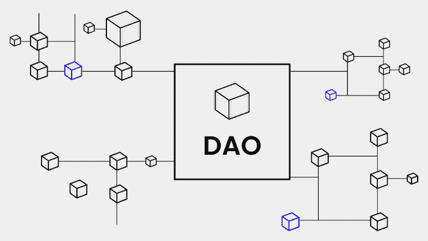
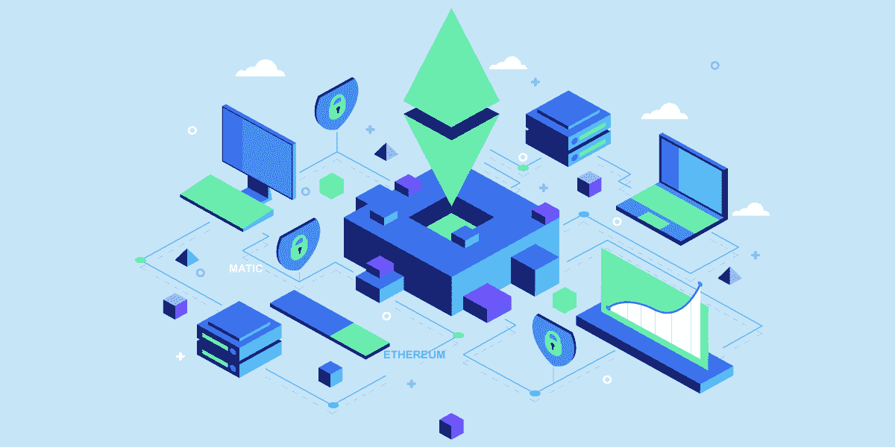
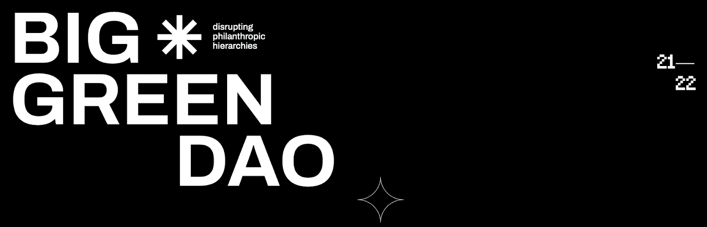
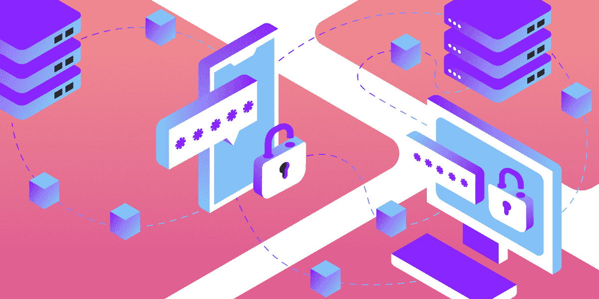

# 不同类型 Dao 的完整 2022 指南

> 原文：<https://moralis.io/full-2022-guide-to-different-types-of-daos/>

随着 Web3 行业的成熟，让 Dao(分散的自治组织)来管理数字原生实体变得越来越流行。Dao 以分散的方式提供了一种独特而有效的建立和经营企业的方式。有几个 DAO 使用案例可供探索，从 UniSwap(最著名的分散式交易所)到筹集 300 万美元支持乌克兰军队的 DAO。因此，我们将通过这篇文章来探索不同类型的 Dao，并提供每种 Dao 的真实例子。

在我们仔细研究各种 Dao 之前，我们将从理解 Dao 开始这篇文章。此外，为了理解这些组织的价值，我们还将探索 Dao 的一些好处。接下来，如果你有野心用[Moralis](https://moralis.io/)建造你自己的道，我们将简要地给你指出正确的方向。对这些组织有了更深刻的理解后，我们将更深入地研究不同的用例，并探索八种类型的 Dao。

如果你已经熟悉 Dao 和各种类型的 Dao，我们推荐你在 [Moralis 博客](https://moralis.io/blog/)查看更多内容。例如，您可以了解 [Web3 认证](https://moralis.io/authentication/)，以了解[如何认证 Web3 用户](https://moralis.io/how-to-authenticate-web3-users/)。此外，您可以随意探索其他 Moralis 功能，如[元宇宙 SDK](https://moralis.io/metaverse/) 或了解更多关于 [Web3 同步](https://moralis.io/syncs/)的信息。

因此，如果你对 [Web3 开发](https://moralis.io/how-to-build-decentralized-apps-dapps-quickly-and-easily/)特别感兴趣，一定要和 Moralis 签约。创建一个帐户是免费的，你可以[很快成为区块链开发者](https://moralis.io/how-to-become-a-blockchain-developer/)！

## 什么是刀？

在更深入地研究不同类型的 Dao 之前，我们将首先探讨这些组织的来龙去脉。一旦我们对什么是道以及它们如何工作有了更好的理解，我们将深入研究各种类型的道。

DAO 或“分散自治组织”通常是 dapp、protocol 或其他 Web3 项目的管理机构。Dao 基本上是 dapps，提供必要的能力来运行完全民主化的组织的部分或全部。这表明 Dao 有可能通过完全控制一个平台或项目来消除中央集权。

Dao 的核心是智能合同，这是这些组织去中心化的基础。智能契约可以确保特定令牌的特定持有者获得民主参与协议、项目或其他 dapp 的治理的权利。

社区通常将[智能契约](https://moralis.io/what-are-web3-contracts-exploring-smart-contracts/)指定的令牌称为“[治理令牌](https://moralis.io/what-are-governance-tokens-full-guide/)”。因此，如果您是治理令牌的持有者，您就有权参与投票和其他治理机制。这为您提供了一个直接影响平台或项目未来的机会。

社区通常将通过 DAO 进行决策的能力称为“链上治理”。由于治理机制基于区块链技术，任何拥有令牌和设备的人都有机会参与，而不受地理位置的限制。因此，Dao 在与其组织或平台相关的所有决策过程中提供了真正的权力下放。

现在，对什么是 DAO 有了更好的了解，理解 DAO 为什么重要以及它们如何能让社区和您的用户受益是很重要的！

### DAOs 有什么好处？

DAOs 有多种好处，我们无法在这篇短文中一一介绍。出于这个原因，我们将重点关注两个重要的好处，当你发展自己的 dapps 或业务时，这两个好处会被证明是有趣的。因此，我们将关注的好处是透明度和建立社区信任。

*   **透明性** —由于 Dao 通过链上治理机制发挥作用，它们利用了区块链技术。这提供了完全的透明性，因为所有参与者通常将完全访问发生在例如 Web3 [DeFi](https://moralis.io/what-is-defi-the-full-decentralized-finance-guide/) 协议上的所有变化的不可变记录。这种不可更改的记录为所有用户提供了安全性，并限制参与者实施欺诈行为。
*   **建立社区信任** —第二个优势是建立社区信任。因此，由于平台用户知道如何管理平台，它将提供如何实现变更的透明度。更重要的是，由于代币持有者是决策者，他们是掌权者，他们通常是平台的用户。因此，他们的利益往往是一致的，这可以增强社区信任。

如果你对 DAOs 有进一步的兴趣，请查看下面的指南，让你在十分钟内[创建一个 DAO](https://moralis.io/how-to-create-a-dao-in-10-minutes/) ！更重要的是，如果你更想看一段解释整个过程的视频，请观看来自 [Moralis 的 YouTube](https://www.youtube.com/c/MoralisWeb3) 频道的以下片段:

https://www.youtube.com/watch?v=sAcEJcwPTOk

上面的片段深入探讨了 Web3 开发的复杂性，并展示了如何创建一个简单的 dapp DAO。DAO 的功能允许用户使用他们的 [Web3 钱包](https://moralis.io/what-is-a-web3-wallet-web3-wallets-explained/)登录，并在特定的投票中投票，假设他们拥有适当数量的治理令牌。

## Dao 有哪些不同的类型？

现在，随着对什么是道、它们为什么重要以及如何构建道有了更好的理解，我们可以在下面的小节中更仔细地看一看不同类型的道。由于存在许多不同类型的 Dao，很遗憾我们没有时间一一介绍。因此，我们将重点关注以下八点:

1.  协议 DAOs
2.  慈善道
3.  创业道
4.  媒体 Dao
5.  社会 Moralis
6.  格兰特·道斯
7.  收藏家道斯
8.  子 DAOs

所以，事不宜迟，让我们开始研究协议 DAOs 的细节吧！

### Dao 的类型—协议 Dao

最常见的 Dao 类型之一是协议 Dao。顾名思义，这些 Dao 专注于特定的分散协议的治理。一个例子是 AAM 协议，它使用智能合同来提供像借贷这样的 DeFi 服务。另一个例子是分散式交易所，用户可以在这里购买、交换和出售加密货币。

在[以太坊](https://moralis.io/full-guide-what-is-ethereum/)区块链上使用 DAO 协议的 DeFi 应用程序的一个突出例子是 MakerDAO。这个平台使用智能合约，允许用户借出和借用密码。该协议使用 MKR 治理令牌，使持有者能够对 Maker 协议的更改进行投票。这包括年借款利率、担保债务头寸的担保金额等。

### 慈善道

与礼仪道不同，慈善道不太常见。这些组织专注于支持社会责任倡议。因此，这些 Dao 围绕一个共同的目标组织起来，对 Web3 世界产生积极的影响。

这听起来可能不可实现，有点奇怪；然而，有一些突出的例子提供了概念证明。第一批慈善道中有一个叫做大绿道，它与食物正义慈善机构 big Big Green 相关联。该慈善机构专注于教人们如何种植自己的食物，以提供更高的营养安全，减轻气候影响，并改善心理健康。

### Dao 的类型——风险 Dao

这些类型的 Dao 积累资本投资于 Web3 项目，这就是为什么它们又被称为投资 Dao。这些资金通常用于投资不同的 Web3 创业公司、链外投资、协议等。此外，这些组织的运作方式类似于传统的投资基金。然而，与中央控制的实体不同，决策是在链上以分散的方式做出的。

风险投资 DAO 的一个突出例子是 MetaCartel Ventures。这是一个与 MetaCartel 社区密切相关的营利性 DAO，旨在投资 dapp 初创公司。更重要的是，MetaCartel Ventures 是第一批专注于投资新创业公司并从中获利的 Dao 之一。因此，它们通过在项目的早期阶段提供投资来降低进入壁垒。

### 媒体 Dao

Dao 提供了广泛的用例，一个有吸引力的应用领域是媒体。传统媒体通常采用自上而下的方法，内容基于中心议程或受广告影响，媒体 Dao 为传统媒体提供了一种替代方案。媒体 Dao 通过提供由其社区驱动的内容来重塑传统媒体实践。

这可以比作社交媒体；然而，不是大企业集团控制利润，而是媒体网络内的个人赚取利润。媒体 DAO 的一个例子是无银行 DAO。这个分散的社区协调和传播无银行的媒体、教育和文化。无银行道的最终目标是推动采用一种没有银行等中介的货币体系。

### Dao 的类型—社会 Dao

社会 DAO——也经常被称为创造者 DAO——专注于 DAO 的自组织社区方面，并试图将志同道合的个人聚集在一起。因此，他们专注于将艺术家、建筑商等群体聚集在一起。

然而，即使这些组织是社区驱动的，它们通常也有某种进入的障碍。示例包括拥有特定数量的令牌、被个人邀请或拥有特定的 NFT。

开发人员 DAO 就是一个社会 DAO 的例子。这是一群致力于构建 Web3 未来的开发者。要成为这个组织的一员，人们必须持有一个创世纪 NFT 或者有特权被邀请到社区的私人 Discord 服务器。

### 格兰特·道斯

授予 DAOs 的目的是在 Web3 生态系统中战略性地部署资本资产，并促进非营利捐赠。有时，捐赠 Dao 既可以是大型项目的延伸，也可以是 DeFi 领域中完全独立的组织。

Aave 协议向空间提供了一个 Grant DAO 的例子，它被称为 Aave Grants DAO。这是一个由社区主导的项目，旨在资助推动 Aave 协议发展的项目。该组织通过支持一个更全面的社区开发者网络来实现这一目标。赠款道每季度分配一定数额的资金。提交内容包括但不限于 Aave 开发、开发者工具、集成等。

### Dao 的类型—收集器 Dao

收藏家道将会员的资金汇集在一起，这样集体社区就有可能将资金投资到艺术品和其他收藏品中。每个成员都得到与其投资相应的份额。

有时，社区称收藏家道斯为 NFT 道斯。此外，考虑到对这一领域越来越多的关注，更具体地说，广泛的 NFT 收藏，将不会奇怪地看到这些道增加。

而且收藏刀的一个例子就是火烈鸟刀，随着 [NFTs](https://moralis.io/non-fungible-tokens-explained-what-are-nfts/) 的爆发而崛起。道从不同的艺术家和收藏中收集了昂贵的 NFT，其中一个是 CryptoPunks。

如果您对 NFTs 特别感兴趣，并且想了解更多关于创建自己的令牌的知识，那么您来对地方了。Moralis 的 [NFT API](https://moralis.io/nft-api/) 让 Web3 开发变得更加容易，让你可以轻松地创建 NFT。此外，如果你对 NFT 收藏感兴趣，你可以在几分钟内[开始生成 NFT！](https://nftcoders.com/begin-generating-nfts-in-15-minutes/)

### 苏比多斯

我们将在本指南中进一步探讨的最后一种 Dao 是子 Dao。子 DAO 本质上是 DAO 成员的子集，其任务是管理特定的功能，如伙伴关系、营销、拨款、运营等。因此，这是一种从中央 DAO 分配功能的方式，允许组织通过提案，而不需要原始 DAO 的整体达成共识。

此外，实现子 DAO 的一个例子是平衡器协议。Balancer Protocol 在其 DAO 中发现了一个机会，可以创建一个子 DAO 来管理 DAO 相关的决策制定并执行提案，而无需涉及整个 DAO。因此，他们现在有潜力更有效地移动。

## Dao 的类型—摘要

Dao 有许多使用案例，从为乌克兰军队筹集资金的组织到 DeFi 协议的管理机构。因此，这表明有许多类型的 Dao 值得进一步探索。基于此，我们花时间进一步详细探讨了以下八种类型的 Dao:

1.  协议 DAOs
2.  慈善道
3.  创业道
4.  媒体 Dao
5.  社会 Moralis
6.  格兰特·道斯
7.  收藏家道斯
8.  苏比多斯

此外，除了探索不同类型的 Dao，我们还深入探讨了 Dao 的复杂性以及如何使用 Moralis 创建 Dao。此外，如果您对构建兼容 Web3 的项目有进一步的兴趣，那么您来对地方了。例如，在 Moralis，你可以学到关于 Solana 编程的所有知识，以及如何通过三步在[建立一个 Solana dapp！](https://moralis.io/how-to-build-a-solana-dapp-in-3-steps/)

此外，这种可访问性源自 Moralis 的 [Web3 API](https://docs.moralis.io/moralis-dapp/web3-api) ，允许您轻松创建跨链兼容的[dapp](https://moralis.io/decentralized-applications-explained-what-are-dapps/)。API 在很多过程中都有帮助，比如获取[链上数据](https://moralis.io/on-chain-data-the-ultimate-guide-to-understanding-and-accessing-on-chain-data/)以及促进您的项目和各种可用区块链之间的通信。

所以，如果你想创建 dapps 甚至 DAOs，请确保现在就[注册 Moralis](https://admin.moralis.io/login) 。创建一个帐户是免费的，只需要几秒钟！