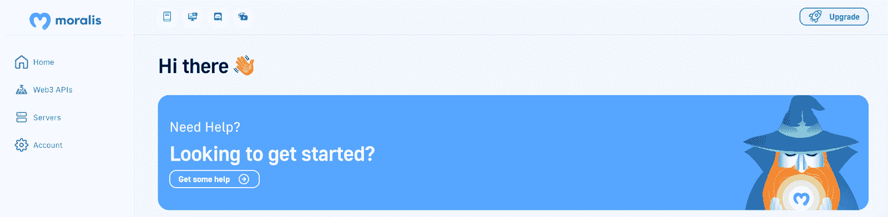
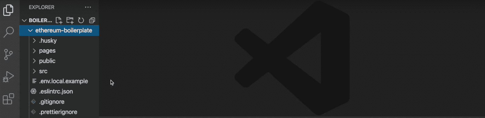
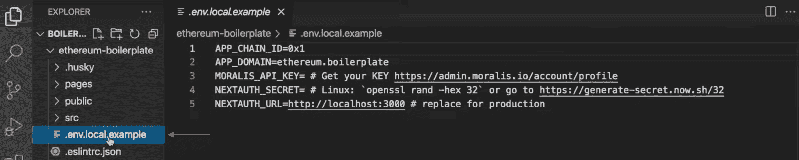
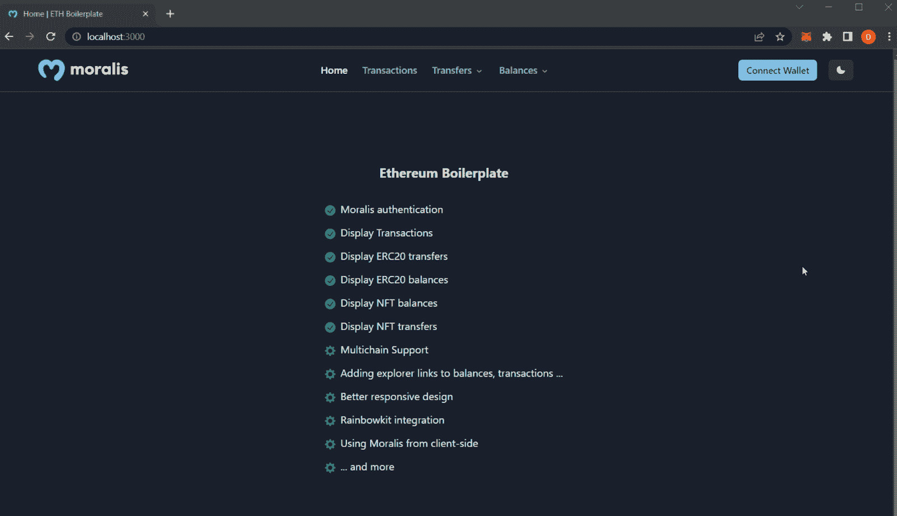
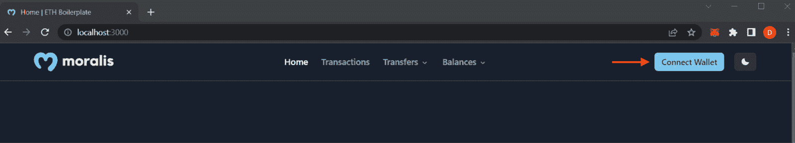
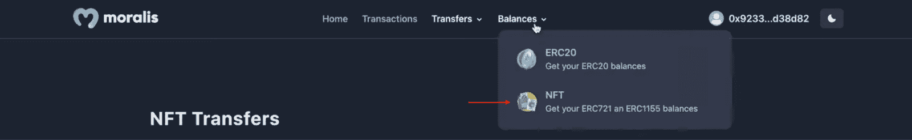

# 完整指南:如何用 5 个步骤建造以太坊 Dapp

> 原文：<https://moralis.io/full-guide-how-to-build-an-ethereum-dapp-in-5-steps/>

以太坊是最受欢迎的 [Web3 开发](https://moralis.io/how-to-build-decentralized-apps-dapps-quickly-and-easily/)网络，但是你知道吗，通过 Moralis 只需五个步骤就可以建立一个以太坊 dapp？感谢 Moralis 的以太坊样板，你现在有机会在几分钟内创建以太坊 dapps！如果这听起来很有趣，请继续学习如何建造以太坊 dapp。

**完整样板文件——**[https://github . com/ether eum-Boilerplate/ether eum-Boilerplate](https://github.com/ethereum-boilerplate/ethereum-boilerplate)**T5】**

这篇文章将展示一个最快最简单的方法来建立一个以太坊 dapp。事实上，多亏了 Moralis，你只需要简单的五个步骤就可以创建一个 dapp。然而，如果你不想经历每一步，你可以使用上面的链接直接进入 Moralis 以太坊样板代码！

此外，由于 Moralis 支持跨链兼容性，因此在为其他 [EVM](https://moralis.io/evm-explained-what-is-ethereum-virtual-machine/) 兼容链开发 dapps 时，可以使用相同的模板。因此，当与 Moralis 合作时，您不会将自己局限于一个网络，您可以轻松地为 Polygon、BNB 智能链等开发 dapps。此外，样板文件甚至兼容索拉纳！如果[索拉纳编程](https://moralis.io/solana-programming-the-ultimate-guide-to-solana-development/)让你感兴趣，看看 Moralis 的[索拉纳 API](https://docs.moralis.io/reference/solana-api) 。这个工具为 Solana network 提供了一个更加无缝的开发体验，让您可以立即创建 dapps。

所以，如果你想为索拉纳网络创建 EVM 兼容的 dapps 或项目，这并不重要；与 Moralis 家签约应该是显而易见的。此外，创建一个帐户是完全免费的，所以你不会有任何损失！

## 什么是以太坊 Dapp？

在我们向您展示如何轻松构建以太坊 dapp 之前，您必须了解什么是以太坊 dapp。因此，在说明这个过程之前，我们将回答这个问题，“什么是以太坊 dapp？”。


为了理解以太坊 dapp，我们需要探索 dapp(去中心化应用)的错综复杂。与传统的 Web2 应用程序非常相似，dapps 共享相似的特性，并且在许多情况下具有相同的功能。然而，传统应用和 dapp 之间的主要区别在于，开发者通常使用区块链技术和 Web3 功能来构建 dapp。因此，Dapps 在 P2P(点对点)区块链网络上运行，并通过智能合约的使用发挥作用，智能合约是 Web3 生态系统的重要组成部分。

随着去中心化成为这些 Web3 应用程序的主导和普遍特征，它们在几个不同的方面优于传统应用程序。也就是说，让我们探索一下 dapps 的一些主要优势:

*   **抵制审查**–集中化的一个重大缺陷是单点故障问题。去中心化消除了这一缺陷，使得单一实体和政府不可能审查或阻止网络或 dapp。
*   开源–dapp 是开源的并不罕见。这鼓励了整个 Web3 生态系统的发展，并极大地促进了加密领域的创新。
*   **区块链兼容**–由于 dapps 位于区块链，并通过智能合约发挥作用，因此将加密货币功能集成到这些应用中变得很容易。

现在，随着对 dapps 及其好处有了更好的理解，它们在以太坊网络的上下文中到底是什么？如前所述，dapps 很像建立在区块链网络之上的传统应用。因此，以太坊 dapp 本质上是建立在以太坊区块链上的应用程序。

## 分 5 步建造以太坊 Dapp

随着对 dapp 和去中心化带来的好处有了更深刻的理解，我们可以进入主题，向您展示如何快速构建以太坊 dapp。为了让你的生活更容易，我们将使用 Moralis 的以太坊样板代码。有了这个模板，结合 Moralis 的诸多优势，如平台的 [Web3 认证](https://moralis.io/authentication/)功能，您将能够通过以下五个步骤构建一个以太坊 dapp:

1.  **创建 Moralis 账户**
2.  **克隆 GitHub 库**
3.  **配置环境变量**
4.  **启动 Dapp**
5.  **测试 Dapp**

此外，向你们展示我们努力的方向；这是最终应用程序的打印屏幕:


该应用程序将允许您使用元掩码钱包来验证自己的身份。一旦您的 [Web3 身份](https://moralis.io/web3-identity-the-full-guide-to-authentication-identity-and-web3/)得到确认，您就可以访问大量关于您的资产和以前交易的信息。如上图所示，你有很多不同的标签，比如“交易”、“转账”和“余额”。然而，在最后一节中，当测试一切都正常工作时，我们将更深入地研究这些选项卡的细节。

然而，如果你更喜欢看 YouTube 视频来学习，看看下面来自 [Moralis 的 YouTube 频道](https://www.youtube.com/c/MoralisWeb3)的剪辑。该视频涵盖了本指南的所有方面以及 GitHub 资源库中代码的复杂性。

https://www.youtube.com/watch?v=Bb5Pc–kyAY

尽管如此，如果你跟着做，我们将从深入第一步开始教程，并向你展示如何创建一个 Moralis 帐户！

### 步骤 1:创建 Moralis 账户

为了建造一个以太坊 dapp，你首先需要的是一个 Moralis 账户。创建一个 Moralis 账户很简单，只需要几秒钟。更重要的是，注册 Moralis 是完全免费的！

但是，如果你已经有一个帐户，你可以跳过这一部分，直接进入第二步。

然而，要开始，你需要导航到“ [moralis.io](http://moralis.io/) ”并点击右上角的“免费开始”按钮:


这将打开一个新窗口，这将是注册表单。此外，您只需输入您的电子邮件，创建一个新密码，确保选中“我接受…”框，然后点击“注册”:


现在就是这样；你现在有了一个 Moralis 账户，它提供了一些你需要的必需品。注册并登录您的帐户后，您会在 Moralis 界面的左侧看到一个导航栏:



然而，我们现在将离开这些，并在本教程的第三步中探索您的一些选项。因此，现在您已经成功地设置了您的帐户，我们将进入第二阶段，仔细看看如何将 Moralis 的以太坊样板文件克隆到您的本地存储库中！

### 步骤 2:克隆 GitHub 存储库

在教程的这一部分，我们将向您展示如何将 GitHub 存储库(我们在简介中链接到了它)克隆到您的本地设备上。此外，我们将在本教程中使用 VSC (Visual Studio 代码)。然而，您可以自由地使用任何 IDE(集成开发环境)，但是过程有时可能会有所不同。尽管如此，这个过程不会有很大的不同，即使你没有使用 VSC，你也很可能能够跟上我们的进度。

您需要做的第一件事是使用简介中的链接打开 GitHub 存储库。你也可以用“以太坊样板”查询谷歌，回购应该是第一个出现的链接。在这里，您可以继续操作，单击右侧的“Code”按钮，复制存储库的 URL:


现在，有了 URL，您可以导航回 VSC(或您首选的 IDE)。接下来，您可以继续创建一个新文件夹。在这种情况下，我们将称我们的为“样板”。有了这个文件夹，您需要打开一个新的终端。如果您使用的是 VSC，您可以点击界面顶部的“终端”选项卡，然后点击“新建终端”:


从那里，确保您位于与您先前创建的文件夹相对应的正确位置。然后使用之前在终端中获取的链接运行以下命令:

```js
git clone “BOILERPLATE_URL”
```

这将把项目克隆到您的本地存储库中，您可以通过在终端中输入以下内容来确保导航到该项目:

```js
cd ethereum-boilerplate
```

如果您在合适的位置运行所有正确的命令，它在您的 IDE 中将看起来像这样:



### 步骤 3:配置环境变量

既然您的本地设备上已经有了以太坊样板文件，那么您需要配置一些变量。因此，您需要导航到“. env.local.example”文件:



如上图所示，该文件包含五个环境变量。本节将逐一介绍，并向您展示必要的配置。

第一个是“ *APP_CHAIN_ID”，*，最初等于“ *0x1”。*这是以太坊的链 ID，当你想要建立一个以太坊 dapp 时，你可以保持原样。第二个“ *APP_DOMAIN* ”变量也是如此，可以保持不变。

接下来，您必须将变量“ *MORALIS_API_KEY* 设置为您的 API 密钥。这是你的 Moralis 账户进入画面的地方，因为这是你获取钥匙的地方。因此，您可以导航回 Moralis 管理面板。接下来，您需要单击“Account”，选择“Keys”选项卡，然后复制“Web3 Api Key”。现在您有了密钥，您可以设置“ *MORALIS_API_KEY* ”变量等于这个值。


此外，您还必须为变量“ *NEXTAUTH_SECRET* 创建一个值。如果你需要这方面的帮助，使用下面的链接来生成一个密钥:【https://generate-secret.now.sh/32。然后，您可以将“ *NEXTAUTH_SECRET* ”变量设置为该值。

最后，您有“ *NEXTAUTH_URL* ”，它被设置为“ [http://localhost:3000](http://localhost:3000/) ”。它可以保持与您当前在开发过程中相同的状态。这允许您在安全的环境中测试 dapp。然而，一旦您决定继续前进并启动 dapp，这需要等于 dapp 的 URL。

完成所有配置后，剩下的就是将文件名改为“. env.local”！

最终" . env.local "代码:

```js
APP_CHAIN_ID=0x1
APP_DOMAIN=ethereum.boilerplate 
MORALIS_API_KEY= "YOUR_API_KEY"
NEXTAUTH_SECRET= b8e786967d7bcbc0f920d35bcc3f891c
NEXTAUTH_URL=http://localhost:3000
```

### 步骤 4:启动 Dapp

关于如何构建以太坊 dapp 指南的第四步，我们将快速向您展示如何启动应用程序。但是，在这样做之前，您需要安装必要的依赖项，这可以通过以下方式之一来完成:

```js
npm i
yarn
```

安装完依赖项后，通过以下命令之一运行本地开发服务器:

```js
npm run dev
yarn run dev
```

这应该可以让以太坊 dapp 在 localhost 3000 上运行。您可以使用下面的链接来访问应用程序，并测试一切是否正常运行:“ [http://localhost:3000](http://localhost:3000/) ”。

### 步骤 5:测试 Dapp

如果您通过上一步中的链接访问以太坊 dapp，它会将您带到以下登录页面:



为了测试 dapp 的功能，你需要用你的钱包来验证你自己。为此，您可以点击右上角的“连接钱包”按钮:



这将提示您的元掩码钱包，并允许您签署一封邮件。认证后，您可以浏览顶部的选项卡。“交易”标签将在一个整洁的表格中显示您的所有交易，包括哈希、地址、汽油费用等信息。：


此外，其他两个选项卡允许您查看转账和余额。此外，这些允许您在 ERC-20 令牌和 NFT 之间切换。例如,“余额”选项卡将允许您选择 NFTs:



如果您点击此选项，您钱包中包含的所有非功能性桌面将会很好地显示出来:


这就是本教程关于如何构建以太坊 dapp 的基本内容！如果你可以用你的钱包登录，并查看不同的标签，你会知道该应用程序的工作。但是，您可以更详细地研究样板文件。请务必继续查看您可以在 GitHub repo 中找到的文档，因为 Moralis 将不断更新样板文件久而久之！

既然您已经知道了如何使用 Moralis 的以太坊样板构建以太坊 dapp，那么您可以自由地定制模板以满足您的开发需求。因此，您可以添加或删除任何您认为不必要的功能！

## 如何构建以太坊 Dapp–总结

多亏了 Moralis 的以太坊样板，只需五个简单的步骤就可以构建一个以太坊 dapp:

1.  **创建 Moralis 账户**
2.  **克隆 GitHub 库**
3.  **配置环境变量**
4.  **启动 Dapp**
5.  **测试 Dapp**

该应用程序允许用户使用他们的元掩码钱包登录。登录后，他们可以选择查看交易、转账和帐户余额。然而，这只是一个模板，您可以根据潜在用户的需求定制应用程序。

提供这种可访问性的工具之一是 Moralis 的 Web3 [Auth API](https://docs.moralis.io/reference/auth-api-overview) 。该 API 允许您轻松实现几种不同的 Web3 认证机制，它们是 T2 EIP-4361 T3 标准的实现。如果你想在你的应用中实现除 MetaMask 之外的方法，你可以在 Moralis 的 [Web3 博客](https://moralis.io/blog/)找到额外的指南。例如，查看我们的"[添加一个带魔法的登录。链接](https://moralis.io/add-sign-in-with-magic-link-to-your-nextjs-project-in-5-steps/)或[用 RainbowKit](https://moralis.io/how-to-add-a-sign-in-with-rainbowkit-to-your-project-in-5-steps/) 添加签到文章！

此外，Web3 认证机制的简单集成只是 Moralis [连接 Web2 和 Web3](https://moralis.io/web2-to-web3-bridging-web2-and-web3/) 的一种方式。例如，你也可以轻松实现 [Web3 streams](https://moralis.io/streams) 或者创建你自己的 [Web3 webhooks](https://moralis.io/web3-webhooks-the-ultimate-guide-to-blockchain-webhooks/) 。

所以，如果你想建立一个以太坊 dapp，[立即向 Moralis](https://admin.moralis.io/register) 注册！您可以免费创建您的帐户，并充分利用该平台的优势。