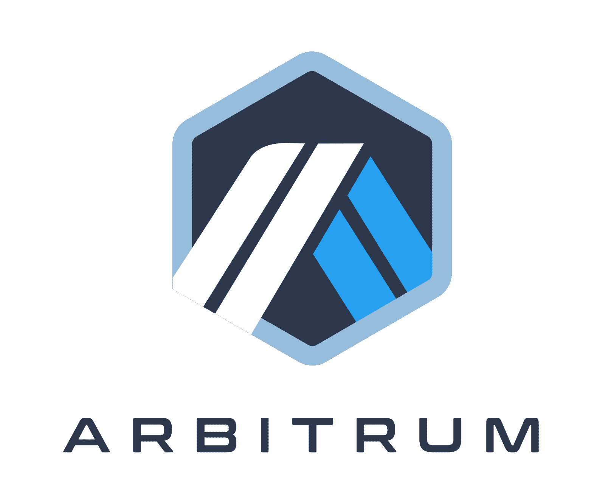
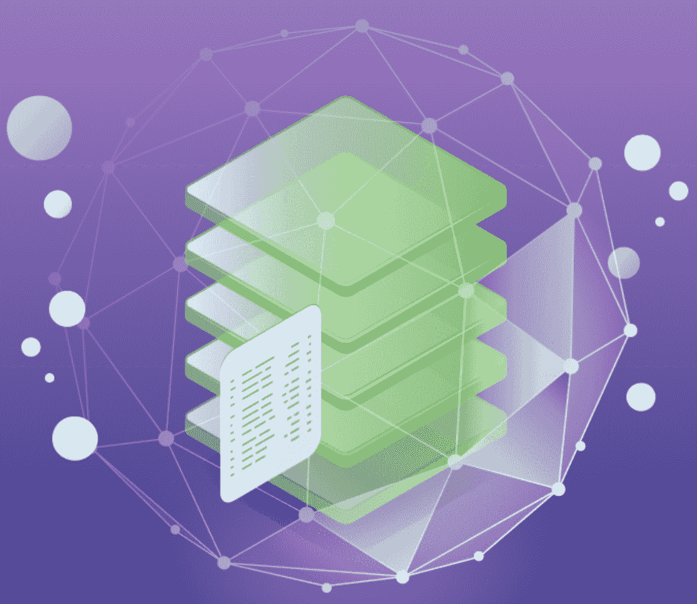
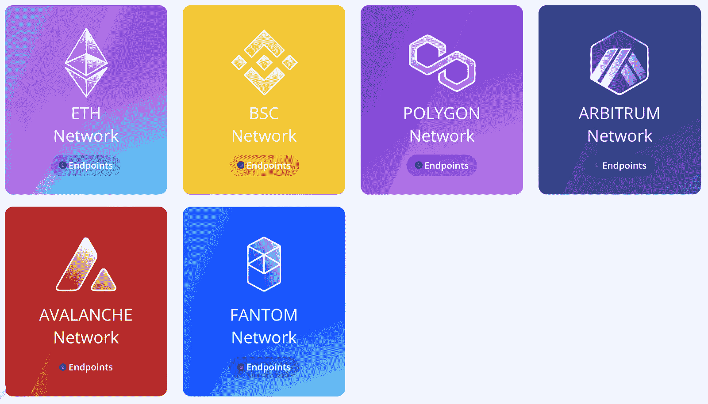
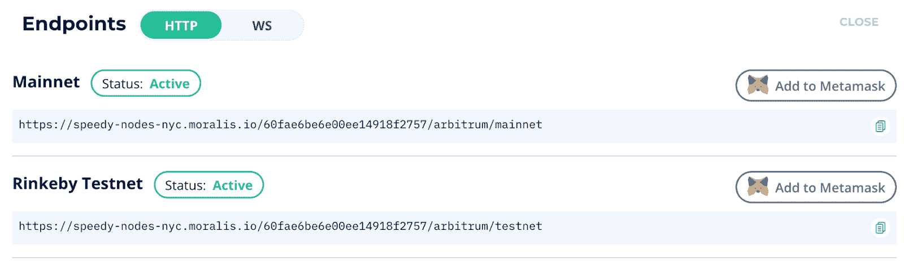

# 完整指南——如何连接 Arbitrum 节点

> 原文：<https://moralis.io/full-guide-how-to-connect-to-arbitrum-nodes/>

**如果你想为 Arbitrum 网络开发 dApps**[](https://moralis.io/how-to-build-decentralized-apps-dapps-quickly-and-easily/?utm_source=blog&utm_medium=post&utm_campaign=How%2520to%2520Connect%2520to%2520Ethereum%2520Nodes)****(分散式应用)，你可能会发现你需要一个 Arbitrum 节点提供商，或者你需要直接连接到 Arbitrum 节点。节点是任何区块链基础设施的基本组成部分，它们保存着网络的所有相关信息。它们还充当端点，使用户和应用程序能够与区块链进行交互。节点对于** [**dApp**](https://moralis.io/decentralized-applications-explained-what-are-dapps/) **开发非常关键，这表明在 Arbitrum 上开发时需要 Arbitrum 节点。然而，连接到 Arbitrum 节点的最简单方法是什么？这就是我们在这篇文章中要回答的问题。因此，如果你有兴趣，请继续阅读，因为我们将提供关于如何连接到 Arbitrum 节点的完整分析。****

**获取 Arbitrum 节点最简单快捷的方法是 [Moralis](https://moralis.io/) 。Moralis 是 [Web3](https://moralis.io/the-ultimate-guide-to-web3-what-is-web3/) 开发的头号操作系统，Moralis 提供的许多有价值的服务之一是快速节点。Moralis 的快速节点为 Arbitrum 这样的网络提供快速可靠的节点。然而，我们将在本文后面更详细地讨论速度节点。**

**Moralis 使区块链开发变得更加容易，因为所有用户都可以访问已经开发好的后端基础设施。因此，这允许开发人员更多地关注前端开发，并避免设置底层后端基础设施的麻烦过程。使用 Moralis，你可以做任何事情，从建立一个 [NFT 交易界面](https://moralis.io/build-an-nft-trading-interface-full-guide/)到学习如何[创建一个免费令牌](https://moralis.io/create-free-token-how-to-deploy-your-own-testnet-crypto-token-in-10-mins/)。所以，如果你想让[成为一名区块链开发者](https://moralis.io/how-to-become-a-blockchain-developer/)，朝着正确方向迈出的第一步就是与 Moralis 签约。加入是完全免费的，你可以立即获得像 Speedy Nodes 这样的工具！**

### **什么是 Arbitrum？**

**如果你熟悉区块链行业和 Web3 开发，那么你可能已经亲身经历过[以太坊](https://moralis.io/full-guide-what-is-ethereum/)的可扩展性问题。随着以太坊网络和区块链的发展势头越来越猛，网络变得越来越拥挤，使得进行交易变得不合理地昂贵。然而，有大量的解决方案可以解决这个问题。可以说，Arbitrum 是这些寻求改善以太坊可伸缩性的项目之一。**

**

从技术上讲，Arbitrum 是以太网的第二层可伸缩性解决方案。Arbitrum 是一个平台，通过提高速度和可扩展性来改善基于以太坊的智能合约的功能。该平台兼容 [EVM](https://moralis.io/evm-explained-what-is-ethereum-virtual-machine/) (以太坊虚拟机)，使得运行未经修改的以太坊[智能合约](https://moralis.io/smart-contracts-explained-what-are-smart-contracts/)成为可能。

Arbitrum 是 [Offchain Labs](https://offchainlabs.com/) 的成果，该平台利用了一种称为交易汇总的技术，其中批量交易被记录在以太坊主网上，并在可扩展的第二层解决方案上执行。这一切都发生在 Arbitrum 通过在主链上保存记录来利用以太坊区块链的安全性的时候。

尽管 Arbitrum 着手解决以太坊的可扩展性问题，但它不是市场上唯一的解决方案。还有其他几种类似的解决方案；然而，以下是 Arbitrum 大放异彩的三个原因:

*   **高 EVM 兼容性** — Arbitrum 与基于以太坊的合约高度兼容，因为该平台在字节码级别与 EVM 兼容。这表明，[可以创建智能合同](https://moralis.io/how-to-create-smart-contracts/)，例如，使用[可靠性](https://moralis.io/solidity-explained-what-is-solidity/)和 Vyper 开箱即用。
*   **低费用** — Arbitrum 不仅提供缩短区块链交易时间的解决方案。但它大大降低了交易成本，使区块链的发展在经济上更具可持续性。
*   **已建立的生态系统** — Arbitrum 确实已经建立了一个生态系统，因为他们目前正在与 dApps 和区块链的项目合作，如 Uniswap、Sushi 等。

### 解释 Arbitrum 节点

如果你是 Moralis 博客的老读者，你可能已经通过像“[什么是归档节点”这样的文章熟悉了节点的概念。](https://moralis.io/what-are-full-archive-nodes/)”。不过，不用担心；如果你是密码世界的新手，我们将提供一个简短的解释。



节点是任何区块链基础设施的重要组成部分，它们保存着有关网络的重要信息。每个区块链由几个相互通信的节点组成，这意味着它们都是互连的。当他们通信时，他们共享关于交易的信息以保持区块链的安全。

区块链节点的主要功能通常是验证新块。因此，节点可以拒绝或接受链上发生的事务。如果一个节点接受一个事务，该信息将存储在其他块的顶部，并与其他节点共享。然而，根据网络的不同，节点可以有不同的功能，尽管最常见的功能是保持网络安全并对参与者开放。

此外，节点也是各种链的端点。这意味着区块链节点充当区块链的接入点。因此，它们是用户和应用程序直接与链交互的网关，例如，执行交易。此外，它也可以是应用程序访问存储在链网络上的信息的一种方式。

那么，什么是仲裁节点呢？。它基本上是 Arbitrum 网络的一个节点。这意味着 Arbitrum 节点是与第 2 层解决方案交互的一种方式，也是保持网络安全的一个组件。

### 为什么需要连接节点？

同样，通常情况下，连接到节点的需求可能是不言而喻的，也可能是令人困惑的，这取决于您使用节点的实际经验。因此，首先让我们简要地解释一下为什么需要连接到节点。因此，当您想要连接到 Arbitrum 节点提供者时，您可以确保拥有所有必要的信息。


为什么需要连接到节点的简短答案是，这对于 Web3 和 dApp 开发是必不可少的。正如我们在上一节中提到的，节点是端点，这意味着它们是 dApps 与链通信、进行事务处理等的接入点。因此，节点对于区块链的发展至关重要，因为它们是我们的项目与各个区块链沟通的一种方式。

然而，手动设置、运行和持续管理您自己的节点的过程是非常累人的。尽管在新兴的 dApp 和 Web3 行业中扮演着重要的角色，但无论对小型公司还是大型公司来说，使用节点都是一项挑战。从本质上讲，这些问题源于运行自己的节点的过程非常耗时、极其复杂且资源密集。尽管如此，仍然有对节点的真正需求。因此，越来越多的开发者转向所谓的区块链节点提供商。

尽管 Moralis 充当区块链节点提供商，但它的作用远不止于此。Moralis 为开发人员提供了管理 Web3 后端基础设施的成熟工具，没有任何常见的麻烦。事实上，使用 Moralis 的开发人员可以在几分钟和几小时内开发 dApps，而不是几周或几个月。如果你认为这听起来好得不像是真的，一定要看看我们的流行指南，看看如何[建造以太坊 dApps](https://moralis.io/ultimate-guide-how-to-build-ethereum-dapps/) 。

# 如何用 Moralis 快速节点连接 Arbitrum 节点

如何连接到 Arbitrum 节点的第一步是注册 Moralis。注册是完全免费的，你可以使用这个平台的所有工具，在这里，你可以找到 Moralis 的 Speedy Nodes。

一旦登录到您的帐户，您将能够在 Moralis 界面左侧的导航栏中找到“Speedy Nodes”选项卡。要找到节点，你需要做的就是点击这个选项，你会看到六个不同的网络。在备选方案中，您可以找到 Arbitrum 网络。要访问 Arbitrum 节点，你只需点击有问题的网络的“端点”按钮，就会出现一对 URL。



列表中的第一个备选项是 Arbitrum mainnet 的端点；同时，第二种选择是 Rinkeby testnet。这意味着您可以根据您的开发需求选择两种不同的替代方案。这就是你如何使用 Moralis 获得 Arbitrum 节点；然而，“端点”到底是什么意思呢？

## 如何连接 Arbitrum 节点— Moralis 端点

当点击“端点”按钮时，呈现给我们的 URL 可以被视为节点本身。因此，我们可以利用 URL 将我们的项目连接到 Arbitrum 网络。这意味着，例如，可以在命令行中直接与 URL 进行交互。本质上，这意味着 URL 是我们连接项目和 dApps 与 Arbitrum 网络交互的网关。



因此，这些节点的可能性是无限的，但是当它们派上用场时，我们将为您提供两个简短的示例。首先，我们可以在开发 dApps 时利用端点 URL，例如，可以查询当前块号的链。为此，我们需要做的就是复制 URL 并将其定义为一个变量。有了定义的变量，我们就可以简单地利用 Web3 库连接到网络。这个过程看起来像这样:

```js
const NODE_URL = "YOUR SPEEDY NODE URL HERE";
const provider = new Web3.providers.HttpProvider(NODE_URL);
const web3 = new Web3(provider);
```

在此之前，您还需要导入 Web3 库；然而，你会在 [Moralis 文档](https://docs.moralis.io/speedy-nodes/connecting-to-rpc-nodes/connect-to-eth-node)中找到关于如何做的清晰解释。文档解释了[如何连接以太坊节点](https://moralis.io/how-to-connect-to-ethereum-nodes/)；然而，对于 Arbitrum 网络来说，这个过程并没有明显的不同。

端点派上用场的第二个例子是在更改元掩码网络时。如果你有元掩码作为浏览器扩展，你需要做的就是点击“添加到元掩码”按钮。

### 探索 Moralis 的快速节点

在整篇文章中，我们不断提到 Moralis 的[快速节点](https://moralis.io/speedy-nodes/)。因此，我们更深入地研究这个 Moralis 工具是合乎逻辑的。如果你已经是 Moralis 的用户，你会知道 Moralis 的快速节点是一个非常受欢迎的功能。从本质上讲，Moralis 快速节点可以让您访问所有与普通节点相同的功能。


此外，Moralis Speedy Nodes 与所有 Moralis 服务完全集成。这意味着您将能够快速轻松地构建 dApps。此外，考虑到 Moralis 的快速节点只是 Moralis 的许多功能之一。尽管它使连接到 Arbitrum 节点基础设施变得异常容易。

因此，Moralis 快速节点有效地使 Moralis 成为最易于使用和最强大的区块链节点提供商之一。更重要的是，看到 Moralis 不断推出对新的链和特性的支持，很容易理解为什么许多人已经选择了 Moralis。

## 如何连接 Arbitrum 节点—总结

节点对于区块链的基础设施至关重要，因为它们提供安全性，并在本质上使网络运转。此外，节点也是非常有用的开发工具，因为它们为我们的项目提供了一种与各种区块链通信的方式。因此，我们可以使用节点[获得用户 ERC-20 令牌余额](https://moralis.io/how-to-get-user-erc-20-tokens-in-4-steps/)，部署合同，甚至改变[元掩码](https://moralis.io/metamask-explained-what-is-metamask/)网络。然而，获取节点并不总是一帆风顺的，因为自己运行一个节点会非常麻烦。因此，找到像 Moralis 这样可靠的节点提供商至关重要。

作为 Moralis 的用户，你可以免费使用 Speedy Nodes 服务，在这里你可以找到六个不同网络的区块链节点。Moralis 提供的节点不仅速度快，而且高度可靠，这使得区块链开发更容易实现。然而，Moralis 的快速节点应该用于正确的目的，因为用户并不总是正确地利用它们。有关这方面的更多信息，请阅读下面关于[以太坊 RPC 节点](https://moralis.io/ethereum-rpc-nodes-what-they-are-and-why-you-shouldnt-use-them/)的文章，解释何时不使用区块链节点。

此外，这只是 Moralis 的冰山一角。Moralis 提供了额外的开发工具，如 [NFT API](https://moralis.io/ultimate-nft-api-exploring-moralis-nft-api/) 、[价格 API](https://moralis.io/introducing-the-moralis-price-api/) 、对 [IPFS](https://moralis.io/what-is-ipfs-interplanetary-file-system/) 、 [Moralis SDK](https://moralis.io/exploring-moralis-sdk-the-ultimate-web3-sdk/) 等。因此，如果你想[建立你的第一个 dApp](https://moralis.io/build-your-first-dapp-ethereum-tutorial/) 并进入区块链发展，那么第一步应该是[与 Moralis 家](https://admin.moralis.io/register)签约。它是完全免费的，你可以立即使用该平台的所有工具，所以你不会有任何损失！**