# 完整指南:如何上传到 IPFS

> 原文：<https://moralis.io/full-guide-how-to-upload-to-ipfs/>

毫无疑问，互联网是当今社会最重要的发明之一。世界上大多数人每天都在使用互联网进行网上银行、投资和教育等活动。然而，尽管网络在我们的日常生活中至关重要，但目前的系统仍然受到缺陷的困扰。互联网的一些问题源于集中化，这使得去中心化成为一个热门话题。就这样，去中心化的 [**Web3**](https://moralis.io/the-ultimate-guide-to-web3-what-is-web3/) **系统和** [**dApps**](https://moralis.io/decentralized-applications-explained-what-are-dapps/) **被开发出来，其中最令人兴奋的一个项目就是 IPFS(星际文件系统)。这是一个基于内容而不是位置存储文件的分布式系统。然而，即使 IPFS 已经发展得相对广泛，许多人仍然不知道如何在这个系统中存储文件。因此，我们将在这篇文章中仔细研究如何使用**[**Moralis**](https://moralis.io/?utm_source=blog&utm_medium=post&utm_campaign=Want%2520the%2520latest%2520in%2520%253Cspan%253EBlockchain%2520Development%253F%253C%252Fspan%253E)**向 IPFS 上传文件。**

如果没有合适的底层基础设施，将文件上传到 IPFS 可能是一项相当艰巨的任务。然而，这正是 Moralis 平台所提供的，使得用一行代码就可以将文件上传到 IPFS。这使得在构建区块链项目时节省宝贵的时间和资源成为可能。因此，在开发 dApps 时，您可以利用 Moralis 为 IPFS 提供的本地支持来存储文件。

此外，Moralis 还提供了其他工具的选择，如[Moralis Speedy Nodes](https://moralis.io/speedy-nodes/)[Moralis web 3 API](https://docs.moralis.io/moralis-web3-rest/deep-index-api)[NFT API](https://moralis.io/ultimate-nft-api-exploring-moralis-nft-api/)等等。如果你想成为一名 dApp 开发者，马上注册 Moralis。该平台将显著缩短您所有区块链项目的上市路线，使其变得轻而易举！

### 什么是 IPFS(星际文件系统)？

IPFS 或“星际文件系统”由公司协议实验室于 2015 年开始开发。IPFS 是一种分散式协议，用于存储网站、应用程序和文件等数据。IPFS 的主要好处是，它消除了中央集权的一些问题，如单点故障和审查。

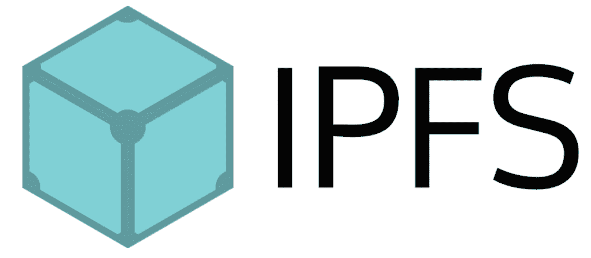

通过使用基于内容寻址的概念，IPFS 能够实现分散存储系统。许多其他系统利用基于位置的寻址，这意味着内容是根据数据的位置找到的。在基于内容的寻址中，我们根据内容本身来查找内容。因此，我们不需要告诉我们的计算机文件在哪里，而是可以查询我们想要什么。

这个系统允许我们分发内容，而不是把所有东西都集中在一个服务器上。因此，没有一个实体控制数据，因此不能审查内容。通过分发，我们还可以消除与集中化相关的单点故障问题。

然而，这些只是 IPFS 的基本情况。如果你想了解更多关于该系统如何工作的信息，我们推荐下面这篇来自 Moralis 博客的文章，它更详细地解释了:[什么是 IPFS？](https://moralis.io/what-is-ipfs-interplanetary-file-system/) ”。

# 如何通过 6 个简单步骤上传到 IPFS

由于 Moralis 拥有 IPFS 的原生支持，将文件上传到 IPFS 的过程变得相对简单。因此，我们只需要一行代码就可以上传文件。为了展示使用 Moralis 的强大功能，我们将在本文中创建一个简单的 dApp，用户可以在这里上传文件，比如 [NFTs](https://moralis.io/non-fungible-tokens-explained-what-are-nfts/) 到 IPFS。

我们将创建一个基本的 UI(用户界面),带有几个输入框和一个执行代码的按钮。因此，用户将能够输入名称、元数据描述和图像。只需点击一个按钮，他们就能把自己的信息上传到 IPFS。此外，我们将能够在几分钟内创建这个 dApp，这个过程可以分为六个不同的步骤:

1.  创建一个 Moralis 服务器。
2.  从 Moralis 导入样板代码。
3.  创建登录功能。
4.  创建上传图像的功能。
5.  创建上传元数据对象的功能。
6.  创建一个函数来执行代码。

在创建 dApp 之前，我们首先需要一个 Moralis 账户。其中一个原因是我们需要初始化 Moralis，为此，我们需要创建自己的服务器。所以，如果你没有帐号，你可以先注册。一旦你有了一个帐户，我们就可以开始第一步，建立我们自己的 Moralis 服务器。

## 第一步:创建一个 Moralis 服务器

因此，流程的第一步是创建一个 Moralis 服务器。要做到这一点，我们需要做的就是点击 Moralis 界面右上角的“+创建一个新服务器”。

如果我们点击这个按钮，会出现一个小下拉菜单，有三个不同的选项。对于本教程来说，选择哪一个并不重要。然而，我们将选择“Mainnet 服务器”替代方案。如果选择了任何一个选项，我们将会看到一个新的窗口，我们需要在这里输入一个名称，选择一个地区，然后选择网络。由于 Moralis 支持跨链兼容，我们可以选择多个网络。

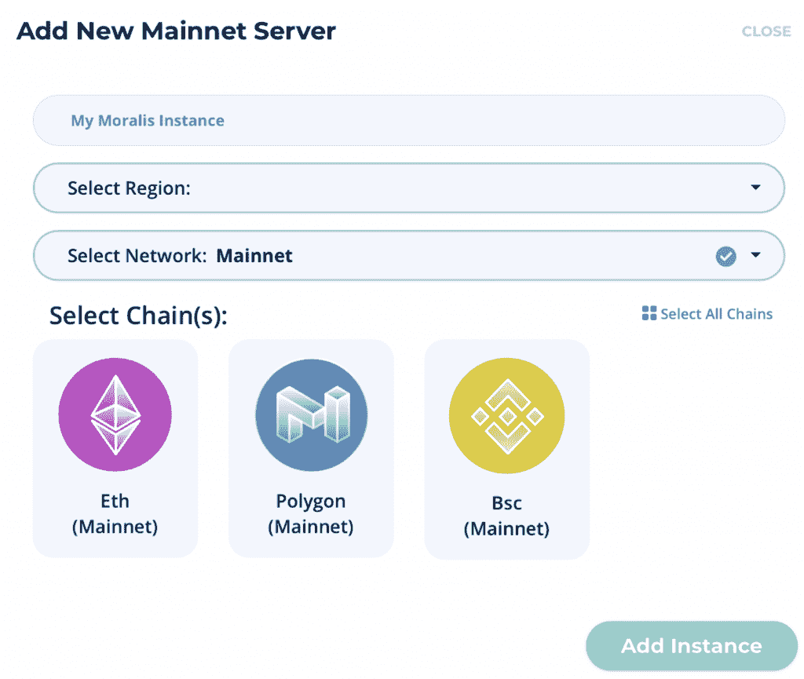

完成所有选项后，我们可以点击“添加实例”按钮来启动实例。这可能需要一段时间，但服务器很快就会启动并运行。

有了服务器，我们可以点击“查看详情”按钮。这将为我们提供各种信息。从细节来看，我们主要对“服务器 URL”和“应用程序 ID”感兴趣。我们可以继续复制此信息，因为我们将在下一步中使用它。

## 步骤 2:如何上传到 IPFS——从 Moralis 导入样板代码

一旦我们有了服务器、服务器 URL 和应用程序 ID，我们就可以继续创建应用程序本身。在我们从 Moralis 获取样板代码之前，我们需要创建一个 HTML 文件。我们将该文件命名为“ipfs.html ”,但是您可以随意命名。

一旦我们准备好了文件，我们就可以访问 [Moralis 文件](https://docs.moralis.io/guides/build-a-simple-dapp-in-3-minutes) 。我们需要做的就是将代码复制并粘贴到我们的 HTML 文件中。这是直接来自 Moralis 的代码的样子:

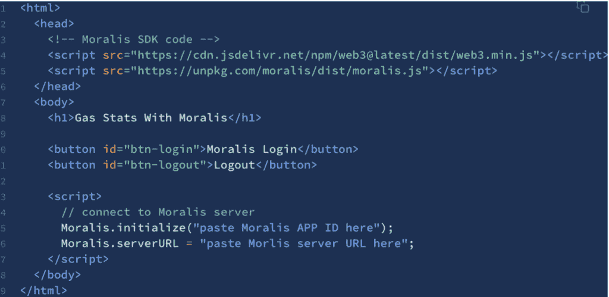

代码做的第一件事是安装 Moralis SDK(软件开发工具包)。一旦安装了 SDK，我们就继续编写 HTML 代码。最初，样板代码包含两个按钮，一个用于登录，一个用于注销。对于这个演示，我们将删除这些并实现一些我们自己的字段和按钮。

首先，我们将标题改为“IPFS 演示”。之后，我们添加一个登录按钮，后跟一个元数据名称的输入字段。然后，我们为元数据描述添加一个文本区域，后面是一个文件的输入字段。最后，我们有一个按钮，它承载一个触发我们的一个函数的“onclick”事件。因此，这就是编辑后的 HTML 代码的样子:

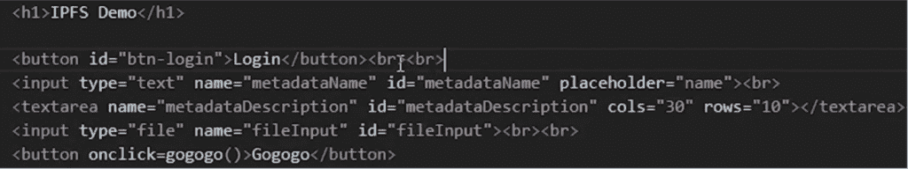

现在，这一步剩下的就是初始化 Moralis。为此，我们需要实现在上一步中获取的服务器 URL 和应用程序 ID。然后，我们将在样板代码的最后两行输入这两个元素。

## 第三步:如何上传到 IPFS —创建登录功能

现在，随着服务器的启动和运行以及样板代码的实现，我们可以继续创建 dApp 的第一个功能了。我们将开发一个登录功能，允许用户通过 [元掩码](https://moralis.io/metamask-explained-what-is-metamask/) 验证自己。

我们可以从创建一个名为“login()”的异步函数开始。同样，我们可以从 [Moralis 文档](https://docs.moralis.io/moralis-server/users/crypto-login) 中获取一个模板，并将其复制粘贴到我们的函数中。Moralis 模板如下所示:

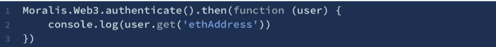

模板的第一行代码实际上是我们所需要的，这使得第二行代码有些过时。但是，我们将保留它，但要确保运行“console.log('logged in ')”而是让我们意识到发生了什么。因此，这就是我们函数的最终结果:

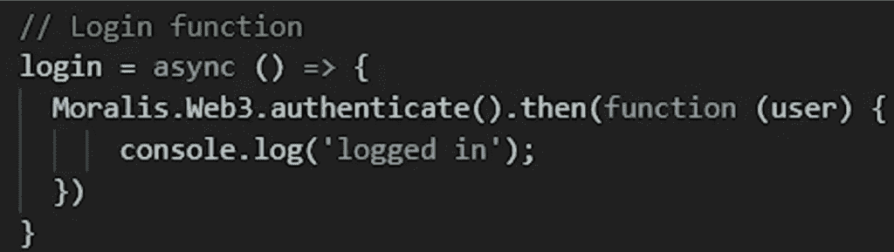

默认情况下，通过元掩码使用 Moralis 对用户进行身份验证。因此，一旦该功能被触发，用户的元掩码扩展将打开，允许他们通过自己的钱包进行身份验证。但是，也可以使用例如 WalletConnect 进行身份验证。如果你有兴趣了解这是如何做到的，Moralis 博客 的 [提供了一篇关于](https://moralis.io/blog/) [如何使用 WalletConnect](https://moralis.io/how-to-connect-users-with-walletconnect/) 认证用户的优秀文章。

## 第四步:如何上传到 IPFS —上传图片功能

我们将继续创建另一个向 IPFS 上传图片的异步函数。我们可以将这个函数称为“uploadImage()”，与前一个函数一样，我们将从 [Moralis 文档](https://docs.moralis.io/moralis-server/files/ipfs) 中获取必要的代码。我们只需要复制下面的代码并粘贴到我们的上传函数中:

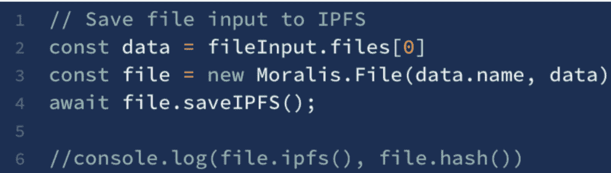

代码首先用文件输入的第一个元素创建一个新变量。之后，代码用上传的文件名和数据创建一个 Moralis 文件。现在，有了一个 Moralis 文件，代码通过调用“saveIPFS()”函数将文件保存到 IPFS。

文件保存到 IPFS 后，我们可以访问文件的 URL 和散列。用于访问这两个元素的命令位于上图中注释掉的行中。我们可以将这两种方法中的任何一种记录到控制台，但这不是必须的。然而，我们要确保函数返回“file。IPFS”，这将返回文件的 URL。因此，这就是最终函数的样子:

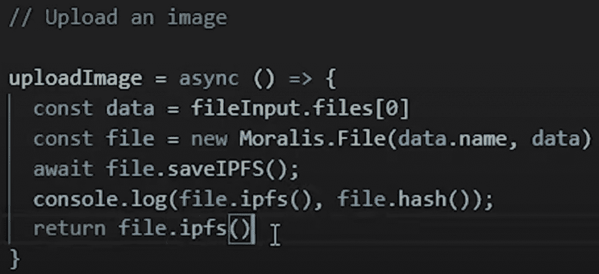

## 第五步:如何上传到 IPFS —上传元数据对象功能

像 NFT 这样的令牌附有元数据是很常见的。因此，我们将创建一个向 IPFS 上传元数据对象的函数。在这个例子中，我们的对象的元数据将是名称、描述和图像。因此，我们可以创建一个新的函数，我们称之为“uploadMetadata(imageURL)”。我们可以像上一步一样从同一个 Moralis 文档页面获取所有必要的代码，这一次，我们需要将对象上传到 IPFS 的代码:

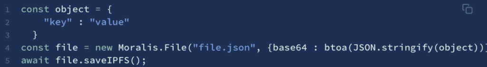

在我们创建元数据对象之前，我们需要获取用户输入到 dApp 的 UI 中的名称、描述和图像。为此，我们可以创建一个名为“name”的变量，从中获取 HTML 元素的信息。然后，我们可以继续对变量“description”做完全相同的事情。另一方面，对于图像，我们不会做同样的事情，因为我们将图像的 URL 作为函数的参数传递。

在我们访问了所有三个元素之后，我们可以创建对象并使用变量添加键值对。我们可以使用“base64”字符串直接从[JavaScript](https://moralis.io/web3-and-javascript-what-is-javascript-and-web3-js/)中保存 [JSON](https://moralis.io/json-explained-what-is-json-javascript-object-notation/) 对象，这是在我们创建元数据对象之后完成的。如您所见，当我们在函数的倒数第三行创建 JSON Moralis 对象时，我们传递了“元数据”。最后，我们将这个文件保存到 IPFS，并将文件的 URL 记录到控制台，代码的最终版本如下所示:

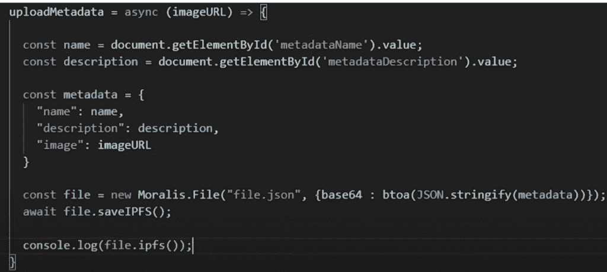

## 步骤 6:如何上传到 IPFS——创建一个函数来执行代码

“uploadMetadata()”函数中缺少一个元素，它是我们希望作为函数参数传递的 URL。为此，我们将创建另一个函数，将 dApp 的其他函数联系在一起。

我们将这个函数称为“gogogo()”，一旦用户点击 UI 的“gogogo”按钮，它就会触发。这是完整函数的样子:

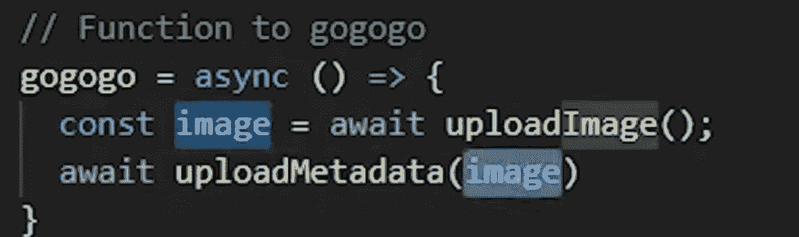

这里我们要做的第一件事是创建一个名为“image”的变量，在这里我们存储调用“uploadImage()”函数时返回的信息。您可能还记得，从这个函数返回的信息是用户上传文件的 URL。

在这之后，当我们调用“uploadMetadata()”函数时，我们将“image”变量作为参数传递。然后“uploadMetadata()”函数创建元数据对象，将其上传到 IPFS，最后将对象的 URL 记录到控制台。

就是这样！现在，我们已经成功地创建了自己的 dApp，可以用来上传文件到 IPFS。我们设法通过六个步骤创建了这个简单的应用程序，其便利性主要来自于使用 Moralis 平台。然而，如果你对这个过程还有疑问，那么我们推荐你看看下面这个来自 Moralis YouTube 频道:的视频

[https://www.youtube.com/embed/jRjFn__kVJM?feature=oembed](https://www.youtube.com/embed/jRjFn__kVJM?feature=oembed)

## 如何将文件上传到 IPFS —摘要

作为 Moralis 的用户，我们可以快速方便地 [构建 dApps](https://moralis.io/how-to-build-decentralized-apps-dapps-quickly-and-easily/) 用于上传文件到 IPFS。我们可以做到这一点，因为我们可以从 Moralis 文档中访问已经准备好的样板代码，并结合已经托管的后端基础设施。因此，我们可以按照这六个简单的步骤来创建 dApp:

1.  创建一个 Moralis 服务器。
2.  从 Moralis 导入样板代码。
3.  创建登录功能。
4.  创建上传图像的功能。
5.  创建上传元数据对象的功能。
6.  创建一个函数来执行代码。

遵循这六个步骤，我们可以在几分钟内轻松地创建一个 dApp，用来上传文件到 IPFS。但是，这并不是 Moralis 平台的极限，机会是无穷的。如果你经常阅读我们的博客，你会知道我们有很好的指南和教程来展示这个平台的潜力。例如，有关于 [如何构建多边形 dapp](https://moralis.io/how-to-build-polygon-dapps-easily/)的指南和关于 [如何创建自己的 NFT](https://moralis.io/how-to-create-your-own-nft-in-5-steps/) 的教程。

所以，如果你想成为区块链开发者，今天就 [报名 Moralis 家](https://admin.moralis.io/register) ！使用该平台的机会是无限的，您可以显著缩短所有未来区块链项目的上市时间。