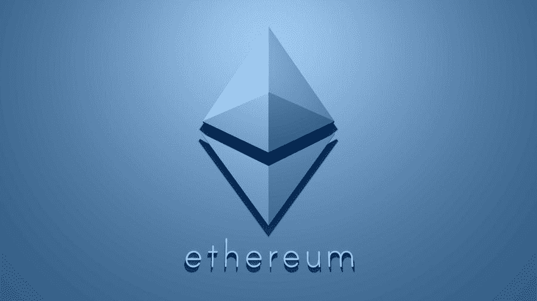
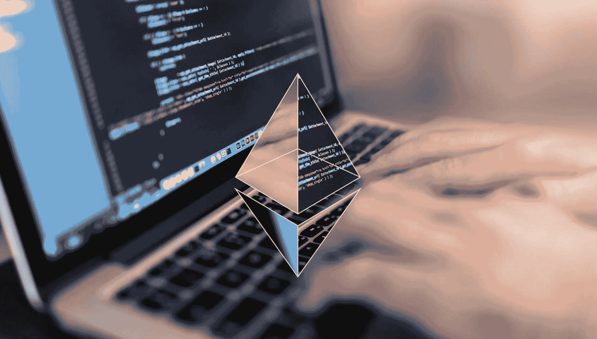
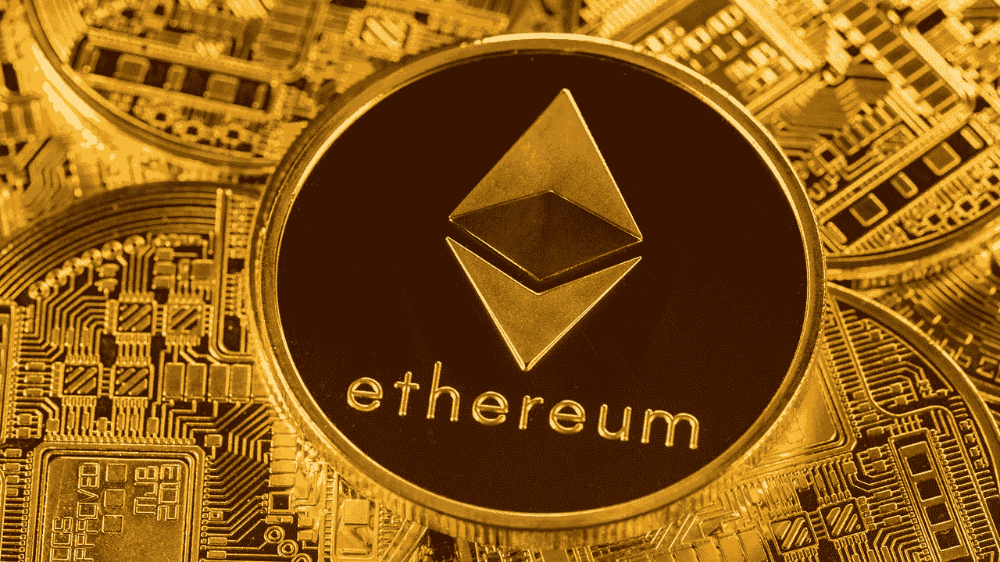
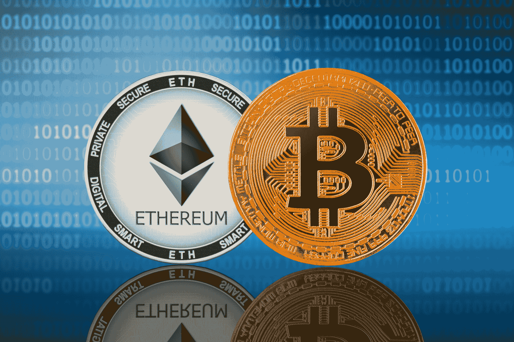
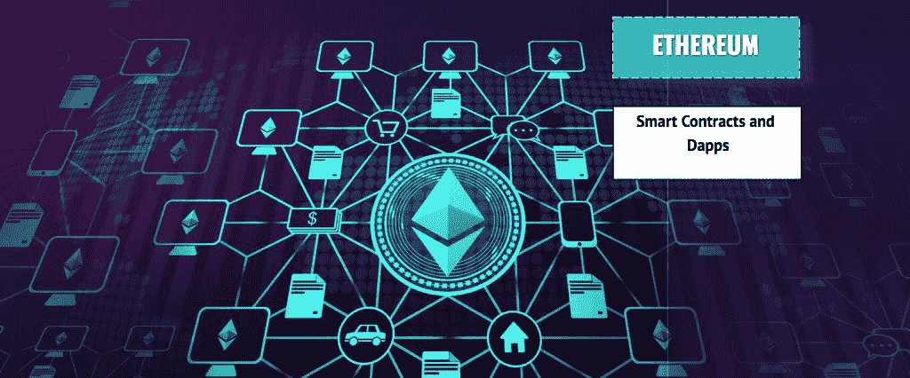
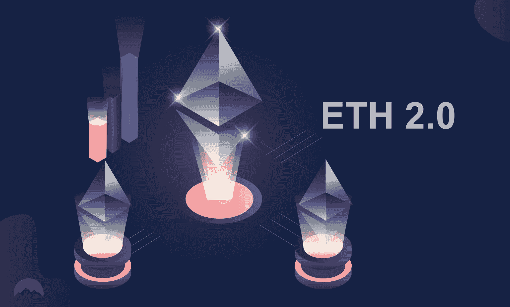
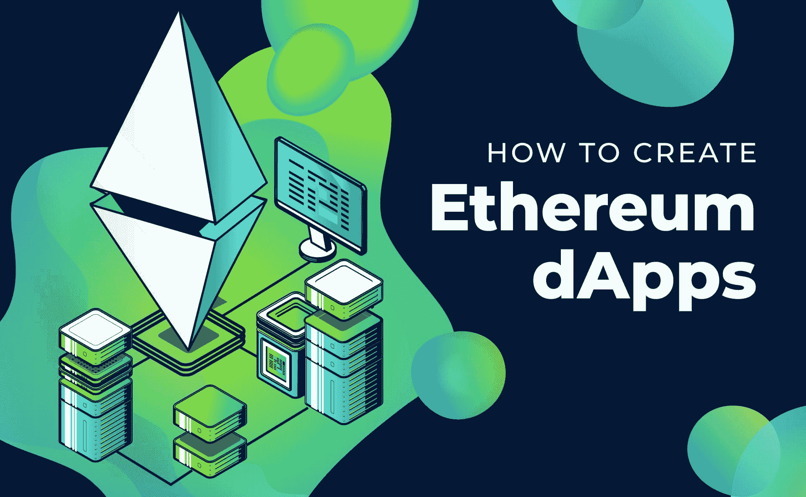

# 全指南:以太坊是什么？

> 原文：<https://moralis.io/full-guide-what-is-ethereum/>

除非你一直生活在岩石下，否则你很可能听说过以太坊。那么，以太坊是什么？简而言之，这是一个允许你存储数字货币、处理全球支付以及——也许是最重要的——构建下一代 Web3 应用的框架。无论您是对了解加密货币感兴趣，还是希望使用您的开发技能，了解以太坊的基础知识都是需要了解的重要话题。此外，鉴于以太坊是最主要和最广泛使用的区块链，了解以太坊是什么很重要。因此，我们将在本指南中对你进行教育，这样你就可以回答“什么是以太坊？”满怀信心。

在这份关于以太坊的完整指南中，我们不仅会回答“什么是以太坊？”，但我们也将进一步了解以太坊分散网络的各个重要方面。此外，我们将探讨“比特币和以太坊的区别是什么？”。虽然这两个区块链拥有相似的概念，但它们在使用案例上有明显的不同。此外，考虑到以太坊正在进行其最大的升级之一，我们也将讨论什么是以太坊 2.0。

尽管如此，知识本身是有价值的，但真正的力量在于将知识与行动结合起来。因此，我们鼓励您通过专注于开发 [Web3](https://moralis.io/the-ultimate-guide-to-web3-what-is-web3/) 应用程序来应用此处获得的信息。在[Moralis 家](https://moralis.io/)的帮助下，你可以用最少的努力和快速的周转做到这一点。Moralis 使[以太坊开发](https://moralis.io/ethereum-development-for-beginners/)比以往任何时候都更容易——用 Moralis 弥合 Web2 开发的简易性和 Web3 的强大功能之间的差距！

# 以太坊是什么？

今天，以太坊是众多区块链网络之一。然而，以太坊是 dApp 开发的最大区块链。然而，在深入细节之前，让我们先来看一些基础知识。以太坊网络包括自己的原生令牌 Ether (ETH)，这是一种市值第二大的加密货币(在撰写本文时)。此外，根据“区块链”的定义，以太坊是一个去中心化的公共分类账，在其网络上验证和记录交易。

正如 ethereum.org 所言，以太坊为基本上任何有互联网接入的人提供开放的数字货币和数据友好服务。无论某人来自中国、美国、欧洲、非洲或世界上任何其他地方，他们都可以访问这种社区构建的技术和无数在其上运行的应用程序。

以太坊网络允许用户付费向任何拥有活跃以太网地址的人发送其本地加密货币以及其他链兼容令牌。此外，该网络还支持各种行业(金融、游戏、营销等)的应用。)每个人都可以访问，没有人可以删除。这些种类的应用程序被称为[分散应用程序](https://moralis.io/decentralized-applications-explained-what-are-dapps/)或 dApps，也称为 Web3 应用程序。在讨论“比特币和以太坊的区别是什么”时，这些应用也是关键要素之一主题，我们将在本文后面发现。

## 以太坊——一个分散的网络

由于以太坊是可编程的，并且支持使用[智能合约](https://moralis.io/smart-contracts-explained-what-are-smart-contracts/)，所以在以太坊上创建 dApps 是可能的。后者能够在满足某些预定义的条件时执行特定的动作。

此外，以太坊是第一个提供这种功能的区块链，吸引了许多倾向于未来去中心化的开发者。尽管事实上其他几个连锁店提供类似以太坊的功能，它的早期开始创造了一个广泛的世界范围的社区，使整个网络的价值。因此，无数其他项目已经建立在这个广泛接受的区块链之上，每天都有新的项目出现。这包括数以千计的 [ERC-20 令牌](https://moralis.io/how-to-send-erc-20-tokens/)、[NFT](https://moralis.io/non-fungible-tokens-explained-what-are-nfts/)、dex(分散式交易所)以及许多其他涵盖广泛领域的 dApps。本质上，所有以太坊网络用户都可以选择创建、发布、货币化和使用生态系统中所有可用的应用程序。

### 以太坊顶上的建筑

虽然以太坊有自己的编程语言，名为 [Solidity](https://moralis.io/solidity-explained-what-is-solidity/) ，但是有很多方法可以通过使用其他工具和方便的平台来构建以太坊。这些著名的开发者门户之一是 Moralis，这是一个终极的 Web3 开发平台，让每个精通 [JavaScript](https://moralis.io/javascript-explained-what-is-javascript/) 的人都能立即开始构建 dApps。感谢 [Moralis SDK](https://moralis.io/exploring-moralis-sdk-the-ultimate-web3-sdk/) ，dApps 的部署时间很短，因为开发人员可以将全部注意力放在前端。如果你有兴趣在以太坊的区块链(其他连锁店也支持)上建造，毫无疑问，Moralis 是首选。此外，Moralis 是免费使用的，所以请确保今天就[注册您的帐户](https://admin.moralis.io/register)！

无论您是希望发送 [ERC-20 代币](https://moralis.io/how-to-send-erc-20-tokens/)、[创建自己的 NFTs](https://moralis.io/how-to-create-your-own-nft-in-5-steps/) 还是[创建 dApps](https://moralis.io/how-to-create-ethereum-dapps/) ，Moralis 都可以帮助您快速轻松地完成这些任务。这意味着您不会因为运行自己的节点和围绕一个 [RPC 节点](https://moralis.io/ethereum-rpc-nodes-what-they-are-and-why-you-shouldnt-use-them/)构建基础设施而浪费时间。有了 Moralis 的支持，您可以直接跳到有趣的部分，从而创造最佳的用户体验，同时节省时间和其他宝贵的资源。

## 什么是以太(ETH)？

如前所述，Ether 或 ETH 是以太坊的原生加密货币。它作为一种资产来支付以太坊网络上的交易。后者被称为“gas ”,因为它根据网络上当前执行的交易量而变化很大。当然，ETH 也可用于存储价值或作为一种货币形式，用于支付接受 ETH 作为支付方式的商家的商品和服务。此外，它可以容易地在使用网络的任何人之间传送，或者用于访问特定 dApps 的完整功能。

在 ethereum.org，它将以太称为“我们数字化未来的货币”，同时解释说以太是数字化的全球货币。本质上，ETH 是所有以太坊应用的货币。

以下是乙醚的一些主要特性:

*   ETH 让您成为自己的银行，完全掌控您的资金。
*   你需要有一个数字钱包来存储以太网。
*   它由加密技术保护。
*   在比特币的引领下，它被设计用于点对点支付。
*   没有集中控制——ETH 是分散的和全球性的。
*   任何有网络连接和电子钱包的人都可以接受 ETH。
*   以太可以被分割到小数点后 18 位，这意味着一次可以购买和转让 1 个以太的分数。
*   以太为以太坊提供燃料和安全保障。
*   现在，矿工被奖励以太币(更多信息，请看“什么是以太币 2.0？”部分)。
*   使用建立在以太坊之上的金融工具(称为 DeFi[去中心化金融])，你可以在 ETH 中借款、贷款和赚取利息。
*   您可以使用 dex 或 CEXs(集中交易所)将 ETH 交易为其他硬币和代币。
*   考虑到以太坊是可编程的，每天以太的用例越来越多。

### 如何获得 ETH？

有几种方法可以得到 ETH。一旦你创建了自己的钱包(或者使用 CEXs 提供的钱包，比如比特币基地)，你将需要使用某种类型的[菲亚特网关](https://moralis.io/what-is-a-fiat-gateway/)来将你的法定货币转换成以太货币。该选项在 CEXs 和一些加密钱包中可用，包括最受欢迎的一个-[元掩码](https://moralis.io/metamask-explained-what-is-metamask/)。

而且，你也可以从另一个人(同伴)那里得到 ETH，如果他们愿意发给你的话。然而，在要求任何人免费送你乙醚之前，请记住，鉴于目前的记录，乙醚有望升值。因此，很少有个人愿意离开他们的 ETH。

## 比特币和以太坊有什么区别？

不解决“比特币和以太坊有什么区别”这个问题，讨论以太坊基本上是不可能的。问题。而且，如果你熟悉比特币，读过《以太坊是什么？一节，你大概可以自己回答这个问题。然而，为了确保即使是密码领域的完全初学者也不会落后，让我们更详细地解释这一点。

那么，比特币和以太坊有什么区别呢？嗯，差别还是蛮多的。首先，以太坊和比特币是两种不同的区块链。他们都有自己的加密货币——分别是 BTC 和瑞士联邦理工学院。此外，比特币的市值明显高于以太坊，因此市场份额也更大，这也被称为比特币优势。此外，比特币首先被创造出来(2009 年)，比以太坊推出(2015 年)早几年。实际上，是比特币激发了以太坊的诞生。此外，比特币的创始人是匿名的，他们的名字是中本聪，而以太坊的创始人是众所周知的，其中维塔利克·布特林是最广为人知的一个。

而且以太坊和比特币运行的算法不同；比特币使用 SHA-256，而以太坊使用一种叫做“Ethash”的算法。它们也有不同的阻塞时间；比特币是分钟，以太坊是秒。当然，我们可以在两个区块链和他们的货币之间找到其他不太重要的差异。然而，让我们转而关注“比特币和以太坊的区别是什么？”这个最重要的答案。问题。

### 智能合约和以太坊的可编程性

虽然上述所有差异可能都很有趣，但当以太坊的创始人提出利用区块链技术不仅仅是维护一个分散的支付网络时，关键的差异开始形成。因此，他们找到了一种在区块链上存储计算机代码的方法，并使以太坊可编程。这一重要的区别及其实现导致了智能合约、dApps 和以太坊今天这样的广泛生态系统的诞生。

尽管如此，我们必须提到，比特币和以太坊之间的这一关键区别可能会在未来消失，因为关于在比特币的区块链上部署智能合约的讨论也更加严肃。

值得注意的是，以太坊不是为了与比特币竞争而创建的，而是为了对其进行补充。比特币的主要目的是作为国家货币的替代品。因此，它寻求成为一种价值储存手段和交换媒介。另一方面，以太坊的目标是成为一个平台，为不可变的、分散的程序和应用提供便利。

## 以太坊 2.0 是什么？

如果你一直在阅读加密新闻，那么你一定听说过以太坊 2.0。如果不解决以太坊网络即将到来的关键升级，这份以太坊的完整指南将是不完整的。

那么，以太坊 2.0 是什么？以太坊 2.0，简称 Eth2，是一组互联升级，让以太坊网络更加安全。此外，通过从工作证明(PoW)转向利益证明(PoS ), it 将变得更具可扩展性和可持续性。

Eth2 有三个阶段:

1.  **信标链**–这一阶段将赌注押在以太坊上，并为 Eth2 升级的未来阶段做好准备。此外，最终，信标链将协调升级的系统。
2.  **合并**–当前的以太坊主网将与信标链“合并”，为整个网络带来利益。这也将标志着能源密集型采矿的终结。
3.  **碎片链**–以太坊 2.0 升级的最后阶段将扩展以太坊处理交易和存储数据的能力。碎片的其他功能将分多个阶段推出。

以太坊 2.0 升级早已开始，其第一阶段已于 2020 年 12 月顺利完成。从那以后，很多人已经开始跑马圈地以太坊 2.0 了。虽然以太坊 2.0 升级的最后阶段的确切日期尚未提供，但估计会在 2021 年和 2022 年期间进行。

### 以太坊 2.0 是什么？–做好准备

对于 ETH 持有者或 dApp 用户，他们不需要做任何事情，因为整个过渡将无缝完成。然而，就开发者和那些对押注 ETH 感兴趣的人而言，他们有机会参与进来。后者可以通过运行客户端、标记 ETH 或通过测试 Eth2 来查找 bug 来实现。更多详情，请访问[ethereum.org](https://ethereum.org/en/eth2/get-involved/)。

## 以太坊是什么？–总结

我们希望这个关于以太坊的指南能启发你更深入地研究 Web3 开发。知道除了价格投机和交易之外还有更多秘密，你的创造力可能会被激发出来。随着智能合约和 dApps 的使用，以太坊可能会成为你下一个项目的区块链。当然，你也可以决定通过专注于为人类提供娱乐来保持事情的轻松和有趣，例如，通过加入或开始一个去中心化游戏领域的项目。

无论你走哪条路，Moralis 都会帮助你。不仅为你提供所有的工具，还提供指导。在 [Moralis 的博客](https://moralis.io/blog/)和 [Moralis 的 YouTube 频道](https://www.youtube.com/channel/UCgWS9Q3P5AxCWyQLT2kQhBw)上，你可以找到大量解释各种加密概念的文章和视频以及示例项目的详细指南。例如，你可以学习[如何创建自己的 ERC-20 令牌](https://moralis.io/how-to-create-your-own-erc-20-token-in-10-minutes/)或[如何创建一个 DEX](https://moralis.io/how-to-create-a-dex-in-5-steps/) 。

说到区块链的发展，无论是在以太坊还是其他知名连锁店，事情才刚刚开始。因此，没有比这更好的时机去全职加密。如果你已经知道 JavaScript，确保利用 [Moralis 的文档](https://docs.moralis.io/)和它提供的易用性。另一方面，如果你还不精通 JavaScript，我们建议你今天就开始以下课程，这样你就可以拥有一个面向未来的职业生涯:“[区块链开发者 JavaScript 编程](https://academy.ivanontech.com/courses/javascript-programming-for-blockchain-developers)”。