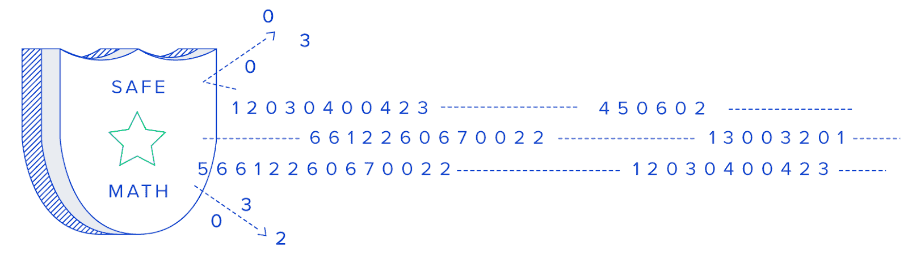
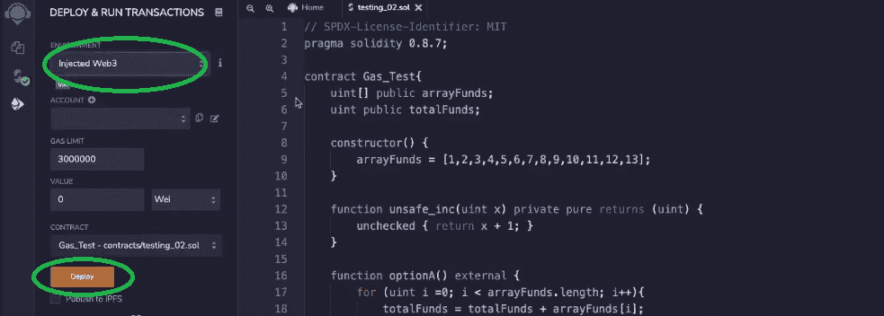
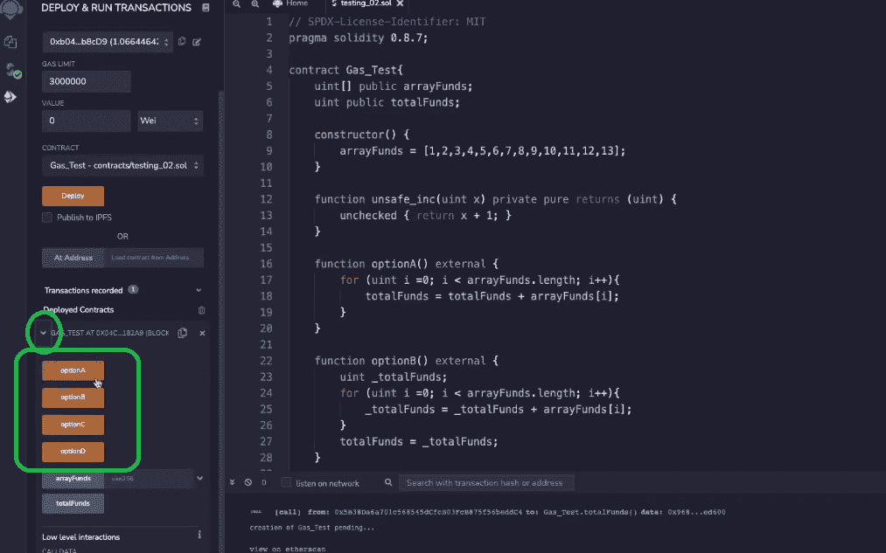
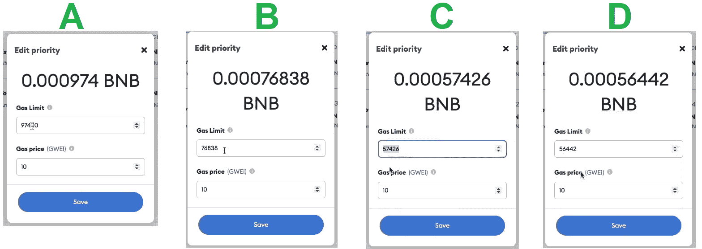

# 坚固性方面的气体优化–顶级技巧

> 原文：<https://moralis.io/gas-optimizations-in-solidity-top-tips/>

调整你的代码对减少油费非常有帮助，让你的项目更有利可图。如果你曾经在区块链上使用过 [**智能合约**](https://moralis.io/smart-contracts-explained-what-are-smart-contracts/) **比如** [**以太坊**](https://moralis.io/full-guide-what-is-ethereum/) **，你就知道过高的费用会有多痛苦。甚至当你使用其他连锁店如** [**BNB 连锁店**](https://moralis.io/how-to-create-a-bnb-chain-token-in-5-minutes/) **时，这些连锁店提供的费用很低，交易也能增加。因此，知道如何在 Solidity 中实现 gas 优化将极大地有利于您的项目。此外，对代码进行细微的调整可以显著降低汽油费用。此外，由于坚固性适用于所有与**[](https://moralis.io/evm-explained-what-is-ethereum-virtual-machine/)****兼容的区块链，因此我们将在此着重讨论** [**坚固性**](https://moralis.io/solidity-explained-what-is-solidity/) **中的气体优化。然而，如果你喜欢在 Solana 上构建，你可以使用 Rust 进行类似的调整。****

**在本文中，我们将仔细研究一个相对简单的" *for"* 循环。包含循环的函数的第一个版本根本不会被优化。然后，我们将创建该函数的三个变体。就功能而言，它们都将提供相同的结果。然而，它们中的每一个都将比前一个在坚固性方面包括更多的气体优化。因此，你将能够看到，至少随着时间的推移，非常简单的调整可以带来巨大的变化。尽管如此，你将有机会采纳这些建议，并将它们应用到你未来的项目中。这是一个重要的方面，因为你不能完全避免汽油费；您或您的用户必须覆盖它们。即使使用[最好的 Web3 后端平台](https://moralis.io/exploring-the-best-web3-backend-platform/)、 [Moralis](https://moralis.io/) ，你仍然应该在 Solidity 中应用 gas 优化来节省费用。**

**

### 什么是坚固性？

你不确定什么是稳固吗？如果是这种情况，使用前面提到的“可靠性”链接。但是，知道它是一种面向对象的编程语言应该足以帮助您理解本文。此外，Solidity 还被用于在以太坊和其他 EVM 兼容链上签署智能合约。因此，如果你想成为编写智能合同的区块链开发者，你应该熟悉这种编码语言。幸运的是，这绝不是必须的。有了像 [Remix](https://moralis.io/remix-explained-what-is-remix/) 和 [OpenZeppelin](https://moralis.io/what-is-openzeppelin-the-ultimate-guide/) 这样的工具在你身边，你可以在了解坚实的基础上走得更远。

此外，当使用当前 [Web3 技术栈](https://moralis.io/exploring-the-web3-tech-stack-full-guide/)的顶峰时，Moralis，加上你的 [JavaScript](https://moralis.io/javascript-explained-what-is-javascript/) 熟练程度和使用最流行的 [Web3 钱包](https://moralis.io/what-is-a-web3-wallet-web3-wallets-explained/)、 [MetaMask](https://moralis.io/metamask-explained-what-is-metamask/) 的能力，会让你走得很远。使用 Moralis(又名 [Firebase for crypto](https://moralis.io/firebase-for-crypto-the-best-blockchain-firebase-alternative/) )，您可以快速创建跨多个链的非凡 dapp([分散应用](https://moralis.io/decentralized-applications-explained-what-are-dapps/))。因此，如果你渴望开始建设，现在就[创建你的免费 Moralis 账户](https://admin.moralis.io/register)。


## 固体中的气体优化-示例调整

我们相信，如果我们采用智能合同示例，您将从本文中获益匪浅。因此，我们将关注智能合约中的特定功能。此外，我们将使用 Remix 来部署我们的智能合约。我们将从基本的调整开始，然后过渡到更高级的坚固性气体优化。尽管如此，请注意“ [gas_optimization.sol](https://github.com/DanielMoralisSamples/32_Gas_Optimization/blob/master/gas_optimization.sol) ”智能契约，这是这些示例调整的结果，可在 [GitHub](https://github.com/DanielMoralisSamples/32_Gas_Optimization) 上获得。它包含函数的所有变体，包含我们的“*for”*循环。


### 我们的智能合同示例

在我们开始应用任何调整之前，让我们看一下智能合约示例的第一个版本。像通常的做法一样，它从顶部的“pragma”行开始:

```js
pragma solidity 0.8.7;
```

然而，实际的契约从这行代码开始:

```js
contract Gas_Test{
```

在我们的契约中，我们首先定义了存储在区块链上的两个状态变量:

```js
    uint[] public arrayFunds;
    uint public totalFunds;
```

接下来，我们使用构造函数来填充“arrayFunds”变量:

```js
   constructor() {
        arrayFunds = [1,2,3,4,5,6,7,8,9,10,11,12,13];
    }
```

正如您在上面看到的，“arrayFunds”变量是一个包含一组数字的数组。此外，我们还有“optionA”功能:

```js
    function optionA() external {
        for (uint i =0; i < arrayFunds.length; i++){
            totalFunds = totalFunds + arrayFunds[i];
        }
    }
```

以上功能将是我们的主要关注点。在目前的形式下，它在费用上花费很多，这意味着它需要在可靠性上进行气体优化。这是我们将应用不同的调整，反过来，实施气体优化。此外，您可以看到我们的示例函数非常简单。它获取上述数组中所有元素的相加值，并用该相加值填充另一个状态变量“totalFunds”。

另外，你应该注意到网上有很多优化的例子。然而，大多数在线调整都涉及编译器中的优化器，最终通常会得到解决。尽管上面的函数(由 Chanlink 的团队发布)及其后续调整侧重于最佳实践。后者必须适当地手动实现。因此，当你创建智能合同时，你真的应该记住这个例子。


## 固体中的基本气体优化

在我们应用优化的第一阶段之前，让我们看看为什么上面的函数会导致过高的汽油费。其主要原因是“optionA”函数在循环的每次迭代中直接读写区块链。

此外，负责以太坊区块链或其他 EVM 兼容区块链采取行动的“操作码”(机器语言)可能相当昂贵。因此，我们希望尽可能避免这样做。因此，我们可以通过将变量缓存到内存变量(" _totalFunds ")来优化上面的函数。然后，在循环中使用内存变量:

```js
    function optionB() external {
        uint _totalFunds;
        for (uint i =0; i < arrayFunds.length; i++){
            _totalFunds = _totalFunds + arrayFunds[i];
        }
        totalFunds = _totalFunds;
    }
```

仅仅通过这个简单的调整，我们就可以在执行" *for"* 循环的过程中节省很多费用。然而，即使我们没有在循环中写入区块链，我们仍然从每次迭代的区块链中读取。因此，这是一个明确的迹象，表明我们可以采取气体优化甚至更进一步。这将我们带到“optionC()”函数:

```js
   function optionC() external {
        uint _totalFunds;
        uint[] memory _arrayFunds = arrayFunds;
        for (uint i =0; i < _arrayFunds.length; i++){
            _totalFunds = _totalFunds + _arrayFunds[i];
        }
        totalFunds = _totalFunds;
    }
```

通过添加另一个内存变量，我们现在将状态变量(“arrayFunds”和“totalFunds”)缓存到内存变量(“arrayFunds”和“_totalFunds”)。使用上面的内存数组，我们也不会在每次循环迭代中从区块链中读取数据。因此，在初始化循环之前，我们只从区块链读取一次。然后，我们用内存中的数组副本执行我们的函数。最后，我们像在“optionB”中一样填充变量。


## 固体的先进气体优化

在上面的例子中，我们通过“选项 b”从“选项 a”到“选项 c”。结果，我们获得了一个为降低汽油费用而适当优化的函数。通过将" *for"* 循环迭代中的读取和写入都从链中去掉，我们取得了很大的不同。然而，我们想更进一步。因此，我们想出了一个深奥的坚固性气体优化。我们将在下面向你展示这个绝妙的技巧。



### 利用 sagemath 库

我们将实现的优化与 SafeMath 库相关，它曾经非常流行。这个库背后的目的是由于过去在坚固性上的一个特别的缺陷。在过去，坚固性不会回复到变量溢出。请记住，在 Solidity 中，每个定义为“uint”或“integer”的变量都有一定数量的值可以保存。在 Solidity 以前的版本中，每当你试图存储更多或存储一个大于上限的数字时，它都不会返回错误。相反，它给出了不正确的值。因此，SafeMath 就是为了解决这个问题而开发的。不过从 Solidity 版本开始，这个缺陷被修复了。因此，Solidity 能够恢复溢出，这也消除了对 SafeMath 的需要。尽管如此，这使得算法在汽油方面更加昂贵。

所以，现在让我们把注意力集中在目前为止我们所有函数变体中使用的“i++”上。在这种变量“I”的加法中，我们使用了受保护的坚固性算法，也称为“校验算法”。就汽油费而言，使用未经检查的算法会更便宜。幸运的是，我们可以自信地这样做，因为我们的变量“I”很难溢出。后者是“uint256”变量，它有一个相当高的限制。此外，我们知道没有一个数组会有这个极限那么长。

### 使用“未检查的算术”技巧

作为 Solidity 中高级气体优化的一部分，我们将添加一个辅助函数。后者将帮助我们使用未经检查的算术技巧:

```js
    function unsafe_inc(uint x) private pure returns (uint) {
        unchecked { return x + 1; }
    }
```

就执行而言，我们将创建一个名为“optionD”的新函数:

```js
  function optionD() external {
        uint _totalFunds;
        uint[] memory _arrayFunds = arrayFunds;
        for (uint i =0; i < _arrayFunds.length; i = unsafe_inc(i)){
            _totalFunds = _totalFunds + _arrayFunds[i];
        }
        totalFunds = _totalFunds;
    }
```

通过查看上面的函数，您可以看到除了“i++”部分之外，它完全遵循了“optionC”。这就是我们使用上面定义的“unsafe_inc”辅助函数的地方。这样，我们做同样的事情——将“I”增加 1，但使用未检查的算术技巧。

## 固体中的气体优化–结果

现在让我们检查一下上面提到的每个功能选项的汽油费。为此，我们将使用 Remix 和“注入的 Web3”环境在 BNB 链上部署我们的智能合同:



接下来，我们开始执行四个函数中的每一个，并比较油费。如果您忘记了，以下是“gas_optimization.sol”智能合约中包含的功能:

*   **optionA**–包括贯穿所有循环迭代的链上读写。
*   **optionB**–在循环的所有迭代中包括链上读取，但不包括链外写入。
*   **optionC**–在循环的所有迭代中包括链外读写。
*   **optionD**–结合未检查的算法，包括贯穿所有循环迭代的链外读写。

此外，如果你使用 Remix 执行和我们一样的步骤，使用下面的图片来帮助你。这样，你就能一个接一个地执行这些功能。因此，只需扩展“已部署合同”下的详细信息:



最后，结果如下:



看上面的图片，你可以看到应用于函数的每个调整都减少了汽油费。此外，请注意，坚实度中的基本气体优化产生了相当大的影响。另一方面，先进的气体优化可能导致较小的气体减少。然而，随着时间的推移，这可能会产生显著的影响。

### 固体气体优化的顶级技巧——视频讲解

我们希望本次演示能给你留下深刻的印象，让你记住以下重要的指导原则:

***通过避免循环内的链上写和读*** *，可以实现可靠性方面最显著的 gas 优化。*

另外，如果你更喜欢视频教程，下面也是上面演示的视频版本。要观看 Solidity 中的基本气体优化，请从 01:23 开始。此外，有关我们高级优化的详细信息，请跳到 04:20。尽管如此，要想看到结果，请跳到 08:07。

https://www.youtube.com/watch?v=IkdoQI7API0

## 固体中的气体优化-顶级技巧-总结

在坚固性方面注意潜在的气体优化是值得的。因此，在部署智能合约之前，请确保仔细检查您的代码。问问你自己，“我所有的循环写和读都是离链的吗？”。如果您的答案是“否”，请使用此处提供的指南进行必要的调整。然而，如果你是区块链世界的新成员，确保先掌握基本知识。

因此，你可以在 [Moralis YouTube 频道](https://www.youtube.com/c/MoralisWeb3)和 [Moralis 博客](https://moralis.io/blog/)的帮助下继续你的免费加密教育。在那里，你会找到大量的文章和示例项目，帮助你快速进步。例如，一些最新的主题向您展示了如何构建一个 [2D Web3 游戏](https://moralis.io/how-to-build-a-2d-web3-game-full-guide%ef%bf%bc/)、[如何创建一个 GameFi 游戏](https://moralis.io/gamefi-tutorial-how-to-create-a-gamefi-game/)、[如何在 2022 年进入 Web3](https://moralis.io/how-to-get-into-web3-in-2022/)，如何使用 [Web3 Firebase 认证](https://moralis.io/web3-firebase-authentication-create-a-web3-sign-in-with-moralis/)、[如何进行区块链游戏交易](https://moralis.io/how-to-do-blockchain-game-transactions-with-unity/)，如何[创建一个 web 3 音乐平台](https://moralis.io/web3-music-platform-create-a-web3-music-streaming-service/)，如何进行[无线元宇宙互动](https://moralis.io/gasless-metaverse-interactions-exploring-zero-fee-dapps/)等等

另一方面，你可能渴望尽早成为 Web3 开发者。如果是这样，你应该考虑报名参加[Moralis 学院](https://academy.moralis.io/)。通过这样做，你将获得高质量的区块链发展[课程](https://academy.moralis.io/all-courses)。其中有[以太坊智能合约编程 101](https://academy.moralis.io/courses/ethereum-smart-contract-programming-101/) 课程，可以帮助你更好的理解稳健。然而，更深层次的价值在于在另一边等待你的社区和专家指导。

**