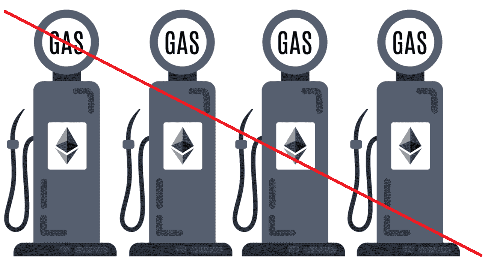
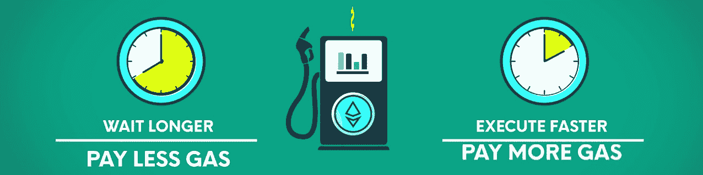
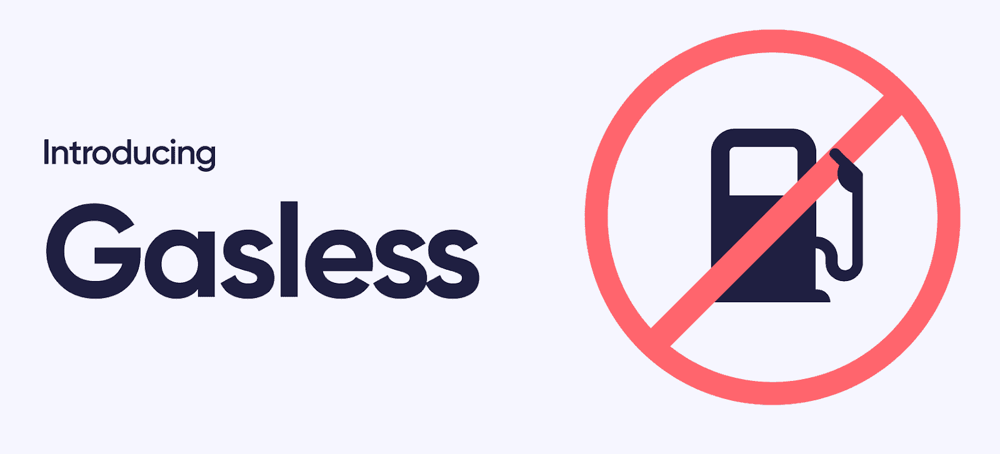
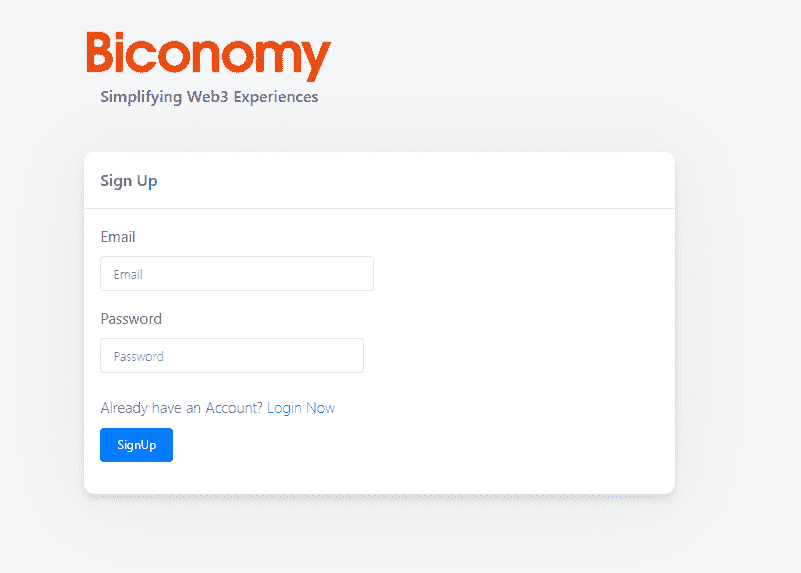
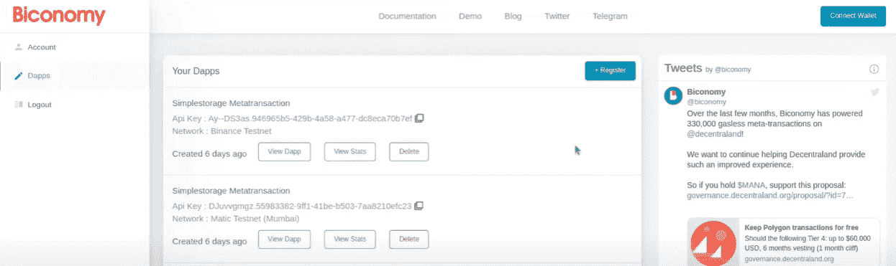

# 无气交易——探索以太坊上的无气交易

> 原文：<https://moralis.io/gasless-transactions-exploring-gasless-transactions-on-ethereum/>

**如果您一直在** [**【以太坊】**](https://moralis.io/full-guide-what-is-ethereum/) **区块链上执行交易，您一定已经办理了其燃气费。以太坊高昂的煤气费让许多人感到沮丧，并阻止用户使用其网络。因此，许多人不禁想知道无汽油交易是否可能。好消息是他们是。然而，它们可能并不完全是你所想的那样。幸运的是，在这篇文章中，我们将通过探索以太坊上的无气交易来理清事情，并为您提供对无气交易的清晰理解。此外，我们将向您展示如何将它们包含在您的 dapp(******)中。此外，通过承担一个示例项目，您将有机会学习使用一些实用工具。这些以太坊无气交易工具分别是** [**Moralis 家**](https://moralis.io/) **(又名**[**Firebase for crypto**](https://moralis.io/firebase-for-crypto-the-best-blockchain-firebase-alternative/)**)、终极 Web3 样板，以及双经济。****

**虽然以太坊最初引入了汽油费，但这是所有与 EVM 兼容的连锁店都包含的东西。这意味着[多边形](https://moralis.io/how-to-build-polygon-dapps-easily/)、[雪崩](https://moralis.io/how-to-build-avalanche-dapps-in-minutes/)、[币安智能链](https://moralis.io/bsc-programming-guide-intro-to-binance-smart-chain-development-in-10-minutes/) (BSC)等链也包含交易费用。然而，他们的交易费用要低得多，因为他们使用的是利益证明(PoS)概念，而不是以太坊使用的工作证明(PoW)。因此，我们认为在讨论无气交易时，这些连锁店是更好的选择。事实上，对于我们这里的示例项目，我们将关注名为 Fuji 的雪崩测试网。尽管如此，为其他与 EVM 兼容的连锁店设立无汽油交易背后的原则是相同的。因此，您可以很容易地将本文中获得的知识应用到您的基于以太坊的项目中。幸运的是，最终的 Web3 开发平台 Moralis 提供了跨链的互操作性。反过来，你可以跨多个连锁店部署你的 dApps，而不需要担心或银行。因此，在继续之前，[创建您的免费 Moralis 账户](https://admin.moralis.io/register)。**

**

## 以太气是什么？

为了确保你们都掌握了基本知识，让我们先来回答这个问题，“以太气是什么？”。“气体”这个词是有原因的。为什么？嗯，就像汽车里的汽油一样，以太坊上的汽油也能为某些东西提供燃料。然而，它不是为机械引擎提供动力，而是为以太坊虚拟机(EVM) [智能合约](https://moralis.io/smart-contracts-explained-what-are-smart-contracts/)或交易提供动力。

你很可能知道，以太坊是第一个可编程的区块链，并且仍然是领先的。它使开发人员能够在其上部署 dApps 和其他令牌。其他可编程区块链也是如此。此外，为了让用户和开发者为所有交易提供动力，他们需要天然气。由于 gas 是衡量在以太坊上执行特定操作所需的计算工作量的单位，因此以 ETH 支付。

当然，其他可编程链使用其本地令牌(硬币)来实现这一目的。此外，由于以太坊上的每个交易都需要计算资源(以太坊仍在使用 PoW 概念)，当网络需求较高时，相关的交易费用可能会高得令人难以置信。这些交易费用被称为[以太币气费](https://moralis.io/ethereum-gas-fees-the-ultimate-2022-guide/)。此外，尽管价格很高，但交易费只是 ETH 的一小部分。因此，他们被称为“gwei”(又名“nano eth”)。

## 无气交易说明

我们也希望你不要错误地认为没有汽油的交易。首先，你需要知道为了执行交易，必须支付汽油费。这是没有办法的。那么，无汽油交易意味着什么呢？嗯，“无气”是指用户自己不支付交易费用。通过使用这些工具，随着我们的发展，您将了解到更多信息，您可以为您的 dApps 创建这样的功能。当然，你必须意识到这样一个事实，有人需要支付汽油费。在某些情况下，这是由开发团队或项目所有者完成的。此外，对这类 dApps 中的预期交易数量进行相当清晰的评估也很重要。这样，你可以确保你的预算允许你为你的用户提供无汽油的交易。

### 为什么无汽油交易

不确定您为什么想在 dApp 中提供无汽油交易？好吧，站在用户的角度想想。如果有两个 dApps 都提供相同的功能，并且都有一个漂亮的用户界面，你难道不会选择提供无汽油交易的那个吗？因此，提供这种用户友好的功能可能只是吸引更多用户的额外手段。

## EVM 链条上的无气交易–示例项目

通过承担一个示例项目，您将学习如何在 EVM 兼容链上整合无气交易。此外，如上所述，我们将致力于雪崩富士测试网。然而，在我们开始构建我们的示例 dApp 之前，先预览一下我们将要创建的内容。这将使你对我们的最终目标有一个清晰的了解。

接下来，我们还将指导您完成初始设置。因此，你需要创建你的 Moralis 服务器和双经济账户。关于实际编码的更多细节，我们将把你交给 Moralis 的专家。通过视频教程，他将带您浏览代码，并提供深入的指导。此外，我们将向您展示如何进行无汽油交易！

### 我们的 dApp 预览示例

我们认为，在处理区块链的新问题时，尽可能保持简单是至关重要的。因此，我们的例子 dApp 将反映这一信念，同时仍然服务于其目的。因此，它将使用户能够在雪崩测试网上执行无气体交易。当然，同样的原理可以应用于任何以太坊测试网、以太坊的主网或任何其他 EVM 兼容的网络。

我们的示例 Web3 应用程序允许用户通过点击“编辑存储”按钮来存储字符串(见下图)。当然，在区块链上，为了存储该字符串，必须执行一个事务。此外，这些是我们将代表我们的用户涵盖的无气交易。因此，他们将能够编辑字符串，而无需支付天然气费。

上面的截图向您展示了我们的示例 dApp 可以在不同的区块链之间切换(在我们的例子中是 testnets)。目前选择的是雪崩富士试验网。此外，我们的 UI 还为连接的用户显示本机令牌余额。最后，它还为连接的用户提供了通过“编辑存储”按钮编辑存储的机会。

### 行动中的无汽油交易

此外，我们还用一个包含零个 AVAX 令牌(Avalanche 上的本地令牌)的钱包完成了一项交易。这应该证明我们的示例 dApp 真正为其用户提供了零交易费用。我们通过使用[元掩码](https://moralis.io/metamask-explained-what-is-metamask/)登录([认证](https://moralis.io/how-to-authenticate-with-metamask/))来实现这一点。接下来，我们单击“Edit Storage”按钮，这使我们能够输入新的存储数据(在我们的例子中是一个字符串):

我们键入“Hello Moralis”作为新的存储数据。接下来，我们选择 EIP-712 签名选项(稍后将详细介绍)，并单击“设置存储”按钮。后者提示 MetaMask 进行确认:

通过点击“签名”按钮，我们完成了交易，没有支付煤气费。通过使用 Biconomy(见上面截图的右上角)，我们覆盖了后端的交易费用。此外，我们还获得了更新的存储状态:

## 如何在 EVM 兼容链上提供无汽油交易——初始设置

初始设置包含您需要完成的几个步骤。好在都不复杂。然而，为了使事情变得简单，我们将提供一步一步的指导，以确保您正确设置。你将从基础开始，你需要创建你的免费 Moralis 账户。通过这样做，你将有机会创建你的 Moralis 服务器。另外，它将为您提供对 [Moralis 的 SDK](https://moralis.io/exploring-moralis-sdk-the-ultimate-web3-sdk/) 的完全访问，包括 [Moralis Speedy Nodes](https://moralis.io/speedy-nodes/) 。

此外，您还将了解 dApp 开发的终极捷径——终极 [Web3 样板](https://moralis.io/web3-boilerplate-beginners-guide-to-web3/)。后者使您能够在几分钟内创建一个带有简单 UI 的 dApp。样板文件包含了一个普通 dApp 需要的大部分组件。向前看，你有机会自己调整[以太坊样板](https://github.com/ethereum-boilerplate/ethereum-boilerplate)。因此，首先克隆它的 GitHub 地址。然而，我们为您提供了一个额外的快捷方式——您可以在这个示例项目中使用[完成代码](https://github.com/YosephKS/moralis-biconomy-metatransactions)。*详细说明，看文末视频(6:07 开始)。*

因为双经济也是实现无汽油交易的重要部分，你也需要在那里建立一个账户。幸运的是，这一点也不复杂。此外，您还需要一个代码编辑器(我们使用 Visual Studio Code [VSC])来处理上面提供的代码。通过为一个包管理器(yarn 或 npm)和 [Truffle](https://moralis.io/truffle-explained-what-is-the-truffle-suite/) 安装所有的依赖项，你就一切就绪了。

### 初始 Moralis 设置

要在您的 dApp 开发中使用 Moralis，包括您的“无汽油交易”探索，请完成以下步骤:

1.  **创建您的 Moralis 帐户**–如果您还没有创建您的 Moralis 帐户，现在就创建。你可以使用这个链接到[注册 Moralis](https://admin.moralis.io/register) ，它会带你到注册页面。在那里，输入您的电子邮件地址并创建您的密码。最后，点击确认链接确认您的电子邮件地址(检查您的电子邮件收件箱)。然而，如果你已经有一个有效的 Moralis 账户，只需[登录](https://admin.moralis.io/login)。

2.  [**创建 Moralis 服务器**](https://docs.moralis.io/moralis-server/getting-started/create-a-moralis-server)–进入 Moralis 管理区域(“服务器”选项卡)后，您将通过点击“+创建新服务器”(右上角)来创建新服务器。接下来，从下拉菜单中选择最适合您需求的网络类型(如下所示)。*在处理示例项目时，您希望使用“Testnet 服务器”选项。*

选择服务器类型后，您将看到一个弹出窗口，询问您新服务器的详细信息，包括服务器名称(可以是您想要的任何名称)、地区、网络和链。输入所有详细信息后，单击“添加实例”:

*注意:确保您选择了 Avalanche testnet。*

3.  **访问服务器详细信息**–启动服务器后，您将能够获得其详细信息。只需点击您的服务器名称旁边的“查看详细信息”按钮。您需要复制服务器的 URL 和应用程序 ID，并将它们粘贴到您的代码文件(".env”)。

4.  **初始化 Moralis 规范**–通过填充您的。env "文件，您可以充分利用 Moralis 的 SDK:

### Moralis 快速节点

下面的视频将指导您使用 Moralis Speedy Nodes 部署智能合同。一旦您创建了您的 Moralis 帐户，您就可以使用此功能。要访问它，选择左侧导航选项卡底部的“Speedy Nodes”选项卡。接下来，您需要单击雪崩链的“端点”:

点击雪崩网络的“端点”,将出现一个弹出窗口:

对于某些网络，您将有机会使用“添加到元掩码”按钮。但是，由于元掩码问题，这可能并不总是有效。因此，您可能需要手动将特定网络添加到元掩码中。此外，在我们的示例项目的一些代码文件中，您将需要这些 URL 的一部分(地址中突出显示的部分):

### 生态学装置

至此，您已经知道 Biconomy 是一个值得信任的转发器。因此，它使我们能够为我们的用户提供许多 EVM 兼容链的无气交易选项。和大多数平台一样，你需要创建自己的账户来使用 Biconomy。因此，进入“biconomy.io”并点击“Dashboard”:

然后，输入您的详细信息，点击注册按钮创建您的帐户:

成功登录后，您将可以访问您的双账户仪表板。在里面，你可以设置“转发”。它是“远期”，使您能够代表您的用户支付交易费用，并为他们提供无气交易。也就是说，确保您有足够的原生令牌来支付所有用户的交易费用是很重要的。*在我们的情况下，这意味着确保您有足够数量的 play AVAX 代币。*

*注意* *:下面的视频(从 26:45 开始)将指导你正确设置你的“转发”的细节。因此，您还将获得数据，并将其添加到代码中。此外，完成“转发”设置是至关重要的，因为这对于提供无气交易至关重要。*

## 如何在 EVM 兼容链上提供无汽油交易–代码演练

既然您已经正确地设置好了一切，现在是时候仔细看看将无汽油交易合并到您的 dApps 中所需的代码了。如上所述，Moralis 的一位专家为此制作了一个视频教程。从 12:14 开始(下面的视频)，他将解释这个示例项目中使用的智能合同的细节。此外，如果你还没有克隆我们在 GitHub 上提供的代码(之前有链接),请观看 6:07 的视频，先完成那部分。

此外，Moralis 专家将向您展示如何使用适当的逻辑文件部署智能合同(21:35)。进一步，在 23:48，你将学习如何使用“ShowTrace”，它相当于 Etherscan 或 [BscScan](https://moralis.io/exploring-bscscan-full-guide/) 但对于 Avalanche。此外，如果你需要双经济设置的额外指导，请查看 26:34 开始的详细信息。然后，您将被引导完成剩余的代码。这包括“BiconomyProvider.js”、“index.js”、“App.js”、“index.jsx”和其他一些文件。另外，他将在 30:05 开始报道 Moralis 整合。尽管如此，视频指南还将详细介绍签名类型。因此，你将学习“个人”和“EIP-712”签名的区别(42:15)。最后，在 47:38，你将有机会看到我们的例子 dApp 的演示。

https://www.youtube.com/watch?v=r04x1YqnYLk

## 无汽油交易–探索以太坊上的无汽油交易–总结

如果你从上面学到了一件事，那就是没有汽油费，EVM 兼容的连锁店的交易就无法完成。因此，无天然气交易并不意味着这些交易不需要天然气。这仅仅意味着有一种方法可以让用户不需要支付交易费用。因此，dApps 的所有者可以使用 Biconomy 建立某种交易“转发”。反过来，交易费用由这些 dApps 的后端支付。此外，您已经了解到这个特性有可能为用户提供更加愉快的体验，因此为任何 dApp 增加更多价值。另一方面，考虑预期交易的累计价值也很重要，这样您就可以设置正确的预算。

此外，您还了解了 Moralis 的强大功能，以及覆盖区块链相关的后端功能是多么容易。通过创建您的免费 Moralis 帐户和创建您的服务器，您可以完全访问这个最终的 Web3 开发平台。此外，如果你想从你的免费加密教育中获得最大收益，一定要查看一下[Moralis 的 YouTube 频道](https://www.youtube.com/c/MoralisWeb3)和[Moralis 的博客](https://moralis.io/blog/)。这两家媒体都定期发布新鲜内容。例如，一些最新的文章向您展示了关于 [Web3 认证](https://moralis.io/web3-authentication-the-full-guide/)的细节，展示了如何[在五个步骤中构建 Web3 登录](https://moralis.io/how-to-build-a-web3-login-in-5-steps/)、 [GameFi 和 play-to-earn (P2E)](https://moralis.io/what-is-gamefi-and-play-to-earn-p2e/) 的来龙去脉，关于 [Web3 钱包](https://moralis.io/what-is-a-web3-wallet-web3-wallets-explained/)的细节，如何[通过网站与智能合约交互](https://moralis.io/how-to-interact-with-smart-contracts-through-your-website/)，如何[使用 Moralis 认证 Android 应用](https://moralis.io/walletconnect-android-sdk-alternative-authenticate-android-apps-withmoralis/)， [DAO 智能合约示例](https://moralis.io/dao-smart-contract-example-dao-guide/)

**