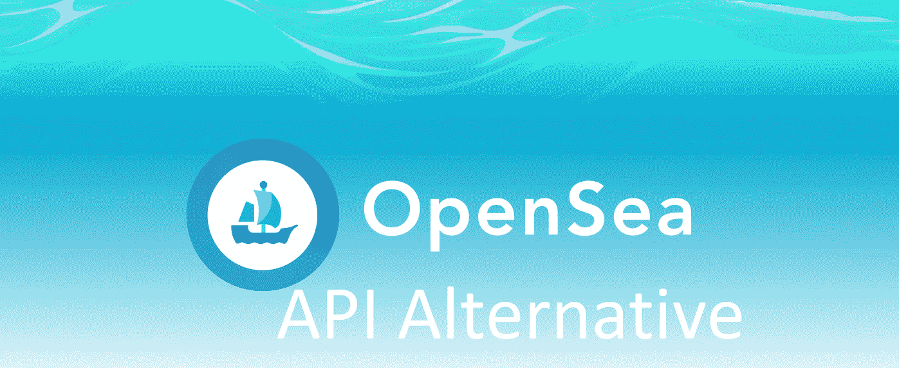
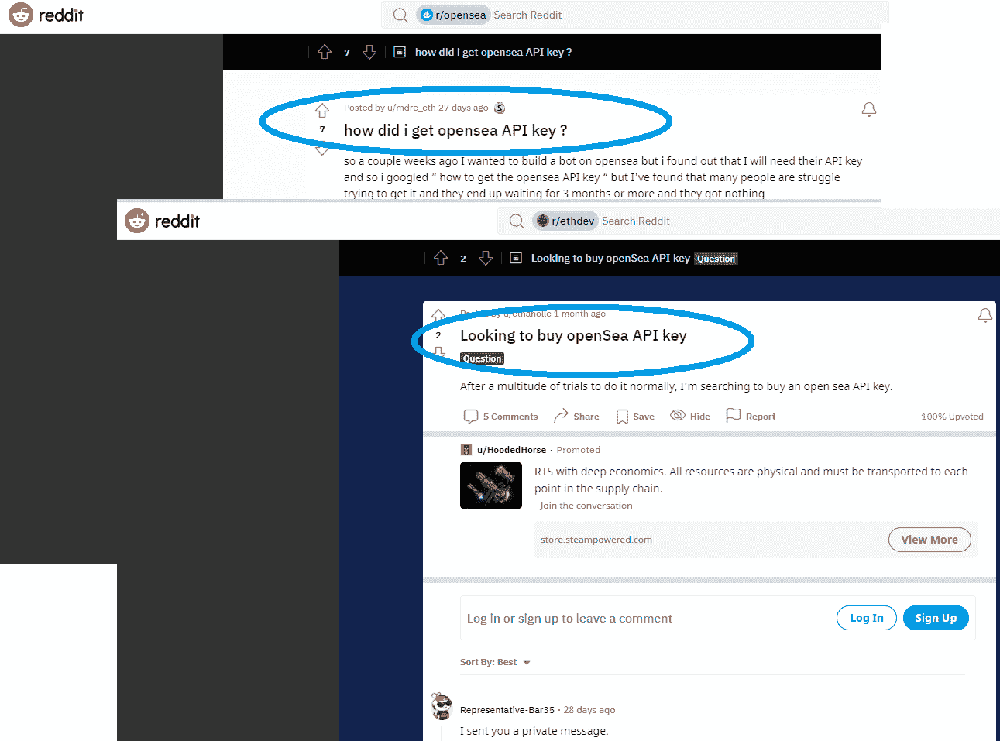
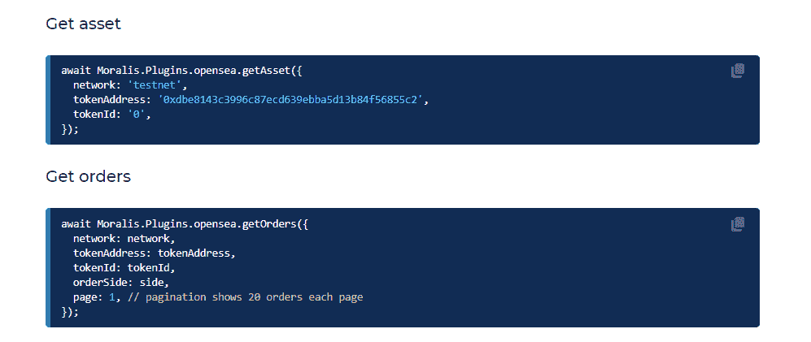
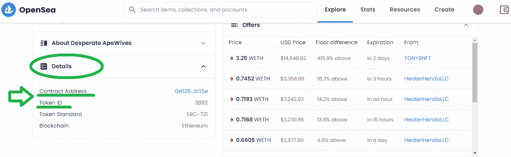
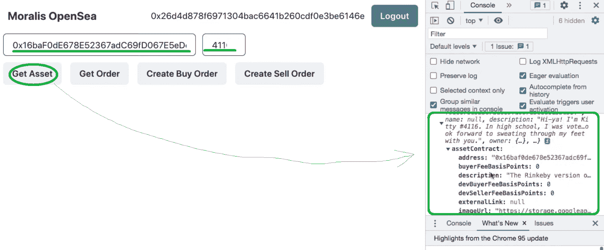
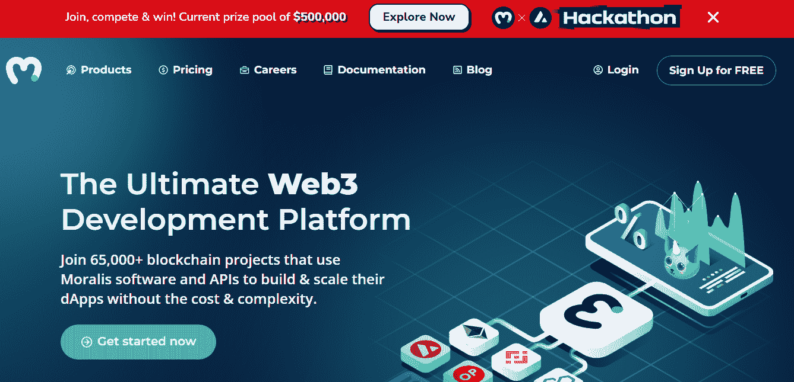

# 2022 年获得 OpenSea API 密钥——完整指南

> 原文：<https://moralis.io/get-an-opensea-api-key-in-2022-full-guide/>

在本文中，我们将探索在 2022 年获得一个 OpenSea API 密匙，以及为什么这几乎是不可能的。相反，开始构建您的 NFT 项目的最简单方法是使用 Moralis NFT API。

**full nf API documentation**[https://github . com/nf-API/nf-API](https://github.com/nft-api/nft-api)

* * *

**由于不可替代代币(** [**NFTs**](https://moralis.io/non-fungible-tokens-explained-what-are-nfts/) **)的受欢迎程度，OpenSea 等 NFT 市场需求旺盛。反过来，程序员也在寻求建立这样的市场。然而，许多开发人员在试图获得 OpenSea API 密钥时面临问题。然而，OpenSea API 密钥的缺乏是非常严重的，它们几乎是不可获得的。此外，还有一个 OpenSea 速率限制问题，进一步限制了程序员的开发过程。因此，开发者在开发 OpenSea 时会面临巨大的问题。幸运的是，有一种方法可以解决获取 OpenSea API 密钥的需求。在这份 2022 年完整指南中，我们将探讨获得 OpenSea API 密钥是否是 NFT 开发的最佳方式，或者您是否应该实现一个更有效的 OpenSea API 密钥替代方案。**

除非你一直生活在岩石下，否则你一定听说过首屈一指的 [Web3](https://moralis.io/the-ultimate-guide-to-web3-what-is-web3/) 开发平台——[Moralis](https://moralis.io/)。这个“[的加密](https://moralis.io/firebase-for-crypto-the-best-blockchain-firebase-alternative/)平台已经打破了区块链的开发模式有一段时间了。目前，它在开发者中的采用率是最高的。怎么会这样首先，它使开发人员能够轻松克服 RPC 节点的所有[限制。通过使用终极](https://moralis.io/exploring-the-limitations-of-rpc-nodes-and-the-solution-to-them/)[以太坊 dApp 样板](https://moralis.io/ethereum-dapp-boilerplate-full-ethereum-react-boilerplate-tutorial/)，Moralis 使您能够在几分钟内部署[分散式应用](https://moralis.io/decentralized-applications-explained-what-are-dapps/) (dApps)。此外，正如您现在可能已经意识到的，Moralis 是整个“获取 OpenSea API 密钥”主题的解决方案。

实质上，Moralis 为您提供了一个 [OpenSea API 替代方案](https://moralis.io/opensea-api-alternative-list-nfts-with-this-opensea-plugin/)，因此解决了对 NFT API 密钥的巨大需求。有了 Moralis T2 NFT API T3，你就可以和 OpenSea 互动了。此外，您还将了解 [NFT 代币开发](https://moralis.io/nft-token-development-the-ultimate-guide/)、 [NFT 游戏开发](https://moralis.io/nft-game-development-how-to-build-an-nft-game-app-in-minutes/)、[创建自己的 NFT 市场](https://moralis.io/how-to-create-an-nft-marketplace/)、[构建 NFT 交易界面](https://moralis.io/build-an-nft-trading-interface-full-guide/)等等。因此，[今天就创建您的免费 Moralis 账户](https://admin.moralis.io/register)并克服“获取 OpenSea API 密钥”的挑战！



## 如何获得一个 OpenSea API 密钥

开发人员在试图获得 OpenSea API 密钥时所面临的挑战看起来几乎是荒谬的。事实上，甚至有 OpenSea API 关键 Reddit 线程，据称有卖家出售 OpenSea API。现在，您可能仍然想知道，“如何获得 OpenSea API 密钥？”。目前，这几乎是不可能的。此外，开发者不需要通过 OpenSea API 密匙 Reddit 卖家购买 API 密匙。

可以想象，当开发人员开发他们的项目时，这个问题给他们带来了很大的障碍。幸运的是，你现在知道 Moralis 提供了一个解决方案。具体来说，通过 Moralis NFT API，您可以轻松地构建自己的 NFT 平台，并且不需要担心获得 OpenSea API 密钥。此外，在构建像 NFT 市场这样的 Web3 项目时，你有两种选择:从头开始，或者使用最实用的 [Web3 样板文件](https://moralis.io/web3-boilerplate-beginners-guide-to-web3/)走捷径。通过克隆 [GitHub 代码](https://github.com/ethereum-boilerplate/ethereum-boilerplate)，你可以在几分钟内快速启动一个拥有整洁 UI 的全功能 dApp。无论你决定专注于哪条道路，Moralis NFT API 都会支持你。另一方面，如果你喜欢花几个小时搜索 OpenSea API 的关键 Reddit 线程，无论如何，试试吧。



## 获取 OpenSea API 关键替代项

在这一点上，您知道 Moralis 为您提供了一种获得 OpenSea API 密钥替代的方法。具体来说，Moralis NFT API 是 OpenSea API 的替代品。此外，要使用这些非凡的工具，您需要完成初始设置。因此，我们决定将事情分解成简单的步骤，我们将在下面介绍。

所有你需要做的基本上只是调整代码。为此，您需要使用代码编辑器(我们更喜欢 Visual Studio 代码[VSC])。此外，我们不仅会带您浏览代码，我们甚至会为您提供完整的代码。

## 一旦你得到了 OpenSea API 的关键替代品，就使用它——一个示例项目

虽然您可能还在浪费时间搜索 Google 或各种 OpenSea API 关键 Reddit 线程，但您已经做好了准备。然而，在我们进行代码演练之前，让我们预览一下这个示例项目的最终结果。使用下面的截图，你可以看到我们的 dApp 是一个简单而整洁的 [OpenSea 克隆](https://moralis.io/opensea-clone-create-an-nft-marketplace-like-opensea/)。通过关注后端功能而不是 UI(用户界面)，示例项目达到了它的目的。这向您展示了使用 [Moralis 的 SDK](https://moralis.io/exploring-moralis-sdk-the-ultimate-web3-sdk/) 是多么容易，因此涵盖了所有与区块链相关的后端方面。然而，无论如何，将这个示例项目提升到一个新的水平，使用您的 [JavaScript](https://moralis.io/javascript-explained-what-is-javascript/) 技能创建一个令人惊叹的 UI。


查看上面的截图，您可以看到以下特征:

*   [**以太坊认证**](https://moralis.io/ethereum-authentication-full-tutorial-to-ethereum-login-programming/) :我们的例子 dApp 带有一个 Web3 登录和注销选项，这是通过使用 Moralis 的 [MetaMask](https://moralis.io/metamask-explained-what-is-metamask/) 集成来完成的。
*   **两个输入字段**:左边的一个用于 NFT 合同地址，右边的一个用于令牌 id。
*   **四个按钮**:
    *   “获取资产”按钮。
    *   “获取订单”按钮。
    *   “创建购买订单”按钮。
    *   “创建销售订单”按钮。

下面的代码演练将引导您完成设置上述功能的过程。

### 代码演练–初始化 Moralis 并准备好 OpenSea API 关键替代项

*注* *:如前所述，我们在我们的* [*GitHub 页面*](https://github.com/YosephKS/moralis-opensea-plugins) *上为您提供了完整的代码。我们鼓励您使用它，因为我们在这里只涉及某些部分。*

如果你有前端开发的经验，你会知道在创建上面预览的 dApp 的 UI 时，我们可以有很多方法。让我们看看与 OpenSea 的交互，例如，与 Moralis 的 [OpenSea 插件](https://moralis.io/opensea-api-alternative-list-nfts-with-this-opensea-plugin/)。我们首先创建一个新的“React”项目和这三个文件:“ [index.js](https://github.com/YosephKS/moralis-opensea-plugins/blob/main/src/index.js) ”、“ [App.js](https://github.com/YosephKS/moralis-opensea-plugins/blob/main/src/App.js) ”和“ [package.json](https://github.com/YosephKS/moralis-opensea-plugins/blob/main/package.json) ”。此外，我们安装了最新版本的 Moralis 和 Moralis-React 库。此外，我们在“index.js”文件中导入了这些库:

```js
import React from "react";
import ReactDOM from "react-dom";
import { MoralisProvider } from "react-moralis";
import { ChakraProvider } from "@chakra-ui/react";
import "./index.css";
import App from "./App";
import reportWebVitals from "./reportWebVitals";
```

然后，插入相应的服务器 URL 和应用程序 ID:

```js
<MoralisProvider
				appId={process.env.REACT_APP_MORALIS_APP_ID}
				serverUrl={process.env.REACT_APP_MORALIS_SERVER_URL}
			>
				<App />
			</MoralisProvider>
```

另一个关键动作是在“ *App.js* ”文件中初始化 OpenSea 插件。您还需要导入“useMoralis”挂钩。我们在“ *App.js* ”的顶部这样做:

```js
import { useMoralis } from "react-moralis";
```

此外，让我们在“App()”函数中调用该挂钩:

```js
function App() {
	const {
		Moralis,
		user,
		logout,
		authenticate,
		enableWeb3,
		isInitialized,
		isAuthenticated,
		isWeb3Enabled,
	} = useMoralis();
```

现在，我们最后初始化“useEffect()”函数中的插件:

```js
	useEffect(() => {
		if (isInitialized) {
			Moralis.initPlugins();
		}
		// eslint-disable-next-line
	}, []);
```

这就涵盖了 *"App.js"* 文件的要旨。这是对 Moralis NFT API 的一个很好的补充，这使你能够得到 OpenSea API 的关键替代品。

### 代码演练–添加功能

知道了我们的示例 dApp 应该是什么样子和做什么，您也可以开始添加功能。后者必须使我们能够使用“获取资产”、“获取订单”、“创建买入订单”和“创建卖出订单”按钮。在这里，您将能够非常依赖 OpenSea 插件。因此，您可以复制那里提供的代码片段。但是，首先，通过在 VSC 终端输入****yarn start****来初始化“yarn”(或“npm”)包管理器。**

**

接下来，正确检查正在运行的 Web3 应用程序非常重要。幸运的是，您可以使用浏览器的控制台来实现这一目的:


#### “获取资产”功能

当谈到我们的“获取资产”按钮时，插件网页上的代码行稍加修改就可以完成任务:

```js
const getAsset = async () => {
		const res = await Moralis.Plugins.opensea.getAsset({
			network: "testnet",
			tokenAddress: values.tokenAddress,
			tokenId: values.tokenId,
		});
		console.log(res);
	};
```

“ *tokenAddress* 和“ *tokenID* 旁边的值需要进行更改，以便从我们的示例 Web3 应用程序的两个条目字段中获取。*令牌地址和令牌 id 可以在 OpenSea 上获得:*



此外，我们需要提到 Moralis。Plugins.opensea.getAsset "。这就是 Moralis 为与特定令牌地址和令牌 ID 相关的链上信息施展魔法的地方。我们建议您使用示例资产。然后，使用浏览器的控制台查看 dApp 的运行情况:



#### “获取订单”功能

接下来，要了解“获取订单”功能，只需按照“获取资产”按钮的提示进行操作(如上所述)。下面是用于该功能的几行代码(“ *App.js* ”):

```js
const getOrder = async () => {
		const res = await Moralis.Plugins.opensea.getOrders({
			network: "testnet",
			tokenAddress: values.tokenAddress,
			tokenId: values.tokenId,
			orderSide: 0, // 0 is for buy orders, 1 is for sell orders
			page: 1, // pagination shows 20 orders each page
		});
		console.log(res);
	};
```

同样，我们鼓励您使用浏览器的控制台来检查“获取订单”功能是否正确地从 OpenSea 获取数据:


#### “创建购买订单”功能

对于“创建购买订单”，使用与上述两个功能相同的原则。通过从插件的文档页面复制代码行，并应用小的调整，您将得到:

```js
	const createBuyOrder = async () => {
		await Moralis.Plugins.opensea.createBuyOrder({
			network: "testnet",
			tokenAddress: values.tokenAddress,
			tokenId: values.tokenId,
			tokenType: "ERC721",
			amount: 0.0001,
			userAddress: web3Account,
			paymentTokenAddress: "0xc778417e063141139fce010982780140aa0cd5ab",
		});

		console.log("Create Buy Order Successful");
	};
```

确保“令牌类型”值与您正在搜索的令牌类型(“令牌地址”和“令牌 ID”)匹配。幸运的是，OpenSea 插件同时支持 ERC-721 和 T2-ERC-1155 和 NFT 标准。

#### “创建销售订单”功能

在这一点上，你知道该怎么做。因此，使用以下代码行向“创建销售订单”按钮添加功能:

```js
	const createSellOrder = async () => {
		const expirationTime = Math.round(Date.now() / 1000 + 60 * 60 * 24);
		const startAmount = 1;
		const endAmount = 1;

		await Moralis.Plugins.opensea.createSellOrder({
			network: "testnet",
			tokenAddress: values.tokenAddress,
			tokenId: values.tokenId,
			tokenType: "ERC1155",
			userAddress: web3Account,
			startAmount,
			endAmount,
			expirationTime: startAmount > endAmount && expirationTime, // Only set if you startAmount > endAmount
		});

		console.log("Create Sell Order Successful");
	};
```

与“获取订单”功能一样，确保“tokenType”值与您的 NFT 类型相匹配。另外，请注意，您只能为您拥有的 NFT 创建卖出订单。

如果你跟随我们的领导并实现了所有上述的特性，你就成功地完成了你的 dApp 例子。因此，您也使用了最终的 OpenSea API。但是，我们建议您观看下面的视频，以获得更详细的指导和代码演练:

https://www.youtube.com/watch?v=r2YFhfjIb3k

## 获取 OpenSea API 密钥并避免 Reddit 黄牛——摘要

不幸的是，当开发者想要获得 OpenSea API 密钥时，他们面临着严峻的挑战。事情发展到目前为止，许多 OpenSea API 密钥 Reddit 黄牛现在正在出售这些受欢迎的 API 密钥。幸运的是，还有另一种选择，叫做 Moralis。后者附带了最终的 NFT API，使 NFT 开发变得非常简单，并且是一个很好的 OpenSea API 关键备选方案。除了 Moralis NFT API，Moralis 还提供了 OpenSea 插件，使您能够轻松访问这个受欢迎的 NFT 市场上的资产链数据。当然，还有其他可用的 [NFT API 替代品](https://moralis.io/nft-api-alternatives-comparing-alchemys-nft-api-with-moralis-nft-api/)，所以请随意探索您的选择。

此外，除了将 Moralis 用于 NFT 项目之外，它同样能够快速推进您在其他加密领域的进展。更多细节和指导，请务必访问[Moralis 博客](https://moralis.io/blog/)和[Moralis YouTube 频道](https://www.youtube.com/c/MoralisWeb3)。我们在这两个网站上发布了大量的示例项目和教育文章。例如，我们的一些最新主题深入到 [Web3.js vs Ethers.js](https://moralis.io/web3-js-vs-ethers-js-guide-to-eth-javascript-libraries/) 、[以太坊汽油费](https://moralis.io/ethereum-gas-fees-the-ultimate-2022-guide/)和[无汽油交易](https://moralis.io/gasless-transactions-exploring-gasless-transactions-on-ethereum/)、 [Web3 钱包](https://moralis.io/what-is-a-web3-wallet-web3-wallets-explained/)、[wallet connect Android SDK](https://moralis.io/walletconnect-android-sdk-alternative-authenticate-android-apps-withmoralis/)、 [GameFi 和 play-to-earn (P2E)](https://moralis.io/what-is-gamefi-and-play-to-earn-p2e/) 、[如何通过网站](https://moralis.io/how-to-interact-with-smart-contracts-through-your-website/)与智能合约交互，以及许多其他主题。此外，还要注意还有一个更专业的选择供您选择—[Moralis 学院](https://academy.moralis.io/)。有了最新的课程、支持社区和专家指导，你应该很快就会成为区块链开发者。

**