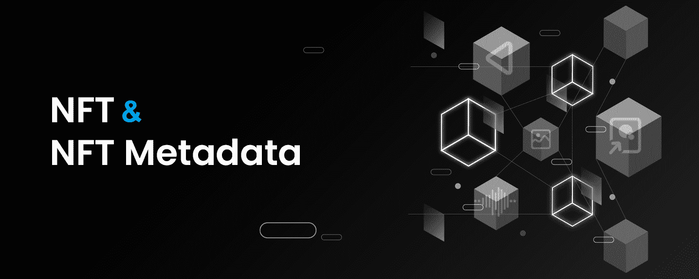
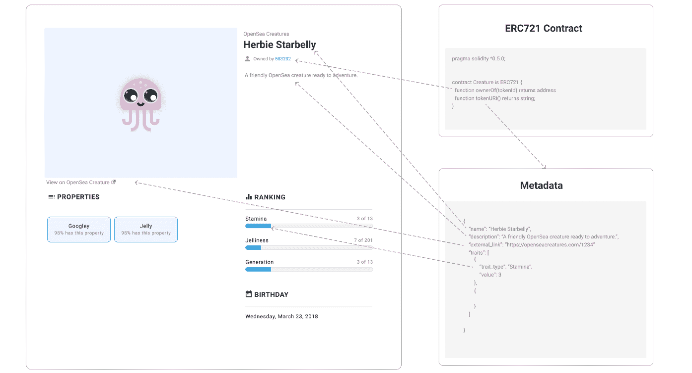
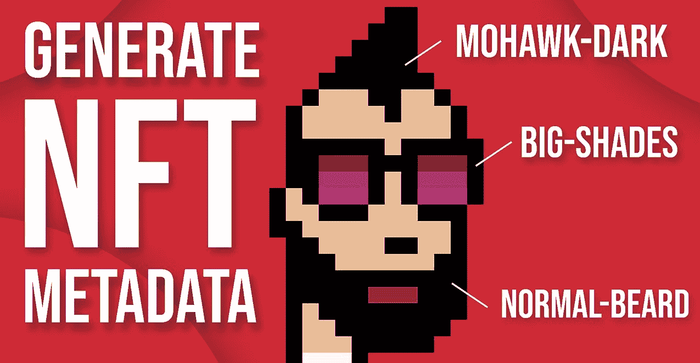
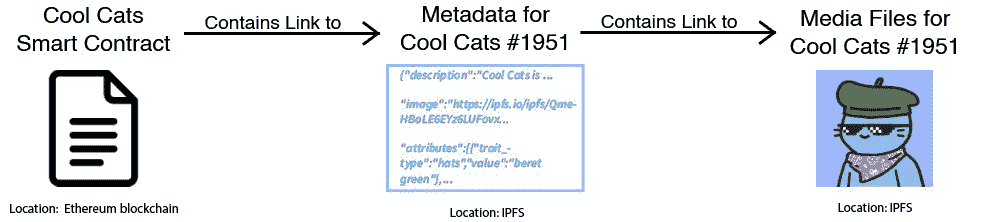
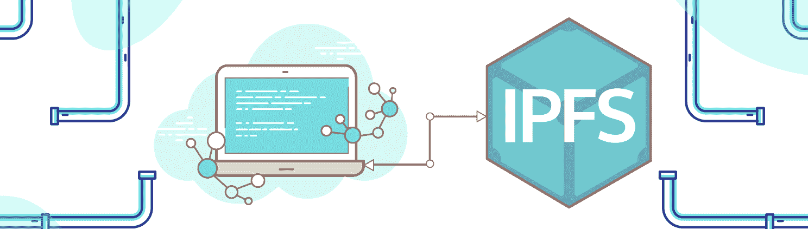
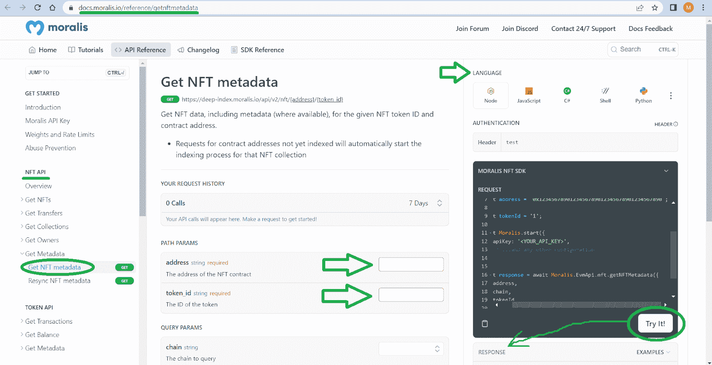
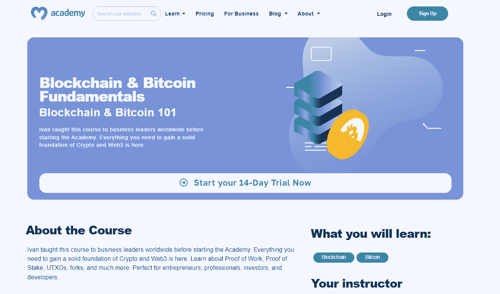

# 获取 NFT 元数据-如何获取 NFT 的元数据

> 原文：<https://moralis.io/get-nft-metadata-how-to-get-the-metadata-of-an-nft/>

当[创建一个 NFT 项目](https://moralis.io/how-to-create-an-nft-project-get-started-and-launch-successfully/)时，简化 NFT 相关任务的工具，比如获取 NFT 元数据，是必不可少的。得益于来自 Moralis 的[终极 NFT API](https://moralis.io/nft-api/) ，开发者在使用“ *getNFTMetadata* ”端点时可以轻松获得 NFT 的元数据:

```js
const response = await Moralis.EvmApi.nft.getNFTMetadata({
    address,
    chain,
    tokenId,
});
```

那么，如何获得 NFT 元数据呢？就像使用上面的代码片段一样简单！现在，如果你以前使用过[Moralis](http://moralis.io)web 3 API，你很可能知道如何在你的脚本中正确地合并上面的代码行。因此，只需使用下面的文档链接即可开始！然而，如果你是 Moralis 的新手，一定要完成这篇文章的教程。通过这样做，您将了解如何以最简单的方式获取 NFT 元数据。你只需要你的[免费 Moralis 账户](https://admin.moralis.io/register)和几分钟时间就能到达终点。

[**Access the “getNFTMetadata” Endpoint**](https://docs.moralis.io/reference/getnftmetadata)

### 概观

到目前为止，JPEGs 是最常见的表示 NFTs 的文件，但是这些文件可以有各种各样的格式和类型。也就是说，这些文件并不是 NFT 带来的真正价值。NFT 的终极财富在于它们独特的加密，这使得它们非常适合于表示独特的数字或物理项目。此外，元数据隐藏在令牌的链上签名中；因此，作为开发人员，了解如何获取 NFT 元数据非常重要。这正是为什么您应该学习使用 Moralis " *getNFTMetadata* "端点的原因。



然而，在我们仔细研究这个令人敬畏的 NFT API 端点以及如何利用它之前，我们需要了解一些基础知识。因此，我们将首先确保您知道什么是 NFT 元数据以及它存储在哪里。有了这个理论，你就能体会到使用上述端点来完成今天的任务有多容易。



## NFT 元数据到底是什么？

根据定义，元数据是提供其他数据信息的数据。因此，NFT 元数据提供关于与不可替代令牌相关的数据的信息。也就是说，您必须了解什么是 NFT 才能正确理解 NFT 元数据。

正如“不可替代”所暗示的，不可替代令牌(NFT)是不可互换的独特类型的区块链资产。每个 NFT 都有一个唯一的令牌 ID，即使它们使用相同的代表 NFT 的文件。此外，每个 NFT 的链上数据都是独一无二的，这使得它们非常适合数字艺术，数字收藏品，所有权证明，证书等。

现在，我们建议您看一下上面的图像，以便更好地了解 NFT 元数据包括哪些细节。请注意，从技术和财务角度来看，代表 NFT 的文件太大，我们无法将它们直接存储在区块链上。因此，我们使用云存储解决方案(理想情况下是分散的)来存储这些文件。然后，我们使用文件的位置链接(URL)并将它们包含在 NFT 元数据中。所以，当你学会获取数据时，你也学会了获取代表 NFT 的文件。



当然，在元数据文件中还有关于 NFT 的其他信息，通常是 JSON 格式的。特定元数据文件包含的确切详细信息因 NFT 类型而异。然而，某些 NFT 标准(ERC-721，ERC-1155，SPL 等。)以提供指导。此外，NFT 元数据中有一些强制信息和一些可选信息。例如，在 ERC-721 或 ERC-1155 NFTs 的情况下，元数据通常包括描述、名称和代表 NFT 的文件目的地，你甚至可以[给 NFTs](https://moralis.io/how-to-add-attributes-to-nft-metadata/) 或 traits 添加属性。

## NFT 的元数据存储在哪里？

上面，我们提到了表示 NFTs 的文件太大，无法存储在区块链上。虽然 NFT 元数据文件通常要小得多，但将其直接存储在区块链上仍然不切实际。相反，当创建 NFT(部署 NFT 智能合约)时，我们保存区块链上的 NFT 元数据链接(URIs)。我们还使用云存储解决方案来保存 NFT 元数据文件。



此外，值得指出的是，参与 Web3 开发的每个人都应该以最高级别的去中心化为目标。因此，理想情况下，NFT 开发人员应该使用分散存储解决方案存储所有文件和 NFT 元数据文件。但是，在某些情况下，项目可以通过实际使用集中式 NFT 元数据存储选项来为用户增加价值。也就是说，代表 NFTs 和 NFT 元数据的文件的确切位置因项目而异。



例如，认真对待去中心化的 NFT 项目将他们代表 NFT 的文件和他们的 NFT 元数据存储在某种去中心化的云存储解决方案中。一个流行的选择是星际文件系统(IPFS)解决方案。另一方面，一个更加集中的 NFT 项目将使用一个集中的云存储服务来存储其 NFT 文件和元数据。尽管如此，一种集中和分散的 NFT 项目的混合体也是可能的。在这种情况下，NFT 元数据可以以分散的方式存储，而代表 NFT 的文件将使用集中存储解决方案存储，反之亦然。

此外，值得指出的是，无论您将文件和 NFT 元数据存储在哪里，实际的令牌仍然是在区块链上铸造的。因此，它们的契约地址和 id 是不可变的。此外，当您想要获取 NFT 元数据时，您不需要知道它存储在哪里。

## 如何获取 NFT 元数据

感谢上面介绍的关于 NFT 元数据的细节，您现在知道了要获得 NFT 元数据，您需要寻找指向 JSON 文件的 NFTs 的 URI 链接。此外，您还知道这些 URIs 包含所有细节，包括相关的代表 NFT 的文件的 URL。因此，如果您不打算围绕 NFTs 进行任何编程，您可以简单地使用区块链探索者或 NFT 市场来获取 NFT 的元数据。尽管如此，您也可以使用 Moralis " *getNFTMetadata* "端点的[文档页面](https://docs.moralis.io/reference/getnftmetadata)。因为我们将在接下来的教程中使用该端点，所以让我们一起仔细看看它:



查看上面的屏幕截图，您可以看到这个端点允许您测试脚本并复制与您首选的可编程语言相匹配的代码片段。此外，您可以看到，为了获得 NFT 的 NFT 元数据，您需要输入一些参数。NFT 智能合同地址和令牌 ID 是必需的，而“*链*”、“*格式*”和“*规格化元数据*”是可选的。因此，请确保获得您的 Moralis Web3 API 密钥(请参见下面的"*步骤 1:设置 Moralis* "部分)并使用" *getNFTMetadata* "端点进行测试。

尽管如此，请注意“ *getNFTMetadata* ”只是 NFT API 的最终端点之一。因此，我们鼓励您浏览 Moralis 文档，以了解关于这个强大工具的更多信息。毕竟，这些端点是您轻松构建各种 NFT dapp 的通行证。除了获得 NFT 元数据，你还可以获得所有权数据，NFT 转让数据，NFT 价格，等等。为了给你的用户提供一个简单的方法来验证他们自己，一定要看看 Moralis [Web3 验证 API](https://moralis.io/authentication/) 。此外，通过 [Web3 streams](https://web3streams.com/) ，用户可以将区块链的数据直接传输到他们的后端！


## 教程-如何获取 NFT 的元数据

现在您已经了解了获取 NFT 元数据背后的理论，是时候动手了。因此，请确保完成以下章节中概述的三个步骤。但是，在处理这些步骤之前，您需要完成以下先决条件:

*   安装您喜欢的包管理器(npm、yarn 或 pnpm)。
*   准备好你最喜欢的 IDE 或者代码编辑器。我们更喜欢使用 Visual Studio 代码(VSC)。
*   安装 Node v.14 或更高版本。

如果您准备好了上述所有工具，就可以使用" *getNFTMetadata* "端点来获取 NFT 的元数据了。

### 步骤 1:建立 Moralis 观

你需要你的 Moralis Web3 API 密匙来使用终极 NFT API。幸运的是，你可以从你的 Moralis 管理区获得密钥。要访问后者，你需要创建一个免费的 Moralis 账户。因此，请使用本文开头所述的“免费 Moralis 账户”链接，或者点击 Moralis 主页右上角的“免费开始”按钮:


无论你选择哪条路，你都会进入注册页面。在那里，只需输入您的详细信息。输入您的全名、电子邮件地址和密码，接受条款和条件，然后单击“注册”按钮:


最后但同样重要的是，不要忘记通过电子邮件收件箱中等待您的确认链接来确认您的帐户。

随着您的帐户启动和运行，您可以访问您的 Moralis 管理区。从那里，您将能够通过以下两个步骤复制您的 Web3 API 密钥:


暂时保留您的 API 密钥。首先，通过运行下面的命令之一来安装 Moralis SDK。选择与您正在使用的软件包管理器相匹配的软件包:

```js
npm install moralis
```

```js
yarn add moralis
```

```js
pnpm add moralis
```

### 步骤 2:使用示例脚本

在本节中，我们将为您提供一个示例脚本，该脚本只需几行代码即可获取 NFT 的元数据。因此，这是一个获取 NFT 元数据的示例“index.js”脚本:

```js
const Moralis = require("moralis").default;
const { EvmChain } = require("@moralisweb3/evm-utils");

const runApp = async () => {
  await Moralis.start({
    apiKey: "YOUR_API_KEY",
    // ...and any other configuration
  });

  const address = "0xb47e3cd837dDF8e4c57F05d70Ab865de6e193BBB";

    const chain = EvmChain.ETHEREUM;

  const tokenId = 3931;

  const response = await Moralis.EvmApi.nft.getNFTMetadata({
      address,
      chain,
      tokenId,
  });

  console.log(response);
}

runApp();
```

*注意* *:如果你更喜欢使用 TypeScript，点击上面的“文档页面”链接，选择“index.ts”。*

看上面几行代码，可以看到“ *EvmChain。以太坊*”。如果您还记得的话，这是“ *getNFTMetadata* ”端点接受的一个可选参数。此外*，*该参数定义了我们的目标 NFT 存储在哪个链上。因为我们关注的是 ID 为 3931 的密码朋克 NFT，所以我们需要关注以太坊链。然而，如果你要探索其他链上的 NFT，你只需要用另一个链替换"*以太坊*"。在这种情况下，请务必查看 Moralis 支持的 [EVM 兼容链](https://docs.moralis.io/docs/cross-chain-requests#supported-evm-chains)。

另外，不要忘记将您的 Moralis Web3 API 粘贴到“ *YOUR_API_KEY* ”参数中。

### 步骤 3:执行程序以获取 NFT 元数据

此时，您应该已经准备好了“index.js”或“index.ts”文件。因此，您可以执行程序来获取特定地址和 NFT 令牌 ID 的 NFT 元数据。为此，请使用您的终端并输入以下两个命令之一:

**对于 JavaScript:**

```js
node index.js
```

**对于打字稿:**

```js
node index.ts
```

一旦您执行了适当的命令，查看您的终端，看看代码返回什么。如果您使用“*0x b 47 E3 CD 837 ddf 8 e4c 57 f 05d 70 ab 865 de 6e 193 BBB*”地址和 3931 令牌 ID，您应该会看到以下结果:

```js
{
  "token_address": "0xb47e3cd837ddf8e4c57f05d70ab865de6e193bbb",
  "token_id": "3931",
  "transfer_index": [
    13868997,
    30,
    36,
    0
  ],
  "owner_of": "0x1cf2b8c64aed32bff2ae80e701681316d3212afd",
  "block_number": "13868997",
  "block_number_minted": "5754322",
  "token_hash": "3c86855c82470edd82df190019e83f16",
  "amount": "1",
  "contract_type": null,
  "name": "CRYPTOPUNKS",
  "symbol": "Ͼ",
  "token_uri": "https://www.larvalabs.com/cryptopunks/details/3931",
  "metadata": "{\"image\":\"https://www.larvalabs.com/cryptopunks/cryptopunk3931.png\",\"name\":\"CryptoPunk 3931\",\"attributes\":[\"Vampire Hair\",\"Goat\"],\"description\":\"Male\"}",
  "last_token_uri_sync": null,
  "last_metadata_sync": "2022-05-12T18:00:22.340Z",
  "minter_address": "0xc352b534e8b987e036a93539fd6897f53488e56a"
}
```

查看上面的结果，您可以看到，得益于" *getNFTMetadata* "的强大功能，您获得了 NFT 的元数据 URI 和 NFT 元数据中包含的所有细节。因此，您现在可以在各种 NFT dapp 中轻松利用这些细节。


## 获取 NFT 元数据-如何获取 NFT 的元数据-摘要

今天的文章演示了如何用几行代码获取 NFT 元数据。您还有机会了解了什么是 NFT 元数据以及我们将它存储在哪里。因此，您现在知道可以使用集中式或分散式存储解决方案以 JSON 文件的形式存储元数据。然后，在创建 NFT 时，使用元数据的 URI 链接。因此，NFT 元数据本身并不存储在区块链上，而只存储在其 URI 链接上。此外，您还看到，通过使用 Moralis " *getNFTMetadata* "端点，您可以从元数据中提取所有细节。因此，你现在准备创建一些杀手 NFT dapp。

如果你在创建 dapps 时需要一些练习或指导，一定要使用 Moralis 的资源。使用 Moralis 文档探索最终的 Web3 API。在那里，你还可以找到各种适合初学者的教程。然而，如果你有兴趣了解更多关于区块链的发展，那么 [Moralis YouTube 频道](https://www.youtube.com/c/MoralisWeb3)和 [Moralis 博客](https://moralis.io/blog/)是值得一去的地方。在那里，我们涵盖了无数可以帮助你免费成为 Web3 开发者的话题。例如，我们的一些最新文章围绕着为链上事件构建一个[Discord bot](https://moralis.io/blockchain-discord-bot-build-a-discord-bot-for-on-chain-events/)、 [Solana 智能契约示例](https://moralis.io/solana-smart-contract-examples-for-developers/)、如何[从契约中获得所有 NFTs】、](https://moralis.io/how-to-get-all-nfts-from-a-contract/)[加密钱包集成](https://moralis.io/crypto-wallet-integration-using-the-best-crypto-wallet-api/)、集成 [Web3 基础设施](https://moralis.io/web3-infrastructure-exploring-the-best-solution-for-web3-development/)、什么是[以太坊 webhooks](https://moralis.io/ethereum-webhooks-what-they-are-and-how-to-use-webhooks-for-ethereum/) 等等！

还值得指出的是，区块链行业提供了无数的就业机会，通过获得区块链认证，你可以大大提高你成为全职加密员的机会。如果你对此感兴趣，一定要考虑报名参加 Moralis 学院。在那里，你可以找到从初级到高级的各种区块链发展课程。也就是说，我们建议从[区块链和比特币基本面](https://academy.moralis.io/courses/blockchain-bitcoin-101)开始。

