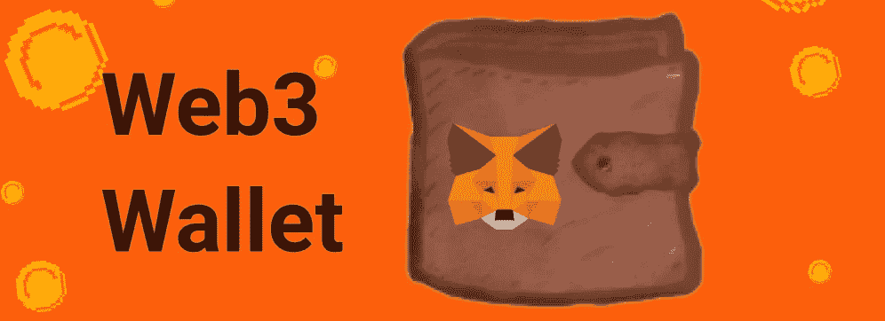
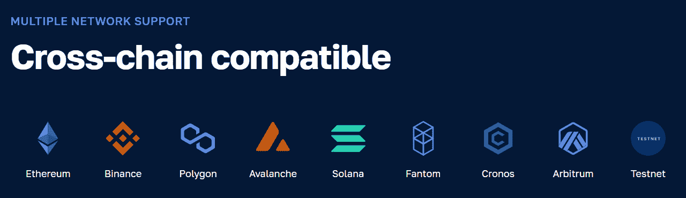
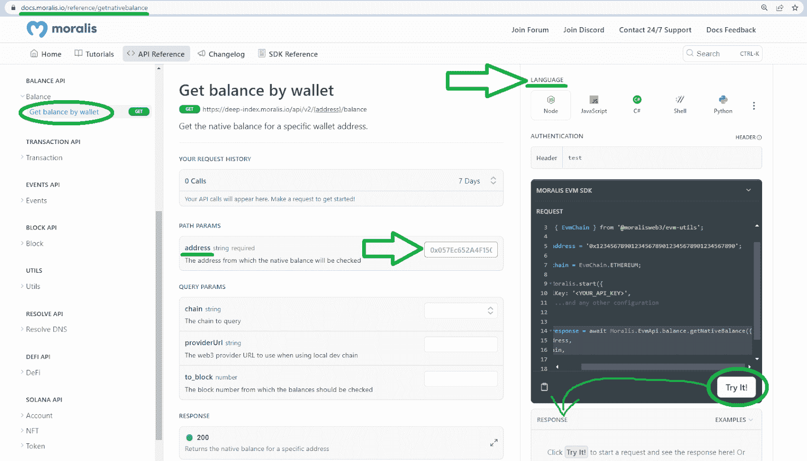
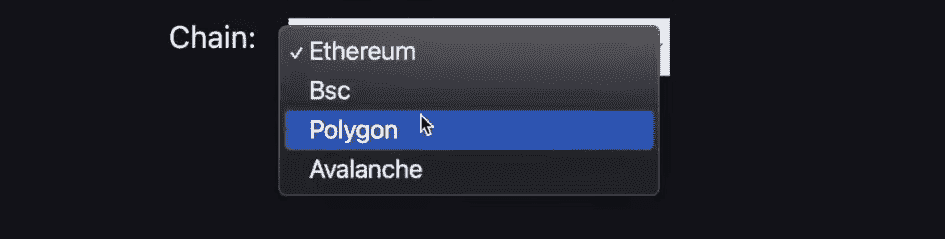
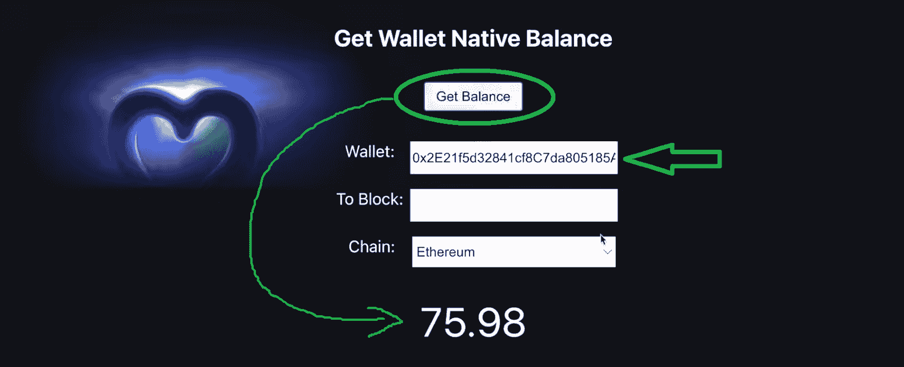
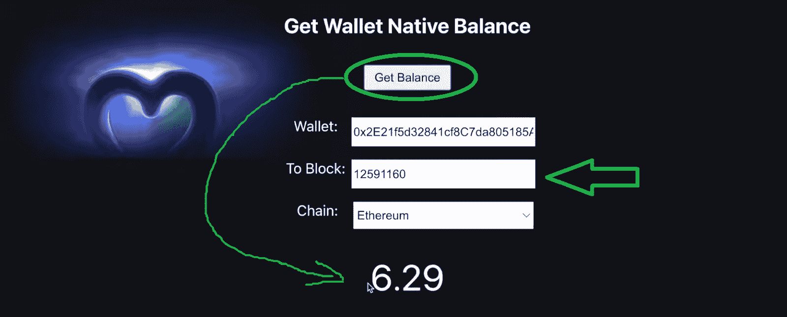
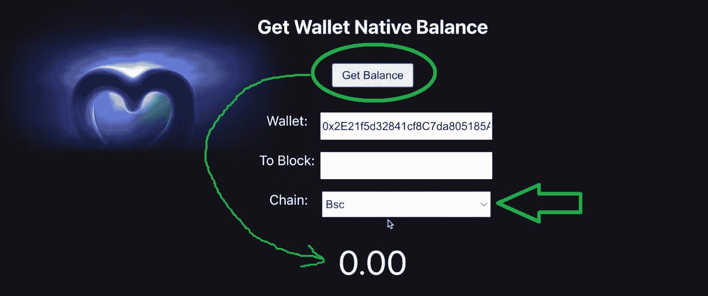
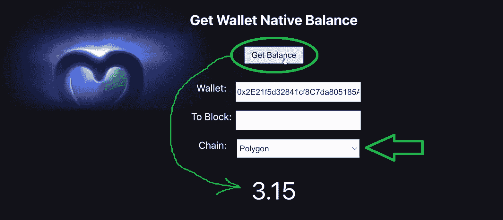
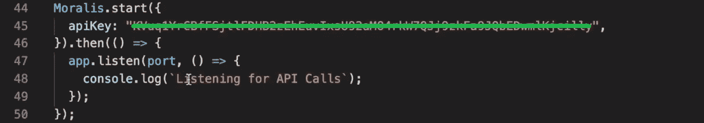

# 获取钱包余额–如何获取钱包本机加密余额

> 原文：<https://moralis.io/get-wallet-balance-how-to-get-wallets-native-crypto-balance/>

得益于市场领先的 [Web3 基础设施](https://moralis.io/web3-infrastructure-exploring-the-best-solution-for-web3-development/)提供商提供的企业级 API，开发人员可以获得 Web3 钱包余额，并为他们的 dapps 添加原生余额功能。通过使用 Moralis 的“ *getNativeBalance* ”端点，您可以立即获得钱包本机加密余额:

```js
const response = await Moralis.EvmApi.balance.getNativeBalance({
    address,
    chain,
});
```

如果你熟悉 [Moralis](https://moralis.io/) 和 NodeJS 框架，你将能够正确地将上述代码行合并到你的脚本中，并获得 Web3 钱包的平衡。此外，您可以通过访问下面的链接立即开始使用上述端点。另一方面，这可能是您第一次使用这个最终的 Web3 API 提供者。在这种情况下，请务必参加下面等待您的简单 dapp 教程。按照我们的建议，学习如何获得 crypto 的钱包余额，你只需要你的[免费 Moralis 账户](https://admin.moralis.io/register)和大约八分钟的时间。

[**Access the “getNativeBalance” Endpoint**](https://docs.moralis.io/reference/getnativebalance)

### 概观

可替代和不可替代令牌(NFT)都是重要的加密资产；但是，它们比不上原生币的重要性。后者是可编程链固有的加密货币。最受欢迎的包括以太坊的 ETH，BNB 智能链(BSC)的 BNB，多边形的 MATIC。也就是说，学习如何获得加密原生硬币的钱包余额是有意义的，这正是你将在本教程中学习做的。在本文中，您将有机会创建一个简单的多链 dapp，它将使您能够轻松获得 Web3 钱包余额。



然而，在我们向您展示如何构建这样一个 dapp 之前，您必须更好地熟悉终极钱包平衡工具——Moralis 的 Web3 API 和“Web3 get wallet balance”端点(也称为“ *getNativeBalance* ”)。因此，我们将确保您了解这个端点的详细信息，以及如何自己进一步探索它。

在介绍了这些基础知识之后，我们将使用我们的示例 dapp 来快速演示如何为 crypto 获取钱包余额。这将给你一个机会来决定你是否愿意卷起袖子跟随我们的领导前进。最后，您将能够通过三个简单的步骤创建自己的 Web3 钱包浏览器 dapp 实例。


## 探索终极钱包平衡工具

在我们关注“Web3 get wallet balance”端点的细节之前，有必要指出 Moralis 提供了许多其他有价值的 API 端点。事实上，正是整个 Moralis 工具箱使其成为终极钱包平衡工具。毕竟，你还可以探索可替代的代币，它们的价格，非功能性交易，加密代币和硬币的转移和交易，并通过 [Web3 streams](https://web3streams.com/) 传输区块链数据。此外，由于 Moralis 是关于跨链互操作性的，你可以在大多数领先的开发区块链上做这些。



此外，Moralis 还具有跨平台的互操作性，这意味着您可以将它的强大功能用于您最喜欢的遗留开发工具。这就是 Moralis 如何帮助你弥合 Web2 和 Web3 之间的发展差距。因此，毫不费力地获得 Web3 钱包平衡的能力只是 Moralis 的众多超能力之一。例如，您还可以使用 Moralis 的 Web3 身份验证 API 实现 [Web3 身份验证](https://moralis.io/authentication/)，使用 Moralis 的[流 API](https://moralis.io/streams/) 与智能合约交互并监听智能合约，以及将 NFT 功能与 Moralis 的 [NFT API](https://moralis.io/nft-api/) 相结合。然而，在这里，我们将重点教你如何获得本机加密钱包余额。

### “Web3 获取钱包余额”端点

首先，我们必须指出“Web3 获取钱包余额”指的是“ *getNativeBalance* ”端点。也就是说，我们邀请您访问该端点的[文档页面](https://docs.moralis.io/reference/getnativebalance):



进入上述页面后，您会注意到您可以通过输入钱包地址来获取任何钱包的本地余额。此外，“ ***地址*** ”参数是该端点接受的唯一必需参数。但是，还有其他可选参数:

*   "**链**"–该参数使您能够选择您想要关注的链。此外，您可以通过单击输入字段来查看想要查询的受支持链的列表。
*   "**provider Url**"–使用本地开发链时，您可以使用此参数来确定 Web3 提供程序 URL。
*   "**to _ block**"-该参数使您能够输入应从其开始检查余额的块号。这样，你就可以探索各种钱包余额的完整历史。

此外，查看文档页面的截图，您可以看到您可以在页面的右上角选择编程语言。然后，您可以简单地从“请求”字段中复制所需的代码片段。当然，你也可以用“试试看！”按钮来检查响应。


## 如何使用 Moralis 来平衡钱包

现在你已经知道了“Web3 获得钱包平衡”端点的来龙去脉，是时候开始今天的教程了。通过遵循下一节中的细节，您将能够构建一个示例钱包浏览器 dapp。最终，你需要完成以下三个步骤来获得 Web3 钱包余额:

1.  创建 NodeJS 后端 Dapp
2.  初始化 Moralis
3.  创建 ReactJS 前端 Dapp

然而，在向您展示如何为 crypto 获取钱包余额之前，让我们快速演示一下我们的示例 dapp。

### 通过我们的示例 Dapp–演示获得 Web3 钱包余额

下面的截图展示了我们的“获取钱包原生余额”dapp 的样子:


正如你所看到的，它的标题在顶部，后面是“获得平衡”按钮。然而，在我们使用该按钮获取 Web3 钱包余额之前，我们需要输入必需的参数——钱包地址。此外，我们的示例 dapp 还通过“To Block”输入字段提供了关注任何过去的块的选项。最后但同样重要的是,“链”选项使我们能够选择我们想要关注的网络:



当我们粘贴一个钱包地址并保持选择“以太坊”选项时，我们可以获得该钱包的当前本地余额(ETH):



此外，如果我们还输入一个块号，我们将获得添加该块当天该钱包的过去余额:



看上面的截图，可以看到同样的钱包在 2021 年 6 月 8 日(添加“12591160”块的时候)的 ETH 余额低了很多。

我们还可以调整链来获得其他本机钱包余额:

*   这个钱包里没有 BNB 硬币:



*   示例钱包有 3.15 MATIC 硬币:



*   对于该钱包地址，雪崩本地硬币(AVAX)的余额也为零:


如果您想自己学习如何使用我们的示例 dapp 获得加密硬币的钱包余额，请完成接下来的三个步骤。

### 步骤 1:创建 NodeJS 后端 Dapp

*注意:如果您以前从未创建过 NodeJS 应用程序，请首先完成 Moralis 文档中“* [NodeJS](https://docs.moralis.io/docs/nodejs-dapp-from-scratch) *”页面上的步骤。这样，您就可以正确地安装所需的依赖项，并设置和运行 Express 服务器。*

当您准备好一个基本的 NodeJS 应用程序并在 Express 服务器上运行时，您可以创建您的“index.js”脚本。后者将使用“ *getNativeBalance* ”端点在后端获取钱包余额。但是，您必须首先在文件顶部定义所需的常数:

```js
const express = require("express");
const Moralis = require("moralis").default;
const app = express();
const cors = require("cors");
const port = 3000;
```

有了上面几行代码，确保您的 dapp 使用了“ *cors* 和“ *express* ”:

```js
app.use(cors());
app.use(express.json());
```

#### 使用“Web3 获取钱包余额”端点

您现在可以创建" *get* 端点到" *balance* 的路由。使用一个简单的“ *if-else* ”语句，您可以确保“ *getNativeBalance* ”端点接受所提供的参数(如上所示)。因此，下面是您需要添加到“index.js”文件中的几行代码:

```js
app.get("/balance", async (req, res) => {
  try {
    const { query } = req;
    let balance;

    if (query.toBlock) {
      balance = await Moralis.EvmApi.balance.getNativeBalance({
        address: query.address,
        chain: query.chain,
        toBlock: query.toBlock
      });
    }else{
      balance = await Moralis.EvmApi.balance.getNativeBalance({
        address: query.address,
        chain: query.chain,
      });
    }

    const result = balance.raw;

    return res.status(200).json({ result });
  } catch (e) {
    console.log(e);
    console.log("something went wrong");
    return res.status(400).json();
  }
});
```

查看上面的代码行，您可以看到这个 NodeJS dapp 从输入字段中查询详细信息。因此，我们将在前端链接到它们，创建“获取平衡”按钮。此外，您可以看到，如果没有提供“ *toBlock* ”，后端只查询“*地址*”和“*链*”参数。此外，上面的代码以原始格式返回结果，并在控制台记录结果和潜在的错误。

### 步骤 2:初始化 Moralis

“index.js”脚本的最后一部分围绕着初始化 Moralis。因此，请确保将以下代码行添加到该脚本中:

```js
Moralis.start({
  apiKey: "MORALIS_API_KEY",
}).then(() => {
  app.listen(port, () => {
    console.log(`Listening for API Calls`);
  });
});
```

尽管如此，要使上面的代码行工作，您必须用实际的 Web3 API 密钥替换" *MORALIS_API_KEY* "占位符。为此，您需要访问您的 Moralis 管理区。要访问后者，您需要准备好您的 Moralis 帐户。因此，如果你还没有这样做，请使用本文开头提到的“免费 Moralis 账户”链接来创建你的账户。进入 Moralis 管理区域后，选择“Web3 APIs”页面并复制 API 密钥:


最后，通过粘贴 Web3 API 密钥来完成 NodeJS dapp:



*注意:您可以在 GitHub 上访问本文中完整的“* [index.js](https://github.com/MoralisWeb3/youtube-tutorials/blob/main/GetBalance/api/index.js) *”脚本。*

### 步骤 3:创建 ReactJS 前端 Dapp

您可能有一些创建 JavaScript 应用程序的经验。因此，你可能知道如何从头开始创建上面演示的前端应用程序。然而，我们希望确保没有混淆；因此，您可以在 [GitHub](https://github.com/MoralisWeb3/youtube-tutorials/tree/main/GetBalance/app) 上找到所需的 ReactJS 脚本。有了这些文件，你只需要克隆我们的代码。通过这样做，您可以在几分钟内准备好您自己的“获取钱包本机平衡”dapp 实例。

而且我们 dapp 前端功能的核心文件是“ [App.js](https://github.com/MoralisWeb3/youtube-tutorials/blob/main/GetBalance/app/src/App.js) ”。后者使用“ *fetchBalance* 函数获取输入地址的钱包余额。以下是该功能的详细信息:

```js
 async function fetchBalance() {

    let res;

    if(toBlock){
      res = await axios.get(`http://localhost:3000/balance`, {
        params: { address: address, chain: chain, toBlock: toBlock },
      });
    }else{
      res = await axios.get(`http://localhost:3000/balance`, {
        params: { address: address, chain: chain },
      });
    }

    console.log(res);

    setBalance((res.data.result.balance / 1E18).toFixed(2))
  }
```

查看上面的最后一行代码，您可以看到我们获取了原始余额，其中包括 18 位小数，并将其四舍五入到两位小数。如果你回到上面的演示部分，你会看到所有的天平都使用两位小数。

### 今天教程的视频版本

如果您想要进一步的指导和更彻底的代码演练，请确保查看下面的视频。在这里，您将有机会观看我们的内部专家演示上述步骤。从 3:54 开始，可以看到核心后端脚本(“index.js”)的细节。然后，从 5:24 开始，您可以重新检查“App.js”脚本并刷新您的前端开发技能。

尽管如此，请确保使用您的本地主机地址来获取我们的示例 dapp 的实例。尝试使用不同的钱包地址和不同的链。我们还鼓励您通过使用不同的块号来探索过去的余额。

[https://www.youtube.com/embed/sL5t07JE0aE?feature=oembed](https://www.youtube.com/embed/sL5t07JE0aE?feature=oembed)

## 获取钱包余额–如何获取钱包本机加密余额–摘要

今天的文章教你如何获得加密原生硬币的钱包余额。因此，您现在知道 Moralis 的" *getNativeBalance* "是后端工具，它使获取链上数据变得尽可能简单。此外，您还了解了为了使用这个优秀的工具，您需要您的 Moralis Web3 API 密匙。如果你完成了上面的三步教程，你现在知道如何得到它。此外，本教程还向您展示了如何为客户端创建适当的 NodeJS 后端 dapp 和匹配的 ReactJS。因此，您有机会创建自己的“获取钱包本机余额”dapp 实例。有了这款 dapp，您可以在所有领先的 EVM 兼容连锁店的任何地址轻松获得钱包余额。

如果你喜欢今天的教程，我们鼓励你更深入地钻研 Moralis 文档。现在您已经熟悉了这个概念，您会发现使用其他 Moralis 的 Web3 API 端点更加容易。除了 Moralis 文档之外，我们建议您使用 [Moralis YouTube 频道](https://www.youtube.com/c/MoralisWeb3)和 [Moralis 博客](https://moralis.io/blog/)上的内容来扩展您的区块链发展视野。这两个出口可以作为你的免费持续加密教育。一些最新的话题集中在创建一个[《我的世界》Web3 游戏](https://moralis.io/creating-a-minecraft-web3-game-take-ideas-into-production/)，使用 Firebase 作为 [NFT 元数据存储](https://moralis.io/nft-metadata-storage-how-to-store-nft-metadata/)，构建一个[区块链不和谐机器人](https://moralis.io/blockchain-discord-bot-build-a-discord-bot-for-on-chain-events/)，[索拉纳智能合约示例](https://moralis.io/solana-smart-contract-examples-for-developers/)，[以太坊 webhooks](https://moralis.io/ethereum-webhooks-what-they-are-and-how-to-use-webhooks-for-ethereum/) 等等。

最后但同样重要的是，你可能有兴趣采取更专业的方法来进行你的加密教育。在这种情况下，你应该报名参加 Moralis 学院。此外，如果您同意集中式金融基础设施需要被分散式解决方案所取代，您可能希望[在 2022 年](https://academy.moralis.io/courses/master-defi)掌握 DeFi。