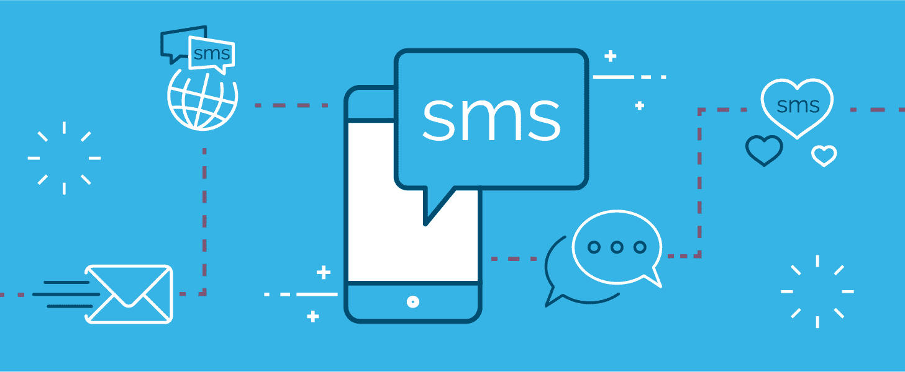
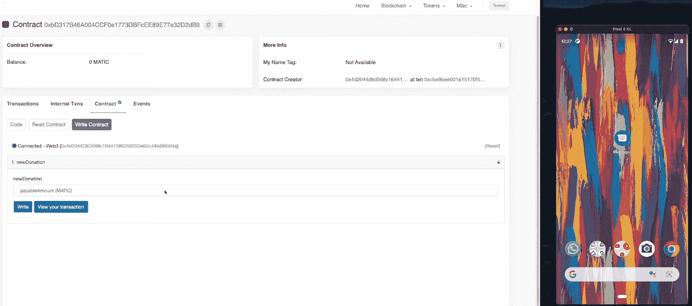
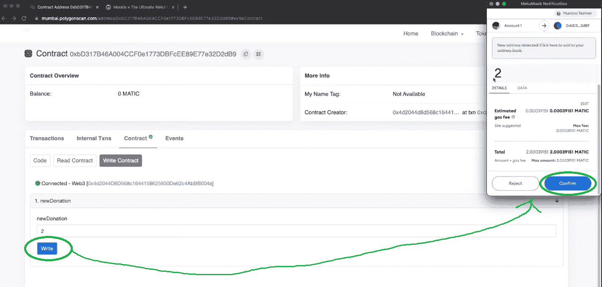
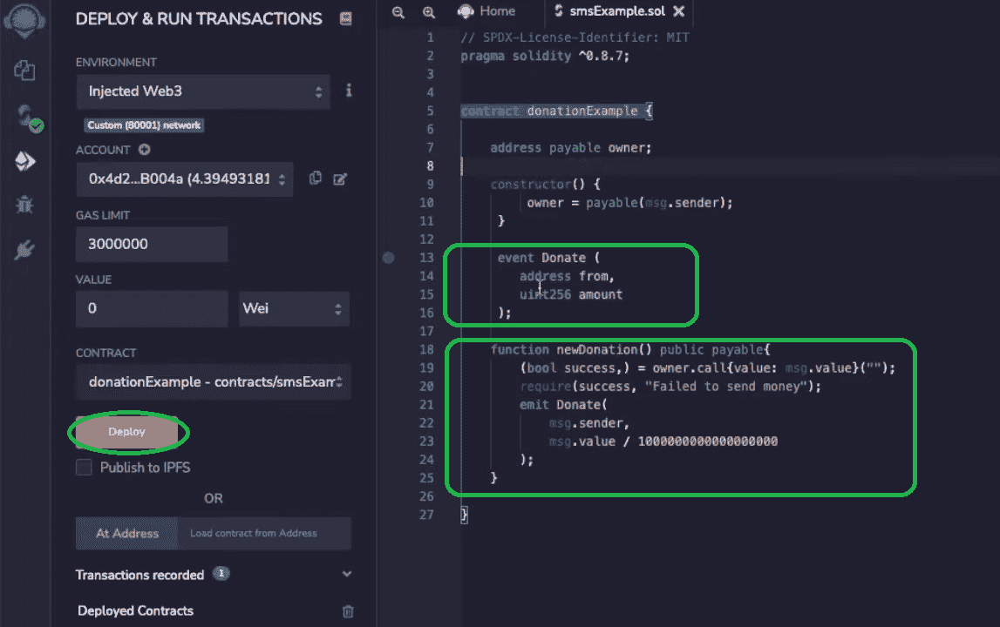
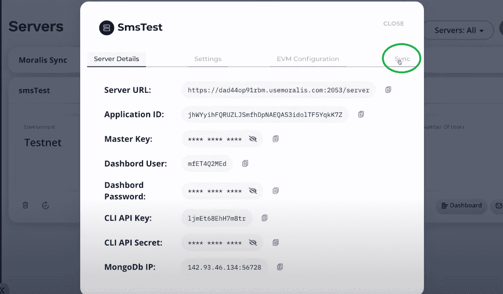
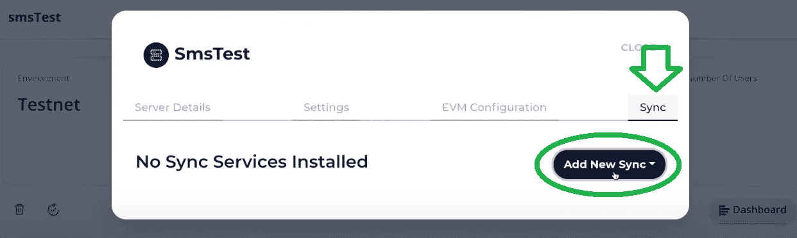
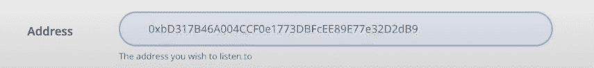

# 通过短信获取 Web3 事件

> 原文：<https://moralis.io/get-web3-events-with-sms-messages/>

如果你仍然怀疑 [**Web3**](https://moralis.io/the-ultimate-guide-to-web3-what-is-web3/) **是否会继续存在，让我们向你保证——从 Web2 到 Web3 的过渡已经开始了。因此，我们可以预期在不久的将来，去中心化、加密货币支付和其他 Web3 功能将会在整个互联网上实现。因此，您可能希望将您的开发技能集中在区块链技术上，并对其进行改进，以尽可能最好地满足市场需求。此外，重要的是使用最先进的工具来获得额外的优势。这样，你就可以实现用户喜欢的特性，而不用快速轻松地处理复杂的区块链后端编程。**

此外，客户已经习惯的一个功能是 SMS 和电子邮件通知。因此，让我们向您展示，以正确的方式为 Web3 活动发送短信是多么容易。通过使用 [Moralis](https://moralis.io/) 的终极 Web3 开发平台和其他一些数字通信服务，你可以为网上活动发送短信，而不用担心出汗或银行。

在接下来的几节中，我们将通过一个示例项目向您展示如何通过文本消息为连锁事件设置通知。当然，我们将使用 Moralis(又名 [Firebase for crypto](https://moralis.io/firebase-for-crypto-the-best-blockchain-firebase-alternative/) )来避免 RPC 节点的所有[限制。在这个过程中，你会发现处理](https://moralis.io/exploring-the-limitations-of-rpc-nodes-and-the-solution-to-them/)[智能合约](https://moralis.io/smart-contracts-explained-what-are-smart-contracts/)非常简单，尤其是因为你可以使用优秀的模板和[混合](https://moralis.io/remix-explained-what-is-remix/)。您还将学习如何[同步和索引智能合同事件](https://moralis.io/sync-and-index-smart-contract-events-full-guide/)，这将是伴随 Web3 事件的 SMS 消息的关键。所以，只要按照我们的步骤去做，到本文结束时，你就会知道如何在创纪录的时间内自动发送链上事件的文本消息。

## 通过 SMS 消息获取 Web3 事件–示例项目

如上所述，我们相信你能以最快的方式学习区块链开发，通过接受示例项目，你卷起袖子做实际的工作。但是，不要担心；没有什么艰苦的工作。通过使用 Moralis，您可以跳过所有与区块链相关的后端编程，这使得事情变得简单多了。此外，为了让事情变得更加简单，我们为您提供了来自 [GitHub](https://github.com/IAmJaysWay/Moralis-Blockchain-Notifications) 的完整代码。因此，您可以简单地复制并粘贴代码，用您的特定信息替换占位符，这样就万事俱备了。当然，如果你喜欢的话，你也可以从头开始。

接下来，我们将首先概述带有 SMS 消息的 Web3 事件在我们的示例项目中是如何工作的。预览之后，我们将负责初始的 Moralis 设置，您需要完成该设置，以便使用 Moralis 通过 SMS 消息跟踪 Web3 事件。通过这样做，您将获得对实时数据库的访问，该数据库将充当链上事件(智能合约事件)之间的中介，并触发要发送的链上事件的任何文本消息。最后，我们将带您完成为您自己的链上事件发送文本消息所需的步骤。在此过程中，您将学习如何使用 Moralis，以及如何使用一些其他优秀的工具，这些工具在设置自动短信或电子邮件发送时非常实用。

## 发送连锁事件的文本消息–功能预览

看下面的图片，你可以看到我们的智能合同在左边使用“Polygonscan ”,右边是我们手机显示屏的预览。

当我们输入想要捐赠的金额，然后点击“写入”按钮进行确认时，会提示 [MetaMask](https://moralis.io/metamask-explained-what-is-metamask/) 扩展。后者用于确认我们的交易:

交易完成后(连锁事件)，我们会收到一条短信，确认我们手机上的连锁事件:

## 

结合解释，上面的截图应该足以说明你可以通过短信获得 Web3 事件(在我们的例子中是对某人捐款的确认)。此外，请记住，触发 SMS 发送的精确智能合同事件可以是您想要的任何内容；但是，您必须使用适当的智能合约。

### 捐赠智能合同示例

你可能知道可编程区块链，比如[以太坊](https://moralis.io/full-guide-what-is-ethereum/)，使用智能合约自动执行特定的预定义动作。此外，每当智能合约做一些有意义的事情时，它都会发出一个事件，即智能合约事件。也就是说，我们需要一个智能合同来集中我们的链上事件的文本消息。为了这个示例项目(如预览中所解释的)，我们跟踪多边形链上的捐赠(“捐赠”事件)。GitHub("[examplesdonationcontract . sol](https://github.com/IAmJaysWay/Moralis-Blockchain-Notifications/blob/main/ExampleDonationContract.sol)")提供了智能合同示例。您可以简单地将代码复制到 Remix 中，在那里您将能够毫不费力地部署它。

我们使用的智能契约包括一个可支付地址(将进行捐赠的用户)，一个给出捐赠者地址和捐赠金额的事件，以及一个确保消息值被发送给契约所有者(“构造者”)的函数。它还发出“捐赠”事件。部署智能合约后，您就可以使用 Moralis 开始监听智能合约事件了。为此，您需要完成一些初始设置步骤，然后使用 Moralis 服务器的“Sync”选项。

## 带有 SMS 消息的 Web3 事件–Moralis 设置

为了获得 Moralis 的完整后端功能，您需要创建一个 Moralis 服务器。因此，这也将使您能够通过 SMS 消息获得 Web3 事件。因此，以下是要遵循的步骤:

1.  [**创建一个免费的 Moralis 账户**](https://admin.moralis.io/register)–点击左边的链接，创建你的免费 Moralis 账户。您只需要输入您的电子邮件地址并创建您的密码。最后，您还需要确认您的帐户才能完成该过程(单击将发送给您的确认电子邮件中的确认链接)。另一方面，如果你已经有了你的 Moralis 账户，只需[登录](https://admin.moralis.io/login)。
2.  **[创建一个 Moralis 服务器](https://docs.moralis.io/moralis-server/getting-started/create-a-moralis-server)**–一旦登录，你需要进入你的 Moralis 管理区的“服务器”标签。然后，点击右上角的“+创建新服务器”按钮(见下图)。将出现一个下拉菜单，为您提供三个网络类型选项。由于我们将承担一个示例项目，我们建议您选择“Testnet 服务器”选项*(参见我们的* [*以太坊 testnet*](https://moralis.io/ethereum-testnet-guide-connect-to-ethereum-testnets/) *指南)*。*然而，当你想与各种 Mainnet 交互时，你需要选择“Mainnet Server”。*

#### 自定义您的服务器

接下来，将出现另一个弹出窗口，要求您输入您的服务器名称(这可以是您想要的任何名称)，选择区域、网络和链(我们将在这个项目中使用 Polygon 的 testnet)。要完成此步骤，请单击“添加实例”来启动服务器。

通过成功创建您的 Moralis 服务器，您实际上获得了对 Moralis 后端功能的访问。例如，如果您要[构建您的第一个 dApp](https://moralis.io/build-your-first-dapp-ethereum-tutorial/) ，您需要获得您的服务器的详细信息，现在您可以获得这些信息了。然而，为了用 SMS 消息跟踪 Web3 事件，我们不需要创建 dApp。我们所需要做的就是使用“同步”功能来索引我们的智能合约事件。不过，在我们转到“同步”选项卡之前，让我们先来看一下已经设置好的链上事件的文本消息预览。

### 如何导航到“同步”

要访问“同步”选项卡，请单击您在上一部分中创建的服务器旁边的“查看详细信息”按钮:

点击“查看详情”按钮后，会出现一个弹出窗口(见下图)。默认情况下选择“Server Details”选项卡(这是创建[dapp](https://moralis.io/decentralized-applications-explained-what-are-dapps/)时获取服务器 URL 和应用程序 ID 的地方)。但是，为了设置链上事件的自动文本消息，您需要选择最右侧的“同步”选项卡:

一旦进入“同步”标签，你会看到下图所示的窗口。因为您使用的是新服务器，所以服务器上肯定没有现有的同步服务。接下来，单击“添加新同步”添加您的新同步服务:

点击“添加新同步”按钮，会出现两个选项:

您需要选择顶部选项“同步和观察合同事件”。现在，您将看到配置同步和观察智能合约事件的选项。幸运的是，设置同步服务很简单；本质上，您只需复制并粘贴相关智能合约的详细信息。

### 同步和收听智能合同事件–设置

在顶部，您可以选择网络，因为您已经为 Polygon Mumbai testnet 创建了服务器，所以这是唯一可用的选项。因此，只需点击它:

在“描述”旁边，你可以键入任何你想要的(我们用了“新捐赠观察”)。此外，默认情况下，“同步历史”数据选项将被选中。但是，在我们的例子中，我们将来只需要实时数据，所以您可以单击方块取消选中它。对于该主题，您需要使用智能合同的详细信息:

您可以简单地将上面选择的行复制粘贴到“主题”旁边的字段中。但是，您还需要删除变量名(我们只需要变量类型)。所以这应该是你的主题:

为了获得相关的 ABI，你需要去 Remix(在那里你已经编译了上面的智能合同):

一旦你复制了 ABI，只要把它粘贴在“同步”设置的相关区域。有些部分你不需要，所以确保你只剩下这个:

接下来，您需要复制并粘贴智能合同的地址。我们再次使用 Remix，但这次是在您部署合同的部分:

然后将地址粘贴到您的“同步”设置中:

您可以在最后一个字段(“表名”)中再次键入您想要的任何内容。我们选择了“新捐赠”。要创建同步，请单击“确认”按钮。设置完成后，您将会看到:

### 使用 Moralis Dashboard 发送连锁事件的文本消息

现在，您可以在 Moralis dashboard(数据库)中查看手头服务器的所有跟踪事件。要访问它，请关闭上面的窗口，并单击您的服务器的“仪表板”按钮:

在您的仪表板中，您将看到“new contributions”类(见下图)，它是在我们添加同步事件时自动创建的。这是我们记录事件的地方，您可以使用它们作为触发器来获得带有 SMS 消息的 Web3 事件。

一切设置妥当后，我们将把您交给 Moralis 的一位专家，他将从 5:27 开始在下面的视频中解释接下来步骤的细节。他将首先引导您创建一个合适的云函数(" [CloudFunction.js](https://github.com/IAmJaysWay/Moralis-Blockchain-Notifications/blob/main/CloudFunction.js) ")。他也将示范如何使用谷歌电子表格来追踪捐款总额(7:21)。

接下来，他将向您介绍一些有用的消息工具，即 Twilio 和 OneSignal。此外，他将向您展示如何正确设置使用这些工具通过 SMS 消息获取 Web3 事件。正确设置这两个工具后，他将向您展示他创建合适的云函数的思想过程，这实际上将通过发送与我们的示例相关的链上事件的每条文本消息来触发，包括定制文本消息内容。

此外，您可以继续观看超过 21:56 时间戳的视频，在这里您将学习如何应用相同的原则通过电子邮件获取 Web3 事件。

https://www.youtube.com/watch?v=PEILxU53-Zs

## 通过短信获取 Web3 事件–摘要

如果你正在阅读这篇文章，你一定已经完成了上面的示例项目，这意味着你现在知道如何设置来获取链上事件的文本消息。此外，您知道 Moralis 是最终的 Web3 开发工具，它使这个特性尽可能简单。总而言之，您需要完成以下步骤:

1.  创建一个 Moralis 服务器。
2.  使用我们的智能合同模板或创建自己的模板，并使用 Remix 进行部署。
3.  添加新的同步事件。
4.  建立 Twilio 和 OneSignal 账户。
5.  创建一个适当的云函数，在智能合同事件和 OneSignal 之间建立通信，以便为链上事件发送文本消息。

此外，如果你喜欢这个示例项目，我们鼓励你访问[Moralis 的 YouTube 频道](https://www.youtube.com/c/MoralisWeb3)和[Moralis 的博客](https://moralis.io/blog/)。在那里，我们定期发布新鲜的教育和励志内容。我们的一些最新主题向您展示了如何[构建跨链 dApp](https://moralis.io/how-to-build-cross-chain-dapps/)、[托管 dApp](https://moralis.io/how-to-host-a-dapp-dapp-hosting-explained/) 、[构建去中心化的消息应用](https://moralis.io/build-a-decentralized-messaging-app-in-5-steps/)、[创建 OpenSea 克隆](https://moralis.io/create-an-opensea-clone-build-an-nft-marketplace-like-opensea/)、[无油费的 mint NFTs](https://moralis.io/how-to-mint-nfts-without-gas-fees/)，向您介绍终极的 [Web3 样板文件](https://moralis.io/web3-boilerplate-beginners-guide-to-web3/)等等。从本质上说，我们的两个网点都是很好的区块链发展教育，如果你想成为一名区块链的开发者，这些教育是非常有价值的。此外，如果你想满怀信心地去全职加密，我们建议你去[Moralis 学院](https://academy.moralis.io/)学习高质量的课程。

