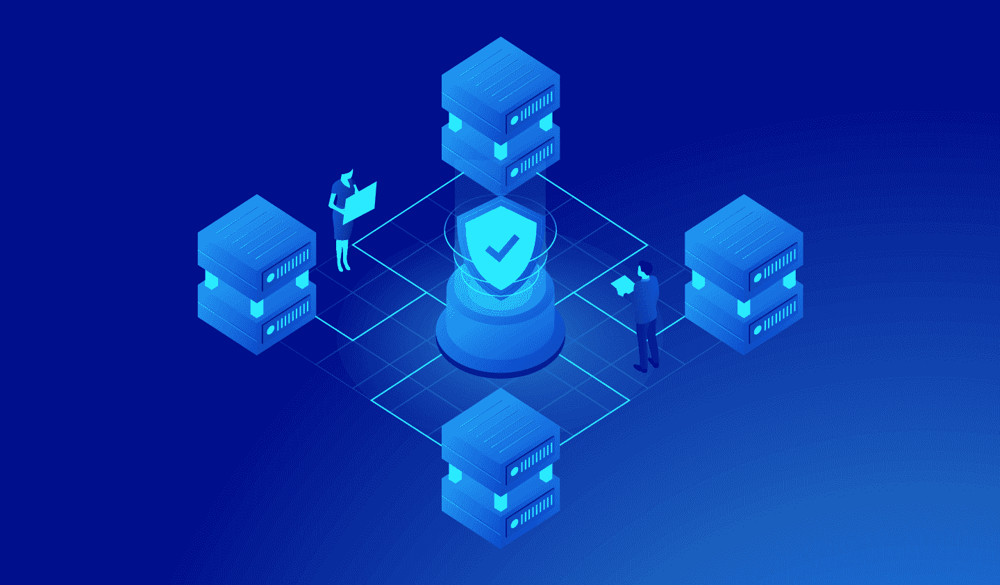
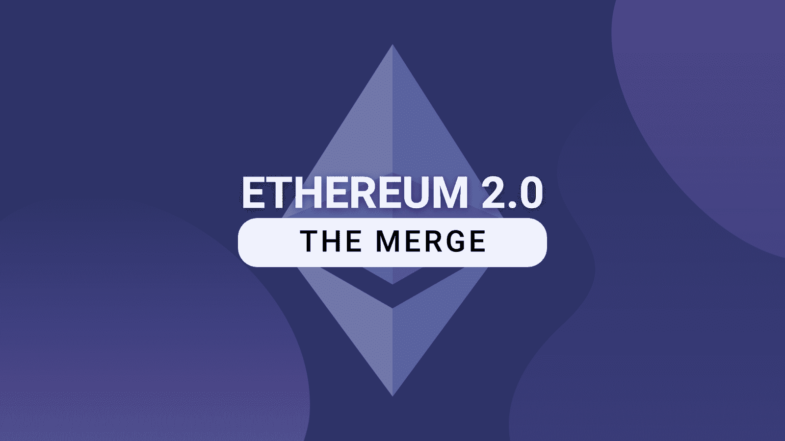
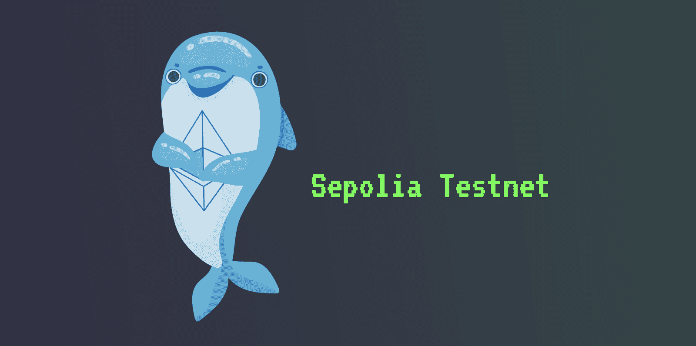
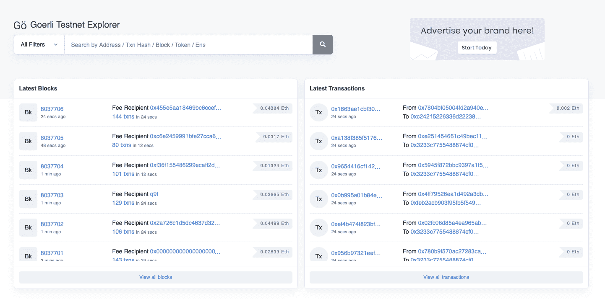

# Goerli ETH 什么是 Goerli Testnet？

> 原文：<https://moralis.io/goerli-eth-what-is-the-goerli-testnet/>

测试网是 Web3 行业最强大的功能之一，它为开发人员提供了一个安全可靠的环境，让他们可以在开发 mainnet 之前测试他们的项目。以以太坊为例，我们看到多个网络来来去去；然而，到目前为止，社区维护着两个关键的公共测试网，其中之一是 goer Li(gorli)。Goerli 是一个跨客户端的利害关系证明(PoS)网络，也是以太坊最受欢迎的测试网络之一。但是 Goerli testnet 到底是什么？如果您对以太坊开发感兴趣，请加入我们，我们将解决这个问题，并进一步探索 Goerli testnet 的细节！

首先，这篇文章深入探讨了 Goerli 的复杂性，以及是什么使这个 testnet 与众不同。接下来，您将深入研究测试网，并探索它们为什么重要。通过这样做，您将了解到 Goerli 如何帮助 Web3 开发人员节省时间和宝贵的资源。一旦理解了这些网络的好处，本文将简要介绍由以太坊维护的另一个公共测试网 Sepolia。最后，我们将深入了解 Goerli Etherscan 工具。如果这听起来很令人兴奋，请加入我们的文章，发现 Goerli 的来龙去脉！

如果你真的想进入区块链开发，看看 Moralis 的 Web3 开发工具，比如各种各样的[web 3 API](https://moralis.io/web3-apis-exploring-the-top-5-blockchain-apis/)。例如，在编程接口中，您会发现[流 API](https://moralis.io/streams/) 。有了这个开发工具，你可以通过 [Moralis webhooks](https://moralis.io/moralis-webhooks-an-introduction-to-web3-webhooks/) 轻松地将[的链上数据](https://moralis.io/on-chain-data-the-ultimate-guide-to-understanding-and-accessing-on-chain-data/)传输到你的 Web3 项目的后端。

因此，如果你对 Web3 开发感兴趣，立即与最好的 Web3 提供商签约。您可以免费创建一个 Moralis 帐户，并立即利用区块链技术的全部力量！

[**Sign Up with Moralis**](https://admin.moralis.io/register)

## 什么是 Goerli Testnet？

Goerli，也被称为 Goerli，最初于 2018 年 9 月推出，是以太坊最著名的测试网之一。更重要的是，它和 Sepolia 是两个没有被弃用的主要测试网之一。Goerli testnet 最初是一个 ETHBerlin 黑客马拉松项目；然而，直到 2019 年初，testnet 才在柏林的 gorlicon 正式推出。

当时，Goerli 是第一个社区构建的、权威证明(PoA)以太坊测试网，具有跨客户端功能。Goerli 的 PoA 共识机制迫使用户公开他们的真实身份，以获得验证块的资格。此外，一旦大多数验证者确定了一个新的块结构，它就会被签署并添加到 Goerli 的最长链中。

然而，除非你一直生活在岩石下，否则你很可能不会错过合并事件。*合并*是指最重要的以太坊更新，其中原始执行层与更新的利益证明(PoS)共识层，即信标链结合在一起。因此，以太坊从其传统的工作证明(PoW)共识机制过渡到了 PoS。更重要的是，*合并*的一个重要步骤是歌尔丽从 PoA 到 PoS 的转变，这发生在今年早些时候的两个阶段。初始阶段是一个预先要求的升级，称为贝拉特里克斯；与此同时，在第二阶段，Goerli 与 Prater Beacon Chain 的 testnet 合并，这是一个与以太坊 mainnet 并行的 PoS 网络。

Goerli 的合并——以及向 PoS 的过渡——是开发人员确保在 mainnet 过渡之前正确配置 PoS 验证器的最后机会。也是以太坊 mainnet 正式与 Beacon Chain 合并前的最后一次试运行。

然而，是什么让 Goerli 独一无二，为什么它是最流行的以太坊测试网之一？让我们来了解一下！

### 为什么开发者都在用歌尔丽？–以太坊跨客户端测试网

如果您对以太坊开发有所了解，那么您可能以前就偶然发现过“客户端”这个术语。客户端是以太坊生态系统的核心，允许开发人员使用各种编程语言与以太坊网络进行交互。简而言之，客户端使节点能够说“以太坊语言”，这就是为什么它们也被称为“节点软件”。

以太坊基金会维护不同语言的各种客户端，包括 C#、Java、Rust、Go 等。此外，如果基金会不完全支持一种编程语言，那么有几个第三方客户来担当这个角色。然而，您可以在下面找到三个突出的以太坊客户端示例:

*   Geth (Go)
*   奇偶校验(生锈)
*   Nethermind (C#。网)

然而，尽管以太坊主网支持和维护各种客户端，我们不能说其他重要的测试网也是如此。例如，从历史的角度来看，两个最大的测试网是 Rinkeby 和 Kovan，前者支持 Geth，后者支持奇偶校验。因此，由于不同的测试网支持不同的节点软件，客户之间缺乏协同作用。好在有了歌尔丽的引入，这种情况不再有了！

Goerli 最突出的特性之一是跨客户端兼容性，这意味着 testnet 支持更广泛的节点软件。因此，Goerli 为不同的客户提供了统一的测试网络，如 Geth、Parity Hyperledger、Nethermind 等。，确保它们能够和谐地一起工作。

Goerli 的跨客户端兼容性使得以太坊开发更加无缝和简单，因为开发人员可以对不同的编程语言使用相同的工具，包括 testnet！

然而，即使你现在对 Goerli 更熟悉了，澄清什么是 testnets 以及为什么开发者需要它们仍然是有益的。因此，下面的部分回答了这个问题，“什么是测试网？”。

### 什么是测试网？

如果您还不知道，那么您需要知道，在区块链上执行交易需要支付汽油费，而且可能相对耗时。因此，在 mainnet 上立即开发分散式应用程序(dapps)和其他 Web3 项目是没有意义的，因为它会变得很昂贵。这就是 testnets 提供更无缝的开发者体验的地方！

testnet 几乎是原始区块链网络的一个完全相同的副本，开发人员可以在实施和 Web3 项目发布之前使用它来运行和测试网络配置。因此，它们为开发人员提供了一种简单的方法来创建、设计和测试项目，并在公开项目之前跟踪它们的性能。因此，testnet 本质上是一个“沙箱”，项目可以在链上预先发布，允许开发人员测试公众参与。

知道测试网要求你为交易付费是很重要的。然而，与 mainnet 不同，testnet 令牌没有任何重要的价值。因此，您可以使用水龙头获得令牌来免费支付交易。水龙头通常是 web 应用程序，其中您输入一个钱包地址并接收 testnet 令牌作为回报。

大多数区块链都有自己的测试网，正如我们在前面提到的，有些网络有几个测试网。例如，这里有一些以太坊测试网的突出例子:

*   很难吗
*   Rinkeby
*   罗普斯滕
*   格里
*   塞波利亚

然而，科万，林克比和罗普斯滕，有一段时间，已被否决。这意味着以太坊基金会不再维护这些网络。为了进一步理解“不赞成”的概念，下面一节以 Ropsten 为例，将这个 testnet 与 Goerli 进行比较。

### 格利 vs 罗普斯滕

Ropsten 最初于 2016 年推出，在相当长的一段时间内是以太坊最重要的测试网之一。与 Goerli 非常相似，Ropsten 也具有跨客户端兼容性，使开发人员能够使用各种节点软件来创建和测试协议。更重要的是，最初，Ropsten 采用了 PoW 共识机制，这意味着这个 testnet 比其他替代方案更像 mainnet。

不过，作为*合并*的一个必不可少的步骤，Ropsten 也加入了 Beacon Chain 使用 PoS 来模拟以太坊的 mainnet 合并。此外，随着今年早些时候发生的合并，Ropsten 被弃用，这意味着以太坊基金会不再维护 testnet。

当 testnet 被废弃时，社区不再提供更多的客户端更新。但是，请注意，这并不一定意味着测试网完全消失，而是失去了与以太坊虚拟机(EVM)的对等性。因此，网络不再是测试 Web3 项目或 dapps 的准确或安全的环境。

此外，与 Ropsten 不同，Goerli 和 Sepolia 是以太坊仍然保持的两个测试网。因此，这是社区为以太坊开发推荐的两个测试网。但是它们有什么不同，你应该选择哪一个呢？

## 赛波利亚是什么？–goer Li vs Sepolia

Sepolia 于 2021 年推出，与 Goerli 一样，最初实施了 PoW 共识机制。然而，在*合并期间，* Sepolia 加入了信标链，现在使用 PoS 协议代替。更重要的是，Sepolia 和 Goerli 是目前合并后维护的两个公共 PoS 测试网之一。

但是，歌尔丽和赛波利亚的主要区别是什么呢？

*   Sepolia–以太坊推荐 se polia 作为 dapp 开发的主要测试网。Sepolia 使用许可的验证器集，并且相对较新，这意味着它的历史和状态都很小。因此，testnet 可以快速同步，并且运行节点需要更少的存储。这对于任何希望快速启动节点以直接与网络交互的人来说都是非常好的。此外，您可以在下面找到三个重要的 Sepolia 要点:

1.  与其他测试网相比，新测试网托管的应用程序较少
2.  快速同步
3.  封闭验证器集

*   **goer Li**–goer Li 是执行定位和验证测试的默认和推荐网络。与 Sepolia 不同，Goerli 对想要运行 testnet 验证程序的开发者开放。因此，希望测试协议升级的利益相关者应该在部署到以太坊主网之前使用 Goerli。以下是 Goerli 的三点建议:

1.  运行节点需要更长的同步和更多的存储
2.  更大的状态，有助于测试复杂的智能合约
3.  打开验证器集

因此，尽管 Sepolia 和 Goerli 是以太坊社区仍然维护的两个推荐的测试网，但是它们之间还是有一些不同之处需要考虑。因此，您对 testnet 的选择应该取决于您的项目和开发需求！

### Goerli Testnet Explorer–Goerli ethers can

区块链探索者是密码爱好者武器库中必不可少的工具。它们是利用 API 和节点从各自的网络中查询链上数据的软件。此外，区块链探索者通常提供无缝搜索网络的在线界面，使开发人员能够快速检索有关地址、区块、费用、交易等数据！因此，用户可以例如输入合同地址并在整洁显示的表格中查看所有相关交易。它可能看起来像这样:

上图来自以太扫描，它是最杰出的区块链探险者之一。此外，由于测试网是独立于它们模仿的主网的自己的网络，它们通常有自己的区块链探索者。这也适用于 Goerli，并且 testnet 以 Goerli Etherscan 为特色！

Goerli Etherscan 是 Goerli 网络的区块链探索者。因此，开发人员可以使用 Goerli Etherscan 轻松检查他们的合同是否部署成功，查看交易历史，查找特定的块信息，等等。因此，Goerli Etherscan 是一个伟大的开发工具，所有以太坊开发人员都应该知道并知道如何利用它。

如果您已经了解了这么多，那么您现在有望对 Goerli testnet 以及 Goerli Etherscan 需要什么有一个更好的了解！

## Goerli 测试网-总结

Goerli 于 2019 年推出，是目前由社区和 Sepolia 共同维护的两个以太坊 PoS 公共测试网之一。testnet 具有跨客户端支持的特性，这意味着开发人员可以在他们的以太坊开发过程中为各种编程语言使用不同的客户端。

更重要的是，一般来说，测试网在区块链开发中是必不可少的，因为它们为开发人员提供了安全的环境来测试他们的 dapps 和 Web3 项目，而无需使用 mainnet。因此，开发人员可以在以太坊开发中利用 Goerli testnet 来节省大量的时间和金钱！

除了测试网之外，这些网络通常还以区块链探索者为特色，使得 Web3 开发更加容易。区块链探索者——如 Goerli ethers can——为获取交易、区块、地址、费用等数据提供了直观的界面。因此，如果您想进入以太坊开发，请查看 Goerli Etherscan。这个开发工具促进了更加无缝的开发体验。

然而，如果你觉得这个教程很有帮助，你可能还想看看 Moralis 的 [Web3 博客](https://moralis.io/blog/)上的其他内容。例如，仔细阅读 [Web3 Python](https://moralis.io/web3-python-python-web3-development-made-easy/) 开发或者学习如何[用 Moralis 部署 AWS Lambda 函数](https://moralis.io/deploying-lambda-functions-how-to-deploy-aws-lambda-function-tutorial/)！

此外，无论你从事什么样的区块链发展事业，都可以考虑与 Moralis 公司签约。Moralis 是主要的 [Web3 基础设施](https://moralis.io/web3-infrastructure-exploring-the-best-solution-for-web3-development/)提供商，作为会员，您可以充分利用区块链技术的潜力！