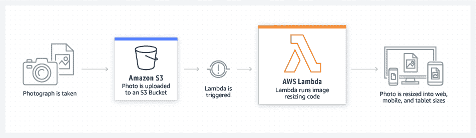
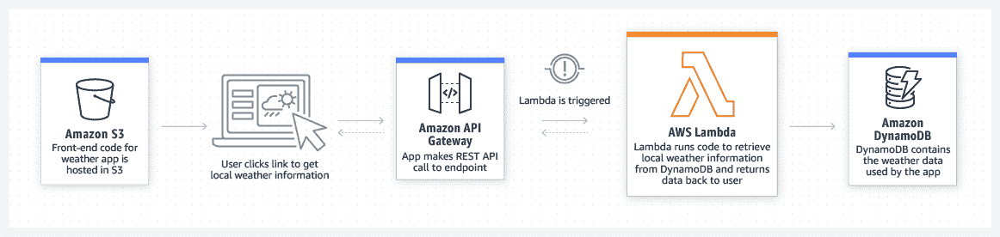
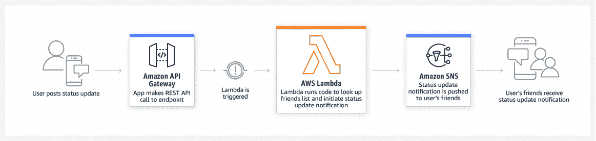
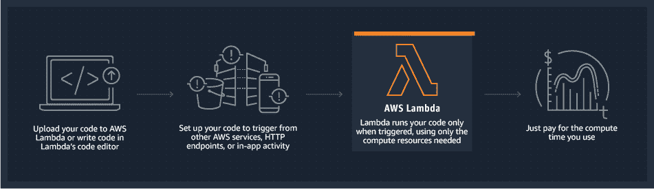
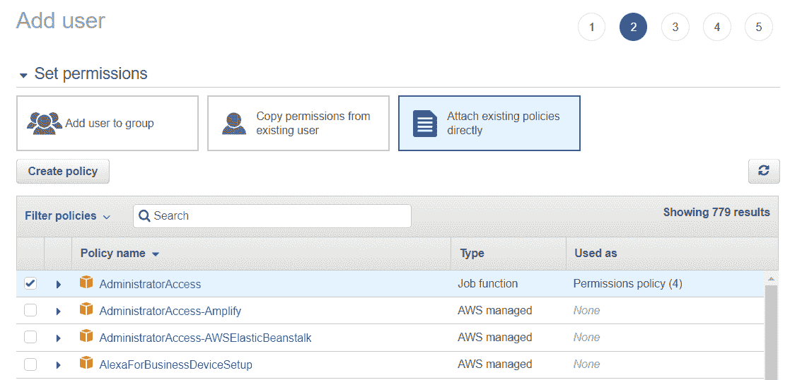

# AWS Lambda 如何工作——解释功能和架构

> 原文：<https://moralis.io/how-aws-lambda-works-functions-and-architecture-explained/>

**如果你是** [**Moralis 家**](https://moralis.io) **博客的老读者，你可能已经读过我们以前的一篇文章** [**探索 AWS Lambda 及其用于**](https://moralis.io/exploring-aws-lambda-and-what-it-is-used-for/) **。该指南深入探讨了 AWS Lambda 的复杂性，为您提供了该服务的全面概述。然而，它并没有涵盖 AWS Lambda 如何工作的细节。因此，我们决定发表这篇文章，更深入地解释 AWS Lambda 是如何工作的，包括它的功能和架构。听起来很有趣？请跟随我们为您分解这一切！**

本文首先解释了 AWS Lambda 的来龙去脉，并概述了该服务是如何工作的。接下来，我们将通过解释 AWS Lambda 函数的角色以及它们如何工作来更深入地了解细节。一旦您熟悉了这个组件，本文将介绍 AWS Lambda 架构。最后，最重要的是，我们将简要概述一个 [AWS Lambda NodeJS](https://moralis.io/aws-lambda-nodejs-tutorial-how-to-integrate-a-nodejs-sdk-example/) 教程，在这里您可以学习如何使用 Moralis 通过 Lambda 运行 JavaScript 函数。

一旦你意识到 AWS Lambda 是如何工作的，你就能把这个服务和其他方便的开发工具结合起来，比如 Moralis 的[web 3 API](https://moralis.io/web3-apis-exploring-the-top-5-blockchain-apis/)。如果这听起来很有趣，一定要检查 Moralis[流 API](https://moralis.io/streams/) 。有了这个工具，您可以通过 webhooks 将链上数据无缝地传输到任何应用程序的后端。如果你想了解更多关于创建流的知识，你会发现我们关于[多边形网钩](https://moralis.io/polygon-webhooks-how-to-use-webhooks-on-polygon/)和[以太坊网钩](https://moralis.io/ethereum-webhooks-what-they-are-and-how-to-use-webhooks-for-ethereum/)的文章很有帮助！

然而，如果你想使用上面提到的工具，[现在就注册 Moralis](https://admin.moralis.io/register) 。这样，您可以充分利用区块链技术的力量，开始构建行业领先的 dapps！

## 什么是 AWS Lambda？它是如何工作的？

亚马逊网络服务(AWS)是最成熟的云平台之一，拥有超过 200 种基于网络的服务。在这个全面的 AWS 生态系统中，您可以找到 AWS Lambda。但是 AWS Lambda 到底是什么，它是如何工作的？如果您正在寻找这个问题的答案，请继续阅读，我们将探索这个著名的 AWS 服务的复杂性！


Lambda 是广泛的 AWS 生态系统中事件驱动的无服务器计算服务的一部分。有了 Lambda，您可以无缝地运行代码，而无需供应或管理服务器。相反，您依靠服务的计算基础设施来管理您所有的计算资源。这包括安全性和代码补丁开发、代码监控和日志记录、自动扩展和容量供应、服务器和操作系统维护等。因此，你唯一的责任就是提供代码。

AWS Lambda 运行提供的代码来响应多个事件。例如，这可以是通过 Amazon API Gateway 的 HTTP 请求、DynamoDB 中的表更新、Amazon S3 中的对象修改或其他第三方事件。因此，这突出了 Lambda 的主要特性之一:易于与其他工具和服务集成，用于监控、安全、治理等。

使用 AWS Lambda 有几个显著的好处，比如降低成本、自动伸缩、紧密的 AWS 集成、访问完全托管的基础设施等。相应地，你可以通过 Lambda 避免多余的计算相关的任务，从而更专注于为你的应用程序和网站编写优秀的代码！

此外，您提供给服务的代码被组织成 Lambda 函数。然而，什么是 AWS Lambda 函数，它们是如何工作的？我们将在下一节回答这个问题。因此，如果这听起来令人兴奋，并且你想探索 Lambda 函数的复杂性，请继续阅读！

## AWS Lambda 函数是如何工作的？

Lambda 函数是服务功能的主干，也是其架构的重要部分。因此，这一初始部分回答了以下问题，“AWS Lambda 函数是如何工作的？”。

你上传到 AWS Lambda 的代码被一致地格式化为“Lambda 函数”。这些函数附有配置信息，包括名称、资源需求、入口点和描述。而且，所有的 Lambda 函数都是“无状态”的。因此，这些功能不做任何底层计算基础架构假设。

Lambda 函数不是连续运行的，只在需要时执行，并且可以相应地伸缩。因此，Lambda 函数可以处理从每天几个请求到每秒几千个请求的任何事情。此外，您只需为函数消耗的计算资源付费。因此，当您不运行代码时，没有任何成本。

Lambda 函数可以通过两种方式调用:通过 API 或者响应来自其他 AWS 服务的事件。那么，这到底是怎么发生的呢？为了让您更好地理解 Lambda 函数是如何工作的，让我们简要地看一下请求 Lambda 函数时的三个场景:

*   **文件处理**–你可以使用亚马逊 S3，一个存储服务，在新的上传后触发 Lambda 函数进行实时数据处理。在这种情况下，流程可能类似于以下内容:



*   **Web 应用程序**s–还可以利用 Lambda 的其他 AWS 服务来构建可伸缩的 Web 应用程序:



*   **移动后端**–使用 AWS Lambda 构建后端，将该服务与 Amazon API Gateway 相结合，以处理和验证 API 请求:



然而，这涵盖了函数和 AWS Lambda 如何工作的一些突出例子！

## AWS Lambda 的架构是什么

AWS Lambda 具有无服务器、事件驱动的架构，其中事件用于在解耦的系统之间触发和通信。事件可以采取多种形式，一些例子可以是状态的改变、更新或电子商务网站购物车中的物品。此外，事件驱动架构在使用微服务开发的现代应用程序中变得越来越常见。



事件驱动架构有三个相互紧密交织的核心组件:事件生产者、事件路由器和事件消费者。生产者生成事件并将它们发布给路由器。此外，路由器过滤、处理并向消费者发送事件。从那里，消费者接收事件以进行进一步处理。

事件生产者和消费者是独立的系统，事件驱动的架构促进了服务之间的通信。此外，由于两个系统是分离的，它们可以相互依赖地伸缩、更新和部署。

在 AWS Lambda 架构中，起点是事件生产者，通常也称为事件源。源代码负责将事件发布到 Lambda 函数，您在上一节中了解到这可以通过 API 或其他 AWS 服务来实现。

Lambda 函数接受事件源传递的事件，然后根据函数的逻辑处理它们。从那里，这些函数最终将事件发布到其他系统或服务。因此，在 AWS Lambda 架构中，函数充当事件路由器。

最后，流程中总会涉及一个事件消费者，这是 AWS Lambda 架构的另一个重要组件。而且 Lambda 函数单独使用是不够的，还需要其他系统来实现业务逻辑。例如，这可以是数据库对象存储、其他第三方服务等。，它们是函数发布的事件的使用者。

## AWS Lambda 如何工作的示例

到目前为止，您已经熟悉了 AWS Lambda 的复杂性以及该服务在理论上是如何工作的。您还探索了 AWS Lambda 函数是如何工作的，并了解了关于服务架构的更多信息。这一节教你如何在实践中运用新学到的知识。这样，我们将向您展示如何轻松地将 Moralis 的 NodeJS SDK 与 AWS Lambda 集成。如果您继续学习，您将通过 Lambda 学习构建、测试、部署和运行 Web3 JavaScript 函数的所有内容！


为了说明 Moralis 的可访问性，我们将向您展示如何构建和部署具有两个功能的 Lambda 应用程序:“ *getNativeBalance()* 和“ *getWalletNfts()* ”。此外，为了使本教程尽可能简单明了，我们将它分为以下三个步骤:

1.  先决条件
2.  克隆应用程序
3.  测试和部署

然而，让我们立即开始，直接进入第一步，并涵盖必要的先决条件！

### 步骤 1:先决条件

在仔细研究应用程序之前，您必须完成一些先决条件。您可以在下面的列表中找到所有要求:

*   [与 Moralis 家签约](https://admin.moralis.io/register)
*   安装 IDE(集成开发环境)
*   安装〔t0〕nodejs〔t1〕
*   建立一个 [AWS 账户](https://docs.aws.amazon.com/accounts/latest/reference/manage-acct-creating.html)
*   安装 [AWS CLI](https://docs.aws.amazon.com/cli/latest/userguide/getting-started-install.html#getting-started-install-instructions) (命令行界面)
*   安装[无服务器框架](https://www.serverless.com/framework/docs/getting-started#installation)
*   设置一个 [IAM 用户](https://docs.aws.amazon.com/IAM/latest/UserGuide/id_users_create.html#id_users_create_console)

设置 IAM 用户时，请确保选择两种 AWS 身份证明类型:


确保选中“管理员访问”框:



最后，您需要将您的凭证下载到一个。csv”文件:


尽管如此，这涵盖了先决条件和第一步！在下一部分中，让我们继续深入研究如何克隆应用程序的代码！

### 步骤 2:克隆应用程序

对于这一步，您需要将项目克隆到您的本地目录，这可以通过访问下面的 GitHub 库来完成:

**完整的 AWS Lambda 资源库—[https://github . com/moralis web 3/examples-AWS-Lambda-nodejs/tree/main/AWS-node-project](https://github.com/MoralisWeb3/examples-aws-lambda-nodejs/tree/main/aws-node-project)T3】**

存储库包含 Lambda 应用程序的完整代码，包括“ *getNativeBalance* ()”和“ *getWalletNfts* ()”函数。因此，您可以随意探索自己的存储库，以更好地了解它是如何工作的。

然而，一旦您克隆了项目并且在您的目录中有一个副本，您必须安装 Moralis 依赖项。为此，请将自己置于项目的根文件夹中，并在新的终端中运行以下命令:

```js
​​npm install moralis
```

这就是第二步！现在剩下的就是测试和部署功能了！

### 步骤 3:测试和部署

要测试应用程序，请在项目的根文件夹中创建一个新的“event.json”文件:


在这里，添加您想要接收信息的钱包地址和链 ID 作为参数。它看起来会像这样:

```js
{
    "address": "0x99EXAMPLEADDRESS",
    "chain": "chain_id"
}
```

现在，您应该能够通过在终端中运行以下命令来测试 Lambda 应用程序的功能:

```js
serverless invoke -f FUNCTION_NAME --path event.json
```

但是，请注意，您需要将“ *FUNCTION_NAME* ”替换为您想要测试的函数的实际名称。如果测试成功，您应该会收到类似下面的消息:


如果您对结果满意，现在可以将这些功能部署到 AWS。这相对简单，您只需在终端中运行以下命令:

```js
serverless deploy
```

运行此命令后，如果终端已成功部署，它应该会显示以下消息:


本教程到此为止！恭喜，您现在知道如何通过 AWS Lambda 构建、测试、部署和运行 JavaScript 函数了！

如果您在本教程的任何一点上遇到了麻烦，请查看 Moralis 的 [AWS Lambda 文档](https://docs.moralis.io/docs/using-aws-lambda)以获得整个过程的更详细的分解。此外，您可以加入 Moralis 不和谐频道，直接获得专家帮助！

## 总结–AWS Lambda 是如何工作的？

您现在知道 AWS Lambda 是一种无服务器、事件驱动的计算服务。使用 Lambda，您可以运行代码，而无需提供和管理服务器。因此，运行程序所需要做的就是提供代码本身。然而，AWS Lambda 到底是如何工作的呢？


AWS Lambda 采用事件驱动的架构，有三个核心组件:事件提供者、事件路由器和事件消费者。提供者负责将事件发布到路由器，路由器反过来处理事件并将它们发送给消费者。在 Lambda 的情况下，函数扮演路由器的角色。因此，Lambda 函数在服务的架构中扮演着重要的角色。也就是说，什么是 AWS Lambda 函数，它们是如何工作的？

开发者上传到 Lambda 的代码被组织成“Lambda 函数”。所有 Lambda 函数都有配置信息，比如名称、入口点、描述和资源需求。此外，这些函数是以“无状态”风格编写的。这意味着他们对底层计算基础设施不做任何假设。此外，结合对 AWS Lambda 如何工作的更多了解，本文提供了一个 AWS Lambda NodeJS 教程。因此，如果您阅读了这一部分，您现在知道如何通过 Lambda 运行兼容 Web3 的 JavaScript 函数了！

然而，如果你觉得这篇文章内容丰富，可以考虑看看其他的 Moralis 内容。Moralis 的 [Web3 博客](https://moralis.io/blog/)为有经验的和新的开发者提供新鲜和令人兴奋的 Web3 开发内容。例如，阅读更多关于 [Web3 for enterprise](https://moralis.io/web3-for-enterprise-business-applications-in-web3/) 或[如何获得 NFT](https://moralis.io/get-nft-metadata-how-to-get-the-metadata-of-an-nft/) 的元数据！

此外，今天就创建您的 Moralis 帐户，释放区块链技术的力量！您可以[免费注册 Moralis](https://admin.moralis.io/register) 并立即获得企业级开发工具！