# 闪贷是怎么运作的？–全面演练

> 原文：<https://moralis.io/how-do-flash-loans-work-full-walkthrough/>

去中心化金融(DeFi)及其许多功能，如获得快速贷款，为人们提供了一个从金融机构中挣脱出来的机会，这些机构几十年来一直在剥削全球各地的普通百姓。虽然只有时间能告诉我们 DeFi 的实际主流采用将如何发展，但许多加密用户已经看到并体验了这些公共授权金融工具的力量。闪贷、交易、借贷、借款、提供流动性，还有更多现在可以在去中心化的平台上完成。因此，DeFi 无疑是区块链技术的重要使用案例之一。然而，闪贷是如何运作的呢？我们将在这个完整的演练指南中深入回答这个问题，我们将探索 DeFi lending 现象，并教你如何构建自己的 flash loan Web3 应用程序。

首先，我们将解释什么是闪贷，以便我们都知道基本知识。然后，我们将仔细研究并回答这个问题，“闪贷是如何工作的？”这将使用户和开发者对 DeFi 的这个有争议的特性有一个正确的认识。为了让事情更上一层楼，我们还将进行一个示例项目，并创建一个套利实验室，该实验室将使用快速贷款功能。因此，你将有机会直接接触这些 DeFi 交易。有了这些技能，你将能够利用你的区块链开发知识为你的客户和市场提供一些独特的 DeFi 分散式应用( [dApps](https://moralis.io/decentralized-applications-explained-what-are-dapps/) )。

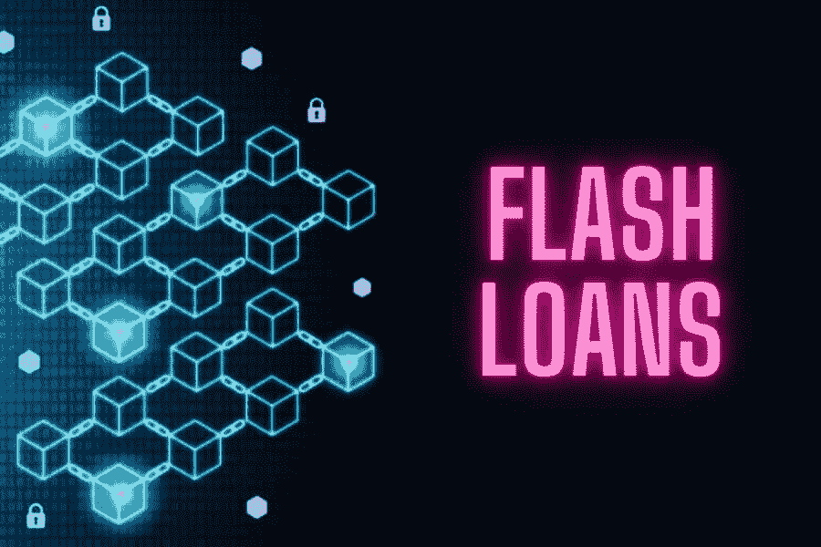

## 什么是闪贷？

像各种术语的任何定义一样，从查看它的实际单词开始是很好的。在这种情况下，“闪”指的是极快、几乎是瞬间、短暂的。而且，你已经知道传统金融的“贷款”是什么了；贷款人(通常是银行)向借款人发放贷款，借款人最终会全额偿还。考虑到这一点，这意味着我们正在谈论加密货币的短期贷款，其中流动性池扮演着银行的角色。

从更专业的角度来说，快速贷款是实现无抵押贷款的[智能合同](https://moralis.io/smart-contracts-explained-what-are-smart-contracts/)的一个子集。这就是为什么闪贷在 DeFi 中是一种无抵押的贷款产品。由于区块链交易确认的性质，这种贷款是可能的。具体来说，它使事务能够在有问题的块确认之前自动恢复。然后，闪贷在同一个系列的交易中偿还(交易块)。此外，只要流动性在一个交易块内返回池中，闪贷就有效。然而，如果快速贷款交易没有将全部流动性返还给资金池，整个交易就会逆转。这将撤消之前的所有操作。这样，它可以确保储备金中的资金安全，而无需额外的抵押品。

闪贷可能是套利和快速交易的有用而强大的工具；然而，当被黑客攻击时，它们也可以被用来利用任何易受攻击的 DeFi 协议。因此，它们是好是坏有很多不同意见，这是我们留给你决定的事情。但是，我们认为有义务提醒您，处理这种 DeFi 功能时必须小心谨慎。

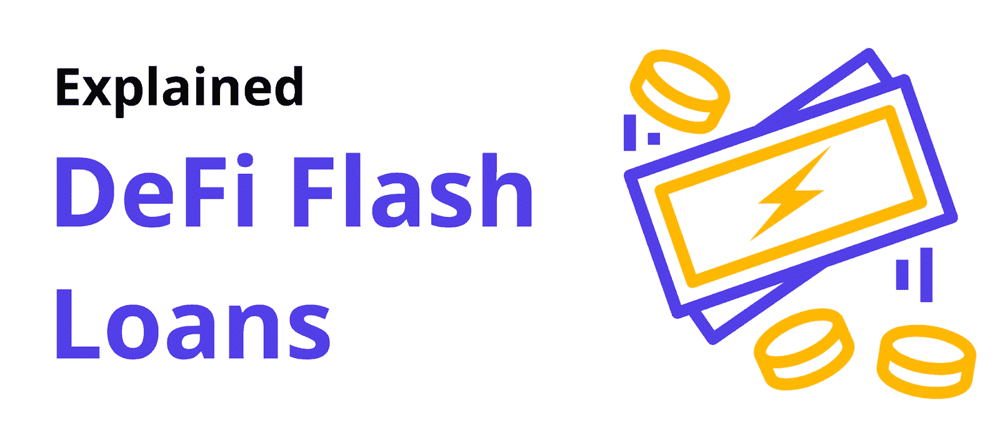

### 快速贷款的例子

为了帮助你理解什么闪贷更好，我们来看一个假设的套利例子。假设一种加密货币在一个交易所的交易价格为 0.5 美元，在另一个交易所的交易价格为 1 美元。这对精明的交易者来说是一个很好的机会，他们可以在第一个交易所获得价值 50 美元的加密货币快速贷款，并在第二个交易所以 100 美元的价格出售，偿还贷款，并获得额外的 50 美元利润。

除了套利，你还可以使用闪贷进行抵押品互换(通过快速将用户贷款的抵押品支持换成另一种类型的抵押品)。此外，您可以使用快速贷款来降低交易费用，方法是利用快速贷款滚动的事实，否则将需要几个交易变成一个。由于每笔交易都要收费，交易越少可能意味着费用越低。

## 闪贷是如何运作的？

现在你知道什么是闪贷了，你大概可以回答“闪贷是怎么运作的？”靠你自己。你需要注意的关键点是闪贷不是免费的。首先，必须涵盖所有相关的交易费用。此外，快速贷款提供商有他们的额外快速贷款费用设置到位。例如，我们将在此使用的 DeFi 协议，AAVE，其快速贷款费用设置为 0.09%。

此外，由于闪贷来自流动性池，因此检查相关流动性是否充足非常重要。在下面的例子中，我们将使用 Avalanche testnet (Fuji ),因此我们需要确保 AAVE 对 Fuji 的流动性充足。

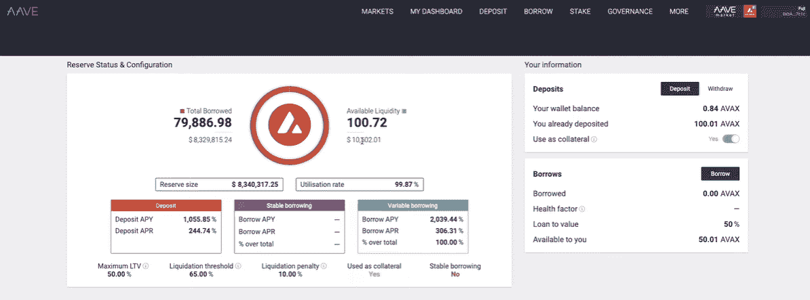

然而，快速贷款合同是正确执行快速贷款的关键。它们确保在单个事务块中完成几个事务:借款、还款和支付快速贷款费用的事务。在完成下一节中的示例项目后，您将对这一部分有更清晰的理解。因此，保持“闪贷如何工作？”在你脑海深处的某个地方。

# DeFi 快速贷款–示例项目

在本部分及其子部分，您将有机会在我们的带领下建立自己的快速贷款实验室。这样，你就会对闪贷的工作原理有一个深刻的理解。如前所述，我们将致力于雪崩测试网。此外，对于我们的闪贷，我们将利用 AAVE 的流动性池、 [Moralis 的 SDK](https://moralis.io/exploring-moralis-sdk-the-ultimate-web3-sdk/) 、 [MetaMask](https://moralis.io/metamask-explained-what-is-metamask/) 进行[认证](https://moralis.io/ethereum-authentication-full-tutorial-to-ethereum-login-programming/)，以及 [Remix](https://moralis.io/remix-explained-what-is-remix/) 进行智能合约部署。

除非你一直生活在岩石下，否则你以前一定听说过 [Moralis](https://moralis.io/) ，但为了以防万一，让我们快速概括一下它的要点。这个终极的 Web3 开发平台本质上是 crypto 的 [Firebase，并且在大多数项目的初始阶段都是免费使用的。此外，Moralis 在其基础中内置了跨链功能，这意味着它使您能够在所有支持的链上部署 dApps。此外，除了提供全套的](https://moralis.io/firebase-for-crypto-the-best-blockchain-firebase-alternative/) [Web3 API](https://docs.moralis.io/moralis-server/web3-sdk/intro) 之外，Moralis 还为您提供了轻松[同步和索引智能合同事件](https://moralis.io/sync-and-index-smart-contract-events-full-guide/)的工具。由于 Moralis 的云功能和 Moralis 数据库，后者是可能的，所有链上的数据都以银盘的形式提供给你。

在我们的示例项目中，我们将使用 [Moralis Speedy Nodes](https://moralis.io/speedy-nodes/) ，这是面向所有 Moralis 用户的另一款优秀产品。这就是为什么 Moralis 也被称为 [Infura 替代品](https://moralis.io/infura-alternatives-and-blockchain-node-providers/)中的首选。此外，由于雪崩链将是我们在这里感兴趣的，我们可以调用 Moralis " [Infura 的雪崩](https://moralis.io/infura-for-avalanche-exploring-infura-avalanche-alternatives/)"。除了上面提到的工具，我们还将使用 SnowTrace，它相当于 Etherscan 或 [BscScan](https://moralis.io/exploring-bscscan-full-guide/) 用于雪崩网络。

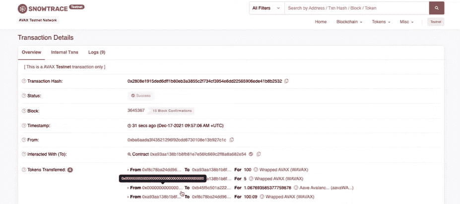

## 建立一个 DeFi 快速贷款实验室

首先，我们需要把事情安排妥当。到达终点的最短路径包括克隆我们在 [GitHub](https://github.com/DanielMoralisSamples/28_Defi_Intro) 上提供的代码，创建一个免费的 Moralis 帐户来访问 Moralis 服务器和 Moralis Speedy Nodes，并通过利用 Avalanche 水龙头获得一些“播放”AVAX。为了让事情尽可能简单，我们在下面列出了所有的设置步骤。

### 初始设置–克隆代码

如果你想在我们的带领下建立一个 DeFi 快速贷款实验室，你需要完成以下步骤:

1.  使用上面的 GitHub 链接访问代码的网页。在那里，点击“代码”按钮，复制网址。

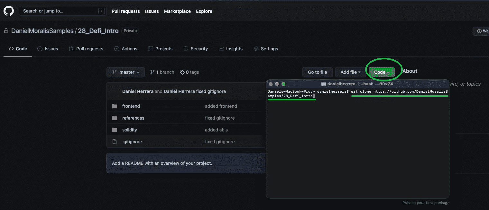

2.  使用您的终端(在您的代码编辑器中)并输入“git clone”，然后输入复制的 URL，并点击 enter。这将把代码克隆到你的计算机上。

3.  接下来，打开您最喜欢的代码编辑器(我们更喜欢 Visual Studio 代码[VSC])来访问该文件夹。首先，打开“ [important_information.md](https://github.com/DanielMoralisSamples/28_Defi_Intro/blob/master/references/important_information.md) ”文件，在这里您可以访问一些重要且有用的链接:

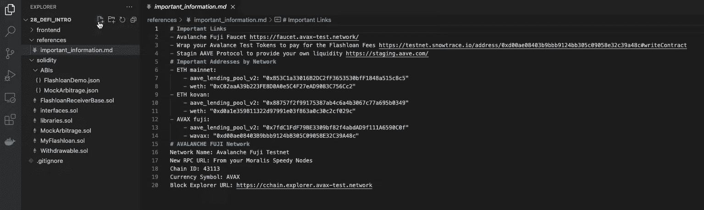

### 初始设置–使用 Moralis

4.  现在，[创建您的免费 Moralis 账户](https://admin.moralis.io/register)。只需点击左边的链接，输入您的电子邮件地址，创建您的密码。然后，您只需点击您将通过电子邮件地址收到的确认链接。*如果您已经有一个活跃的 Moralis 账户，只需* [*登录*](https://admin.moralis.io/login) *。*

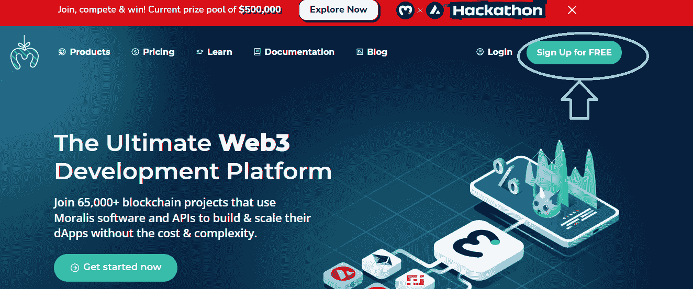

5.  登录到您的 Moralis 帐户后，是时候[创建一个 Moralis 服务器](https://docs.moralis.io/moralis-server/getting-started/create-a-moralis-server)了。在您的管理区域中，转到“服务器”选项卡，然后单击“+创建新服务器”按钮，选择网络类型，输入服务器详细信息，并单击“添加实例”完成。*如果您需要更详细的说明，请点击本步骤开头的链接。*创建服务器后，您将能够访问其详细信息(通过“查看详细信息”按钮)，您将在为您的 flash loans 实验室版本构建 UI 时使用这些信息。

6.  现在是使用 Moralis 快速节点的时候了。因此，转到“快速节点”标签，点击“雪崩网络”选项下的“端点”。然后，复制“Testnet”下的 URL 地址:

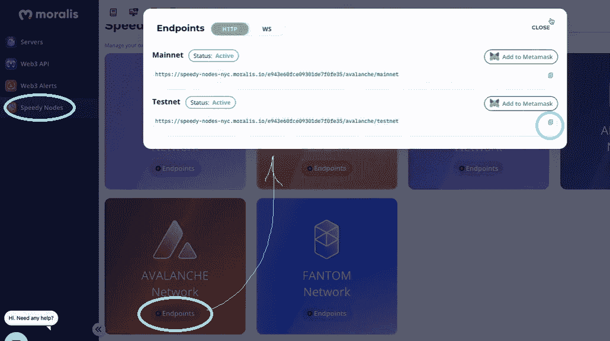

7.  使用“important_information.md”文件底部的复制地址和其他详细信息，将 Avalanche testnet 添加到元掩码中。

### 初始设置—获取并包装 AVAX

8.  使用 [Avalanche 龙头](https://faucet.avax-test.network/)(使用“ [important_information.md](https://github.com/DanielMoralisSamples/28_Defi_Intro/blob/master/references/important_information.md) ”文件左侧或顶部的链接)获取测试 AVAX:

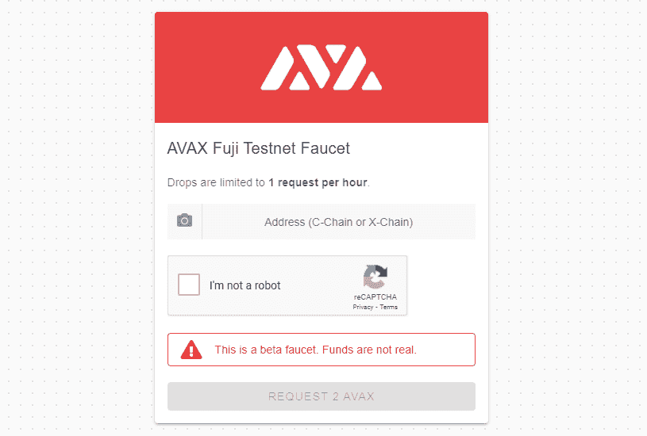

9.  使用元掩码和 SnowTrace 包装功能将测试 AVAX 包装到 WAVAX 中(使用“important_information.md”文件中从顶部开始的第二个链接):

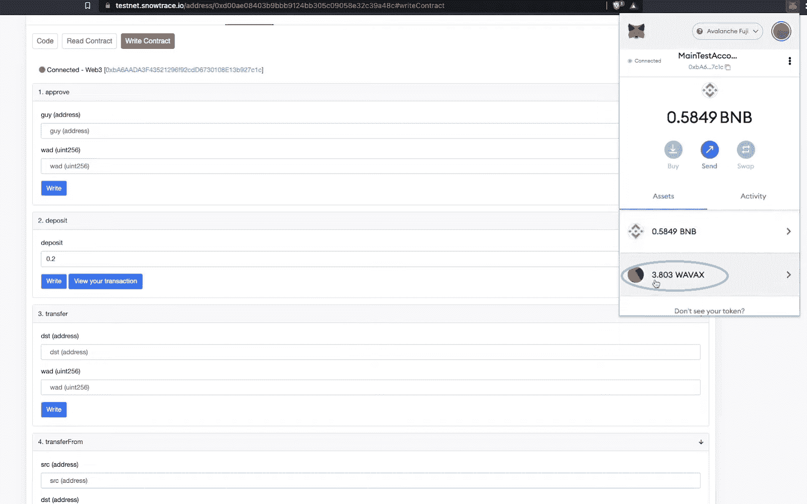

一切设置妥当后，您几乎可以构建快速贷款智能合同了，这将是我们示例快速贷款实验室的核心。然而，在我们将您交给 Moralis 的专家之前，让我们确保您了解我们的快速贷款实验室是如何运作的。

### 我们的快速贷款实验室是如何工作的？

这张图片显示了我们快速贷款实验室的所有组成部分:

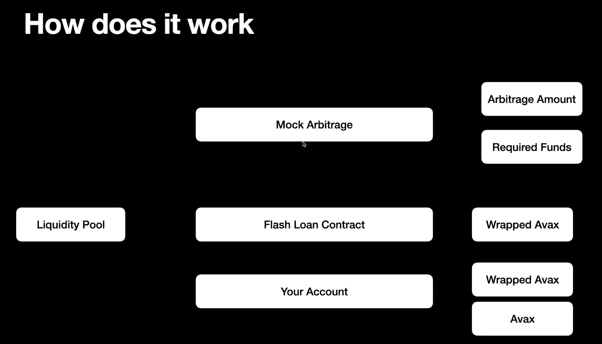

如您所见，这四个主要组件包括:

*   **流动性池**–我们将为此目的使用 AAVE 协议。
*   **模拟套利**–这是一个沙盒套利，我们将把它作为利用快速贷款的一个例子。它将有两个参数:套利金额和所需资金。第一个是套利成功执行时将获得的代币数量，第二个是参与所需的代币数量。
*   **快速贷款合同**–它将向用户提供来自流动资金池的资金。合约需要有一些包装好的 AVAX (WAVAX)来支付我们借的币的佣金。它还将调用模拟套利来获得套利金额(如果所需资金充足)。然后，它将偿还流动性池。但是，资金仍然会在合同上(下面的视频揭示了一个解决方案)。
*   **您的账户**——您需要有足够数量的 WAVAX 和 AVAX 来支付所需的套利金额、费用，甚至提供足够的流动性。

*如果您想了解更多关于我们快速贷款实验室如何运作的信息，请观看下面 16:04 开始的视频。此外，为了获得更清晰的理解，请查看 41:28 的实验室运行。*

此时，您已经准备好处理我们的快速贷款智能合同的细节(20:20 的视频)。最后，您还将了解在 37:09 创建闪贷实验室 UI 的细节。*为了充分利用这个示例项目，请确保创建您自己版本的快速贷款实验室*。

https://www.youtube.com/watch?v=YBm68v6oWXw

## 闪贷是怎么运作的？–完整演练–总结

闪贷是怎么运作的？如果你已经适当地涵盖了上述部分，你现在已经清楚地了解什么是快速贷款和如何快速贷款的功能。此外，您还学习了如何完成创建自己的快速贷款实验室所需的初始设置。此外，按照上面的视频，您应该已经有了一个可供您使用的功能性快速贷款实验室。有了这些，你可能会给自己冠上“半快速贷款专家”的头衔。尽管如此，如果你有兴趣进一步了解 DeFi 知识，请务必查看[Moralis 学院](https://academy.moralis.io/)的“[DeFi 101–2022 Ready](https://academy.moralis.io/courses/defi-101)”课程。

此外，你可以通过使用 [Moralis YouTube 频道](https://www.youtube.com/c/MoralisWeb3)和 [Moralis 博客](https://moralis.io/blog/)上的免费内容[成为区块链开发者](https://moralis.io/how-to-become-a-blockchain-developer/)。我们定期在这两个网站上发布有价值的内容。我们的一些最新主题教你如何[用短信](https://moralis.io/get-web3-events-with-sms-messages/)获取 Web3 事件，如何[构建预测市场 dApp](https://moralis.io/how-to-build-a-prediction-market-dapp/) ，如何[构建跨链桥](https://moralis.io/how-to-build-a-cross-chain-bridge/)，如何[在币安智能链上创建 NFT](https://moralis.io/create-nft-on-binance-smart-chain-full-guide/)，面向开发者的[元掩码](https://moralis.io/metamask-for-developers-how-to-launch-web3-apps-with-metamask/)，如何[使用 OpenSea API 替代方案](https://moralis.io/opensea-api-alternative-list-nfts-with-this-opensea-plugin/)，如何[创建免费令牌](https://moralis.io/create-free-token-how-to-deploy-your-own-testnet-crypto-token-in-10-mins/)，如何做【T2

