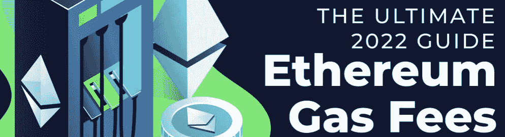
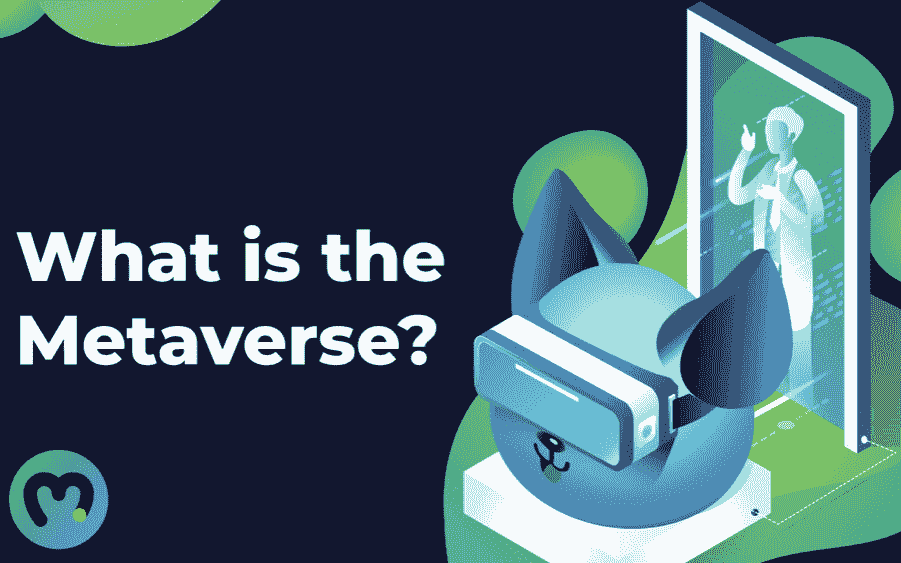
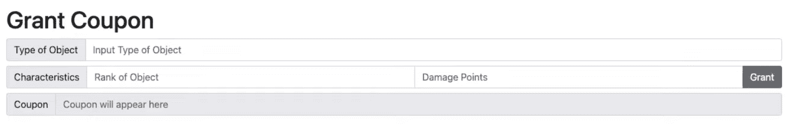

# OpenSea 如何在没有天然气费的情况下交易 NFT

> 原文：<https://moralis.io/how-opensea-trades-nfts-without-gas-fees/>

在本文中，我们将仔细研究一个简单的 Web3 项目，以说明 OpenSea 如何在没有天然气费的情况下交易 NFT。如果你愿意，你可以通过访问下面的 GitHub 库直接跳到解释 OpenSea 上无汽油 NFT 交易的代码:

**完整的无气元宇宙文档—**[https://github . com/danielmoralisamples/31 _ 无气 _ 元宇宙](https://github.com/DanielMoralisSamples/31_Gasless_Metaverse)

如果你熟悉加密领域，你会知道所有的区块链互动都需要汽油费。此外，如果你在运营任何一个[元宇宙](https://moralis.io/what-is-the-metaverse-full-guide/)平台，对天然气的要求可能会导致高成本，因为它们通常会促成大量交易。然而，为了让运营一个[网络 3](https://moralis.io/the-ultimate-guide-to-web3-what-is-web3/) 平台更加有利可图，有可能将交易成本推给购买者，比如说，NFTs。利用这种策略的一个成功平台是 OpenSea。在这里，我们将发现 OpenSea 如何在没有汽油费的情况下交易 [NFTs](https://moralis.io/non-fungible-tokens-explained-what-are-nfts/) 。

为了演示 OpenSea 上的无气 NFT 交易是如何工作的，我们将仔细观察一个使用 [Moralis](https://moralis.io/) 开发的 Web3 项目。该项目将允许我们为游戏中的项目生成优惠券，可以分发给用户。反过来，用户可以在我们的 UI 中申请优惠券来接收商品。因此，我们正在推动交易，因此，汽油费，当用户要求他们的优惠券。

通过 Moralis，创建这个项目的过程变得相对容易。事实上，操作系统的后端基础设施承担了大部分繁重的工作。这使得我们将区块链项目的开发时间平均缩短了 87%。此外，像 Moralis 家[元宇宙 SDK](https://moralis.io/metaverse/) 、[速度节点](https://moralis.io/speedy-nodes/)和 [NFT API](https://moralis.io/ultimate-nft-api-exploring-moralis-nft-api/) 这样的工具可以让你[快速轻松地构建 dapp](https://moralis.io/how-to-build-decentralized-apps-dapps-quickly-and-easily/)。

如果你想成为一名区块链开发者，马上注册 Moralis，开始你的 Web3 之旅吧！

## 什么是 OpenSea？

在我们深入本教程的项目之前，最好对 OpenSea 有一个更好的了解。因此，我们将通过解释什么是 OpenSea 来开始本教程，因为这将为理解该平台如何在没有天然气费的情况下交易 NFT 提供一个良好的基础。那么，事不宜迟，什么是 OpenSea？


OpenSea 是一个集中式服务，它利用了一个分散的区块链。此外，它是一个 NFT(不可替代的令牌)市场，用于创建、销售、购买和交易 NFT。此外，OpenSea 将自己标榜为世界上第一个也是最大的 NFT 数字资产市场。

该平台成立于 2017 年底，这表明 NFT 市场的概念相对较新。自成立以来，OpenSea 取得了巨大的发展，越来越多的普通人开始了解它。事实上，仅在 2022 年 1 月，OpenSea 就超过了 35 亿美元的以太交易量，这表明该平台比以往任何时候都更热。

此外，该平台还拥有大量成熟的 NFT 集合，如 Bored Ape 游艇俱乐部、突变 Ape 游艇俱乐部、CryptoPunks 等。这表明，如果你想进入 NFT 收藏品市场，OpenSea 是一个很好的平台。此外，如果你想了解更多关于创建你自己的 NFT 收藏，看看我们关于如何创造 10，000 个 NFT 的文章。

因此，现在我们对 OpenSea 需要什么有了一个概念，我们可以继续下一部分，我们将讨论为什么天然气费对 NFTs 很重要，以及无气 NFT 交易如何在 OpenSea 上工作。

## 为什么汽油费对非燃油运输公司很重要？

元宇宙平台通常会促成大量区块链交易。例如，这些可以以 NFT 交易或用户创建新令牌的形式出现。由于交易量大，以太币气费高，运营一个平台的运营成本可能使其在经济上不可行。由于它可能会变得非常昂贵，这一问题突出了为什么天然气费的 NFTs 的重要性。那么，如何才能避免这个问题呢？



我们以 OpenSea 为例。该平台允许你在不支付任何汽油费的情况下列出非汽油税。这是通过将区块链交易向前推到某人购买令牌时实现的。但是，当在 OpenSea 上列出一个 NFT 时，卖家的[元掩码](https://moralis.io/metamask-explained-what-is-metamask/)——或者任何其他钱包——都会触发。但是，这只是为了签署一个参数化的链外订单消息。因此，OpenSea 存储销售订单的参数、这些参数的散列和散列的签名。

这表明在购买点之前没有区块链交易发生。通过利用这种策略，NFT 连同平台的卖方免除了支付任何汽油费的负担。相反，是 NFT 的买家为交易买单，这只有在他们获得最大价值时才有意义。

现在，这是允许无汽油 NFT 在 OpenSea 交易的策略。因此，我们将在本文的剩余部分通过深入研究代码来发现更多关于 OpenSea 如何在没有汽油费的情况下交易 NFTs 的信息。

## 在 OpenSea 进行无气 NFT 交易——它是如何工作的？

在下一节中，我们将向您展示 OpenSea 如何在没有汽油费的情况下交易 NFTs。举例来说，我们将分解一个项目的代码，该项目允许我们为游戏中的物品创建优惠券，用户可以兑换这些优惠券来购买物品。通过这样做，我们将实际的区块链交易推到了用户通过优惠券索取某个商品的时候。因此，用户将在收到商品时支付燃气费。

通过这一流程，我们能够降低项目的运营成本，使平台运营在经济上更具可持续性。此外，这个过程不仅限于游戏平台，在创建任何元宇宙项目时都可以使用。



尽管如此，为了使这个过程更容易理解，我们将把教程分成三个不同的部分。在每一部分中，我们都将仔细看看使这一切成为可能的一些基本组件。因此，这是本指南关于在 OpenSea 上进行无汽油 NFT 交易的三个部分:

1.  创建优惠券生成器
2.  制定智能合同
3.  创建用户界面

所以，事不宜迟，让我们仔细看看初始部分，我们仔细看看该项目的优惠券生成器！

## 第 1 部分:OpenSea 如何在没有汽油费的情况下交易 NFTs 创建优惠券生成器

正如前面提到的，我们正在仔细研究的项目由三部分组成。此外，我们将在这一部分专门解释第一部分，即优惠券生成器。优惠券生成器将是一个简单的应用程序，由两个文件组成:“我[ndex.html](https://github.com/DanielMoralisSamples/31_Gasless_Metaverse/blob/master/frontend/index.html)和“[逻辑. js](https://github.com/DanielMoralisSamples/31_Gasless_Metaverse/blob/master/frontend/static/logic.js) ”。您可以在 GitHub 资源库中找到这些文件的完整代码。

HTML 文件相对简单，包含优惠券生成器 UI 的字段和按钮的代码。代码是不言自明的，这意味着我们不会再深入这个文件。然而，这是平台发布后的样子:



看一下 [JavaScript](https://moralis.io/javascript-explained-what-is-javascript/) 文件更有趣，因为我们在这里找到了生成优惠券的逻辑。首先，我们有“login()”函数，它简单地初始化了 [Moralis SDK](https://moralis.io/exploring-moralis-sdk-the-ultimate-web3-sdk/) 。这一点很重要，因为该工具包提供了对一些基本功能的访问，这些功能可以“开箱即用”，其中之一是消息散列功能。

```js
async function login(){
    Moralis.Web3.enableWeb3().then(async function (){
        const chainIdHex = await Moralis.switchNetwork("0x2A");
    });
}
```

当我们调用 JavaScript 文件的第二个函数:“grantCoupon()”时，消息散列函数执行。此外，该函数使用 UI 中的输入元素创建一个对象。然后这个对象被字符串化和散列化。在对象的散列之后，我们利用散列来创建签名。签名和散列然后被组合成完整的优惠券，该优惠券被返回给 UI:

```js
async function grantCoupon(){
    const objectType = document.getElementById("objectType").value;
    const objectRank = document.getElementById("objectRank").value;
    const damagePoints = document.getElementById("damagePoints").value;
    const object = {"objectType":objectType,"damagePoints":damagePoints};
    const hash = ethers.utils.hashMessage(JSON.stringify(object));
    const signature = await ethereum.request({
        method: "personal_sign",
        params: [hash, ethereum.selectedAddress],
      });
    const coupon = hash+signature;
    document.getElementById("coupon").value = coupon
}
```

## 第 2 部分:OpenSea 如何在没有天然气费的情况下交易 NFTs 开发智能合同

对优惠券生成器的工作原理有了更好的了解后，我们可以继续深入了解该项目的智能合同。我们将在这一部分讨论合同中最关键的部分；但是，您可以在 GitHub 存储库中找到完整的合同代码:" [verify.sol](https://github.com/DanielMoralisSamples/31_Gasless_Metaverse/blob/master/contracts/verify.sol) "。此外，你可以在 Moralis 阅读更多关于[智能合同](https://moralis.io/smart-contracts-explained-what-are-smart-contracts/)和如何[创建智能联系人](https://moralis.io/how-to-create-smart-contracts/)的内容。


如果你对 Web3 开发有所了解，你可能会很容易理解这个契约是做什么的。然而，由于合同是用 [Solidity](https://moralis.io/solidity-explained-what-is-solidity/) 编写的，精通这种编程语言将是有益的。此外，合同是使用 [Remix](https://remix.ethereum.org/) IDE 开发的。因此，如果您还没有，您可能需要熟悉 Remix，以便更好地理解这一部分。

合同的要点是验证正确的管理员帐户签署了消息和签名。如果发生这种情况，就会触发某种形式的连锁反应。而且，契约由两个主要函数组成:“verifyMessage()”和“claimCoupon()”。

### OpenSea 上的无气 NFT 交易–智能合约功能:“verifyMessage()”和“claimCoupon()”

第一个函数是“verifyMessage()”，它将签署消息的帐户与 admin 地址进行比较。通过这样做，我们可以确保管理员地址创建所有可兑换的优惠券，因此没有人可以在我们的游戏中创建新的项目。在这个实例中，我们已经在契约中对管理地址进行了硬编码。尽管如此，函数看起来是这样的:

```js
function verifyMessage(bytes32 _hashedMessage, uint8 _v, bytes32 _r, bytes32 _s) internal pure returns (bool) {
        bytes memory prefix = "\x19Ethereum Signed Message:\n32";
        bytes32 prefixedHashMessage = keccak256(abi.encodePacked(prefix, _hashedMessage));
        address signer = ecrecover(prefixedHashMessage, _v, _r, _s);
        return signer == admin;
    }
```

第二个函数是“claimCoupon()”，该函数首先检查优惠券是否已经被认领。此外，该函数还通过“verifyMessage()”函数确保签名者与管理地址的签名者相同。如果这两个先决条件都满足，将执行链上操作。然而，正如您可能在契约代码中注意到的，您需要自己添加逻辑，这取决于您希望契约做什么。

```js
function claimCoupon(bytes32 _hashedMessage, uint8 _v, bytes32 _r, bytes32 _s) external {
        require (!claimed[_hashedMessage],"coupon already claimed");
        require (verifyMessage(_hashedMessage, _v, _r, _s),"Invalid signature or incorrect hash");
        claimed[_hashedMessage] = true;
        //your logic for the copon here
        emit CouponClaimed(_hashedMessage, msg.sender, block.timestamp);
    }
```

此外，如果您计划通过 Remix 编译和部署合同，您首先需要复制 ABI 和合同地址。在接下来的部分中，我们需要这两个元素。

## 第 3 部分:OpenSea 如何在没有汽油费的情况下交易 NFTs 创建 UI

在最后一部分，我们将仔细看看用户界面，用户可以通过优惠券领取物品。与优惠券生成器非常相似，这部分也由两个文件组成:“[verify.html](https://github.com/DanielMoralisSamples/31_Gasless_Metaverse/blob/master/frontend/verify.html)和“ [logic-verify.js](https://github.com/DanielMoralisSamples/31_Gasless_Metaverse/blob/master/frontend/static/logic-verify.js) ”。

此外，HTML 文件包含一个输入字段和一个用于验证优惠券的按钮。因为它是不言自明的，所以我们不会深入研究代码。但是，用户界面看起来是这样的:


接下来，我们有“logic-verify.js”，在我们深入研究这些函数之前，您会注意到您需要实现我们在上一步中从 Remix 复制的契约地址和 ABI。在代码中会是这样的:

```js
const protocolContract = ""; // your contract address here
const protocolABI = [{}]
```

接下来，我们在优惠券生成器中使用了相同的“login()”函数。因此，您已经知道了这段代码的要点，也就是说，我们不会再进一步解释它的细节。

在“login()”之后，我们有“splitCoupon()”函数。这个功能实质上是将优惠券分成不同的部分。然后在执行我们在上一步中创建的智能契约时使用这些部分。下面是完整的函数:

```js
function splitCoupon(coupon){
    const hash = coupon.slice(0,66);
    const signature = coupon.slice(66, coupon.length);
    const r = signature.slice(0, 66);
    const s = "0x" + signature.slice(66, 130);
    const v = parseInt(signature.slice(130, 132), 16);
    signatureParts = { r, s, v };
    console.log([hash,signatureParts])
    return ([hash,signatureParts]);
}
```

然后我们有了最重要的函数，就是“verify()”。这个函数获取优惠券，调用“splitCoupon()”函数，获取散列和签名，最后用适当的参数调用契约。因此，该函数如下所示:

```js
async function verify(){
    const coupon = document.getElementById("coupon").value;
    const couponParts = splitCoupon(coupon);
    const hash = couponParts[0]
    const signature = couponParts[1]
    const contractOptions = {
        contractAddress: protocolContract,
        abi: protocolABI,
        functionName: "claimCoupon",
        params: {
            _hashedMessage: hash,
            _r:signature["r"],
            _s:signature["s"],
            _v:signature["v"]
        }
    }
    try{
        const transaction = await Moralis.executeFunction(contractOptions);
        await transaction.wait();
        displayMessage("00","Transaction confirmed with hash "+transaction.hash);
    }
    catch(error){
        displayMessage("01","Transaction reverted see console for details");
        console.log(error)
    }
}
```

现在就是这样！如果你跟着做了，你现在知道了一个 OpenSea 交易 NFTs 的方法，不用付汽油费！然而，如果对代码仍有疑问，我们建议查看以下来自 [Moralis YouTube 频道](https://www.youtube.com/c/MoralisWeb3)的视频，在那里你会找到更详细的代码分解:

https://www.youtube.com/watch?v=AQfjB4TxYtI

## OpenSea 上的无气 NFT 交易——摘要

区块链互动需要汽油费，这表明运营一个元宇宙平台可能会变得相当昂贵。因此，最大限度地减少区块链交易的数量以降低运营成本是合乎逻辑的。一个已经成功实施这种策略的平台是 OpenSea。OpenSea 平台通过将交易推送到购买点来进行无气费交易。

那么，在 OpenSea 进行无汽油 NFT 交易是如何进行的呢？在本文中，我们提供了一个 Web3 项目的演练，演示了如何实现这一点。为这个项目创建新项目时，会生成一张优惠券，用户可以用它来兑换。生成优惠券时，不会发生连锁交易。因此，交易成本由用户承担，而非平台运营商。

本教程有三个部分讲述了在 OpenSea 上进行无汽油 NFT 交易的工作原理:

1.  创建优惠券生成器
2.  制定智能合同
3.  创建用户界面

这个项目的这三个部分允许我们提供与 OpenSea 类似的无汽油 NFT 交易功能。此外，由于我们使用的是 Moralis 操作系统，我们能够在几分钟内完成这项工作。

然而，这只是 Moralis 闪耀的众多例子之一。如果你对区块链的发展有进一步的兴趣，请查看 Moralis 博客。在这里你可以找到更多的教程，例如，[如何创建你自己的 NFT](https://moralis.io/how-to-create-your-own-nft-in-5-steps/) ，[如何创建一个 Web3 Spotify 克隆](https://moralis.io/how-to-build-a-web3-spotify-clone/)，[如何创建一个 ERC-721 NFT](https://moralis.io/how-to-create-an-erc-721-nft/) ，等等！


因此，[向 Moralis](https://admin.moralis.io/register) 注册，今天就开始你的 Web3 开发之旅吧！加入该平台是免费的，您将立即获得使用 Moralis 操作系统的所有好处。