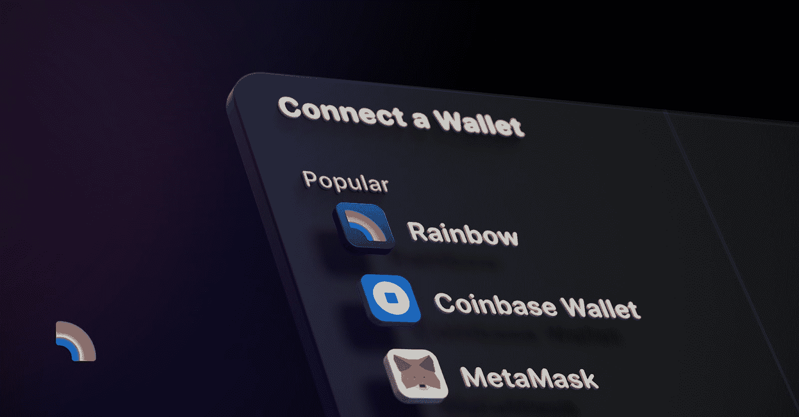
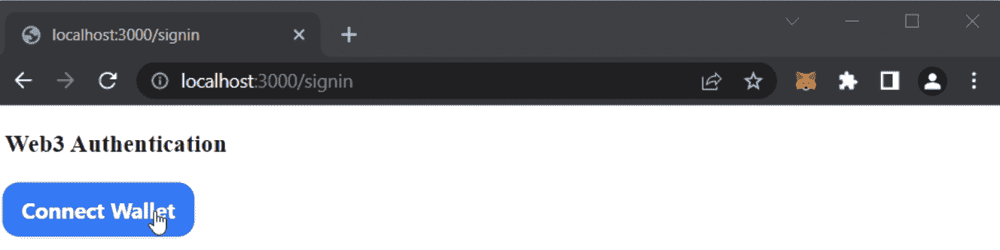
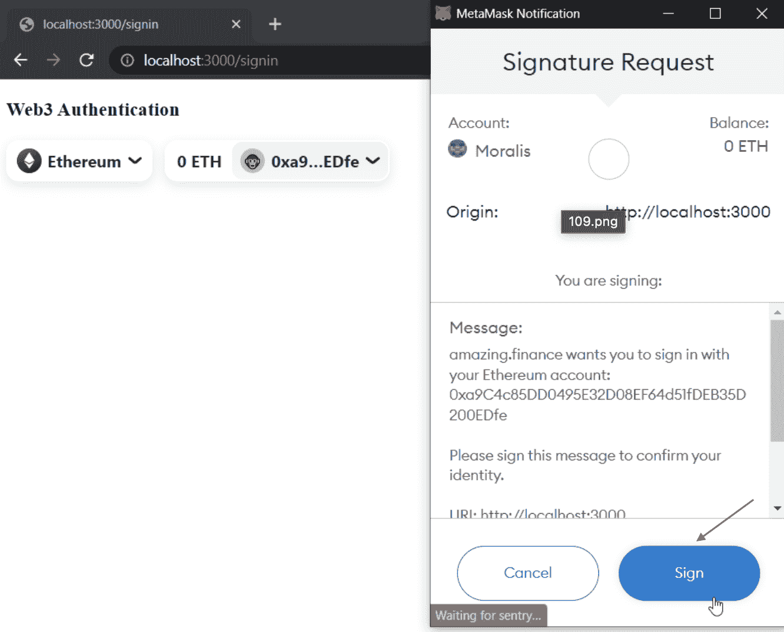

# 如何通过 5 个步骤将使用 RainbowKit 登录添加到您的项目中

> 原文：<https://moralis.io/how-to-add-a-sign-in-with-rainbowkit-to-your-project-in-5-steps/>

本教程将演示如何使用 RainbowKit 添加登录。为了演示这个过程，我们将创建一个简单的应用程序，用户可以在其中使用 RainbowKit 进行登录。一旦他们验证了自己，应用程序将显示一个地址，个人资料 ID 和签名。但是，如果您想立即检查应用程序的代码，请查看下面的 GitHub repo:

**全 RainbowKit 认证 App 文档—**[**https://github . com/moralisweb 3/demo-apps/tree/main/nextjs _ moralis _ auth**](https://github.com/MoralisWeb3/demo-apps/tree/main/nextjs_moralis_auth)

**在继续之前，请注意代码涉及元掩码身份验证。因此，您需要进行一些调整，使其适合 RainbowKit。如果您对此过程有任何疑问，请跟随我们向您展示如何使用 RainbowKit 添加登录信息。**

**一般来说，Web3 认证是构建 dapps(分散式应用程序)和 [Web3 开发](https://moralis.io/how-to-build-decentralized-apps-dapps-quickly-and-easily/)的重要组成部分。此外，它允许用户在几个平台上通过他们的 [Web3 钱包](https://moralis.io/what-is-a-web3-wallet-web3-wallets-explained/)进行身份验证。此外，个人不必跟踪几个登录凭证，这表明分散式 web 提供了统一的标识层。一些突出的钱包和解决方案的例子是 MetaMask，比特币基地钱包，RainbowKit 等。本文将关注后者，我们将向您展示如何使用 [Moralis](https://moralis.io/) 通过五个步骤在 RainbowKit 中添加一个登录！**

**在向您展示如何使用 RainbowKit 添加登录之前，我们先来了解一下 RainbowKit。一旦我们掌握了这个概念，我们将更深入地研究这个过程，并通过仅用五个步骤创建一个简单的身份验证应用程序来演示 Moralis 的可访问性。因此，如果您继续学习，您将能够轻松地将 RainbowKit 身份验证添加到所有未来的区块链项目中！**

**因此，如果你想创建复杂的 dapps，立即注册 Moralis！**

## **什么是 RainbowKit？**

**流行的 Web3 钱包 Rainbow Wallet 背后的团队是 RainbowKit。此外，RainbowKit 是一个 React 库，它提供了只需几个代码片段就可以构建 connect wallet UI(用户界面)的组件。此外，该套件支持许多钱包，包括比特币基地钱包，WalletConnect，MetaMask 和 Rainbow。**

**

如果您想了解有关为其他替代方案添加登录机制的更多信息，请务必查看我们关于如何为您的应用添加比特币基地钱包登录功能的附加指南。否则，请继续阅读并了解如何使用 RainbowKit 添加登录信息！

尽管如此，该套件为开发人员提供了一种简单、快速和高度可定制的方式，为他们的所有 Web3 项目添加出色的钱包身份验证体验。此外，RainbowKit 还负责处理幕后的复杂事务。因此，开发人员和他们的团队可以专注于为他们的客户创建优秀的社区和独特的产品。

此外，RainbowKit 还提供了一系列功能，以下是三大优势:

*   **钱包管理**–rainbow kit 为您的所有应用程序提供开箱即用的钱包管理。而且，除了处理钱包的连接和断开之外，该套件还支持多种交换连接链、钱包、显示钱包余额等。
*   **定制**–rainbow kit 是高度可定制的，您可以根据自己的品牌调整用户界面。此外，该套件允许选择一些预定义的颜色和半径配置。但是，为更高级的情况创建完全定制的主题也是可能的，这包括添加您自己的按钮和删除特定的功能。
*   **行业标准**—为了增加与大多数产品的互操作性，RainbowKit 基于“*醚”*和“*和牛”*。此外，这是该领域中最常见的两个库。

现在，随着对 RainbowKit 的深入了解，我们可以继续前进了。因此，让我们来探索如何使用 RainbowKit 添加签到！

## 如何通过 5 个步骤使用 RainbowKit 添加登录

如前所述，本简要指南将向您展示如何使用 RainbowKit 添加登录。为了演示这个过程，我们将创建一个简单的 Next.js 应用程序，用户可以在其中使用 RainbowKit 进行身份验证。此外，在登录和认证过程之后，应用程序将显示用户的地址、配置文件 ID 和签名。此外，由于我们正在使用 Moralis 的 [Web3 认证](https://moralis.io/authentication/) API，我们将能够通过以下五个步骤来添加此功能:

1.  安装依赖项、库和 RainbowKit
2.  用“*WagmiConfig”*和“*session provider”*包装应用程序
3.  创建请求消息端点
4.  配置“ *NextAuth* ”并创建登录页面
5.  设置用户页面

遵循这些步骤将展示 Moralis 的 Web3 身份验证功能，以及如何将安全身份验证机制添加到您的 Next.js 应用程序中。此外，一旦用户使用 Web3 钱包和他们的 [Web3 身份](https://moralis.io/web3-identity-the-full-guide-to-authentication-identity-and-web3/)进行身份验证，next-auth 库就负责创建一个会话 cookie。这个会话 cookie 内部有一个加密的 JWT，包含用户浏览器中的各种信息。

**登录页面:**


**用户页面:**


然而，在我们进入这个简短指南的第一步之前，您需要处理一些先决条件。首先，你需要一个 Moralis 账户。因此，如果你还没有，一定要马上注册。另外，你需要一个 IDE(集成开发环境)。在我们的例子中，我们使用的是 Visual Studio 代码；但是，您可以自由使用任何您熟悉的 IDE。最后，需要创建一个 Next.js 应用程序。如果你在这方面有问题，请查阅“[创建下一个应用程序](https://nextjs.org/docs/api-reference/create-next-app)”文档或遵循 Moralis 的 [NextJS dapp](https://docs.moralis.io/docs/nextjs-dapp) 指南。

完成所有先决条件后，我们将更仔细地看一下安装依赖项、库和 RainbowKit！

### 步骤 1–安装依赖项、库和 RainbowKit

我们希望您和我们一样对第一步感到兴奋！此外，本教程的第一步围绕着安装依赖项、库和 RainbowKit。最初，我们将安装 Moralis、next-auth 和 axios 依赖项。此外，要安装这三个组件，您只需要下面的 *npm* 命令:

```js
npm install moralis next-auth axios
```

接下来，我们需要安装一个库，这是使用 RainbowKit 添加登录所需的。因此，我们将安装流行的 wagmi 库。此外，您可能还记得以前的内容，因为 RainbowKit 就是基于此来确保 Web3 生态系统的大部分之间的互操作性。无论如何，要安装 wagmi 依赖项，您可以使用以下命令:

```js
npm install wagmi ethers
```

除了 wagmi，你还需要安装 RainbowKit。这可以通过下面的代码片段来实现:

```js
npm install @rainbow-me/rainbowkit
```

最后，在第一步的最后一部分，您需要将一些环境变量添加到应用程序根目录下的“. env.local”文件中。相应地，这是您需要添加的内容:

```js
APP_DOMAIN=amazing.finance
MORALIS_API_KEY=xxxx
NEXTAUTH_URL=http://localhost:3000
NEXTAUTH_SECRET=7197b3e8dbee5ea6274cab37245eec212
```

我们将简要介绍最后三个变量，因为它们需要额外的关注。首先，你需要一个 API 密匙，可以通过注册 Moralis 获得。第二，“ *NEXTAUTH_URL* ”当前设置为“ [http://localhost:3000](http://localhost:3000/) ”。这在开发过程中是没问题的；然而，一旦你完成了你的应用程序，这个变量应该设置为你的应用程序的地址。

最后，“ *NEXTAUTH_SECRET* ”变量用于加密应用用户的 JWT 令牌。这里可以放任何值；但是，您可以使用以下网站来生成拟合值:

[https://generate-secret.now.sh/32](https://generate-secret.now.sh/32)

这是第一步。让我们进入第二个阶段，用" *WagmiConfig"* 和" *SessionProvider* "包装应用程序！

### 步骤 2–用 WagmiConfig 和 SessionProvider 包装应用程序

要启动第二步，您需要创建一个新的“pages/_app.jsx”文件。接下来，您可以用“ *WagmiConfig* ”和“ *SessionProvider* ”来包装您的页面。为此，您只需将以下内容添加到刚刚创建的文件中:

```js
import { createClient, configureChains, defaultChains, WagmiConfig } from 'wagmi';
import { publicProvider } from 'wagmi/providers/public';
import { SessionProvider } from 'next-auth/react';
import { getDefaultWallets, RainbowKitProvider } from '@rainbow-me/rainbowkit';
import '@rainbow-me/rainbowkit/styles.css';

const { provider, webSocketProvider, chains } = configureChains(defaultChains, [publicProvider()]);

const { connectors } = getDefaultWallets({
    appName: 'My RainbowKit App',
    chains,
});

const client = createClient({
    provider,
    webSocketProvider,
    autoConnect: true,
    // added connectors from rainbowkit
    connectors,
});

// added RainbowKitProvider wrapper
function MyApp({ Component, pageProps }) {
    return (
        &lt;WagmiConfig client={client}&gt;
            &lt;SessionProvider session={pageProps.session} refetchInterval={0}&gt;
                &lt;RainbowKitProvider chains={chains}&gt;
                    &lt;Component {...pageProps} /&gt;
                &lt;/RainbowKitProvider&gt;
            &lt;/SessionProvider&gt;
        &lt;/WagmiConfig&gt;
    );
}

export default MyApp;
```

此外，我们还确保在此文件中包含 RainbowKit 配置，如果您想在所有应用程序中添加使用 RainbowKit 的登录，这是必不可少的。

### 步骤 3–创建请求消息端点

我们的页面被包装在“ *WagmiConfig* 和“ *SessionProvider* 中”，您需要创建一个请求消息端点。此外，该端点将向“*Moralis 家发出请求。Auth"* 并生成在客户端签名的唯一消息。此外，要添加端点，您可以创建一个名为“pages/API/auth/request-message . js”的新 API 文件，并添加以下内容:

```js
import Moralis from 'moralis';

const config = {
    domain: process.env.APP_DOMAIN,
    statement: 'Please sign this message to confirm your identity.',
    uri: process.env.NEXTAUTH_URL,
    timeout: 60,
};

export default async function handler(req, res) {
    const { address, chain, network } = req.body;

    await Moralis.start({ apiKey: process.env.MORALIS_API_KEY });

    try {
        const message = await Moralis.Auth.requestMessage({
            address,
            chain,
            network,
            ...config,
        });

        res.status(200).json(message);
    } catch (error) {
        res.status(400).json({ error });
        console.error(error);
    }
}
```

现在，有了请求消息端点，我们可以继续前进了。因此，我们将前进到第四步，仔细看看如何配置" *NextAuth* "并为您的应用程序创建一个登录页面。

### 步骤 4–配置 NextAuth 并创建登录页面

在这一步中，您可以继续创建一个新的“pages/api/auth/[…nextauth]。js”文件。此外，这将用于配置“ *NextAuth* ”。此外，该文件应该如下所示:

```js
import CredentialsProvider from 'next-auth/providers/credentials';
import NextAuth from 'next-auth';
import Moralis from 'moralis';

export default NextAuth({
    providers: [
        CredentialsProvider({
            name: 'MoralisAuth',
            credentials: {
                message: {
                    label: 'Message',
                    type: 'text',
                    placeholder: '0x0',
                },
                signature: {
                    label: 'Signature',
                    type: 'text',
                    placeholder: '0x0',
                },
            },
              async authorize(credentials) {
                try {
                  // "message" and "signature" are needed for authorisation
                  // we described them in "credentials" above
                  const { message, signature } = credentials;

                  await Moralis.start({ apiKey: process.env.MORALIS_API_KEY });

                  const { address, profileId } = (
                    await Moralis.Auth.verify({ message, signature, network: 'evm' })
                  ).raw;

                  const user = { address, profileId, signature };
                  // returning the user object and creating  a session
                  return user;
                } catch (e) {
                  console.error(e);
                  return null;
                }
              },
        }),
    ],
    // adding user info to the user session object
    callbacks: {
        async jwt({ token, user }) {
            user && (token.user = user);
            return token;
        },
        async session({ session, token }) {
            session.user = token.user;
            return session;
        },
    },
});
```

#### 创建登录页面

按照“*next auth”*配置，您必须创建一个新的页面文件“pages/signin.jsx”。此外，该文件需要包含以下内容:

```js
import { ConnectButton } from '@rainbow-me/rainbowkit'
import { signIn, useSession } from 'next-auth/react'
import { useAccount, useSignMessage, useNetwork } from 'wagmi'
import { useEffect } from 'react'
import { useRouter } from 'next/router'
import axios from 'axios'

function SignIn() {
  const { isConnected, address } = useAccount()
  const { chain } = useNetwork()
  const { status } = useSession()
  const { signMessageAsync } = useSignMessage()
  const { push } = useRouter()

  useEffect(() => {
    const handleAuth = async () => {
      const userData = { address, chain: chain.id, network: 'evm' }

      const { data } = await axios.post('/api/auth/request-message', userData, {
        headers: {
          'content-type': 'application/json',
        },
      })

      const message = data.message

      const signature = await signMessageAsync({ message })

      // redirect user after success authentication to '/user' page
      const { url } = await signIn('credentials', {
        message,
        signature,
        redirect: false,
        callbackUrl: '/user',
      })
      /**
       * instead of using signIn(..., redirect: "/user")
       * we get the url from callback and push it to the router to avoid page refreshing
       */
      push(url)
    }
    if (status === 'unauthenticated' && isConnected) {
      handleAuth()
    }
  }, [status, isConnected])

  return (
    <div>
      <h3>Web3 Authentication</h3>
      <ConnectButton />
    </div>
  )
}

export default SignIn
```

一些关键的要点是，我们要确保“handleAuth”功能调用您在第三步中创建的请求消息端点。更重要的是，除了调用请求消息，我们还添加了刚刚敲定的“ *next.auth* ”认证。最后，我们还确保包括正确的 RainbowKit 配置。例如，我们确保添加了一个来自“@rainbow-me/rainbowkit”的按钮。

### 步骤 5–设置用户页面

在如何使用 RainbowKit 添加登录的教程的最后一步中，您将设置一个用户页面。因此，首先创建一个“pages/user.jsx”文件。有了这个页面，您可以继续将以下内容实现到文件中:

```js
import { getSession, signOut } from 'next-auth/react';

// gets a prop from getServerSideProps
function User({ user }) {
    return (
        <div>
            <h4>User session:</h4>
            <pre>{JSON.stringify(user, null, 2)}</pre>
            <button onClick={() => signOut({ redirect: '/signin' })}>Sign out</button>
        </div>
    );
}

export async function getServerSideProps(context) {
    const session = await getSession(context);

    // redirect if not authenticated
    if (!session) {
        return {
            redirect: {
                destination: '/signin',
                permanent: false,
            },
        };
    }

    return {
        props: { user: session.user },
    };
}

export default User;
```

恭喜你完成以上教程步骤！至此，您已经安装了依赖项和库。您还包装了应用程序并创建了一个端点。此外，您还配置了“下一步。Auth”并设置一个用户页面。但那只是一些荣誉提名。此外，您知道如何使用 RainbowKit 添加标志。然而，我们还需要做一件事。因此，在结束本文之前，我们将说明如何测试您的应用程序。因此，您可以确保一切顺利运行。因此，我们将在下一部分演示这个过程。

## 使用 RainbowKit 添加登录–测试应用程序

至此，我们已经准备好测试应用程序了。相应地，使用“ *npm run dev* 启动本地主机服务器，并使用“[http://localhost:3000/sign in](http://localhost:3000/signin)”**打开我们在第四步中创建的登录页面。**启动应用程序后，您需要点击“连接钱包”按钮:



从那里，你需要选择一个钱包，因为你使用的是 RainbowKit，你会有几个选项，包括 MetaMask，Rainbow，比特币基地钱包等。但是，在我们的例子中，我们将选择元掩码。但是，如果选择了这两种方法中的任何一种，您都必须对邮件进行签名。在下图中，您将看到此消息的一个示例:



一旦您成功通过身份验证，它会将您重定向到“/用户”页面。从那里，您可以读取地址、配置文件 ID 和签名。此外，如果您在唱完留言后到达这里，您将知道您已经成功地使用 RainbowKit 添加了一个登录！


更重要的是，你还可以直接访问“[http://localhost:3000/user](http://localhost:3000/user)”来确定没有 bug 存在。此外，如果用户通过了身份验证，它应该显示关于用户的信息。此外，如果他们没有通过身份验证，它应该将他们重定向回原来的“/登录”页面。

如果您得到相同的结果，您将知道如何使用 RainbowKit 添加登录。所以，现在是你把这个功能添加到你未来所有的区块链项目中的时候了！但是，如果您对这个过程有任何问题，请仔细查看我们最初链接的 GitHub 存储库。此外，你还可以查看官方的 [RainbowKit 认证文档](https://docs.moralis.io/docs/sign-in-with-rainbowkit)。

你喜欢这本指南吗？如果是这样的话，我们强烈建议查看我们的其他文章，里面塞满了操作指南。例如，您可以学习如何在游戏中购买 NFTs，并为 NFT 元数据添加属性！

## 使用 RainbowKit 通过 5 个步骤添加登录–摘要

我们在这篇文章的开头简要解释了 RainbowKit 及其功能。相应地，你知道 RainbowKit 是一个 [React](https://moralis.io/react-explained-what-is-react/) 库，它允许开发人员只用几个代码片段就能构建出色的钱包身份验证 ui。此外，RainbowKit 的一些突出特性是可定制性和钱包管理功能。因此，在使用 RainbowKit 时，您为应用程序用户提供了几个选项来验证他们的 Web3 身份。

此外，一旦我们更深入地理解了该工具包，我们演示了如何使用 RainbowKit 添加一个标志。为此，我们创建了一个简单的身份验证应用程序，用户可以使用他们的 Web3 钱包登录。此外，由于我们利用了 Moralis，我们能够通过五个简单的步骤创建应用程序并使用 RainbowKit 添加登录信息:

1.  安装依赖项、库和 RainbowKit
2.  用“ *WagmiConfig* 和“ *SessionProvider* 包装应用程序
3.  创建请求消息端点
4.  配置“ *NextAuth* ”并创建登录页面
5.  设置用户页面


然而，Web3 认证只是 Moralis 大放异彩的领域之一。例如，你也可以很容易地实现 [Web3 同步](https://moralis.io/syncs/)和 [Web3 webhooks](https://moralis.io/web3-webhooks-the-ultimate-guide-to-blockchain-webhooks/) 。此外，Moralis 还提供了一系列优秀的[web 3 API](https://docs.moralis.io/docs/our-products)。此外，如果你想成为一名区块链开发者，我们强烈推荐你查看 Moralis 的 NFT API。这些工具允许您快速、轻松地创建 dapps 和令牌。

此外，如果你想扩展你的知识，了解更多关于 Web3 开发的知识，请访问 Moralis 的[博客](https://moralis.io/blog/)。在那里，你会找到关于 Moralis 家的 [NodeJS SDK for Web3](https://moralis.io/nodejs-sdk-for-web3-exploring-moralis-nodejs-sdk/) 、[区块链同步](https://moralis.io/blockchain-syncs-exploring-on-chain-syncing/)，或者不同[类型的 Dao](https://moralis.io/full-2022-guide-to-different-types-of-daos/)的内容。此外，您可以学习如何获取 NFT，并通过五个步骤编写区块链应用程序！此外，Moralis 工作室教你如何克隆 Web2 应用程序。此外，优秀的 API、SDK 和内容是[注册 Moralis](https://admin.moralis.io/register) 的几个原因！**