# 如何将 Web3 Connect Wallet 按钮添加到您的网站

> 原文：<https://moralis.io/how-to-add-a-web3-connect-wallet-button-to-your-website/>

**区块链行业充斥着** [**去中心化的应用**](https://moralis.io/decentralized-applications-explained-what-are-dapps/) **(dapps)我们可以与之互动。但是，为了与** [**Web3**](https://moralis.io/the-ultimate-guide-to-web3-what-is-web3/) **领域进行交互，我们必须利用所有 dapps 都包含的一个基本特性——**[**web 3 认证**](https://moralis.io/web3-authentication-the-full-guide/) **。此外，由于市场上有如此多的** [**Web3 钱包**](https://moralis.io/what-is-a-web3-wallet-web3-wallets-explained/) **用于身份验证，您的网站必须包括一个功能，用户可以连接他们可能已经安装在移动设备上的任何类型的钱包。幸运的是，有了 WalletConnect 和 Moralis，我们可以在你的网站上实现一个 Web3“连接钱包”按钮，让用户验证自己。听起来令人畏惧？放心吧！请跟随我们向您展示如何快速轻松地在您的网站上添加 Web3 connect wallet 按钮！**

如果你已经探索加密领域有一段时间了，你就会知道在这个不断发展的行业中，事情发展得很快。是的，我们已经看到了区块链和 Web3 用例的指数增长。此外，随着程序员毫不费力地构建下一代应用程序，我们已经看到了 dapp 开发的进步。如果程序员使用原始的工具，这样的进步是不可能的。今天，有一些实用的工具供您使用，使您能够避免处理 RPC 节点的[限制。这些工具包括开源平台和在线 ide，它们提供模板并让你部署智能合约，比如](https://moralis.io/exploring-the-limitations-of-rpc-nodes-and-the-solution-to-them/) [Remix](https://moralis.io/remix-explained-what-is-remix/) 和 OpenZeppelin。然而，当前 [Web3 技术栈](https://moralis.io/exploring-the-web3-tech-stack-full-guide/)的顶峰是[Moralis](https://moralis.io/)。Moralis 是最好的 [Web3 后端平台](https://moralis.io/exploring-the-best-web3-backend-platform/)，具有跨链、跨平台的互操作性。它包括强大的插件和集成，如 [IPFS](https://moralis.io/what-is-ipfs-interplanetary-file-system/) 、MetaMask 和 [WalletConnect](https://moralis.io/what-is-walletconnect-the-ultimate-walletconnect-guide/) 。使用 Moralis，您可以毫不费力地实现 Web3 connect 钱包按钮。因此，[创建你的免费 Moralis 账户](https://admin.moralis.io/register)。

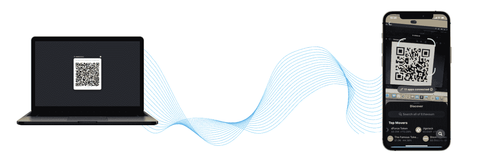

<figcaption>How to Add a Web3 Connect Wallet Button to Your Website</figcaption>

## 使用 Moralis 将 Web3 Connect Wallet 按钮添加到您的网站

如前所述，我们将在本文中演示向网站添加 Web3 connect wallet 按钮是多么容易。因此，我们将采取一个例子项目，我们将创建一个非常简单的网站。为此，我们将使用 [JavaScript](https://moralis.io/javascript-explained-what-is-javascript/) (JS)。此外，我们将通过 Moralis 满足所有与区块链相关的需求。此外，Moralis 集成了各种 Web3 认证解决方案，这将使我们的工作变得非常简单。因此，使用以上链接创建您的免费 Moralis 账户。

Moralis 附带 MetaMask 和 WalletConnect 集成。这两个选项足以将 Web3 connect wallet 按钮集成到任何网站。默认情况下，Moralis 会让您使用 MetaMask 进行[认证。然而，通过对你的代码进行一些毫不费力的调整，你可以很容易地](https://moralis.io/how-to-authenticate-with-metamask/)[用 WalletConnect](https://moralis.io/how-to-connect-users-with-walletconnect/) 连接用户。

接下来，我们将看看我们的演示 dapp。我们将首先使用 Moralis 的默认 Web3 身份验证。然后，我们将带您浏览代码和进行必要的调整，以过渡到 WalletConnect 登录。后者尤其简洁，因为它允许用户通过扫描二维码来登录。此外，Moralis 还可以作为一个 [WalletConnect Android SDK 的替代品](https://moralis.io/walletconnect-android-sdk-alternative-authenticate-android-apps-withmoralis/)。在对代码进行必要的调整后，我们将运行我们的演示应用程序。这一次，你将能够看到 WalletConnect 作为 [Web3 登录](https://moralis.io/how-to-build-a-web3-login-in-5-steps/)的一种出色方式在发挥作用。

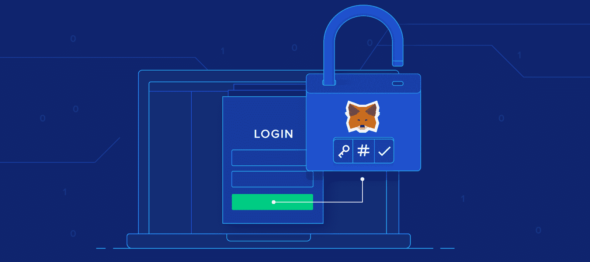

## Web3 Connect Wallet 按钮提示 MetaMask 或 Wallet Connect–示例项目

如上所述，我们从一个提示元掩码的 Web3 connect wallet 按钮的演示开始今天的示例项目。因此，正如您在下面的截图中看到的，我们的示例 dapp 包括一个大的登录按钮。后者是我们的 Web3 connect wallet 按钮:

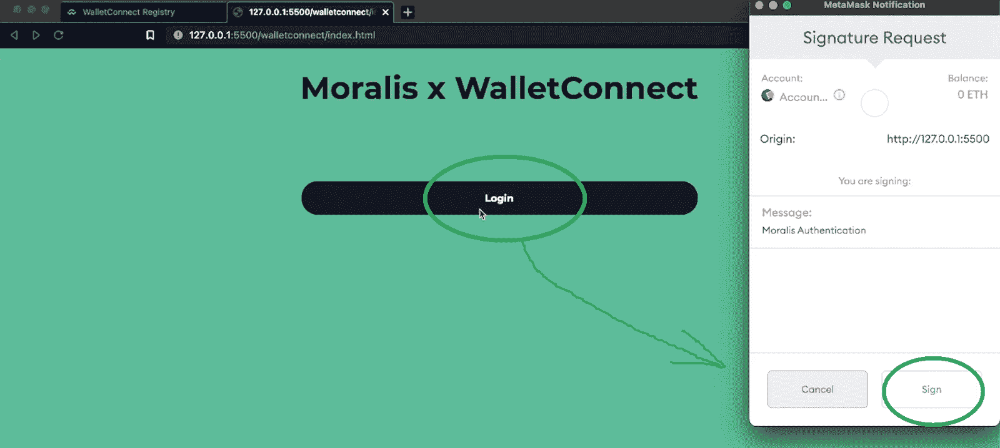

一旦用户点击“登录”按钮，他们的元掩码扩展就会提示他们签名请求。他们需要点击“签名”按钮以确认“Moralis 认证”消息。这样，用户会收到一条欢迎消息，后跟他们的地址。此外，现在他们可以选择注销或进行测试签名呼叫。这封信是一个交易的例子。因此，为了演示起见，让我们单击“测试信号呼叫”按钮:

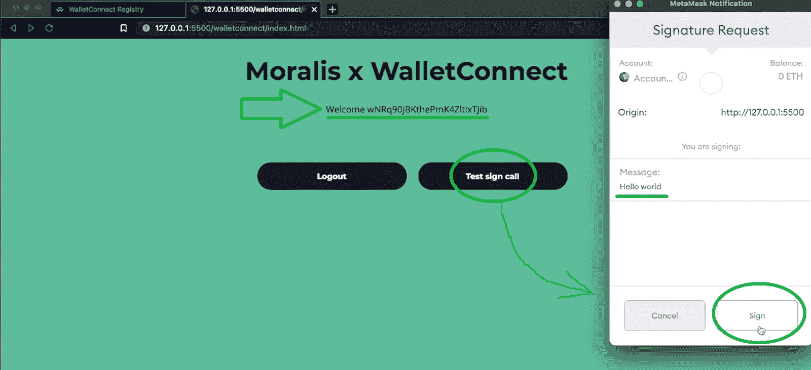

如上图所示，MetaMask 再次提示用户签名请求。这一次，有问题的信息是“你好，世界”。要继续，用户需要点击“签名”按钮，这将返回交易的哈希:

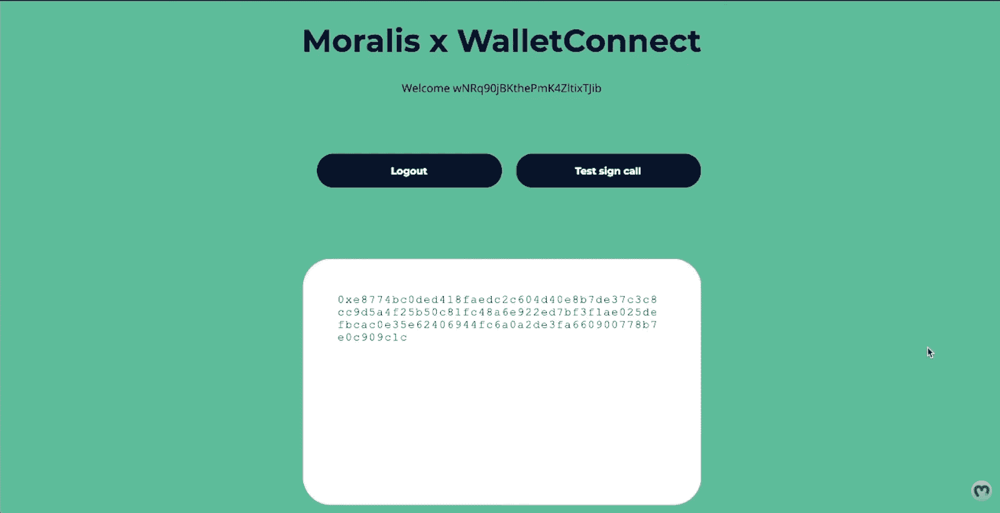

有了上面的演示，你可以看到我们保持了相对简单和整洁。这个示例项目的目的是向您展示使用 Moralis 添加 Web3 connect wallet 按钮是多么容易。

### 添加 Web3 Connect Wallet 按钮的代码演练

*注* *:您可以在* [*GitHub*](https://github.com/MoralisWeb3/demo-apps/tree/be96bc014551e64a3bc9869bfeb7298fee558436/walletconnect) *上访问全部代码。后者包括以下文件:“index.html”、“script.js”和“style.css”。如上所述，我们将使用 JavaScript 和 Moralis 将 Web3 身份验证添加到我们的示例网站中。因此，我们在这里将重点关注“script.js”文件。*

让我们从顶部开始，看看我们的”的前三行。js "文件:

```js
const serverUrl = "https://xxxxx.grandmoralis.com:2053/server"; //Server url from moralis.io
const appId = "YOUR_APP_ID"; // Application id from moralis.io
Moralis.start({ serverUrl, appId });
```

这就是我们的代码需要我们的 Moralis 服务器的细节的地方。这样，它就可以连接到 [Moralis SDK](https://moralis.io/exploring-moralis-sdk-the-ultimate-web3-sdk/) 并使用它来满足它的 Web3 需求。

*注意* *:如果您想创建自己的 dapp 实例，您需要获得自己的 Moralis 服务器 URL 和应用程序 ID。为此，请使用本文末尾的“初始 Moralis 设置”一节。*

此外，我们的代码相当简单，只有不到 90 行代码。就用户而言，我们 app 的核心是以下几个功能:“authenticate()”，“logout()”和“testCall()”。因此，让我们仔细看看这些函数:

```js
async function authenticate() {
  try {
    user = await Moralis.authenticate();
    web3 = await Moralis.enableWeb3();
  } catch (error) {
    console.log('authenticate failed', error);
  }
  renderApp();
}

async function logout() {
  try {
    await Moralis.User.logOut();
  } catch (error) {
    console.log('logOut failed', error);
  }
  result = '';
  renderApp();
}

async function testCall() {
  try {
    result = await web3.eth.personal.sign('Hello world', user.get('ethAddress'));
  } catch (error) {
    console.log('testCall failed', error);
  }
  renderApp();
}
```

然而，在上述三个功能中，是“authenticate()”使我们的 Web3 connect wallet 按钮起作用。因此，让我们投入一些额外的注意力。


#### “authenticate()”函数

查看上面的代码，可以看到“Moralis.authenticate()”和“Moralis.enableWeb3()”方法没有参数。这是因为上面表单中的代码针对的是 Moralis 的默认 Web3 身份验证方法，即 MetaMask。但是，如果我们想使用 WalletConnect，我们需要在上述两个方法中添加适当的参数。

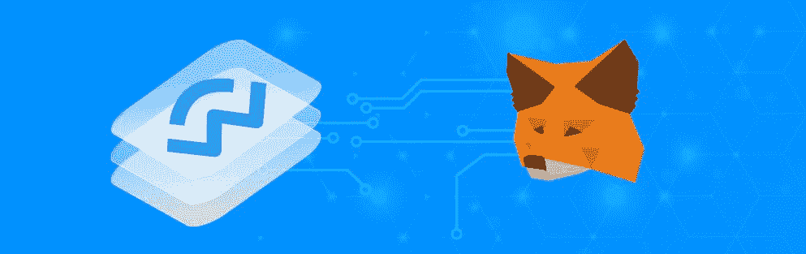

#### 从元掩码过渡到 WalletConnect

从 Moralis 的默认 Web3 身份验证方法转而使用 WalletConnect 非常容易实现。只需在“Moralis.authenticate()”和“Moralis.enableWeb3()”方法中添加“*{ provider:' wallet connect ' }*”作为参数。因此，这就是我们调整后的“authenticate()”函数的样子:

```js
async function authenticate() {
  try {
    user = await Moralis.authenticate({ provider: ‘walletconnect’});
    web3 = await Moralis.enableWeb3({ provider: ‘walletconnect’});
  } catch (error) {
    console.log('authenticate failed', error);
  }
  renderApp();
}
```

此外，我们还必须在“enableWeb3()”函数中添加相同的参数:

```js
async function enableWeb3() {
  try {
    web3 = await Moralis.enableWeb3({ provider: ‘walletconnect’});
  } catch (error) {
    console.log('testCall failed', error);
  }
  renderApp();
}
```

此外，正如你在 GitHub 上看到的，如果我们定义一个新的常量，我们可以使代码更整洁:

```js
const provider = 'walletconnect';
```

然后，我们可以使用“{provider}”而不是“{provider: 'walletconnect'}”作为上述方法中的参数。

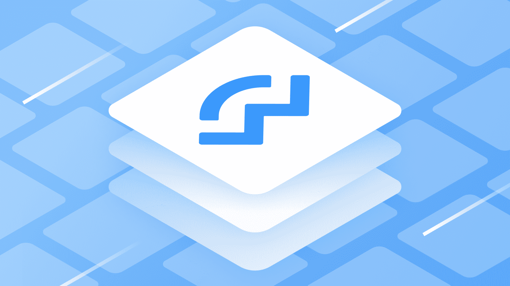

### Web3 连接钱包按钮以提示 Wallet Connect–演示

现在，我们已经通过简单地向某些方法添加适当的参数调整了我们的代码，我们准备对我们的示例 dapp 做另一个演示。由于 WalletConnect 使我们能够通过扫描二维码登录，我们还会查看手机屏幕。所以，这就是我们的出发点:

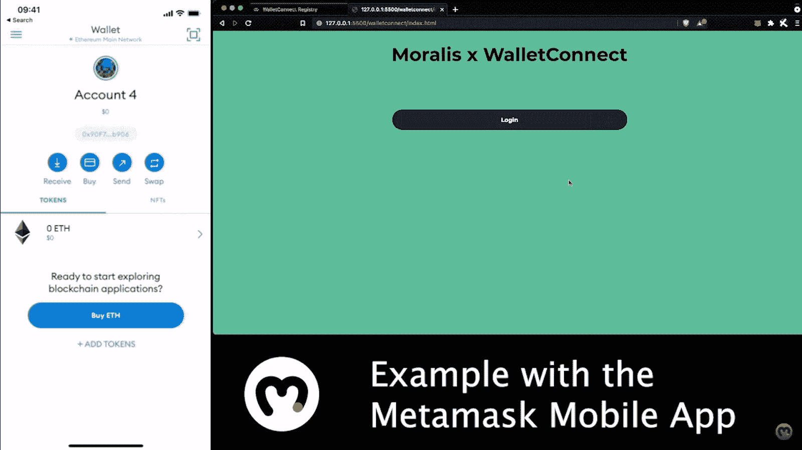

上图清楚地显示了一个示例用户的 MetaMask 移动应用程序在左边，我们的示例 dapp 在右边。

*注意:在这个演示中，我们(作为示例用户)使用我们的 MetaMask 移动应用程序。MetaMask 只是 WalletConnect 支持的数百种不同移动加密钱包中的一种。这是我们碰巧使用的一个。*

接下来，我们需要点击示例 dapp 的 Web3 connect wallet 按钮:

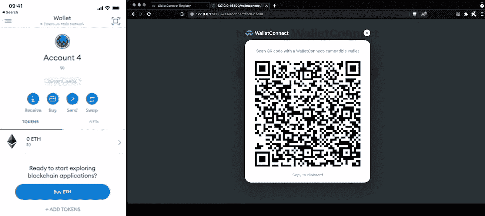

点击“登录”按钮后，弹出一个二维码模态。因此，为了让用户登录，他们需要用他们的一个移动钱包扫码。在 MetaMask 移动应用程序中，有一个“扫描”图标可以做到这一点(其他钱包应用程序使用类似的图标):

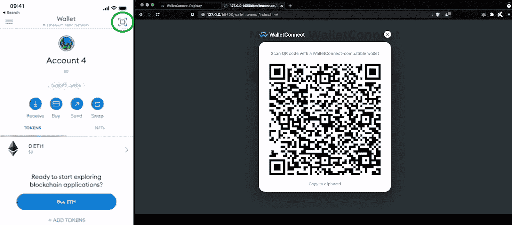

接下来，用户需要将手机摄像头对准屏幕，扫描我们示例中 dapp 的二维码:


扫描代码后，用户的移动钱包应用程序上会出现一条弹出消息:

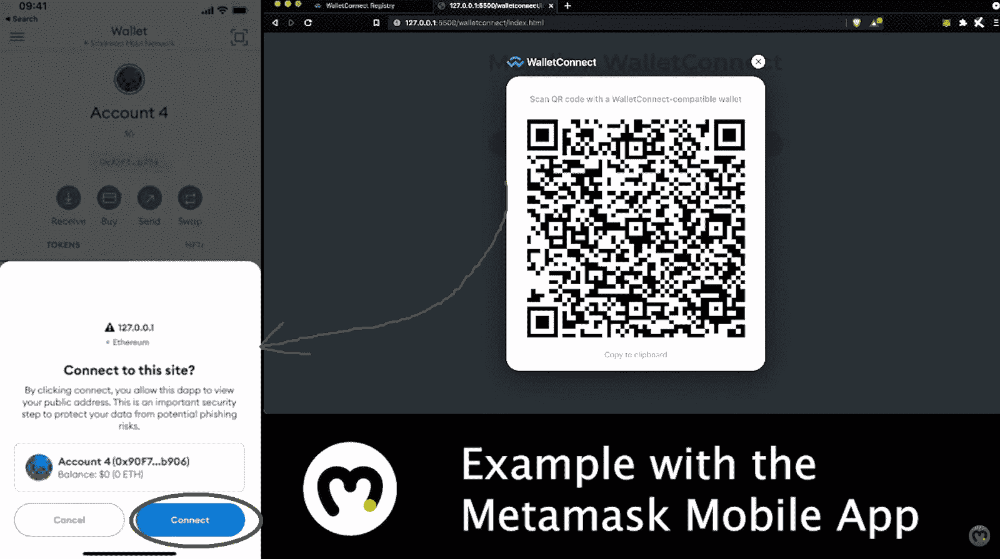

要连接，用户需要点击“连接”按钮。接下来，用户还需要签署“Moralis 认证”消息以完成认证过程:

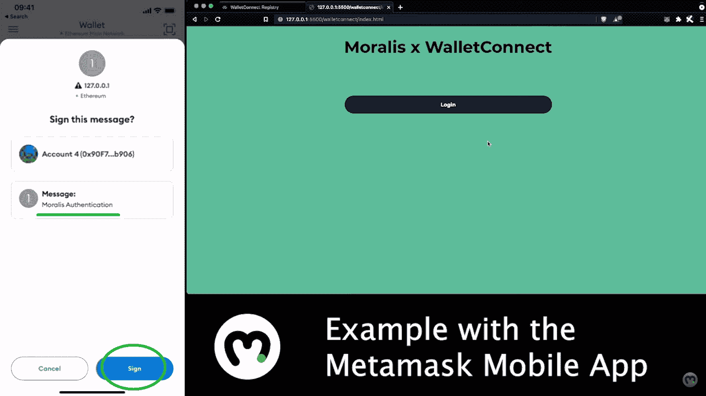

一旦用户签署了上面的消息，他们将进入我们的示例 dapp。因此，就像使用元掩码身份验证的情况一样，他们会收到我们的欢迎消息。他们还有“注销”和“测试签名呼叫”选项:

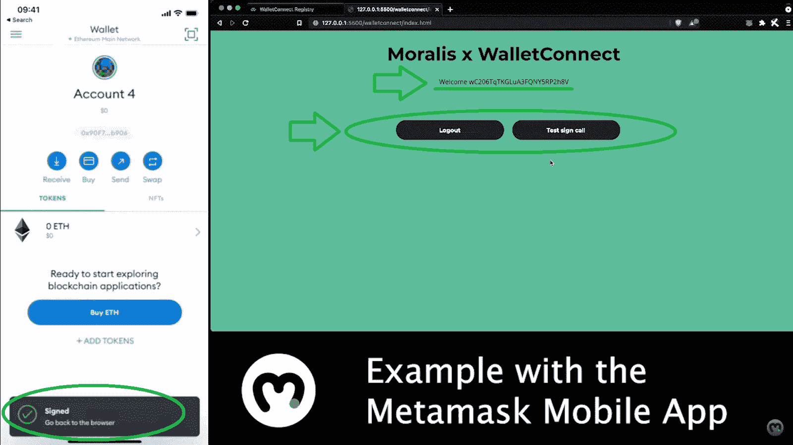

#### 使用 WalletConnect 测试交易–演示

就像我们在使用元掩码进行身份验证的情况下所做的那样，现在让我们执行我们的示例 dapp 的测试事务。因此，让我们单击“测试签名呼叫”按钮。因为我们已经使用我们的移动钱包应用程序登录，所以我们不需要再次扫描二维码。相反，我们只需点击手机上的“签名”按钮，即可在“Hello world”信息上签名:

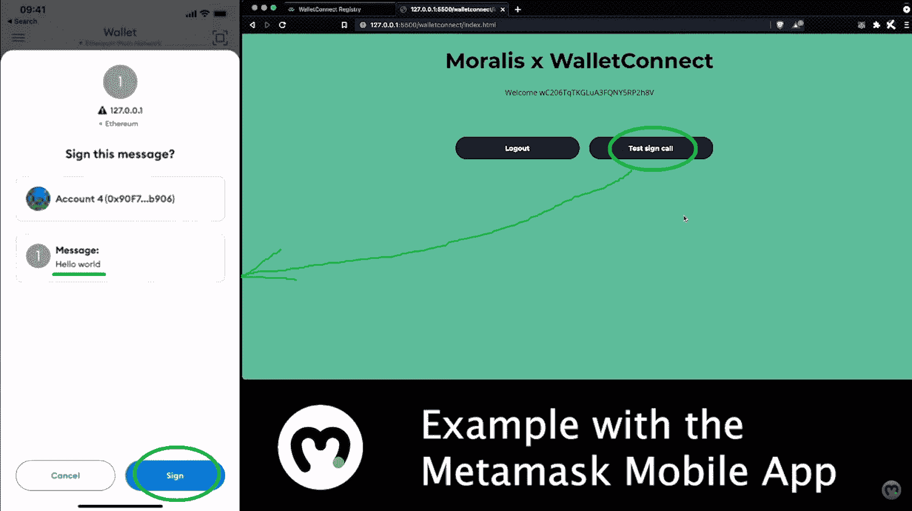

因此，在我们的示例 dapp 中，我们会收到一个确认响应:

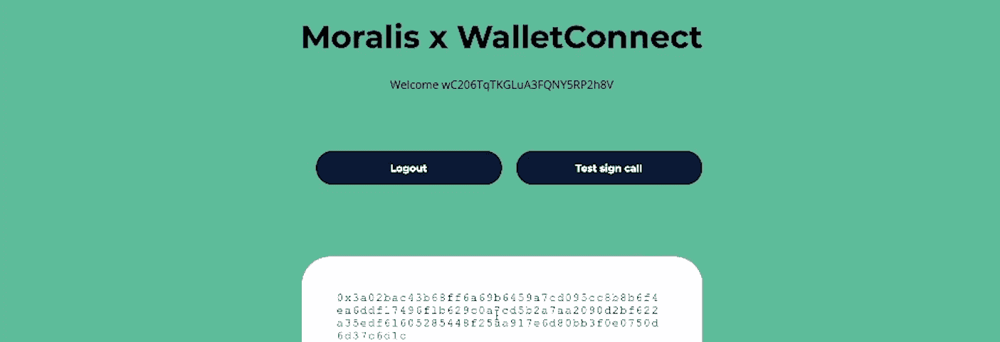

对于那些喜欢视频教程的人来说，这里有一个上述演示和代码演练的剪辑:

https://www.youtube.com/watch?v=3Ij6wp0fuXw

#### 初始 Moralis 设置

当您想要使用 Moralis 创建 dapps 或 [Unity Web3](https://moralis.io/unity-web3-beginners-guide-to-unity-web3-programming/) 游戏时，您需要完成以下步骤:

1.  **登录您的 Moralis 账户**–使用[链接登录您的 Moralis 账户](https://admin.moralis.io/login)。另一方面，如果你还没有创建你的 Moralis 账户，现在就创建吧。你可以使用本文开头提到的“创建你的免费 Moralis 账户”链接。


2.  **创建 Moralis 服务器**–在您的 Moralis 管理区，您需要点击“+ [创建新服务器](https://docs.moralis.io/moralis-dapp/getting-started/create-a-moralis-dapp#2.-create-a-moralis-server)”。如果这是您第一次使用 Moralis，页面上的教程将指导您:


如下图所示，您需要选择合适的网络类型。因为我们的示例 dapp 只关注“签名”事务，所以您可以使用“Mainnet 服务器”。


要启动您的服务器，您需要命名它，选择您所在的地区、网络类型、链，然后单击“添加实例”:


3.  **获取您服务器的详细信息**–服务器启动并运行后，您可以通过点击“查看详细信息”按钮来访问其详细信息:


上述按钮将打开一个包含详细信息的新窗口。因此，使用右侧的复制图标来复制服务器的 URL 和应用程序 ID:


4.  **填充“script.js”文件***–*填充“script.js”文件的前两行:

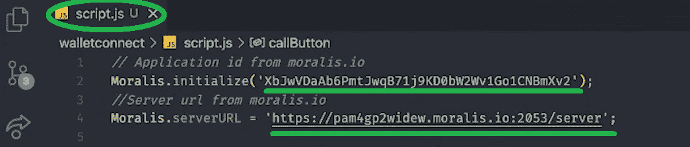

## 如何将 Web3 Connect Wallet 按钮添加到您的网站–摘要

在这篇文章中，我们已经走了相当长的一段路。我们完成了一个示例项目，其中我们创建了一个 Web3 连接钱包按钮。最初，我们利用该按钮来启动元掩码身份验证过程。后者也是使用 Moralis 时的默认选项。然而，在第二幅图中，我们使用了 WalletConnect。从第一个例子到第二个例子的过渡毫不费力。我们只需要在“Moralis.authenticate()”和“Moralis.enableWeb3()”方法中添加正确的参数。尽管如此，在这个过程中，你也学会了如何通过四个简单的步骤来完成最初的 Moralis 规范。因此，您现在已经准备好接受其他的示例项目了。你可以在 Moralis 博客和 T2 的 YouTube 频道上找到这些。

如果您喜欢更深入地研究 Web3 认证，我们建议您探索不带元掩码的 [Web3。接下来，您将学习如何通过电子邮件](https://moralis.io/web3-without-metamask-web3-authentication-alternatives/)进行 [Web3 认证，以及如何实现](https://moralis.io/how-to-do-web3-authentication-via-email/) [Web3 社交登录](https://moralis.io/web3-social-login-sign-in-dapp-users-with-google-email-or-twitter/)。因此，你将能够提高 [Web3 用户加入](https://moralis.io/how-to-boost-web3-user-onboarding-success-rates/)的成功率。然而，这两个出口涵盖了许多其他主题。例如，一些最新的文章包括如何[构建一个玩赚游戏](https://moralis.io/how-to-build-a-play-to-earn-p2e-game/)、 [Mumbai testnet 水龙头](https://moralis.io/mumbai-testnet-faucet-how-to-get-free-testnet-matic-tokens/)、创建[一个币安 NFT](https://moralis.io/how-to-create-a-binance-nft-in-5-steps/) 、如何[申请一个游戏内 NFT](https://moralis.io/how-to-claim-an-in-game-nft-full-guide/) 的完整指南、什么是[以太坊名称服务](https://moralis.io/what-is-ethereum-name-service-full-ens-guide/) (ENS)、什么是 [Web3 合同](https://moralis.io/what-are-web3-contracts-exploring-smart-contracts/)等等。

如果你想成为一名区块链开发者，并马上成为全职加密员，你可能会考虑报名参加 T2 Moralis 学院。这将让你有机会进入一流的[区块链发展课程](https://academy.moralis.io/all-courses)。您还将获得个性化的学习路径、专家指导，并成为进步和支持社区的一部分。