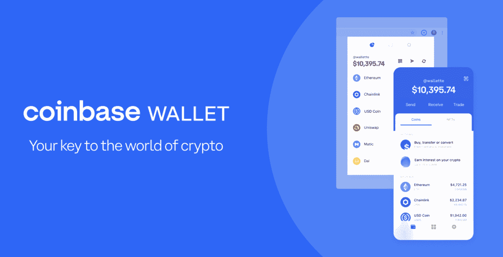
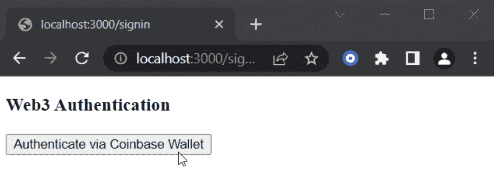
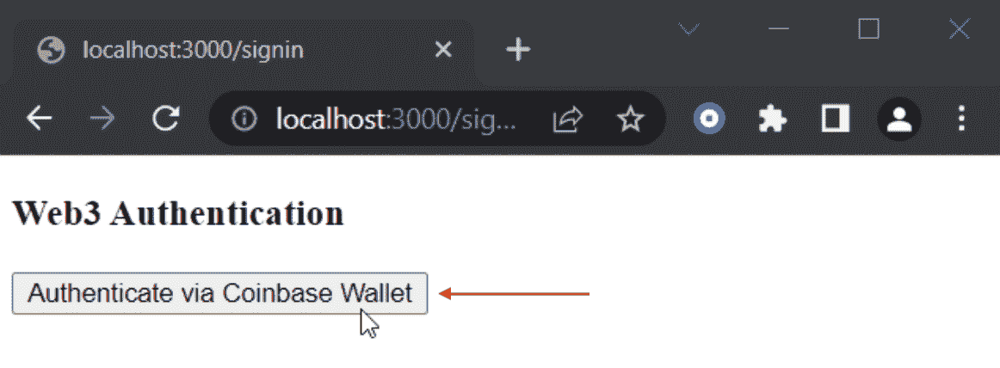
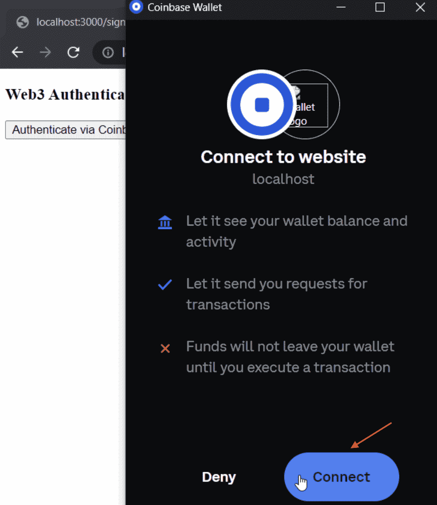
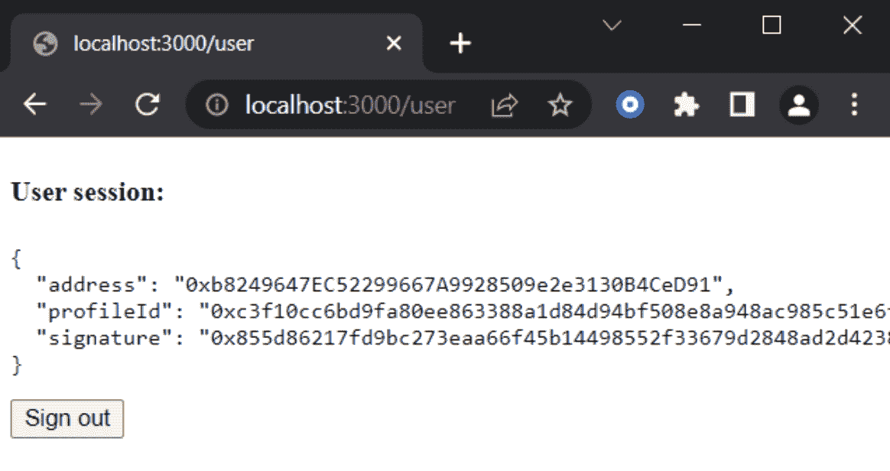

# 如何添加比特币基地钱包登录功能

> 原文：<https://moralis.io/how-to-add-coinbase-wallet-login-functionality/>

本文将深入探讨 Web3 身份验证，更具体地说，是如何添加比特币基地钱包登录功能。为此，我们将创建一个简单的身份验证应用程序，允许用户登录、签署消息和查看用户信息。如果你想跳过教程直接进入代码，你可以访问下面的 GitHub 库:

**完整的认证申请文档—**[https://github . com/moralisweb 3/demo-apps/tree/main/nextjs _ moralis _ auth](https://github.com/MoralisWeb3/demo-apps/tree/main/nextjs_moralis_auth)

如果你仔细观察 GitHub repo，你会很快注意到它与 MetaMask 有关。因此，您必须调整代码并添加比特币基地钱包作为提供商。如果您需要这方面的帮助，请跟随我们探索如何轻松添加比特币基地钱包登录功能。

统一的标识层是 Web3 的一个优秀特性，因为它允许用户通过他们的 [Web3 钱包](https://moralis.io/what-is-a-web3-wallet-web3-wallets-explained/)与分散的应用程序和其他令人兴奋的 Web3 项目进行交互。因此，为了创造引人注目的用户体验，允许用户在使用你的应用程序时验证他们的 [Web3 身份](https://moralis.io/web3-identity-the-full-guide-to-authentication-identity-and-web3/)是至关重要的。一个突出的例子是比特币基地钱包，这是我们在这篇文章中要关注的地方。更具体地说，我们将说明如何使用 [Moralis](https://moralis.io/) 为所有应用添加比特币基地钱包登录功能！

Web3 认证只是 Moralis 大放异彩的领域之一。如果你努力成为一名区块链开发者，你也会从 Moralis 教育中获益匪浅。因此，请务必立即在 Moralis 创建一个帐户。这样做只需要几秒钟，你可以完全免费开始！此外，如果你想创建 dapps，你可以额外使用 Moralis 轻松实现 [Web3 syncs](https://moralis.io/syncs/) 和 [Web3 webhooks](https://moralis.io/web3-webhooks-the-ultimate-guide-to-blockchain-webhooks/) 。此外，这些只是一些工具和功能，以一种可访问的方式帮助弥合 Web2 和 Web3 之间的差距！

## 什么是比特币基地钱包？

在向您展示如何将比特币基地钱包登录功能添加到您的 dapps 之前，我们需要了解一下比特币基地钱包。因此，我们将采取这一初步部分来探索错综复杂的比特币基地钱包。所以，事不宜迟，让我们来回答这个问题，“什么是比特币基地钱包？”。



比特币基地钱包是一种多资产加密货币钱包。此外，该钱包提供了一种非托管服务，与集中式加密货币交易所比特币基地形成互补。此外，比特币基地钱包是市场上最重要的 Web3 钱包之一，支持成千上万的代币，是 dapps 整个生态系统的门户。除了允许您存储资产，比特币基地钱包还提供许多附加功能。此外，这还包括一个出售、购买和交易加密货币和 NFT 的一体化场所。此外，由于钱包是通往 Web3 领域的门户，用户有可能参与“玩到赚”的游戏应用程序，为 DAO 活动投票，在资产上赚取 APY 等。，全部通过比特币基地的钱包。

由于比特币基地钱包提供完整的自我保管服务，用户可以完全控制并随时无限制地访问他们的所有资产。此外，比特币基地钱包提供了一个直观的用户界面(UI)来处理资产并与 Web3 dapps 和服务进行交互。因此，这款钱包对于行业新人来说是一款非常有用的入门工具。

比特币基地钱包兼容以太坊和其他几个 [EVM](https://moralis.io/evm-explained-what-is-ethereum-virtual-machine/) 兼容的链如 BNB 链、多边形、雪崩等。此外，您还可以通过多种设备与一个比特币基地钱包账户进行互动。此外，你可以在 iOS 和 Android 智能手机上下载钱包作为浏览器扩展或移动 dapp 并与之交互。

随着对比特币基地钱包的更好理解，我们可以继续说明如何使用 Moralis 添加比特币基地钱包登录功能！

## 如何使用 Moralis 添加比特币基地钱包登录功能

在本教程中，我们将仔细研究 Moralis 的 [Web3 认证](https://moralis.io/authentication/)是如何工作的。为了演示使用 Moralis 的 Auth API 添加比特币基地钱包登录功能是多么容易，我们将在 Next.js 应用程序中添加安全认证。在此过程中，我们将带领您使用著名的 Next.js 框架创建一个全栈 Web3 身份验证应用程序。

我们正在寻找创建的应用程序将允许用户使用比特币基地钱包登录。在 wallet 身份验证过程之后，下一个身份验证库负责创建包含加密 JWT (JWE)的会话 cookie。这将包括用户浏览器中的会话信息，如地址、到期时间和签名消息。此外，这是在没有数据库的情况下存储用户信息的有效方式。此外，在 JWT，没有钥匙是不可能访问或更改这些数据的。一旦用户通过身份验证，他们就可以访问显示其用户信息的页面。

为了说明我们的目标，我们将在此提供展示不同页面的截图:

**登录页面:**



**用户会话页面:**


然而，在我们继续本教程之前，您需要考虑一些先决条件。首先，你需要一个 Moralis 账户。创建一个 Moralis 账户只需要点击几下，而且完全免费。手头有了一个账户，就需要安装一个 IDE 或者集成开发环境。在这种情况下，我们将使用 Visual Studio 代码(VSC)。最后，您还需要一个 Next.js 应用程序。此外，如果你想在这方面得到更多的帮助，你可以使用“ [create-next-app](https://nextjs.org/docs/api-reference/create-next-app) 创建应用程序，或者仔细看看 [Next.js dapp](https://moralis.readme.io/docs/nextjs-dapp) 教程！

完成所有先决条件后，我们可以进一步了解如何将比特币基地钱包登录功能添加到您的应用程序中。

## 添加比特币基地钱包登录功能–依赖项、库和环境变量

如果您还没有，那么您需要做的第一件事就是安装一些依赖项。因此，您可以继续安装 Moralis、next-auth 和 axios。您可以通过以下命令实现这一点:

```js
npm install moralis next-auth axios
```

要添加比特币基地钱包登录功能，您还必须使用 Web3 库。对于这个简短的教程，我们将使用 Wagmi。因此，您需要安装一个 Wagmi 依赖项，这可以通过下面的代码片段来实现:

```js
npm install wagmi ethers
```

此外，前面的两个命令都是使用 npm 安装的；但是，您在这里还有其他选择。例如，您也可以同时使用*纱线*和 *pnpm* 。有关这方面的更多信息，请查看关于如何使用 MetaMask 登录[的文档。](https://docs.moralis.io/docs/sign-in-with-metamask)

最后，您还需要将环境变量添加到应用程序根目录下的“. env.local”文件中:

```js
APP_DOMAIN=amazing.finance
MORALIS_API_KEY=xxxx
NEXTAUTH_URL=http://localhost:3000
NEXTAUTH_SECRET=7197b3e8dbee5ea6274cab37245eec212
```

snipper 中的“ *NEXTAUTH_URL* ”变量被设置为“ *http://localhost:3000* ”。这应该等于你的 app 地址；然而，您可以在开发阶段保持原样。

另外，“ *NEXTAUTH_SECRET* 变量可以设置为任意值，用于加密用户的 JWT 令牌。如果您愿意，可以使用以下链接生成一个值:

[https://generate-secret.now.sh/32](https://generate-secret.now.sh/32)

### 用 SessionProvider/WagmiConfig 和请求消息端点包装应用程序

现在，您需要创建一个新的“pages/_app.jsx”文件。接下来，您还必须用“ *SessionProvider* ”和“ *WagmiConfig* ”来包装您的页面。这样做之后，在您的应用程序中应该是这样的:

```js
import { createClient, configureChains, defaultChains, WagmiConfig } from 'wagmi';
import { publicProvider } from 'wagmi/providers/public';
import { SessionProvider } from 'next-auth/react';

const { provider, webSocketProvider } = configureChains(defaultChains, [publicProvider()]);

const client = createClient({
  provider,
  webSocketProvider,
  autoConnect: true,
});

function MyApp({ Component, pageProps }) {
  return (
    <WagmiConfig client={client}>
      <SessionProvider session={pageProps.session} refetchInterval={0}>
        <Component {...pageProps} />
      </SessionProvider>
    </WagmiConfig>
  );
}

export default MyApp;
```

一旦你用“ *SessionProvider* 和“ *WagmiConfig* ”完成了对应用的包装，你就可以继续创建一个新的 API 文件“pages/API/auth/request-message . js”。然后，您利用这个端点向“ *Moralis”发送请求。Auth* ”。这将生成唯一的消息，这些消息稍后将在客户端进行签名。此外，它在您的存储库中应该是这样的:

```js
import Moralis from 'moralis';

const config = {
    domain: process.env.APP_DOMAIN,
    statement: 'Please sign this message to confirm your identity.',
    uri: process.env.NEXTAUTH_URL,
    timeout: 60,
};

export default async function handler(req, res) {
    const { address, chain, network } = req.body;

    await Moralis.start({ apiKey: process.env.MORALIS_API_KEY });

    try {
        const message = await Moralis.Auth.requestMessage({
            address,
            chain,
            network,
            ...config,
        });

        res.status(200).json(message);
    } catch (error) {
        res.status(400).json({ error });
        console.error(error);
    }
}
```

### 设置登录页面和 NextAuth 配置

现在我们已经看了包装部分，我们可以继续下一步。因此，在本节中，您将创建一个登录页面。因此，您可以继续创建一个名为“signin.jsx”的新页面文件，这是登录页面的完整代码:

```js
import { CoinbaseWalletConnector } from 'wagmi/connectors/coinbaseWallet'
import { signIn } from 'next-auth/react'
import { useAccount, useConnect, useSignMessage, useDisconnect } from 'wagmi'
import { useRouter } from 'next/router'
import axios from 'axios'

function SignIn() {
  const { connectAsync } = useConnect()
  const { disconnectAsync } = useDisconnect()
  const { isConnected } = useAccount()
  const { signMessageAsync } = useSignMessage()
  const { push } = useRouter()

  const handleAuth = async () => {
    if (isConnected) {
      await disconnectAsync()
    }

    const { account, chain } = await connectAsync({
      connector: new CoinbaseWalletConnector({
        options: {
          appName: 'youramazing.finance',
        },
      }),
    })

    const userData = { address: account, chain: chain.id, network: 'evm' }

    const { data } = await axios.post('/api/auth/request-message', userData, {
      headers: {
        'content-type': 'application/json',
      },
    })

    const message = data.message

    const signature = await signMessageAsync({ message })

    // redirect user after success authentication to '/user' page
    const { url } = await signIn('credentials', {
      message,
      signature,
      redirect: false,
      callbackUrl: '/user',
    })
    /**
     * instead of using signIn(..., redirect: "/user")
     * we get the url from callback and push it to the router to avoid page refreshing
     */
    push(url)
  }

  return (
    <div>
      <h3>Web3 Authentication</h3>
      <button onClick={() => handleAuth()}>Authenticate via Coinbase Wallet</button>
    </div>
  )
}

export default SignIn
```

在上面的代码中，我们确保扩展了" *handleAuth* "功能来调用我们在前面的步骤中创建的"*请求-消息*"端点。此外，我们确保添加了一个“*next auth”*配置，这也是我们将要创建的。相应地，您可以创建另一个 API 文件，“pages/api/auth/[…nextauth]。js”。此外，它还应包含以下内容:

```js
import CredentialsProvider from 'next-auth/providers/credentials';
import NextAuth from 'next-auth';
import Moralis from 'moralis';

export default NextAuth({
    providers: [
        CredentialsProvider({
            name: 'MoralisAuth',
            credentials: {
                message: {
                    label: 'Message',
                    type: 'text',
                    placeholder: '0x0',
                },
                signature: {
                    label: 'Signature',
                    type: 'text',
                    placeholder: '0x0',
                },
            },
              async authorize(credentials) {
                try {
                  // "message" and "signature" are needed for authorisation
                  // we described them in "credentials" above
                  const { message, signature } = credentials;

                  await Moralis.start({ apiKey: process.env.MORALIS_API_KEY });

                  const { address, profileId } = (
                    await Moralis.Auth.verify({ message, signature, network: 'evm' })
                  ).raw;

                  const user = { address, profileId, signature };
                  // returning the user object and creating  a session
                  return user;
                } catch (e) {
                  console.error(e);
                  return null;
                }
              },
        }),
    ],
    // adding user info to the user session object
    callbacks: {
        async jwt({ token, user }) {
            user && (token.user = user);
            return token;
        },
        async session({ session, token }) {
            session.user = token.user;
            return session;
        },
    },
});
```

### 创建用户页面

最后，本教程的最后一步是创建一个用户页面。因此，我们将创建一个名为“users.jsx”的新页面，该文件应该如下所示:

```js
import { getSession, signOut } from 'next-auth/react';

// gets a prop from getServerSideProps
function User({ user }) {
    return (
        <div>
            <h4>User session:</h4>
            <pre>{JSON.stringify(user, null, 2)}</pre>
            <button onClick={() => signOut({ redirect: '/signin' })}>Sign out</button>
        </div>
    );
}

export async function getServerSideProps(context) {
    const session = await getSession(context);

    // redirect if not authenticated
    if (!session) {
        return {
            redirect: {
                destination: '/signin',
                permanent: false,
            },
        };
    }

    return {
        props: { user: session.user },
    };
}

export default User;
```

这就是这个简短的教程。此时，您应该知道如何将比特币基地钱包登录功能添加到您未来的所有应用程序中。然而，我们还需要确保应用程序按预期工作。因此，在接下来的部分中，我们将进一步研究如何测试这个简单的应用程序。

## 添加比特币基地钱包登录功能-测试应用程序

我们必须做的最后一件事是确保应用程序按预期工作。因此，为了测试这个应用程序，您可以访问“[http://localhost:3000/sign in](http://localhost:3000/signin)”页面。

应用程序启动后，您可以点击页面上的“使用比特币基地钱包验证”按钮:



这应该会提示您的比特币基地钱包，并要求您连接。因此，您只需按下“连接”按钮:



接下来，您需要签署邮件。一旦您对消息进行签名并成功通过身份验证，您应该会被重定向到“/user”页面，该页面看起来如下所示:



通过查看上面的图像，用户会话包括一个地址、配置文件 ID 和签名。更重要的是，还有退出的选项。也可以直接访问“[http://localhost:3000/user](http://localhost:3000/user)”，确保没有 bug。此外，如果用户被认证，它应该显示用户的信息；如果没有，这应该会将我们转到“/登录”页面。此外，如果您收到这些结果，应用程序会正常工作。因此，您现在已经成功地将比特币基地钱包登录功能添加到您的应用程序中。因此，您现在可以将比特币基地钱包登录功能添加到所有未来的区块链项目中！

如果您遇到任何困难或问题，请查看完整的 GitHub 库并详细检查代码。此外，您可以查看官方文档，了解如何使用比特币基地钱包登录的更多信息。此外，如果你想为其他钱包选择添加相同的功能，请查看官方的[认证文件](https://docs.moralis.io/docs/web3-authentication)。在那里，您可以找到关于添加对 MetaMask、WalletConnect、RainbowKit 等的支持的更多信息。

## 添加比特币基地钱包登录功能-摘要

Web3 认证允许用户使用他们的加密钱包登录并访问 dapps 的扩展生态系统，这在 [Web3 开发](https://moralis.io/how-to-build-decentralized-apps-dapps-quickly-and-easily/)领域至关重要。此外，作为一种基本机制，我们决定将这篇文章专门用于探索 Web3 身份验证。因此，我们借此机会向您展示如何将比特币基地钱包登录功能添加到您的应用程序中。

为此，我们创建了一个简单的 Next.js 应用程序，允许用户使用他们的 Web3 钱包进行登录和身份验证。登录后，他们可以查看自己的信息，如地址、个人资料 ID 和签名。此外，由于 Moralis 的 Auth API，我们能够轻松实现这一功能。因此，如果您按照本教程进行操作，您现在有希望将比特币基地钱包登录功能添加到您未来的所有区块链项目中。

然而，Moralis 的 Auth API 只是您可以探索的众多 Moralis APIs 之一。因此，如果你是一名 Web3 开发者，或者想成为一名开发者，一定要看看 [NFT API](https://moralis.io/nft-api/) 和 [EVM API](https://docs.moralis.io/reference/evm-api-overview) 。这些工具使得 dapp 和 NFT 的开发变得更加容易。

此外，如果你对最新最相关的区块链内容感兴趣，可以看看 Moralis 的 [Web3 博客](https://moralis.io/blog/)。例如，我们推荐查看我们关于[区块链同步](https://moralis.io/blockchain-syncs-exploring-on-chain-syncing/)、 [NodeJS SDK for Web3](https://moralis.io/nodejs-sdk-for-web3-exploring-moralis-nodejs-sdk/) 或如何[从多边形区块链](https://moralis.io/how-to-pull-data-from-polygon-blockchain/)提取数据的文章。


此外，如果你想更加精通 Web3 开发，一定要报名参加[Moralis 学院](https://academy.moralis.io/)。Moralis 学院为初学者和更有经验的开发者提供了大量的[区块链课程](https://academy.moralis.io/all-courses)。

尽管如此，如果你想了解更多关于区块链开发的知识，并成为一名 Web3 开发者，请注册 Moralis 。创建帐户是免费的，你可以在几秒钟内完成！