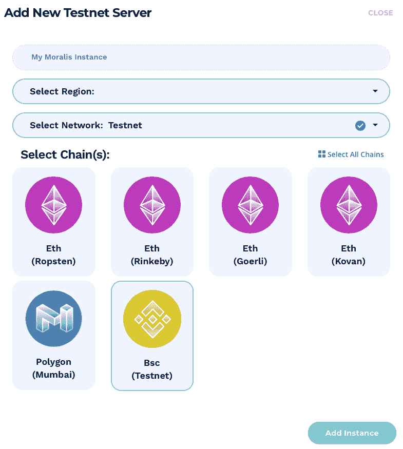
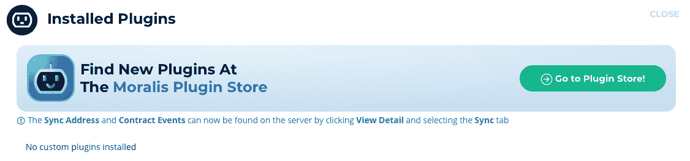
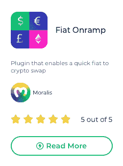
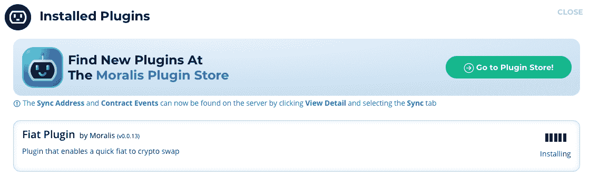
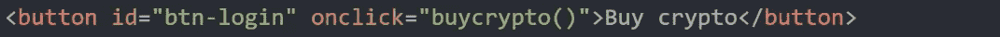
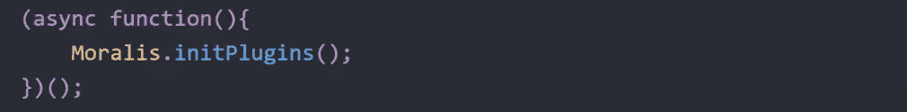
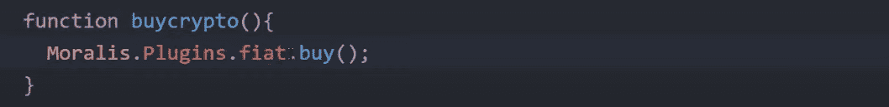

# 如何将菲亚特网关添加到 dApps

> 原文：<https://moralis.io/how-to-add-fiat-gateway-to-dapps/>

**在与大多数**[**【dapp(去中心化应用)**](https://moralis.io/decentralized-applications-explained-what-are-dapps/) **交互时，手头一般都需要有加密货币。dApps 运行在以太坊，多边形，或者其他任何区块链上都无所谓；用户仍然需要代币来支付必要的汽油费。因此，让用户能够直接通过 dApps 本身购买加密货币是有意义的。这提供了更优越的客户体验，这在竞争激烈的市场中非常有益。为此，我们将在本文中向您展示如何使用**[**Moralis**](https://moralis.io/)**平台向您的 dApps 添加菲亚特网关。**

Moralis 是 Web3 开发的最佳中间件，该平台提供了开发和部署 dApps 所需的一切。例如， [Moralis Speedy Nodes](https://moralis.io/speedy-nodes/) 是一项服务，允许其用户访问市场上最快、最可靠的节点，用于 dApp 开发。此外，该平台还消除了 Web3 开发中最紧迫的问题，即后端基础设施的设置。Moralis 负责所有繁重的工作，并为用户提供已经开发和管理的后端。因此，Moralis 用户可以专注于构建最好的前端，[创建最高标准的智能合同](https://moralis.io/how-to-create-smart-contracts/)。

所以，如果你想要一个快速、简单、可靠的方法来节省资源并缩短你的市场之路，那么马上和 Moralis 签约吧。您可以免费加入该平台，它将让您访问该平台的所有功能和工具！

### 什么是加密到菲亚特网关？

加密到法定或法定到加密网关本质上是一种将一种货币兑换成另一种货币的工具。因此，可以利用这些网关快速将法币兑换成加密货币，反之亦然。在本文中，我们将使用名为" [Fiat Onramp](https://moralis.io/plugins/fiat/) "的 Moralis 插件作为设置网关的示例。

在一个快速增长的市场中，新的 dApps 不断涌现，保持竞争优势非常重要。不仅要有最吸引人的用户界面，dApps 的功能更为重要。为我们的 dApps 用户提供网关访问意味着他们可以使用他们的法定货币立即轻松地购买加密，使他们能够与我们的 dApps 进行交互。

在这种情况下，主要的好处是网关提供了更方便的用户体验。这不一定是竞争优势，而是保持市场相关性的必要条件。如果没有加密到法定货币的网关，用户将需要离开 dApp，找到一个能够为法定货币购买加密的平台，然后回来使用 dApp。这只是另一个不必要的和耗时的努力，大多数消费者都想避免。

因此，在 dApps 中实现一个菲亚特网关可能是一项非常重要的任务，以实现最佳的用户体验。此外，当使用 Moralis 这样的平台时，如何将菲亚特网关添加到 dApps 的过程变得相对容易。事实上，作为一个平台用户，用一行代码就可以添加网关，我们将在接下来的小节中向您展示如何添加网关！

# 如何轻松将菲亚特网关添加到您的 dApps 中

我们从上一节了解到，菲亚特网关允许用户通过我们的 dApps 直接购买和出售密码。因此，网关为我们的用户提供了更方便的体验。出于这个原因，增加一个菲亚特网关变得至关重要，以保持在快速增长的市场。然而，即使有如此重要的功能，许多开发人员仍然不知道如何将菲亚特网关添加到 dApps 中。

如果没有合适的工具，添加这种功能会是一项非常麻烦的任务。其原因是后端开发和建立复杂数据结构的过程，传统上需要时间和资源。然而，通过 Moralis 提供的适当工具，我们可以避免所有复杂的后端开发，只需专注于构建完美的 UI。该平台为您提供了一个已经开发好的基础设施，这也是我们只需一行代码就可以将菲亚特网关添加到我们的 dApps 中的众多原因之一。

为了展示 Moralis 的强大功能，我们将在接下来的章节中创建一个小型 dApp，在其中添加菲亚特网关的功能。这个过程可以分为三个不同的步骤:

1.  创建一个 Moralis 服务器。
2.  安装 Moralis 插件。
3.  创建 dApp。

遵循本指南将为您提供一个简单明了的解释，告诉您如何为您未来的所有 dApps 添加网关。因此，让我们通过创建我们自己的 Moralis 服务器来开始这个过程。

如果你更想看这个过程的视频教程，那就看看这个来自 YouTube 频道的视频吧:

https://www.youtube.com/watch?v=5MlTnoBm7YQ

## 步骤 1:创建一个 Moralis 服务器

如果你还没有，我们需要做的第一件事就是注册 [Moralis](http://moralis.io/) 。注册是完全免费的，也是为我们的 dApp 创建我们自己的 Moralis 服务器的必要条件。一旦你有了一个帐户，你可以点击 Moralis 管理面板上的“+创建一个新的服务器”按钮开始行动。

单击该按钮后，会出现一个下拉菜单，为您提供三个选项:“Mainnet 服务器”、“Testnet 服务器”和“本地 Devchain 服务器”。对于本教程来说，你选择哪一个替代方案并不重要；但是，我们将选择“Testnet 服务器”。

如果单击任一选项，将会出现一个新窗口，您需要在其中选择服务器名称，选择区域，然后选择您选择的网络。Moralis 的一个特点是平台支持跨链兼容。这意味着您可以选择多个网络。

一旦你选择了你的偏好，剩下的就是简单地点击“添加实例”按钮，这将启动服务器。启动服务器可能需要一点时间，但几分钟后它就会启动并运行。

## 步骤 2:安装 Moralis 插件

现在您已经有了一个运行的服务器，我们可以进入下一步——安装 Moralis 插件。为此，您需要单击有问题的服务器的三个小点，然后单击“插件”按钮。这将为我们提供以下弹出窗口:

如你所见，目前没有安装定制插件。为此，我们想访问 [Moralis 插件商店](https://moralis.io/plugins/)来找到并安装有问题的插件，在本例中是[菲亚特 Onramp](https://moralis.io/plugins/fiat/) 。我们可以通过点击“阅读更多”按钮来安装插件，然后“安装插件”，然后选择合适的服务器来添加插件。

一旦你选择了正确的服务器，你就可以点击“确认”了。那么只剩下一件事了，那就是从他们的官方网站获取一个 Onramper API。你可以简单地在网站上注册，获得你自己的 API 密匙。

有了 API 密匙，您可以使用它来完成将插件添加到服务器的这一步。正如你现在从下图中看到的，插件正在安装，几分钟后就会被添加。

因此，现在在服务器上安装了适当的插件，我们可以继续创建 dApp 本身。

## 步骤 3:创建 dApp

我们要添加到简单 dApp 中的第一个东西是一个按钮。这个按钮将有一个“onclick”事件，该事件将触发函数“buycrypto()”，我们将在后面讨论这个函数。按钮的 HTML 代码如下所示:

添加了按钮后，我们还需要初始化 Moralis。这将我们的代码连接到我们在第一步中创建的 Moralis 服务器。要连接服务器并初始化 Moralis，我们需要在代码中输入以下两行:

如您所见，我们需要来自服务器的应用 ID 和服务器 URL。要获取这些信息，我们需要回到 Moralis 管理面板中的“Servers”选项卡，然后单击相关服务器的“View Details”按钮。所以，从这里开始，你可以直接把这两个元素复制粘贴到代码中。

初始化 Moralis 后，下一步是运行 Moralis“init plugins()”命令。这个命令将通知我们的代码安装了哪些插件，并让我们在开发时可以访问它们。因此，要在我们的代码中实现这一点，我们只需创建一个函数，它可以在一行代码中立即定义并执行命令。这个函数看起来是这样的:

最后，我们还必须向前面提到的“buycrypto()”函数添加一些功能。这里我们只需要在我们自己的函数的花括号中添加 Moralis“plugins . fiat . buy()”函数。因此，代码看起来是这样的:

就是这样；这就是我们将菲亚特网关添加到 dApp 中所需要做的一切！

### dApp 是如何工作的？

为了向您展示 dApp 的功能和外观，我们现在将测试我们新创建的 dApp。因此，一旦我们启动应用程序，所有将显示的是一个按钮，上面写着“购买加密”。在用户点击这个按钮之前，dApp 不会做任何事情。一旦按钮被点击，它将从我们的代码中触发“buycrypto()”函数，该函数将启动网关。因此，您将看到以下窗口:

这使得用户可以直接通过 dApp 买卖加密货币。根据用户的偏好，可以改变加密货币和法定货币。这展示了使用 Moralis 是多么容易，只需一行代码就可以将菲亚特网关添加到任何 dApp 中。如果你想构建类似的 dapp，我们强烈推荐查看以下来自 [Moralis 博客](https://moralis.io/blog/)的指南:[如何创建以太坊 dapp](https://moralis.io/how-to-create-ethereum-dapps/)和[如何构建多边形 dapp](https://moralis.io/how-to-build-polygon-dapps-easily/)。这些指南将为您构建自己的 dApp 提供良好的基础架构，并根据市场上现有的区块链项目为您提供一些灵感。

## 如何将菲亚特网关添加到 dApps–总结

可访问性和可用性是 dApps 和一般业务的两个关键方面。在竞争日益激烈的快速增长的市场中，以客户为中心和提供卓越的用户体验至关重要。因此，为用户提供通过应用程序直接购买和出售加密货币的能力是一个突出的特性。向 dApps 添加 fiat 网关的最简单方法是使用 Moralis。

Moralis 是用于 [Web3 开发](https://moralis.io/how-to-build-decentralized-apps-dapps-quickly-and-easily/)的首要中间件，该平台提供了开发和部署 dApps 所需的一切。利用已经开发的 Moralis 基础设施，只需一行代码就可以添加一个菲亚特网关。我们发表这篇文章是为了通过创建一个简单的带有完全集成网关的 dApp 来展示 Moralis 的强大功能。我们可以通过三个简单的步骤来实现这一点:

1.  创建一个 Moralis 服务器。
2.  安装 Moralis 插件。
3.  创建 dApp。

这个过程只花了我们几分钟。但是，您也可以轻松地对现有项目实现相同的功能。

此外，Moralis 还提供了其他几个有用的开发工具，如 [Moralis NFT API](https://moralis.io/announcing-the-moralis-nft-api/) 、[价格 API](https://moralis.io/introducing-the-moralis-price-api/) ，以及对 [IPFS](https://moralis.io/what-is-ipfs-interplanetary-file-system/) 和[元掩码](https://moralis.io/metamask-explained-what-is-metamask/)的本地支持。结合已经开发的平台基础设施，这些工具确保您作为开发人员可以节省宝贵的时间和资源。

因此，如果您想大大缩短上市时间并获得所有 Moralis 平台的工具，那么[现在就与 Moralis](https://admin.moralis.io/register?utm_source=blog&utm_medium=post&utm_campaign=Want%2520the%2520Latest%2520in%2520%253Cspan%253EBlockchain%2520Development%253F%253C%252Fspan%253E) 签约吧！创建一个帐户是完全免费的，只需要几秒钟。有了账户，你就可以开始开发和扩展你未来所有的区块链项目。