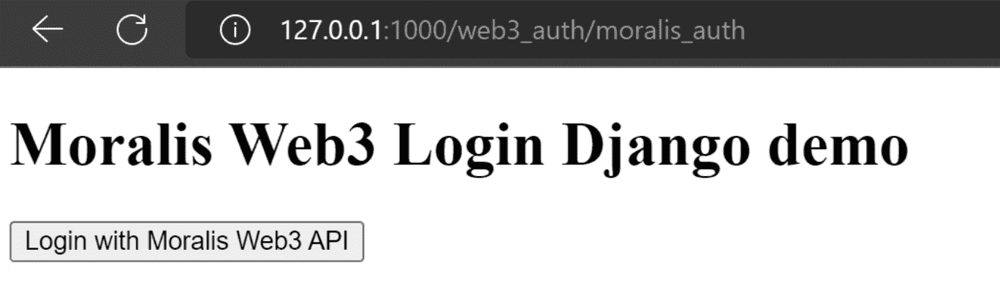
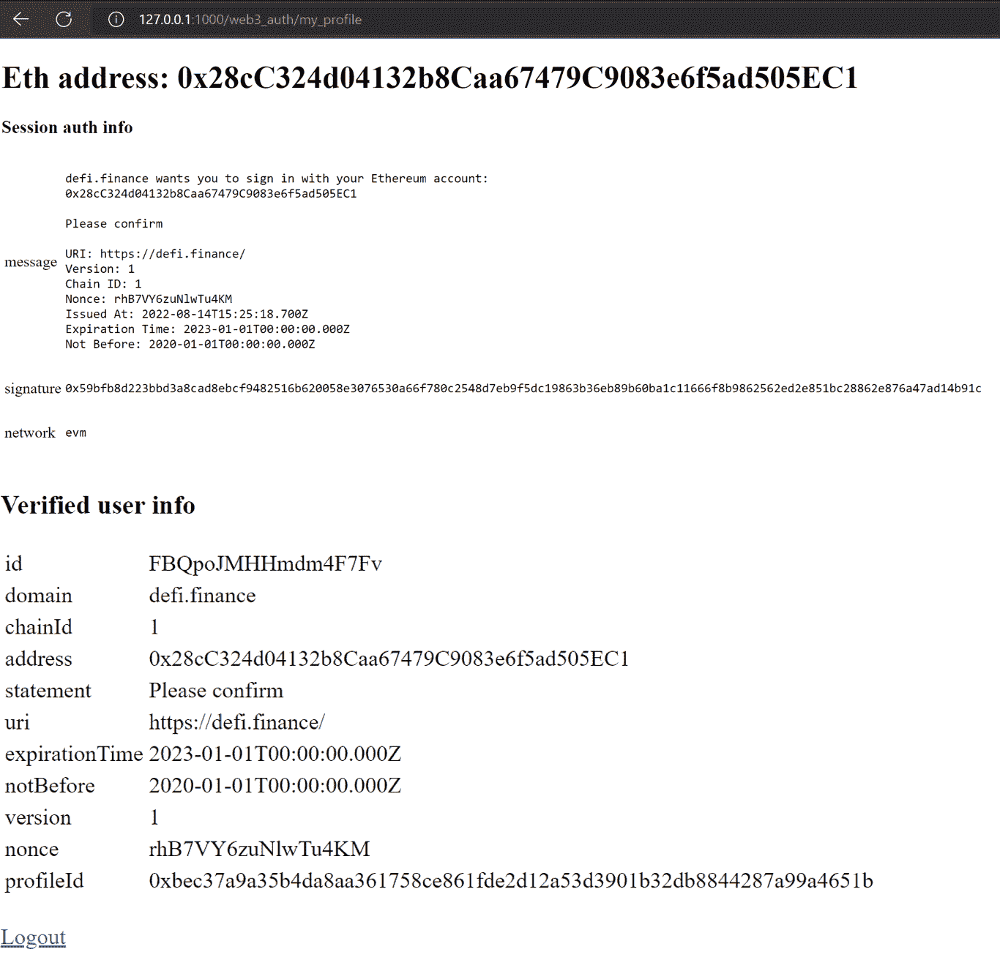
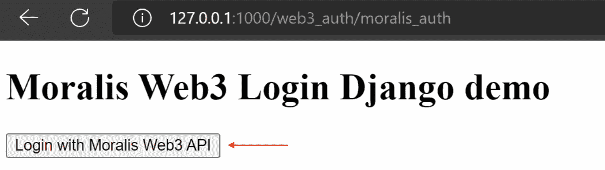
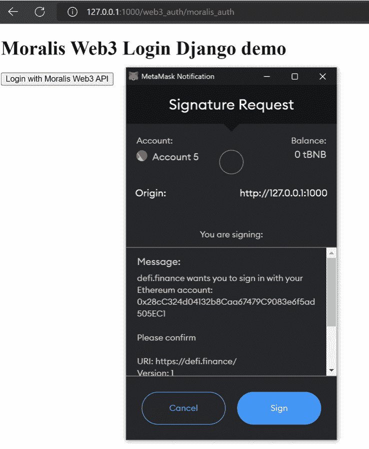

# 如何用 5 个步骤用 Django 添加元掩码认证

> 原文：<https://moralis.io/how-to-add-metamask-authentication-with-django-in-5-steps/>

本文将演示如何使用 Django 添加元掩码认证。此外，我们将只通过五个步骤来探索如何做到这一点。这样，我们将创建一个全栈 Django 应用程序，用户可以使用他们的 Web3 钱包登录并验证自己。如果您不想阅读整个指南，而是直接进入代码，请查看下面的 GitHub repo:

**用 Django 文档完整添加元掩码认证—**[**https://github . com/moralisweb 3/demo-apps/tree/main/Django _ moralis _ auth/web 3 _ auth**](https://github.com/MoralisWeb3/demo-apps/tree/main/django_moralis_auth/web3_auth)

**Web3 认证是分散式 Web 的一个基本机制。此外，允许用户使用他们的 [Web3 钱包](https://moralis.io/what-is-a-web3-wallet-web3-wallets-explained/)进行身份验证使得企业服务更易访问。此外，它还提供了更具吸引力的用户体验。这表明，统一的识别层会同时对企业和消费者产生积极影响。此外，可以实现各种身份验证机制，一个流行的选项是元掩码。因此，由于 Web3 身份验证是 [Web3 开发](https://moralis.io/how-to-build-decentralized-apps-dapps-quickly-and-easily/)的一个重要功能，而 MetaMask 是最流行的 Web3 钱包之一，所以本文将重点讨论这个主题。具体来说，我们将向您展示如何使用 Django 添加元掩码认证！**

**此外，为了实现更加无缝的 Web3 认证流程，我们将使用 Moralis [认证 API](https://docs.moralis.io/reference/auth-api-overview) 。反过来，我们可以创建一个全栈 Django 应用程序，用户只需简单的五个步骤就可以使用 MetaMask 进行身份验证。然而，如果你更喜欢使用 NextJS，看看我们关于如何[集成后端 Web3 认证功能的指南](https://moralis.io/how-to-integrate-backend-web3-authentication-functionality/)！所以，如果你想在未来的项目中加入认证机制，或者只是想让[成为一名区块链开发者](https://moralis.io/how-to-become-a-blockchain-developer/)，现在就注册 Moralis 吧。此外，创建帐户是免费的，您可以立即开始开发您的第一个项目！**

**不过，在继续之前，我们先来复习一些基础知识。因此，我们将从 Django 开始。之后，我们将深入研究代码！**

## **姜戈是什么？**

**在我们继续学习如何用 Django 添加元掩码身份验证的教程之前，探索一下 Django 的复杂性可能是个好主意。因此，我们将利用这一部分来解释 Django 是什么，以及它如何帮助开发人员更快地构建他们的项目。所以，事不宜迟，让我们来回答这个问题，“Django 是什么？”。**

**

简而言之，Django 是 Python 的高级 web 框架。此外，该框架允许开发人员使用简洁实用的设计来构建项目。另外，Django 是由开发人员为开发人员开发的。因此，框架承担了与 web 开发相关的大部分繁重工作。因此，如果您使用框架，您可以专注于编写应用程序。更重要的是，你可以避免重新发明轮子的需要。

此外，Django 是完全免费和开源的，下面是该框架的一些突出特点:

*   **高安全性**–Django 专注于可靠性，帮助开发者在开发网站或应用时保持高水平的安全性。因此，在使用 Django 时，您可以避免一些常见的安全错误。
*   **快速**–由于开发人员希望项目快速进入市场，Django 设计了一个优先考虑速度的框架。
*   **可扩展性**–Django 提供了快速灵活扩展的机会。

对 Django 有了更好的理解，我们就可以进入本文的主题了。因此，我们将用五个步骤来说明如何用 Django 添加元掩码认证！

## 使用 Moralis 通过 5 个步骤添加 Django 的元掩码身份验证

在本教程中，我们将通过创建一个全栈 Django 应用程序来更深入地了解 Moralis [Web3 认证](https://moralis.io/authentication/)的复杂性。此外，应用程序用户将能够使用他们的 Web3 钱包登录，并验证他们的 [Web3 身份](https://moralis.io/web3-identity-the-full-guide-to-authentication-identity-and-web3/)。然后，一旦用户验证了自己，他们就可以查看自己的信息。例如，他们可以看到 ID、地址、链 ID 等。为了说明我们的目标，这里有两个登录和用户页面的打印屏幕:

**登录页面:**



**用户页面**:



如前所述，由于我们选择使用 Moralis，您只需简单的五个步骤就可以使用 Django 添加元掩码认证:

1.  添加先决条件
2.  安装依赖项
3.  创建 Django 项目和应用程序
4.  编辑"*Moralis 认证*"设置
5.  创建主" *web3_auth* "应用程序和模板

所以，事不宜迟，让我们直接进入第一步，看看在开始创建应用程序本身和使用 Django 添加元掩码身份验证之前需要注意的先决条件！

### 步骤 1–添加先决条件

与任何教程一样，都有特定的先决条件。因此，对于本教程，如果您想用 Django 添加元掩码身份验证，首先需要一个 Moralis 帐户。因此，如果你还没有注册，我们建议你立即注册。此外，创建一个帐户是免费的，只需要几秒钟。


此外，有了 Moralis 帐户，第二个先决条件是 Python 3。因此，如果您还没有它，您需要安装 Python 3。在我们的例子中，我们使用 Python 3.10 来说明这个过程。

最后，我们建议你获得关于 Django 的基本知识，以使教程更容易理解。虽然这不是必需的，但是如果您想在本教程中继续学习的话，这样做将会使您受益。因此，你可以在这里查看官方文档来了解更多关于 Django 的信息。

这就是本教程的先决条件和第一步！因此，所有准备工作完成后，我们可以进入指南的第二步，向您展示如何安装必要的依赖项。

### 步骤 2–安装依赖项

如果需要，你需要做的第一件事就是创建一个虚拟环境。然而，为什么会这样呢？简而言之，虚拟环境提供了几个好处，因为它们有自己的站点目录。此外，它们可以与其他系统站点目录隔离开来。此外，这意味着他们可以有自己的一套软件包。此外，创建虚拟环境相对简单，您所需要的只是以下命令:

```js
python3 -m venv django_web3_auth_env
```

有了虚拟环境供您使用，我们可以继续前进。为此，我们将安装各种依赖项。因此，您必须安装" *django* 和"*请求*依赖项。对于本教程，我们使用 Django 版本 3.1，您可以使用以下命令来安装这两个依赖项:

```js
django_web3_auth_env\Scripts>pip3.10.exe install django
django_web3_auth_env\Scripts>pip3.10.exe install requests
```

但是，请确保这些命令在您之前创建的本地环境的特定脚本文件夹中执行。此外，这是在上面的命令中指定的，因为我们设置了本地环境的路径。

因此，安装了这两个依赖项之后，本教程的第二步就完成了。因此，让我们继续，看看如何创建 Django 项目和应用程序！

### 步骤 3——创建 Django 项目和应用程序

要开始第三步，您必须创建一个 Django 项目。因此，要创建一个项目，您可以使用以下命令:

```js
django_web3_auth_env\Scripts\django-admin startproject moralis_auth
```

一旦您运行这个命令并且项目建立，您将能够在“脚本”文件夹中找到“ *django-admin* ”，路径为“*django _ web 3 _ auth _ env \ Scripts \ django-admin . exe*”。

接下来，您还必须创建一个 Django 应用程序，要创建这个应用程序，请使用以下命令:

```js
django_web3_auth_env\Scripts\python.exe manage.py startapp web3_auth
```

此外，确保“*web 3 _ auth”*位于您找到“ *manage.py”的同一个文件夹中。*但是，如果前面的命令在找到“*manage . py”*的文件夹中运行，这应该不是问题。此外，您还需要运行数据库迁移。这相对简单，您可以使用以下命令:

```js
django_web3_auth_env\Scripts\python.exe manage.py migrate
```

此外，在这个阶段，您必须在第二步创建的虚拟环境中使用指向 Python 可执行文件的完整路径。此外，在最后一步，您可以创建一个“超级用户”；但是，这是可选的。因此，要创建超级用户，您可以使用以下代码(同样，您必须在您的虚拟环境中指向 Python 可执行文件):

```js
django_web3_auth_env\Scripts\python.exe manage.py createsuperuser
```

### 步骤 4–编辑“*Moralis 认证*”设置

我们现在已经到了本指南的第四步。因此，在本节中，您需要将新创建的名为“ *web3_auth* ”的应用程序添加到“settings.py”中的应用程序列表中。此外，您必须将应用程序添加到“*已安装应用程序*列表的末尾。此外，它在代码中看起来会像这样:

```js
INSTALLED_APPS = [
    'django.contrib.admin',
    'django.contrib.auth',
    'django.contrib.contenttypes',
    'django.contrib.sessions',
    'django.contrib.messages',
    'django.contrib.staticfiles',
    'web3_auth'
]
```

此外，您需要在项目中的新应用程序的“urls.py”文件中包含 URL。您还应该包括来自" *django.contrib.auth.urls* "的 URL，因为这允许您使用注销功能。此外，代码中应该是这样的:

```js
from django.contrib import admin
from django.urls import path, include

urlpatterns = [
    path('admin/', admin.site.urls),
    path('web3_auth/', include('web3_auth.urls')),
    path('auth/', include('django.contrib.auth.urls')),
]
```

第四步到此为止；然而，我们还有一件事要做。因此，在这个简短指南的第五步，也是最后一步，我们将创建主应用程序“ *web3_auth* ”。此外，这还包括“urls.py”、“views.py”和两个模板。但是，事不宜迟，让我们仔细看看最后一步！

### 步骤 5–创建主" *web3_auth* "应用程序和模板

接下来，您需要创建一个名为“urls.py”的新文件，其内容如下:

```js
from django.urls import path

from . import views

urlpatterns = [
    path('moralis_auth', views.moralis_auth, name='moralis_auth'),
    path('request_message', views.request_message, name='request_message'),
    path('my_profile', views.my_profile, name='my_profile'),
    path('verify_message', views.verify_message, name='verify_message')
]
```

此外，将内容添加到“urls.py”后，您需要创建一个新的“views.py”文件，并添加以下内容:

```js
import json
import requests

from django.shortcuts import render, redirect
from django.http import HttpResponse, JsonResponse
from django.contrib.auth import authenticate, login
from django.contrib.auth.models import User

API_KEY = 'WEB3_API_KEY_HERE'
if API_KEY == 'WEB3_API_KEY_HERE':
    print("API key is not set")
    raise SystemExit

def moralis_auth(request):
    return render(request, 'login.html', {})

def my_profile(request):
    return render(request, 'profile.html', {})

def request_message(request):
    data = json.loads(request.body)
    print(data)

    REQUEST_URL = 'https://authapi.moralis.io/challenge/request/evm'
    request_object = {
      "domain": "defi.finance",
      "chainId": 1,
      "address": data['address'],
      "statement": "Please confirm",
      "uri": "https://defi.finance/",
      "expirationTime": "2023-01-01T00:00:00.000Z",
      "notBefore": "2020-01-01T00:00:00.000Z",
      "timeout": 15
    }
    x = requests.post(
        REQUEST_URL,
        json=request_object,
        headers={'X-API-KEY': API_KEY})

    return JsonResponse(json.loads(x.text))

def verify_message(request):
    data = json.loads(request.body)
    print(data)

    REQUEST_URL = 'https://authapi.moralis.io/challenge/verify/evm'
    x = requests.post(
        REQUEST_URL,
        json=data,
        headers={'X-API-KEY': API_KEY})
    print(json.loads(x.text))
    print(x.status_code)
    if x.status_code == 201:
        # user can authenticate
        eth_address=json.loads(x.text).get('address')
        print("eth address", eth_address)
        try:
            user = User.objects.get(username=eth_address)
        except User.DoesNotExist:
            user = User(username=eth_address)
            user.is_staff = False
            user.is_superuser = False
            user.save()
        if user is not None:
            if user.is_active:
                login(request, user)
                request.session['auth_info'] = data
                request.session['verified_data'] = json.loads(x.text)
                return JsonResponse({'user': user.username})
            else:
                return JsonResponse({'error': 'account disabled'})
    else:
        return JsonResponse(json.loads(x.text))
```

#### Web3 API 密钥和 Moralis 认证

因此，从上面的代码来看，您需要注意的一件重要事情是在第九行添加一个 API 键。此外，您必须用一个真正的 API 密钥替换“ *WEB3_API_KEY_HERE* ”。此外，该代码还提供了一个用于主认证的视图“*Moralis _ 认证*”、一个用于显示配置文件信息的视图“*我的配置文件*”、以及两个专用于认证的视图“*请求 _ 消息*和“*验证 _ 消息*”。

此外，“verify_message”负责请求来自 Moralis Auth API 的消息用元掩码签名。此外，它将验证返回的签名，并在验证过程成功时设置一个用户。因此，一旦验证成功，我们为该用户创建一个会话并添加附加信息。

### 添加模板

最后，最重要的是，我们需要添加两个模板。但是，在这样做之前，您需要创建一个名为“模板”的新文件夹。接下来，您可以使用以下内容创建一个新的“login.html”文件:

```js
<!DOCTYPE html>
<html lang="en">
<head>
    <meta charset="UTF-8">
    <meta http-equiv="X-UA-Compatible" content="IE=edge">
    <meta name="viewport" content="width=device-width, initial-scale=1.0">
    <title>Moralis Auth Django Demo</title>
</head>
<body>
    <div>

    
        <h1>Welcome Moralis Web3 User, {{ user.username }} !</h1>
        <a href="?next=">Logout</a>
        <br/>
        <a href=""> My profile </a>
    
        <h1>Moralis Web3 Login Django demo</h1>
        <button class="btn" id="auth-metamask">Login with Moralis Web3 API</button>
    
    </div>

    <script src="https://cdn.jsdelivr.net/npm/axios/dist/axios.min.js"></script>
    <script src="https://cdn.ethers.io/lib/ethers-5.2.umd.min.js" type="application/javascript"></script>

    
    
    <script>
    const elBtnMetamask = document.getElementById('auth-metamask');

    const handleApiPost = async (endpoint, params) => {
      const result = await axios.post(`${endpoint}`, params, {
        headers: {
          'content-type': 'application/json',
          "X-CSRFToken": '{{ csrf_token }}'
        },
      });

      return result.data;
    };

    const requestMessage = (account, chain) =>
      handleApiPost('', {
        address: account,
        chain: chain,
        network: 'evm',
      });

    const verifyMessage = (message, signature) =>
      handleApiPost('', {
        message,
        signature,
        network: 'evm',
      });

    const connectToMetamask = async () => {
      const provider = new ethers.providers.Web3Provider(window.ethereum, 'any');

      const [accounts, chainId] = await Promise.all([
        provider.send('eth_requestAccounts', []),
        provider.send('eth_chainId', []),
      ]);

      const signer = provider.getSigner();
      return { signer, chain: chainId, account: accounts[0] };
    };

    const handleAuth = async () => {
      // Connect to Metamask
      const { signer, chain, account } = await connectToMetamask();
      console.log("account", account, "chain", chain)

      if (!account) {
        throw new Error('No account found');
      }
      if (!chain) {
        throw new Error('No chain found');
      }

      const { message } = await requestMessage(account, chain);
      const signature = await signer.signMessage(message);
      const { user } = await verifyMessage(message, signature);
      console.log(user)
      if (user) {
        location.reload();
      }
      else{
        alert("authentication error")
      }
    };

    function init() {
      elBtnMetamask.addEventListener('click', async () => {
        handleAuth().catch((error) => console.log(error));
      });
    }

    window.addEventListener('load', () => {
      init();
    });

    </script>
    
</body>
</html>
```

该文件还包含用元掩码对消息进行签名所需的 JavaScript 代码。此外，您还可以创建一个名为“profile.html”的文件，这是一个显示已验证用户的当前信息的模板。相应地，您可以将以下代码添加到该文件中:

```js
<!DOCTYPE html>
<html lang="en">
<head>
    <meta charset="UTF-8">
    <meta http-equiv="X-UA-Compatible" content="IE=edge">
    <meta name="viewport" content="width=device-width, initial-scale=1.0">
    <title>Moralis Auth Django Profile Page Demo</title>
</head>
<body>
    <div>

    
        <h1>Eth address: {{ user.username }}</h1>
        <h3>Session auth info</h3>
        <table width="200px" border="0px" padding="5px">
        
            <tr><td>{{key}}</td><td><pre>{{ value }}</pre></td></tr>
        
        </table>
        <table width="200px" border="0px" padding="0px">
        <h3>Verified user info</h3>
        
            <tr><td>{{key}}</td><td>{{ value }}</td></tr>
        

        </table>
        <br/>
        <a href="?next=">Logout</a>
    
        <a href=""> Login page </a>
    
    </div>

</body>
</html>
```

所以，就是这样；恭喜你！至此，您已经知道如何在未来的项目中使用 Django 添加元掩码认证了！此外，如果您喜欢本教程，您可以学习更多关于 Moralis 的其他认证方法。例如，了解如何[使用 RainbowKit](https://moralis.io/how-to-add-a-sign-in-with-rainbowkit-to-your-project-in-5-steps/) 添加登录，或者使用 Magic.Link 添加登录。

## 使用 Django 添加元掩码认证——启动和测试应用程序

既然应用程序已经完成，您需要做的最后一件事就是测试应用程序，以确保它按照预期的方式工作。因此，您需要做的第一件事是使用以下命令在端口" *1000* "上启动一个本地服务器:

*django _ web 3 _ auth _ env \ Scripts \ python . exe manage . py runserver 1000*

而且，一旦你启动了应用程序，你应该可以通过以下链接访问登录页面:[http://127 . 0 . 0 . 1:1000/web 3 _ auth/moralis _ auth](http://127.0.0.1:1000/web3_auth/moralis_auth)。

因此，您可以通过点击“使用 Moralis Web3 API 登录”按钮来测试应用程序:



这将提示您的元掩码钱包，并允许您签署一条消息:



一旦您对消息进行了签名并且身份验证成功，您将被定向到用户页面，该页面类似于以下内容:


如果您对使用 Django 添加 MetaMask 身份验证的过程有进一步的疑问，请查看我们在介绍中最初链接的 GitHub 存储库。此外，您可以查看 Moralis 的官方文档以获得关于该流程的更多信息。

## 使用 Django 添加元掩码认证–摘要

如果您遵循了本文的内容，那么您现在应该知道如何使用 Django 添加元掩码身份验证。通过这样做，您创建了一个简单的全栈 Django 应用程序，用户可以使用他们的 MetaMask 钱包登录。此外，一旦通过身份验证，应用程序将显示有关用户的信息。此外，由于 Moralis 的认证流程，您能够按照以下五个步骤创建此应用程序:

1.  添加先决条件
2.  安装依赖项
3.  创建 Django 项目和应用程序
4.  编辑"*Moralis 认证*"设置
5.  创建主*“web 3 _ auth*”应用程序和模板


然而，Web3 认证只是 Moralis 派上用场的领域之一。例如，该平台允许您轻松创建 [Web3 webhooks](https://moralis.io/web3-webhooks-the-ultimate-guide-to-blockchain-webhooks/) 或实现 [Web3 syncs](https://moralis.io/syncs/) ！

此外，如果你想更精通 Web3 开发，可以看看 Moralis 的 [Web3 博客](https://moralis.io/blog/)。简而言之，博客提供每日更新的优质内容。比如多了解一下 [EIP-4361](https://moralis.io/exploring-eip-4361-sign-in-with-ethereum/) 标准，[区块链同步](https://moralis.io/blockchain-syncs-exploring-on-chain-syncing/)。此外，您可以了解不同类型的 Dao。此外，我们强烈建议您参加 Moralis 研讨会，在那里您可以深入了解针对 Web3 开发的实际挑战。例如，你可以学习如何克隆流行的 Web2 应用程序，并把它们变成 Web3 应用程序。此外，其中一些例子包括克隆模拟城市和一个埃尔登环 Web3 游戏。此外，你可以学习如何建立一个 Web3 Twitter 或 Web3 愤怒的小鸟游戏！因此，通过参与这些挑战，你可以很快成为一名更熟练的 Web3 开发者！

所以，如果你正计划进入区块链开发或者想用 Django 添加 MetaMask 认证，[现在就注册 Moralis](https://admin.moralis.io/register) ！此外，创建一个帐户只需要几秒钟，这将为您提供一个更方便的开发者体验！**