# 如何使用元掩码认证 Dapp 用户

> 原文：<https://moralis.io/how-to-authenticate-dapp-users-with-metamask/>

**Web3 认证是所有******(dapps)分散应用的一个积分点。因此，如果你想成为一名 Web3 开发者，你需要能够认证你的 dapp 的用户。此外，如果你以前使用过任何 DeFi 平台或其他 Web3 应用程序，你知道你可以使用流行的加密钱包，如 MetaMask。那么，如何使用这些** [**Web3 钱包**](https://moralis.io/what-is-a-web3-wallet-web3-wallets-explained/) **来认证 dapp 用户呢？我们可以告诉你，使用正确的工具，这比你想象的要简单得多。事实上，它只需要不到十分钟的时间，包括完成初始设置。我们知道这听起来难以置信。然而，多亏了**[**Moralis**](https://moralis.io/)**每一个具备一些基本 JavaScript 技能的人都可以很快拥有一个支持 Web3 登录并运行的 web 应用程序。如果这是你想了解更多的东西，一定要跟随我们的领导。****

**接下来，我们将介绍一个使用 Moralis SDK 的简单示例项目。我们将向您展示如何用 Vanilla JS 连接它。但是，我们首先需要完成一些初始的 Moralis 设置，这将为我们提供 dapp 凭证。本质上，在这个示例项目中没有编码——我们将复制粘贴 Moralis 文档提供的代码行。不过，我们会带您浏览代码，以确保事情是清楚的。此外，通过查看 Moralis 数据库，您还将看到这个 Firebase 如何灵活地为加密日志和用户建立索引。然而，我们必须首先为那些从未听说过 Moralis 的人提供更多的背景。因此，您将见到 Moralis，并了解它如何使您能够毫不费力地认证 dapp 用户。然后，我们将卷起袖子，着手今天的示例项目。**

**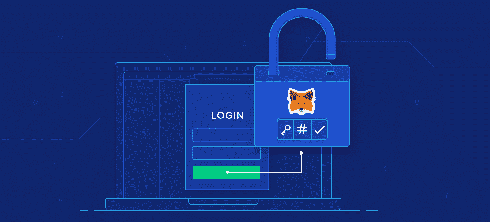

## 使用 Moralis 的 Web3 身份验证

Moralis 是最终的 Web3 开发平台。它的目标是帮助传统开发者[连接 Web2 和 Web3](https://moralis.io/web2-to-web3-bridging-web2-and-web3/) 。因此，Moralis 专注于 dapp 开发的三个关键领域—[web 3 认证](https://moralis.io/authentication/)、Web3 API 和同步链上事件。而且，因为认证 dapp 用户的需求是起点，所以我们将在这里集中讨论这一部分。

Moralis 使您能够在应用程序中轻松统一 Web3 钱包和 Web2 账户。因此，对于那些从零开始构建 dapps 的人和那些想要将 Web3 功能添加到他们现有的 Web2 应用程序的人来说，它是首选工具。此外，Moralis 认证兼容任何技术栈。当然，你也拥有和控制所有的用户数据。此外，当您使用 Moralis 处理 Web3 身份验证时，您还可以利用诸如 OpenID、OAuth、DIDs 等标准。所以，如果你是:

*   构建新的 Web3 应用程序
*   使用 Web3 身份验证连接现有的 Web2 用户数据库
*   对将身份验证聚合器用于您企业的 Web3 身份验证流感兴趣

那么你应该确保使用 Moralis！

此外，如果您以前处理过 Web3 身份验证实现，您会知道它可能相当具有挑战性。然而，当您使用 Moralis Web3 Auth API 时，您可以毫不费力地到达终点。这意味着:

*   您不需要将用户重定向到第三方身份验证界面。
*   不需要真正理解 Web3 认证流程。
*   你不必学习钱包如何签署或验证信息。
*   不需要掌握不同的钱包标准。
*   你不必去发现钱包在不同的区块链上是如何工作的。
*   无需担心认证解决方案的安全性。
*   您不必更新和维护身份验证解决方案。

实质上，Moralis 为所有 Web3 身份验证方法提供了一个统一的 API，并提供了全面的 SDK 以方便集成。

### 速度和面向未来

Moralis 的 Web3 Auth API 使您能够轻松认证 dapp 用户。基本上，它帮助你把几个月的工作变成一个简单的任务，就像复制和粘贴一行代码。因此，你可以把宝贵的时间和资源投入到真正重要的事情上。这是消除任何入职摩擦和轻松扩展的方法。

此外，由于 Moralis 跨链互操作性，您的注册流程不会局限于任何特定的链。即使你是密码领域的新手，你也知道区块链是尖端技术。它发展得很快，因此为任何变化做好准备是关键。当您使用 Moralis 的 Web3 Auth API 时，您已经为任何新的钱包、链和认证方法做好了准备。你根本不用担心。

现在您已经对什么是 Moralis 以及它的 auth 解决方案如何帮助您认证 dapp 用户有了基本的了解，让我们来看一个简单的示例项目。正如承诺的那样，让我们从一个快速演示开始，这样您就知道接下来会发生什么。

## 使用元掩码认证 Dapp 用户–演示

这是我们的简单网页:

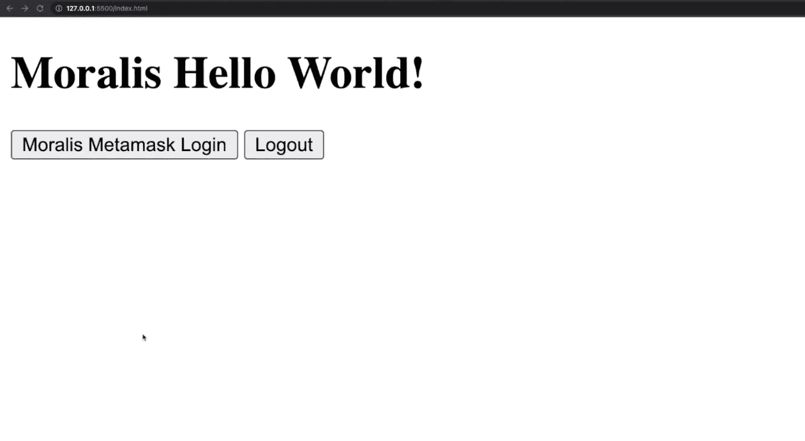

看上面的截图，你可以看到我们把事情做得超级简单。这样就不会有不必要的干扰。毕竟，目标是向您展示如何使用 MetaMask 认证 dapp 用户。当用户登陆这个页面时，他们直观地知道他们需要按下“Moralis Metamask 登录”按钮。当他们这样做时，他们的元掩码扩展会弹出以下签名请求:

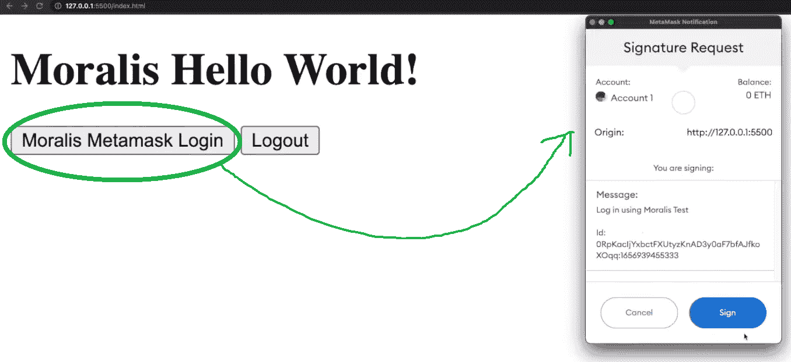

为了确认他们的登录尝试，用户需要点击他们的 MetaMask 钱包中的“Sign”按钮。通过这样做，Moralis 的 Web3 Auth API 在后端完成剩下的工作。这也意味着在签署签名请求之后，用户被认证:

如您所见，我们的示例 dapp 显示用户的钱包地址，并让他们注销。仅此而已。然而，后端日志用户登录到您的 Moralis 数据库。因此，您可以自动使用所有公开可用的链上数据来获取用户的余额、交易历史等。你看到这的力量了吗？

有了上面的演示，是时候仔细看看如何创建这样一个简单的 dapp 了。我们向您保证，这是超级容易和快速的。所以，一定要听从我们的领导，把手弄脏。它不会占用你超过十分钟的时间。而且，这可能是你做过的最棒的 10 分钟投资。

# 如何使用 Moralis 和 MetaMask 对 Dapp 用户进行身份验证–示例项目

如前所述，为了获得 Moralis 的 Web3 Auth API，您需要完成 Moralis 的初始设置。因此，请确保完成以下步骤:

1.  访问 Moralis 的主页，点击“免费开始”按钮创建您的免费帐户。另一方面，如果您已经有一个活动帐户，只需使用您的凭据登录即可:

2.  进入 Moralis 管理区域后，点击“创建新 Dapp”按钮创建一个新的 Moralis dapp:

3.  首先，您需要选择环境。对于大多数示例项目，您将使用“Testnet”；然而，今天我们将重点讨论以太坊主网。因此，选择“Mainnet”选项:

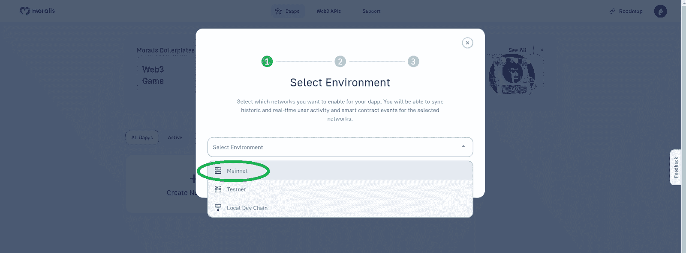

4.  Moralis 支持所有领先的链，并让您选择所有这些链。但是，正如前面提到的，我们将在这里对以太坊主网上的 dapp 用户进行身份验证。因此，确保点击“Eth Mainnet ”,然后点击“Proceed ”:

5.  就地区而言，您需要从下拉菜单中选择离您最近的城市:

6.  创建 Moralis dapp 的最后一步需要你给它命名。这可以是你想要的任何东西，但要避免过度思考这一步。输入姓名后，只需点击“创建您的 Dapp”按钮:

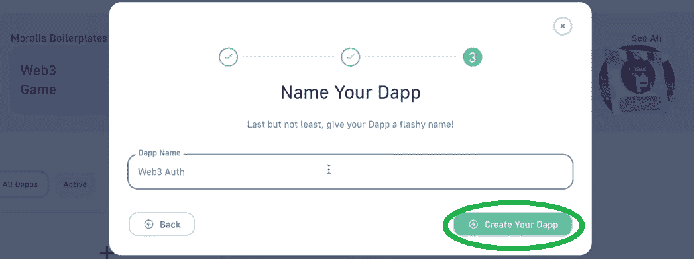

通常只需要几秒钟你的 dapp 就准备好了。随着 Moralis dapp 的启动和运行，您可以访问它的详细信息和所有功能。你只需要点击“设置”按钮:

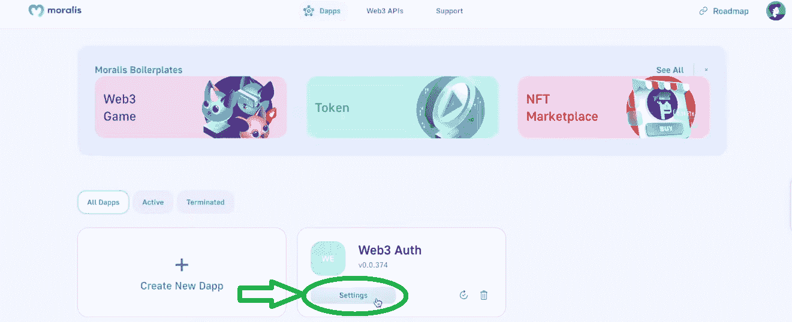

点击“设置”，您将自动进入“Dapp 详情”选项卡。您可以在这里复制您的 dapp 凭据:

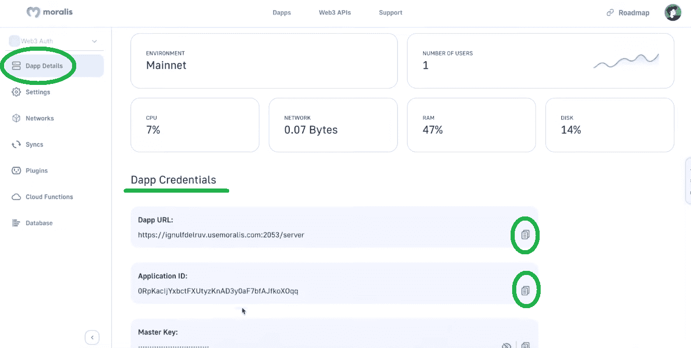

但是，在复制上述凭证之前，您需要准备好要粘贴它们的代码。

### 创建一个简单的普通 JS Dapp

首先，打开你最喜欢的 IDE。请随时跟随我们的领导，使用 Visual Studio 代码(VSC)。在 VSC 内部打开一个您将用于此项目的文件夹。我们创建了“WEB3AUTH”文件夹。然后，开始创建一个新文件，并将其命名为“index.html”:

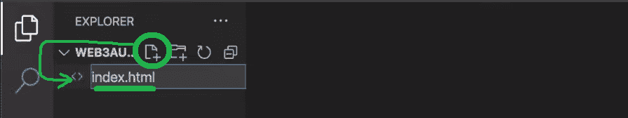

而且，正如上面承诺的，你不需要手动写代码。相反，请使用 Moralis 文档:

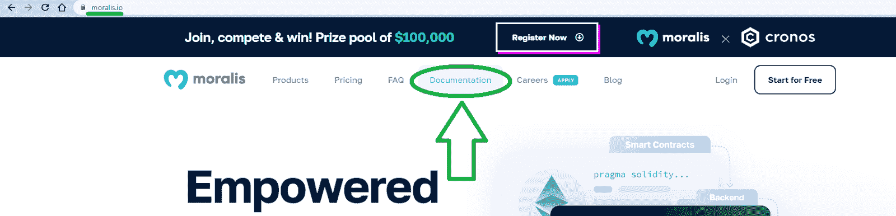

在侧边菜单中，您会看到“连接 SDK”。如果你还记得，我们说过我们将使用 Vanilla JS 来认证 dapp 用户。因此，选择“用普通 JS 连接”选项:

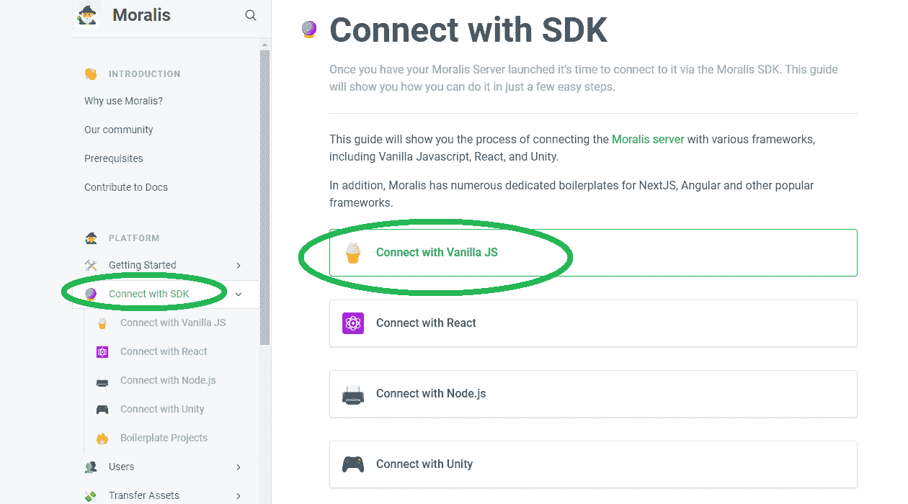

在该页面上，您将找到完成工作的代码:

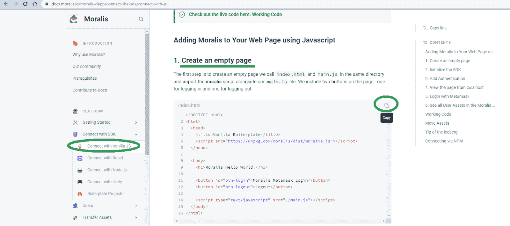

复制上述代码后，返回 VSC，并将其粘贴到“索引”文件中:

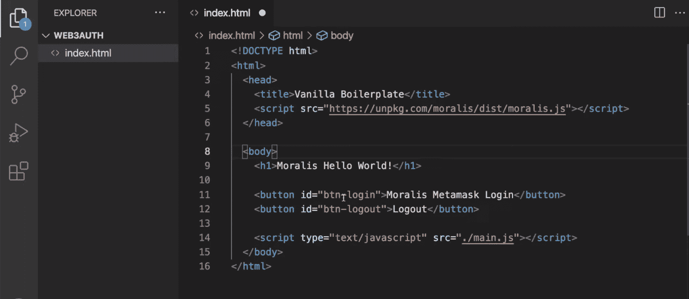

看上面几行代码，我们首先有了标题。接下来，有一个 URL，它带来了 master Moralis SDK 的最新版本。在主体内部，我们首先有“Morallis Hello World！”航向。然后，有两个按钮用于启动 Web3 登录和注销。最后，我们引入“main.js”文件，它将定义两个按钮的逻辑。因此，接下来您需要创建该文件。

## 验证 Dapp 用户的逻辑

创建“main.js”文件(不要像我们一样拼写错误):

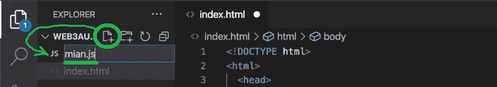

同样，您不需要自己编写代码。简单地回到我们在上面使用的文档页面，向下滚动一点。看到“添加身份验证”部分时停止，并复制代码:

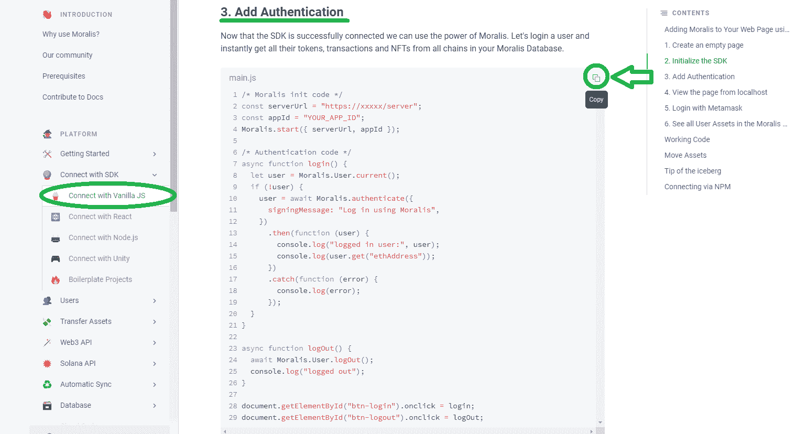

然后，返回 VSC，将代码粘贴到上面创建的“main.js”文件中。看上面的图像，你可以看到最上面的四行覆盖了 Moralis 集成。这是你需要粘贴你的 Moralis dapp 的凭据:

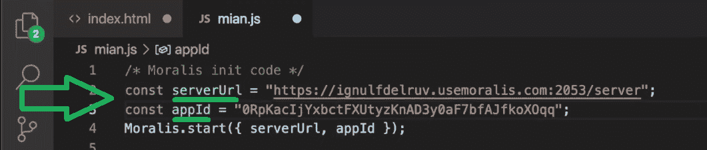

*注意* *:确保使用你的证件，而不是上图中的证件。*

有了 dapp URL 和 ID，就可以在以太坊上认证 dapp 用户了。然而，在您运行它之前，让我们带您看一下剩余的代码。

“登录”功能获取当前用户(如果他们已经登录)。然而，如果它们还没有被认证，它使用“Moralis.authenticate”。后者用“使用 Moralis 登录”签名消息触发 MetaMask。然后，代码控制台记录用户的以太坊地址。此外，代码还会在控制台记录任何错误。

再往下，我们有“logOut”函数，它获取当前用户(已登录的用户)并注销他们。它还在控制台记录“注销”消息。最后，在代码的底部，我们有两个关于“登录”和“注销”按钮的点击事件。

### 测试运行您的 Dapp

最后但同样重要的是，我们鼓励您观看下面的视频。在这篇文章中，您将有机会跟随我们的内部专家运行这个示例 dapp，并使用浏览器控制台获得更深入的见解。从 5:05 开始，您将学习如何在 VSC 添加“实时服务器”扩展。后者将使您能够在本地运行 dapp。

https://www.youtube.com/watch?v=Xuh6UWcgDjk

## 如何使用元掩码对 Dapp 用户进行身份验证—摘要

如果您已经学习了上面的章节，您现在应该知道 Moralis 是合并 Web3 身份验证的最简单的方法。由于它强大的 Web3 Auth API，您可以用一行代码来验证 dapp 用户。本质上，“Moralis.authenticate”完成了这个任务。当然，您需要首先完成初始的 Moralis 设置，在这里您可以创建您的 Moralis dapp。然后，您需要将 dapp 的凭证粘贴到代码中。更简单的是，在许多情况下，您不需要自己编写代码。相反，您可以从 Moralis 文档中复制粘贴它，这正是您完成今天的项目所做的。

现在，您已经知道如何轻松地认证 dapp 用户，您已经准备好接受更复杂的项目了。如果你对 Web3 应用有自己的想法，那就着手去做吧。但是，如果您需要一些额外的实践，尝试其他示例项目可能是一个好主意。你可以在 [Moralis 的 YouTube 频道](https://www.youtube.com/c/MoralisWeb3)和 [Moralis 的博客](https://moralis.io/blog/)上挑选。因此，您将学习如何处理智能合同事件，从而利用“同步”功能，这是 Moralis SDK 的另一个核心工具。这也是一个了解为什么[要在 Solana](https://moralis.io/why-build-on-solana-solana-development-explained/) 的基础上发展的地方。

此外，如果你正在为你的区块链发展教育寻找一种专业的方法，Moralis 学院应该在你的考虑范围之内。这是你参加顶级 Web3 开发课程的地方。此外，您还可以获得个性化的学习路径、专家指导以及最先进社区之一的会员资格。**