# 如何使用幻影钱包认证 Solana 用户

> 原文：<https://moralis.io/how-to-authenticate-solana-users-with-the-phantom-wallet/>

**如果用户想要进入 Web3 领域并与区块链交互，每个用户必须使用验证工具进行身份验证。当大多数用户** [**使用 MetaMask**](https://moralis.io/how-to-authenticate-with-metamask/) **进行身份验证时，在与以太坊 dapps(去中心化应用程序)交互时，用于验证 Solana 用户身份的头号钱包是 Phantom。** [**构建 Web3 apps**](https://moralis.io/metamask-for-developers-how-to-launch-web3-apps-with-metamask/) **时也是如此。当您决定** [**构建以太坊 dapp**](https://moralis.io/ultimate-guide-how-to-build-ethereum-dapps/)**时，您利用** [**为开发者提供元掩码**](https://moralis.io/metamask-for-developers-how-to-launch-web3-apps-with-metamask/) **，但是在创建 Solana dapps 时，您利用幻影钱包来验证用户。由于 Solana 可能是所有可编程区块链的主要竞争者，我们决定为那些想利用其网络的人提供一个简单的认证解决方案。因此，请跟随我们了解如何使用 Phantom wallet 认证 Solana 用户！**

在接下来的教程中，我们将向你展示如何使用[Moralis 规范](https://moralis.io/)来简化 Web3 开发。当使用 [Moralis 的 SDK](https://moralis.io/exploring-moralis-sdk-the-ultimate-web3-sdk/) 时，您可以节省时间和宝贵的资源。这个终极的 [Web3 后端平台](https://moralis.io/exploring-the-best-web3-backend-platform/)完全是关于跨链和跨平台的互操作性。因此，你可以使用当前 [Web3 技术栈](https://moralis.io/exploring-the-web3-tech-stack-full-guide/)的这个顶峰，用于以太坊、EVM 兼容链，甚至 Solana。此外，Moralis 允许你用你的 JavaScript 或 Unity 熟练程度成为 Web3 开发者。

在这里，我们将使用 Next.js 来[创建一个 Moralis dapp](https://docs.moralis.io/moralis-dapp/getting-started/create-a-moralis-dapp) 来验证 Solana 用户。然而，在我们深入本文的示例项目之前，让我们先了解一些基础知识。我们将首先探索 Solana 身份验证，并介绍幻影钱包的基础知识。此外，为了准备即将到来的教程，[创建你的免费 Moralis 账户](https://admin.moralis.io/register)！

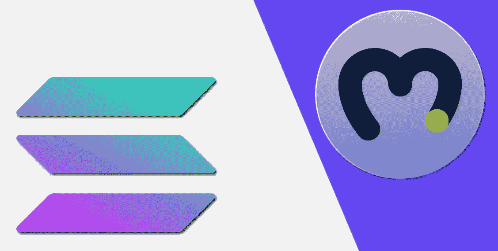

## 探索 Solana 认证

如果您是第一次接触 [Web3](https://moralis.io/the-ultimate-guide-to-web3-what-is-web3/) ，您可能会想，“为什么有必要对用户进行身份验证？”。在不深入研究区块链技术的功能的情况下，您需要知道密码学在加密领域中起着至关重要的作用。此外，需要某种网关来决定谁可以与任何特定的链进行交互。这就是用户钱包地址发挥作用的地方。

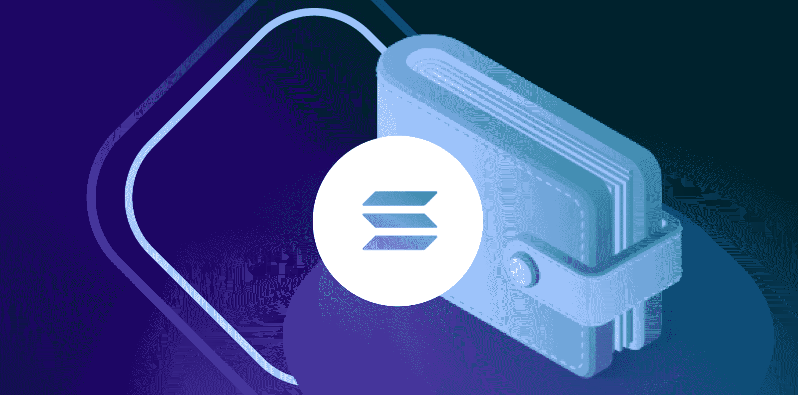

Web3 或加密钱包有多种形式，尽管主要分为两类:热钱包和冷钱包。这两种类型的钱包都存储了一组密钥，用于接收、发送和跟踪加密货币的所有权。创建新的钱包时，会安全地生成私钥和公钥的密钥对。因此，钱包提供了与这些按键交互的手段。此外，您应该知道公钥通常被称为“钱包地址”。“公共”一词意味着这些地址可以自由共享和显示。例如，当您希望某人向您发送一些 SOL 令牌时，您可以与他们共享此地址。此外，公共地址也是区块链应用用来验证用户的。因此，使用支持您想要互动的链的钱包是很重要的。

有必要指出的是，并非所有的钱包都支持所有的链。例如，你不能在 Solana 上用 MetaMask 认证[。当您想要探索 Solana 身份验证选项时，您需要查看 Solana 的生态系统。此外，当使用加密钱包为开发者认证用户时，提供浏览器扩展的钱包是正确的选择。也就是说，Phantom 是目前认证 Solana 用户最流行的工具。](https://moralis.io/how-to-authenticate-with-metamask/)


### 幻影钱包是什么？

幻影是最受欢迎的索拉纳加密钱包之一。它是存储、购买、发送和接收 SPL 代币( [SPL vs ERC20 代币](https://moralis.io/spl-vs-erc20-tokens-comparing-solana-and-ethereum-tokens/))的首选工具。因此，它也是一个用来认证 Solana 用户的工具。像 MetaMask 一样，Phantom 也可以作为移动应用程序和浏览器扩展使用。这样，用户可以选择他们喜欢的选项。然而，就开发人员而言，使用浏览器扩展选项往往是正确的选择。目前，Phantom 支持 Chrome、Brave、Firefox 和 Edge:

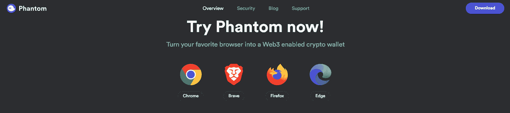

此外，这些是 Phantom 的关键方面:

*   **非托管**–Phantom 确保其背后的团队永远无法访问您的任何数据或资金。
*   **分类账支持**–为了增加安全性，Phantom 使您能够连接您的硬件(冷)钱包。
*   **隐私**–Phantom 确保它不会跟踪任何个人身份信息、用户的账户地址或资产余额。
*   **生物识别认证**-有了 Phantom，您可以在旅途中使用生物识别技术保护您的资产。

如果你有兴趣卷起你的袖子，跟随我们的领导进行即将到来的示例项目，请确保现在下载你的幻影钱包。登陆幻影官方网站( *phantom.app* )按照现场说明操作即可。

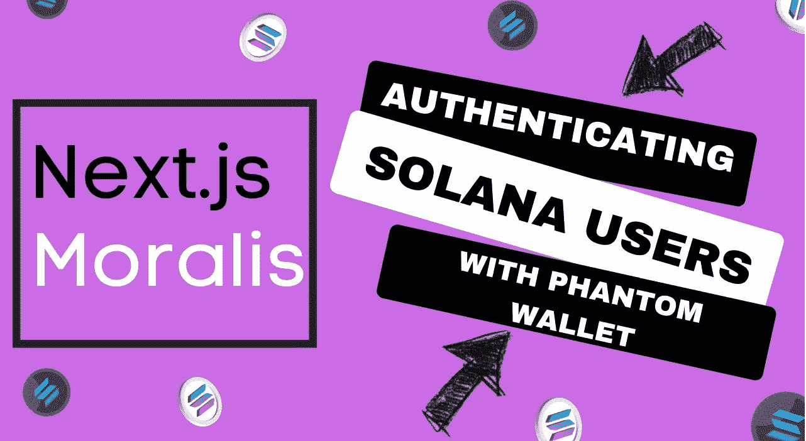

## 使用 Phantom Wallet 对 Solana 用户进行身份验证——Moralis 和 Next.js 示例项目

我们很高兴您能加入我们，参与我们的示例项目。为了最大限度地利用以下部分，我们鼓励您首先阅读内容，然后再浏览一遍，只是这一次要自己采取行动。我们将使用 Phantom、Moralis 和 Visual Studio Code (VSC)作为工具。因此，我们建议在前进之前准备好这些工具。

## 认证 Solana 用户–初始项目设置

我们将通过创建一个新的 Next.js 应用程序来开始我们的示例项目。为此，使用您的终端窗口并键入"*npx create-next-app[项目名称]* ":

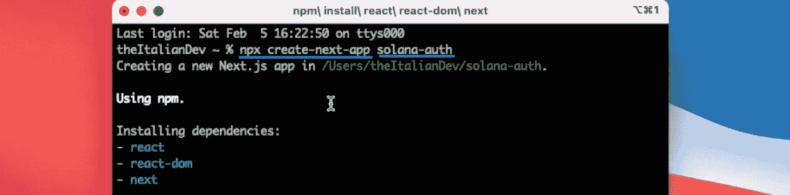

一旦安装了所有依赖项，我们就可以清除终端了。然后，我们使用“cd”导航到先前创建的文件夹(项目名称)，并在 VSC 中打开它:

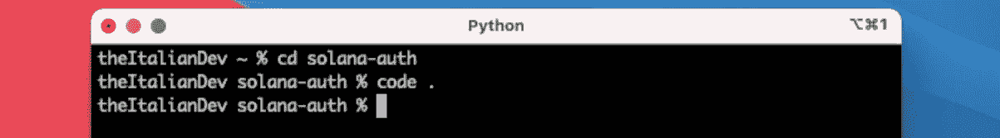

现在我们在 VSC，我们想通过删除一些我们不需要的文件和子文件夹来清理我们的项目文件夹。因此，我们继续删除“样式”和“api”(在“页面”中)文件夹。接下来，我们打开“app.js”文件并删除顶部的“import”行:

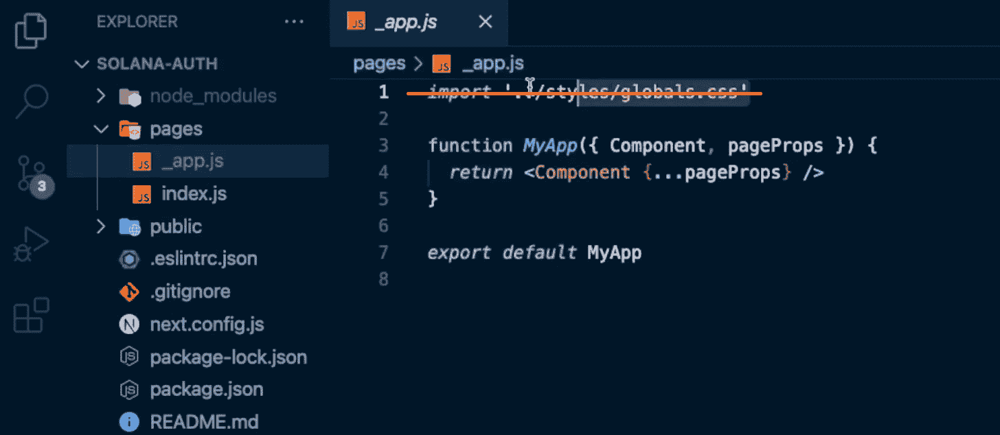

上面的截图显示了我们的项目结构在这个阶段的样子。至于“_app.js”和“index.js”文件，这是我们想要开始的内容:

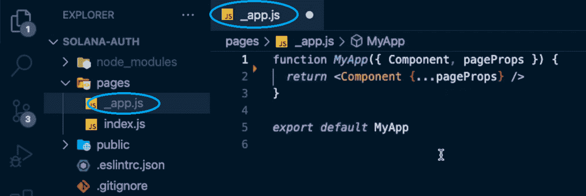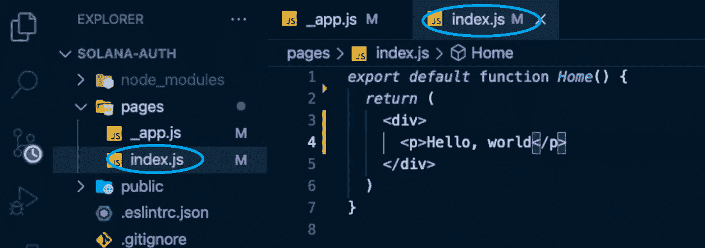

随着初始项目设置的完成，我们希望确保我们的 Next.js 应用程序能够顺利运行。因此，我们使用 VSC 的终端来运行它:

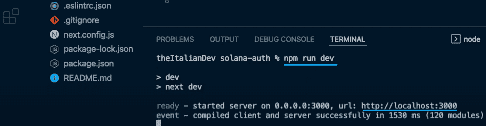

因此，我们现在可以使用我们的浏览器并粘贴到上面的 URL 来本地预览我们的应用程序:

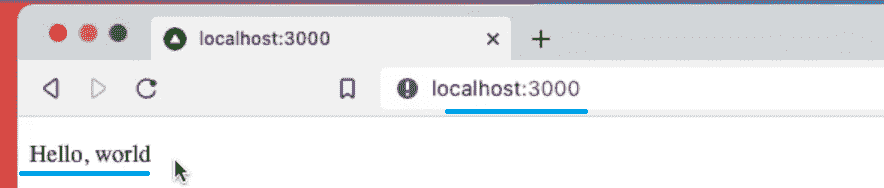

### Moralis 入门

既然我们的 Next.js 应用程序(初始形式)已经正常运行，那么是时候完成初始的 Moralis 设置了。此时，你可能已经准备好了你的免费 Moralis 账户。因此，[通过输入您的凭据登录](https://admin.moralis.io/login)到您的 Moralis 管理区:

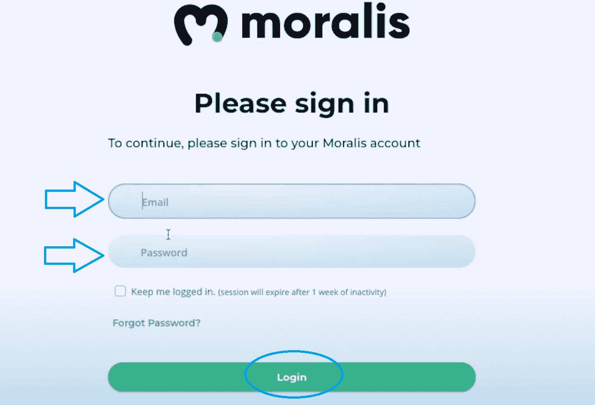

然而，如果你还没有创建你的免费 Moralis 账户，现在就创建吧。作为一名新用户，您将在您的管理区内看到此屏幕:

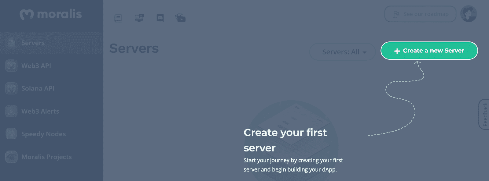

按照说明操作，点击“+创建新服务器”。从下拉菜单中，选择“Testnet 服务器”选项:

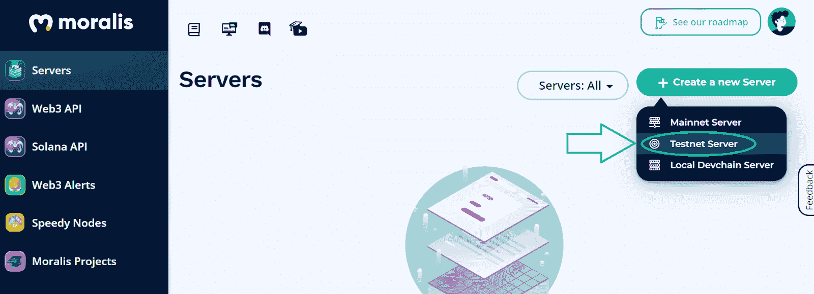

接下来，输入服务器的详细信息。该名称可以是您想要的任何名称。选择离你最近的位置，点击你喜欢的链条(我们选择 Rinkeby，以太坊测试网之一)。最后，使用“添加实例”按钮启动服务器:

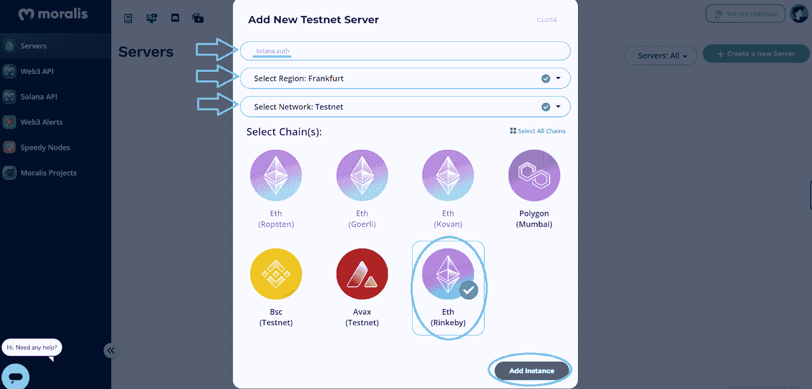

您的服务器很快就会启动并运行。然后，您可以通过“查看详细信息”按钮访问其详细信息:

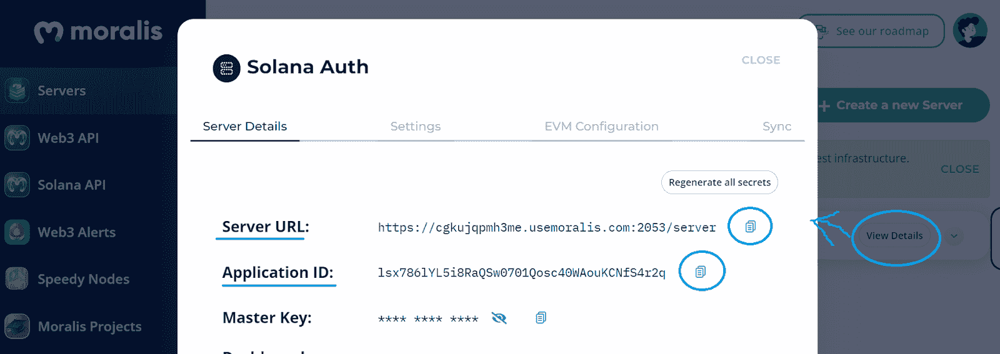

### 轻松认证 Solana 用户的关键——连接到 Moralis 的 SDK

为了将 Moralis 后端与上面创建的 Next.js 应用程序连接起来，我们必须将上面的细节粘贴到我们的代码中。但是，我们必须首先使用 VSC 的终端安装“react-moralis ”:

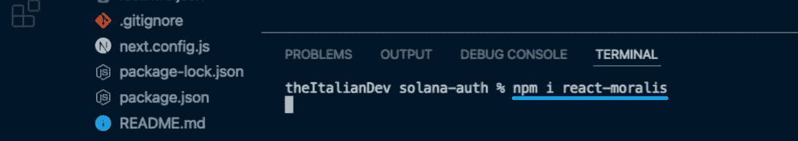

接下来，我们打开“_app.js”文件并导入上面安装的组件。我们使用代码行“react-moralis”中的“ *import {MoralisProvider}”来实现这一点:*

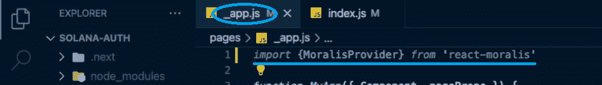

然后，我们将组件包装在“Moralis 提供者”中:

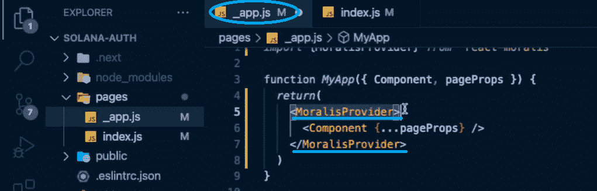

我们还必须创建“appId”和“serverURL”属性来存储服务器的详细信息。然而，我们并没有直接粘贴“_app.js”文件中的值，而是想向您展示一个更简洁的选项，它提供了更多的一致性。因此，我们创建一个新文件“. env.local”，在其中存储我们的环境变量:

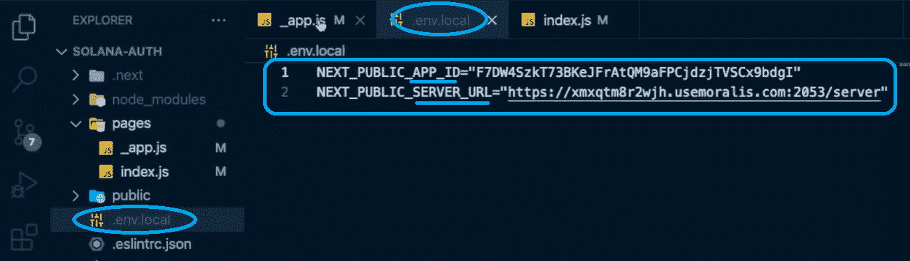

*注意:* *确保使用您服务器的详细信息，* ***而不是上图中显示的*** *。*

最后，我们必须将“appId”和“serverUrl”指向“. env.local”中的变量:

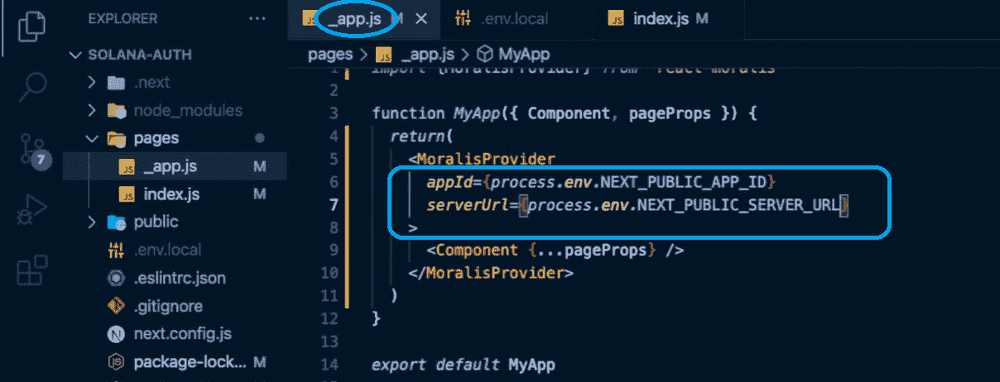

尽管如此，我们还必须使用 VSC 终端中的“npm run dev”命令将变量加载到我们的应用程序中:

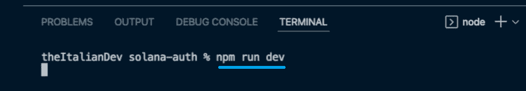

*注意* *:如果控制台返回需要安装“Web3Connector”包的警告，您可以忽略它。为了我们的教程，我们不需要这个包。*

## 认证 Solana 用户的代码

现在我们已经成功完成了初始设置，并将我们的应用程序连接到 Moralis SDK，我们可以创建我们的 dapp 了。让我们提醒您，本教程的主要目的是向您展示如何认证 Solana 用户。因此，我们将保持简单，坚持非常基本的 UI 样式。因此，为了涵盖与我们的 dapp 的 Web3 认证相关的逻辑，我们将使用“index.js”文件。

首先，我们检查任何经过身份验证的用户。幸运的是,“useMoralis”挂钩让这变得简单明了。它使我们能够使用“isAuthenticated”方法。此外，如果用户没有被认证，我们希望他们看到“认证”按钮。但是，我们希望经过身份验证的用户看到“欢迎”消息。

为了赋予“Auth”按钮验证 Solana 用户的实际权力，我们使用了 Moralis 的“authenticate”方法。我们在这个方法中使用“sol ”,通知它聚焦于 Solana。后者确保用户的 Web3 钱包在点击按钮时得到提示。

以下是我们在“index.js”文件中使用的全部代码:

```js
	import {useMoralis} from “react-moralis”

	export default function Home() {
	    const {
	        isAuthenticated,
	        authenticate
	    } = useMoralis()
	   if(!isAuthenticated) {
	        return(
	           <button onClick={() => authenticate({
	              type: “sol”
           })}>Auth</button> 
	        )
	    }
	    return (
	       <div>
	           <p>Welcome</p>
	       </div>
	    )
}
```

这几行简单的代码让我们的“Auth”按钮能够使用 Phantom wallet 对 Solana 用户进行身份验证。让我们做一个快速演示，向您展示这个功能的实际应用。

### 我们的 Dapp–预览

因此，如果我们返回到“localhost ”,我们可以测试我们的 dapp。我们首先单击“Auth”按钮，这将触发我们的虚拟扩展:

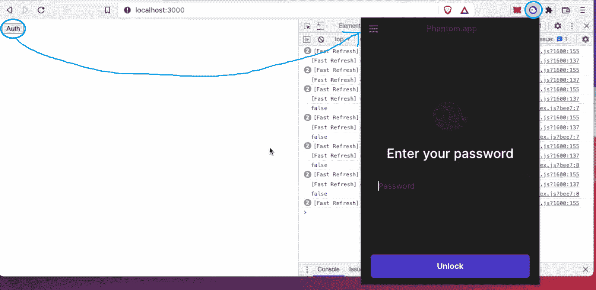

由于我们的钱包是锁着的，我们必须首先输入我们的密码，然后点击“解锁”按钮。一旦我们这样做，幻影提示我们签名请求。后者是通过我们单击“Auth”按钮启动的:

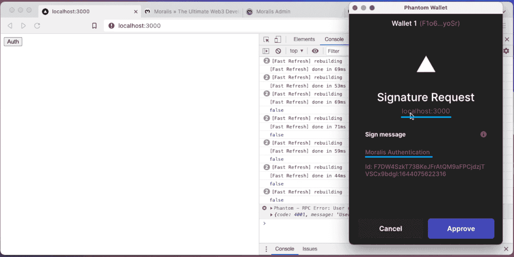

一旦我们批准了上面的签名请求，我们的示例 dapp 就会显示“欢迎”消息:

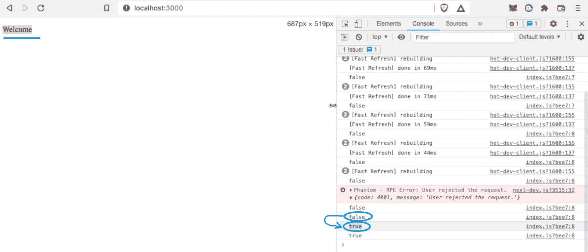

### 让 Solana 编程更进一步

如果你喜欢上面的例子项目，并想进一步发展，我们建议观看下面的视频。在那里，你将有机会看到一位 Moralis 专家承担一个更先进的项目。他将首先向你展示如何在几分钟内[创建一个索拉纳令牌](https://moralis.io/how-to-create-a-solana-token-in-5-steps/)。然后，专家将向您展示如何建立一个[索拉纳令牌仪表板](https://moralis.io/how-to-build-a-solana-token-dashboard/)。此外，如果你接下下面的例子项目，你将使用[反应](https://moralis.io/react-explained-what-is-react/)。在此过程中，您将会使用和实践从本教程中获得的技能！

https://www.youtube.com/watch?v=IsTFNOedPkk

## 如何使用 Phantom Wallet 对 Solana 用户进行身份验证–总结

今天，您已经了解了如何验证 Solana 用户身份的所有知识。你现在知道你可以通过使用幻影钱包和 Moralis 在几分钟内运行你的 Solana dapp。此外，你也有机会进一步发展你的 Solana 编程。因此，您可能已经创建了自己的 SPL 令牌和索拉纳令牌仪表板。尽管如此，您可以使用从本文中获得的知识在其他流行的链上开发杀手级 dapps。当然，如果你决定专注于以太坊或其他 EVM 兼容链，你将使用 MetaMask 而不是 Phantom。所以，如果你想探索其他的区块链发展教程，一定要访问[Moralis 的 YouTube 频道](https://www.youtube.com/c/MoralisWeb3)和[Moralis 的博客](https://moralis.io/blog/)。

除了各种示例项目，这两个出口还为您提供了各种加密主题的简单解释。因此，它们可以作为你持续的免费区块链发展教育的来源。例如，一些最新的话题包括 [Solidity smart contracts](https://moralis.io/what-are-solidity-smart-contracts-full-solidity-tutorial/) 教程、[去中心化 Twitter](https://moralis.io/2022-guide-to-building-a-decentralized-twitter/) 、使玩家能够[购买游戏内 NFTs 的 Web3 游戏](https://moralis.io/build-a-marketplace-to-buy-nfts-in-game/)、一个 [EIP 1559 示例](https://moralis.io/eip-1559-example-what-is-eip-1559/)、完整的[去中心化财务指南](https://moralis.io/what-is-defi-the-full-decentralized-finance-guide/)、如何[将游戏资产铸造成 NFTs](https://moralis.io/how-to-mint-game-assets-as-nfts/) 、建立一个[去中心化自治组织(DAO)](https://moralis.io/how-to-build-a-decentralized-autonomous-organization-dao/) 、创建[你自己的元宇宙](https://moralis.io/how-to-create-your-own-metaverse/)然而，如果你下定决心[满怀信心地成为一名区块链开发者](https://moralis.io/how-to-become-a-blockchain-developer/)，你应该考虑采取更专业的方法。因此，报名参加[Moralis 学院](https://academy.moralis.io/)可能是你正确的道路。