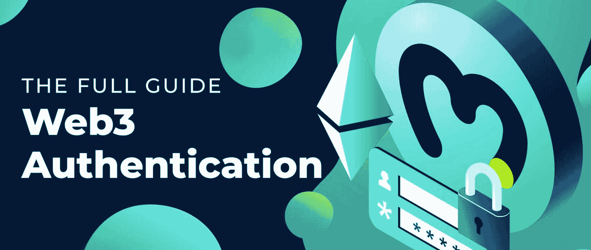
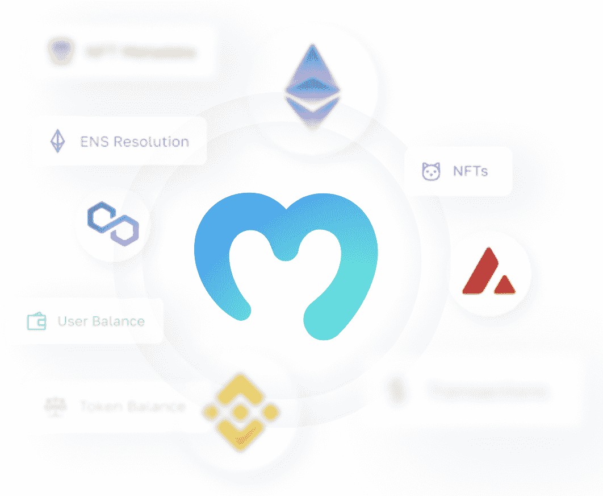
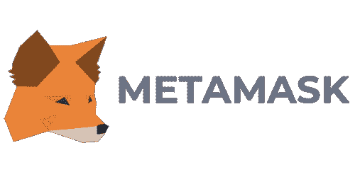

# 如何认证 Web3 用户

> 原文：<https://moralis.io/how-to-authenticate-web3-users/>

无论何时你使用 DeFi 平台或任何其他 Web3 项目，这种交互通常需要 Web3 认证。由于去中心化 web 上的大部分交互都涉及到 Web3 认证，所以这对于 [**Web3 开发**](https://moralis.io/how-to-build-decentralized-apps-dapps-quickly-and-easily/) **也是必不可少的。如果您未能成功实现一种平滑的方式来验证自己，例如使用** [**Web3 钱包**](https://moralis.io/what-is-a-web3-wallet-web3-wallets-explained/) **，您的**[**dapps**](https://moralis.io/decentralized-applications-explained-what-are-dapps/)**很可能会失败。作为区块链开发的一个重要部分，我们将通过这篇文章来说明如何用 Moralis 认证 Web3 用户！**

使用 [Moralis](https://moralis.io/) 让你更容易认证你的 Web3 用户，这要感谢 Moralis 的认证 API。该 API 为各种 Web3 身份验证方法提供了一个整合的过程，允许您在构建 dapps 时轻松集成 MetaMask 或 WalletConnect 等选项。更重要的是，Moralis 提供了广泛的 SDK，使得认证 Web3 用户的集成更容易实现。然而，我们将在另一节中进一步探索 Moralis 的 Web3 auth API 的复杂性。

除了认证 Web3 用户的综合 API，Moralis 还提供了一组额外的 API。例如，如果你想构建 NFT(不可替换的令牌)，你应该看看 Moralis 的 [NFT API](https://moralis.io/nft-api/) 。这将允许您轻松创建 NFT，并将大量与 NFT 相关的功能集成到您的项目中。

此外，如果你想成为一名区块链开发者，并学习为几个不同的链创建 dapps，Moralis 的 Web3 API 将是一个重要的效率助推器。以以太坊开发为例。有了 Moralis [以太坊 dapp API](https://moralis.io/what-is-an-ethereum-dapp-api-build-ethereum-dapps-easily/) ，你可以大大减少开发时间，降低成本。因此，这个工具将允许你轻松地[创建一个以太坊 dapp](https://moralis.io/how-to-create-an-ethereum-dapp-instantly/) ！

如果你想创建一个 dapp，现在就和 Moralis 签约，学习如何轻松认证 Web3 用户！

## 什么是 Web3 认证？

在探索如何用 Moralis 认证 Web3 用户的复杂性之前，我们将快速分析一下它实际需要什么。乍一看，Web3 认证似乎相对复杂。然而，它真的不是，它基本上只是一种登录机制。



传统的 Web2 认证实践——正如你最熟悉的——网站使用电子邮件地址和密码来认证用户。另一方面，在 Web3 中，dapps 利用用户的 Web3 钱包地址。不幸的是，由于密码术确保了区块链的安全，对 Web3 用户的认证可能会更加复杂。手动登录用户可能会有问题，并提供糟糕的 UX(用户体验)。

幸运的是，这就是 web3 钱包的用武之地——因为它们也可以作为认证工具。因此，像 MetaMask 这样的钱包不仅仅是存储加密货币的东西；它是与 Web3 交互的必备工具。这意味着加密钱包大大有助于认证用户的过程。然而，从传统的角度来看，对 Web3 用户进行身份验证似乎仍然具有挑战性，即使使用钱包也是如此。

在过去，开发人员被要求在 RPC 节点上构建这个功能，正如大多数开发人员可以告诉你的，这是一个麻烦的任务。为了更好地理解这一点，你可以在 Moralis 阅读更多关于 RPC 节点的限制。

幸运的是，由于 Moralis 的 Web3 auth API，我们可以避免从头开始创建这种功能的麻烦。该 API 允许我们轻松地对 web 和移动用户进行身份验证。本质上所需要的只是一行代码。然而，我们将在另一节中更深入地研究 API！

### 为什么 Web3 认证很重要？

对什么是 Web3 身份验证有了更深刻的理解后，我们可以探究为什么 Web3 身份验证是必不可少的。正如我们之前在文章介绍中提到的，大多数 Web3 网页或 dapps 为用户提供了一种与特定区块链互动的方式。出于这个原因，用户必须可以选择以安全的方式这样做。


通过 Web3 身份验证，我们可以让用户连接到他们想要的网络。一旦有人通过身份验证，他们就有可能与网络上已经通过身份验证的其他用户进行交互。因此，所有的 dapps 都必须具备这个功能来认证 Web3 用户。

此外，如前一节所述，这些身份验证机制是通过 Web3 钱包实现的。相比之下，Web2 认证是通过电子邮件和密码进行的，但这在去中心化的 Web 上没有意义。因此，使用 Web3 wallet 的 Web3 身份验证对于保证私钥对的安全至关重要。这表明对 Web3 用户进行身份验证有助于各种区块链的安全性。

现在，随着对认证 Web3 用户的重要性有了更好的理解，我们可以继续探索 Moralis 的认证 API 了！

### 什么是 Moralis 的 Web3 Auth API？

从传统的角度来看，建立认证 Web3 用户的基础设施相对比较麻烦。然而，当使用 Moralis 的 Web3 认证 API 时，Web3 认证变得很容易。


无论您是希望从头构建一个新的 Web3 dapp，还是希望将 Web3 身份验证连接到现有的 Web2 数据库，或者希望将身份验证聚合器用于您企业的 [Web3 身份验证](https://moralis.io/authentication/)流程，都没有关系；该 API 将在所有这些场景中为您提供帮助。

当使用 Moralis 的 Web3 身份验证 API 时，您可以避免解决 Web3 身份验证的麻烦。例如，您不需要将用户重定向到额外的第三方认证接口，不需要了解 Web3 认证流程，不需要了解钱包如何验证和签署消息，等等。相反，你可以把这些任务留给 Moralis，把你的注意力放在开发过程的其他地方。

Moralis 为所有身份验证方法提供了一个 API，提供了全面的 SDK，并兼容一些身份验证聚合器，如 Auth0。此外，随着 Web3 行业持续快速发展，新的钱包、链和验证 Web3 用户的方法不断涌现。因此，在使用 Moralis 时，您要确保您的身份验证流程是面向未来的。

通过利用 Moralis 的 Web3 认证 API，您可以增强您的认证能力。该 API 结合了传统 Web2 开发的易用性和可访问性以及 Web3 技术的功能。因此，这将为您的用户提供最安全、最简单的身份验证方式。

因此，API 将允许您更快地扩展，以便您可以专注于真正重要的事情，并为您的客户带来价值。因此，举例来说，你可以专注于[使用 Moralis 的](https://moralis.io/web3-ui-how-to-create-a-great-dapp-ui/) [web3uikit](https://moralis.io/web3ui-kit-the-ultimate-web3-user-interface-kit/) 为你的所有项目创建一个出色的 dapp UI ！

## 使用 Moralis 的 Web3 验证 API 验证 Web3 用户

很明显，Moralis 的 Web3 Auth API 对您的开发工作很有帮助。然而，在这一节中，我们将更深入地探讨如何认证 Web3 用户。因此，我们将探讨如何使用 MetaMask、WalletConnect、Phantom 等各种替代方法来认证用户。



使用 Moralis 时，只需一行代码就可以对用户进行身份验证。因此，您只需要下面的代码片段:

*moralis.authenticate()*

一旦用户通过身份验证，所有资产、[NFT](https://moralis.io/non-fungible-tokens-explained-what-are-nfts/)和令牌就会自动同步到您的数据库。此外，所有这些资产都是实时更新的，这意味着一旦在网络上进行交易，您就可以访问最相关的[在线数据](https://moralis.io/on-chain-data-the-ultimate-guide-to-understanding-and-accessing-on-chain-data/)。

### 如何认证 Web3 用户—元掩码

使用 Moralis 时，认证的默认选项是[元掩码](https://moralis.io/metamask-explained-what-is-metamask/)。因此，要使用这个选项进行身份验证，您只需要上面的代码片段。这将连接用户的元掩码，并需要快速签名。更重要的是，用户不需要为这个动作支付任何燃气费。这个选项对所有 [EVM](https://moralis.io/evm-explained-what-is-ethereum-virtual-machine/) 兼容的(以太坊虚拟机)区块链都一样，像 Polygon 或币安，因为它们共享相同的以太坊地址。



此外，如果你想了解更多关于如何使用 MetaMask 认证 Web3 用户的信息，请查看 Moralis 的官方文档。

### 如何认证 Web3 用户— WalletConnect

另一种选择是利用 WalletConnect，让用户通过二维码、桌面钱包或移动钱包进行连接。然而，这比选择使用 MetaMask 要复杂一些。


您需要做的第一件事是通过以下脚本添加 WalletConnect 提供程序:

```js
<script src=”https://github.com/WalletConnect/walletconnect-monorepo/releases/download/1.7.1/web3-provider.min.js"></script>
```

一旦添加了提供程序，您就可以调用之前的相同基本函数，包括一个提供程序选项。它看起来会像这样:

```js
const user = await Moralis.authenticate({ provider: "walletconnect" })
```

此外，您还可以指定 WalletConnect 默认使用的链 id。您需要做的只是提供“chainId”:

```js
const user = await Moralis.authenticate({ provider: "walletconnect", chainId: 56 })
```

此外，您还有其他选项，如过滤移动链接选项。如果你想了解这方面的更多信息，请查阅 Moralis 文件。

### 如何认证 Web3 用户—幻影钱包

我们要深入了解的最后一个选项是，您的用户是否安装了虚拟钱包。Phantom 集成非常简单，允许您为 Solana 网络创建复杂的 dapps。因此，如果您想通过 Phantom 对用户进行身份验证，您只需指定“类型”,函数如下所示:

```js
Moralis.authenticate({type: ”sol"})
```

不幸的是，索拉纳集成仍在开发中。因此，Solana 用户还不会将他们的过渡同步到他们的数据库中。


如果你想了解更多关于完整的 Web3 认证过程，请查看官方的 Web3 认证文档。

此外，如果你想了解更多关于创建索拉纳 dapp，我们有一个很好的指南，让你[在 3 个步骤](https://moralis.io/how-to-build-a-solana-dapp-in-3-steps/)建立一个索拉纳 dapp！此外，你还可以额外了解更多关于[索拉纳编程](https://moralis.io/solana-programming-the-ultimate-guide-to-solana-development/)的信息，或者得到一个关于为什么[应该在索拉纳](https://moralis.io/why-build-on-solana-solana-development-explained/)上构建的解释。Moralis 提供的可访问性源自 Moralis 的 [Solana API](https://docs.moralis.io/moralis-dapp/solana-api) ，允许您轻松创建各种 Solana 项目。

此外，你不仅可以构建 Solana dapps，而且 Moralis 的 Solana [NFT API](https://docs.moralis.io/moralis-dapp/solana-api/nft) 允许你为 Solana 网络创建 NFT。这个 API 使得 NFT 的开发更加容易，除了别的以外，[可以毫无困难地获得索拉纳·NFT 的元数据](https://moralis.io/how-to-get-solana-nft-metadata/)。

如果你对 NFT 市场感兴趣，看看下面这篇关于 NFT 赌博的文章，让你从你的资产中赚取利息！

所以，如果你想成为一名 Solana 开发者，现在就注册 Moralis 吧！

## 如何认证 Web3 用户—摘要

所有 Web3 dapps、平台和其他 [DeFi](https://moralis.io/what-is-defi-the-full-decentralized-finance-guide/) 项目通常要求用户使用 Web3 钱包进行身份验证。作为 Web3 基础设施的重要组成部分，我们通过这篇文章深入探讨了如何认证 Web3 用户。在此过程中，我们花时间探索了什么是 Web3 身份验证，为什么它很重要，以及如何使用 Moralis 对 Web3 用户进行身份验证。

乍一看，如果你不是一个有经验的 Web3 开发人员，Web3 认证似乎是一个令人生畏的概念。然而，它实际上不是，它本质上是一种登录机制。从传统的角度来看，对用户进行身份验证非常具有挑战性，因为开发人员必须建立完整的基础设施来完成这一任务。

这就是 Moralis，更具体地说是 Moralis 的 Web3 Auth API，参与进来使这个过程更容易理解的地方。事实上，在使用 Moralis 时，您可以只使用一小段代码来验证 Web3 用户。更重要的是，您有几个像 MetaMask 和 WalletConnect 这样的选项可供选择。尽管 MetaMask 是默认选项，但要使用另一个选项，您只需做一些调整。

然而，这只是 Moralis 大放异彩的众多领域之一。例如，您可以额外了解更多关于 [Web3 同步](https://moralis.io/web3-syncing-how-to-sync-smart-contract-web3-events/)和 [Web3 webhooks](https://moralis.io/web3-webhooks-the-ultimate-guide-to-blockchain-webhooks/) 的信息，为您提供更加无缝的开发体验。因此，您可以创建令人惊叹的 dapps 和 Web3 项目。例如，你可以进入元宇宙开发，因为 Moralis 的[元宇宙 SDK](https://moralis.io/metaverse/) 允许你创建复杂的项目，甚至[创建你自己的元宇宙](https://moralis.io/how-to-create-your-own-metaverse/)！

所以，如果你想开发 dapps 并轻松认证 Web3 用户，[注册 Moralis](https://admin.moralis.io/register) 并成为一名更熟练的 Web3 开发者吧！